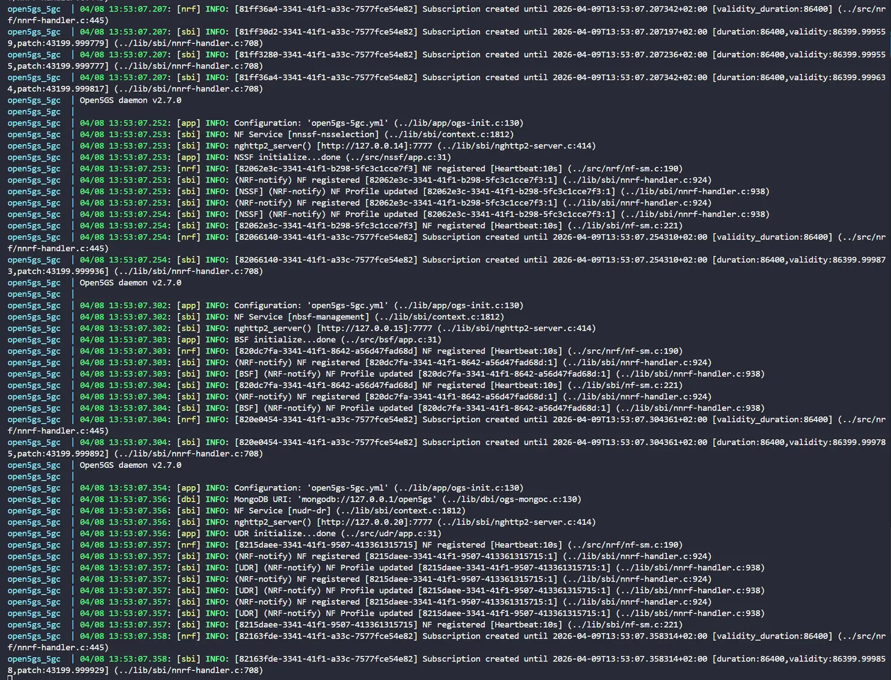
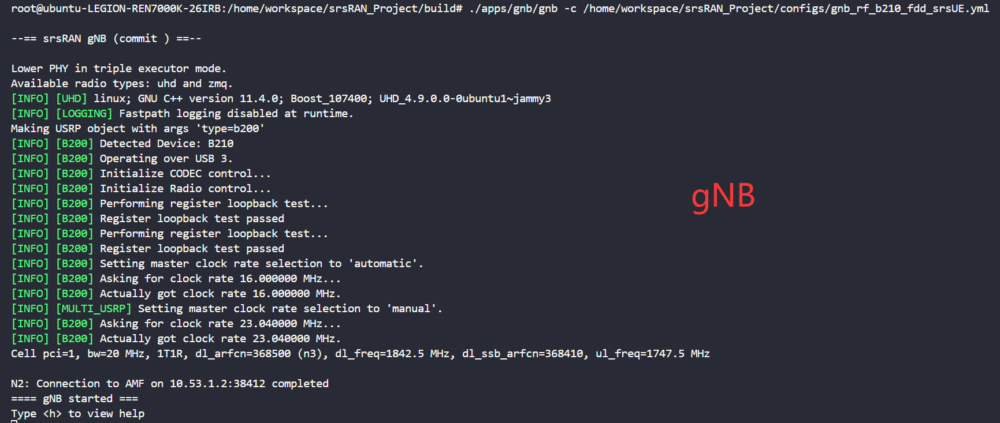
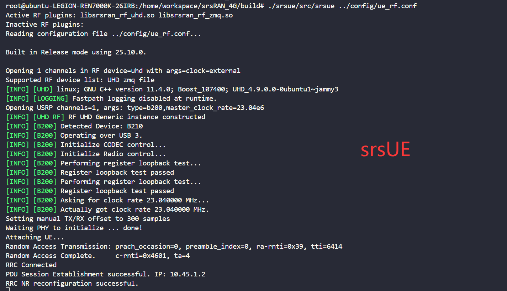
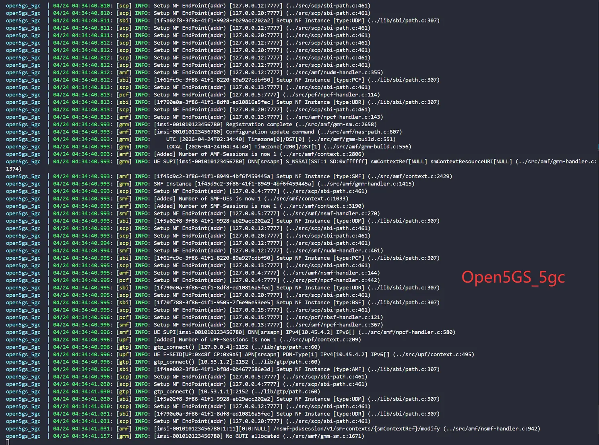
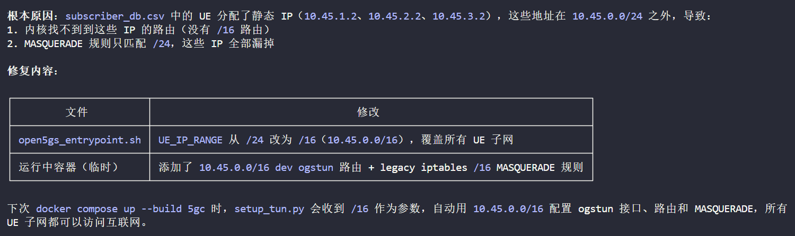
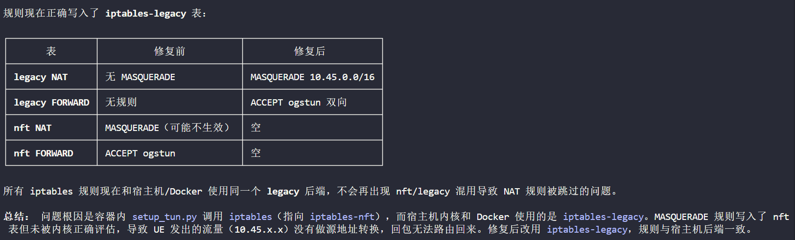

# 使用 USRP 设备搭建 5G-NR 基站

**记录一下如何使用 USRP 设备搭建 5G-NR 基站**
<!--more-->

本文使用的软硬件环境如下：

> CPU: Intel i7-14700KF (28) @ 5.500GHz
> 
> USRP: B210
> 
> OS: Ubuntu 20.04.6 LTS x86_64
> 
> UHD: UHD 4.8.0.0

参考链接：

https://docs.srsran.com/projects/project/en/latest/tutorials/source/srsUE/source/index.html

https://docs.srsran.com/projects/project/en/latest/tutorials/source/cotsUE/source/index.html


## 方法一：基于srsRAN_Project搭建核心网和基站

> srsRAN_Project中自带了一个Docker一键启动Open5GS的脚本
> 
> 这里启动Open5GS的时候会自动通过open5gs_entrypoint.sh调用setup_tun.py配置ogstun网卡进行流量转发
> 
> 从而让UE能够正常访问互联网，但是srsRAN_Project原本的逻辑写的有点问题，详细可以参考常见问题

首先去clone一下官方的srsRAN_Proejct项目:

```bash
git clone https://github.com/srsran/srsran_project
```

### 配置Open5GS核心网

**open5gs.env**

```yaml
MONGODB_IP=127.0.0.1
OPEN5GS_IP=10.53.1.2
UE_IP_BASE=10.45.0
UPF_ADVERTISE_IP=10.53.1.2
DEBUG=false

# 单用户的情况
# SUBSCRIBER_DB=001010123456780,00112233445566778899aabbccddeeff,opc,63bfa50ee6523365ff14c1f45f88737d,8000,9,10.45.1.2

# 多用户的情况
SUBSCRIBER_DB=subscriber_db.csv

NETWORK_NAME_FULL=srsRAN
NETWORK_NAME_SHORT=srsRAN

# Timezone - this setting will also be conveyed by Open5GS towards UE via "configuration update command"; comment for UTC
TZ=Europe/Madrid
```

**subscriber_db.csv：**

```csv
# .csv to store UE's information in HSS
# Kept in the following format: "Name,IMSI,Key,OP_Type,OP/OPc,AMF,QCI,IP_alloc"
#
# Name:     Human readable name to help distinguish UE's. Ignored by the HSS
# IMSI:     UE's IMSI value
# Key:      UE's key, where other keys are derived from. Stored in hexadecimal
# OP_Type:  Operator's code type, either OP or OPc
# OP/OPc:   Operator Code/Cyphered Operator Code, stored in hexadecimal
# AMF:      Authentication management field, stored in hexadecimal
# QCI:      QoS Class Identifier for the UE's default bearer.
# IP_alloc: Statically assigned IP for the UE.
#
# Note: Lines starting by '#' are ignored and will be overwritten
# List of UEs with IMSI, and key increasing by one for each new UE. Useful for testing with AmariUE simulator and ue_count option
ue01,001012345678901,00112233445566778899aabbccddeeff,op,00112233445566778899aabbccddeeff,9001,9,10.45.1.2
ue02,001012345678902,00112233445566778899aabbccddeeff,op,00112233445566778899aabbccddeeff,9001,9,10.45.2.2
ue03,001010123456791,00112233445566778899aabbccddef01,opc,63bfa50ee6523365ff14c1f45f88737d,9001,9,10.45.3.2
```

### 配置gNB和srsUE

参考官方文档中编辑gNB和srsUE的配置文件：

[https://docs.srsran.com/projects/project/en/latest/tutorials/source/srsUE/source/index.html](https://docs.srsran.com/projects/project/en/latest/tutorials/source/srsUE/source/index.html)

**gnb_rf_b210_fdd_srsUE.yml**

```yaml
# This example configuration outlines how to configure the srsRAN Project gNB to create a single FDD cell
# transmitting in band 3, with 20 MHz bandwidth and 15 kHz sub-carrier-spacing. A USRP B200 is configured
# as the RF frontend using split 8, with a Leo Bodnar GPSDO as an external reference clock.

# This particular configuration is intended to be used with srsUE. Note the `pdcch` parameters set in the
# `cell_cfg` section. These are set to match the capabilities of srsUE.

cu_cp:
  amf:
    addr: 10.53.1.2
    port: 38412
    bind_addr: 10.53.1.1
    supported_tracking_areas:
      - tac: 7
        plmn_list:
          - plmn: "00101"
            tai_slice_support_list:
              - sst: 1
  inactivity_timer: 7200

ru_sdr:
  device_driver: uhd
  device_args: type=b200
  clock: external
  srate: 23.04
  tx_gain: 75
  rx_gain: 75

cell_cfg:
  dl_arfcn: 368500
  band: 3
  channel_bandwidth_MHz: 20
  common_scs: 15
  plmn: "00101"
  tac: 7
  pdcch:
    dedicated:
      ss2_type: common
      dci_format_0_1_and_1_1: false
    common:
      ss0_index: 0
      coreset0_index: 12
  prach:
    prach_config_index: 1
  pdsch:
    mcs_table: qam64
  pusch:
    mcs_table: qam64

log:
  filename: /tmp/gnb.log
  all_level: info

pcap:
  mac_enable: enable
  mac_filename: /tmp/gnb_mac.pcap
  ngap_enable: enable
  ngap_filename: /tmp/gnb_ngap.pcap
```

**ue_rf.conf**

```yaml
[rf]
freq_offset = 0
tx_gain = 50
rx_gain = 40
srate = 23.04e6
nof_antennas = 1

device_name = uhd
device_args = clock=external
time_adv_nsamples = 300

[rat.eutra]
dl_earfcn = 2850
nof_carriers = 0

[rat.nr]
bands = 3
nof_carriers = 1
max_nof_prb = 106
nof_prb = 106

[pcap]
enable = none
mac_filename = /tmp/ue_mac.pcap
mac_nr_filename = /tmp/ue_mac_nr.pcap
nas_filename = /tmp/ue_nas.pcap

[log]
all_level = info
phy_lib_level = none
all_hex_limit = 32
filename = /tmp/ue.log
file_max_size = -1

[usim]
mode = soft
algo = milenage
opc  = 63BFA50EE6523365FF14C1F45F88737D
k    = 00112233445566778899aabbccddeeff
imsi = 001010123456780
imei = 353490069873319

[rrc]
release = 15
ue_category = 4

[nas]
apn = srsapn
apn_protocol = ipv4

[gw]
#netns = ue1
#ip_devname = tun_srsue
#ip_netmask = 255.255.255.0

[gui]
enable = false
```

### 启动核心网和基站

我这里是使用Docker来进行部署，Dockerfile和docker-compose.yml可以参考下面我写的

**Dockerfile**

```dockerfile
FROM ubuntu:22.04

ENV DEBIAN_FRONTEND=noninteractive \
    TZ=Asia/Shanghai \
    LANG=C.UTF-8 \
    LC_ALL=C.UTF-8 \
    UHD_IMAGES_DIR=/usr/share/uhd/images

# 使用 USTC 镜像源
RUN sed -i \
    -e 's|http://archive.ubuntu.com/ubuntu/|http://mirrors.ustc.edu.cn/ubuntu/|g' \
    -e 's|http://security.ubuntu.com/ubuntu/|http://mirrors.ustc.edu.cn/ubuntu/|g' \
    /etc/apt/sources.list

# 安装依赖
RUN apt-get update && apt-get install -y --no-install-recommends \
    build-essential ccache cmake doxygen git ninja-build pkg-config \
    ca-certificates curl gnupg lsb-release software-properties-common \
    libfftw3-dev libboost-dev libboost-system-dev \
    libboost-filesystem-dev libboost-thread-dev \
    libboost-program-options-dev \
    libmbedtls-dev libsctp-dev \
    libconfig-dev libconfig++-dev \
    rapidjson-dev libyaml-cpp-dev libzmq3-dev \
    libdw-dev binutils-dev libdwarf-dev libelf-dev libnuma-dev \
    iproute2 iputils-ping net-tools usbutils \
 && rm -rf /var/lib/apt/lists/*

# 编译安装 UHD 4.8.0.0
RUN git clone --depth 1 --branch v4.8.0.0 \
      https://github.com/EttusResearch/uhd.git /tmp/uhd \
 && cmake -S /tmp/uhd/host -B /tmp/uhd/build \
      -G Ninja \
      -DCMAKE_INSTALL_PREFIX=/usr \
      -DCMAKE_BUILD_TYPE=Release \
      -DENABLE_TESTS=OFF \
      -DENABLE_EXAMPLES=ON \
      -DENABLE_MANUAL=OFF \
      -DENABLE_DOXYGEN=OFF \
 && cmake --build /tmp/uhd/build -j"$(nproc)" \
 && cmake --install /tmp/uhd/build \
 && ldconfig \
 && uhd_images_downloader \
 && rm -rf /tmp/uhd

WORKDIR /home/workspace

CMD ["/bin/bash"]
```

**docker-compose.yml**

```yaml
services:
  srsran_project:
    build:
      context: .
    container_name: srsran_project
    privileged: true
    network_mode: host
    working_dir: /home/workspace
    devices:
      - /dev/bus/usb:/dev/bus/usb
    volumes:
      - .:/home/workspace
      - /dev/bus/usb:/dev/bus/usb
      - uhd_images:/usr/share/uhd/images
    environment:
      UHD_IMAGES_DIR: /usr/share/uhd/images
      X310_INTERFACE: enp4s0
    stdin_open: true
    tty: true
    cap_add:
      - SYS_PTRACE
      - NET_ADMIN
      - SYS_ADMIN

volumes:
  uhd_images:
```

把以上两个文件放到srsRAN_Project目录中，然后运行一下命令构建镜像并启动容器

```bash
# --build参数会默认重新构建
docker compose up -d
```

然后启动Open5GS核心网

```bash
# 如果配置文件有修改的话，要加上 --build 参数重新构建镜像
docker compose up --build 5gc
```

Open5GS启动成功后终端输出如下：



核心网正常启动后我们尝试启动基站

```bash
# 编译并启动gNB
cd srsRAN_Project
mkdir build && cd build
cmake .. && make -j $(nproc)
# 启动N3频段FDD的gNB
./apps/gnb/gnb -c /home/workspace/srsRAN_Project/configs/gnb_rf_b210_fdd_srsUE.yml
# 启动N3频段FDD的gNB 
./apps/gnb/gnb -c /home/workspace/srsRAN_Project/configs/Sni5gect/base_station/srsran-n3-20MHz.yml
# 启动N41频段TDD的gNB 
./apps/gnb/gnb -c /home/workspace/srsRAN_Project/configs/Sni5gect/base_station/srsran-n41-20MHz.yml
# 启动N78频段TDD的gNB
./apps/gnb/gnb -c /home/workspace/srsRAN_Project/configs/gnb_b210_tdd_n78_20MHz_oneplus_8t.yml

# 编译并启动srsUE（可选）
cd srsRAN_4G/
mkdir build && cd build
cmake .. && make -j $(nproc)
./srsue/src/srsue ../config/ue_rf.conf
```

启动成功后终端输出如下：可以看到RRC连接成功建立了

|  |  |
| :-----------------------------------: | :-----------------------------------: |


|  |
| :-----------------------------------: |

如果需要使用商用UE连接到自建基站并正常访问互联网，gNB可以参考下面这个配置

**gnb_b210_tdd_n78_20MHz_oneplus_8t.yml：**

```yaml
# This configuration file example shows how to configure the srsRAN Project gNB to connect to a COTS UE. As with the 
# associated tutorial, this config has been tested with a OnePlus 8T. A B210 USRP is used as the RF-frontend.   
# This config creates a TDD cell with 20 MHz bandwidth in band 78. 
# To run the srsRAN Project gNB with this config, use the following command: 
#   sudo ./gnb -c gnb_b210_20MHz_oneplus_8t.yaml

cu_cp:
  amf:
    addr: 10.53.1.2                                             # Docker Open5GS AMF IP on docker_ran.
    bind_addr: 10.53.1.1                                        # Host-side bridge IP that reaches docker_ran from the dev container.
    supported_tracking_areas:                                   # Configure the TA associated with the CU-CP
      - tac: 7                        
        plmn_list:
          - plmn: "00101"
            tai_slice_support_list:
              - sst: 1

ru_sdr:
  device_driver: uhd                                            # The RF driver name.
  device_args: type=b200,num_recv_frames=64,num_send_frames=64  # Optionally pass arguments to the selected RF driver.
  clock: external                                               # Specify the clock source used by the RF. NOTE: Set to internal if NOT using an external 10 MHz reference clock.
  srate: 23.04                                                  # RF sample rate might need to be adjusted according to selected bandwidth.
  otw_format: sc12
  tx_gain: 80                                                   # Transmit gain of the RF might need to adjusted to the given situation.
  rx_gain: 40                                                   # Receive gain of the RF might need to adjusted to the given situation.

cell_cfg:
  dl_arfcn: 627340                                              # ARFCN of the downlink carrier (center frequency).
  band: 78                                                      # The NR band.
  channel_bandwidth_MHz: 20                                     # Bandwith in MHz. Number of PRBs will be automatically derived.
  common_scs: 30                                                # Subcarrier spacing in kHz used for data.
  plmn: "00101"                                                 # Must match the PLMN currently configured in dockerized Open5GS.
  tac: 7                                                        # Tracking area code (needs to match the core configuration).
  pci: 1                                                        # Physical cell ID.

pcap:
  mac_enable: true                                             # Set to true to enable MAC-layer PCAPs.
  mac_filename: ../logs/gnb_mac.pcap                               # Path where the MAC PCAP is stored.
  ngap_enable: true                                            # Set to true to enable NGAP PCAPs.
  ngap_filename: ../logs/gnb_ngap.pcap                             # Path where the NGAP PCAP is stored.
```


## 常见问题

### UE搜不到小区的情况

下个 `5G Switcher` 这个软件，然后把网络设置为 `NR Only`

### UE可以连接到基站，但是上不了网

#### 情况一：UE上配置的问题
- UE没有设置APN为srsapn

- UE没有关闭5G高清通话

- UE没有开启移动数据

#### 情况二：subscriber_db.csv中IP配置错误

根本原因：subscriber_db.csv 中的 UE 分配了静态 IP（10.45.1.2、10.45.2.2、10.45.3.2），这些地址在 10.45.0.0/24 之外，导致：

1. 内核找不到到这些 IP 的路由（没有 /16 路由）

2. MASQUERADE 规则只匹配 /24，这些 IP 全部漏掉



修复后的 open5gs_entrypoint.sh 如下：

```bash
#! /bin/bash

export UE_GATEWAY_IP="${UE_IP_BASE}.1"
# Use /16 supernet to cover all UE subnets (including static IPs like 10.45.1.x, 10.45.2.x)
export UE_IP_RANGE="${UE_IP_BASE%.*}.0.0/16"

INSTALL_ARCH=x86_64-linux-gnu
if [ "$(uname -m)" = "aarch64" ]; then
    INSTALL_ARCH="aarch64-linux-gnu"
fi
export INSTALL_ARCH

envsubst < open5gs-5gc.yml.in > open5gs-5gc.yml

# create dummy interfaces on localhost ip range for open5gs entities to bind to
for IP in {2..22}
do
    ip link add name lo$IP type dummy
    ip ad ad 127.0.0.$IP/24 dev lo$IP
    ip link set lo$IP up
done

# run webui
cd webui && npm run dev &

# run mongodb
mkdir -p /data/db && mongod --logpath /tmp/mongodb.log &

# wait for mongodb to be available, otherwise open5gs will not start correctly
while ! ( nc -zv $MONGODB_IP 27017 2>&1 >/dev/null )
do
    echo waiting for mongodb
    sleep 1
done

# enable IP forwarding so UE traffic can be routed to the internet
sysctl -w net.ipv4.ip_forward=1

# setup ogstun and routing
python3 setup_tun.py --ip_range ${UE_IP_RANGE}
if [ $? -ne 0 ]
then
    echo "Failed to setup ogstun and routing"
    exit 1
fi

# Add subscriber data to open5gs mongo db
echo "SUBSCRIBER_DB=${SUBSCRIBER_DB}"
python3 add_users.py --mongodb ${MONGODB_IP} --subscriber_data ${SUBSCRIBER_DB}
if [ $? -ne 0 ]
then
    echo "Failed to add subscribers to database"
    exit 1
fi

if $DEBUG
then
    exec stdbuf -o L gdb -batch -ex=run -ex=bt --args $@
else
    exec stdbuf -o L $@
fi
```

#### 情况三：setup_tun.py中iptables配置错误




---

> 作者: [Lunatic](https://goodlunatic.github.io)  
> URL: https://goodlunatic.github.io/posts/6c27bdd/  

