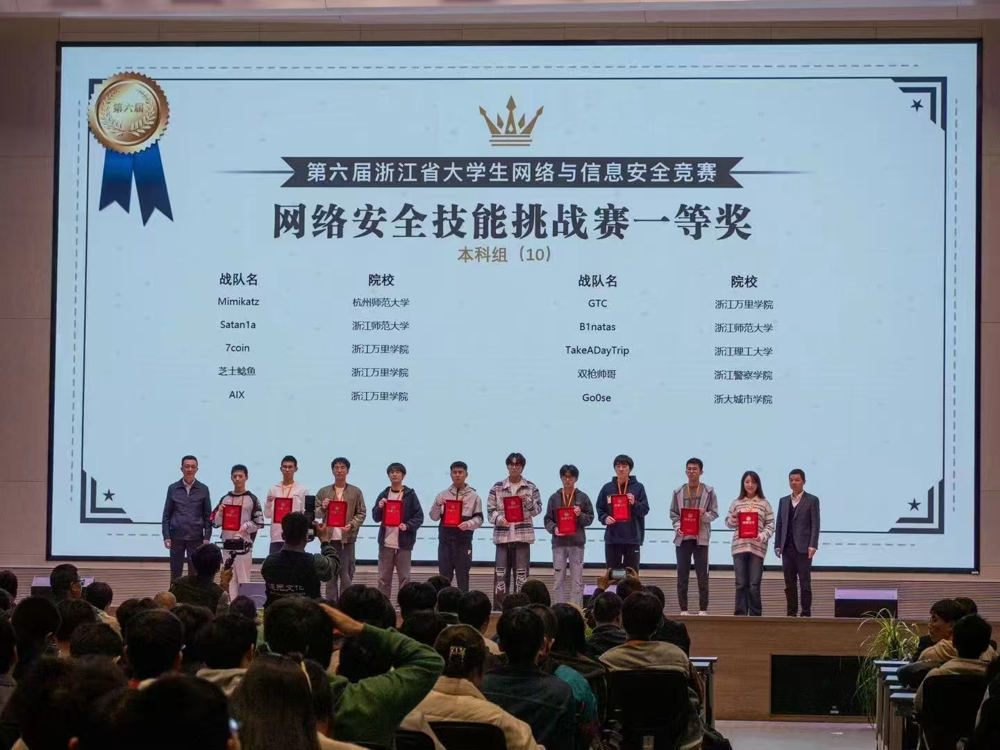
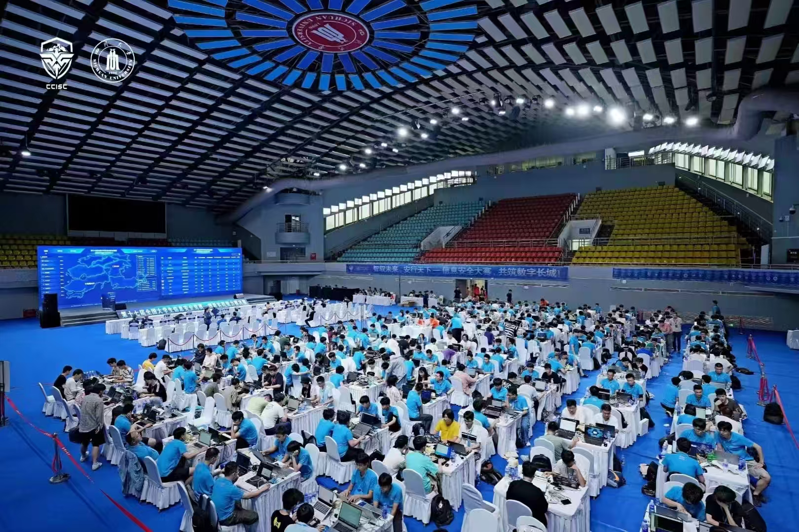
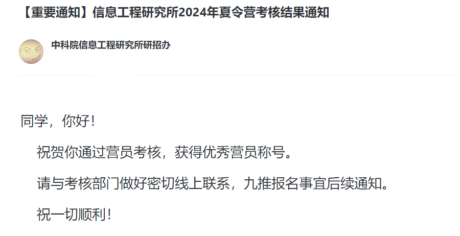

# 2024 年终总结

**自己这一年也是真的经历了好多事，也算是忙碌而充实的一年吧**

**很早就有写年终总结的想法，无奈文笔退化地实在太烂**

**最后也是终于断断续续地写完了这篇年终总结**
<!--more-->

感觉自己真正突然开始忙起来应该是在2023年9月，就是从大三上那个学期，那这篇年终总结就从那时候开始说起吧

## 九月 蓝帽杯(上海)

2023年9月16号，放弃教师资格证的笔试（浪费了210块钱，可恶），去上海参加了蓝帽杯的半决赛

|  |
| :------------------------------------: |

|   |   |
| :----------------------------------------: | :----------------------------------------: |

这真的是最舒服的一次线下赛，因为那时候你浙师还是啥比赛都可以报销，然后也玩的很开心，想念温德姆~

|  |
| :------------------------------------: |

虽然因为某些不可抗力因素导致没晋级全国总决赛（比赛打到一半突然断电。。并且Web还是需要侧信道爆破的题目）

那时候和队友确实因为这个遗憾难过了好久，因为没晋级总决赛就去不了北京了(T_T)

但是我们的另一支队伍成功晋级了，然后他们之后去北京参加了总决赛，虽然因为决赛的赛制是渗透而导致成绩一般

## 十月 GEEKCON2024 China(上海)

2023年10月24号，我和实验室的小伙伴们(`@Fu1p1p`、`@LegendChen`)凌晨3点坐着绿皮火车摇到上海（因为没法报销，需要自费）

|  |
| :-----------------------------------: |

然后一到上海就去参加了`GEEKCON 2023 China`，这也是我第一次参加这种大型的网络安全线下技术论坛

虽然疫情刚刚结束那会儿我去杭州参加了`DEFCON GROUP 0571`，但是那个规模和等级远比不上这次的`GeekCon`

|  |
| :------------------------------------: |
|  |
|  |

在这次的活动上，很幸运的见到了之前心目中的偶像，XCTF联赛的联合创始人——清华网研院的诸葛建伟老师

并且很幸运的拿到了和诸葛建伟老师合照的机会（老师人真的很和善，而且还记得2017年来过浙师做讲座

|   |
| :----------------------------------------: |

## 十一月 浙江省赛

2023年11月11号，`A1natas`的七支队伍一起去嘉兴的商飞基地参加了第六届浙江省网安竞赛

|  |
| :------------------------------------: |

然后本人也是终于在这次的省赛上拿到了省一等奖，也算是完成了一个期待已久愿望吧，感谢队友(`@AsaL1n`、`@Straw`)

|  |
| :------------------------------------: |

## 十一月 台州市赛
2023年11月17日，我们学校的两支队伍去台州科技职业学院参加了台州市赛，这也是我们第一次参与线下AWD赛制的比赛

|  |
| :------------------------------------: |

那时候正逢期中考，本来都打算不去了，但是后来咨询了楼老师(老师人真的很好)，发现奖金挺丰厚的

于是我们两支队伍就分别派了两位同学去参赛，并且为了节省经费，我们就决定当天往返(在温州南站转的车)

因为我们之前都没有怎么接触过AWD赛制，所以取得成绩并不是很理想(三等奖-2000元的奖金)

虽然但是，我们那一队就去了我(Misc手)和Straw(Re手)，而且比赛就两道Web题，这次是真的把Misc手当Web手使了

|  |
| :------------------------------------: |

## 十一月 证券投资浙江省赛(浙江·杭州)

2023年11月25号，我和同学一起去浙江财经大学参加了证券投资省赛的线下陈述和答辩

并且靠着线上实测的高收益和线下答辩的良好发挥，拿下了省一等奖，收益率全省第一，总分全省第四的好成绩

|  |
| :------------------------------------: |

这也是我第一次参加经管类的比赛，前期代码和文本修改然后还有线下答辩答辩稿的准备也是花了挺多的时间

（依稀记得凌晨三点还在改那个训练模型和交易的代码。。。

## 元旦 上海跨年

|  |  |
| :------------------------------------: | :------------------------------------: |

2023的跨年夜和对象一起去了上海，还得是魔都，外滩上人山人海

然后也是刚刚好在2024年的第一刻，海底捞排队排到了，有幸成为了那家店2024年接待的第一桌客人

尽管是跨年的深夜，但是海底捞的服务员依旧充满热情，面带笑容地接待我们

|  |
| :------------------------------------: |
|  |

元旦那天，和对象一起去了上海的欢乐谷，但是欢乐谷似乎没有限制接待人数，导致后来晚上的时候人满为患

当时在人潮中就害怕发生类似于泰梨园的踩踏事件，所以一直催促着赶紧离开

对象拍的烟花美的有些恍惚，同时这也是俩人冒着生命危险一起看的2024年的第一场烟花

## 一月 生日

也是除了父母外，第一次有人给我买生日蛋糕，然后为我筹办生日

也是本人第一次吃到海盐味(咸)的生日蛋糕哈哈哈

|  |
| :------------------------------------: |

## 二月 广州 潮汕 南澳
过完年，趁着寒假还没结束，和对象一起去广东玩了一周，不得的不说广州是真的挺好玩的

首先是去了陈家祠和沙面那边，感觉那边的氛围真的很好，路边开满了鲜花，感觉非常的适合养老

然后我们一起去了长隆野生动物园，看到了很多动物，尤其是坐观光车的环节，可以非常近距离的观赏动物们

|  |
| :------------------------------------: |

离开了广州后，我们一起坐着大巴，穿过跨海大桥去了南澳

南澳岛上的花是真的很好看！尤其是刚下跨海大桥即将进岛的那段路上，两旁都是簇拥着的鲜花

|  |
| :------------------------------------: |

南澳最让我印象深刻的还是可以租小电驴环岛，然后那个小电驴最快可以开到45码，

小电驴的续航也足够用，我们连续开了两天，大概开了有一百多公里吧，电量也没消耗多少

和对象两个人骑着小电驴打卡了北回归线标志塔还有好几座灯塔

|  |  |
| :------------------------------------: | :------------------------------------: |

|   |
| :----------------------------------------: |
|   |

然后在过程中也偶遇了一些小小的海湾，听着海浪打击岸边石头的声音，感觉自己内心都被洗涤了

|  |
| :---------------------------------: |

最后的那天晚上我们去吃了海鲜大排档，虽然那个分量确实没有温州的大。。

但是很幸运那天晚上刚刚好遇到了南澳后宅镇的游神活动，满街都是鞭炮和烟花，大家也纷纷从家里走到街上

## 六月 国赛华东南(福建·福州)
这场比赛可能是本人入坑CTF以来打过的最折磨人的比赛了

六月底的福州就像一个大火炉，然后承办学校也是不做人，把我们参赛选手安排到一个没有空调的篮球馆中

虽然后来临时加装了空调和电风扇，但是并没有什么用，甚至比赛打到一半风扇还被别人转走了

比赛过程中也是真的汗流浃背，电脑发热到键盘都烫手，中途去洗脸，发现洗脸的水都是咸的了(汗已经变成盐粒。。

|                   |
| :-----------------------------------------------------: |
|                   |
|  |

不过好在最后的结果是好的，队友的输出也是十分给力，因此`A1natas`也顺利晋级了后面的全国总决赛

虽然这场比赛的体验着实难受，但是在赛后我们吃了一顿非常丰盛的晚饭，福州这趟也不算白来哈哈

|    |    |
| :--------------------------------------------: | :--------------------------------------------: |
|    |    |

## 七月 国赛全国总决赛(四川·成都)

到了成都当然少不了吃火锅，我们还特意点了九宫格，当然最后那个辣度我也是吃不了一点。。

|  |
| :------------------------------------: |

然后为了解解辣，我们第二天就去吃了水煮牛肉，感觉味道也还不错

|  |
| :------------------------------------: |

春熙太古里也是非常的热闹，就算到了两三点，外面路上还是有挺多人，不愧是有夜生活的城市

然后比赛上也还是有点遗憾，依旧只拿了二等奖，感觉是今年可恶的可信计算的锅

|  |
| :------------------------------------: |
|  |
|  |
|  |

早知道就和北邮一样直接把这部分的分舍弃了，专心和队友一起看AWDP和渗透了

但是二等奖的获得也确实不容易，还是要感谢队友们一路来的互帮互助

最后，在比赛结束那晚的晚宴上，也是有幸见到了沈昌祥院士，并成功地与沈院士拍了一张合照

|  |
| :------------------------------------: |

## 九月 保研流水账
因为一直有读研的想法，然后看看自己的GPA，发现应该能保研，于是就放弃了就业，打算尝试保研并继续读研

虽然拿到了本校的保研资格，但是由于自己的裸绩并不是专业第一，而且学校也没办法开出增值和综测的证明

由于自己的本科也只是一个四非院校，因此保研投递路上并不是一帆风顺，前期投递了好多院校，但是成功过筛的也没多少

不过好在夏令营的时候，信工所给了我一个机会，可能是看我有打CTF竞赛的经历吧，面试上也没有什么刁难，顺利的拿到了优营

|  |
| :-----------------------------------: |

感谢信工所，给了我第一个铁Offer，有了第一个Offer以后，身上的担子就轻了很多，后续比信工所差的学校也就不考虑了

然后信工所的优营会提供一个参观信工所的机会，并且包住宿和伙食，因此我也打算借着这个机会来首都北京看看

当然来了以后或多或少还是有一些失望，然后那时候正值暑假旅游旺季，北京遍地都是人挤人

并且北京周围的街景还有周围的商场啥的当时就给我留下了深刻的不太好的印象，好像和我心目中繁华的首都还是有一定的差距

其实当时去北京还有一个愿望，就是去自己从小以来心目中的梦校——清华大学参观一下

但是可能是由于来参观的人太多了，导致清华和北大的访客参观都是抽签摇号制

很幸运摇到了第二天的号，顺利地拿到了进清华参观的机会

因此我趁着第二天午休的时间，急匆匆地打了车，然后到清华门口排队入校参观

当时一踏进园子的时候，回忆里的什么东西仿佛正中我的眉心，终于来到了自己做梦都想来的地方（虽然只是短暂的参观

|  |  |
| :------------------------------------: | :------------------------------------: |
|  |  |

因为时间紧迫，我也没法过多的停留，因此只能急匆匆地速通了一下，希望下次来的时候可以让我多待一会

参观完清华后，我就准备收拾东西回金华了，毕竟信工所感觉确实和我想去读研的地方有点出入

感觉就是高高的写字楼，校区也不大，没有操场也没有湖，感觉就没有啥学生生活（虽然研一要去怀柔校区上课

但是毕竟没有985 211的title，网上说会是学历寄存器，因此当时就下定决心要继续投更好的学校了

后来的过程中也是尝试了南开、西电等等学校，那边老师说可以给我名额，但是需要我提前给确定的答复

当时还报了浙软，所以一直想冲一冲浙大，就放弃了那些机会（Tips：南开不给专硕提供宿舍

然后浙软的夏令营也是在老师的帮助下顺利拿到了优营，但是最后预推免还是不争气地败在了机试上（呜呜呜，我的浙大梦~

浙软碰壁后我也是继续尝试联系别的学校的老师，也是很幸运地联系到了北邮的老师

最后929的时候其实也没啥选择，就拒了信工所然后选择去了北邮

|  |
| :------------------------------------: |

## 十月 华晨宇演唱会(浙江·杭州)

10月26号，和对象一起去杭州大莲花(奥体中心)看了华晨宇的火星演唱会

同时这也是我第一次线下看演唱会，场馆里面也是几乎都坐满了人，现场氛围挺好的，会有大合唱啥的

虽然大部分歌我都是唱不来的，会唱的也就那么四五首吧。。(没事，感受个线下的氛围也行)

|  |
| -------------------------------------- |

## 十一月 浙江省省赛(浙江·杭州)

每年的经典环节，也是大四老东西的省赛最后一舞了，每次都是差一点就能AK Misc方向的赛题，唉

今年`A1natas`也是非常的给力，再次刷新记录一口气拿下了四个省一，实验室的后浪们tql

衷心希望`A1natas`之后能越来越好，在各大网络安全赛事上再创佳绩！

|  |
| :------------------------------------: |
|  |
|  |

## 十二月 睿抗网络安全全国总决赛(湖北·武汉)

很早之前就和队友报名的比赛，比赛本身没啥含金量，但是架不住它在教育部名单和学校的竞赛目录中

初赛只能说是纯手速局，没啥难度感觉

决赛在湖北大学举办，这时候我已经在北京了，于是特地买了飞机从北京飞往武汉

不过就当作是去武汉旅游，给自己喘口气散散心吧，和学弟们也有半个月没见了

|  |
| :------------------------------------: |

最后的结果当然有点遗憾，有个很牛的洞最后才看到，但是也还不错了，拿下了全场的第二名，感谢队友们的辛勤付出！



**最后的最后，以上就是我2024年的绝大部分内容了**

**非常感谢你能看到这里，愿意听我这无聊的碎碎念**

**不知道从什么时候开始，自己的生活就变得一直忙忙碌碌了**

**因此对于日常的生活就有点疏于记录了，太久没写作文感觉自己的文笔也确实退化不少**


---

> Author: [Lunatic](https://goodlunatic.github.io)  
> URL: https://goodlunatic.github.io/posts/6f0ed5c/  

