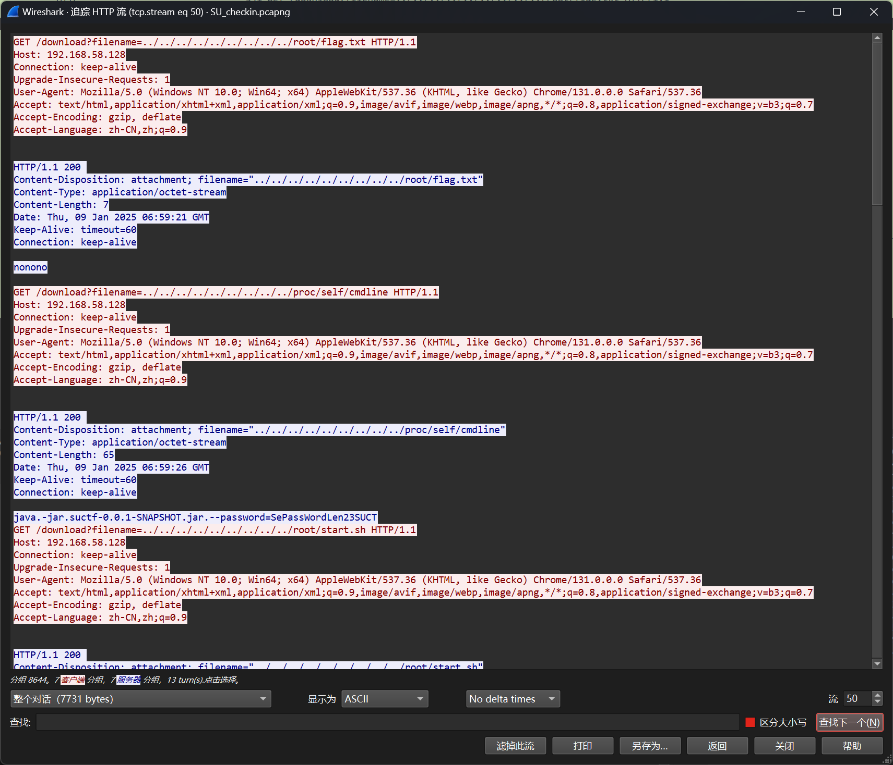
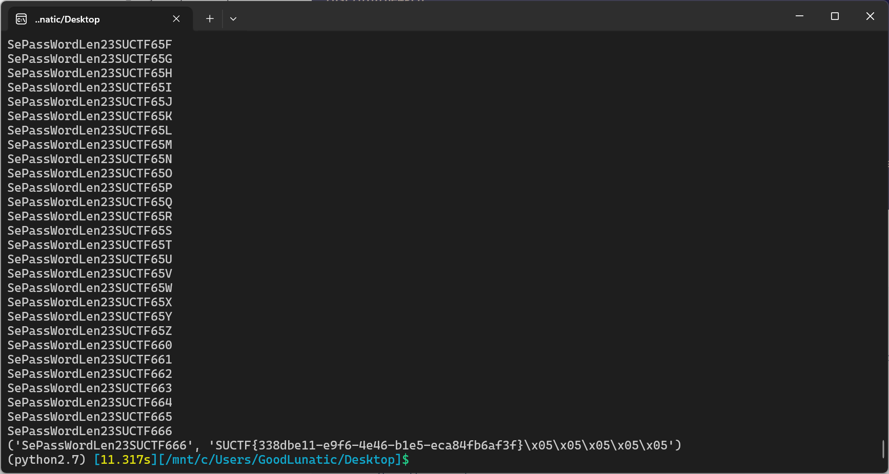
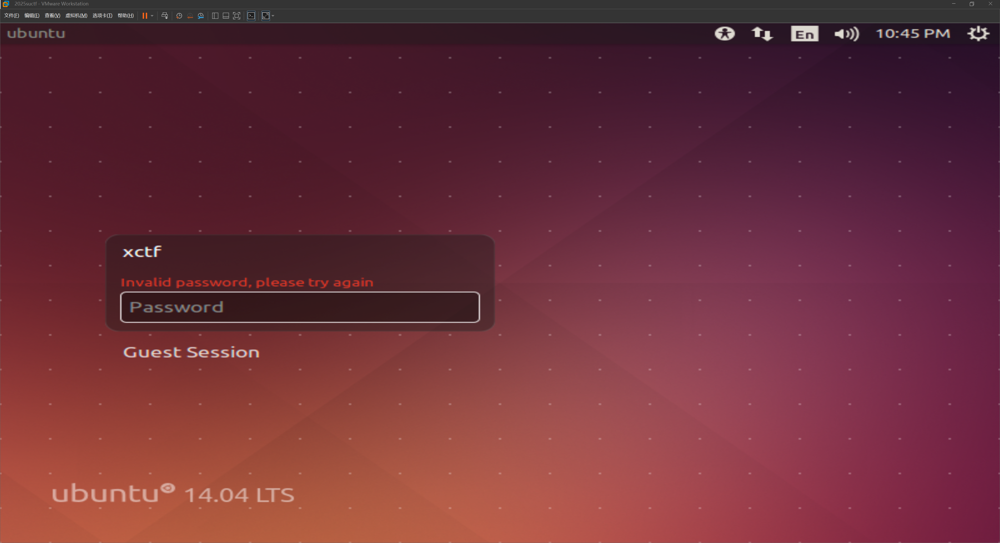
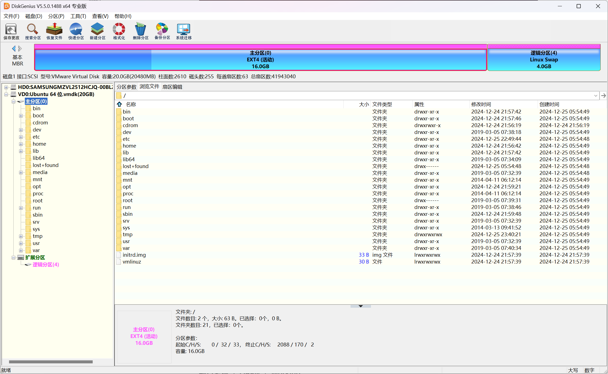
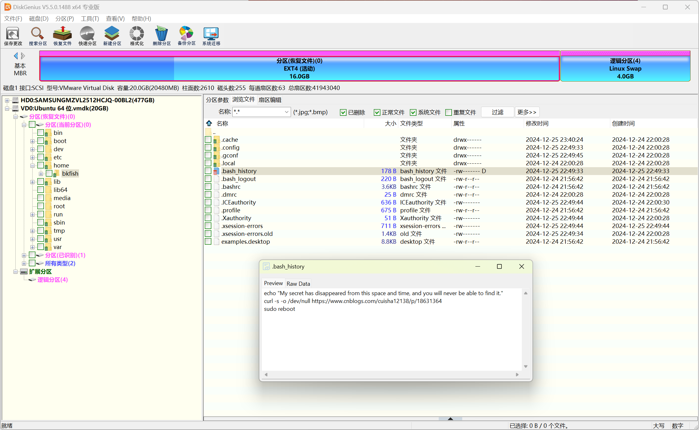
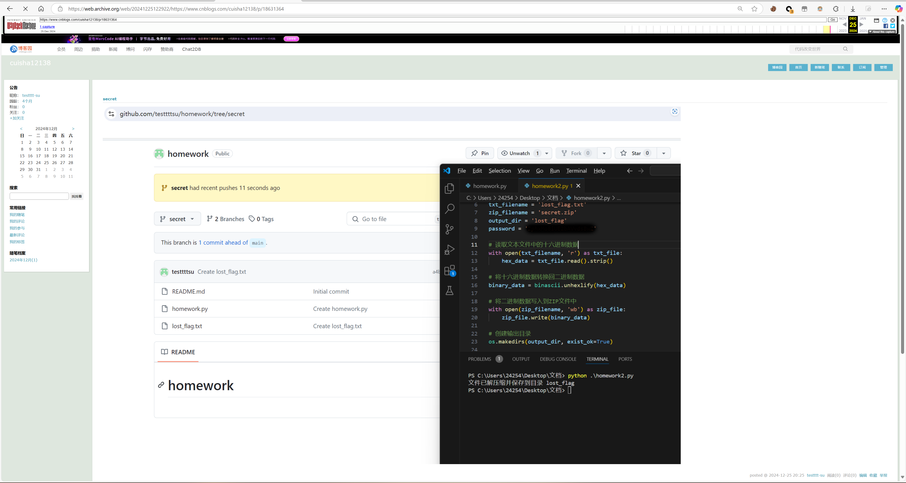
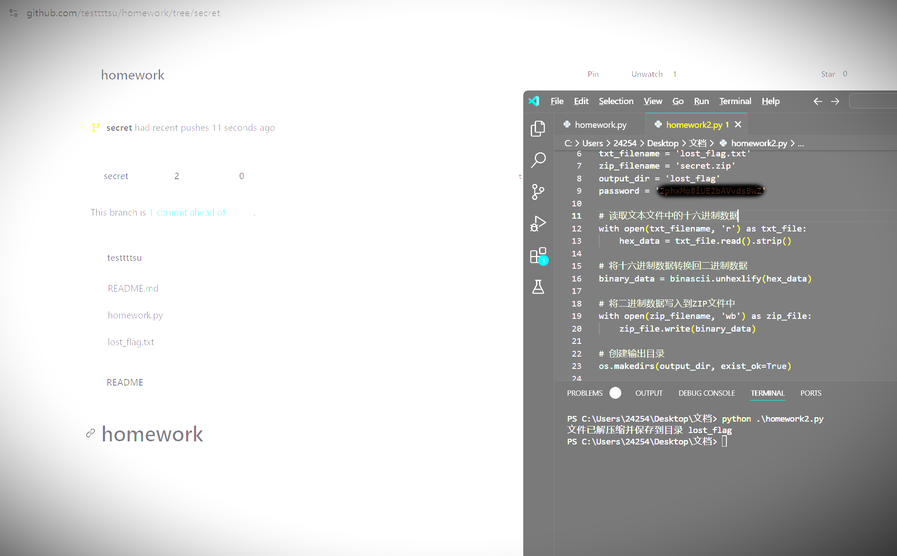
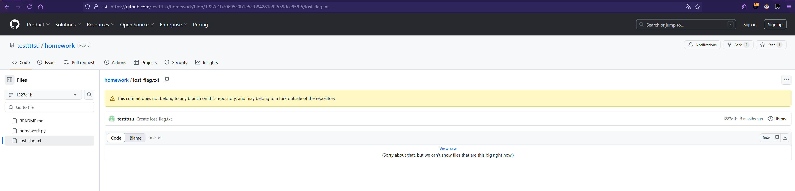
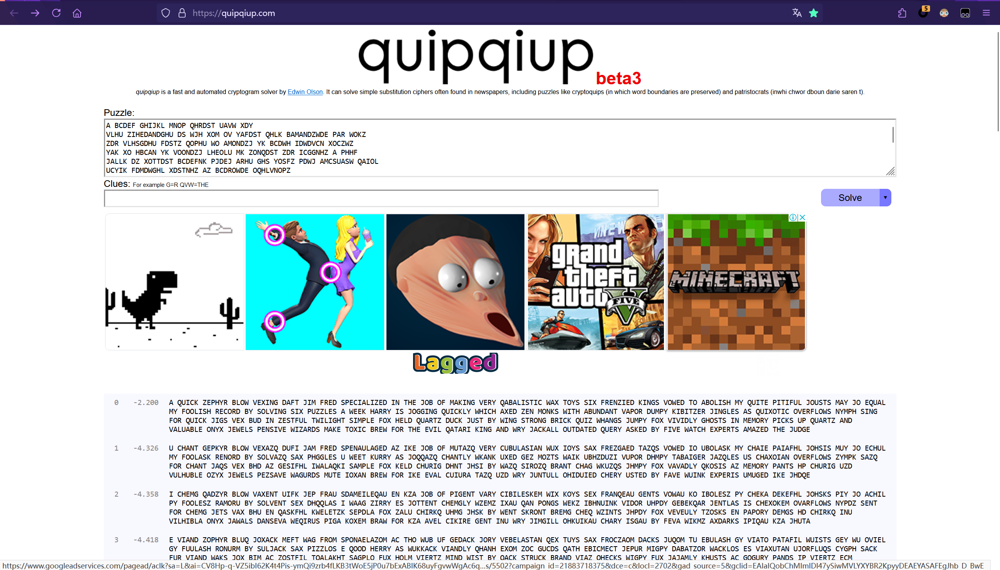

# 2025 XCTF国际网络攻防联赛-SUCTF分站赛 Misc Writeup

**2025 XCTF国际网络攻防联赛-SUCTF分站赛 Misc Writeup**
<!--more-->

|                 <br><br>                 |
| :---------------------------------------------------------------------------: |
| **题目附件下载：https://pan.baidu.com/s/12xlTPFG1QJ9OWIM_f4lKbA?pwd=s44r 提取码: s44r** |

## 题目名称 SU_checkin
附件给了一个流量包，用过滤器过滤一下，发现只有流50的返回值是200



从上面的流量包中可以得到一下几个关键信息，密文、密钥以及加密算法

> java.-jar.suctf-0.0.1-SNAPSHOT.jar.--password=SePassWordLen23SUCT
> 
> algorithm=PBEWithMD5AndDES
> 
> OUTPUT=ElV+bGCnJYHVR8m23GLhprTGY0gHi/tNXBkGBtQusB/zs0uIHHoXMJoYd6oSOoKuFWmAHYrxkbg=

但是仔细观察`SePassWordLen23SUCT`，发现密钥是不完整的并且提示了密钥长度是23

因此参考Github上这个`PBEWithMD5AndDES`解密脚本，爆破一下密钥即可

https://github.com/binsgit/PBEWithMD5AndDES/blob/master/python/PBEWithMD5AndDES_2.py

```python
import base64
import hashlib
import re
import os
from Crypto.Cipher import DES
from string import printable
import itertools

def get_derived_key(password, salt, count):
    key = password + salt
    for i in range(count):
        m = hashlib.md5(key)
        key = m.digest()
    return (key[:8], key[8:])

def decrypt(msg, password):
    msg_bytes = base64.b64decode(msg)
    salt = msg_bytes[:8]
    enc_text = msg_bytes[8:]
    (dk, iv) = get_derived_key(password, salt, 1000)
    crypter = DES.new(dk, DES.MODE_CBC, iv)
    text = crypter.decrypt(enc_text)
    # print(text)
    return text

def encrypt(msg, password):
    salt = os.urandom(8)
    pad_num = 8 - (len(msg) % 8)
    for i in range(pad_num):
        msg += chr(pad_num)
    (dk, iv) = get_derived_key(password, salt, 1000)
    crypter = DES.new(dk, DES.MODE_CBC, iv)
    enc_text = crypter.encrypt(msg)
    return base64.b64encode(salt + enc_text)

def main():
    table = printable[:62]
    for a, b, c in itertools.product(table, repeat=3):
        passwd = "SePassWordLen23SUCTF{}{}{}".format(a, b, c)
        print(passwd)
        s = "ElV+bGCnJYHVR8m23GLhprTGY0gHi/tNXBkGBtQusB/zs0uIHHoXMJoYd6oSOoKuFWmAHYrxkbg="
        res = decrypt(s, passwd)
        # print(res)
        if "SUCTF" in res:
            print(passwd,res)
            break

if __name__ == "__main__":
    main()
```

python2运行以上脚本即可得到密钥和flag：`SePassWordLen23SUCTF666 SUCTF{338dbe11-e9f6-4e46-b1e5-eca84fb6af3f}`



## 题目名称 SU_RealCheckin

给了个对应表，对应的字母其实就是emoji英文的首字母

> hello ctf -> 🏠🦅🍋🍋🍊 🐈🌮🍟
> 
> $flag -> 🐍☂️🐈🌮🍟{🐋🦅🍋🐈🍊🏔️🦅_🌮🍊_🐍☂️🐈🌮🍟_🧶🍊☂️_🐈🍎🌃_🌈🦅🍎🍋🍋🧶_🐬🍎🌃🐈🦅}

签到题，写脚本其实没有手搓快。。。

```python
flag = "🐍☂🐈🌮🍟{🐋🦅🍋🐈🍊🏔️🦅_🌮🍊_🐍☂️🐈🌮🍟_🧶🍊☂️_🐈🍎🌃_🌈🦅🍎🍋🍋🧶_🐬🍎🌃🐈🦅}"
dic = {
    '🏠':'h',
    '🦅':'e',
    '🍋':'l',
    '🍊':'o',
    '🐈':'c',
    '🌮':'t',
    '🍟':'f',
    '🐍':'s',
    '☂️':'u',
    '🐋':'w',
    '🏔️':'m',
    '🧶':'y',
    '🌈':'r',
    '🌃':'n',
    '🍎':'a',
    '🐬':'d'
}

for item in flag:
    if item == '_' or item == '{' or item == '}':
        print(item,end='')
    else:
        try:
            print(dic[item],end='')
        except:
            print(" ",end='')
# s ctf{welco  e_to_s  ctf_yo  _can_really_dance}
# suctf{welcome_to_suctf_you_can_really_dance}
```

## 题目名称 SU_forensics

狗and猫师傅出的题，整体思路是挺好的，质量也很高，就是最后一步的字频爆破，不给提示还是难以联想

> 题面信息如下：
> bkfish在自己的虚拟机里运行了某些命令之后用"sudo reboot"重启了主机，接着他按照网上清除入侵记录的方法先"rm -rf .bash_history"然后"history -c"删除了所有的命令记录。在现实世界中，消失的东西就找不回来了，但在网络世界里可未必如此，你能找到bkfish消失的秘密吗?
> 
> flag提交格式：全大写的SUCTF{XXXX}

附件直接给了Vmware虚拟机的所有文件，Vmware可以直接打开.vmx文件

但是进入系统需要密码，系统版本是Ubuntu14.04LTS



可以直接用DiskGenius挂载vmdx虚拟磁盘文件



然后尝试使用DiskGenius的恢复数据功能，可以恢复出被删除的.bash_history



.bash_history内容如下

> echo "My secret has disappeared from this space and time, and you will never be able to find it."
> 
> curl -s -o /dev/null https://www.cnblogs.com/cuisha12138/p/18631364
> 
> sudo reboot

访问里面那个博客园的链接，发现已经被删除了，但是我们可以尝试去网站时光机上找一找

网站时光机的链接：https://web.archive.org/

这篇被删除的文章的链接：https://web.archive.org/web/20241225122922/https://www.cnblogs.com/cuisha12138/p/18631364



文章中的图片提示了我们一个Github的仓库：https://github.com/testtttsu/homework

并且通过提高图片的亮度和对比度我们可以得到解压密码：2phxMo8iUE2bAVvdsBwZ



我们访问上面的那个Github仓库，发现这个分支已经被删除了


但是我们可以从旁边的activity中找到这个被删除的文件



然后填上之前得到的解压密码，用仓库中的脚本直接运行即可得到下面这张图片


写了个脚本来分割图片，并统计每种符号出现的次数

```python
from PIL import Image
import hashlib
import os

def crop_table():
    if os.path.exists("out"):
        print("[+] out 目录已存在")
    else:
        os.mkdir("out")
        print("[+] out 目录创建成功")

    img = Image.open("1.png")
    width, height = img.size # 9522, 1296
    print(f"图片尺寸: {width}x{height}")

    crop_width = 137
    crop_height = 107

    cols = (width - 0) // crop_width
    rows = (height - 0) // crop_height
    print(f"可分割的列数: {cols}, 行数: {rows}")

    index = 1
    for row in range(rows):
        for col in range(cols):
            # 计算裁剪区域的坐标
            left = 0 + col * (crop_width + 1)
            upper = 0 + row * (crop_height + 1)
            right = left + crop_width
            lower = upper + crop_height

            cropped_img = img.crop((left, upper, right, lower))

            cropped_img.save(f"out/{index}.png")
            print(f"[+] out/{index}.png 保存成功 (区域: {left},{upper} -> {right},{lower})")

            index += 1

def calculate_md5(filename):  
    # 计算文件的 MD5 值  
    hasher = hashlib.md5()  
    with open(filename, 'rb') as f:  
        for chunk in iter(lambda: f.read(4096), b""):  
            hasher.update(chunk)  
    return str(hasher.hexdigest())  


if __name__ == "__main__":
    # crop_table()
    dic = {}
    for i in range(1,829):
        filename = f"./out/{i}.png"
        tmp_hash = calculate_md5(filename)
        if tmp_hash not in dic:
            dic[tmp_hash] = 1
        else:
            dic[tmp_hash] += 1

print(dic)
# {'a92114d80fb8d9f051267093ff31f652': 35,
#  '643a1412425e02202bc739ed381fc2ce': 104,
#  'c2ba6829d6b89fe4d95f59143f5dab09': 12,
#  '0ea52827f2cd163ec0abd5c138bd8d52': 24,
#  '6cfc1169ffd57fcccf6c9deb2c9b8a81': 50,
#  'a733e9655b25c318db40ee3e4e6fc9b7': 14,
#  '78ea7aa8bad5966f51d34ce68f9bb1a4': 15,
#  '274d11fd91b261ea9a4dfbfcfccc5caf': 13,
#  '0b27aed76fc735518d8400ec44888b17': 44,
#  '345cfeee944eff97baecafc30f998be8': 13,
#  'a54cbc7076fe3385ec19e5844ede06d8': 16,
#  '01288ae944ad4fa589fa7f8c8921c6db': 19,
#  'd3b493d9622e43c2fd0932cbc8eb4242': 24,
#  '09298a31ed656279970cbdb61e220fce': 13,
#  '5650d4328599806e228163b9f3883b76': 23,
#  '902d339e136a450f8dcf5912acf3908b': 29,
#  'ec3995e91d6770d86f31c91fb9f1f18c': 15,
#  'd3405ba0628f6c5a7847172b75c96e24': 13,
#  '97071255bca34a123d21c8077326e849': 12,
#  '463a505a8bde3e32d3215ac582545ade': 24,
#  '2c5eeaa83376135696cdf14ee2e65527': 17,
#  '972487ddb0c7427f86244525c765ceb1': 21,
#  'b656951ad9063e1e714eb5066e355043': 13,
#  '6f891cd850e8e2e75ca95565793730a5': 28,
#  '8b4bc073bc7a2526cf3b197537c8d299': 12,
#  '87b5f6ccfa6d7c9c733b1c665fb138ca': 14,
#  '100dfaec51061f9d69ecbbfa87d0ef3d': 179,
#  '279a7e86da10953b77671a3cacf8b087': 32}
```

发现除掉黑色的背景后一共27字符，因此猜测是26个字符+空格

我们不去管每种字符的对应方式，出现次数最多的字符肯定是空格，因此我们先随意做一个对照表

然后根据对照表生成图片中表示的密文，具体脚本如下：

```python
from PIL import Image
import hashlib
import os


table = {'a92114d80fb8d9f051267093ff31f652': 'A', '643a1412425e02202bc739ed381fc2ce': ' ', 'c2ba6829d6b89fe4d95f59143f5dab09': 'B', '0ea52827f2cd163ec0abd5c138bd8d52': 'C', '6cfc1169ffd57fcccf6c9deb2c9b8a81': 'D', 'a733e9655b25c318db40ee3e4e6fc9b7': 'E', '78ea7aa8bad5966f51d34ce68f9bb1a4': 'F', '274d11fd91b261ea9a4dfbfcfccc5caf': 'G', '0b27aed76fc735518d8400ec44888b17': 'H', '345cfeee944eff97baecafc30f998be8': 'I', 'a54cbc7076fe3385ec19e5844ede06d8': 'J', '01288ae944ad4fa589fa7f8c8921c6db': 'K', 'd3b493d9622e43c2fd0932cbc8eb4242': 'L', '09298a31ed656279970cbdb61e220fce': 'M', '5650d4328599806e228163b9f3883b76': 'N', '902d339e136a450f8dcf5912acf3908b': 'O', 'ec3995e91d6770d86f31c91fb9f1f18c': 'P', 'd3405ba0628f6c5a7847172b75c96e24': 'Q', '97071255bca34a123d21c8077326e849': 'R', '463a505a8bde3e32d3215ac582545ade': 'S', '2c5eeaa83376135696cdf14ee2e65527': 'T', '972487ddb0c7427f86244525c765ceb1': 'U', 'b656951ad9063e1e714eb5066e355043': 'V', '6f891cd850e8e2e75ca95565793730a5': 'W', '8b4bc073bc7a2526cf3b197537c8d299': 'X', '87b5f6ccfa6d7c9c733b1c665fb138ca': 'Y', '279a7e86da10953b77671a3cacf8b087': 'Z'}

def calculate_md5(filename):  
    # 计算文件的 MD5 值  
    hasher = hashlib.md5()  
    with open(filename, 'rb') as f:  
        for chunk in iter(lambda: f.read(4096), b""):  
            hasher.update(chunk)  
    return str(hasher.hexdigest()) 


def get_text():
    if os.path.exists("out"):
        print("[+] out 目录已存在")
    else:
        os.mkdir("out")
        print("[+] out 目录创建成功")

    img = Image.open("1.png")
    width, height = img.size # 9522, 1296
    print(f"图片尺寸: {width}x{height}")

    crop_width = 137
    crop_height = 107

    cols = (width - 0) // crop_width
    rows = (height - 0) // crop_height
    print(f"可分割的列数: {cols}, 行数: {rows}")

    index = 1
    text = ""
    for row in range(rows):
        for col in range(cols):
            # 计算裁剪区域的坐标
            file_path = f"out/{index}.png"
            left = 0 + col * (crop_width + 1)
            upper = 0 + row * (crop_height + 1)
            right = left + crop_width
            lower = upper + crop_height
            cropped_img = img.crop((left, upper, right, lower))
            cropped_img.save(file_path)
            hash_value = calculate_md5(file_path)
            print(hash_value)
            if hash_value == "100dfaec51061f9d69ecbbfa87d0ef3d":
                text += '\n'
                break
            else:
                text += table[hash_value]
            if col == cols-1:
                text += '\n'
            print(f"[+] out/{index}.png 保存成功 (区域: {left},{upper} -> {right},{lower})")
            index += 1
    return text


if __name__ == "__main__":
    text = get_text()
    print(text)
```

运行以上脚本后可以得到如下内容

> A BCDEF GHIJKL MNOP QHRDST UAVW XDY
> 
> VLHU ZIHEDANDGHU DS WJH XOM OV YAFDST QHLK BAMANDZWDE PAR WOKZ
> 
> ZDR VLHSGDHU FDSTZ QOPHU WO AMONDZJ YK BCDWH IDWDVCN XOCZWZ
> 
> YAK XO HBCAN YK VOONDZJ LHEOLU MK ZONQDST ZDR ICGGNHZ A PHHF
> 
> JALLK DZ XOTTDST BCDEFNK PJDEJ ARHU GHS YOSFZ PDWJ AMCSUASW QAIOL
> 
> UCYIK FDMDWGHL XDSTNHZ AZ BCDROWDE OQHLVNOPZ
> 
> SKYIJ ZDST VOL BCDEF XDTZ QHR MCU DS GHZWVCN WPDNDTJW
> 
> ZDYINH VOR JHNU BCALWG UCEF XCZW MK PDST
> 
> ZWLOST MLDEF BCDG PJASTZ XCYIK VOR QDQDUNK
> 
> TJOZWZ DS YHYOLK IDEFZ CI BCALWG ASU QANCAMNH OSKR XHPHNZ
> 
> IHSZDQH PDGALUZ YAFH WORDE MLHP VOL WJH HQDN BAWALD FDST ASU PLK XAEF
> 
> ANN OCWUAWHU BCHLK AZFHU MK VDQH PAWEJ HRIHLWZ AYAGHU WJH XCUTH
> 

这个东西看起来很眼熟对吧，很容易就能想到quipquip字频爆破



爆破后可以得到如下内容

> A QUICK ZEPHYR BLOW VEXING DAFT JIM
> 
> FRED SPECIALIZED IN THE JOB OF MAKING VERY QABALISTIC WAX TOYS
> 
> SIX FRENZIED KINGS VOWED TO ABOLISH MY QUITE PITIFUL JOUSTS 
> 
> MAY JO EQUAL MY FOOLISH RECORD BY SOLVING SIX PUZZLES A WEEK
> 
> HARRY IS JOGGING QUICKLY WHICH AXED ZEN MONKS WITH ABUNDANT VAPOR 
> 
> DUMPY KIBITZER JINGLES AS QUIXOTIC OVERFLOWS
> 
> NYMPH SING FOR QUICK JIGS VEX BUD IN ZESTFUL TWILIGHT 
> 
> SIMPLE FOX HELD QUARTZ DUCK JUST BY WING
> 
> STRONG BRICK QUIZ WHANGS JUMPY FOX VIVIDLY
> 
> GHOSTS IN MEMORY PICKS UP QUARTZ AND VALUABLE ONYX JEWELS 
> 
> PENSIVE WIZARDS MAKE TOXIC BREW FOR THE EVIL QATARI KING AND WRY JACK
> 
> ALL OUTDATED QUERY ASKED BY FIVE WATCH EXPERTS AMAZED THE JUDGE

仔细观察这个格式可以想到一个比较经典的Pangram(全字母句子)：The quick brown fox jumps over the lazy dog

因此把每一行中缺少的那个字母组合起来即可得到最后flag：`SUCTF{HAVEFUN}`

## 题目名称 SU_AD
参考链接：
> https://z3n1th1.com/2025/01/suctf2025-writeup/#su_voip
> 
> https://kcno7cq8euks.feishu.cn/wiki/PKx0w2LrtiVo99k3tEDc0xBnnre
> 
> https://jk64eb0pjs.feishu.cn/docx/O6OUd1iSro8XcpxlpDAc0si5n5e


## 题目名称 SU_VOIP


---

> Author: [Lunatic](https://goodlunatic.github.io)  
> URL: https://goodlunatic.github.io/posts/754b8e7/  

