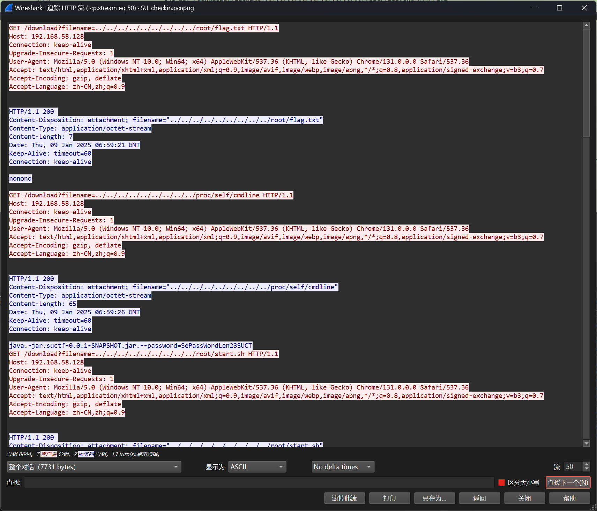
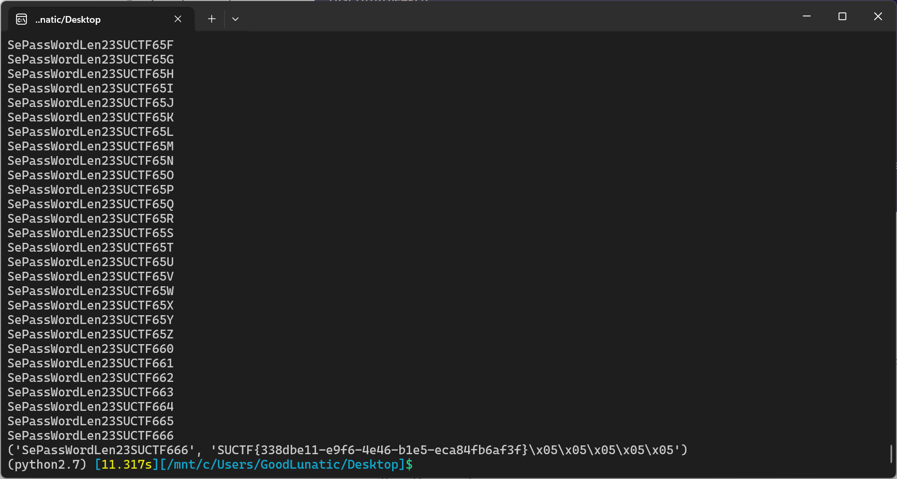
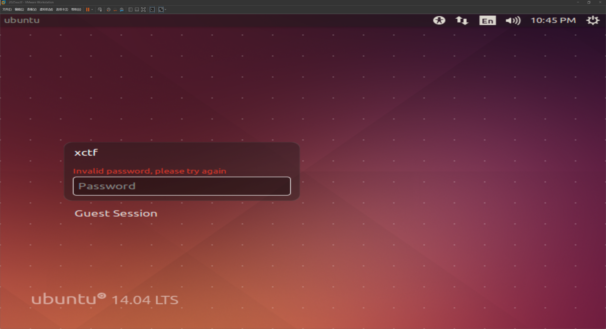
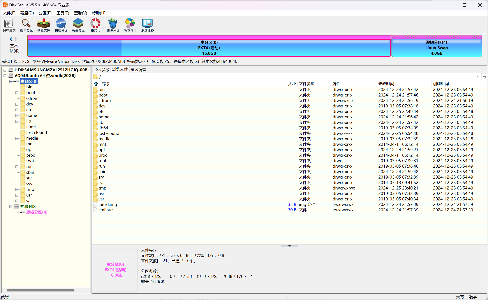
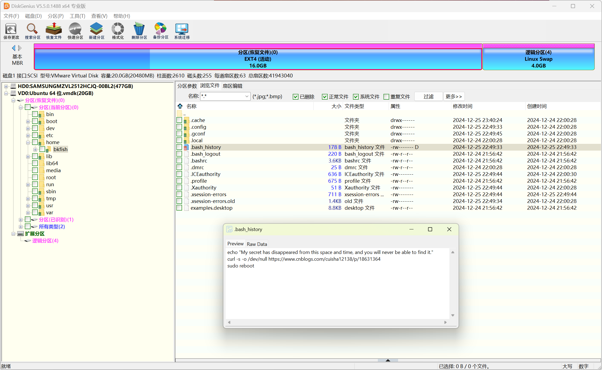
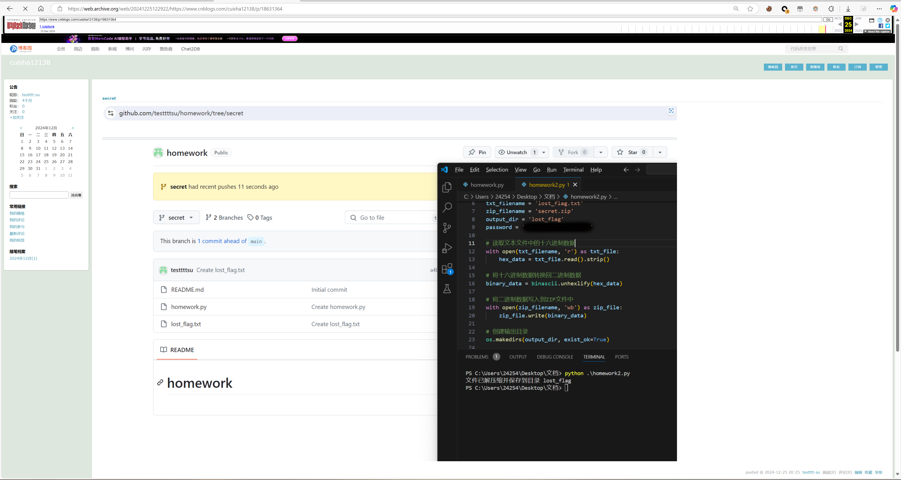
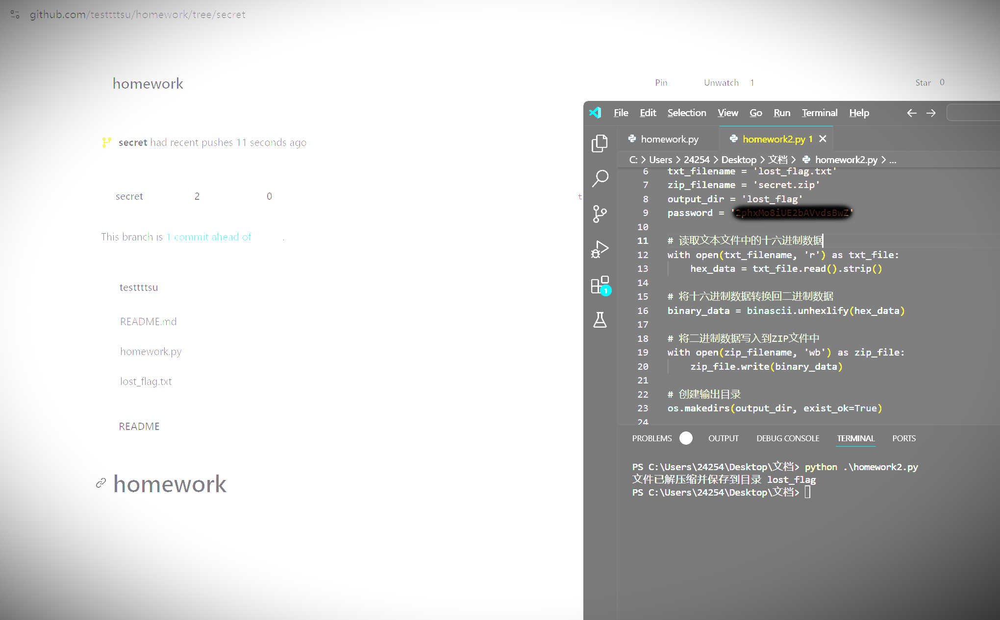
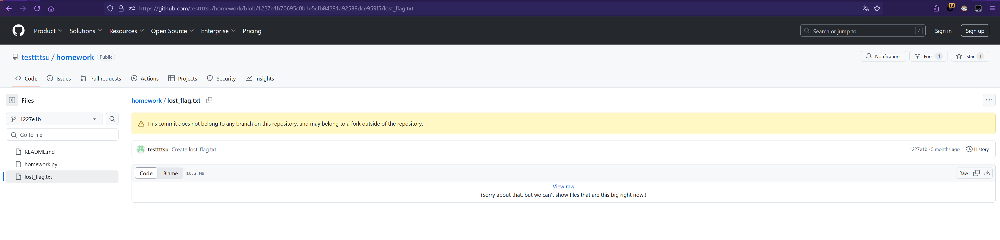

# 2025 XCTF国际网络攻防联赛-SUCTF分站赛 Misc Writeup

**2025 XCTF国际网络攻防联赛-SUCTF分站赛 Misc Writeup**
&lt;!--more--&gt;

|                 &lt;br&gt;&lt;br&gt;                 |
| :---------------------------------------------------------------------------: |
| **题目附件下载：https://pan.baidu.com/s/12xlTPFG1QJ9OWIM_f4lKbA?pwd=s44r 提取码: s44r** |

## 题目名称 SU_checkin
附件给了一个流量包，用过滤器过滤一下，发现只有流50的返回值是200



从上面的流量包中可以得到一下几个关键信息，密文、密钥以及加密算法

&gt; java.-jar.suctf-0.0.1-SNAPSHOT.jar.--password=SePassWordLen23SUCT
&gt; 
&gt; algorithm=PBEWithMD5AndDES
&gt; 
&gt; OUTPUT=ElV&#43;bGCnJYHVR8m23GLhprTGY0gHi/tNXBkGBtQusB/zs0uIHHoXMJoYd6oSOoKuFWmAHYrxkbg=

但是仔细观察`SePassWordLen23SUCT`，发现密钥是不完整的并且提示了密钥长度是23

因此参考Github上这个`PBEWithMD5AndDES`解密脚本，爆破一下密钥即可

https://github.com/binsgit/PBEWithMD5AndDES/blob/master/python/PBEWithMD5AndDES_2.py

```python
import base64
import hashlib
import re
import os
from Crypto.Cipher import DES
from string import printable
import itertools

def get_derived_key(password, salt, count):
    key = password &#43; salt
    for i in range(count):
        m = hashlib.md5(key)
        key = m.digest()
    return (key[:8], key[8:])

def decrypt(msg, password):
    msg_bytes = base64.b64decode(msg)
    salt = msg_bytes[:8]
    enc_text = msg_bytes[8:]
    (dk, iv) = get_derived_key(password, salt, 1000)
    crypter = DES.new(dk, DES.MODE_CBC, iv)
    text = crypter.decrypt(enc_text)
    # print(text)
    return text

def encrypt(msg, password):
    salt = os.urandom(8)
    pad_num = 8 - (len(msg) % 8)
    for i in range(pad_num):
        msg &#43;= chr(pad_num)
    (dk, iv) = get_derived_key(password, salt, 1000)
    crypter = DES.new(dk, DES.MODE_CBC, iv)
    enc_text = crypter.encrypt(msg)
    return base64.b64encode(salt &#43; enc_text)

def main():
    table = printable[:62]
    for a, b, c in itertools.product(table, repeat=3):
        passwd = &#34;SePassWordLen23SUCTF{}{}{}&#34;.format(a, b, c)
        print(passwd)
        s = &#34;ElV&#43;bGCnJYHVR8m23GLhprTGY0gHi/tNXBkGBtQusB/zs0uIHHoXMJoYd6oSOoKuFWmAHYrxkbg=&#34;
        res = decrypt(s, passwd)
        # print(res)
        if &#34;SUCTF&#34; in res:
            print(passwd,res)
            break

if __name__ == &#34;__main__&#34;:
    main()
```

python2运行以上脚本即可得到密钥和flag：`SePassWordLen23SUCTF666 SUCTF{338dbe11-e9f6-4e46-b1e5-eca84fb6af3f}`



## 题目名称 SU_RealCheckin

给了个对应表，对应的字母其实就是emoji英文的首字母

&gt; hello ctf -&gt; 🏠🦅🍋🍋🍊 🐈🌮🍟
&gt; 
&gt; $flag -&gt; 🐍☂️🐈🌮🍟{🐋🦅🍋🐈🍊🏔️🦅_🌮🍊_🐍☂️🐈🌮🍟_🧶🍊☂️_🐈🍎🌃_🌈🦅🍎🍋🍋🧶_🐬🍎🌃🐈🦅}

签到题，写脚本其实没有手搓快。。。

```python
flag = &#34;🐍☂🐈🌮🍟{🐋🦅🍋🐈🍊🏔️🦅_🌮🍊_🐍☂️🐈🌮🍟_🧶🍊☂️_🐈🍎🌃_🌈🦅🍎🍋🍋🧶_🐬🍎🌃🐈🦅}&#34;
dic = {
    &#39;🏠&#39;:&#39;h&#39;,
    &#39;🦅&#39;:&#39;e&#39;,
    &#39;🍋&#39;:&#39;l&#39;,
    &#39;🍊&#39;:&#39;o&#39;,
    &#39;🐈&#39;:&#39;c&#39;,
    &#39;🌮&#39;:&#39;t&#39;,
    &#39;🍟&#39;:&#39;f&#39;,
    &#39;🐍&#39;:&#39;s&#39;,
    &#39;☂️&#39;:&#39;u&#39;,
    &#39;🐋&#39;:&#39;w&#39;,
    &#39;🏔️&#39;:&#39;m&#39;,
    &#39;🧶&#39;:&#39;y&#39;,
    &#39;🌈&#39;:&#39;r&#39;,
    &#39;🌃&#39;:&#39;n&#39;,
    &#39;🍎&#39;:&#39;a&#39;,
    &#39;🐬&#39;:&#39;d&#39;
}

for item in flag:
    if item == &#39;_&#39; or item == &#39;{&#39; or item == &#39;}&#39;:
        print(item,end=&#39;&#39;)
    else:
        try:
            print(dic[item],end=&#39;&#39;)
        except:
            print(&#34; &#34;,end=&#39;&#39;)
# s ctf{welco  e_to_s  ctf_yo  _can_really_dance}
# suctf{welcome_to_suctf_you_can_really_dance}
```

## 题目名称 SU_forensics

狗and猫师傅出的题，整体思路是挺好的，质量也很高，就是最后一步的字频爆破，不给提示还是难以联想

&gt; 题面信息如下：
&gt; bkfish在自己的虚拟机里运行了某些命令之后用&#34;sudo reboot&#34;重启了主机，接着他按照网上清除入侵记录的方法先&#34;rm -rf .bash_history&#34;然后&#34;history -c&#34;删除了所有的命令记录。在现实世界中，消失的东西就找不回来了，但在网络世界里可未必如此，你能找到bkfish消失的秘密吗?
&gt; 
&gt; flag提交格式：全大写的SUCTF{XXXX}

附件直接给了Vmware虚拟机的所有文件，Vmware可以直接打开.vmx文件

但是进入系统需要密码，系统版本是Ubuntu14.04LTS



可以直接用DiskGenius挂载vmdx虚拟磁盘文件



然后尝试使用DiskGenius的恢复数据功能，可以恢复出被删除的.bash_history



.bash_history内容如下

&gt; echo &#34;My secret has disappeared from this space and time, and you will never be able to find it.&#34;
&gt; 
&gt; curl -s -o /dev/null https://www.cnblogs.com/cuisha12138/p/18631364
&gt; 
&gt; sudo reboot

访问里面那个博客园的链接，发现已经被删除了，但是我们可以尝试去网站时光机上找一找

网站时光机的链接：https://web.archive.org/

这篇被删除的文章的链接：https://web.archive.org/web/20241225122922/https://www.cnblogs.com/cuisha12138/p/18631364



文章中的图片提示了我们一个Github的仓库：https://github.com/testtttsu/homework

并且通过提高图片的亮度和对比度我们可以得到解压密码：2phxMo8iUE2bAVvdsBwZ



我们访问上面的那个Github仓库，发现这个分支已经被删除了


但是我们可以从旁边的activity中找到这个被删除的文件



然后填上之前得到的解压密码，用仓库中的脚本直接运行即可得到下面这张图片


写了个脚本来分割图片，并统计每种符号出现的次数

```python
from PIL import Image
import hashlib
import os

def crop_table():
    if os.path.exists(&#34;out&#34;):
        print(&#34;[&#43;] out 目录已存在&#34;)
    else:
        os.mkdir(&#34;out&#34;)
        print(&#34;[&#43;] out 目录创建成功&#34;)

    img = Image.open(&#34;1.png&#34;)
    width, height = img.size # 9522, 1296
    print(f&#34;图片尺寸: {width}x{height}&#34;)

    crop_width = 137
    crop_height = 107

    cols = (width - 0) // crop_width
    rows = (height - 0) // crop_height
    print(f&#34;可分割的列数: {cols}, 行数: {rows}&#34;)

    index = 1
    for row in range(rows):
        for col in range(cols):
            # 计算裁剪区域的坐标
            left = 0 &#43; col * (crop_width &#43; 1)
            upper = 0 &#43; row * (crop_height &#43; 1)
            right = left &#43; crop_width
            lower = upper &#43; crop_height

            cropped_img = img.crop((left, upper, right, lower))

            cropped_img.save(f&#34;out/{index}.png&#34;)
            print(f&#34;[&#43;] out/{index}.png 保存成功 (区域: {left},{upper} -&gt; {right},{lower})&#34;)

            index &#43;= 1

def calculate_md5(filename):  
    # 计算文件的 MD5 值  
    hasher = hashlib.md5()  
    with open(filename, &#39;rb&#39;) as f:  
        for chunk in iter(lambda: f.read(4096), b&#34;&#34;):  
            hasher.update(chunk)  
    return str(hasher.hexdigest())  


if __name__ == &#34;__main__&#34;:
    # crop_table()
    dic = {}
    for i in range(1,829):
        filename = f&#34;./out/{i}.png&#34;
        tmp_hash = calculate_md5(filename)
        if tmp_hash not in dic:
            dic[tmp_hash] = 1
        else:
            dic[tmp_hash] &#43;= 1

print(dic)
# {&#39;a92114d80fb8d9f051267093ff31f652&#39;: 35,
#  &#39;643a1412425e02202bc739ed381fc2ce&#39;: 104,
#  &#39;c2ba6829d6b89fe4d95f59143f5dab09&#39;: 12,
#  &#39;0ea52827f2cd163ec0abd5c138bd8d52&#39;: 24,
#  &#39;6cfc1169ffd57fcccf6c9deb2c9b8a81&#39;: 50,
#  &#39;a733e9655b25c318db40ee3e4e6fc9b7&#39;: 14,
#  &#39;78ea7aa8bad5966f51d34ce68f9bb1a4&#39;: 15,
#  &#39;274d11fd91b261ea9a4dfbfcfccc5caf&#39;: 13,
#  &#39;0b27aed76fc735518d8400ec44888b17&#39;: 44,
#  &#39;345cfeee944eff97baecafc30f998be8&#39;: 13,
#  &#39;a54cbc7076fe3385ec19e5844ede06d8&#39;: 16,
#  &#39;01288ae944ad4fa589fa7f8c8921c6db&#39;: 19,
#  &#39;d3b493d9622e43c2fd0932cbc8eb4242&#39;: 24,
#  &#39;09298a31ed656279970cbdb61e220fce&#39;: 13,
#  &#39;5650d4328599806e228163b9f3883b76&#39;: 23,
#  &#39;902d339e136a450f8dcf5912acf3908b&#39;: 29,
#  &#39;ec3995e91d6770d86f31c91fb9f1f18c&#39;: 15,
#  &#39;d3405ba0628f6c5a7847172b75c96e24&#39;: 13,
#  &#39;97071255bca34a123d21c8077326e849&#39;: 12,
#  &#39;463a505a8bde3e32d3215ac582545ade&#39;: 24,
#  &#39;2c5eeaa83376135696cdf14ee2e65527&#39;: 17,
#  &#39;972487ddb0c7427f86244525c765ceb1&#39;: 21,
#  &#39;b656951ad9063e1e714eb5066e355043&#39;: 13,
#  &#39;6f891cd850e8e2e75ca95565793730a5&#39;: 28,
#  &#39;8b4bc073bc7a2526cf3b197537c8d299&#39;: 12,
#  &#39;87b5f6ccfa6d7c9c733b1c665fb138ca&#39;: 14,
#  &#39;100dfaec51061f9d69ecbbfa87d0ef3d&#39;: 179,
#  &#39;279a7e86da10953b77671a3cacf8b087&#39;: 32}
```

发现除掉黑色的背景后一共27字符，因此猜测是26个字符&#43;空格

我们不去管每种字符的对应方式，出现次数最多的字符肯定是空格，因此我们先随意做一个对照表

然后根据对照表生成图片中表示的密文，具体脚本如下：

```python
from PIL import Image
import hashlib
import os


table = {&#39;a92114d80fb8d9f051267093ff31f652&#39;: &#39;A&#39;, &#39;643a1412425e02202bc739ed381fc2ce&#39;: &#39; &#39;, &#39;c2ba6829d6b89fe4d95f59143f5dab09&#39;: &#39;B&#39;, &#39;0ea52827f2cd163ec0abd5c138bd8d52&#39;: &#39;C&#39;, &#39;6cfc1169ffd57fcccf6c9deb2c9b8a81&#39;: &#39;D&#39;, &#39;a733e9655b25c318db40ee3e4e6fc9b7&#39;: &#39;E&#39;, &#39;78ea7aa8bad5966f51d34ce68f9bb1a4&#39;: &#39;F&#39;, &#39;274d11fd91b261ea9a4dfbfcfccc5caf&#39;: &#39;G&#39;, &#39;0b27aed76fc735518d8400ec44888b17&#39;: &#39;H&#39;, &#39;345cfeee944eff97baecafc30f998be8&#39;: &#39;I&#39;, &#39;a54cbc7076fe3385ec19e5844ede06d8&#39;: &#39;J&#39;, &#39;01288ae944ad4fa589fa7f8c8921c6db&#39;: &#39;K&#39;, &#39;d3b493d9622e43c2fd0932cbc8eb4242&#39;: &#39;L&#39;, &#39;09298a31ed656279970cbdb61e220fce&#39;: &#39;M&#39;, &#39;5650d4328599806e228163b9f3883b76&#39;: &#39;N&#39;, &#39;902d339e136a450f8dcf5912acf3908b&#39;: &#39;O&#39;, &#39;ec3995e91d6770d86f31c91fb9f1f18c&#39;: &#39;P&#39;, &#39;d3405ba0628f6c5a7847172b75c96e24&#39;: &#39;Q&#39;, &#39;97071255bca34a123d21c8077326e849&#39;: &#39;R&#39;, &#39;463a505a8bde3e32d3215ac582545ade&#39;: &#39;S&#39;, &#39;2c5eeaa83376135696cdf14ee2e65527&#39;: &#39;T&#39;, &#39;972487ddb0c7427f86244525c765ceb1&#39;: &#39;U&#39;, &#39;b656951ad9063e1e714eb5066e355043&#39;: &#39;V&#39;, &#39;6f891cd850e8e2e75ca95565793730a5&#39;: &#39;W&#39;, &#39;8b4bc073bc7a2526cf3b197537c8d299&#39;: &#39;X&#39;, &#39;87b5f6ccfa6d7c9c733b1c665fb138ca&#39;: &#39;Y&#39;, &#39;279a7e86da10953b77671a3cacf8b087&#39;: &#39;Z&#39;}

def calculate_md5(filename):  
    # 计算文件的 MD5 值  
    hasher = hashlib.md5()  
    with open(filename, &#39;rb&#39;) as f:  
        for chunk in iter(lambda: f.read(4096), b&#34;&#34;):  
            hasher.update(chunk)  
    return str(hasher.hexdigest()) 


def get_text():
    if os.path.exists(&#34;out&#34;):
        print(&#34;[&#43;] out 目录已存在&#34;)
    else:
        os.mkdir(&#34;out&#34;)
        print(&#34;[&#43;] out 目录创建成功&#34;)

    img = Image.open(&#34;1.png&#34;)
    width, height = img.size # 9522, 1296
    print(f&#34;图片尺寸: {width}x{height}&#34;)

    crop_width = 137
    crop_height = 107

    cols = (width - 0) // crop_width
    rows = (height - 0) // crop_height
    print(f&#34;可分割的列数: {cols}, 行数: {rows}&#34;)

    index = 1
    text = &#34;&#34;
    for row in range(rows):
        for col in range(cols):
            # 计算裁剪区域的坐标
            file_path = f&#34;out/{index}.png&#34;
            left = 0 &#43; col * (crop_width &#43; 1)
            upper = 0 &#43; row * (crop_height &#43; 1)
            right = left &#43; crop_width
            lower = upper &#43; crop_height
            cropped_img = img.crop((left, upper, right, lower))
            cropped_img.save(file_path)
            hash_value = calculate_md5(file_path)
            print(hash_value)
            if hash_value == &#34;100dfaec51061f9d69ecbbfa87d0ef3d&#34;:
                text &#43;= &#39;\n&#39;
                break
            else:
                text &#43;= table[hash_value]
            if col == cols-1:
                text &#43;= &#39;\n&#39;
            print(f&#34;[&#43;] out/{index}.png 保存成功 (区域: {left},{upper} -&gt; {right},{lower})&#34;)
            index &#43;= 1
    return text


if __name__ == &#34;__main__&#34;:
    text = get_text()
    print(text)
```

运行以上脚本后可以得到如下内容

&gt; A BCDEF GHIJKL MNOP QHRDST UAVW XDY
&gt; 
&gt; VLHU ZIHEDANDGHU DS WJH XOM OV YAFDST QHLK BAMANDZWDE PAR WOKZ
&gt; 
&gt; ZDR VLHSGDHU FDSTZ QOPHU WO AMONDZJ YK BCDWH IDWDVCN XOCZWZ
&gt; 
&gt; YAK XO HBCAN YK VOONDZJ LHEOLU MK ZONQDST ZDR ICGGNHZ A PHHF
&gt; 
&gt; JALLK DZ XOTTDST BCDEFNK PJDEJ ARHU GHS YOSFZ PDWJ AMCSUASW QAIOL
&gt; 
&gt; UCYIK FDMDWGHL XDSTNHZ AZ BCDROWDE OQHLVNOPZ
&gt; 
&gt; SKYIJ ZDST VOL BCDEF XDTZ QHR MCU DS GHZWVCN WPDNDTJW
&gt; 
&gt; ZDYINH VOR JHNU BCALWG UCEF XCZW MK PDST
&gt; 
&gt; ZWLOST MLDEF BCDG PJASTZ XCYIK VOR QDQDUNK
&gt; 
&gt; TJOZWZ DS YHYOLK IDEFZ CI BCALWG ASU QANCAMNH OSKR XHPHNZ
&gt; 
&gt; IHSZDQH PDGALUZ YAFH WORDE MLHP VOL WJH HQDN BAWALD FDST ASU PLK XAEF
&gt; 
&gt; ANN OCWUAWHU BCHLK AZFHU MK VDQH PAWEJ HRIHLWZ AYAGHU WJH XCUTH
&gt; 

这个东西看起来很眼熟对吧，很容易就能想到quipquip字频爆破


爆破后可以得到如下内容

&gt; A QUICK ZEPHYR BLOW VEXING DAFT JIM
&gt; 
&gt; FRED SPECIALIZED IN THE JOB OF MAKING VERY QABALISTIC WAX TOYS
&gt; 
&gt; SIX FRENZIED KINGS VOWED TO ABOLISH MY QUITE PITIFUL JOUSTS 
&gt; 
&gt; MAY JO EQUAL MY FOOLISH RECORD BY SOLVING SIX PUZZLES A WEEK
&gt; 
&gt; HARRY IS JOGGING QUICKLY WHICH AXED ZEN MONKS WITH ABUNDANT VAPOR 
&gt; 
&gt; DUMPY KIBITZER JINGLES AS QUIXOTIC OVERFLOWS
&gt; 
&gt; NYMPH SING FOR QUICK JIGS VEX BUD IN ZESTFUL TWILIGHT 
&gt; 
&gt; SIMPLE FOX HELD QUARTZ DUCK JUST BY WING
&gt; 
&gt; STRONG BRICK QUIZ WHANGS JUMPY FOX VIVIDLY
&gt; 
&gt; GHOSTS IN MEMORY PICKS UP QUARTZ AND VALUABLE ONYX JEWELS 
&gt; 
&gt; PENSIVE WIZARDS MAKE TOXIC BREW FOR THE EVIL QATARI KING AND WRY JACK
&gt; 
&gt; ALL OUTDATED QUERY ASKED BY FIVE WATCH EXPERTS AMAZED THE JUDGE

仔细观察这个格式可以想到一个比较经典的Pangram(全字母句子)：The quick brown fox jumps over the lazy dog

因此把每一行中缺少的那个字母组合起来即可得到最后flag：`SUCTF{HAVEFUN}`

## 题目名称 SU_AD
参考链接：
&gt; https://z3n1th1.com/2025/01/suctf2025-writeup/#su_voip
&gt; 
&gt; https://kcno7cq8euks.feishu.cn/wiki/PKx0w2LrtiVo99k3tEDc0xBnnre
&gt; 
&gt; https://jk64eb0pjs.feishu.cn/docx/O6OUd1iSro8XcpxlpDAc0si5n5e


## 题目名称 SU_VOIP


---

> Author: [Lunatic](https://goodlunatic.github.io)  
> URL: http://localhost:1313/posts/754b8e7/  

