# Misc-Forensics


**This is a simple summary of digital forensics .**

&lt;!--more--&gt;

## 使用的系统和环境

```bash
#Win11-WSL-Ubuntu
这个系统下面vol2和vol3都下载了
直接在终端输入vol.py或者vol3.py即可
#Vmware-Kali
这个系统下面只安装了vol2
输入vol.py即可使用
```

## 获取Hash值

```bash
#获取sha1
sha1sum filename
#h获取MD5
md5sum filename
```

## 内存取证

常见文件后缀：.vmem / .dump / .raw / .img

内存取证除了常用的 Vol 以外，也可以尝试一下 R-Stdio 这个工具，提取文件的时候不一定哪个可以用

打开 R-Stdio -&gt; 驱动器 -&gt; 打开镜像 -&gt; 扫描

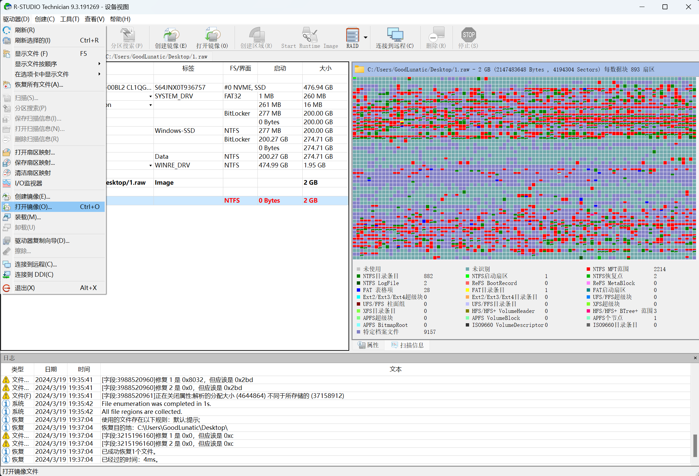

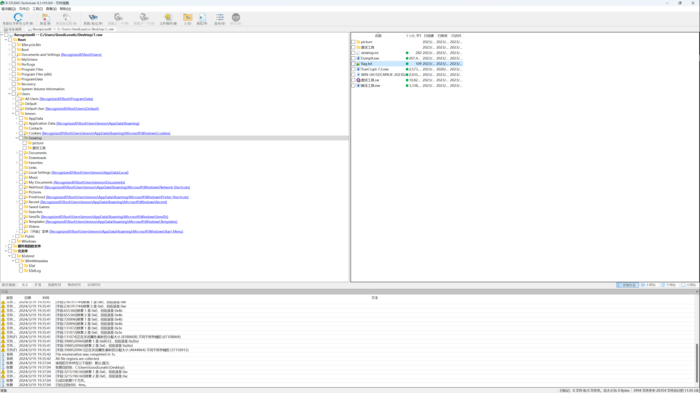

拿到内存镜像后也可以先用`PasswareKit`先扫描一下密码

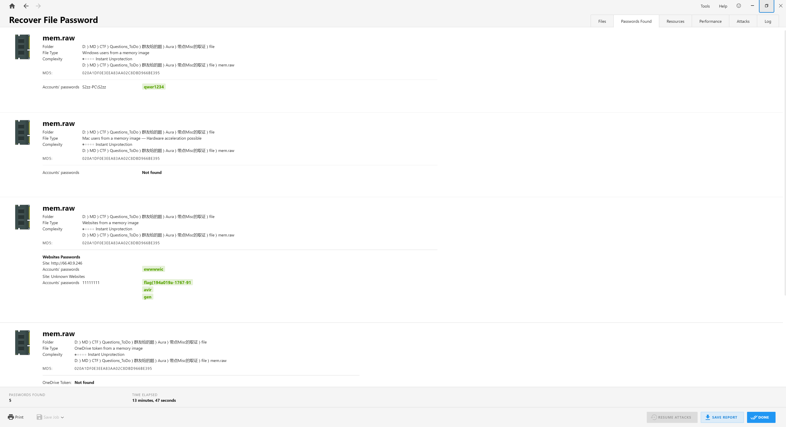


vol.py --info 可以查看插件

```bash
#官方WIKI
https://github.com/volatilityfoundation/volatility/wiki
#点击右侧的Command References来查看具体参数的用法
```

### Windows内存取证

不是Windows10的内存镜像的话可以直接用 Vol_all_in_one 一键分析

取证过程中一定要记得查看镜像桌面上的文件！

#### Volatility2

~~~bash
# 识别操作系统的基本信息
vol.py mem.dump imageinfo
# 查看进程
vol.py -f OtterCTF.vmem --profile=Win7SP1x64 pslist
# 查看隐藏或者解链的进程
vol.py -f OtterCTF.vmem --profile=Win7SP1x64 pstree
# 通过memdump爆破出进程对应的信息
vol.py -f OtterCTF.vmem --profile=Win7SP1x64 memdump -p 3036 --dump-dir=./
# 扫描镜像中的服务
vol.py --plugins=/home/kali/volatility/volatility/plugins -f mem.raw --profile=Win7SP1x64 svcscan
# 扫描进程缓存的文件
vol.py -f memory.raw --profile=Win7SP1x64 filescan
# 查找特定后缀的文件
vol.py -f example.raw --profile=Win7SP1x64 filescan | grep -E &#39;txt|png|jpg|gif|zip|rar|7z|pdf|doc&#39;
# 查找指定文件夹下的文件
volatility -f example.raw --profile=Win7SP1x64 filescan | grep TMP_User
# 使用dumpfiles爆破文件内容（有时可能会出现vol2提取不了但是vol3可以的情况，也可以使用 R-stdio 工具提取）
vol.py -f OtterCTF.vmem --profile=Win7SP1x64 dumpfiles -Q 0x000000007e410890 --dump-dir=./
# 查看进程环境变量
vol.py -f memory.raw --profile=Win7SP1x64 envars
# 扫描进程命令行参数
vol.py -f memory.raw --profile=Win7SP1x64 cmdscan
vol.py -f memory.raw --profile=Win7SP1x64 cmdline
# 扫描动态库列表
# 可使用-p参数指定PID号
vol.py -f memory.img --profile=Win2003SP1x86 dlllist
vol.py -f memory.img --profile=Win2003SP1x86 ldrmodules
# 扫描系统中的恶意软件
vol.py -f memory.img --profile=Win2003SP1x86 malfind
# 查看当前镜像中的用户
vol.py --plugins=/home/kali/volatility/volatility/plugins -f mem.raw --profile=Win7SP1x64 printkey -K &#34;SAM\Domains\Account\Users\Names&#34;
# 查看镜像中的用户名和密码(hash值)
vol.py -f OtterCTF.vmem --profile=Win7SP1x64 hashdump
# 使用mimikatz插件快速获取用户密码
vol.py --plugins=/home/kali/volatility/volatility/plugins -f mem.dump --profile=Win7SP1x64 mimikatz
# 扫描注册表数据
# 查看注册表配置单元
vol.py -f memory.raw --profile=Win7SP1x64 hivelist
# 查看注册表键值
vol.py -f OtterCTF.vmem --profile=Win7SP1x64 printkey
# 查看注册表键名
vol.py -f memory.raw --profile=Win7SP1x64 hivedump -o 0xfffff8a001cce010(注册表Volatility地址)
# 查看网络连接状态
vol.py -f memory.raw --profile=Win7SP1x64 connscan
vol.py --plugins=/home/kali/volatility/volatility/plugins -f mem.raw --profile=Win7SP1x64 netscan
vol.py --plugins=/home/kali/volatility/volatility/plugins -f mem.raw --profile=Win7SP1x64 connections
# 查看浏览器历史记录
vol.py -f 1.vmem --profile=Win7SP1x64 iehistory
# 显示有关编辑控件的信息
vol.py -f 1.vmem --profile=Win7SP1x64 editbox
# 查看当前展示的notepad的内容
vol.py -f 1.vmem --profile=Win7SP1x64 notepad
# 获取屏幕截图
vol.py -f 1.vmem --profile=Win7SP1x64 screenshot --dump-dir=./
# 查看剪贴板信息
vol.py -f 1.vmem --profile=Win7SP1x64 clipboard
# 查看剪贴板信详细内容
vol.py -f 1.vmem --profile=Win7SP1x64 clipboard -v
# 查看运行程序相关的记录，比如最后一次更新时间，运行过的次数等
vol.py -f 1.vmem --profile=Win7SP1x64 userassist
# 最大程序提取信息
vol.py -f 1.vmem --profile=Win7SP1x64 timeliner
# 恢复被删除的文件
vol.py -f 1.vmem --profile=Win7SP1x64 mftparser
# 使用ndispktscan插件搜索内核的网络流量包信息
vol.py --plugins=/home/kali/volatility/volatility/plugins -f OtterCTF.vmem --profile=Win7SP1x64 ndispktscan
# 使用usbstor插件获取USB连接信息
vol.py --plugins=/home/kali/volatility/volatility/plugins -f OtterCTF.vmem --profile=Win7SP1x64 usbstor
# 使用VolDiff进行恶意软件检测
vol.py --plugins=/home/kali/volatility/volatility/plugins -f OtterCTF.vmem --profile=Win7SP1x64 voldiff
# 使用bitlocker插件获取Bitlocker的加密密钥
vol.py --plugins=/home/kali/volatility/volatility/plugins -f OtterCTF.vmem --profile=Win7SP1x64 bitlocker
~~~

#### Volatility3

识别内存的系统版本（这个有时候vol3识别不出来，但是vol2可以）

```bash
vol3.py -f dacong.raw banners.Banners
```

如果是windows10的内存镜像的话，vol2的某些功能可能用不了，因此需要vol3（例：2023 安洵杯 dacongのWindows）

```bash
# 查看命令
vol3.py -h
# 扫描镜像中的文件
vol3.py -f dacong.raw windows.filescan
# 查看桌面上的文件
vol3.py -f dacong.raw windows.filescan | grep Desktop
# 提取文件
vol3.py -f mem.raw windows.dumpfiles --virtaddr=&#34;0x0000e0007ad17f20&#34;
# 扫描注册表（感觉这个功能vol2的更好）
vol3.py -f dacong.raw windows.registry.printkey
vol3.py -f dacong.raw windows.registry.hivelist
# 扫描命令行记录
vol3.py -f dacong.raw windows.cmdline
# 查看网络使用状态、端口占用状态
vol3.py -f dacong.raw windows.netscan
vol3.py -f dacong.raw windows.netstat
# 查看系统中的进程
vol3.py -f dacong.raw windows.pslist
vol3.py -f dacong.raw windows.pstree
```

**一些特殊进程**

便签：StikyNot.exe （.snt 文件路径在C:\Users\XXX\AppData\Roaming\Microsoft\Sticky Notes\）【这个文件需要用Win7的便签或者记事本打开】

画图：mspaint.exe（这个进程可以用 `memdump -p &lt;PID&gt; --dump-dir=./` 导出 dmp 文件，然后改后缀为.data拖入Gimp中调整位移和分辨率，例：2024 NKCTF）

联系人：wab.exe （.contact 文件）

**一些特殊文件**

evtx - Windows系统日志

dat - 无法导出可以加上 -u 参数：volatility -f mem.data dumpfiles -r pdf$ -i --name -D dumpfiles/ -u

### Linux内存取证

&gt; Linux内存取证这一块，网上的教程大都比较乱，因此打算自己好好写一篇教程

取证过程中一定要记得查看镜像桌面上的文件！

不论是制作vol2还是vol3的符号文件，都可以先用vol3确定一下内存镜像的版本

```bash
python3 volatility3/vol.py -f Ez_Linux.mem banner

Volatility 3 Framework 2.26.2
Progress:  100.00		PDB scanning finished
Offset	Banner

0x536001a0	Linux version 5.4.0-100-generic (buildd@lcy02-amd64-002) (gcc version 9.3.0 (Ubuntu 9.3.0-17ubuntu1~20.04)) #113-Ubuntu SMP Thu Feb 3 18:43:29 UTC 2022 (Ubuntu 5.4.0-100.113-generic 5.4.166)
0x5459fe14	Linux version 5.4.0-100-generic (buildd@lcy02-amd64-002) (gcc version 9.3.0 (Ubuntu 9.3.0-17ubuntu1~20.04)) #113-Ubuntu SMP Thu Feb 3 18:43:29 UTC 2022 (Ubuntu 5.4.0-100.113-generic 5.4.166)
0x7272ccc8	Linux version 5.4.0-100-generic (buildd@lcy02-amd64-002) (gcc version 9.3.0 (Ubuntu 9.3.0-17ubuntu1~20.04)) #113-Ubuntu SMP Thu Feb 3 18:43:29 UTC 2022 (Ubuntu 5.4.0-100.113-generic 5.4.166)
0x7bd00010	Linux version 5.4.0-100-generic (buildd@lcy02-amd64-002) (gcc version 9.3.0 (Ubuntu 9.3.0-17ubuntu1~20.04)) #113-Ubuntu SMP Thu Feb 3 18:43:29 UTC 2022 (Ubuntu 5.4.0-100.113-generic 5.4.166)
```

#### 制作  Profile(Vol2)  的详细过程

&gt; 由于官方的vol2自带的一些原因，原版的vol2不支持Ubuntu22.04及以上版本Profile的制作及使用，但是可以根据以下参考链接对vol2进行一些修改，以便对Ubuntu22.04及以上版本提供支持
&gt; 参考链接：
&gt; 
&gt; https://treasure-house.randark.site/blog/2023-10-25-MemoryForensic-Test
&gt; 
&gt; https://github.com/volatilityfoundation/volatility/issues/828
&gt; 
&gt; https://github.com/volatilityfoundation/volatility/pull/852

**在自己动手制作Profile前，可以先去这个仓库找找有没有已经做好的 [Github](https://github.com/volatilityfoundation/profiles/tree/master/Linux)**

**如果很遗憾找不到需要的Profile，就需要进行下面的步骤，自己手动制作Profile了**

一个vol2的Profile的结构如下：其实一共就两个文件（system.map以及module.dwarf）

```bash
├── Ubuntu_5.4.0-100_5.4.0-100.113
│   ├── module.dwarf
│   └── System.map-5.4.0-100-generic
```

将 `module.dwarf` 和 `System.map` 用deflate压缩算法压缩成一个zip压缩包放到`volatility/volatility/plugins/overlays/linux`目录下即可

因为懒得用Vmware虚拟机，所以我这里就用Docker来制作Profile了

为了帮助读者理解Profile的制作过程，我就举了下面这几个例子

**制作模版已开源在 [goodlunatic/Docker-ProfileMaker-vol2](https://github.com/goodlunatic/Docker-ProfileMaker-vol2)**

**这里制作的所有符号文件都已开源在 [goodlunatic/Profile-and-SymbolTables-For-Volatility](https://github.com/goodlunatic/Profile-and-SymbolTables-For-Volatility)**

##### 2023 强网杯-你找到PNG了吗(Ubuntu20.04)

&gt; Linux version 5.4.0-100-generic (buildd@lcy02-amd64-002) (gcc version 9.3.0 (Ubuntu 9.3.0-17ubuntu1~20.04)) #113-Ubuntu SMP Thu Feb 3 18:43:29 UTC 2022 (Ubuntu 5.4.0-100.113-generic 5.4.166)

用Docker制作镜像一共需要以下几个文件，部分文件可以到下面这个链接中下载：

https://mirrors.ustc.edu.cn/ubuntu/pool/main/l/linux/

```bash
├── dockerfile
└── src
    ├── linux-headers-5.4.0-100_5.4.0-100.113_all.deb
    ├── linux-headers-5.4.0-100-generic_5.4.0-100.113_amd64.deb
    ├── linux-modules-5.4.0-100-generic_5.4.0-100.113_amd64.deb
    └── tools.zip
# dockerfile是自己写的用于构建Docker镜像的脚本
# tools.zip 是从 volatility/tools 保存并压缩的
# linux-headers-5.4.0-100_5.4.0-100.113_all.deb 是通用内核头文件
# linux-headers-5.4.0-100-generic_5.4.0-100.113_amd64.deb 是特定架构的内核头文件
# linux-modules-5.4.0-100-generic_5.4.0-100.113_amd64.deb 是内核模块包
```

首先我们要去解压内核模块包：linux-modules-5.4.0-100-generic_5.4.0-100.113_amd64.deb

从 `data/boot/System.map-5.4.0-100-generic` 提取system.map

然后编写以下dockerfile构建镜像

```dockerfile
FROM ubuntu:20.04

# 将环境设置为非交互环境
ENV DEBIAN_FRONTEND=noninteractive

COPY ./src/ /src/

RUN sed -i &#39;s/archive.ubuntu.com/mirrors.ustc.edu.cn/g&#39; /etc/apt/sources.list \
    &amp;&amp; sed -i &#39;s/security.ubuntu.com/mirrors.ustc.edu.cn/g&#39; /etc/apt/sources.list \
	&amp;&amp; apt update --no-install-recommends \
    &amp;&amp; apt install -y gcc dwarfdump build-essential unzip kmod linux-base

WORKDIR /src

RUN unzip tools.zip \
    # 需要根据实际的内核版本修改此处
    &amp;&amp; dpkg -i linux-headers-5.4.0-100_5.4.0-100.113_all.deb \
    &amp;&amp; dpkg -i linux-headers-5.4.0-100-generic_5.4.0-100.113_amd64.deb

WORKDIR /src/tools/linux

RUN echo &#39;MODULE_LICENSE(&#34;GPL&#34;);&#39; &gt;&gt; module.c &amp;&amp; \
    # 需要根据实际的内核版本修改此处
    sed -i &#39;s/$(shell uname -r)/5.4.0-100-generic/g&#39; Makefile &amp;&amp; \
    make &amp;&amp; \
    mv module.dwarf /tmp
```

```bash
# 运行以下命令构建并运行容器，并把module.dwarf从/tmp目录中复制出来
# 我这里由于用的是ARM架构的Macbook，所以需要指定平台，x86的设备可以不写
docker build --platform linux/amd64 -t profile .
docker run --platform linux/amd64 --rm -it profile /bin/bash
```

这里如果不想敲命令行去复制Docker容器中/tmp目录下的module.dwarf，也可以使用vscode的Docker插件或者Docker-Desktop辅助

最后我们将 `module.dwarf` 和 `System.map` 用deflate压缩算法压缩成一个zip压缩包放到`volatility/volatility/plugins/overlays/linux`目录下即可

可以使用 `vol.py --info` 命令查看 Profile 是否能被成功识别

##### 2023 0xGame oh-my-linux(Debian10.2)

&gt; Linux version 5.10.0-21-amd64 (debian-kernel@lists.debian.org) (gcc-10 (Debian 10.2.1-6) 10.2.1 20210110, GNU ld (GNU Binutils for Debian) 2.35.2) #1 SMP Debian 5.10.162-1 (2023-01-21)

内核文件下载链接：

https://debian.sipwise.com/debian-security/pool/main/l/linux/

制作这个Profile需要以下这几个文件

```bash
├── dockerfile
└── src
    ├── linux-headers-5.10.0-21-amd64_5.10.162-1_amd64.deb
    ├── linux-headers-5.10.0-21-common_5.10.162-1_all.deb
    ├── linux-image-5.10.0-21-amd64-dbg_5.10.162-1_amd64.deb
    └── tools.zip
```


首先我们需要从 `linux-image-5.10.0-21-amd64-dbg_5.10.162-1_amd64.deb` 获取system.map

```
linux-image-5.10.0-21-amd64-dbg_5.10.162-1_amd64\data\usr\lib\debug\boot\System.map-5.10.0-21-amd64
```

如果从`linux-image-5.10.0-21-amd64-unsigned_5.10.162-1_amd64.deb`中获取system.map

我们会看到如下内容，很明显这个system.map是没法用的：

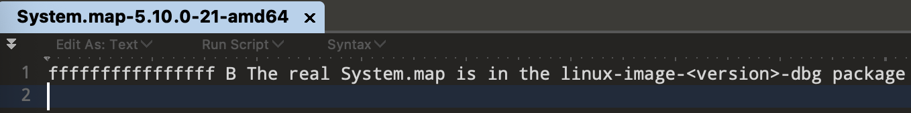

```dockerfile
# 因为debian10.2中科大源停止维护了，所以改用debian11.2
FROM debian:11.2

# 将环境设置为非交互环境
ENV DEBIAN_FRONTEND=noninteractive

COPY ./src/ /src/

RUN sed -i &#39;s/deb.debian.org/mirrors.ustc.edu.cn/g&#39; /etc/apt/sources.list \
    &amp;&amp; sed -i &#39;s/security.debian.org/mirrors.ustc.edu.cn/g&#39; /etc/apt/sources.list \
	&amp;&amp; apt update --no-install-recommends\
    &amp;&amp; apt install -y gcc dwarfdump build-essential unzip linux-kbuild-5.10 linux-compiler-gcc-10-x86

WORKDIR /src

RUN unzip tools.zip \
    # 需要根据实际的内核版本修改此处
    # 内核包存在依赖关系，安装时需要注意顺序
    &amp;&amp; dpkg -i linux-headers-5.10.0-21-common_5.10.162-1_all.deb \
    &amp;&amp; dpkg -i linux-headers-5.10.0-21-amd64_5.10.162-1_amd64.deb
    

WORKDIR /src/tools/linux

RUN echo &#39;MODULE_LICENSE(&#34;GPL&#34;);&#39; &gt;&gt; module.c &amp;&amp; \
    # 需要根据实际的内核版本修改此处
    sed -i &#39;s/$(shell uname -r)/5.10.0-21-amd64/g&#39; Makefile &amp;&amp; \
    make &amp;&amp; \
    mv module.dwarf /tmp
```

```bash
# 运行以下命令构建并运行容器，并把module.dwarf从/tmp目录中复制出来
# 我这里由于用的是ARM架构的Macbook，所以需要指定平台，x86的设备可以不写
docker build --platform linux/amd64 -t profile .
docker run --platform linux/amd64 --rm -it profile /bin/bash
```

最后将 `module.dwarf` 和 `System.map` 用deflate压缩算法压缩成一个zip压缩包放到`volatility/volatility/plugins/overlays/linux`目录下即可

可以使用 `vol.py --info` 命令查看 Profile 是否能被成功识别

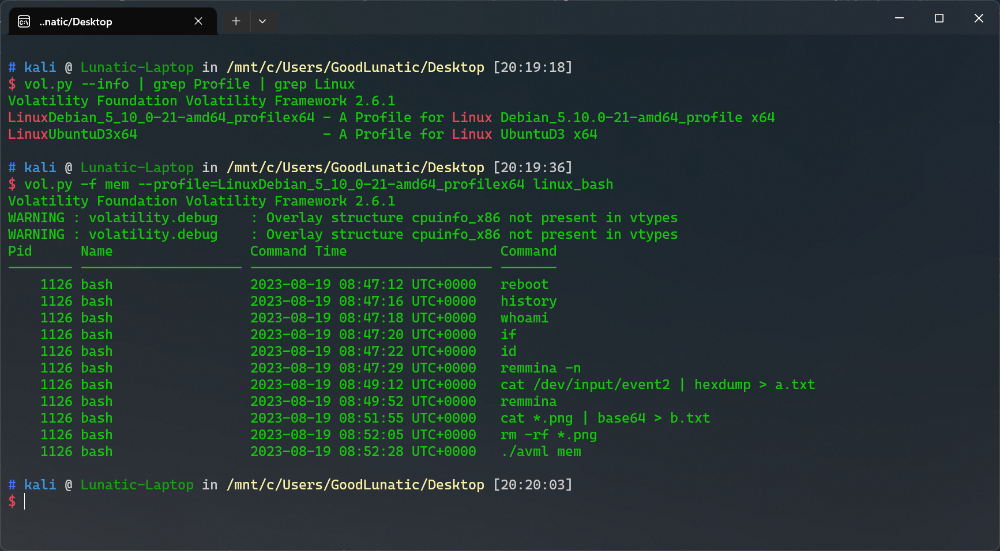

##### 安恒某比赛 flag\^galf(Ubuntu16.04)

&gt; Linux version 4.13.0-36-generic (buildd@lgw01-amd64-033) (gcc version 5.4.0 20160609 (Ubuntu 5.4.0-6ubuntu1~16.04.9)) #40~16.04.1-Ubuntu SMP Fri Feb 16 23:25:58 UTC 2018 (Ubuntu 4.13.0-36.40~16.04.1-generic 4.13.13)

```bash
├── linux-headers-4.13.0-36_4.13.0-36.40~16.04.1_all.deb
├── linux-headers-4.13.0-36-generic_4.13.0-36.40~16.04.1_amd64.deb
├── linux-image-4.13.0-36-generic_4.13.0-36.40~16.04.1_amd64.deb
└── tools.zip
```

从`linux-image-4.13.0-36-generic_4.13.0-36.40~16.04.1_amd64.deb`中提取system.map

```dockerfile
FROM ubuntu:16.04

# 将环境设置为非交互环境
ENV DEBIAN_FRONTEND=noninteractive

COPY ./src/ /src/

RUN sed -i &#39;s/archive.ubuntu.com/mirrors.ustc.edu.cn/g&#39; /etc/apt/sources.list \
    &amp;&amp; sed -i &#39;s/security.ubuntu.com/mirrors.ustc.edu.cn/g&#39; /etc/apt/sources.list \
	&amp;&amp; apt update --no-install-recommends \
    &amp;&amp; apt install -y gcc dwarfdump build-essential unzip kmod linux-base libssl1.0.0

WORKDIR /src

RUN unzip tools.zip \
    # 需要根据实际的内核版本修改此处
    &amp;&amp; dpkg -i linux-headers-4.13.0-36_4.13.0-36.40~16.04.1_all.deb \
    &amp;&amp; dpkg -i linux-headers-4.13.0-36-generic_4.13.0-36.40~16.04.1_amd64.deb

WORKDIR /src/tools/linux

RUN echo &#39;MODULE_LICENSE(&#34;GPL&#34;);&#39; &gt;&gt; module.c &amp;&amp; \
    # 需要根据实际的内核版本修改此处
    sed -i &#39;s/$(shell uname -r)/4.13.0-36-generic/g&#39; Makefile &amp;&amp; \
    make &amp;&amp; \
    mv module.dwarf /tmp
```

#### 制作  symbols(Vol3)  的详细过程

一个vol3的SymbolTables其实就是一个json文件

因为懒得用Vmware虚拟机，所以我这里就用Docker来制作SymbolTables了

为了帮助读者理解SymbolTables的制作过程，我就举了下面这几个例子

**制作模版已开源在 

**这里制作的所有符号文件都已开源在 [goodlunatic/Profile-and-SymbolTables-For-Volatility](https://github.com/goodlunatic/Profile-and-SymbolTables-For-Volatility)**

##### 安恒某比赛 flag\^galf(Ubuntu16.04)

&gt; Linux version 4.13.0-36-generic (buildd@lgw01-amd64-033) (gcc version 5.4.0 20160609 (Ubuntu 5.4.0-6ubuntu1~16.04.9)) #40~16.04.1-Ubuntu SMP Fri Feb 16 23:25:58 UTC 2018 (Ubuntu 4.13.0-36.40~16.04.1-generic 4.13.13)

内核相关文件可以到下面这个网址中下载：

https://launchpad.net/~canonical-kernel-team/&#43;archive/ubuntu/ppa/&#43;build/14361744

```bash
├── dockerfile
└── src
    ├── dwarf2json
    └── linux-image-4.13.0-36-generic-dbgsym_4.13.0-36.40~16.04.1_amd64.ddeb
```

```dockerfile
FROM ubuntu:16.04

# 将环境设置为非交互环境
ENV DEBIAN_FRONTEND=noninteractive

COPY ./src/ /src/

RUN sed -i &#39;s/archive.ubuntu.com/mirrors.ustc.edu.cn/g&#39; /etc/apt/sources.list \
    &amp;&amp; sed -i &#39;s/security.ubuntu.com/mirrors.ustc.edu.cn/g&#39; /etc/apt/sources.list \
	&amp;&amp; apt update --no-install-recommends\
    &amp;&amp; apt install -y gcc dwarfdump build-essential unzip libssl1.0.0

WORKDIR /src

RUN dpkg -i linux-image-4.13.0-36-generic-dbgsym_4.13.0-36.40~16.04.1_amd64.ddeb \
    &amp;&amp; chmod &#43;x dwarf2json \
    # 下面这里的文件名需要根据系统版本进行修改，具体文件名可以通过解压上面的ddeb包得到
    &amp;&amp; ./dwarf2json linux --elf /usr/lib/debug/boot/vmlinux-4.13.0-36-generic &gt; linux-image-4.13.0-36-generic.json \
    &amp;&amp; mv linux-image-4.13.0-36-generic.json /tmp
```

```bash
# 运行以下命令构建并运行容器，并把module.dwarf从/tmp目录中复制出来
# 我这里由于用的是ARM架构的Macbook，所以需要指定平台，x86的设备可以不写
docker build --platform linux/amd64 -t profile .
docker run --platform linux/amd64 --rm -it profile /bin/bash
```

最后将得到的 json文件放到 volatility3/volatility3/framework/symbols/linux/ 目录下即可

##### 2023 强网杯-你找到PNG了吗(Ubuntu20.04)

&gt; Linux version 5.4.0-100-generic (buildd@lcy02-amd64-002) (gcc version 9.3.0 (Ubuntu 9.3.0-17ubuntu1~20.04)) #113-Ubuntu SMP Thu Feb 3 18:43:29 UTC 2022 (Ubuntu 5.4.0-100.113-generic 5.4.166)

```bash
├── dockerfile
└── src
    ├── dwarf2json
    └── linux-image-unsigned-5.4.0-100-generic-dbgsym_5.4.0-100.113_amd64.ddeb
```

```dockerfile
FROM ubuntu:20.04

# 将环境设置为非交互环境
ENV DEBIAN_FRONTEND=noninteractive

COPY ./src/ /src/

RUN sed -i &#39;s/archive.ubuntu.com/mirrors.ustc.edu.cn/g&#39; /etc/apt/sources.list \
    &amp;&amp; sed -i &#39;s/security.ubuntu.com/mirrors.ustc.edu.cn/g&#39; /etc/apt/sources.list \
	&amp;&amp; apt update --no-install-recommends\
    &amp;&amp; apt install -y gcc dwarfdump build-essential unzip

WORKDIR /src

RUN dpkg -i linux-image-unsigned-5.4.0-100-generic-dbgsym_5.4.0-100.113_amd64.ddeb  \
    &amp;&amp; chmod &#43;x dwarf2json \
    # 下面这里的文件名需要根据系统版本进行修改，具体文件名可以通过解压上面的ddeb包得到
    &amp;&amp; ./dwarf2json linux --elf /usr/lib/debug/boot/vmlinux-5.4.0-100-generic &gt; Ubuntu_5.4.0-100-generic.json \
    &amp;&amp; mv Ubuntu_5.4.0-100-generic.json /tmp
```

##### 2023 0xGame oh-my-linux(Debian10.2)

&gt; Linux version 5.10.0-21-amd64 (debian-kernel@lists.debian.org) (gcc-10 (Debian 10.2.1-6) 10.2.1 20210110, GNU ld (GNU Binutils for Debian) 2.35.2) #1 SMP Debian 5.10.162-1 (2023-01-21)

内核文件下载链接：

https://debian.sipwise.com/debian-security/pool/main/l/linux/

```bash
├── dockerfile
└── src
    ├── dwarf2json
    └── linux-image-5.10.0-21-amd64-dbg_5.10.162-1_amd64.deb
```

```dockerfile
# 因为debian10.2中科大源停止维护了，所以改用debian11.2
FROM debian:11.2

# 将环境设置为非交互环境
ENV DEBIAN_FRONTEND=noninteractive

COPY ./src/ /src/

RUN sed -i &#39;s/deb.debian.org/mirrors.ustc.edu.cn/g&#39; /etc/apt/sources.list \
    &amp;&amp; sed -i &#39;s/security.debian.org/mirrors.ustc.edu.cn/g&#39; /etc/apt/sources.list \
	&amp;&amp; apt update --no-install-recommends\
    &amp;&amp; apt install -y gcc dwarfdump build-essential unzip linux-kbuild-5.10 linux-compiler-gcc-10-x86
    
WORKDIR /src

RUN dpkg -i linux-image-5.10.0-21-amd64-dbg_5.10.162-1_amd64.deb  \
    &amp;&amp; chmod &#43;x dwarf2json \
    # 下面这里的文件名需要根据系统版本进行修改，具体文件名可以通过解压上面的ddeb包得到
    &amp;&amp; ./dwarf2json linux --elf /usr/lib/debug/boot/vmlinux-5.10.0-21-amd64 &gt; Debian_5.10.0-21-amd64.json \
    &amp;&amp; mv Debian_5.10.0-21-amd64.json /tmp
```


#### Volatility2相关命令

**[官方文档](https://github.com/volatilityfoundation/volatility/wiki/Linux-Command-Reference)**

```bash
# 查看Profile是否载入成功
vol.py --info | grep Profile | grep Linux
# 查看内核和发行版信息
vol.py -f mem --profile=LinuxDebian_5_10_0-21-amd64_profilex64 linux_banner
# 查看命令行记录
vol.py -f mem --profile=LinuxDebian_5_10_0-21-amd64_profilex64 linux_bash
# 查看桌面上的文件
vol.py -f 1.mem --profile=LinuxUbuntu_5_4_0-100-amd64_profilex64 linux_find_file -L | grep &#34;Desktop&#34;
# 提取文件
vol.py -f 1.mem --profile=LinuxUbuntu_5_4_0-100-amd64_profilex64 linux_find_file -i 0xffff9ce28fe300e8 -O
# 恢复文件系统
sudo python2 ~/volatility/vol.py -f mem --profile=LinuxUbuntu_5_4_0-100-amd64_profilex64 linux_recover_filesystem --dump-dir=./
# 查看进程
vol.py -f mem --profile=LinuxDebian_5_10_0-21-amd64_profilex64 linux_pslist
# 查看进程打开的文件
vol.py -f mem --profile=LinuxDebian_5_10_0-21-amd64_profilex64 linux_lsof
# 查看正在运行的进程
vol.py -f mem --profile=LinuxDebian_5_10_0-21-amd64_profilex64 linux_psaux
# 查看网络状态
vol.py -f mem --profile=LinuxDebian_5_10_0-21-amd64_profilex64 linux_netstat
# 查看挂载了哪些文件系统
vol.py -f mem --profile=LinuxDebian_5_10_0-21-amd64_profilex64 linux_mount
# 查看已加载的内核模块
vol.py -f mem --profile=LinuxDebian_5_10_0-21-amd64_profilex64 linux_lsmod
# 查看隐藏的内核模块
vol.py -f mem --profile=LinuxDebian_5_10_0-21-amd64_profilex64 linux_hidden_modules
# 查看可疑的进程
vol.py -f mem --profile=LinuxDebian_5_10_0-21-amd64_profilex64 linux_malfind
# 恢复Truecrypt密钥(需要yara模块，然后使用上可能有点问题)
vol.py -f mem --profile=LinuxDebian_5_10_0-21-amd64_profilex64 linux_truecrypt_passphrase
# 在内存转储中打开一个shell
vol.py -f mem --profile=LinuxDebian_5_10_0-21-amd64_profilex64 linux_volshell -v

Volatility Foundation Volatility Framework 2.6.1
WARNING : volatility.debug    : Overlay structure cpuinfo_x86 not present in vtypes
WARNING : volatility.debug    : Overlay structure cpuinfo_x86 not present in vtypes
Current context: process systemd, pid=1 DTB=0x2080000
Welcome to volshell! Current memory image is:
file:///mnt/c/Users/GoodLunatic/Desktop/1/mem
To get help, type &#39;hh()&#39;
&gt;&gt;&gt; hh()

Use addrspace() for Kernel/Virtual AS
Use addrspace().base for Physical AS
Use proc() to get the current process object
  and proc().get_process_address_space() for the current process AS
  and proc().get_load_modules() for the current process DLLs

addrspace()                              : Get the current kernel/virtual address space.
cc(offset=None, pid=None, name=None, physical=False) : Change current shell context.
db(address, length=128, space=None)      : Print bytes as canonical hexdump.
dd(address, length=128, space=None)      : Print dwords at address.
dis(address, length=128, space=None, mode=None) : Disassemble code at a given address.
dq(address, length=128, space=None)      : Print qwords at address.
dt(objct, address=None, space=None, recursive=False, depth=0) : Describe an object or show type info.
find(needle, max=1, shift=0, skip=0, count=False, length=128) :
getmods()                                : Generator for kernel modules (scripting).
getprocs()                               : Generator of process objects (scripting).
hh(cmd=None)                             : Get help on a command.
list_entry(head, objname, offset=-1, fieldname=None, forward=True, space=None) : Traverse a _LIST_ENTRY.
modules()                                : Print loaded modules in a table view.
proc()                                   : Get the current process object.
ps()                                     : Print active processes in a table view.
sc()                                     : Show the current context.
For help on a specific command, type &#39;hh(&lt;command&gt;)&#39;
```

#### Volatility3相关命令

```bash
	# 查看当前都有哪些 Profile 可用
	vol3.py IsfInfo | grep linux
	# 查看bash历史记录
	vol3.py -f 1.mem linux.bash
	# 扫描进程
	vol3.py -f 1.mem linux.pslist
	# 列出子进程
	vol3.py -f 1.mem linux.pstree
	
    linux.bash.Bash     Recovers bash command history from memory.
    linux.capabilities.Capabilities
                        Lists process capabilities
    linux.check_afinfo.Check_afinfo
                        Verifies the operation function pointers of network protocols.
    linux.check_creds.Check_creds
                        Checks if any processes are sharing credential structures
    linux.check_idt.Check_idt
                        Checks if the IDT has been altered
    linux.check_modules.Check_modules
                        Compares module list to sysfs info, if available
    linux.check_syscall.Check_syscall
                        Check system call table for hooks.
    linux.elfs.Elfs     Lists all memory mapped ELF files for all processes.
    linux.envars.Envars
    linux.envvars.Envvars
                        Lists processes with their environment variables
    linux.iomem.IOMem   Generates an output similar to /proc/iomem on a running system.
    linux.keyboard_notifiers.Keyboard_notifiers
                        Parses the keyboard notifier call chain
    linux.kmsg.Kmsg     Kernel log buffer reader
    linux.lsmod.Lsmod   Lists loaded kernel modules.
    linux.lsof.Lsof     Lists all memory maps for all processes.
    linux.malfind.Malfind
                        Lists process memory ranges that potentially contain injected code.
    linux.mountinfo.MountInfo
                        Lists mount points on processes mount namespaces
    linux.proc.Maps     Lists all memory maps for all processes.
    linux.psaux.PsAux   Lists processes with their command line arguments
    linux.pslist.PsList
                        Lists the processes present in a particular linux memory image.
    linux.psscan.PsScan
                        Scans for processes present in a particular linux image.
    linux.pstree.PsTree
                        Plugin for listing processes in a tree based on their parent process ID.
    linux.sockstat.Sockstat
                        Lists all network connections for all processes.
    linux.tty_check.tty_check
                        Checks tty devices for hooks
```

### MacOS内存取证

#### Volatility2


#### Volatility3


### 识别不出内存镜像版本的取证

直接使用 010 手搓或者用 Strings 命令把可打印字符保存到文本文件中再手搓

需要从内存中找到 AES 解密的 key 的情况：可以使用 findaes.exe 工具辅助查找

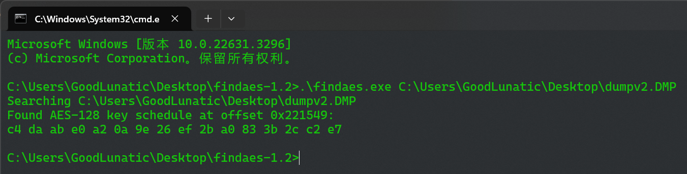

### 用来制作内存镜像的工具

1、Volatility
2、FTK Imager
3、Magnet RAM Capture
4、Belkasoft Live RAM Capturer
5、WinPMEM
6、Rekall
7、DumpIt
8、OSForensics

### dmp文件

1、拉入Passware Kit Forensic-Memory Analysis进行分析（用户名和密码）

2、使用vol分析

### lsass.DMP文件

直接使用`mimikatz`或者`pypykatz`分析
```bash
sekurlsa::minidump lsass.dmp
sekurlsa::logonpasswords
```

```bash
pypykatz lsa minidump lsass.DMP
```
### dump文件

```
&#34;dmp&#34; 通常特指 Windows 的崩溃转储文件，而 &#34;dump&#34; 是一个更为通用的术语，可以用于描述各种数据转储操作或文件。
```

取证方法大致和dmp文件相同

### mem文件

```bash
vol.py -f mem imageinfo
```

### raw文件

可以直接使用 vol2 或者 vol3 进行内存取证

## 磁盘取证

Tips：1、同一个镜像文件，不同的密码可以挂载出不同的盘，里面的数据也不同

### VeraCrypt

&gt; 同一个VC加密卷，使用不同的密钥或者密钥文件，加载出来的卷可能不一样(存在隐藏卷的情况)

例题1-DASCTF-2024最后一战 1z_F0r3ns1cs_1

解密&amp;挂载磁盘的步骤：

1.选择要挂载的加密盘，然后选择一个没有被占用的盘符再点击左下角的加载

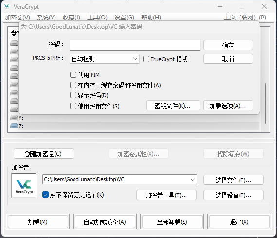

2.输入加密盘的密钥，或者直接使用密钥文件(图片文件也可以)

​	如果这里加载失败，可以点击下面的加密卷工具，把密钥给改了，然后使用自己更改后的密钥挂载

3.如果不知道解密的密钥，也可以尝试用 `Forensics Passware Kit` 进行爆破


### 取证大师

没啥好说的，直接把硬盘镜像文件拉进去梭就行

### fat文件

```
FAT格式： 即FAT16,这是MS－DOS和最早期的Win 95操作系统中最常见的磁盘分区格式。它采用16位的文件分配表，能支持最大为2GB的分区，几乎所有的操作系统都支持这一种格式。
```

1、可以使用veracrypt挂载到本地，然后用资源管理器打开

2、如果挂载后资源管理器打不开，可以使用winhex-工具-打开磁盘查看

### VMDK文件

可以用Imdisk挂载到本地

1、可以使用Diskgenius-磁盘-打开虚拟磁盘文件

2、可以使用Imdisk挂载到本地，然后用everything进行搜索

3、可以使用7zip打开然后解压缩

4、可以使用FTK、Vera挂载 

5、如果Linux虚拟机不知道密码，可以尝试单用户修改密码

&gt; 开机长按shift进入GRUB，选择advanced options for ubuntu
&gt; 
&gt; 选择recoverymode，进入菜单选择root，然后press enter
&gt; 
&gt; 输入passwd you_passwd，输入密码，重启(reboot)

### E01文件

1、若有BitLocker加密并提供了内存镜像，就拉入Passware Kit Forensic-Decrypt Disk-BitLocker进行爆破解密

​	  解密后会得到一个G-decrypted.dd，然后用 FTK image 打开

2、提供的 E01 文件可能有好几部分，BitLocker加密的密钥可能藏在其中一部分中，建议用 FTK image 查看一下

​	  FTK image 直接提取文件可能会有点问题（加密压缩包、根目录文件看不到），建议还是直接 mount 到本地然后再提取

3、可以使用`AutoPsy`辅助进行取证，尤其在进行注册表`\Windows\System32\config`分析的时候

例题1-2024国城杯-Just_F0r3n51Cs

### ad1文件

ad1文件是用 FTKimage 制作的磁盘镜像，因此可以使用 FTKimage 进行挂载

### vhd文件

vhd 是 Virtual Hard Disk 虚拟磁盘的缩写，是一种用于存储虚拟机磁盘镜像的文件格式

1、可以在 Windows 系统下直接挂载，也可以拉入 DiskGenius  打开查看

2、如果显示有BitLocker加密，可以先用`x-ways Forensics`转换为DD文件，然后用`PasswareKit`结合内存镜像爆破密钥
例题1-NewStarCTF Week4-擅长加密的小明

### img文件

#### raid0磁盘挂载

##### 方法一：(UFS直接重组)

软件下载链接：[UFS Explorer Professional Recovery 9.18](https://cangshui.net/5257.html)

直接用UFS打开五个img文件即可，软件会自动重组，然后点击最下面那个kali

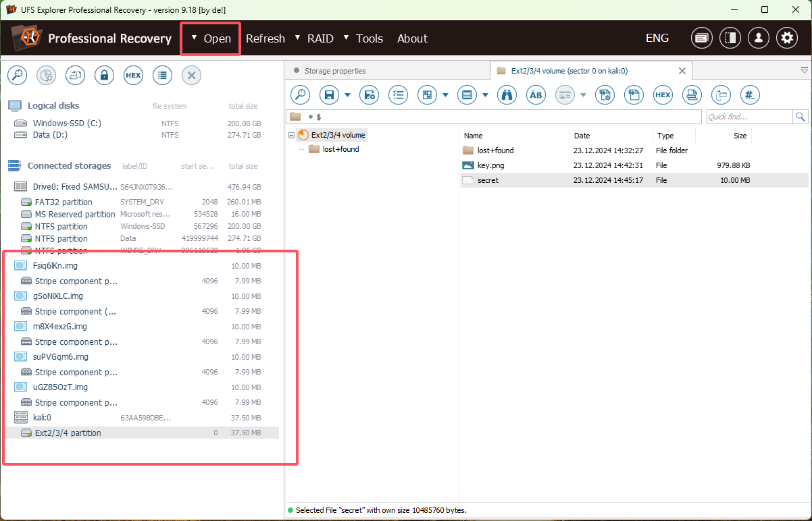

##### 方法二：在Ubuntu下用losetup和mdadm进行组装挂载

在WSL2(Ubuntu20.04)中运行一下命令即可成功挂载

```bash
sudo losetup -fP m8X4exzG.img  # 绑定第一个镜像文件到一个空闲的 loop 设备，并解析其分区表
sudo losetup -fP Fsiq6lKn.img
sudo losetup -fP gSoNiXLC.img
sudo losetup -fP suPVGqm6.img
sudo losetup -fP uGZ85OzT.img
sudo losetup -a  # 查看当前所有已绑定的 loop 设备及其对应的文件
cat /proc/mdstat  # 查看当前系统中已组装的 RAID 设备状态
sudo mount /dev/md127 tmp  # 挂载 RAID 设备 md127 到 tmp 目录，尝试访问其内容
ls -al tmp
sudo umount tmp  # 卸载 tmp 目录，释放 md127 设备的挂载
sudo mdadm --stop /dev/md127  # 停止 RAID 设备 md127，释放相关 loop 设备的占用
sudo losetup -d /dev/loop0  # 解除 loop0 设备的绑定
sudo losetup -d /dev/loop1
sudo losetup -d /dev/loop2
sudo losetup -d /dev/loop3
sudo losetup -d /dev/loop4

# 检查 /dev/loop0 至 /dev/loop4 上的每个设备的 RAID 元数据（查看设备是否是 RAID 阵列的一部分）
sudo mdadm --examine /dev/loop0 /dev/loop1 /dev/loop2 /dev/loop3 /dev/loop4   
# 创建一个名为 /dev/md127 的 RAID 0 阵列，包含 5 个设备（/dev/loop0 至 /dev/loop4）
sudo mdadm --create /dev/md127 --level=0 --raid-devices=5 /dev/loop0 /dev/loop1 /dev/loop2 /dev/loop3 /dev/loop4   

```

&gt; Tips:这里我的WSL2可能启用了 `mdadm` 的 **自动检测和组装**，因此会在发现 `RAID` 元数据时自动创建 `/dev/md127`

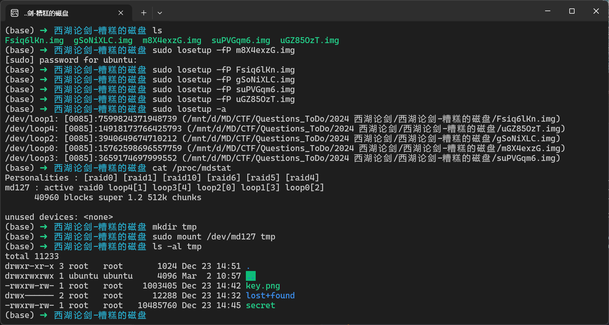

但是当我尝试在kali上执行以上操作的时候，它不会自动识别 `RAID` 阵列并自动挂载

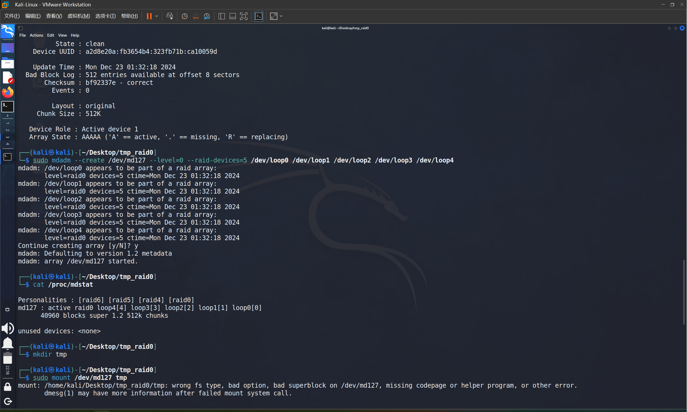

因此还是建议在Ubuntu系统下进行以上操作

例题1-2025西湖论剑-糟糕的磁盘

### btr文件

把文件拉到`Kali`虚拟机里(这里最好用`kali`，因为经过测试，发现我WSL2中的Ubuntu20.04是无法准备识别这几个文件的）

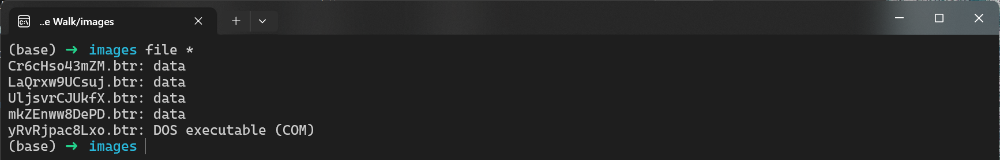

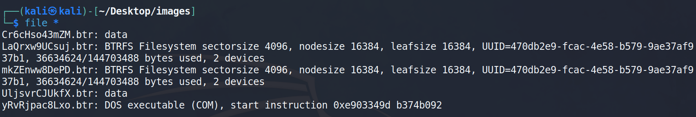
然后我们使用以下几个命令挂载一下上面文件格式为`BTRFS`磁盘

```bash
sudo losetup -fP Cr6cHso43mZM.btr
sudo losetup -fP LaQrxw9UCsuj.btr
sudo losetup -fP UljsvrCJUkfX.btr
sudo losetup -fP mkZEnww8DePD.btr
sudo losetup -fP yRvRjpac8Lxo.btr
sudo mkdir tmp
sudo mount -o degraded /dev/loop1 tmp # 用于强制挂载可能降级（设备丢失或损坏）的Btrfs文件系统
```

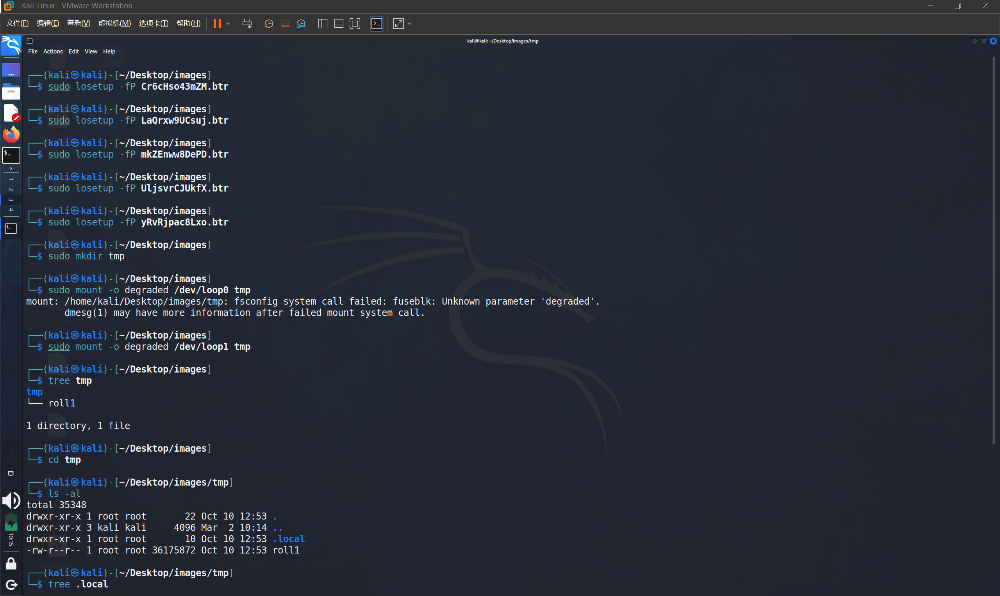

例题1-2024强网拟态-Input Page Walk


### 磁盘取证的一些思路

#### 1. 获取主机的系统名

`/etc/issue`或`/usr/lib/os.release`下可以得到

#### 2. 查看Powershell的历史记录

用户的powershell历史记录会保存在这个路径下
`\Users\test\AppData\Roaming\Microsoft\Windows\PowerShell\PSReadLine\ConsoleHost_history.txt`

#### 3. 获取用户的登录密码

Linux下密码以哈希的形式保存在`/etc/shadow`或者`/etc/passwd(老版本)`中

提取出来然后使用`Hashcat`爆破即可

`shadow_hash.txt`内容及对应`hashcat`的命令如下

```bash
snowflakes:$6$k6sgCBLM2Qzkreq6$l1OrqaIUNDxrv5g14BljA.FkX.BQt5sulAlaR0QMyFR/wQMLA4Cebk1dw8xIiZU3tmMW9mKlOV2xeoXwrDnbk1:18760:0:99999:7:::

hashcat -m 1800 -a 0 shadow_hash.txt rockyou.txt --force
```

```bash
root:$1$NAkZFH1u$byy9Vl8PSU3dJl5MicArx1:18446:0:99999:7:::

hashcat -m 500 -a 0 shadow_hash.txt rockyou.txt --force
```

#### 4. 获取定时任务的内容

定时任务保存在 `/etc/crontab` 文件下，这里举个例子

```bash
# /etc/crontab: system-wide crontab
# Unlike any other crontab you don&#39;t have to run the `crontab&#39;
# command to install the new version when you edit this file
# and files in /etc/cron.d. These files also have username fields,
# that none of the other crontabs do.

SHELL=/bin/sh
# You can also override PATH, but by default, newer versions inherit it from the environment
#PATH=/usr/local/sbin:/usr/local/bin:/usr/sbin:/usr/bin:/sbin:/bin

# Example of job definition:
# .---------------- minute (0 - 59)
# |  .------------- hour (0 - 23)
# |  |  .---------- day of month (1 - 31)
# |  |  |  .------- month (1 - 12) OR jan,feb,mar,apr ...
# |  |  |  |  .---- day of week (0 - 6) (Sunday=0 or 7) OR sun,mon,tue,wed,thu,fri,sat
# |  |  |  |  |
# *  *  *  *  * user-name command to be executed
17 *	* * *	root	cd / &amp;&amp; run-parts --report /etc/cron.hourly
25 6	* * *	root	test -x /usr/sbin/anacron || { cd / &amp;&amp; run-parts --report /etc/cron.daily; }
47 6	* * 7	root	test -x /usr/sbin/anacron || { cd / &amp;&amp; run-parts --report /etc/cron.weekly; }
52 6	1 * *	root	test -x /usr/sbin/anacron || { cd / &amp;&amp; run-parts --report /etc/cron.monthly; }
*/2 * * * * root /usr/bin/python3 /usr/local/share/xml/entities/a.py
# 每 2 分钟执行一次 Python 脚本 /usr/local/share/xml/entities/a.py
```

#### 5. 获取Docker容器中的关键信息

Docker容器保存在`/var/lib/docker/containers/`路径下

#### 6. 获取主机的环境变量

`Windows`的环境变量保存在`注册表SYSTEM\CurrentControlSet001\Control\Session Manager\Environment`中，注册表在`C:\Windows\System32\config`目录下

#### 7. 获取计算机注册时的用户名

该信息保存在`C:\Windows\System32\Config\SOFTWARE\Microsoft\Windows NT\CurrentVersion\RegisteredOwner`

#### 8. 获取计算机当前操作系统的产品名称

该信息保存在`C:\Windows\System32\Config\SOFTWARE\Microsoft\Windows NT\CurrentVersion\ProductName`

#### 9. 获取当前FireFox浏览器的版本

该信息保存在`C:\Windows\System32\Config\SOFTWARE\Mozilla\Mozilla Firefox\CurrentVersion`


## 网站取证

1、直接拿D_safe扫描可疑文件

## 服务器取证

硬盘镜像文件后缀: .qcow2

### Mysql5.7 数据库从qp.xb文件恢复数据

需要安装并使用qpress和xtrabackup

```bash
wget &#34;http://docs-aliyun.cn-hangzhou.oss.aliyun-inc.com/assets/attach/183466/cn_zh/1608011575185/qpress-11-linux-x64.tar&#34;
wget https://www.percona.com/downloads/XtraBackup/Percona-XtraBackup-2.4.9/binary/redhat/7/x86_64/percona-xtrabackup-24-2.4.9-1.el7.x86_64.rpm
```

```bash
chmod 775 qpress
cp qpress /usr/bin

cat filename.xb | xbstream -x -v -C /www/server/data
cd /www/server/data
innobackupex --decompress --remove-original /www/server/data 
#下一步可能会报错，但是不影响
innobackupex --defaults-file=/etc/my.cnf --apply-log /www/server/data
# 修改该目录所属的用户和用户组
chown -R mysql:mysql /www/server/data
```

## 其他

### 1、磁盘恢复

#### 恢复 ext3 或 ext4 文件系统中已删除的文件

```bash
# 拉到 kali 中用 extundelete
extundelete --restore-all disk-image
# 之后在所在目录会生成一个恢复文件
```

#### 直接DiskGenius打开恢复文件

### 2、浏览器登录凭证破解

Firefox登录凭证破解

使用[Firepwd工具](https://github.com/lclevy/firepwd)破解，将key4.db、logins.json复制到firepwd目录下，用firepwd.py破解

```python
python firepwd.py logins.json
```

### 3、邮件取证
#### FoxMail取证

本地下个Foxmail，然后在`Foxmail 7.2\FMstorage.list`中添加Storage的存储路径然后再启动就可以了

存储目录应该是一个以邮箱地址命名的文件夹

### 4、DPAPI破解

Windows DPAPI 是一种用于在 Windows 操作系统中存储和保护用户敏感数据的加密技术。它可以用于加密密码、证书、浏览器凭据等用户数据。

可以使用 DPAPImk2john.py 将这个数据转换为 john 可识别的格式，然后使用 john 爆破


DPAPI的应用：

    1、EFS文件加密(Cipher)
    2、存储无线连接密码
    3、Windows凭据管理器
    4、IE&amp;Chrome Browser
    5、Windows CardSpace
    6、Windows Vault

### 5、VeraCrypt加密

用 VeraCrypt 解密并挂载即可，加密的密钥可能是一串密码，也可能是某个密钥文件

也有可能同时需要密码&#43;密钥文件才能正常解密并挂载（例题1-2024浙江省赛决赛-天命人）

&gt; 这里要注意VC版本大于1.19和小于1.19用的加密算法是不一样的

### 6、TrueCeypt加密

TrueCrypt 的加密卷也可以使用 VeraCrypt 解密并挂载，只要把模式调整成 TrueCrypt 即可

### 7、Encfs加密

在windows下用 Encfs4win 来挂载即可，解密这个加密卷，需要 .encfs6.xml和解密的密码

例题-2024 NKCTF cain_is_hacker

### 8、GPG / PGP 加密

这个加密可以使用 Linux 下的 GPG 解密，也可以使用 Windows 下的 Kleopatra 解密

Linux 下解密的流程如下

```bash
# 导入公钥和私钥，导入私钥的时候需要输入密码
gpg --import ciscnctf.asc
gpg --import ciscn2016.asc
# 使用 gpg 解密，这里解密的时候还需要再输入一次密码
gpg --decrypt SECRET.docx.pgp &gt; decryptfile
# 查看已经导入的密钥
gpg --list-keys
# 删除密钥，这里需要先删除私钥再删除公钥
# 删除私钥
gpg --delete-secret-keys ciscnctf2016@gmail.com
#删除公钥
gpg --delete-keys CISCN2016@gmail.com
```

例题1-i春秋 Pretty Good Privacy

例题2-2024 CISCN初赛 Tough-DNS
### 9、Cipher加密

Windows自带的 Cipher 加密（EFS加密算法）

直接使用 Advanced efs data recovery 解密即可，解密需要密钥和密码

例题-2024 DubheCTF Cipher


---

> Author: [Lunatic](https://goodlunatic.github.io)  
> URL: https://goodlunatic.github.io/posts/761da51/  

