# 2024 国城杯网络安全挑战赛 Misc Writeup

**忙里抽闲，简单地看了看题，感觉这场比赛的取证确实出得挺好的**

**给取证题 Just_F0r3n51Cs 的出题人点个赞👍**
&lt;!--more--&gt;

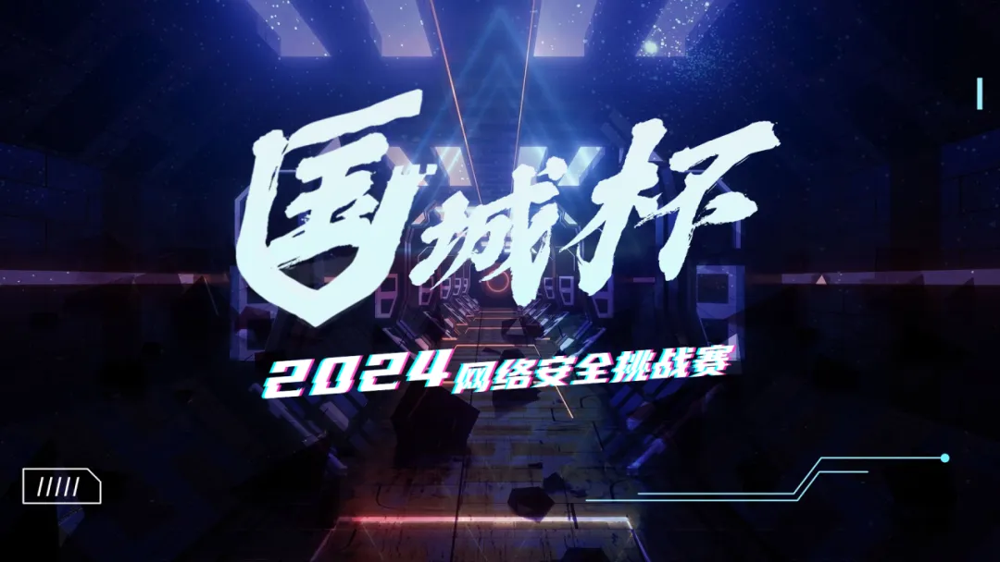

题目附件下载： https://pan.baidu.com/s/10jfYCo2y19sFcZyQoAgv2g?pwd=gu59 提取码: gu59

## 题目名称 Tr4ffIc_w1th_Ste90

解压附件压缩包，可以得到一个流量包和一个加密的压缩包


打开流量包，发现主要是UDP流量，然后还有H264的视频数据

直接追踪UDP流，复制原始Hex数据，用Cyberchef转换一下

然后下载到本地改后缀为.264，VLC打开即可得到压缩包的解压密码：`!t15tH3^pAs5W#RD*f0RFL@9`


解压压缩包可以得到一张图片和加密图片的代码，遛一遛GPT写一个解密代码

```python
import numpy as np
import cv2
import sys
import os

def decode(input_image, output_dir, seed_range):
    to_recover = cv2.imread(input_image, cv2.IMREAD_GRAYSCALE)
    
    if to_recover is None:
        print(f&#34;Error: Unable to load image {input_image}&#34;)
        exit(1)

    to_recover_array = np.asarray(to_recover)
    
    for seed in seed_range:
        np.random.seed(seed)
        
        row_indices = list(range(to_recover_array.shape[0]))
        col_indices = list(range(to_recover_array.shape[1]))

        np.random.shuffle(row_indices)
        np.random.shuffle(col_indices)
        
        row_reverse = np.argsort(row_indices)
        col_reverse = np.argsort(col_indices)
        
        recovered_image = to_recover_array[row_reverse, :]
        recovered_image = recovered_image[:, col_reverse]

        output_image = os.path.join(output_dir, f&#34;recovered_seed_{seed}.png&#34;)
        cv2.imwrite(output_image, recovered_image)
        print(f&#34;Decoded image saved as {output_image}&#34;)

def main():
    if len(sys.argv) != 4:
        print(&#39;error! Please provide input image path, output directory, and seed range as command-line arguments.&#39;)
        exit(1)
    
    input_image = sys.argv[1]
    output_dir = sys.argv[2]
    seed_start = int(sys.argv[3].split(&#39;-&#39;)[0])  # start of seed range
    seed_end = int(sys.argv[3].split(&#39;-&#39;)[1])    # end of seed range
    
    if not os.path.exists(output_dir):
        os.makedirs(output_dir)

    seed_range = range(seed_start, seed_end &#43; 1)
    decode(input_image, output_dir, seed_range)

if __name__ == &#39;__main__&#39;:
    main()
```

运行上面的脚本爆破一下seed

```bash
python decode.py encoded.png ./recovered_images 0-1000
```

然后可以得到一张`DataMatrix`二维码

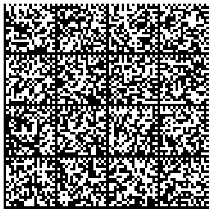

在线网站扫码可以得到如下内容

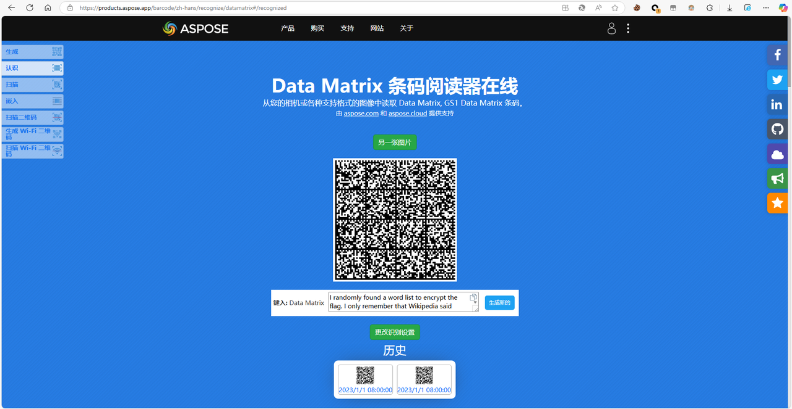

&gt; I randomly found a word list to encrypt the flag. I only remember that Wikipedia said this word list is similar to the NATO phonetic alphabet.

&gt; crumpled chairlift freedom chisel island dashboard crucial kickoff crucial chairlift drifter classroom highchair cranky clamshell edict drainage fallout clamshell chatter chairlift goldfish chopper eyetooth endow chairlift edict eyetooth deadbolt fallout egghead chisel eyetooth cranky crucial deadbolt chatter chisel egghead chisel crumpled eyetooth clamshell deadbolt chatter chopper eyetooth classroom chairlift fallout drainage klaxon

最后找个PGP词汇表解密脚本解密即可得到flag：`D0g3xGC{C0N9rA7ULa710n5_Y0U_HaV3_ACH13V3D_7H15_90aL}`

```python
aaa = [[&#39;00&#39;, &#39;aardvark&#39;, &#39;adroitness&#39;], [&#39;01&#39;, &#39;absurd&#39;, &#39;adviser&#39;], [&#39;02&#39;, &#39;accrue&#39;, &#39;aftermath&#39;], [&#39;03&#39;, &#39;acme&#39;, &#39;aggregate&#39;], [&#39;04&#39;, &#39;adrift&#39;, &#39;alkali&#39;], [&#39;05&#39;, &#39;adult&#39;, &#39;almighty&#39;], [&#39;06&#39;, &#39;afflict&#39;, &#39;amulet&#39;], [&#39;07&#39;, &#39;ahead&#39;, &#39;amusement&#39;], [&#39;08&#39;, &#39;aimless&#39;, &#39;antenna&#39;], [&#39;09&#39;, &#39;Algol&#39;, &#39;applicant&#39;], [&#39;0A&#39;, &#39;allow&#39;, &#39;Apollo&#39;], [&#39;0B&#39;, &#39;alone&#39;, &#39;armistice&#39;], [&#39;0C&#39;, &#39;ammo&#39;, &#39;article&#39;], [&#39;0D&#39;, &#39;ancient&#39;, &#39;asteroid&#39;], [&#39;0E&#39;, &#39;apple&#39;, &#39;Atlantic&#39;], [&#39;0F&#39;, &#39;artist&#39;, &#39;atmosphere&#39;], [&#39;10&#39;, &#39;assume&#39;, &#39;autopsy&#39;], [&#39;11&#39;, &#39;Athens&#39;, &#39;Babylon&#39;], [&#39;12&#39;, &#39;atlas&#39;, &#39;backwater&#39;], [&#39;13&#39;, &#39;Aztec&#39;, &#39;barbecue&#39;], [&#39;14&#39;, &#39;baboon&#39;, &#39;belowground&#39;], [&#39;15&#39;, &#39;backfield&#39;, &#39;bifocals&#39;], [&#39;16&#39;, &#39;backward&#39;, &#39;bodyguard&#39;], [&#39;17&#39;, &#39;banjo&#39;, &#39;bookseller&#39;], [&#39;18&#39;, &#39;beaming&#39;, &#39;borderline&#39;], [&#39;19&#39;, &#39;bedlamp&#39;, &#39;bottomless&#39;], [&#39;1A&#39;, &#39;beehive&#39;, &#39;Bradbury&#39;], [&#39;1B&#39;, &#39;beeswax&#39;, &#39;bravado&#39;], [&#39;1C&#39;, &#39;befriend&#39;, &#39;Brazilian&#39;], [&#39;1D&#39;, &#39;Belfast&#39;, &#39;breakaway&#39;], [&#39;1E&#39;, &#39;berserk&#39;, &#39;Burlington&#39;], [&#39;1F&#39;, &#39;billiard&#39;, &#39;businessman&#39;], [&#39;20&#39;, &#39;bison&#39;, &#39;butterfat&#39;], [&#39;21&#39;, &#39;blackjack&#39;, &#39;Camelot&#39;], [&#39;22&#39;, &#39;blockade&#39;, &#39;candidate&#39;], [&#39;23&#39;, &#39;blowtorch&#39;, &#39;cannonball&#39;], [&#39;24&#39;, &#39;bluebird&#39;, &#39;Capricorn&#39;], [&#39;25&#39;, &#39;bombast&#39;, &#39;caravan&#39;], [&#39;26&#39;, &#39;bookshelf&#39;, &#39;caretaker&#39;], [&#39;27&#39;, &#39;brackish&#39;, &#39;celebrate&#39;], [&#39;28&#39;, &#39;breadline&#39;, &#39;cellulose&#39;], [&#39;29&#39;, &#39;breakup&#39;, &#39;certify&#39;], [&#39;2A&#39;, &#39;brickyard&#39;, &#39;chambermaid&#39;], [&#39;2B&#39;, &#39;briefcase&#39;, &#39;Cherokee&#39;], [&#39;2C&#39;, &#39;Burbank&#39;, &#39;Chicago&#39;], [&#39;2D&#39;, &#39;button&#39;, &#39;clergyman&#39;], [&#39;2E&#39;, &#39;buzzard&#39;, &#39;coherence&#39;], [&#39;2F&#39;, &#39;cement&#39;, &#39;combustion&#39;], [&#39;30&#39;, &#39;chairlift&#39;, &#39;commando&#39;], [&#39;31&#39;, &#39;chatter&#39;, &#39;company&#39;], [&#39;32&#39;, &#39;checkup&#39;, &#39;component&#39;], [&#39;33&#39;, &#39;chisel&#39;, &#39;concurrent&#39;], [&#39;34&#39;, &#39;choking&#39;, &#39;confidence&#39;], [&#39;35&#39;, &#39;chopper&#39;, &#39;conformist&#39;], [&#39;36&#39;, &#39;Christmas&#39;, &#39;congregate&#39;], [&#39;37&#39;, &#39;clamshell&#39;, &#39;consensus&#39;], [&#39;38&#39;, &#39;classic&#39;, &#39;consulting&#39;], [&#39;39&#39;, &#39;classroom&#39;, &#39;corporate&#39;], [&#39;3A&#39;, &#39;cleanup&#39;, &#39;corrosion&#39;], [&#39;3B&#39;, &#39;clockwork&#39;, &#39;councilman&#39;], [&#39;3C&#39;, &#39;cobra&#39;, &#39;crossover&#39;], [&#39;3D&#39;, &#39;commence&#39;, &#39;crucifix&#39;], [&#39;3E&#39;, &#39;concert&#39;, &#39;cumbersome&#39;], [&#39;3F&#39;, &#39;cowbell&#39;, &#39;customer&#39;], [&#39;40&#39;, &#39;crackdown&#39;, &#39;Dakota&#39;], [&#39;41&#39;, &#39;cranky&#39;, &#39;decadence&#39;], [&#39;42&#39;, &#39;crowfoot&#39;, &#39;December&#39;], [&#39;43&#39;, &#39;crucial&#39;, &#39;decimal&#39;], [&#39;44&#39;, &#39;crumpled&#39;, &#39;designing&#39;], [&#39;45&#39;, &#39;crusade&#39;, &#39;detector&#39;], [&#39;46&#39;, &#39;cubic&#39;, &#39;detergent&#39;], [&#39;47&#39;, &#39;dashboard&#39;, &#39;determine&#39;], [&#39;48&#39;, &#39;deadbolt&#39;, &#39;dictator&#39;], [&#39;49&#39;, &#39;deckhand&#39;, &#39;dinosaur&#39;], [&#39;4A&#39;, &#39;dogsled&#39;, &#39;direction&#39;], [&#39;4B&#39;, &#39;dragnet&#39;, &#39;disable&#39;], [&#39;4C&#39;, &#39;drainage&#39;, &#39;disbelief&#39;], [&#39;4D&#39;, &#39;dreadful&#39;, &#39;disruptive&#39;], [&#39;4E&#39;, &#39;drifter&#39;, &#39;distortion&#39;], [&#39;4F&#39;, &#39;dropper&#39;, &#39;document&#39;], [&#39;50&#39;, &#39;drumbeat&#39;, &#39;embezzle&#39;], [&#39;51&#39;, &#39;drunken&#39;, &#39;enchanting&#39;], [&#39;52&#39;, &#39;Dupont&#39;, &#39;enrollment&#39;], [&#39;53&#39;, &#39;dwelling&#39;, &#39;enterprise&#39;], [&#39;54&#39;, &#39;eating&#39;, &#39;equation&#39;], [&#39;55&#39;, &#39;edict&#39;, &#39;equipment&#39;], [&#39;56&#39;, &#39;egghead&#39;, &#39;escapade&#39;], [&#39;57&#39;, &#39;eightball&#39;, &#39;Eskimo&#39;], [&#39;58&#39;, &#39;endorse&#39;, &#39;everyday&#39;], [&#39;59&#39;, &#39;endow&#39;, &#39;examine&#39;], [&#39;5A&#39;, &#39;enlist&#39;, &#39;existence&#39;], [&#39;5B&#39;, &#39;erase&#39;, &#39;exodus&#39;], [&#39;5C&#39;, &#39;escape&#39;, &#39;fascinate&#39;], [&#39;5D&#39;, &#39;exceed&#39;, &#39;filament&#39;], [&#39;5E&#39;, &#39;eyeglass&#39;, &#39;finicky&#39;], [&#39;5F&#39;, &#39;eyetooth&#39;, &#39;forever&#39;], [&#39;60&#39;, &#39;facial&#39;, &#39;fortitude&#39;], [&#39;61&#39;, &#39;fallout&#39;, &#39;frequency&#39;], [&#39;62&#39;, &#39;flagpole&#39;, &#39;gadgetry&#39;], [&#39;63&#39;, &#39;flatfoot&#39;, &#39;Galveston&#39;], [&#39;64&#39;, &#39;flytrap&#39;, &#39;getaway&#39;], [&#39;65&#39;, &#39;fracture&#39;, &#39;glossary&#39;], [&#39;66&#39;, &#39;framework&#39;, &#39;gossamer&#39;], [&#39;67&#39;, &#39;freedom&#39;, &#39;graduate&#39;], [&#39;68&#39;, &#39;frighten&#39;, &#39;gravity&#39;], [&#39;69&#39;, &#39;gazelle&#39;, &#39;guitarist&#39;], [&#39;6A&#39;, &#39;Geiger&#39;, &#39;hamburger&#39;], [&#39;6B&#39;, &#39;glitter&#39;, &#39;Hamilton&#39;], [&#39;6C&#39;, &#39;glucose&#39;, &#39;handiwork&#39;], [&#39;6D&#39;, &#39;goggles&#39;, &#39;hazardous&#39;], [&#39;6E&#39;, &#39;goldfish&#39;, &#39;headwaters&#39;], [&#39;6F&#39;, &#39;gremlin&#39;, &#39;hemisphere&#39;], [&#39;70&#39;, &#39;guidance&#39;, &#39;hesitate&#39;], [&#39;71&#39;, &#39;hamlet&#39;, &#39;hideaway&#39;], [&#39;72&#39;, &#39;highchair&#39;, &#39;holiness&#39;], [&#39;73&#39;, &#39;hockey&#39;, &#39;hurricane&#39;], [&#39;74&#39;, &#39;indoors&#39;, &#39;hydraulic&#39;], [&#39;75&#39;, &#39;indulge&#39;, &#39;impartial&#39;], [&#39;76&#39;, &#39;inverse&#39;, &#39;impetus&#39;], [&#39;77&#39;, &#39;involve&#39;, &#39;inception&#39;], [&#39;78&#39;, &#39;island&#39;, &#39;indigo&#39;], [&#39;79&#39;, &#39;jawbone&#39;, &#39;inertia&#39;], [&#39;7A&#39;, &#39;keyboard&#39;, &#39;infancy&#39;], [&#39;7B&#39;, &#39;kickoff&#39;, &#39;inferno&#39;], [&#39;7C&#39;, &#39;kiwi&#39;, &#39;informant&#39;], [&#39;7D&#39;, &#39;klaxon&#39;, &#39;insincere&#39;], [&#39;7E&#39;, &#39;locale&#39;, &#39;insurgent&#39;], [&#39;7F&#39;, &#39;lockup&#39;, &#39;integrate&#39;], [&#39;80&#39;, &#39;merit&#39;, &#39;intention&#39;], [&#39;81&#39;, &#39;minnow&#39;, &#39;inventive&#39;], [&#39;82&#39;, &#39;miser&#39;, &#39;Istanbul&#39;], [&#39;83&#39;, &#39;Mohawk&#39;, &#39;Jamaica&#39;], [&#39;84&#39;, &#39;mural&#39;, &#39;Jupiter&#39;], [&#39;85&#39;, &#39;music&#39;, &#39;leprosy&#39;], [&#39;86&#39;, &#39;necklace&#39;, &#39;letterhead&#39;], [&#39;87&#39;, &#39;Neptune&#39;, &#39;liberty&#39;], [&#39;88&#39;, &#39;newborn&#39;, &#39;maritime&#39;], [&#39;89&#39;, &#39;nightbird&#39;, &#39;matchmaker&#39;], [&#39;8A&#39;, &#39;Oakland&#39;, &#39;maverick&#39;], [&#39;8B&#39;, &#39;obtuse&#39;, &#39;Medusa&#39;], [&#39;8C&#39;, &#39;offload&#39;, &#39;megaton&#39;], [&#39;8D&#39;, &#39;optic&#39;, &#39;microscope&#39;], [&#39;8E&#39;, &#39;orca&#39;, &#39;microwave&#39;], [&#39;8F&#39;, &#39;payday&#39;, &#39;midsummer&#39;], [&#39;90&#39;, &#39;peachy&#39;, &#39;millionaire&#39;], [&#39;91&#39;, &#39;pheasant&#39;, &#39;miracle&#39;], [&#39;92&#39;, &#39;physique&#39;, &#39;misnomer&#39;], [&#39;93&#39;, &#39;playhouse&#39;, &#39;molasses&#39;], [&#39;94&#39;, &#39;Pluto&#39;, &#39;molecule&#39;], [&#39;95&#39;, &#39;preclude&#39;, &#39;Montana&#39;], [&#39;96&#39;, &#39;prefer&#39;, &#39;monument&#39;], [&#39;97&#39;, &#39;preshrunk&#39;, &#39;mosquito&#39;], [&#39;98&#39;, &#39;printer&#39;, &#39;narrative&#39;], [&#39;99&#39;, &#39;prowler&#39;, &#39;nebula&#39;], [&#39;9A&#39;, &#39;pupil&#39;, &#39;newsletter&#39;], [&#39;9B&#39;, &#39;puppy&#39;, &#39;Norwegian&#39;], [&#39;9C&#39;, &#39;python&#39;, &#39;October&#39;], [&#39;9D&#39;, &#39;quadrant&#39;, &#39;Ohio&#39;], [&#39;9E&#39;, &#39;quiver&#39;, &#39;onlooker&#39;], [&#39;9F&#39;, &#39;quota&#39;, &#39;opulent&#39;], [&#39;A0&#39;, &#39;ragtime&#39;, &#39;Orlando&#39;], [&#39;A1&#39;, &#39;ratchet&#39;, &#39;outfielder&#39;], [&#39;A2&#39;, &#39;rebirth&#39;, &#39;Pacific&#39;], [&#39;A3&#39;, &#39;reform&#39;, &#39;pandemic&#39;], [&#39;A4&#39;, &#39;regain&#39;, &#39;Pandora&#39;], [&#39;A5&#39;, &#39;reindeer&#39;, &#39;paperweight&#39;], [&#39;A6&#39;, &#39;rematch&#39;, &#39;paragon&#39;], [&#39;A7&#39;, &#39;repay&#39;, &#39;paragraph&#39;], [&#39;A8&#39;, &#39;retouch&#39;, &#39;paramount&#39;], [&#39;A9&#39;, &#39;revenge&#39;, &#39;passenger&#39;], [&#39;AA&#39;, &#39;reward&#39;, &#39;pedigree&#39;], [&#39;AB&#39;, &#39;rhythm&#39;, &#39;Pegasus&#39;], [&#39;AC&#39;, &#39;ribcage&#39;, &#39;penetrate&#39;], [&#39;AD&#39;, &#39;ringbolt&#39;, &#39;perceptive&#39;], [&#39;AE&#39;, &#39;robust&#39;, &#39;performance&#39;], [&#39;AF&#39;, &#39;rocker&#39;, &#39;pharmacy&#39;], [&#39;B0&#39;, &#39;ruffled&#39;, &#39;phonetic&#39;], [&#39;B1&#39;, &#39;sailboat&#39;, &#39;photograph&#39;], [&#39;B2&#39;, &#39;sawdust&#39;, &#39;pioneer&#39;], [&#39;B3&#39;, &#39;scallion&#39;, &#39;pocketful&#39;], [&#39;B4&#39;, &#39;scenic&#39;, &#39;politeness&#39;], [&#39;B5&#39;, &#39;scorecard&#39;, &#39;positive&#39;], [&#39;B6&#39;, &#39;Scotland&#39;, &#39;potato&#39;], [&#39;B7&#39;, &#39;seabird&#39;, &#39;processor&#39;], [&#39;B8&#39;, &#39;select&#39;, &#39;provincial&#39;], [&#39;B9&#39;, &#39;sentence&#39;, &#39;proximate&#39;], [&#39;BA&#39;, &#39;shadow&#39;, &#39;puberty&#39;], [&#39;BB&#39;, &#39;shamrock&#39;, &#39;publisher&#39;], [&#39;BC&#39;, &#39;showgirl&#39;, &#39;pyramid&#39;], [&#39;BD&#39;, &#39;skullcap&#39;, &#39;quantity&#39;], [&#39;BE&#39;, &#39;skydive&#39;, &#39;racketeer&#39;], [&#39;BF&#39;, &#39;slingshot&#39;, &#39;rebellion&#39;], [&#39;C0&#39;, &#39;slowdown&#39;, &#39;recipe&#39;], [&#39;C1&#39;, &#39;snapline&#39;, &#39;recover&#39;], [&#39;C2&#39;, &#39;snapshot&#39;, &#39;repellent&#39;], [&#39;C3&#39;, &#39;snowcap&#39;, &#39;replica&#39;], [&#39;C4&#39;, &#39;snowslide&#39;, &#39;reproduce&#39;], [&#39;C5&#39;, &#39;solo&#39;, &#39;resistor&#39;], [&#39;C6&#39;, &#39;southward&#39;, &#39;responsive&#39;], [&#39;C7&#39;, &#39;soybean&#39;, &#39;retraction&#39;], [&#39;C8&#39;, &#39;spaniel&#39;, &#39;retrieval&#39;], [&#39;C9&#39;, &#39;spearhead&#39;, &#39;retrospect&#39;], [&#39;CA&#39;, &#39;spellbind&#39;, &#39;revenue&#39;], [&#39;CB&#39;, &#39;spheroid&#39;, &#39;revival&#39;], [&#39;CC&#39;, &#39;spigot&#39;, &#39;revolver&#39;], [&#39;CD&#39;, &#39;spindle&#39;, &#39;sandalwood&#39;], [&#39;CE&#39;, &#39;spyglass&#39;, &#39;sardonic&#39;], [&#39;CF&#39;, &#39;stagehand&#39;, &#39;Saturday&#39;], [&#39;D0&#39;, &#39;stagnate&#39;, &#39;savagery&#39;], [&#39;D1&#39;, &#39;stairway&#39;, &#39;scavenger&#39;], [&#39;D2&#39;, &#39;standard&#39;, &#39;sensation&#39;], [&#39;D3&#39;, &#39;stapler&#39;, &#39;sociable&#39;], [&#39;D4&#39;, &#39;steamship&#39;, &#39;souvenir&#39;], [&#39;D5&#39;, &#39;sterling&#39;, &#39;specialist&#39;], [&#39;D6&#39;, &#39;stockman&#39;, &#39;speculate&#39;], [&#39;D7&#39;, &#39;stopwatch&#39;, &#39;stethoscope&#39;], [&#39;D8&#39;, &#39;stormy&#39;, &#39;stupendous&#39;], [&#39;D9&#39;, &#39;sugar&#39;, &#39;supportive&#39;], [&#39;DA&#39;, &#39;surmount&#39;, &#39;surrender&#39;], [&#39;DB&#39;, &#39;suspense&#39;, &#39;suspicious&#39;], [&#39;DC&#39;, &#39;sweatband&#39;, &#39;sympathy&#39;], [&#39;DD&#39;, &#39;swelter&#39;, &#39;tambourine&#39;], [&#39;DE&#39;, &#39;tactics&#39;, &#39;telephone&#39;], [&#39;DF&#39;, &#39;talon&#39;, &#39;therapist&#39;], [&#39;E0&#39;, &#39;tapeworm&#39;, &#39;tobacco&#39;], [&#39;E1&#39;, &#39;tempest&#39;, &#39;tolerance&#39;], [&#39;E2&#39;, &#39;tiger&#39;, &#39;tomorrow&#39;], [&#39;E3&#39;, &#39;tissue&#39;, &#39;torpedo&#39;], [&#39;E4&#39;, &#39;tonic&#39;, &#39;tradition&#39;], [&#39;E5&#39;, &#39;topmost&#39;, &#39;travesty&#39;], [&#39;E6&#39;, &#39;tracker&#39;, &#39;trombonist&#39;], [&#39;E7&#39;, &#39;transit&#39;, &#39;truncated&#39;], [&#39;E8&#39;, &#39;trauma&#39;, &#39;typewriter&#39;], [&#39;E9&#39;, &#39;treadmill&#39;, &#39;ultimate&#39;], [&#39;EA&#39;, &#39;Trojan&#39;, &#39;undaunted&#39;], [&#39;EB&#39;, &#39;trouble&#39;, &#39;underfoot&#39;], [&#39;EC&#39;, &#39;tumor&#39;, &#39;unicorn&#39;], [&#39;ED&#39;, &#39;tunnel&#39;, &#39;unify&#39;], [&#39;EE&#39;, &#39;tycoon&#39;, &#39;universe&#39;], [&#39;EF&#39;, &#39;uncut&#39;, &#39;unravel&#39;], [&#39;F0&#39;, &#39;unearth&#39;, &#39;upcoming&#39;], [&#39;F1&#39;, &#39;unwind&#39;, &#39;vacancy&#39;], [&#39;F2&#39;, &#39;uproot&#39;, &#39;vagabond&#39;], [&#39;F3&#39;, &#39;upset&#39;, &#39;vertigo&#39;], [&#39;F4&#39;, &#39;upshot&#39;, &#39;Virginia&#39;], [&#39;F5&#39;, &#39;vapor&#39;, &#39;visitor&#39;], [&#39;F6&#39;, &#39;village&#39;, &#39;vocalist&#39;], [&#39;F7&#39;, &#39;virus&#39;, &#39;voyager&#39;], [&#39;F8&#39;, &#39;Vulcan&#39;, &#39;warranty&#39;], [&#39;F9&#39;, &#39;waffle&#39;, &#39;Waterloo&#39;], [&#39;FA&#39;, &#39;wallet&#39;, &#39;whimsical&#39;], [&#39;FB&#39;, &#39;watchword&#39;, &#39;Wichita&#39;], [&#39;FC&#39;, &#39;wayside&#39;, &#39;Wilmington&#39;], [&#39;FD&#39;, &#39;willow&#39;, &#39;Wyoming&#39;], [&#39;FE&#39;, &#39;woodlark&#39;, &#39;yesteryear&#39;], [&#39;FF&#39;, &#39;Zulu&#39;, &#39;Yucatan&#39;]]

_string = &#34;crumpled chairlift freedom chisel island dashboard crucial kickoff crucial chairlift drifter classroom highchair cranky clamshell edict drainage fallout clamshell chatter chairlift goldfish chopper eyetooth endow chairlift edict eyetooth deadbolt fallout egghead chisel eyetooth cranky crucial deadbolt chatter chisel egghead chisel crumpled eyetooth clamshell deadbolt chatter chopper eyetooth classroom chairlift fallout drainage klaxon&#34;

def tihuan(s):
    for i in aaa:
        s = s.replace(i[1],i[0])
        s = s.replace(i[2],i[0])
    return s

bbb = tihuan(_string)
print(bbb)
ccc = bbb.split(&#34; &#34;)
ddd = &#34;&#34;
for i in ccc:
    ddd&#43;=chr(int(i,16))

print(ddd)
```

&gt; 参考链接：https://gryffinbit.top/2020/11/14/%E4%B8%80%E4%BA%9B%E6%9D%82%E4%B9%B1%E7%9A%84%E5%AF%86%E7%A0%81/#PGP%E8%AF%8D%E6%B1%87%E8%A1%A8-%EF%BC%88%E7%94%9F%E7%89%A9%E8%AF%86%E5%88%AB%E8%AF%8D%E6%B1%87%E8%A1%A8%EF%BC%89

## 题目名称 Just_F0r3n51Cs

题目附件给了一个`E01`的磁盘镜像，可以使用`FTK image`进行挂载

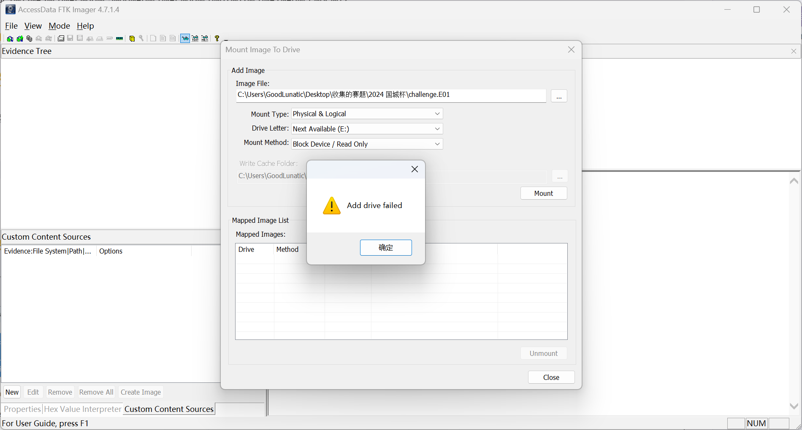

虽然会提示报错，但是依旧是可以成功挂载的

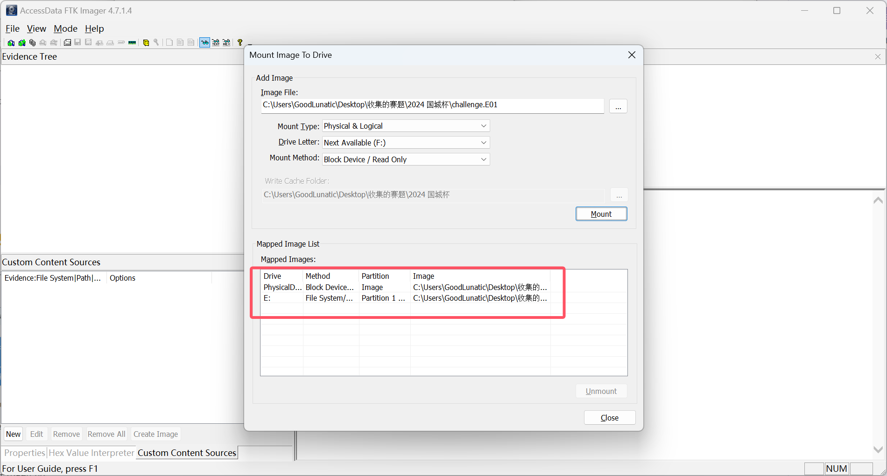

挂载成功后，看用户目录下的桌面文件夹，有一个流量包文件


翻看流量包，发现主要是`HTTP`和`OICQ`流量，HTTP流量中可以导出下面这张JPG图片


010打开，发现末尾给了提示


base64解码可以得到：`oursecret is D0g3xGC`

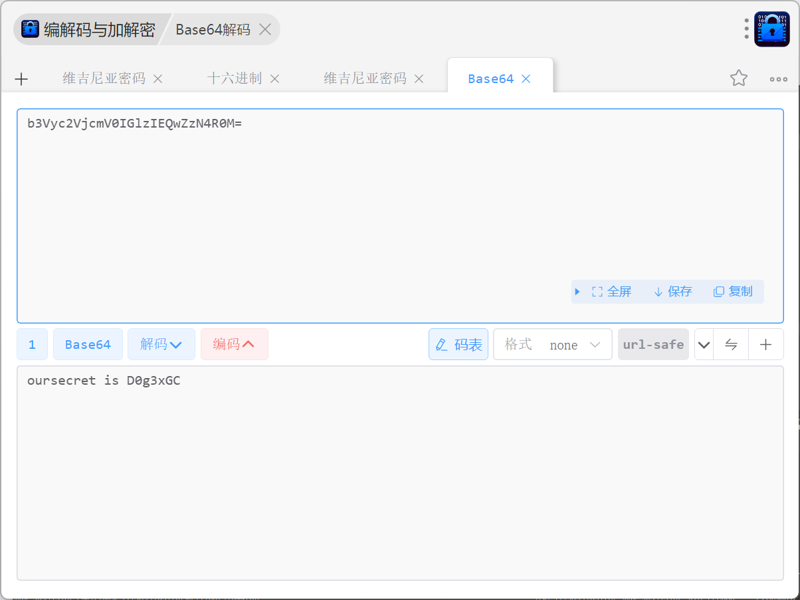

因此猜测这张JPG图片用`oursecret`隐写了信息，尝试用`D0g3xGC`作为密钥进行提取

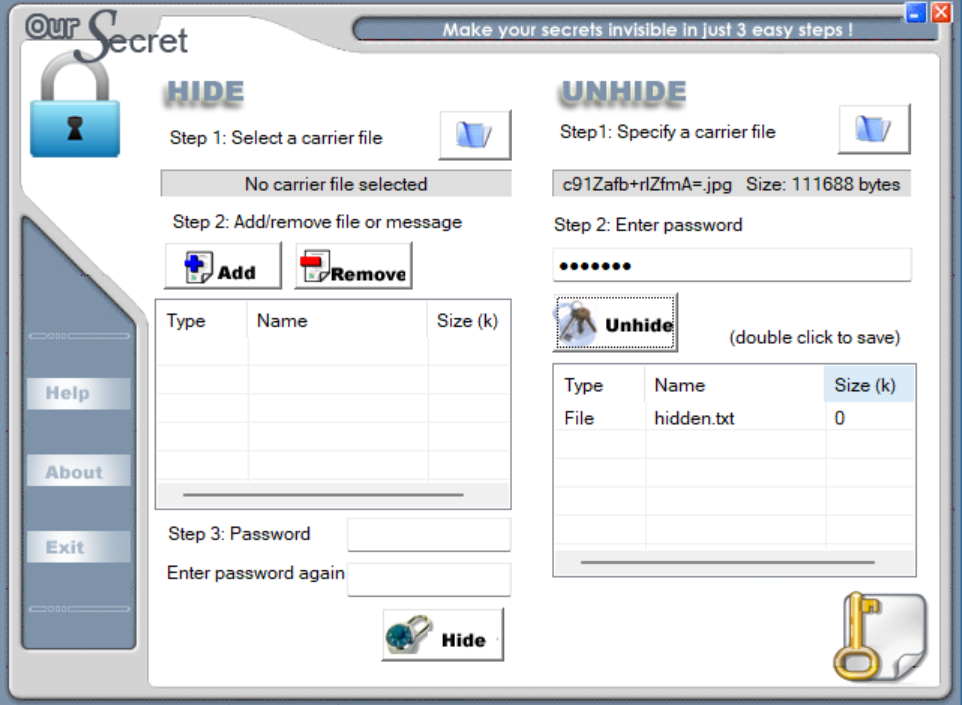

可以得到一个`hidden.txt`，内容如下

&gt; ECB&#39;s key is
&gt; 
&gt; N11c3TrYY6666111
&gt; 
&gt; 记得给我秋秋空间点赞
  
给了密钥，并提示密文在QQ空间里，因此我们需要分析流量包中OICQ协议的内容


展开OICQ数据包的内容，可以得到QQ号：`293519770`

因此我们可以尝试访问这个人的QQ空间

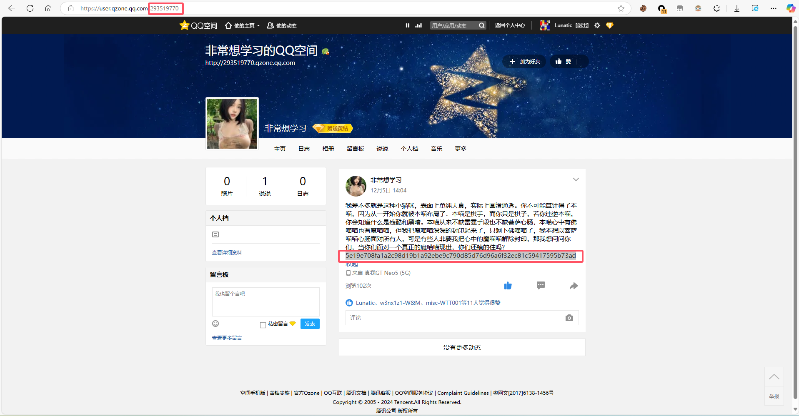

可以得到密文：

&gt; 5e19e708fa1a2c98d19b1a92ebe9c790d85d76d96a6f32ec81c59417595b73ad


结合密文密钥，AES-ECB解密可以得到第一段的flag：`flag1:D0g3xGC{Y0u_`

然后我们回到刚刚挂载磁盘的用户目录下，可以发现有一个`flag4.zip`


提取出来并解压，可以得到如下两个文件，其中的exe是由python打包的exe文件

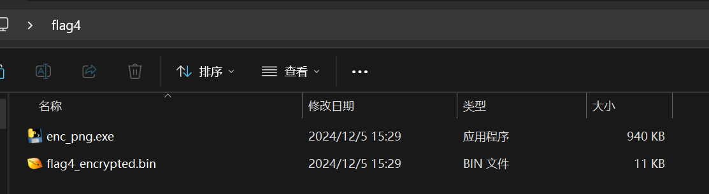

因此猜测需要我们逆向exe中的加密逻辑，解密出bin文件中的内容

首先我们可以使用 [pyinstxtractor-ng](https://github.com/pyinstxtractor/pyinstxtractor-ng/) 对exe文件进行解包得到.pyc文件


在一堆pyc文件中找到关键的`enc_png.pyc`，然后使用`uncompyle6`对pyc文件进行反编译

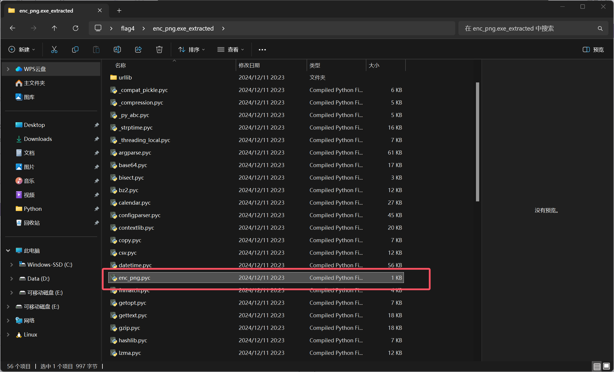

`uncompyle6`可以直接使用 `pip install` 进行安装


反编译成功后可以得到如下代码

```python
# uncompyle6 version 3.9.2
# Python bytecode version base 3.8.0 (3413)
# Decompiled from: Python 3.10.16 | packaged by conda-forge | (main, Dec  5 2024, 14:16:10) [GCC 13.3.0]
# Embedded file name: enc_png.py


def xor_encrypt(data, key):
    encrypted_data = bytearray()
    for i in range(len(data)):
        encrypted_data.append(data[i] ^ key[i % len(key)])
    else:
        return encrypted_data


def read_file(file_path):
    with open(file_path, &#34;rb&#34;) as file:
        data = file.read()
    return data


def write_file(file_path, data):
    with open(file_path, &#34;wb&#34;) as file:
        file.write(data)


def encrypt_file(input_file_path, output_file_path, key):
    data = read_file(input_file_path)
    encrypted_data = xor_encrypt(data, key)
    write_file(output_file_path, encrypted_data)


if __name__ == &#34;__main__&#34;:
    key = b&#39;GCcup_wAngwaNg!!&#39;
    input_file = &#34;flag4.png&#34;
    encrypted_file = &#34;flag4_encrypted.bin&#34;
    encrypt_file(input_file, encrypted_file, key)
```

其实就是一个简单的逐字节异或，看懂加密逻辑后直接CyberChef解密即可得到：`F0R3N51c5_Ch4Ll3N93}`


flag1和flag4可以通过`FTK Image`挂载并结合上述步骤获得，但是flag2和flag3就需要使用`Autopsy`工具进行辅助取证了

首先是查看环境变量，Windows的环境变量保存在注册表`SYSTEM\CurrentControlSet001\Control\Session Manager\Environment`中，注册表在`C:\Windows\System32\config`目录下

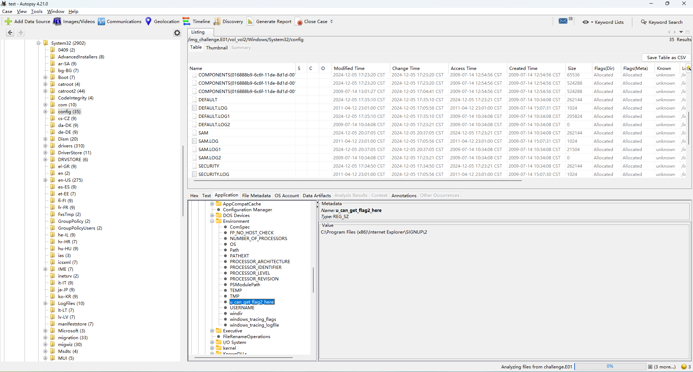

然后我们在环境变量中发现了`u_can_get_flag2_here`，并且它的值指向了一个文件`C:\Program Files (x86)\Internet Explorer\SIGNUP\2`

我们尝试把这个文件提取出来，看文件头发现是个zip压缩包

改后缀为zip并打开，发现是加密的，但是注释中有关于密码的提示


然后我们可以在注册表中寻找上述问题的答案

问题一的答案在`C:\Windows\System32\Config\SOFTWARE\Microsoft\Windows NT\CurrentVersion\RegisteredOwner`

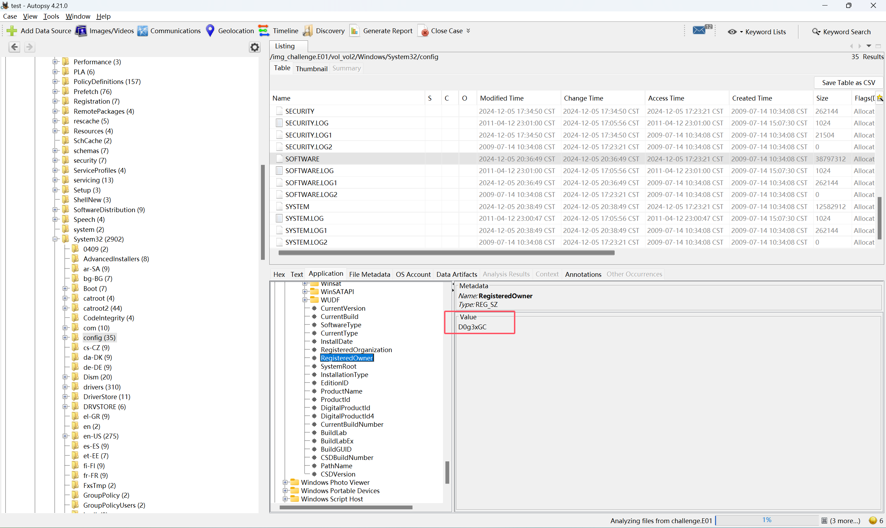

问题二的答案在`C:\Windows\System32\Config\SOFTWARE\Microsoft\Windows NT\CurrentVersion\ProductName`


问题三的答案在`C:\Windows\System32\Config\SOFTWARE\Mozilla\Mozilla Firefox\CurrentVersion

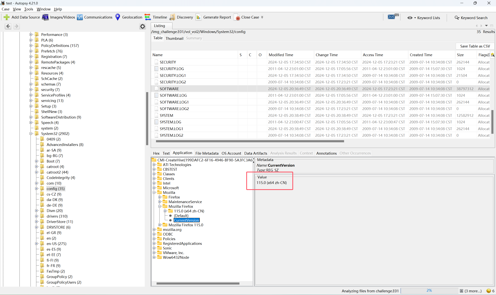

综上，压缩包的密码就是`D0g3xGC_Windows_7_Ultimate_115.0`，解压后可以得到下面这段密文

```vbe
#@~^HAAAAA==W^lLyPb/P@#@&amp;4*.2{W!!x[mFC&amp;|0AcAAA==^#~@
```

赛后知道了这是vbe格式加密后的密文，直接使用以.vbe格式保存，再用[在线网站](https://master.ayra.ch/vbs/vbs.aspx)解密即可

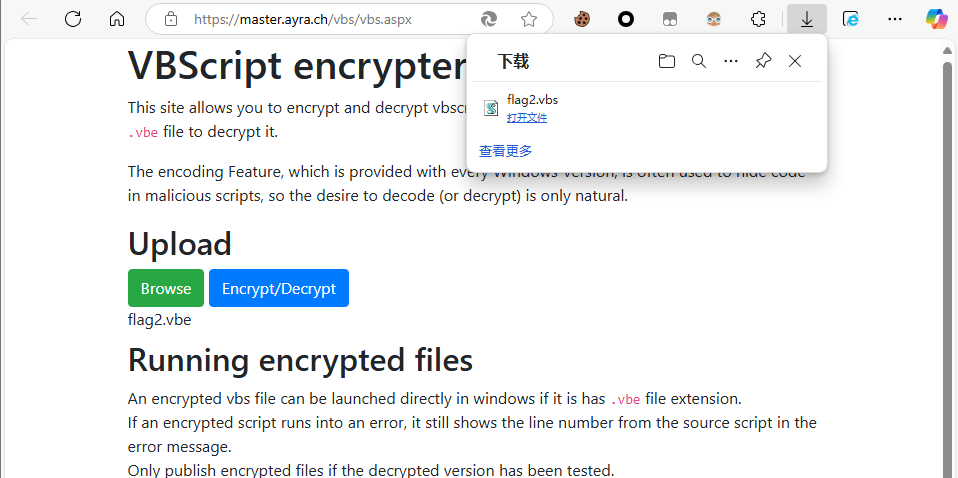

打开解密完成的vbs文件即可得到flag2

```
flag2 is 
h4V3_f0und_7H3_
```

然后回到Autopsy中继续看，可以找到一个加密的`Original.zip`

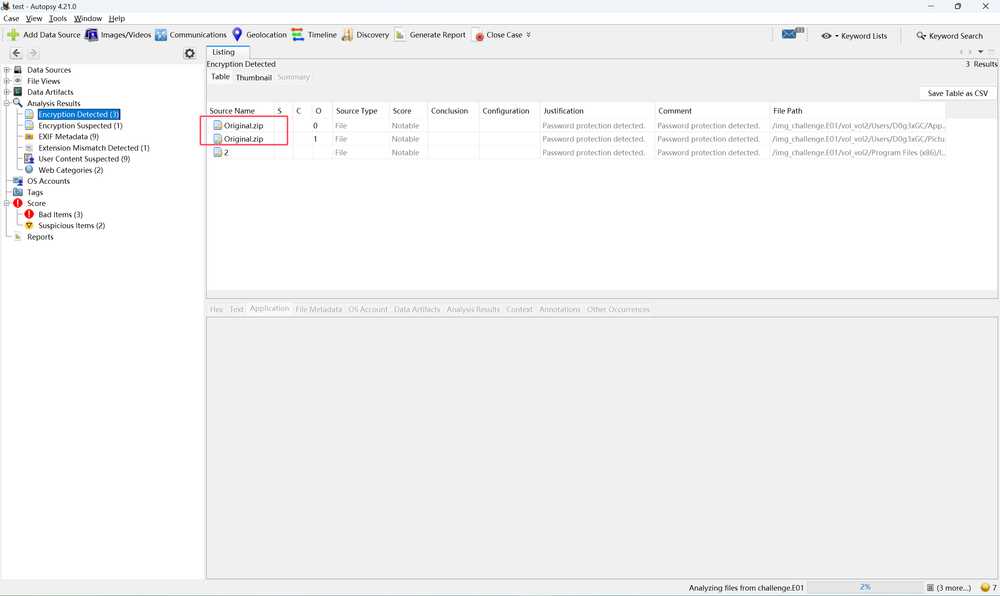

压缩包的路径为`C:/Users/D0g3xGC/Pictures/Original.zip`

并且发现同一路径下还有一个`CatWatermark_666.png`的可疑图片


尝试把两个文件都提取出来，压缩包发现是一个加密的，注释中有关于密码的提示


对于用户的登录密码，我们可以导出`C:\Windows\System32\config`目录下的`SYSTEM`和`SAM`两个文件

然后用`mimikatz`抓取hash，可以得到用户`D0g3xGC`用户的NTLM哈希为`c377ba8a4dd52401bc404dbe49771bbc`

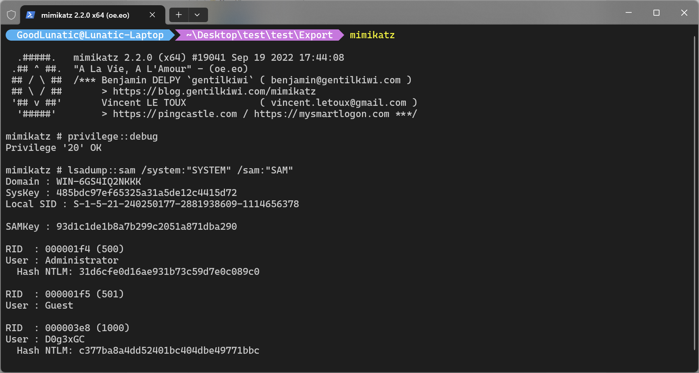

拿到NTLM哈希后可以选择使用Hashcat爆破或者直接使用在线网站查询


CMD5上可以直接查找密码为：`qwe123!@#`

然后我们需要获取用户登录`otterctf`网站的密码，结合之前发现这个系统中存在firefox，因此大概就是`火狐浏览器登录凭证`取证了

火狐的登录凭证可以参考这个[开源项目](https://github.com/lclevy/firepwd)进行破解，运行脚本后即可得到密码：`Y0u_f1Nd^_^m3_233`

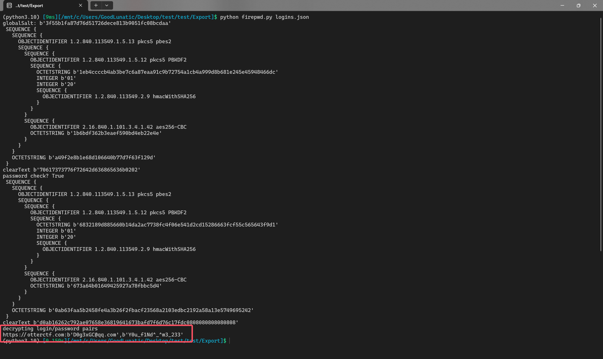

因此最后的解压密码为`qwe123!@#_Y0u_f1Nd^_^m3_233`，解压压缩包后得到一张`Original.png`

结合之前的提示`CatWatermark_666.png`，可以使用[CatWatermark](https://github.com/Konano/CatWatermark)这个开源项目进行解密

参考项目中的Usage，发现解密需要提供`arnold_dx arnold_dy arnold_rd`这三个参数，结合图片名称，猜测三个参数应该就是`6 6 6`

```bash
# encode
python3 encode.py original_image watermark_text output_image
# decode
python3 decode.py original_image watermarked_image output_image arnold_dx arnold_dy arnold_rd
```

所以直接把项目下载到本地然后Decode即可得到flag3：`F1N4L_s3CR3t_0F_Th15_`

```python
python decode.py Original.png CatWatermark_666.png out.png 6 6 6
```

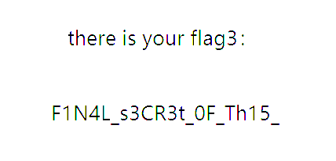

综上，结合上述四段flag，本题完整的flag为：`D0g3xGC{Y0u_h4V3_f0und_7H3_F1N4L_s3CR3t_0F_Th15F0R3N51c5_Ch4Ll3N93}`

&gt; 一些个人的碎碎念：
&gt; 
&gt; 感觉这题取证确实出的挺好的，可以看出来出题人花了挺多心思，结合了挺多知识点
&gt; 
&gt; 感觉可以作为一道考察取证基础的典型例题了

## 题目名称 eZ_Steg0

解压题目附件，可以得到以下几个文件，其中key.zip是加密的，猜测密码藏在图片中


打开01.png，发现都是二值化的图像

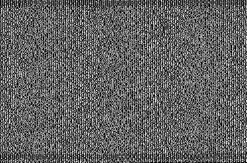

写一个脚本提取一下里面的数据，发现是PNG图片的十六进制数据
```python
from PIL import Image
import libnum


img = Image.open(&#34;01.png&#34;)
width,height = img.size

bin_data = &#34;&#34;
for y in range(height):
    for x in range(width):
        pixel = img.getpixel((x,y))
        if pixel == 0:
            bin_data &#43;= &#39;0&#39;
        else:
            bin_data &#43;= &#39;1&#39;
            
bin_data = bin_data &#43; &#39;0&#39; * (8-len(bin_data)%8)
# print(libnum.b2s(bin_data))
hex_data = libnum.b2s(bin_data)[::-1]
hex_data = hex_data[30:].decode()
png_data = bytes.fromhex(hex_data)
# print(png_data)

with open(&#34;out.png&#34;,&#34;wb&#34;) as f:
    f.write(png_data)
```

运行以上脚本可以得到下图，因此压缩吧密码就是：`!!SUp3RP422W0RD^/??.&amp;&amp;`

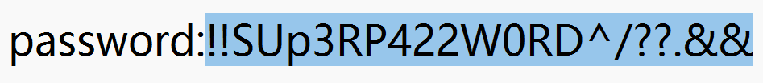

使用得到的密码解压压缩包，可以得到一个未知类型的key文件

010打开发现前面有一段base64编码

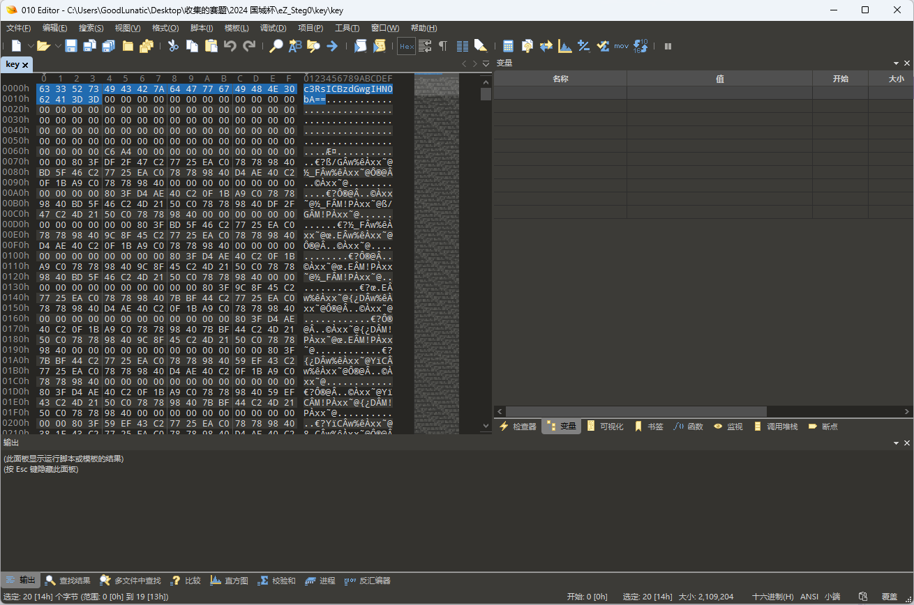

CyberChef解码一下可以得到提示：`stl  stl  stl`

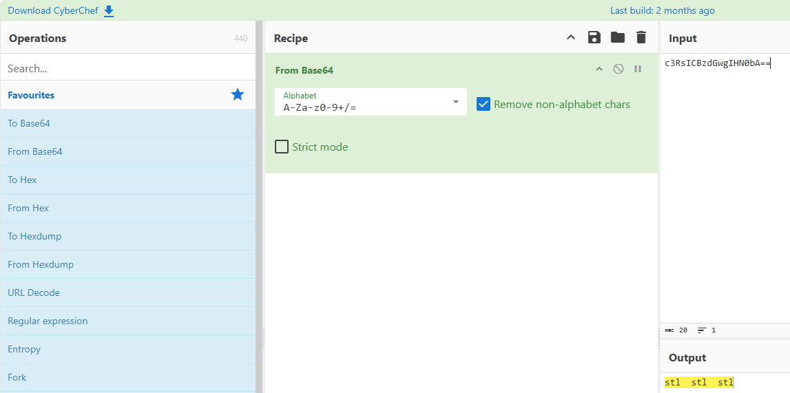

上网搜索一下stl文件，发现是一种三位图形文件格式


可以直接用这个[在线网站](https://www.3dpea.com/cn/view-STL-online)打开


得到一个密钥：`sSeCre7keY?!!@$`，用这个密钥去异或一下flag文件，可以得到一个wav

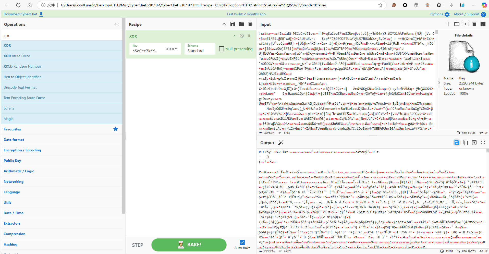

用010打开得到的wav文件，提示dAta有问题

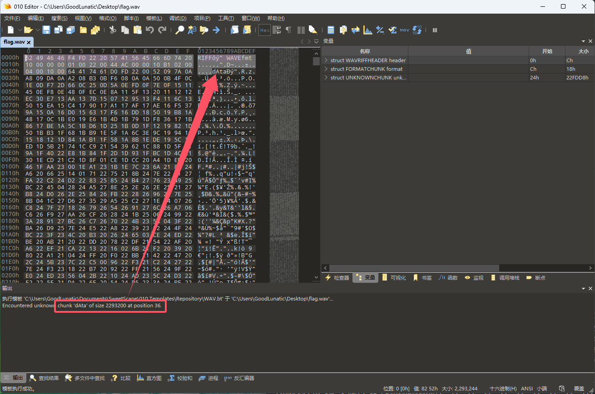

找一个正常的wav，发现把dAta改成data就正常了

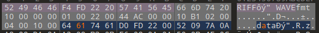

然后根据题面的提示，猜测是wav文件的LSB隐写

参考文章：[Audio Steganography : The art of hiding secrets within earshot (part 2 of 2) | by Sumit Kumar Arora | Medium](https://sumit-arora.medium.com/audio-steganography-the-art-of-hiding-secrets-within-earshot-part-2-of-2-c76b1be719b3)

编写以下脚本提取隐写的内容即可得到flag：`D0g3xGC{U_4rE_4_WhI2_4t_Ste9An09r4pHY}`

```python
import wave
import libnum


bin_data = &#34;&#34;
song = wave.open(&#34;flag.wav&#34;, mode=&#39;rb&#39;)
# Convert audio to byte array
frame_bytes = bytearray(list(song.readframes(song.getnframes())))

for item in frame_bytes:
    bin_data &#43;= str(item &amp; 1)

bin_data = bin_data &#43;&#39;0&#39;*(8-len(bin_data)%8)
flag = libnum.b2s(bin_data)[:50]
print(flag)
# b&#39;D0g3xGC{U_4rE_4_WhI2_4t_Ste9An09r4pHY}############&#39;
```

## 题目名称 保险柜的秘密


---

> Author: [Lunatic](https://goodlunatic.github.io)  
> URL: http://localhost:1313/posts/7bf9cb0/  

