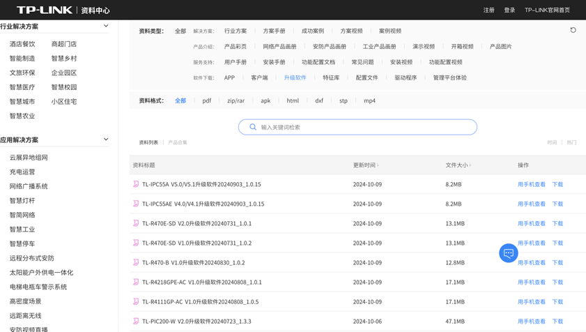
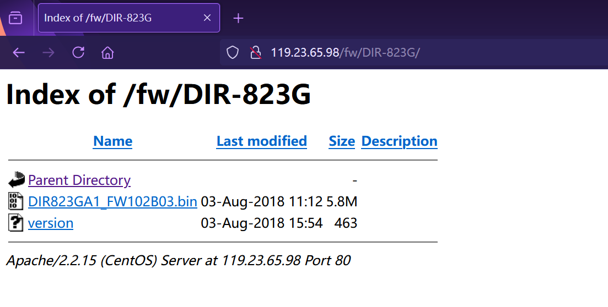
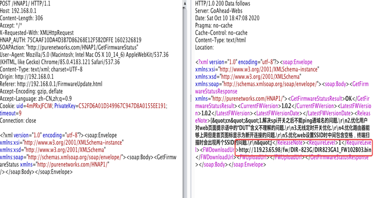
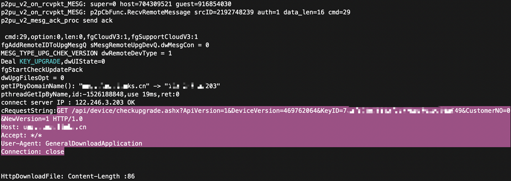
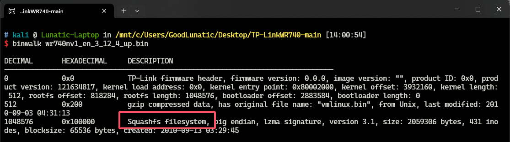

# IOT Security Research

A simple blog for IOT Security Research.
&lt;!--more--&gt;

## 前置知识
### 固件的获取
#### 直接从厂商官网或官方服务器下载

#### 使用BP或者UART串口进入设备的shell抓包获取下载地址

#### 使用固件烧写器或者编程器提取ROM中的固件

### 固件的处理
#### 解包
常用工具：binwalk、firmware-mod-kit、binaryanalysis-ng

#### 解密
1. 使用老版本未加密固件中的解密程序实现新版本加密固件的解密

2. 逆向分析低版本固件的解密逻辑实现对新版本固件的解密

## 漏洞复现
### TP-Link WR740 后门漏洞
首先获取固件，固件下载地址：https://github.com/dioos886/TP-LinkWR740

使用binwalk扫一下，可以直接看到Squashfs文件系统，使用-Me参数进行提取

&gt; Tips：如果这里无法提取出文件系统，可能是没有正确安装sasquatch，直接根据Github中的步骤安装即可
&gt; 
&gt; sasquatch下载地址：https://github.com/devttys0/sasquatch.git

解包完成后，可以使用 firmwalker 进行敏感信息扫描

&gt; firmwalker下载地址：https://github.com/craigz28/firmwalker.git
&gt; 
&gt; 使用方法：./firmwalker.sh squashfs-root的路径

---

> Author: [Lunatic](https://goodlunatic.github.io)  
> URL: http://localhost:1313/posts/848cf69/  

