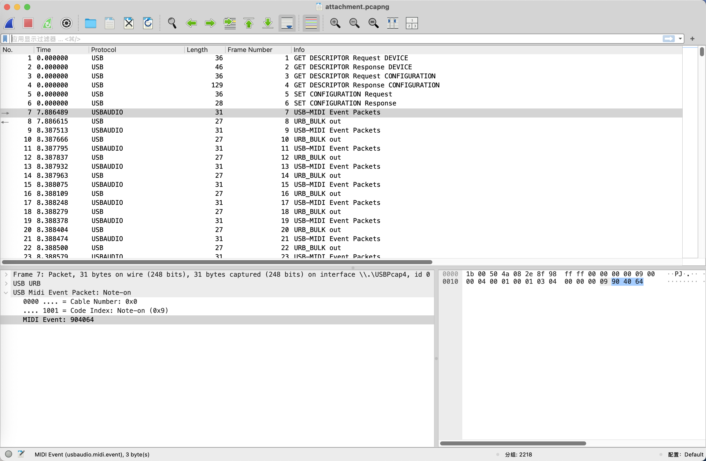
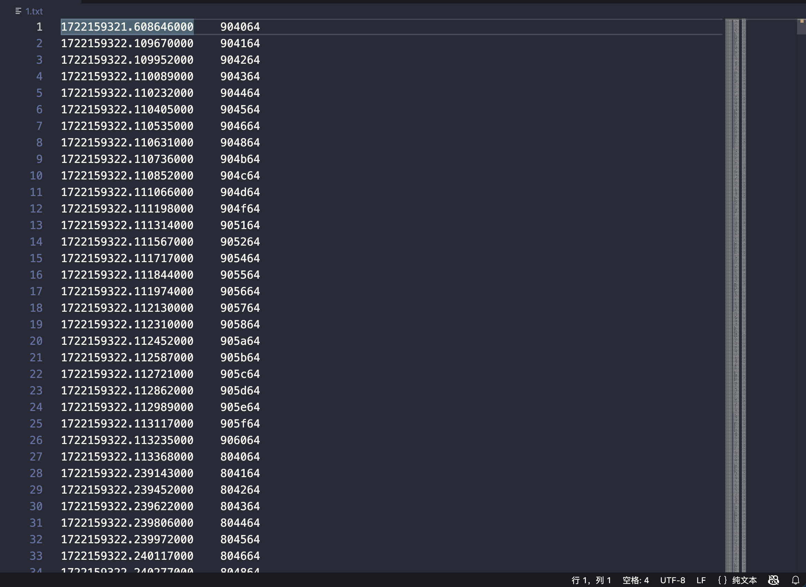
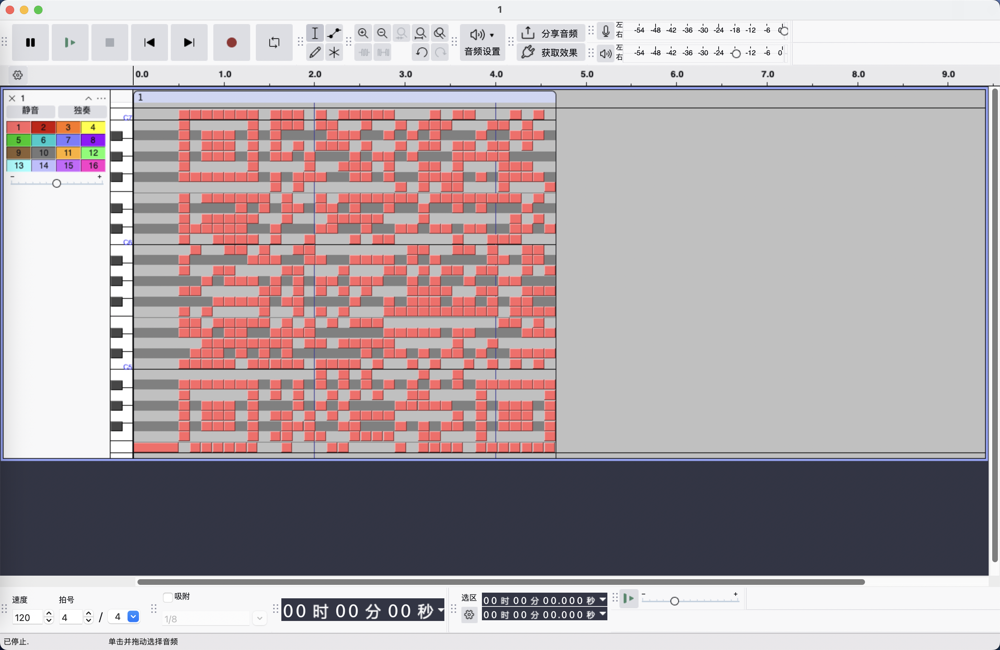
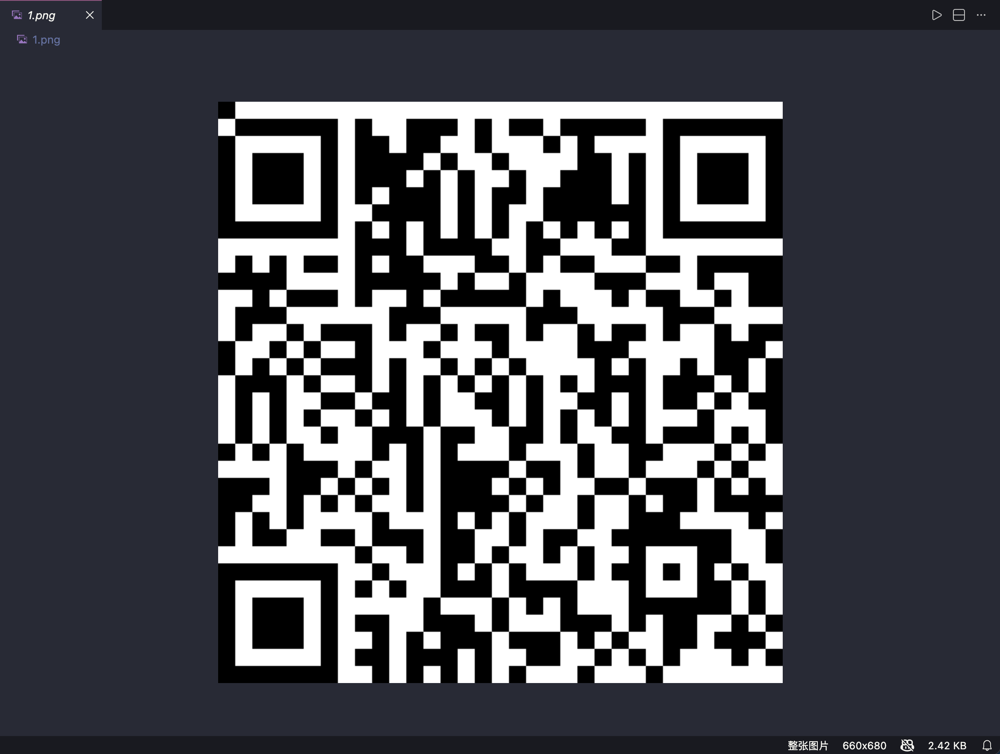
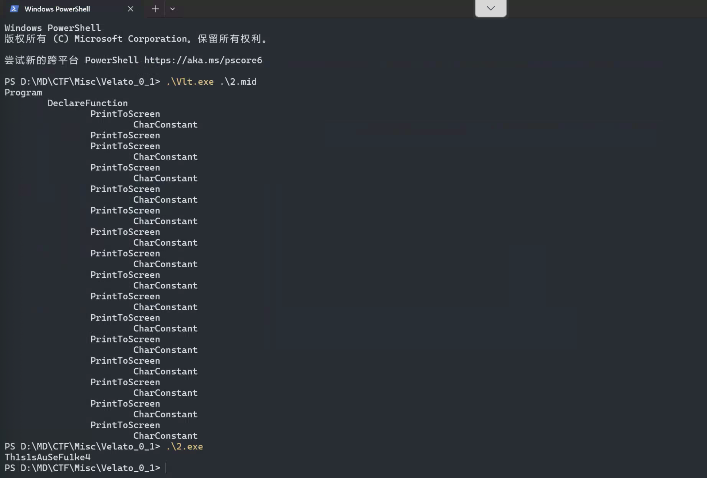
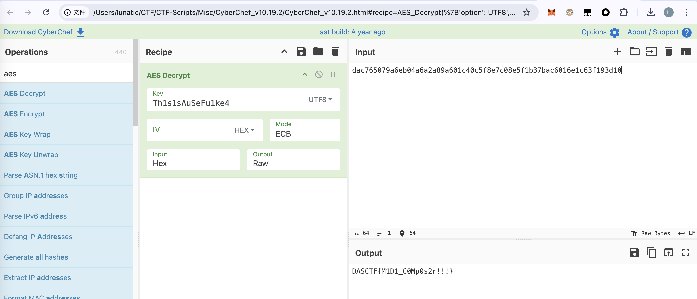
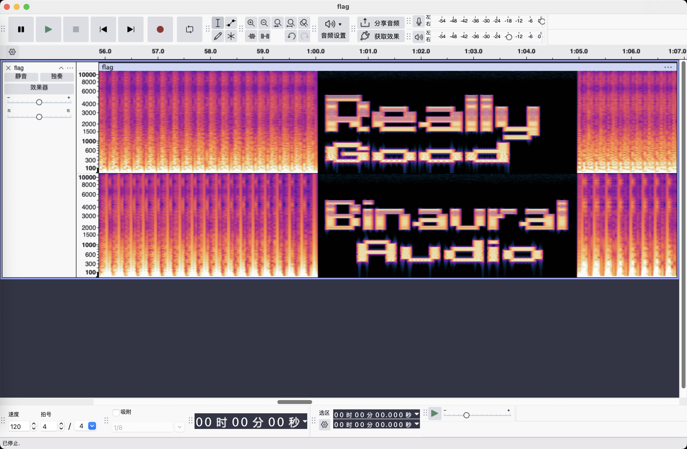
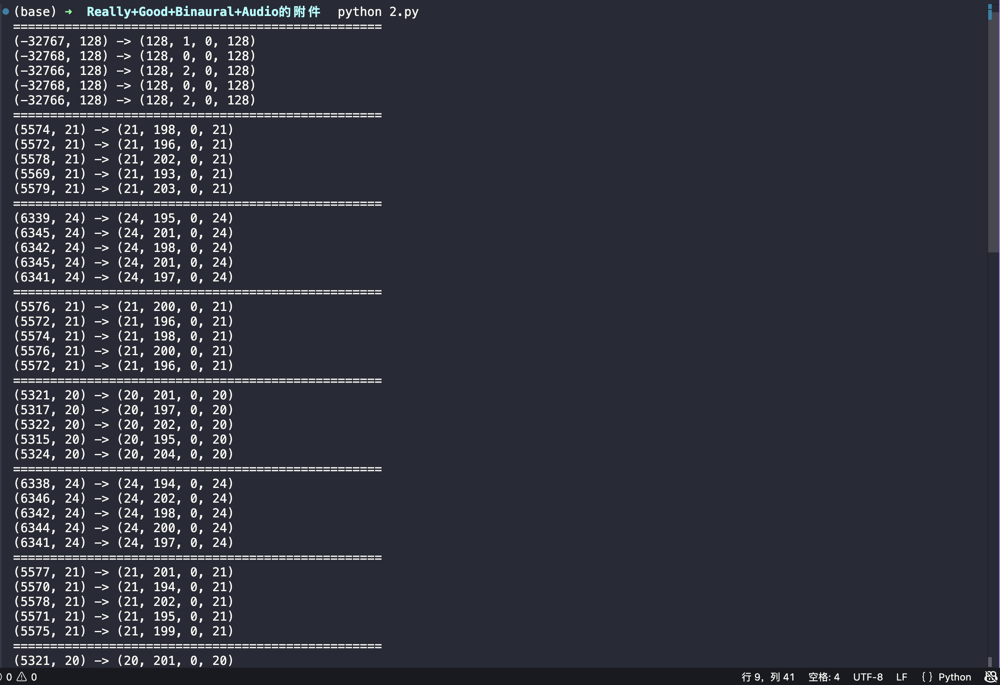
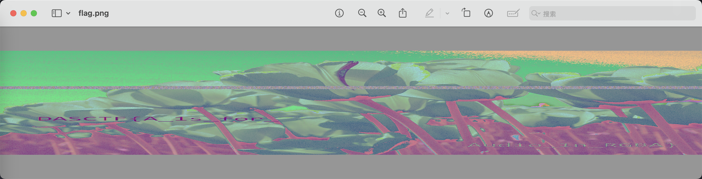
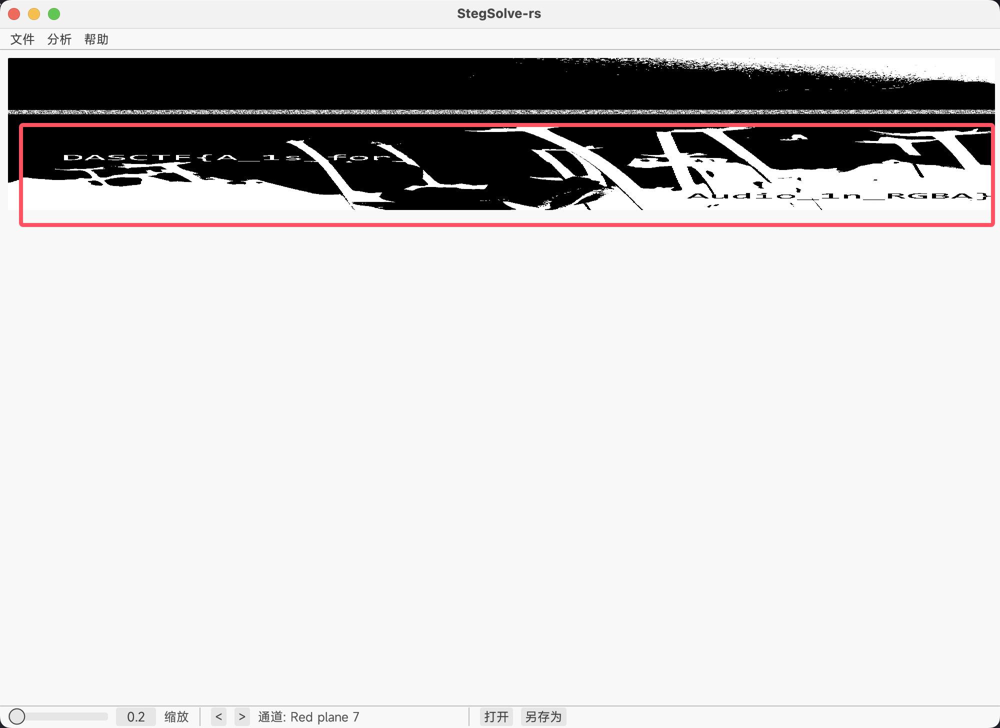

# 2025 浙江省大学生网络与信息安全竞赛 Misc Writeup

**2025 浙江省大学生网络与信息安全竞赛 Misc Writeup**
<!--more-->

本文仅记录问的比较多的几道 Misc 题，其余题目的题解可参考 A1natas 的官方 Writeup：

初赛：[https://mp.weixin.qq.com/s/MpmetBaIVQNhCUOnis63gQ](https://mp.weixin.qq.com/s/MpmetBaIVQNhCUOnis63gQ)

决赛：[https://mp.weixin.qq.com/s/Vl86wmSNVhbZd7f9KSkh8g](https://mp.weixin.qq.com/s/Vl86wmSNVhbZd7f9KSkh8g)

> 本文中涉及的具体题目附件可以进我的[知识星球](https://t.zsxq.com/an6p6)获取

## 题目名称 小小作曲家

附件给了两个pcapng 流量包：attachment.pcapng 和 velato.pcapng

打开翻看一下发现是用 USB 传了 MIDI 数据



我们首先看这个attachment.pcapng，用 tshark 导出一下 midi 事件和对应的时间戳

```bash
tshark -r attachment.pcapng -T fields -Y 'usbaudio.midi.event' -e 'frame.time_epoch' -e 'usbaudio.midi.event' > 1.txt
```

> 这里也是赛后和别的师傅们交流了一下才知道，**这里要把时间戳也一起提取出来**
> 
> 要不然后面制作 mid 文件的时候会有问题，音符和时间就没法对应上，导致错失关键信息
> 
> 参考链接：https://www.dr0n.top/posts/3802b37a/

数据提取出来后的格式大致如下



我们写个脚本，用这些 midi 事件制作 mid 文件

```python
import mido


PPQ = 480  # 每四分音符的 tick 数
BPM = 120.0  # 节拍速度
MIN_DURATION_MS = 120.0  # 音符最小持续时间（毫秒）

def parse_midi_events(input_file):
    with open(input_file, "r") as f:
        data = f.read()

    lines = data.splitlines()
    # print(lines) # 1722159321.608646000\t904064
    events = []

    for line in lines:
        parts = line.split("\t")
        ts_str, hexdata = parts
        ts = float(ts_str)  # 时间戳
        b = bytes.fromhex(hexdata)
        status, note, velocity = b[0], b[1], b[2]
        if 0x90 <= status <= 0x9F and velocity > 0:
            events.append((ts, "note_on", note, velocity))
        elif 0x80 <= status <= 0x8F or (0x90 <= status <= 0x9F and velocity == 0):
            events.append((ts, "note_off", note, velocity))

    return events

def enforce_min_note_duration(events):
    # 按需延长 Note Off 的时间，保证音符不少于 MIN_DURATION_MS
    min_duration = MIN_DURATION_MS / 1000.0
    active_notes = {}  # 记录活跃的 note_on 事件
    processed_events = []
    
    for event in events:
        ts, event_type, note, velocity = event
        if event_type == "note_on":
            key = note
            active_notes[key] = (ts, event_type, note, velocity)
            processed_events.append(event)
        elif event_type == "note_off":
            key = note
            if key in active_notes:
                start_ts, _, _, _ = active_notes[key]
                min_end = start_ts + min_duration
                # 如果持续时间太短，延长 Note Off 的时间戳
                if ts < min_end:
                    new_event = (min_end, event_type, note, velocity)
                    processed_events.append(new_event)
                else:
                    processed_events.append(event)
                del active_notes[key]
            else:
                processed_events.append(event)
    
    # 对处理后的事件按时间戳排序
    processed_events.sort(key=lambda x: x[0])
    return processed_events

def build_midi(events, output_midi):
    # 确保所有音符都有最小持续时间
    processed_events = enforce_min_note_duration(events)
    
    # 创建 MIDI 文件
    mid = mido.MidiFile(ticks_per_beat=PPQ)
    track = mido.MidiTrack()
    mid.tracks.append(track)
    
    # 设置曲速
    tempo_us = int(mido.bpm2tempo(BPM))
    track.append(mido.MetaMessage("set_tempo", tempo=tempo_us, time=0))
    
    # 将事件转换为MIDI消息
    prev_time = 0.0
    start_time = processed_events[0][0] if processed_events else 0
    
    for event in processed_events:
        ts, event_type, note, velocity = event
        rel_time = ts - start_time
        
        # 计算与前一个事件的时间差（秒）
        delta = max(0.0, rel_time - prev_time)
        
        # 将秒转换为 MIDI tick 数
        ticks = int(round(mido.second2tick(delta, PPQ, tempo_us)))
        
        # 创建MIDI消息
        if event_type == "note_on":
            msg = mido.Message("note_on", note=note, velocity=velocity, time=ticks)
        elif event_type == "note_off":
            msg = mido.Message("note_off", note=note, velocity=velocity, time=ticks)
        else:
            continue
            
        track.append(msg)
        prev_time = rel_time
    
    track.append(mido.MetaMessage("end_of_track", time=0))
    mid.save(output_midi)
    print(f"[+] MIDI 文件已保存：{output_midi}（共 {len(processed_events)} 个事件）")

if __name__ == "__main__":
    input_data = "1.txt"
    out_midi = "1.mid"
    
    events = parse_midi_events(input_data)
    print(f"[+] 提取到 {len(events)} 个 MIDI 事件")
    
    build_midi(events, out_midi)
```

> 这个代码具体是什么意思呢？
> 
> 就是首先从我们 tshark 提取出来的数据中解析时间戳和 midi 时间
> 
> 然后我们设置一个时间间隔：0.01，只要是小于这个时间间隔的，我们就认为是同时按下去的
> 
> 其实可以认为就是乐理中的和弦，那么我们要怎么注意到这个规律的呢?
> 
> 我们可以直接去看 tshark 中提取出来的midi数据(一共三字节)：
> 
> 第一字节代表事件(note on/note off)，第二字节代表音符，第三字节代表力度
> 
> 然后我们可以看到音符有很多连续的段，但是中间有时候会缺几个
> 
> 这其实就对应到二维码中黑白像素的分布，连续的就是黑色像素的位置，缺失的则是白色像素

然后我们用 audacity 打开制作好的 mid 文件，稍微拉伸缩放一下，可以看到下图



发现是个倒置的二维码，但是很明显这样是没法扫描的，因此我们可以写个脚本把它保存到图片中

```python
import numpy as np
from PIL import Image
import mido

PPQ = 480  # 每四分音符的 tick 数
BPM = 120.0  # 节拍速度
MIN_DURATION_MS = 120.0  # 音符最小持续时间（毫秒）

def parse_midi_events(input_file):
    with open(input_file, "r") as f:
        data = f.read()

    lines = data.splitlines()
    # print(lines) # 1722159321.608646000\t904064
    events = []

    for line in lines:
        parts = line.split("\t")
        ts_str, hexdata = parts
        ts = float(ts_str)  # 时间戳
        b = bytes.fromhex(hexdata)
        status, note, velocity = b[0], b[1], b[2]
        if 0x90 <= status <= 0x9F and velocity > 0:
            events.append((ts, "note_on", note, velocity))
        elif 0x80 <= status <= 0x8F or (0x90 <= status <= 0x9F and velocity == 0):
            events.append((ts, "note_off", note, velocity))

    return events

def group_rows(events):
    rows = []
    current = []
    prev = None

    # 只使用 note_on 事件来分组行
    note_on_events = [ev for ev in events if ev[1] == "note_on"]
    
    for ts, event_type, note, velocity in note_on_events:
        # 如果大于阈值0.01s，就是下一行的数据
        if prev is not None and ts - prev > 0.01:
            rows.append(current)
            current = []
        current.append(note)  # 同一行的都加入
        prev = ts
        
    rows.append(current)  # 添加一整行的数据
    return rows

def render_matrix(rows):
    note_set = set()  # 利用集合去重
    for row in rows:
        for n in row:
            note_set.add(n)

    # print(note_set)
    all_notes = sorted(note_set)  # 从小到大排序
    # print(all_notes)
    note_to_idx = {}  # 音符对应到列
    for i, note in enumerate(all_notes):
        note_to_idx[note] = i

    H = len(rows)
    W = len(all_notes)
    matrix = np.zeros((H, W), dtype=np.uint8)

    for y, row in enumerate(rows):  # 填充矩阵
        for n in row:
            col = note_to_idx[n]
            matrix[y, col] = 1

    return matrix

def save_png(matrix, out_img):
    # 矩阵中大于 0 的置为 0（黑色），等于 0 的置为 255（白色）
    img = Image.fromarray(np.where(matrix > 0, 0, 255).astype("uint8"))
    H, W = matrix.shape
    img = img.resize((W * 20, H * 20), Image.NEAREST)  # 放大二维码
    img.save(out_img)
    print(f"[+] 图像已保存：{out_img}")

def enforce_min_note_duration(events):
    # 按需延长 Note Off 的时间，保证音符不少于 MIN_DURATION_MS
    min_duration = MIN_DURATION_MS / 1000.0
    active_notes = {}  # 记录活跃的 note_on 事件
    processed_events = []
    
    for event in events:
        ts, event_type, note, velocity = event
        if event_type == "note_on":
            key = note
            active_notes[key] = (ts, event_type, note, velocity)
            processed_events.append(event)
        elif event_type == "note_off":
            key = note
            if key in active_notes:
                start_ts, _, _, _ = active_notes[key]
                min_end = start_ts + min_duration
                # 如果持续时间太短，延长 Note Off 的时间戳
                if ts < min_end:
                    new_event = (min_end, event_type, note, velocity)
                    processed_events.append(new_event)
                else:
                    processed_events.append(event)
                del active_notes[key]
            else:
                processed_events.append(event)
    
    # 对处理后的事件按时间戳排序
    processed_events.sort(key=lambda x: x[0])
    return processed_events

def build_midi(events, output_midi):
    # 确保所有音符都有最小持续时间
    processed_events = enforce_min_note_duration(events)
    
    # 创建 MIDI 文件
    mid = mido.MidiFile(ticks_per_beat=PPQ)
    track = mido.MidiTrack()
    mid.tracks.append(track)
    
    # 设置曲速
    tempo_us = int(mido.bpm2tempo(BPM))
    track.append(mido.MetaMessage("set_tempo", tempo=tempo_us, time=0))
    
    # 将事件转换为MIDI消息
    prev_time = 0.0
    start_time = processed_events[0][0] if processed_events else 0
    
    for event in processed_events:
        ts, event_type, note, velocity = event
        rel_time = ts - start_time
        
        # 计算与前一个事件的时间差（秒）
        delta = max(0.0, rel_time - prev_time)
        
        # 将秒转换为 MIDI tick 数
        ticks = int(round(mido.second2tick(delta, PPQ, tempo_us)))
        
        # 创建MIDI消息
        if event_type == "note_on":
            msg = mido.Message("note_on", note=note, velocity=velocity, time=ticks)
        elif event_type == "note_off":
            msg = mido.Message("note_off", note=note, velocity=velocity, time=ticks)
        else:
            continue
            
        track.append(msg)
        prev_time = rel_time
    
    track.append(mido.MetaMessage("end_of_track", time=0))
    mid.save(output_midi)
    print(f"[+] MIDI 文件已保存：{output_midi}（共 {len(processed_events)} 个事件）")

if __name__ == "__main__":
    input_data = "1.txt"
    out_img = "1.png"
    out_midi = "1.mid"
    
    events = parse_midi_events(input_data)
    print(f"[+] 提取到 {len(events)} 个 MIDI 事件")
    
    build_midi(events, out_midi)
    
    # 生成图像（只使用 note_on 事件）
    note_on_events = [ev for ev in events if ev[1] == "note_on"]
    print(f"[+] 其中 {len(note_on_events)} 个 NOTE ON 事件")
    
    rows = group_rows(events)
    print(f"[+] 分成 {len(rows)} 行")
    
    matrix = render_matrix(rows)
    save_png(matrix, out_img)
```

运行以上图片后可以得到下图



发现左上角有个像素位置偏移了，不过问题不大，用工具或者手动处理一下也能扫出来

扫码后得到：`dac765079a6eb04a6a2a89a601c40c5f8e7c08e5f1b37bac6016e1c63f193d10`

然后我们再去看 velato.pcapng，前面的步骤是一样的，首先用 tshark 导出时间戳和 midi 事件

```bash
tshark -r velato.pcapng -T fields -Y 'usbaudio.midi.event' -e 'frame.time_epoch' -e 'usbaudio.midi.event' > 2.txt 
```

然后用上面那个脚本生成 mid 文件

```python
import mido


PPQ = 480  # 每四分音符的 tick 数
BPM = 120.0  # 节拍速度
MIN_DURATION_MS = 120.0  # 音符最小持续时间（毫秒）

def parse_midi_events(input_file):
    with open(input_file, "r") as f:
        data = f.read()

    lines = data.splitlines()
    # print(lines) # 1722159321.608646000\t904064
    events = []

    for line in lines:
        parts = line.split("\t")
        ts_str, hexdata = parts
        ts = float(ts_str)  # 时间戳
        b = bytes.fromhex(hexdata)
        status, note, velocity = b[0], b[1], b[2]
        if 0x90 <= status <= 0x9F and velocity > 0:
            events.append((ts, "note_on", note, velocity))
        elif 0x80 <= status <= 0x8F or (0x90 <= status <= 0x9F and velocity == 0):
            events.append((ts, "note_off", note, velocity))

    return events

def enforce_min_note_duration(events):
    # 按需延长 Note Off 的时间，保证音符不少于 MIN_DURATION_MS
    min_duration = MIN_DURATION_MS / 1000.0
    active_notes = {}  # 记录活跃的 note_on 事件
    processed_events = []
    
    for event in events:
        ts, event_type, note, velocity = event
        if event_type == "note_on":
            key = note
            active_notes[key] = (ts, event_type, note, velocity)
            processed_events.append(event)
        elif event_type == "note_off":
            key = note
            if key in active_notes:
                start_ts, _, _, _ = active_notes[key]
                min_end = start_ts + min_duration
                # 如果持续时间太短，延长 Note Off 的时间戳
                if ts < min_end:
                    new_event = (min_end, event_type, note, velocity)
                    processed_events.append(new_event)
                else:
                    processed_events.append(event)
                del active_notes[key]
            else:
                processed_events.append(event)
    
    # 对处理后的事件按时间戳排序
    processed_events.sort(key=lambda x: x[0])
    return processed_events

def build_midi(events, output_midi):
    # 确保所有音符都有最小持续时间
    processed_events = enforce_min_note_duration(events)
    
    # 创建 MIDI 文件
    mid = mido.MidiFile(ticks_per_beat=PPQ)
    track = mido.MidiTrack()
    mid.tracks.append(track)
    
    # 设置曲速
    tempo_us = int(mido.bpm2tempo(BPM))
    track.append(mido.MetaMessage("set_tempo", tempo=tempo_us, time=0))
    
    # 将事件转换为MIDI消息
    prev_time = 0.0
    start_time = processed_events[0][0] if processed_events else 0
    
    for event in processed_events:
        ts, event_type, note, velocity = event
        rel_time = ts - start_time
        
        # 计算与前一个事件的时间差（秒）
        delta = max(0.0, rel_time - prev_time)
        
        # 将秒转换为 MIDI tick 数
        ticks = int(round(mido.second2tick(delta, PPQ, tempo_us)))
        
        # 创建MIDI消息
        if event_type == "note_on":
            msg = mido.Message("note_on", note=note, velocity=velocity, time=ticks)
        elif event_type == "note_off":
            msg = mido.Message("note_off", note=note, velocity=velocity, time=ticks)
        else:
            continue
            
        track.append(msg)
        prev_time = rel_time
    
    track.append(mido.MetaMessage("end_of_track", time=0))
    mid.save(output_midi)
    print(f"[+] MIDI 文件已保存：{output_midi}（共 {len(processed_events)} 个事件）")

if __name__ == "__main__":
    input_data = "2.txt"
    out_midi = "2.mid"
    
    events = parse_midi_events(input_data)
    print(f"[+] 提取到 {len(events)} 个 MIDI 事件")
    
    build_midi(events, out_midi)
```

其实流量包的文件名给了我们提示：`velato`

`velato` 是一种编程语言，我们可以到官网上下载编译器：https://velato.net/

编译然后运行即可得到密钥：`Th1s1sAuSeFu1ke4`



最后解个 AES-ECB 即可得到 flag：`DASCTF{M1D1_C0Mp0s2r!!!}`




## 题目名称 Really Good Binaural Audio

> 题面信息：
> 
> Tell me when you sight the sound.

附件给了一个 `flag.wav` 的音频文件，我们用 Audacity 打开，在频谱图中可以看到表示题目名称的字符串



我们可以先写个脚本来查看一下这个音频的基本信息

```python
import wave

def get_info():
    with wave.open("flag.wav",'rb') as wf:
        n_channels = wf.getnchannels()
        samplewidth_bytes = wf.getsampwidth()
        bits_per_sample = samplewidth_bytes * 8
        framerate = wf.getframerate()
        n_frames = wf.getnframes()
        duration = n_frames / framerate
    print(f"通道数: {n_channels}")
    print(f"每个采样的字节数: {samplewidth_bytes}")
    print(f"每个采样的位数: {bits_per_sample}")
    print(f"采样率: {framerate}")
    print(f"总帧数: {n_frames}")
    print(f"时长(秒): {duration}")
    # 通道数: 2
    # 每个采样的字节数: 2
    # 每个采样的位数: 16
    # 采样率: 22050
    # 总帧数: 3884905
    # 时长(秒): 176.18616780045352
```

发现是双声道，采样的精度是 16bit，因此每个采样点双声道就包含 32bit 的数据

总的采样点数为3884905，分解一下可以得到 3884905 = 5 x 761 x 1021

把题目名中每个单词的首字母连起来可以得到`RGBA`这个提示，猜测是要我们把这些数据转为 RGBA 像素

并且频谱图中也提示了我们：左声道是 RG，右声道则是 BA

因为是 RGBA 图像，并且我们之前分析得到每个采样点双声道包含 32bit 的数据

因此猜测 RGBA 每个通道就都是 8bit 的数据，但是图像的宽高是什么呢？

我们可以写个脚本来查看一下具体的数据

```python
from scipy.io import wavfile

def func1():
    sample_rate, data = wavfile.read("flag.wav")
    for idx,[l,r] in enumerate(data[:100]):
        if idx % 5 == 0:
            print(f"{'='*50}")
        r, g = (l >> 8) & 0xFF, l & 0xFF
        b, a = (r >> 8) & 0xFF, r & 0xFF
        l, r = int(l), int(r)
        r, g, b, a = int(r), int(g), int(b), int(a)
        print(f"{l,r} -> {(r,g,b,a)}")
```



仔细观察我们就会发现，这个像素点的分布大致是以5个像素点的数据为一组的

因此我们从之前的总采样点数：3884905 = 5 x 761 x 1021，就可以判断图像宽高就是 1021 x 761 或者 761 x 1021

我们写个脚本提取一下数据，然后转为RGBA像素点

```python
from PIL import Image
from scipy.io import wavfile

def solve():
    sample_rate, data = wavfile.read("flag.wav")
    img = Image.new('RGBA', (1021, 761))

    for y in range(761):
        for x in range(1021):
            i = (x + y * 1021) * 5 # 5个采样点一组
            left_val = data[i][0]  # 左声道的数据
            right_val = data[i][1] # 右声道的数据
            r, g = (left_val >> 8) & 0xFF, left_val & 0xFF    # 高 8 位 -> R，低 8 位 -> G
            b, a = (right_val >> 8) & 0xFF, right_val & 0xFF  # 高 8 位 -> B，低 8 位 -> A
            r, g, b, a = int(r), int(g), int(b), int(a) # np.int16 转为 int 类型
            img.putpixel((x, y), (r, g, b, a))

    img.show()
    img.save('flag.png')
```

运行以上脚本后即可得到下图，flag 可能有点模糊，不过硬看也能看出来


如果想要更清晰的 flag，可以到 stegsolve 中调整一下


`DASCTF{A_1s_for_Audio_1n_RGBA}`

当然，这里如果没注意到像素分布是 5 个一组，这题也是可以做的，就是出来的图像可能会有点变形

```python
from PIL import Image
from scipy.io import wavfile

def solve():
    sample_rate, data = wavfile.read("flag.wav")
    img = Image.new('RGBA', (5105, 761))
    for y in range(761):
        for x in range(5105):
            i = x + y * 5105
            left_val = data[i][0]  # 左声道的数据
            right_val = data[i][1] # 右声道的数据
            r, g = (left_val >> 8) & 0xFF, left_val & 0xFF    # 高 8 位 -> R，低 8 位 -> G
            b, a = (right_val >> 8) & 0xFF, right_val & 0xFF  # 高 8 位 -> B，低 8 位 -> A
            r, g, b, a = int(r), int(g), int(b), int(a) # np.int16 转为 int 类型
            img.putpixel((x, y), (r, g, b, a))

    img.show()
    img.save('flag.png')
```






附：完整解题脚本

```python
from PIL import Image
from scipy.io import wavfile

def func1():
    sample_rate, data = wavfile.read("flag.wav")
    for idx,[l,r] in enumerate(data[:100]):
        if idx % 5 == 0:
            print(f"{'='*50}")
        r, g = (l >> 8) & 0xFF, l & 0xFF
        b, a = (r >> 8) & 0xFF, r & 0xFF
        l, r = int(l), int(r)
        r, g, b, a = int(r), int(g), int(b), int(a)
        print(f"{l,r} -> {(r,g,b,a)}")

def solve():
    sample_rate, data = wavfile.read("flag.wav")
    img = Image.new('RGBA', (1021, 761))

    for y in range(761):
        for x in range(1021):
            i = (x + y * 1021) * 5 # 5个采样点一组
            left_val = data[i][0]  # 左声道的数据
            right_val = data[i][1] # 右声道的数据
            r, g = (left_val >> 8) & 0xFF, left_val & 0xFF    # 高 8 位 -> R，低 8 位 -> G
            b, a = (right_val >> 8) & 0xFF, right_val & 0xFF  # 高 8 位 -> B，低 8 位 -> A
            r, g, b, a = int(r), int(g), int(b), int(a) # np.int16 转为 int 类型
            img.putpixel((x, y), (r, g, b, a))

    img.show()
    img.save('flag.png')


if __name__ == '__main__':
    func1()
    solve()
```


---

> 作者: [Lunatic](https://goodlunatic.github.io)  
> URL: https://goodlunatic.github.io/posts/8582ff7/  

