# 2025 能源网络安全大赛 Misc Writeup

**2025 能源网络安全大赛 Misc Writeup**

<!--more-->

> 本文中涉及的具体题目附件可以进我的交流群获取，进群详见 [About](https://goodlunatic.github.io/about/)

## 题目名称 black_white

解压附件压缩包，得到得到一张PNG，010打开发现末尾藏了一张数据逆置的PNG

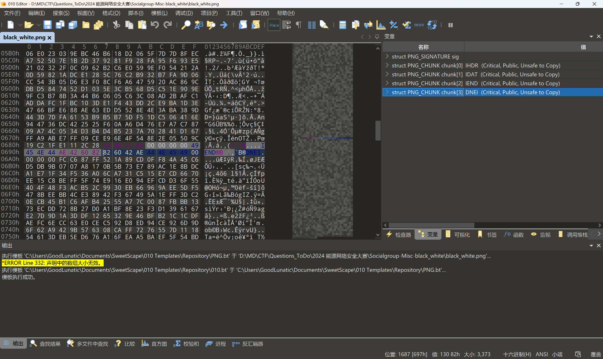

把末尾的PNG提取出来，可以得到两张由黑白像素组成的图片，同时两张图片的分辨率也是一样的

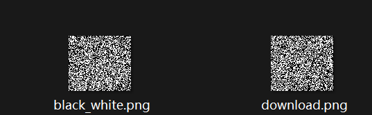

看到黑白图片，第一反应便是把黑白像素转为0和1

然后再结合两张这个数量，猜测是提取二进制数据后再进行二进制操作(异或的可能性最大)

因此写个脚本尝试一下

```python
from PIL import Image
import numpy as np
import libnum

img_array1 = np.array(Image.open("black_white.png"))
img_array2 = np.array(Image.open("download.png"))

data = ((img_array1 & 1) ^ (img_array2 & 1)).flatten()
bin_data = "".join(data.astype(str))  # 将0/1转换为字符串后连接
res = libnum.b2s(bin_data)
print(res)

# with open("flag.zip",'wb') as f:
#     f.write(res)
```

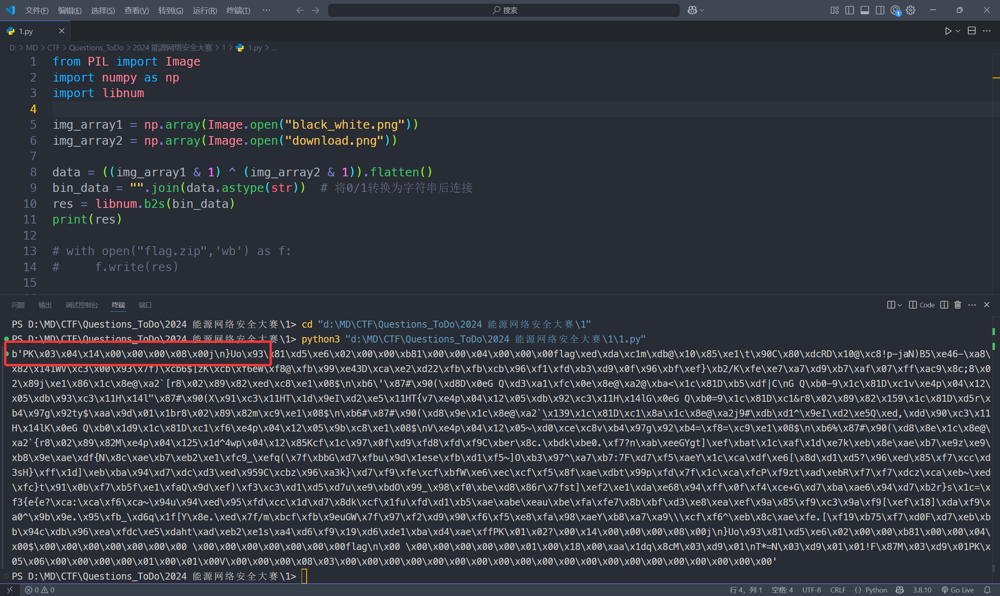

发现二进制数据异或后可以得到一个压缩包

于是我们保存为`flag.zip`，打开得到一个未知后缀的`flag`文件

我们在010中打开这个文件

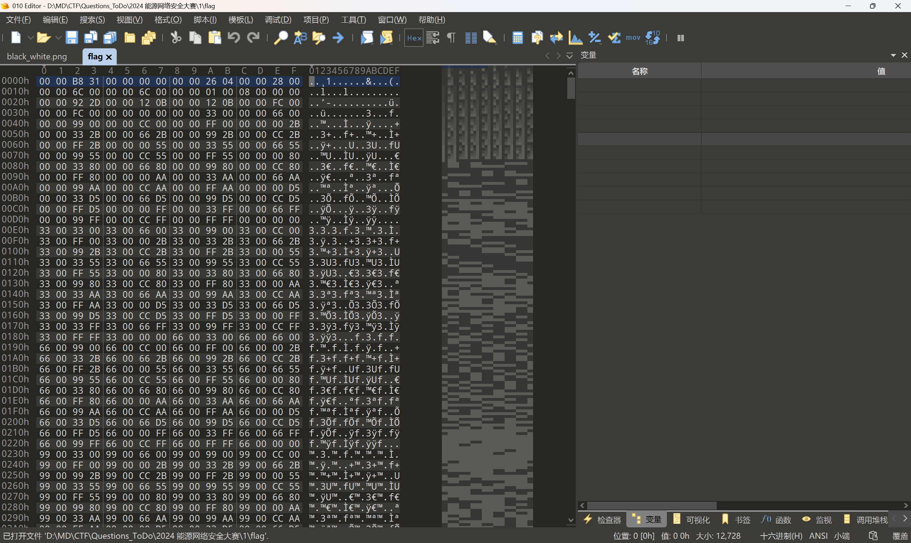

经过尝试，发现在前面补上BMP的文件头`42 4D`并改后缀为`.bmp`后可以得到一张被篡改过的汉信码

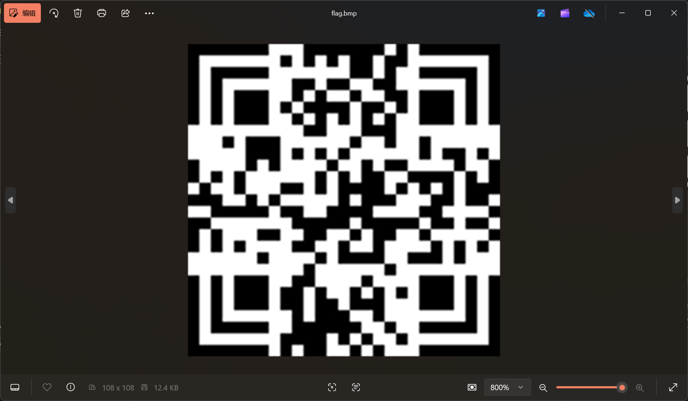

仔细对比正常的汉信码，可以发现是左下角被旋转了180°

因此我们在PPT中修复好，然后扫码即可得到最后的flag：`flag{89b58e77-7b42-4fd1-9e58-e50d98cc5894}`

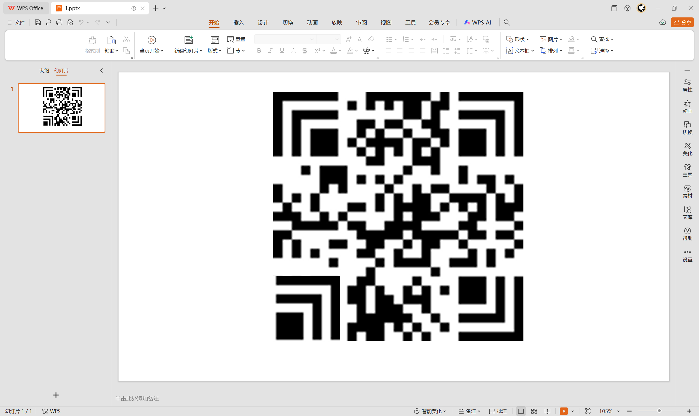

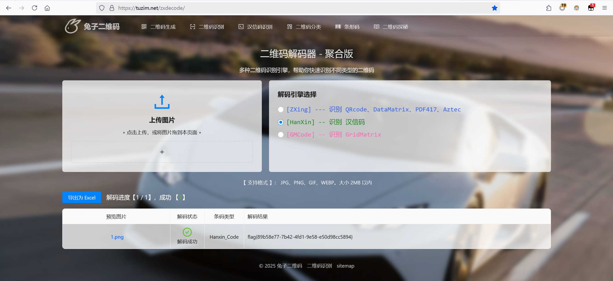


## 题目名称 alarm_clock

解压附件压缩包，得到一个`alarm_clock.vmdk`，我们尝试用`DiskGnuis`挂载并恢复被删除的文件

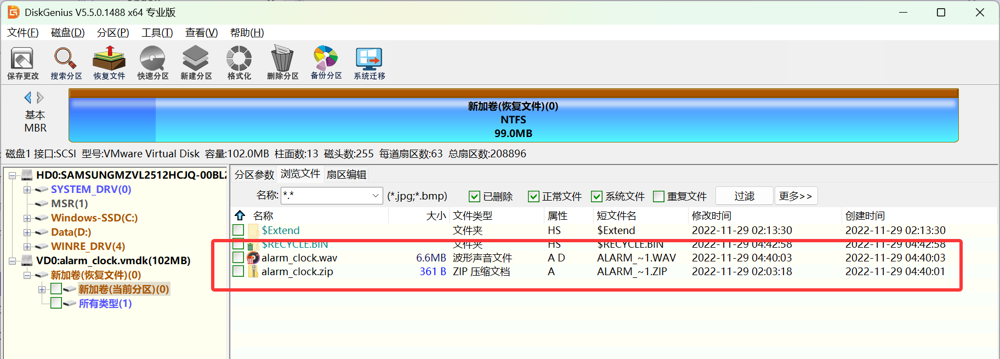

恢复可以得到一个wav文件和一个加密的压缩包

打开wav文件听一下，发现是SSTV，用工具识别后可以得到压缩包的解压密码：`z@Wa1uDu0`

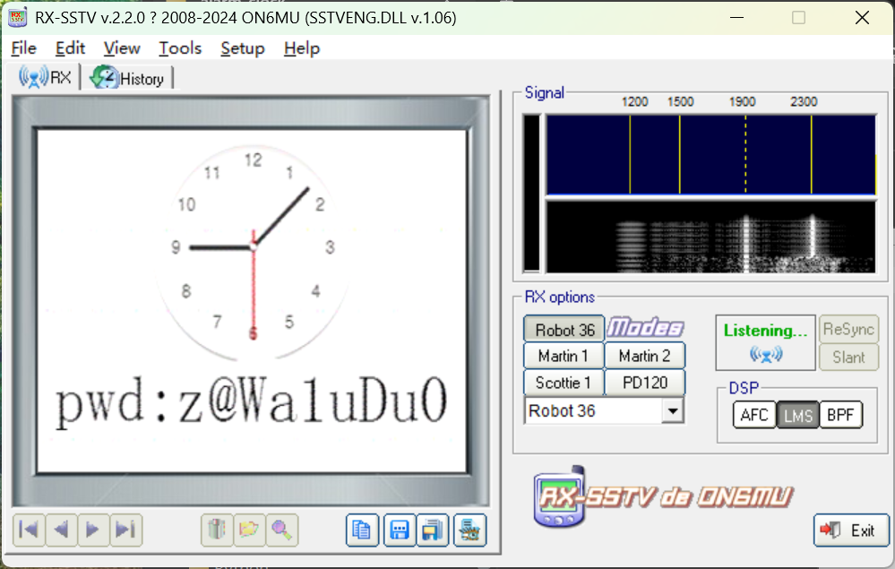

解压后可以得到一个`data.txt`，里面的数据格式如下：

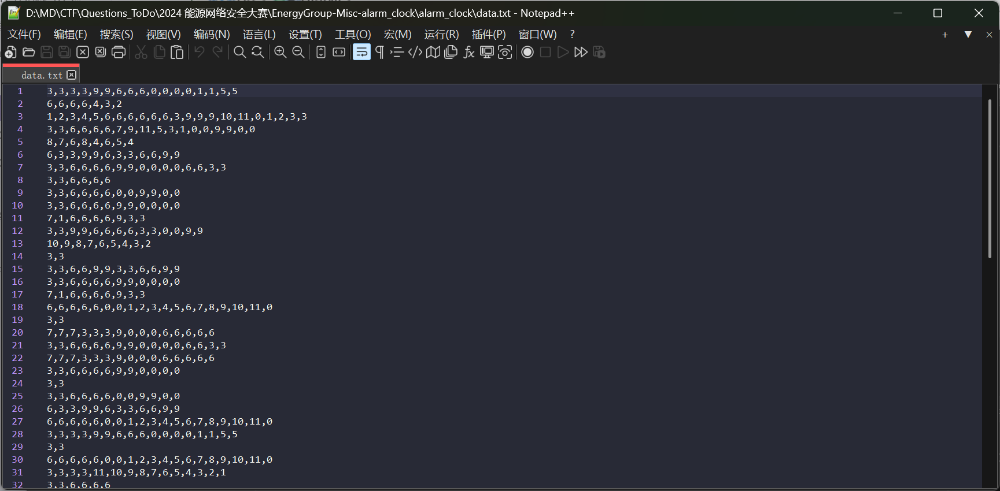

结合上面扫出来的SSTV图像种的时钟，猜测数字代表的就是时钟上刻度的方向，有几个数字就代表往这个方向前进几格

然后每一行都是从原点开始，因此我们写一个脚本按照数字的顺序画轨迹图

```python
import matplotlib.pyplot as plt
import math
import os

def number_to_angle(num):
    return (int(num) * 30) % 360

def angle_to_coord(angle):
    rad = math.radians(angle - 90)
    return (math.cos(rad), math.sin(rad))

def func1(data):
    os.makedirs("output", exist_ok=True)
    for i, path in enumerate(data):
        plt.figure(figsize=(8, 8))
        ax = plt.gca()
        ax.set_aspect('equal', adjustable='box')
        plt.title(f'Figure {i+1}')
        
        x_coords = [0]
        y_coords = [0]
        current_x, current_y = 0, 0
        
        for num in path:
            angle = number_to_angle(num)
            dx, dy = angle_to_coord(angle)
            current_x += dx
            current_y += dy
            x_coords.append(current_x)
            y_coords.append(-1 * current_y)
        
        plt.plot(x_coords, y_coords, marker='o', markersize=3, color='blue')
        plt.grid(True, alpha=0.3)
        plt.xlim(-8, 8)
        plt.ylim(-8, 8)
        filename = f'output/{i+1:02d}.png'
        plt.savefig(filename, dpi=100, bbox_inches='tight')
        plt.close()
        print(f'Saved: {filename}')

if __name__ == "__main__":
    data = []
    with open("data.txt", 'r') as f:
        lines = f.read().split()
    for line in lines:
        data.append(line.split(','))
    # print(data)
    func1(data)
```

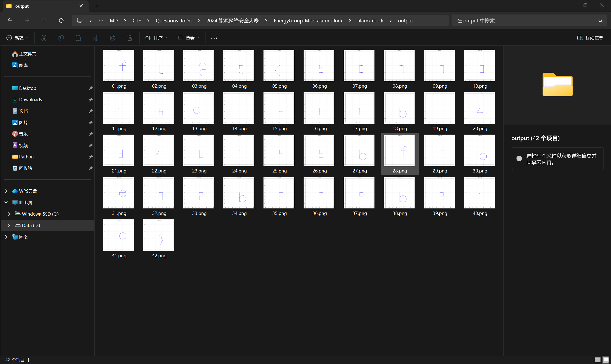

运行脚本画图后即可得到最后的flag：`flag{5879016c-301b-4840-95bf-be72b379b21e}`

## 题目名称 Bluetooth

用`Wireshark`打开流量包，发现会报错

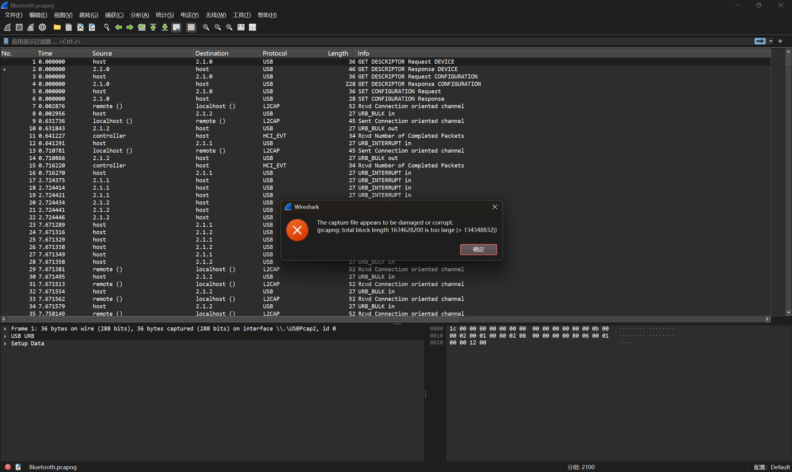

因此我们尝试用010打开，发现文件末尾有多余的数据：`quaternary`

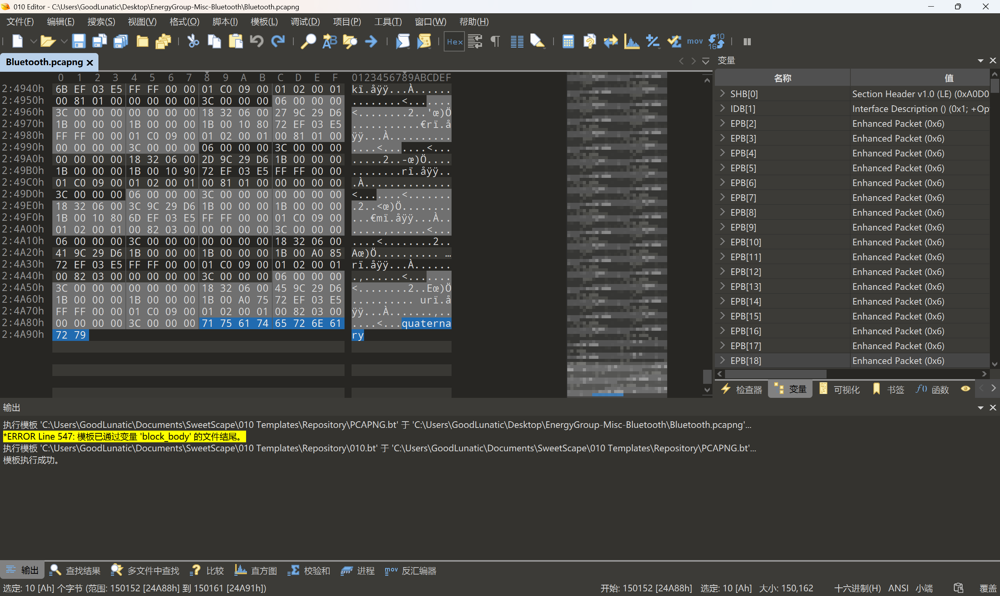

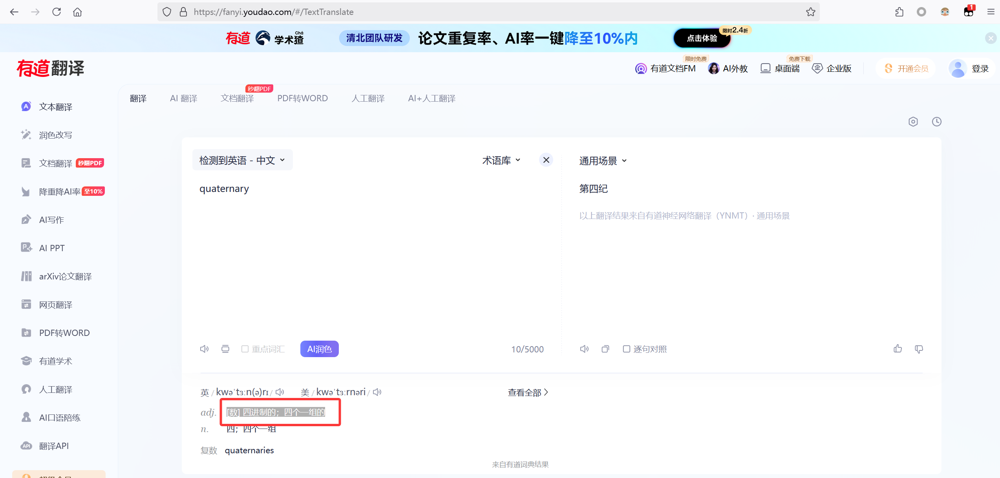

有道翻译一下，发现这个词有四进制的意思

删除末尾多余数据后再翻看流量包，发现有很多个从`remote()`发到`localhost()`的数据包

并且仔细比较可以发现，长度为52的数据包，`payload`变化的数据主要在倒数第三位

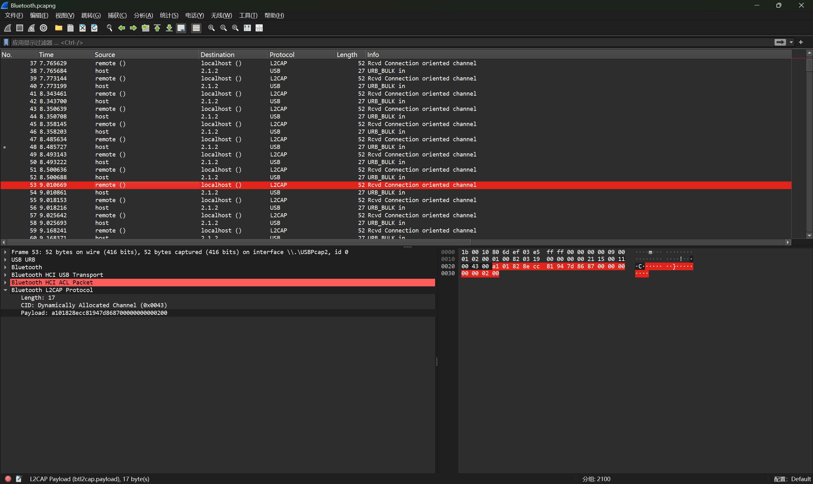

我们尝试使用`tshark`把长度为52的数据包的`payload`提取出来分析

```bash
tshark -r Bluetooth.pcapng -Y '(_ws.col.protocol == "L2CAP") && (frame.len == 52)' -T fields -e 'btl2cap.payload' > 1.txt
```

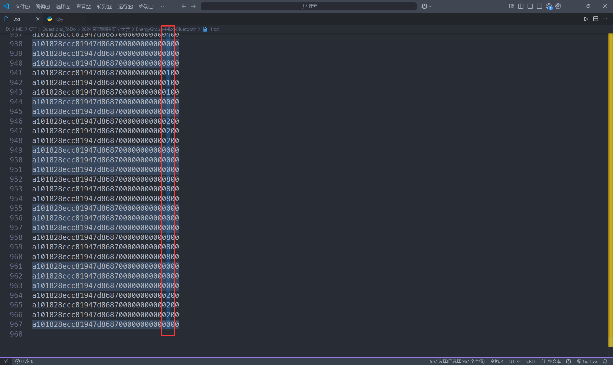

然后我们在vscode中把倒数第三位的值单独提取出来分析，发现数据主要是由01248这几个数字构成的

看到这几个数字，第一反应是云影密码，但是经过尝试发现解密后得不到有用的信息

```python
# 云影密码
ciphey="0222000444000222000444000222000444008880001110002220004400011100222000222000444000222000888000222000888000444000888000111008880002220002200022200444000111022200111000888000220001110001110008880004440011100111000888000111000444000222000444000110002220002220004440002220001110022200044400022200022200011100044000888000222000111000888000111000222000111008880011100111000222000444000222000220002220044400022200011100011100044400088800222000111000888000222000111000111000888004440002220001110008880011100011100111000888002220002220001110004440008880002220002220004440001110222000111000888000444001100011100088800044400011100011100088800022200044400011000444000888000222000111000888000111000888000111008880002220004440001110088800044400222000111000888000444000111000111000888000222001110011100088000222000444000220004440022200011100011100088800011100044400111000888000222000888000222000444000111000222000111000888000111000111000111000888000444000111002220008880008880002220"
enc_list=ciphey.split('0')
res=[]
print(enc_list)
for item in enc_list:
    sum=0
    for num in item:
        sum += int(num)
    res.append(chr(sum+64))
print(''.join(res))
# @F@@L@@F@@L@@F@@L@X@@C@@F@@H@@C@F@@F@@L@@F@@X@@F@@X@@L@@X@@C@X@@F@@D@@F@L@@CF@C@@X@@D@@C@@C@@X@@L@C@C@@X@@C@@L@@F@@L@@B@@F@@F@@L@@F@@C@F@@L@@F@@F@@C@@H@@X@@F@@C@@X@@C@@F@@C@X@C@C@@F@@L@@F@@D@@F@L@@F@@C@@C@@L@@X@F@@C@@X@@F@@C@@C@@X@L@@F@@C@@X@C@@C@C@@X@F@@F@@C@@L@@X@@F@@F@@L@@CF@@C@@X@@L@B@@C@@X@@L@@C@@C@@X@@F@@L@@B@@L@@X@@F@@C@@X@@C@@X@@C@X@@F@@L@@C@X@@L@F@@C@@X@@L@@C@@C@@X@@F@C@C@@P@@F@@L@@D@@L@F@@C@@C@@X@@C@@L@C@@X@@F@@X@@F@@L@@C@@F@@C@@X@@C@@C@@C@@X@@L@@C@F@@X@@X@@F@
```

然后我们联想到之前得到的提示:`quaternary-四进制`

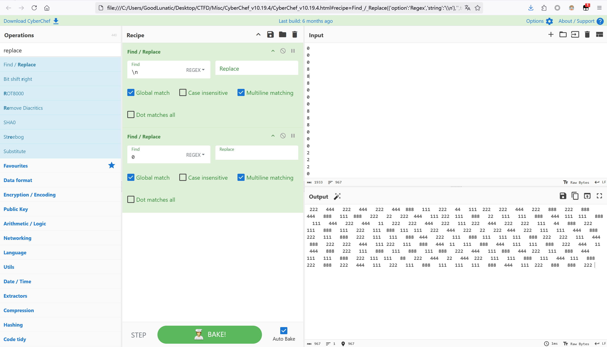

当我们把0作为空格分隔符后，可以发现数据就剩下了 `11` `111` `22` `222` `44` `444` `88` `888` 这几种

> 因为一共就剩下了1248这四种数字，刚刚好符合我们之前得到的提示`quaternary-四进制`的规律

因此我们尝试在`CyberChef`中把两位三位的数字都替换成一位，并转换到四进制数上后可以得到如下数据

> Tips：四进制数的对应关系如下
> 
> 1 -> 0
> 
> 2 -> 1
> 
> 4 -> 2
> 
> 8 -> 3

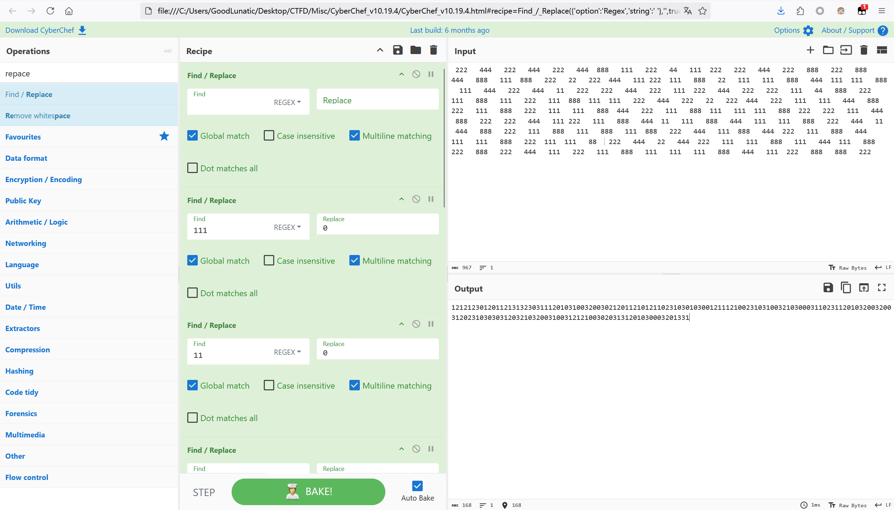

```
121212301201121313230311120103100320030212011210121102310301030012111210023103100321030003110231120103200320031202310303031203210320031003121210030203131201030003201331
```

最后我们写个脚本，把上面的四进制数据转为字符串即可得到最后的flag：`flag{5a482ade-10ed-4905-a886-369846d27a08}`

```python
from Crypto.Util.number import long_to_bytes

data = "121212301201121313230311120103100320030212011210121102310301030012111210023103100321030003110231120103200320031202310303031203210320031003121210030203131201030003201331"

print(long_to_bytes(int(data,4)))
# b'flag{5a482ade-10ed-4905-a886-369846d27a08}'
```

## 题目名称 USB

题面信息如下：

> 小明是一家新能源汽车制造厂的运维人员，每天的工作是在电脑前对数据进行运维，由于操作失误，导致系统出现故障。请根据维修人员捕获的流量包，分析当天小明执行了什么指令，导致的系统故障。
> 
> flag格式为：flag{执行指令}。
> 
> 例如执行的指令为ipconfig /all，则答案为flag{ipconfig /all}

直接`CTF-NetA`一把梭了：`flag{whoami && rm -rf /opt}`

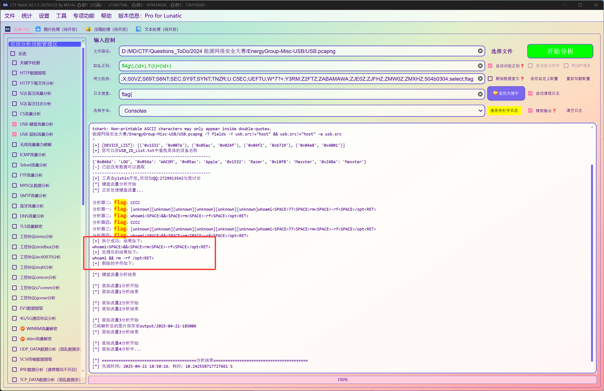


---

> 作者: [Lunatic](https://goodlunatic.github.io)  
> URL: https://goodlunatic.github.io/posts/87bd986/  

