# 2025 能源网络安全大赛 Misc Writeup

**2025 能源网络安全大赛 Misc Writeup**

&lt;!--more--&gt;

&gt; 题目附件：https://github.com/CTF-Archives/energyCTF2025

## 题目名称 black_white

解压附件压缩包，得到得到一张PNG，010打开发现末尾藏了一张数据逆置的PNG

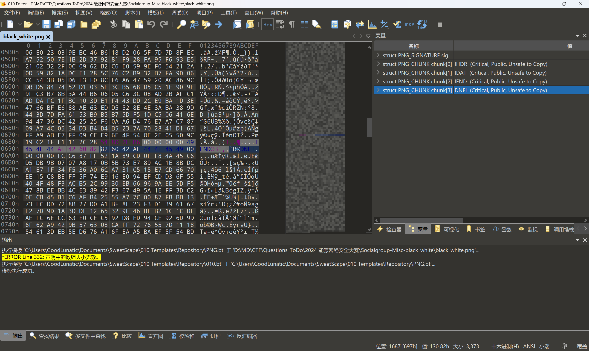

把末尾的PNG提取出来，可以得到两张由黑白像素组成的图片，同时两张图片的分辨率也是一样的

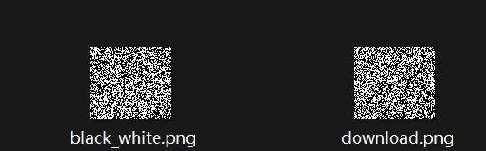

看到黑白图片，第一反应便是把黑白像素转为0和1

然后再结合两张这个数量，猜测是提取二进制数据后再进行二进制操作(异或的可能性最大)

因此写个脚本尝试一下

```python
from PIL import Image
import numpy as np
import libnum

img_array1 = np.array(Image.open(&#34;black_white.png&#34;))
img_array2 = np.array(Image.open(&#34;download.png&#34;))

data = ((img_array1 &amp; 1) ^ (img_array2 &amp; 1)).flatten()
bin_data = &#34;&#34;.join(data.astype(str))  # 将0/1转换为字符串后连接
res = libnum.b2s(bin_data)
print(res)

# with open(&#34;flag.zip&#34;,&#39;wb&#39;) as f:
#     f.write(res)
```

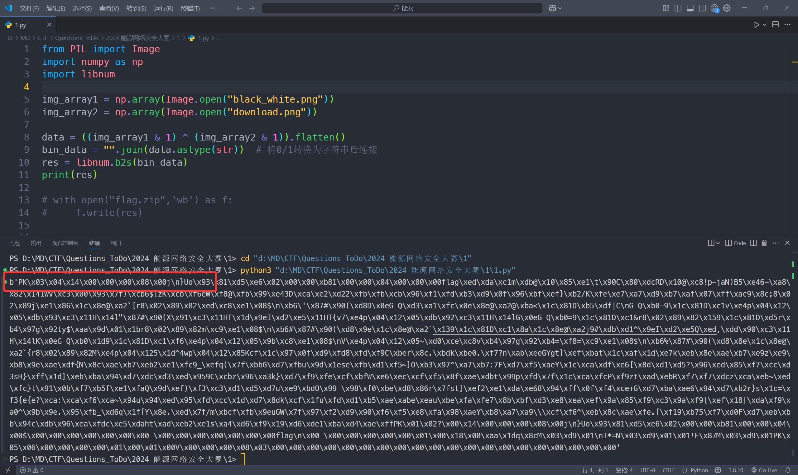

发现二进制数据异或后可以得到一个压缩包

于是我们保存为`flag.zip`，打开得到一个未知后缀的`flag`文件

我们在010中打开这个文件

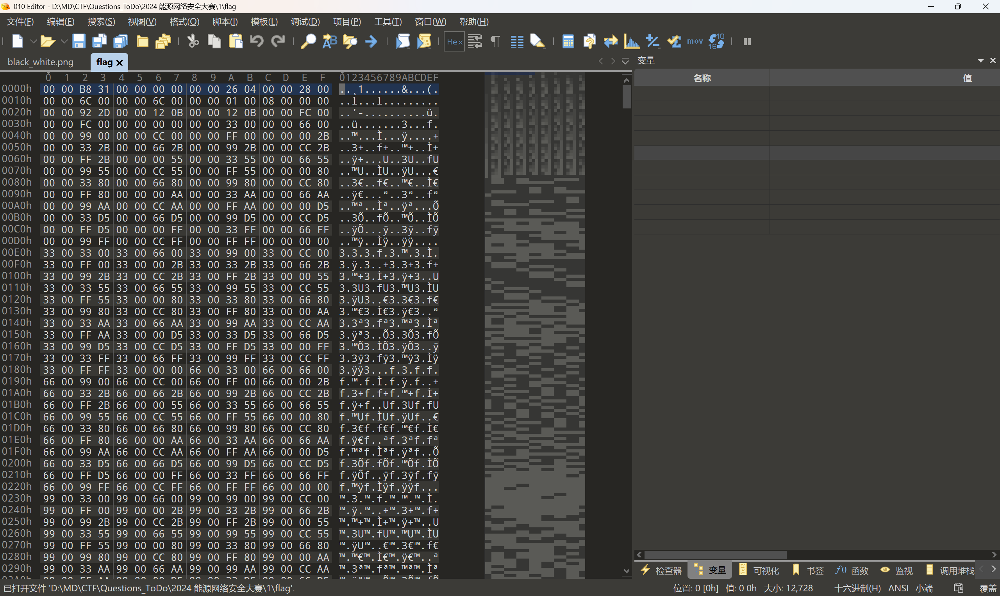

经过尝试，发现在前面补上BMP的文件头`42 4D`并改后缀为`.bmp`后可以得到一张被篡改过的汉信码

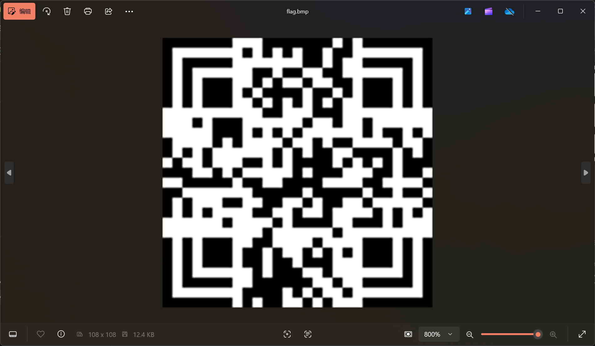

仔细对比正常的汉信码，可以发现是左下角被旋转了180°

因此我们在PPT中修复好，然后扫码即可得到最后的flag：`flag{89b58e77-7b42-4fd1-9e58-e50d98cc5894}`

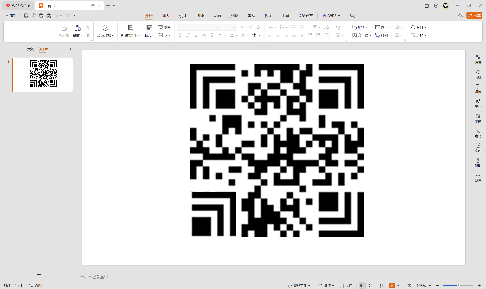

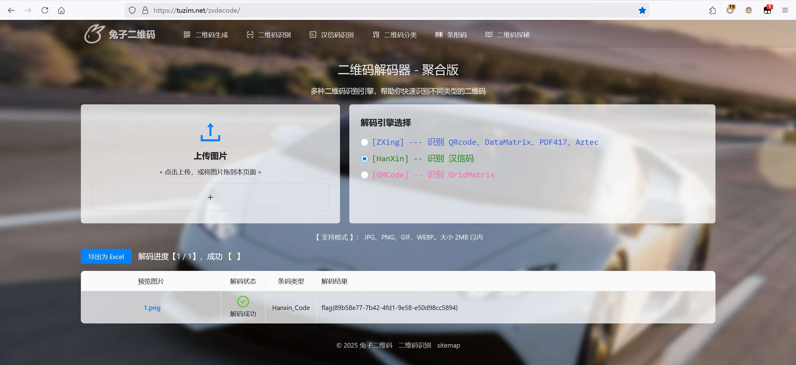


## 题目名称 alarm_clock

解压附件压缩包，得到一个`alarm_clock.vmdk`，我们尝试用`DiskGnuis`挂载并恢复被删除的文件

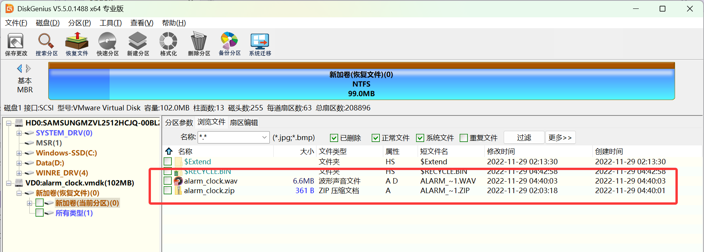

恢复可以得到一个wav文件和一个加密的压缩包

打开wav文件听一下，发现是SSTV，用工具识别后可以得到压缩包的解压密码：`z@Wa1uDu0`

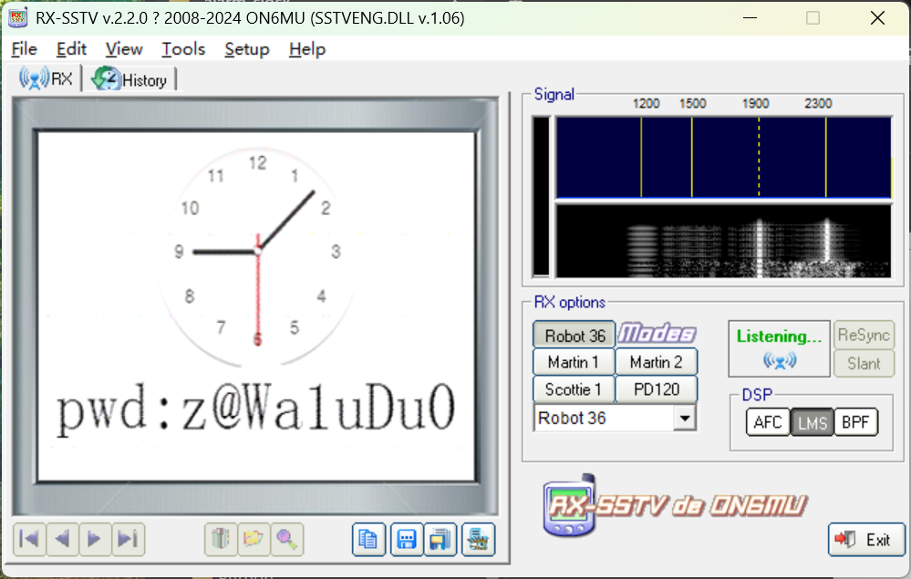

解压后可以得到一个`data.txt`，里面的数据格式如下：

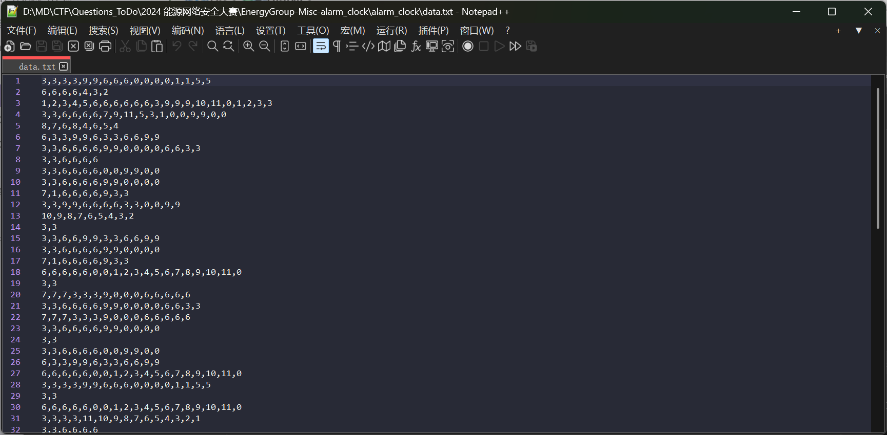

结合上面扫出来的SSTV图像种的时钟，猜测数字代表的就是时钟上刻度的方向，有几个数字就代表往这个方向前进几格

然后每一行都是从原点开始，因此我们写一个脚本按照数字的顺序画轨迹图

```python
import matplotlib.pyplot as plt
import math
import os

def number_to_angle(num):
    return (int(num) * 30) % 360

def angle_to_coord(angle):
    rad = math.radians(angle - 90)
    return (math.cos(rad), math.sin(rad))

def func1(data):
    os.makedirs(&#34;output&#34;, exist_ok=True)
    for i, path in enumerate(data):
        plt.figure(figsize=(8, 8))
        ax = plt.gca()
        ax.set_aspect(&#39;equal&#39;, adjustable=&#39;box&#39;)
        plt.title(f&#39;Figure {i&#43;1}&#39;)
        
        x_coords = [0]
        y_coords = [0]
        current_x, current_y = 0, 0
        
        for num in path:
            angle = number_to_angle(num)
            dx, dy = angle_to_coord(angle)
            current_x &#43;= dx
            current_y &#43;= dy
            x_coords.append(current_x)
            y_coords.append(-1 * current_y)
        
        plt.plot(x_coords, y_coords, marker=&#39;o&#39;, markersize=3, color=&#39;blue&#39;)
        plt.grid(True, alpha=0.3)
        plt.xlim(-8, 8)
        plt.ylim(-8, 8)
        filename = f&#39;output/{i&#43;1:02d}.png&#39;
        plt.savefig(filename, dpi=100, bbox_inches=&#39;tight&#39;)
        plt.close()
        print(f&#39;Saved: {filename}&#39;)

if __name__ == &#34;__main__&#34;:
    data = []
    with open(&#34;data.txt&#34;, &#39;r&#39;) as f:
        lines = f.read().split()
    for line in lines:
        data.append(line.split(&#39;,&#39;))
    # print(data)
    func1(data)
```

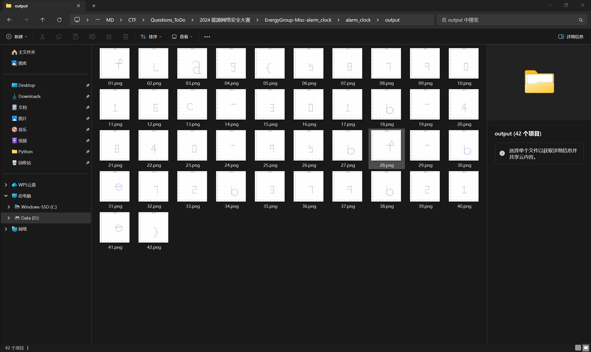

运行脚本画图后即可得到最后的flag：`flag{5879016c-301b-4840-95bf-be72b379b21e}`

## 题目名称 Bluetooth

## 题目名称 USB


---

> Author: [Lunatic](https://goodlunatic.github.io)  
> URL: https://goodlunatic.github.io/posts/87bd986/  

