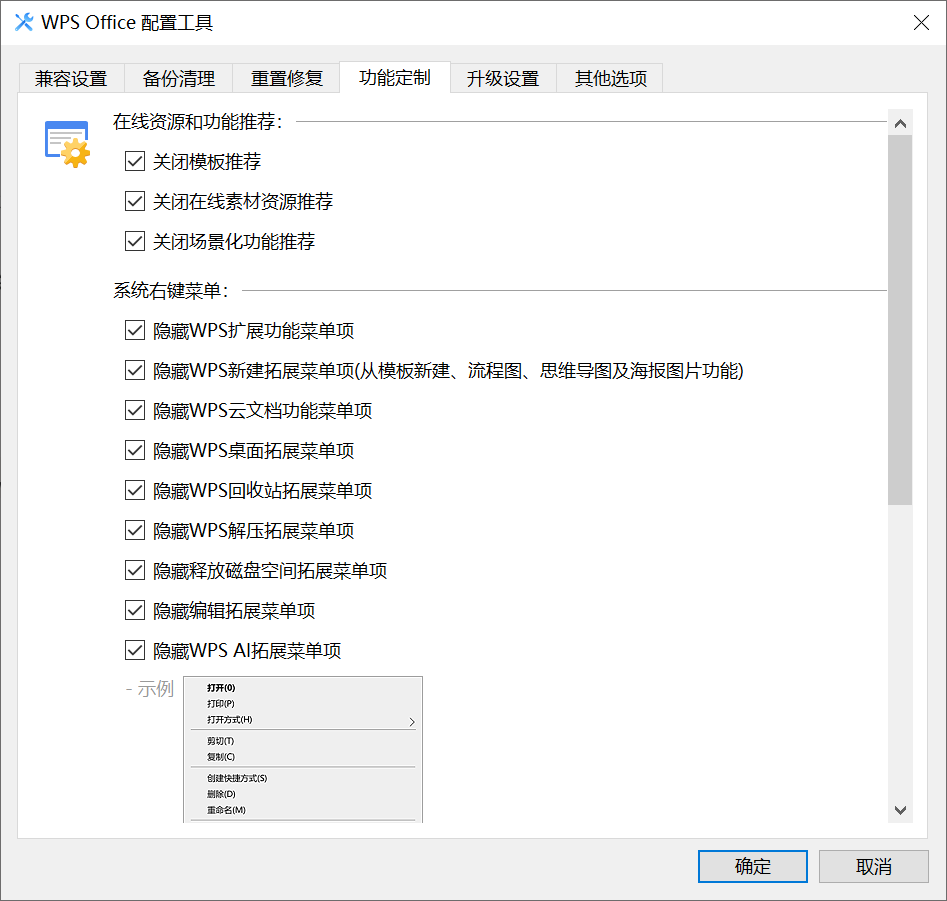
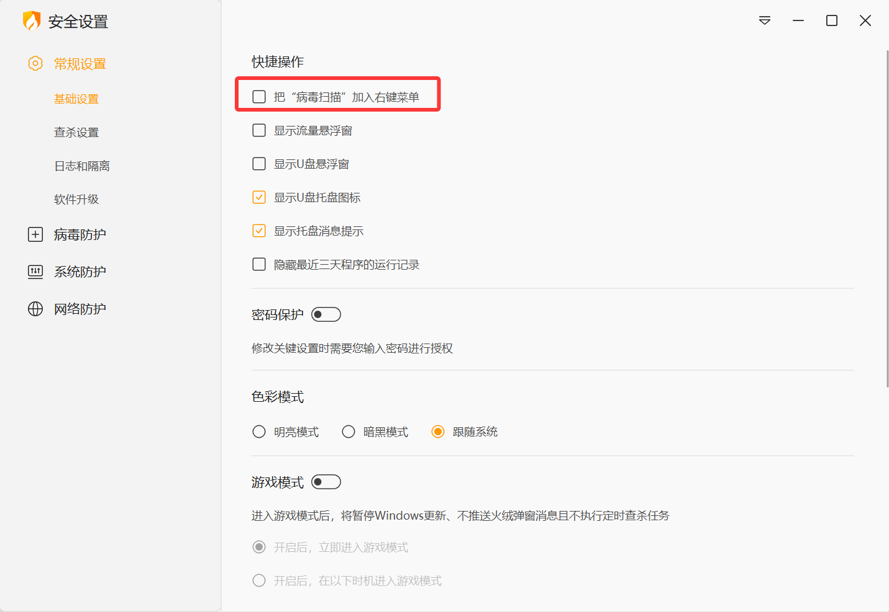
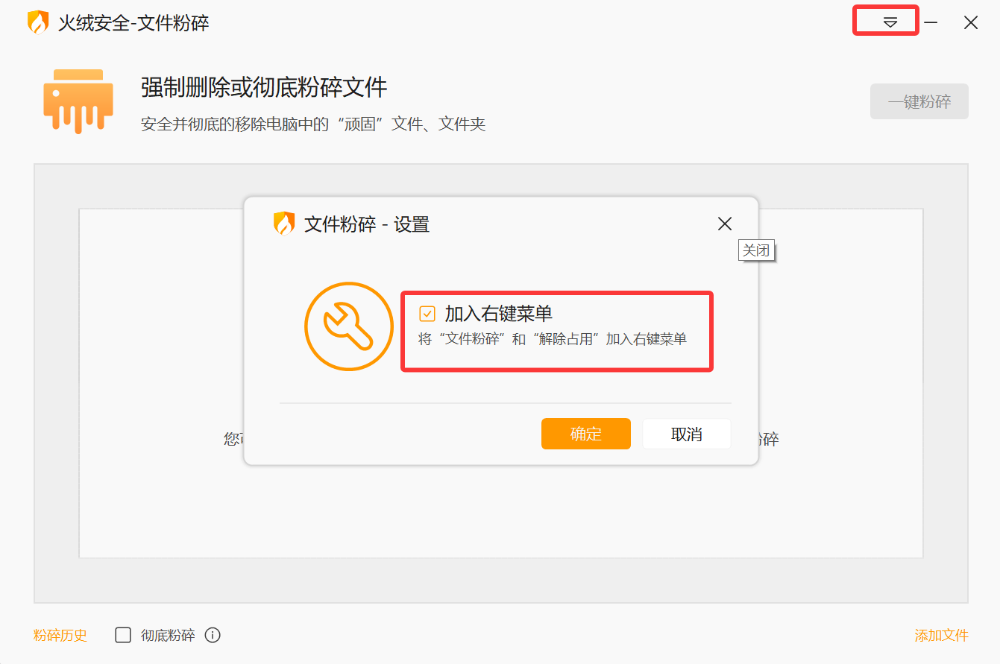
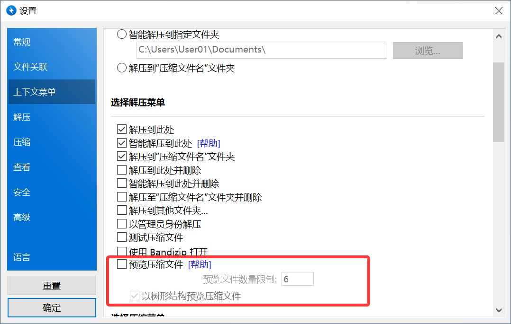

# [持续更新] 记录各种app关闭广告和推荐的方法

感觉现在app的广告和乱七八糟的推荐真的越来越多了

纯纯是在折磨用户，个人感觉体验太差了

这些广告要么没法关闭，要么关闭的选项都隐藏在神秘的小角落

于是打算记录一下我遇到的一些app广告关闭的方式
<!--more-->

## iPhone广告关闭

1、在系统设置中把语言调整为繁体(香港)，时区地区调整为新加坡(也是东8区)

2、在app中找到 Apple Store 关闭里面的在app中评价这个选项

## WPS广告关闭

1、设置菜单里找到`配置和修复工具`，然后点击高级，选功能定制，把里面所有选项都勾选上

2、右键WPS菜单栏中的`稻壳儿模板`选项卡，直接选择隐藏

## 火绒右键菜单关闭

## Bandizip右键菜单关闭

## 利用火绒的右键管理关闭app的右键上下文菜单

这个虽然方便，可以一键关闭，但是我感觉功能有限

---

> 作者: [Lunatic](https://goodlunatic.github.io)  
> URL: https://goodlunatic.github.io/posts/911b6a0/  

