# 2023 羊城杯网络安全大赛 Misc Writeup

**差一题就能AK Misc了，还是比较遗憾**
<!--more-->

## 初赛

### 题目名称 EZ_Misc

附件给了一张改过宽高的图片，恢复正确宽高后提示flag不在这里

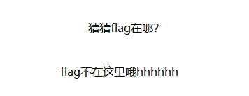


然后010打开，发现末尾有一个压缩包，还有一张没有文件头但是有文件尾的png图片，并给了提示：5位数字

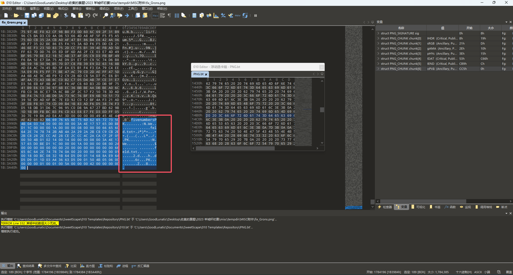

把文件头中的`04 03`改成`03 04`，提取压缩包并解压可以得到一串Gronsfeld密文

可以自己写个脚本爆破

```python
from pycipher import Gronsfeld
from itertools import product

cipher_text = 'vzbtrvplnnvphsqkxsiqibroou'

# five numbers burst
for key in product(range(10), repeat=5):
    # print(key)
    plain_text = Gronsfeld(key).decipher(cipher_text)
    if 'TRYTO' in plain_text:
        print(key,plain_text)
```

也可以用用github上的工具爆破密文，得到提示：叫我们尝试截图工具

> try to think the snippingtools

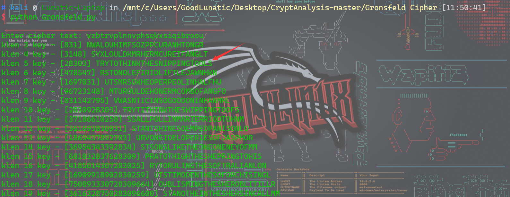

工具链接：https://github.com/karma9874/CryptAnalysis

CVE-2023-28303：https://github.com/frankthetank-music/Acropalypse-Multi-Tool

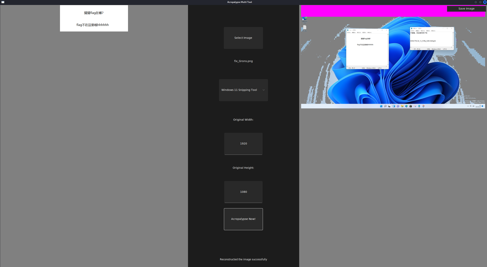


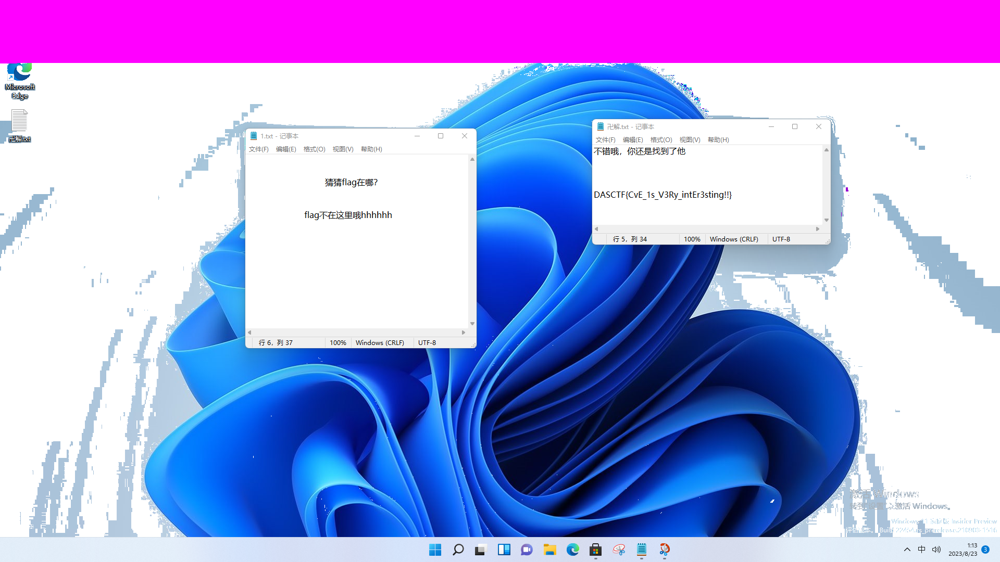

`DASCTF{CvE_1s_V3Ry_intEr3sting!!}`

### 题目名称 Matryoshka

下载下来得到一个img文件，用磁盘精灵挂载

可以提取出一张jpg图片、一个加密后的encrypt文件

然后还有一个rar压缩包，foremost提取压缩包得到另一张jpg图片

然后对两张图片使用盲水印解密

得到密钥：watermark_is_fun


然后用veracrypt挂载刚刚那个encrypt文件，里面有个flag.txt

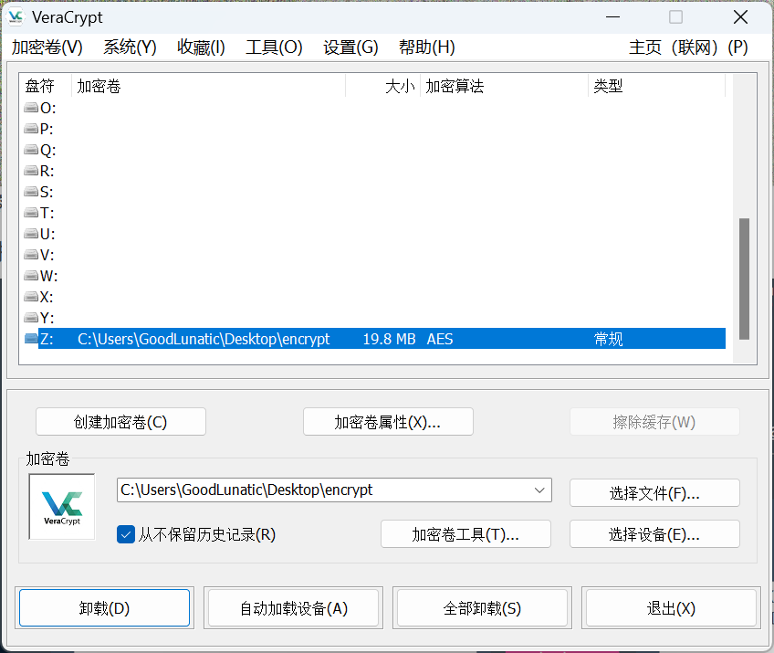


用vscode打开发现存在零宽字符，在线网站解密。然后base64+维吉尼亚解密即可

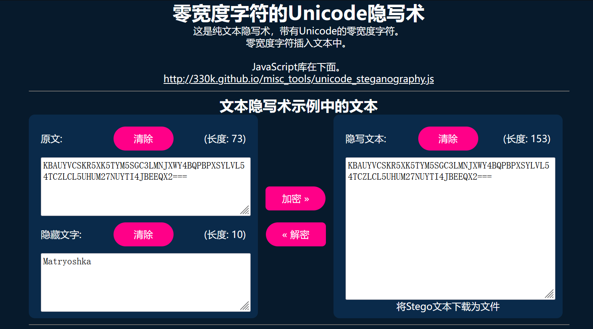

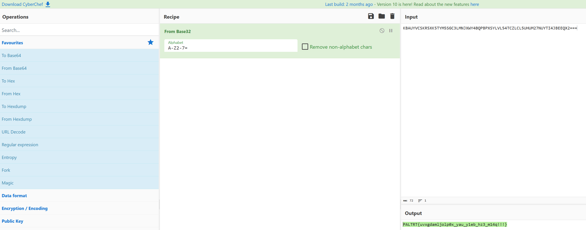

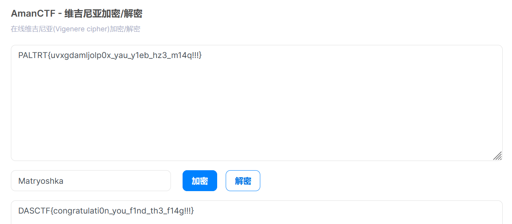


### 题目名称 程序员 Quby

下载附件后得到一张png图片，发现末尾隐藏了rar压缩包，提取出来后发现需要密码


搜索死亡之链，找到如下的夏多密码

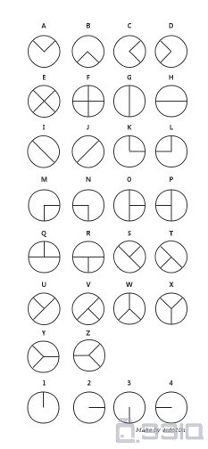


https://www.bilibili.com/video/BV1HR4y1G7Wc/?vd_source=db6b9c113a0b0a0351d22c0b2729de1a

参考上面这个视频即可解得密钥：HAVEANICEDAY

然后用cloacked-pixel解密可以得到另一个密码

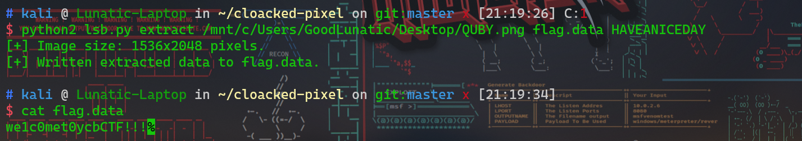

we1c0met0ycbCTF!!!

然后用这个密码去解压压缩包，得到两个xlsx和一个wav文件

发现xlsx中存在隐藏数据，取消wbw隐藏，然后把3.33替换为0，6.66替换为1，4.46为0，5.53为1

然后对单元格进行突出显示

把两个xlsx中的数据合并到一起，得到密钥：w0wyoudo4goodj0b

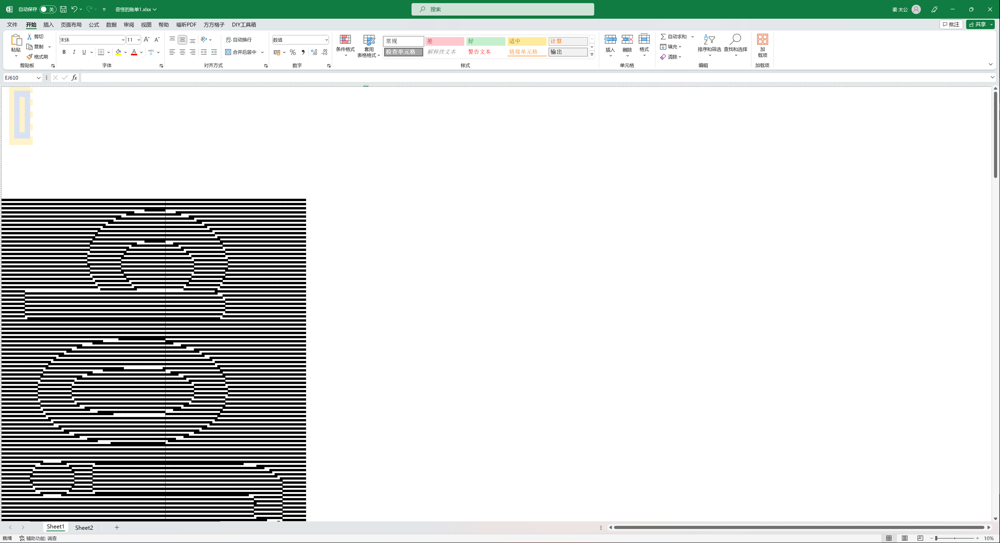


然后用这个密钥去Deepsound解密，可以得到一个Family_bucket.zip压缩包，猜测是base全家桶

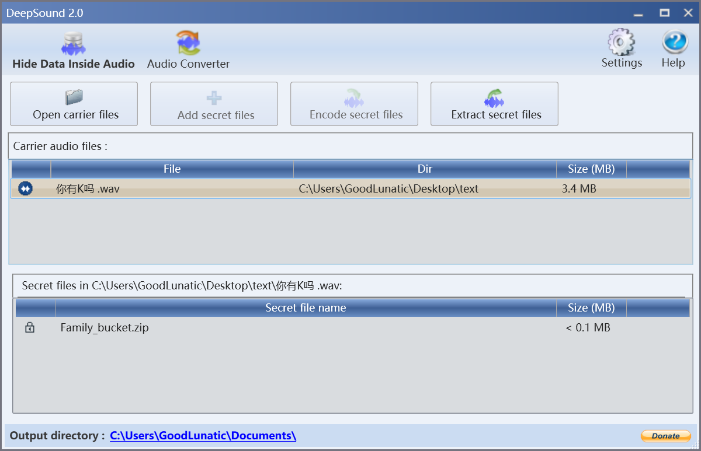

解压压缩包得到flag.txt和fl4g.txt，里面各有一段密文

```
:JOJ[=%tJD9gr2Q79*;T:-qZD=]S0c:0'nT7orYd9L_TD=Ys#Z9iY:q;-$Xo:dQs>9ia&M9i3]K5r2G>8Oc'9=%u:f8QIW;;bp(\8Ms%=10QJ$:KBnd<AmK;7p.T97oN8J
```

上述密文base85+base32解码后得到以下内容

```
sQ+3ja02RchXLUFmNSZoYPlr8e/HVqxwfWtd7pnTADK15Evi9kGOMgbuIzyB64CJ

SjaoNgS0xgagUTpwe3QwHn4MrbkD/OUwqOQG/bpveg6Mqa4WH0k46
```

然后换表base64解码即可得到flag

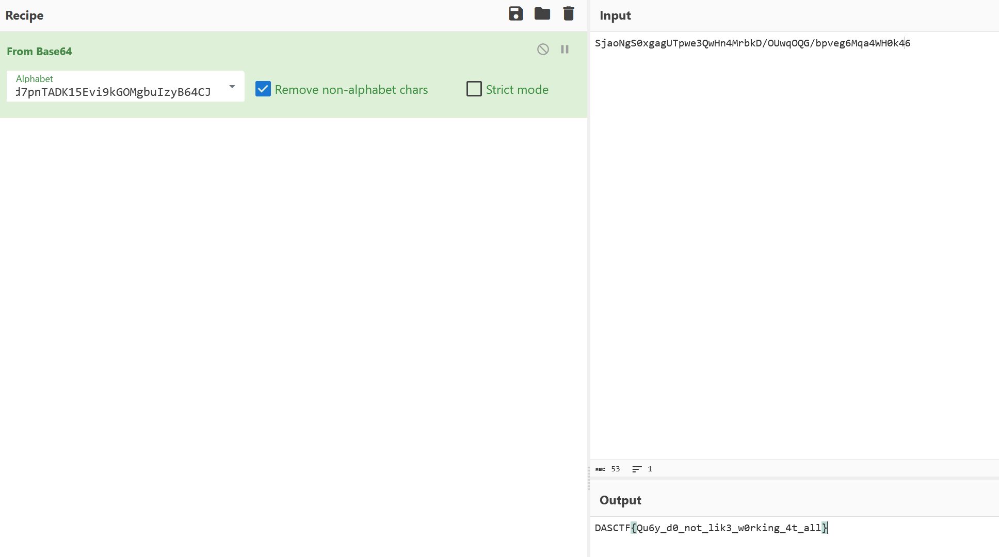

`DASCTF{Qu6y_d0_not_lik3_w0rking_4t_all}`

### 题目名称 Easy_VMDK

下载得到一个压缩包，store加密方式，直接用bkcrack进行明文攻击

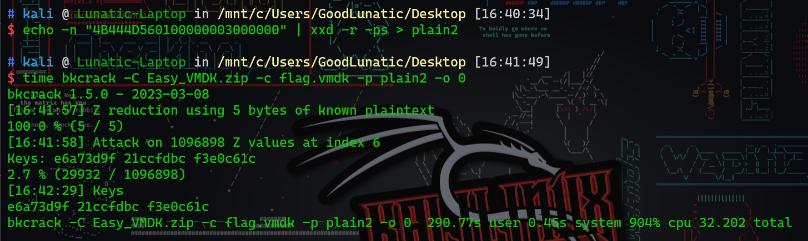

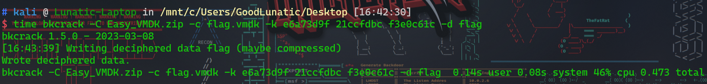

挂载flag.vmdk，提取出flag.zip和key.txt

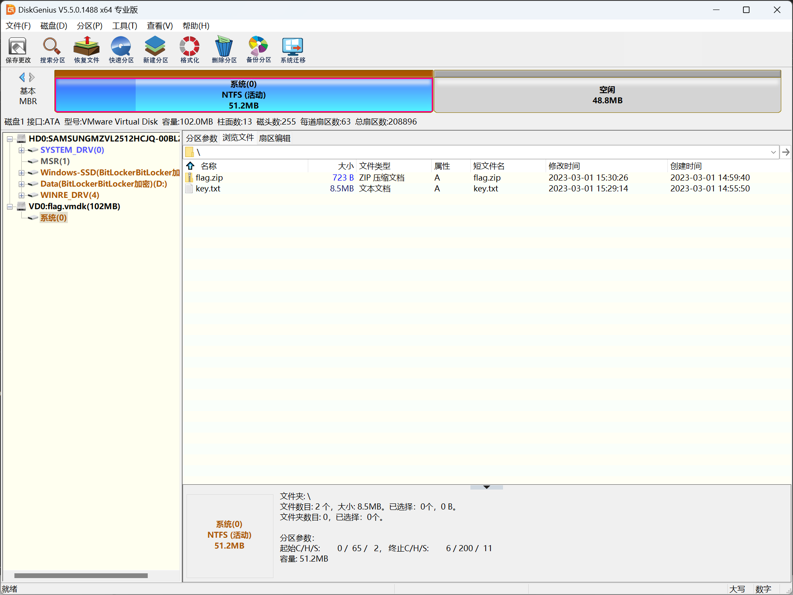

从flag.zip中foremost分离出了一个png2txt.py
```python
import cv2
import base64
import binascii


img = cv2.imread("key.png")
r, c = img.shape[:2]
print(r, c)
# 137 2494

with open("key.txt", "w") as f:
    for y in range(r):
        for x in range(c):
            uu_byte = binascii.a2b_uu(', '.join(map(lambda x: str(x), img[y, x])) + "\n")
            f.write(base64.b64encode(uu_byte).decode() + "\n")
```

chatGPT直接写一个恢复脚本得到压缩包解压密码

```python
import cv2
import base64
import binascii

# Read the contents of the key.txt file
with open("key.txt", "r") as f:
    lines = f.readlines()

# Prepare an empty list to store the decoded pixel values
decoded_pixels = []

for line in lines:
    # Strip the newline and decode the base64 encoded string
    decoded_base64 = base64.b64decode(line.strip())

    # Convert the decoded bytes back using b2a_uu
    uu_decoded = binascii.b2a_uu(decoded_base64)

    # Split the decoded string to get the individual RGB values
    pixel_values = [int(val) for val in uu_decoded.split(b', ')]

    # Append the pixel values to the list
    decoded_pixels.append(pixel_values)

# Convert the list of pixel values to a NumPy array
import numpy as np
decoded_pixels = np.array(decoded_pixels, dtype=np.uint8)

# Reshape the array to the original image shape
reshaped_image = decoded_pixels.reshape((137, 2494, 3))

# Save the recreated image
cv2.imwrite("recreated_image.png", reshaped_image)
```

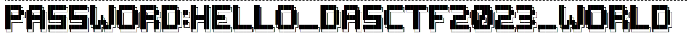

解压压缩包即可得到flag：`DASCTF{2431a606-00a3-4698-8b0f-eb806a7bb1be}`

### 题目名称 GIFuck

发现GIF每一帧的时间长度不同，存在时间轴隐写，写个脚本提取
```python
from PIL import Image, ImageSequence
import os
dic = {}
# 打开GIF文件
with Image.open("flag.gif") as img:
    frames = [frame.copy() for frame in ImageSequence.Iterator(img)]
    for i, frame in enumerate(frames):
        # 获取帧的时长（通常在'duration'键中）
        duration = frame.info.get('duration', 0)  # 按需提供默认值
        dic[i+1] = duration // 60
        # print(f"Frame {i+1}: Duration = {duration}ms")
# print(dic)

current_directory = os.getcwd()
all_files = [f for f in os.listdir(current_directory) if f.endswith('.png')]
sorted_files = sorted(all_files, key=lambda x: int(x.split('.')[0]))
res = ''
for file in sorted_files:
    index = int(file.split('.')[0])
    time = dic[index]
    # print(index,time)
    file_path = os.path.join(current_directory, file)
    size = os.path.getsize(file_path)
    if size == 310:
        res += time*'<'
    elif size == 304:
        res += time*'>'
    elif size == 247:
        res += time*'+'
    elif size == 242:
        res += time*'.'
    elif size == 241:
        res += time*']'
    elif size == 229:
        res += time*'['
    elif size == 227:
        res += time*'-'
    # print(f"{file}: {size} bytes")
print(res)
```

```
++++[->++++<]>[->++++++<]>-[->+>+>+>+>+>+>+>+>+>+>+>+>+>+>+>+>+>+>+>+>+>+>+>+>+>+>+>+>+>+>+<<<<<<<<<<<<<<<<<<<<<<<<<<<<<<<]+++<++<+[->++++<]>[->++++<]>[->-<]>[-<<<+>>>]++<+++<+[->++++<]>[->++++<]>[->-<]>[-<<<+>>>]<+++[->++++<]>[->-<]>[-<<<+>>>]<+++<+[->++++<]>[->++++<]>[->-<]>[-<<<+>>>]+++<++[->++++<]>[->-<]>[-<<<+>>>]+<++<+[->++++<]>[->++++<]>[->-<]>[-<<<+>>>]<+++<+[->++++<]>[->++++<]>[->+<]>[-<<<+>>>]+++<+++[->++++<]>[->-<]>[-<<<+>>>]++<+[->++++<]>[->+<]>[-<<<+>>>]+++<+++[->++++<]>[->+<]>[-<<<+>>>][->+<]>[-<<<+>>>]+++<+++[->++++<]>[->-<]>[-<<<+>>>]++<++[->++++<]>[->+<]>[-<<<+>>>]+++<+++[->++++<]>[->+<]>[-<<<+>>>]++<+[->++++<]>[->+<]>[-<<<+>>>]++[->+<]>[-<<<+>>>]+<<+[->++++<]>[->++++<]>[->+<]>[-<<<+>>>]+<<+[->++++<]>[->++++<]>[->+<]>[-<<<+>>>]+<+++[->++++<]>[->+<]>[-<<<+>>>]++<+[->++++<]>[->+<]>[-<<<+>>>][->+<]>[-<<<+>>>]++<+++<+[->++++<]>[->++++<]>[->-<]>[-<<<+>>>]+<<+[->++++<]>[->++++<]>[->+<]>[-<<<+>>>]+<<+[->++++<]>[->++++<]>[->+<]>[-<<<+>>>]+<+++[->++++<]>[->+<]>[-<<<+>>>]++<+[->++++<]>[->+<]>[-<<<+>>>][->+<]>[-<<<+>>>]+++<+++[->++++<]>[->-<]>[-<<<+>>>]++<+[->++++<]>[->+<]>[-<<<+>>>]+++<+++[->++++<]>[->+<]>[-<<<+>>>]++<+++<+[->++++<]>[->++++<]>[->+<]>[-<<<+>>>]<<+++++++++[->+++++++++<]>++.<+++++[->+++++<]>+++.+++..+++++++.<+++++++++[->---------<]>--------.<++++++++[->++++++++<]>++.<++++[->++++<]>+++.-.<+++++++++[->---------<]>---.<+++++++++[->+++++++++<]>++++++++.<+++[->---<]>-.++++++.---.<+++++++++[->---------<]>-.<++++++++[->++++++++<]>++++++.++++++.<+++[->---<]>--.++++++.<++++++++[->--------<]>-------.<++++++++[->++++++++<]>+++++++++.<+++[->+++<]>+.<+++++++++[->---------<]>--.<++++++++[->++++++++<]>++++++++++++++.+.+++++.<+++++++++[->---------<]>---.<++++++++[->++++++++<]>++++++++.---.<+++[->+++<]>++++.<+++[->---<]>----.<+++++++[->-------<]>------.[-]<
```

用在线网站解密，但是提示flag不在这里

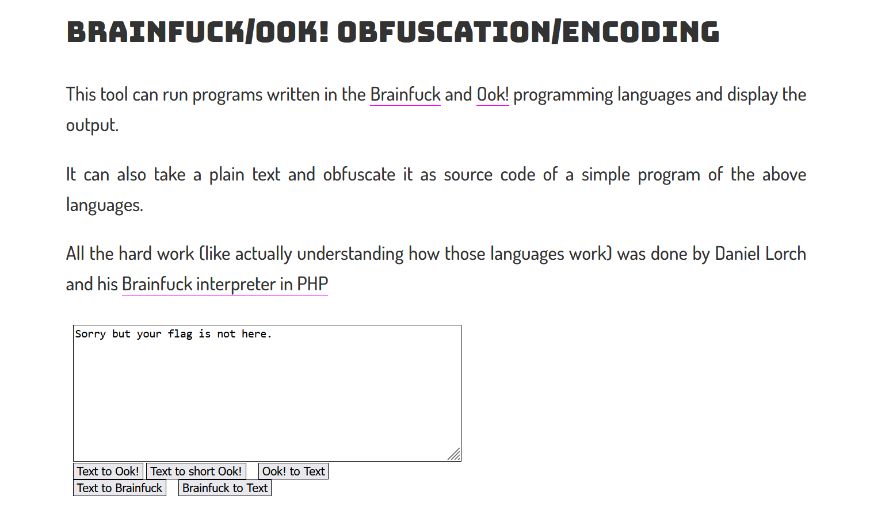

之后换了一个可以看内存的在线网站，成功得到flag：`DASCTF{Pen_Pineapple_Apple_Pen}`

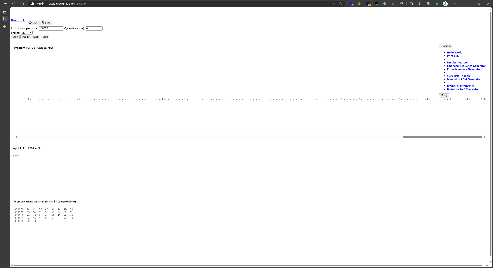

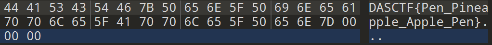

除了使用上面那个网站，也可以写一个脚本提取

```c
#define  _CRT_SECURE_NO_WARNINGS
#include <stdio.h>
#include <stdlib.h>
char s[30000]={0};
char code[2000];
int len = 0;
int stack[10000];
int stack_len=0;

int main()
{
    char c;
    int i=0,j,k,x=0;
    FILE* f;
    char* p=s+10000;
   
    f=fopen("./bf.txt","r");
        
    while(fread(&code[len],1,1,f)==1)
	{
        len++;
    }
    setbuf(stdout,NULL);
    while(i<len) {
        switch(code[i]) {
            case '+':
                (*p)++;
                break;
            case '-':
                (*p)--;
                break;
            case '>':
                p++;
                break;
            case '<':
                p--;
                break;
            case '.':
                putchar((int)(*p));
                break;
            case ',':
                *p=getchar();
                break;
            case '[':
                if(*p) {
                    stack[stack_len++]=i;
                } else {
                    for(k=i,j=0;k<len;k++) {
                        code[k]=='['&&j++;
                        code[k]==']'&&j--;
                        if(j==0)break;
                    }
                    if(j==0)
                        i=k;
                    else {
                        fprintf(stderr,"%s:%dn",__FILE__,__LINE__);
                        return 3;
                    }
                }
                break;
            case ']':
                i=stack[stack_len-- - 1]-1;
                break;
            default:
                break;
        }
        i++;
        x++;
    }
    
    for(int i = 0; i < stack_len; i++) {
		printf("%c", stack[i]);
	}
    printf("\n");
    
    for(int i = 0; i < 30000; i++) {
		printf("%c", s[i]);
	}
    return 0;
}
```

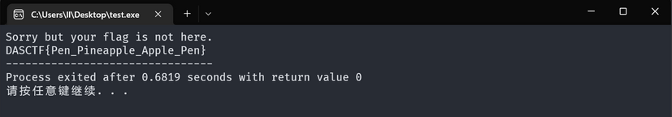

### 题目名称 交响乐

从流量包中可以导出一个flag1.png和flag2.zip

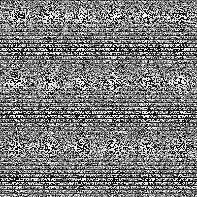

flag2.zip是伪加密，解压后得到一个txt，其中存在零宽字符

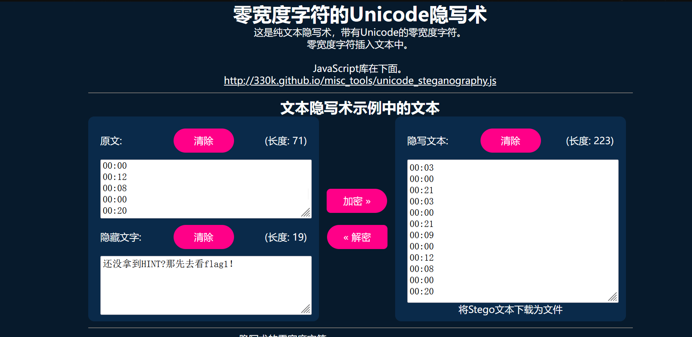

写一个脚本读取flag1.png中的像素数据

```python
from PIL import Image
import libnum

img = Image.open("flag1.png")
width,height = img.size # 400 400

pixel_dict = {}
res = ''

for x in range(width):
    for y in range(height):
        pixel_data = img.getpixel((x,y))[0]
        # pixel_data = str(img.getpixel((x,y))[0])
        # if pixel_data not in pixel_dict:
        #     pixel_dict[pixel_data] = 1
        # else:
        #     pixel_dict[pixel_data] += 1
        if pixel_data < 200:
            res += '0'
        else:
            res += '1'

print(libnum.b2s(res))
```

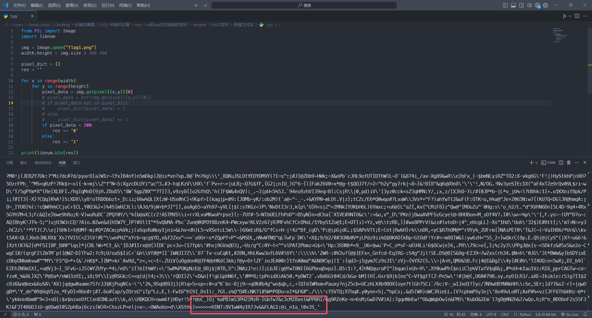

得到提示：>>>>>>HINT:BV1wW4y1R7Jv&&FLAG1:@i_n1a_l0v3S_'

BV开头的是b站视频的一个编号，因此我们直接在B站打开这个视频

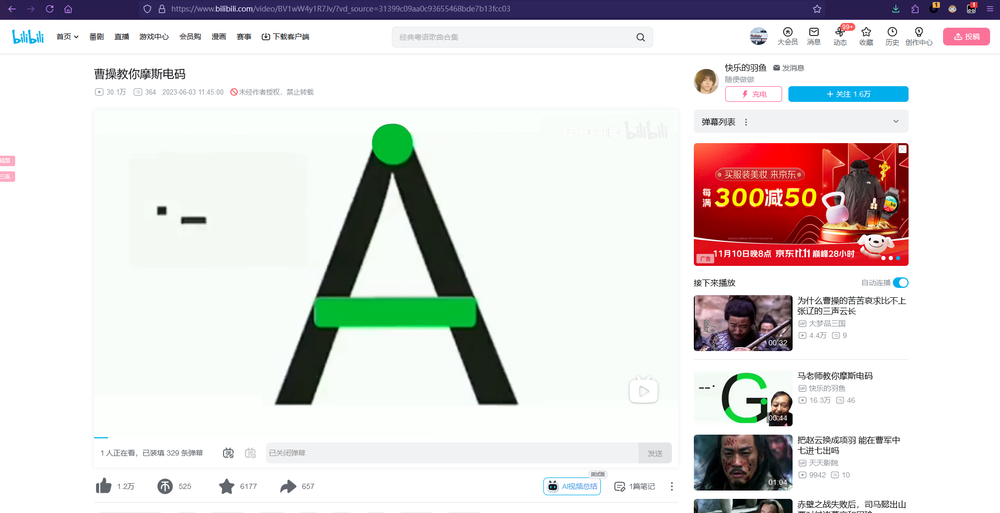

然后根据之前零宽解码得到的时间点提取视频中的字符，即可得到最后的flag：`@i_n1a_l0v3S_CAOCAOGAIFAN`

### 题目名称 两只老虎

题目附件给了如下这一张png图片


直接在010中打开这张图片，对比IDAT块的大小，发现图片的IDAT块有问题

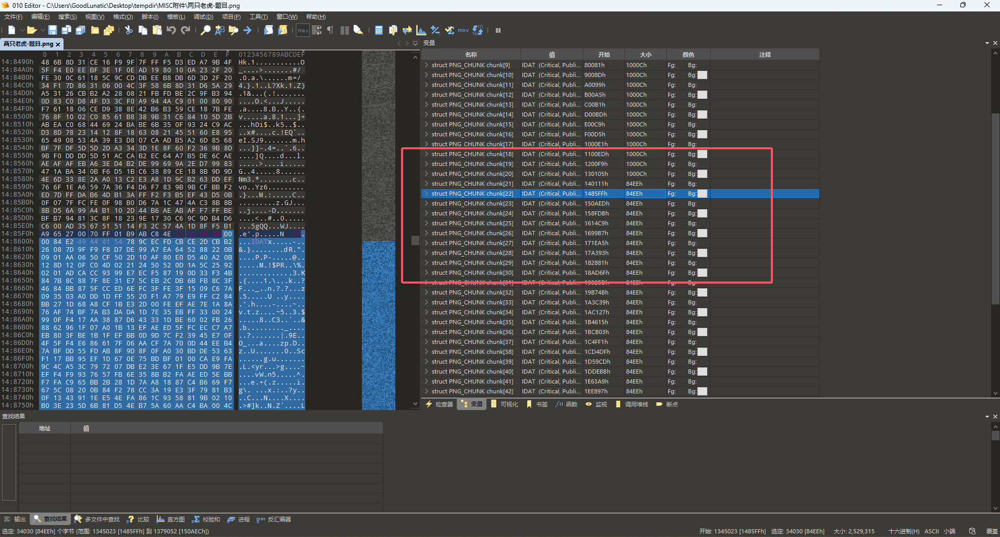

因此猜测是IDAT块隐写，我们从第二个大小为 0x84EE 的IDAT块开始，把后面的所有数据都复制出来

为什么要从第二个开始呢？因为上一个是原本图片的IDAT数据，如果删除，会发现图片缺了一部分，如下所示：


我们用010把原图中的PNG头部的数据拼接到刚刚提取出来的数据之前，然后另存为PNG图片

可以得到下面这张图片

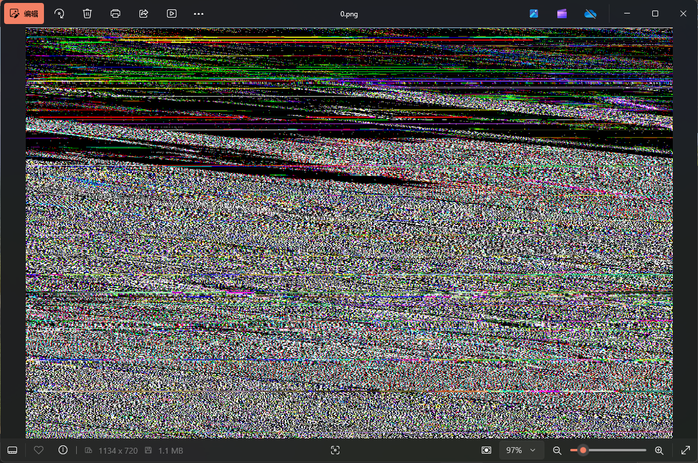

感觉是图片宽高被篡改了，我们尝试爆破一下图片的宽高，发现宽高为`1144x720`的时候图片可以正常显示


就是相比原图多了一段红素像素的数据，我们可以写一个脚本对比一下和原图的区别

```python
from PIL import Image

img1 = Image.open("1.png")
width1,heigth1 = img1.size # 1134,720
img2 = Image.open("2.png") 
width2,heigth2 = img2.size # 1144,720
```

发现红色像素的长度为10px，因此我们把这一段裁去

然后比较这两张图在像素上的区别，发现图片每行中存在不同像素且不同的像素的个数转Ascii码就是flag

```python
from PIL import Image, ImageChops

img1 = Image.open("1.png")
width1,heigth1 = img1.size # 1134,720
img2 = Image.open("2.png") 
width2,heigth2 = img2.size # 1144,720
img2 = img2.crop((0,0,1134,720))
width2,heigth2 = img2.size
# img2.save("3.png")

diff_dit = {}
# 返回差异图像，表示 img1 和 img2 之间的像素差异。
diff = ImageChops.difference(img1,img2)
width3,heigth3 = diff.size
for x in range(width3):
    for y in range(heigth3):
        pixel3 = str(diff.getpixel((x,y)))
        # 统计一下差异像素
        if pixel3 not in diff_dit: 
            diff_dit[pixel3] = 0
        else:
            diff_dit[pixel3] += 1
print(diff_dit) 
# {'(0, 0, 0)': 813891, '(1, 1, 1)': 2533, '(1, 1, 0)': 53}

for y in range(heigth1):
    cnt = 0
    for x in range(width1):
        pixel1 = img1.getpixel((x,y))
        pixel2 = img2.getpixel((x,y))
        if pixel1 != pixel2:
            cnt += 1
    if cnt != 0:
        print(chr(cnt),end='')
# DASCTF{tWo_t1gers_rUn_f@st}
```

`DASCTF{tWo_t1gers_rUn_f@st}`


## 决赛

### 题目名称 黑客的秘密

解压附件压缩包，可以得到下面两个文件

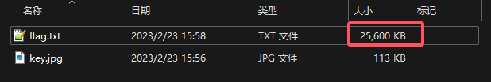

flag.txt是一串未知的二进制数据，但是根据文件大小，猜测就是Veracrypt的加密磁盘文件

因此我们把key.jpg作为密钥文件加载这个磁盘文件

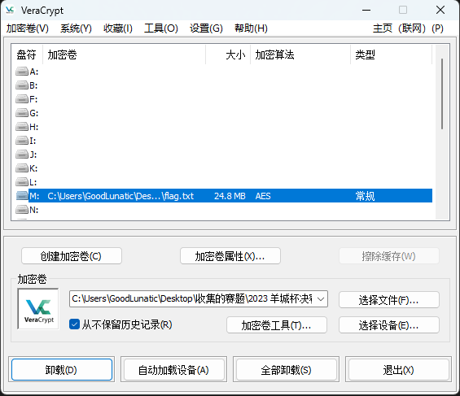

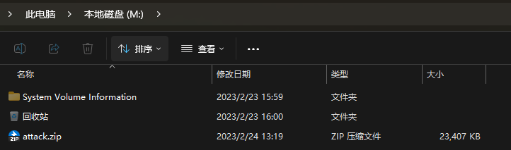

可以得到一个压缩包，解压后得到一个流量包

翻看流量包，发现部分flag在请求robots.txt的响应中

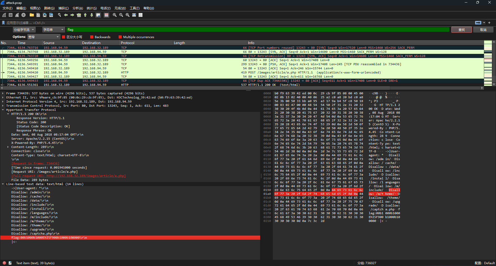

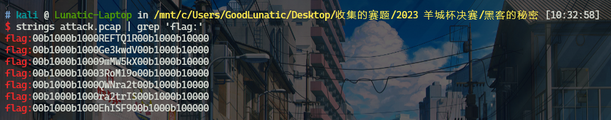

提取中间部分，拼接起来然后解码即可得到flag：`DASCTF{y0u_f1nd_th3_hAckkkkkkk!!!!!}`

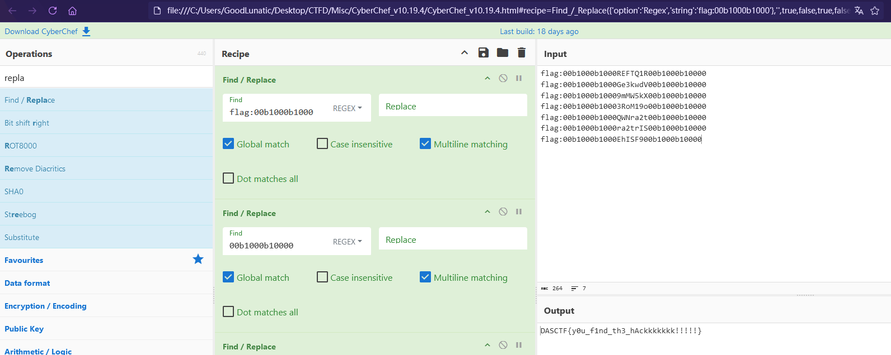

### 题目名称 LmqHmAsk的附件

---

> Author: [Lunatic](https://goodlunatic.github.io)  
> URL: https://goodlunatic.github.io/posts/940b876/  

