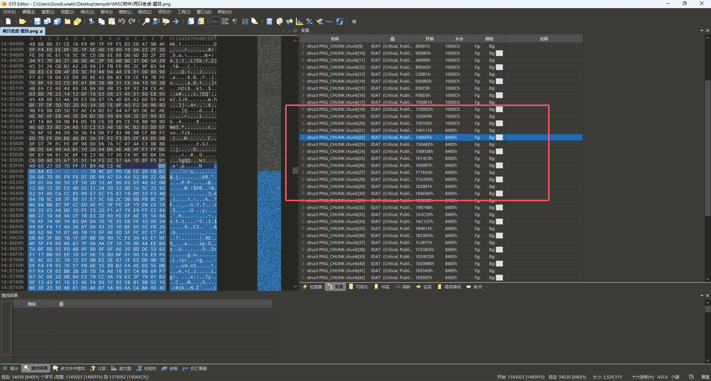
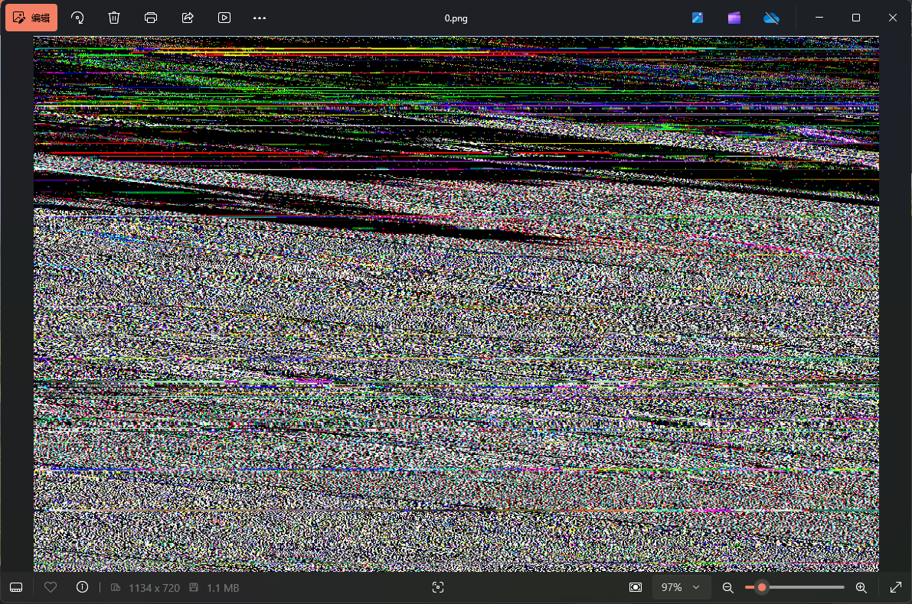

# 2023 羊城杯网络安全大赛 Misc Writeup

**差一题就能AK Misc了，还是比较遗憾**
&lt;!--more--&gt;

## 初赛

### 题目名称 EZ_Misc

### 题目名称 Matryoshka

### 题目名称 Quby

### 题目名称 Easy_VMDK

### 题目名称 GIFuck

### 题目名称 交响乐

### 题目名称 两只老虎

题目附件给了如下这一张png图片


直接在010中打开这张图片，对比IDAT块的大小，发现图片的IDAT块有问题



因此猜测是IDAT块隐写，我们从第二个大小为 0x84EE 的IDAT块开始，把后面的所有数据都复制出来

为什么要从第二个开始呢？因为上一个是原本图片的IDAT数据，如果删除，会发现图片缺了一部分，如下所示：


我们用010把原图中的PNG头部的数据拼接到刚刚提取出来的数据之前，然后另存为PNG图片

可以得到下面这张图片



感觉是图片宽高被篡改了，我们尝试爆破一下图片的宽高，发现宽高为`1144x720`的时候图片可以正常显示


就是相比原图多了一段红素像素的数据，我们可以写一个脚本对比一下和原图的区别

```python
from PIL import Image

img1 = Image.open(&#34;1.png&#34;)
width1,heigth1 = img1.size # 1134,720
img2 = Image.open(&#34;2.png&#34;) 
width2,heigth2 = img2.size # 1144,720
```

发现红色像素的长度为10px，因此我们把这一段裁去

然后比较这两张图在像素上的区别，发现图片每行中存在不同像素且不同的像素的个数转Ascii码就是flag

```python
from PIL import Image, ImageChops

img1 = Image.open(&#34;1.png&#34;)
width1,heigth1 = img1.size # 1134,720
img2 = Image.open(&#34;2.png&#34;) 
width2,heigth2 = img2.size # 1144,720
img2 = img2.crop((0,0,1134,720))
width2,heigth2 = img2.size
# img2.save(&#34;3.png&#34;)

diff_dit = {}
# 返回差异图像，表示 img1 和 img2 之间的像素差异。
diff = ImageChops.difference(img1,img2)
width3,heigth3 = diff.size
for x in range(width3):
    for y in range(heigth3):
        pixel3 = str(diff.getpixel((x,y)))
        # 统计一下差异像素
        if pixel3 not in diff_dit: 
            diff_dit[pixel3] = 0
        else:
            diff_dit[pixel3] &#43;= 1
print(diff_dit) 
# {&#39;(0, 0, 0)&#39;: 813891, &#39;(1, 1, 1)&#39;: 2533, &#39;(1, 1, 0)&#39;: 53}

for y in range(heigth1):
    cnt = 0
    for x in range(width1):
        pixel1 = img1.getpixel((x,y))
        pixel2 = img2.getpixel((x,y))
        if pixel1 != pixel2:
            cnt &#43;= 1
    if cnt != 0:
        print(chr(cnt),end=&#39;&#39;)
# DASCTF{tWo_t1gers_rUn_f@st}
```

`DASCTF{tWo_t1gers_rUn_f@st}`


## 决赛

### 题目名称 黑客的秘密

### 题目名称 LmqHmAsk的附件

---

> Author: [Lunatic](https://goodlunatic.github.io)  
> URL: http://localhost:1313/posts/940b876/  

