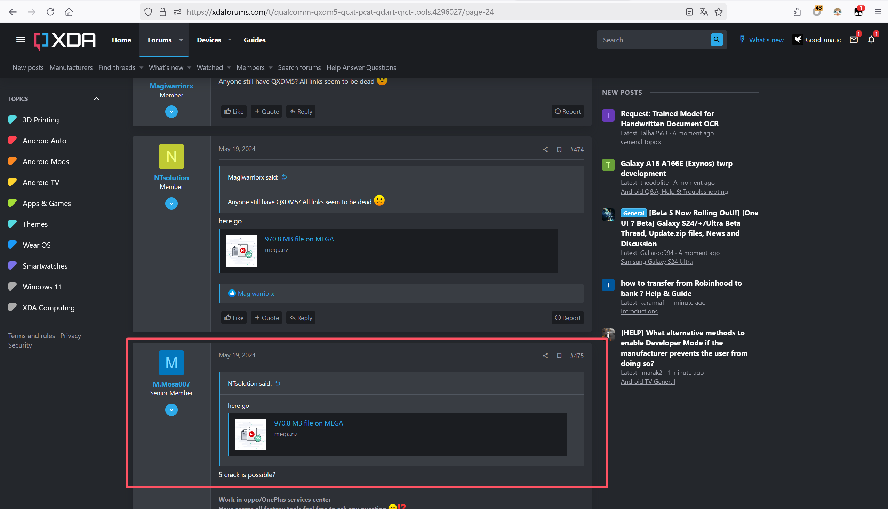
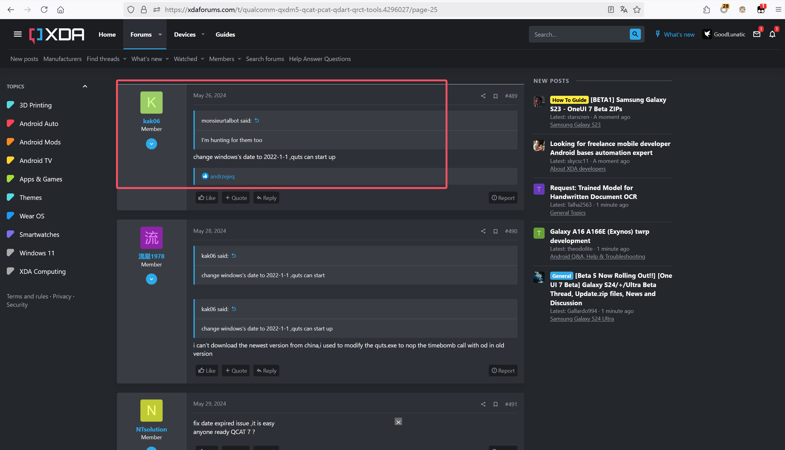
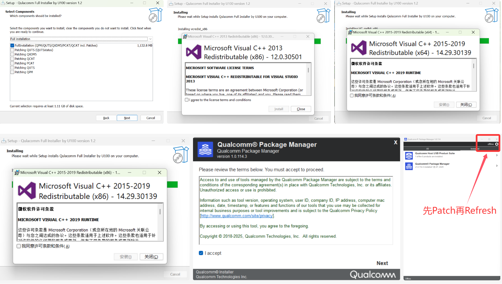
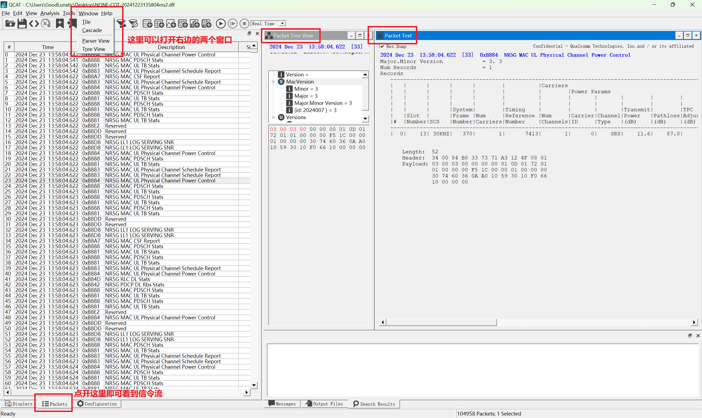
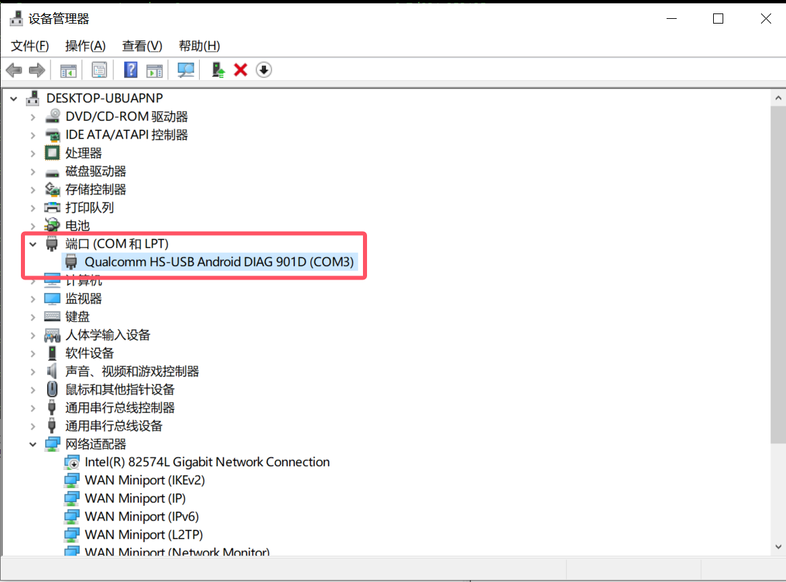
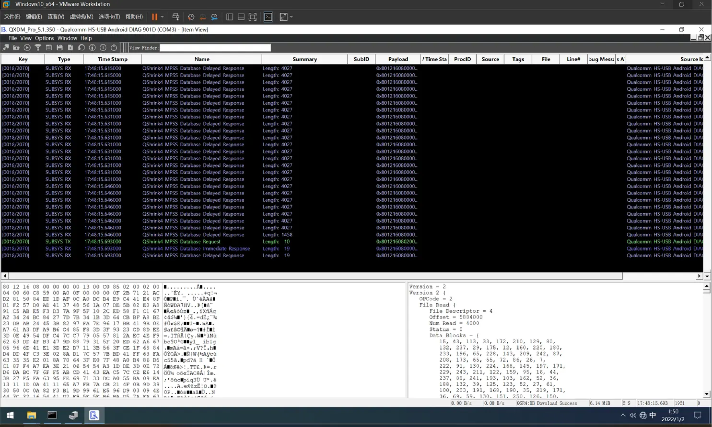
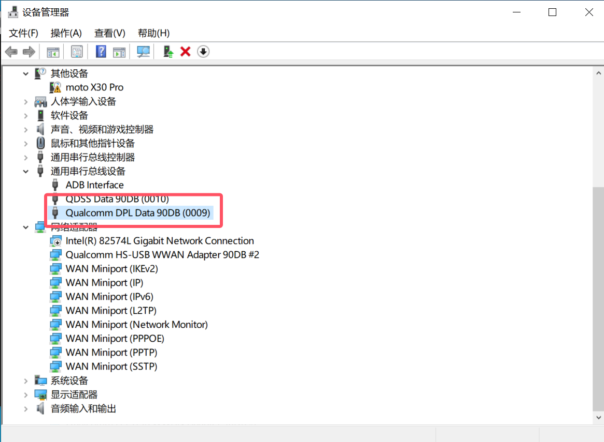
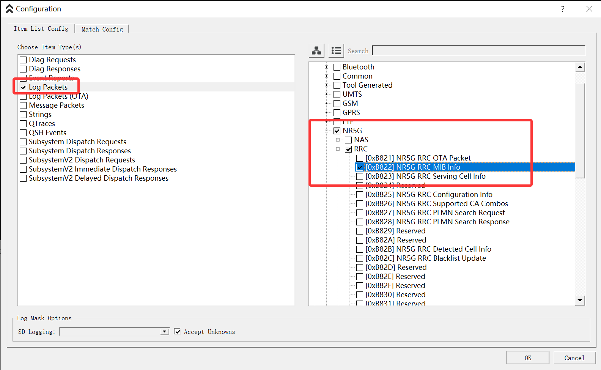
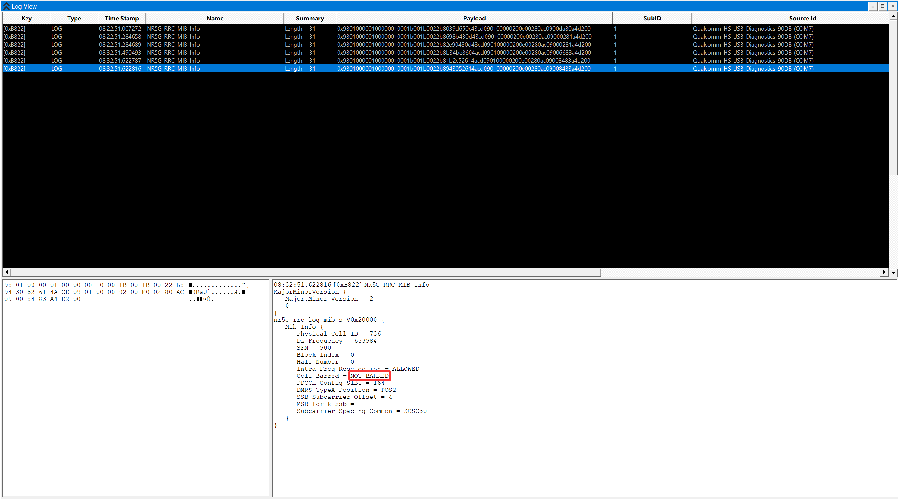

# Qualcomm高通 诊断日志分析工具的安装及使用

**复现论文实验的时候需要用到Qualcomm高通的套件**

**软件安装和使用过程中遇到了很多的问题，因此打算记录一下遇到的问题和对应的解决方案**
<!--more-->


**本文涉及的内容大部分取自互联网，如有侵权请联系删除**


## 软件安装

首先，我们可以在[XDA论坛](https://xdaforums.com/t/qualcomm-qxdm5-qcat-pcat-qdart-qrct-tools.4296027/page-24)上找到破解版的安装包



然后注意安装的时候要把时间调整到`2022-01-01`，并且断网安装



运行安装程序，安装完VC++的依赖和`Manager`后，会有个弹窗提示你需要`Patch`并`Refresh`一下



然后为了防止本地时间改变对日常使用的影响，我把上面的软件安装到`Windows10`的VMware虚拟机中了，并且关闭了时间同步

## 软件使用

### QCAT

> QCAT 主要用于分析无线通信协议日志，验证设备对通信标准（如 LTE、5G）的符合性。
> 
> 它支持日志解析、性能评估和协议分析，帮助工程师理解设备在网络中的行为。

直接打开QCAT然后选择打开本地保存的信令文件即可



### QXDM

> QXDM 是一个实时调试和诊断工具，用于读取设备的诊断数据、捕获日志、监控信号状态
> 
> 并执行自定义命令（如 AT 指令或高通特定命令）

软件安装完成后，我们需要参考[这篇文章](https://qcomdriver.com/#google_vignette)，在Windows上安装一下高通的驱动

安装完驱动后，电脑才能正常识别到手机开启的诊断端口

然后参考[这篇文章](https://www.progeeksblog.com/enable-diag-mode-qualcomm-devices-samsung-huawei-google-pixel-oppo-vivo-lenovo-asus/)的步骤，用`adb`打开手机的诊断端口后可以用QXDM抓数据了

```bash
# 打开诊断端口的命令，不同手机可能不同，这里我简要记录了一下
# 小米手机可以用下面这个命令
adb shell
su
setprop sys.usb.config diag,diag_mdm,adb 
# 摩托罗拉手机要用下面这个命令
adb shell "su -c 'setprop sys.usb.config diag,serial_cdev,rmnet,dpl,qdss,adb'"
```

> Tips：如果使用过程中发现ADB识别不到设备，可以查看手机是否打开USB调试，如果已打开USB调试，还是识别不到的话，就尝试在设备管理器里把`ADB Interface`卸载并重装

小米开启诊断端口后，设备管理器显示如下：



然后QXDMd点击左上角的按钮，选择对应的手机端口连接后即可正常抓取数据



摩托罗拉开启诊断端口后，设备管理器显示如下：



然后QXDM连接上手机后即可正常抓取数据

我这里尝试捕获了一下MIB消息，发现可以用QXDM成功捕获






---

> Author: [Lunatic](https://goodlunatic.github.io)  
> URL: https://goodlunatic.github.io/posts/95cea53/  

