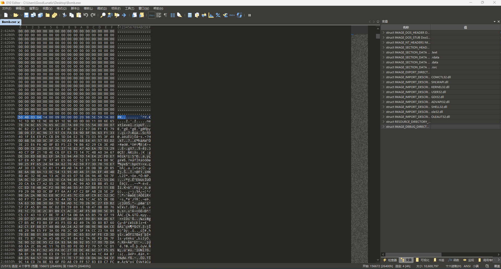
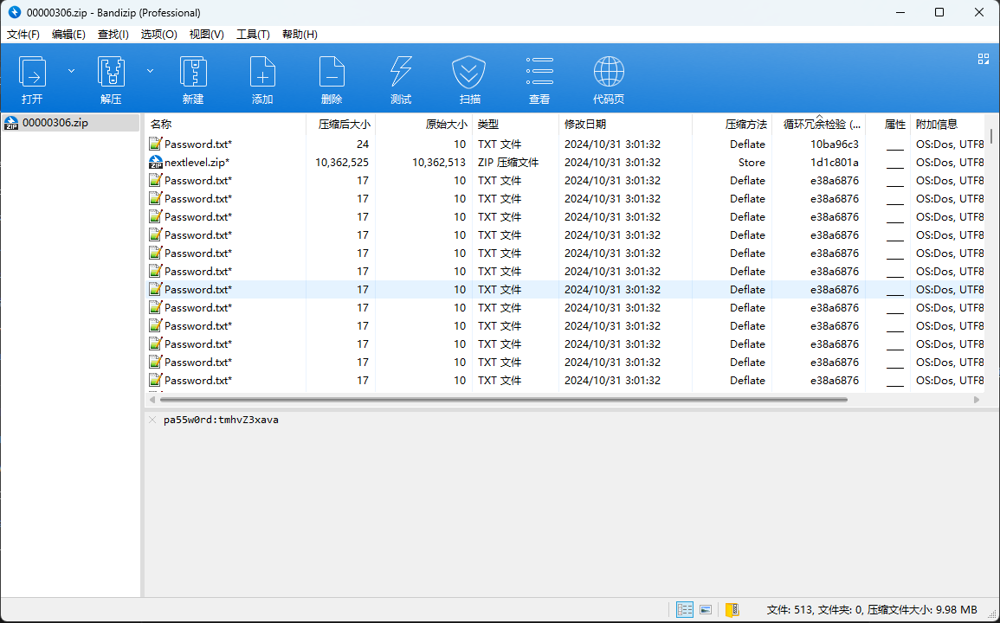

# 2024 HITCTF安天杯网络安全国际邀请赛 Misc Writeup

**比赛结束后有师傅来问里面的题，后面才知道原来是哈工大的邀请赛**

**羡慕能被邀请的学校，啥时候能顺便邀请一下A1natas呢 QAQ**
<!--more-->

> 本文中涉及的具体题目附件可以进我的[知识星球](https://t.zsxq.com/an6p6)获取

## 题目名称 BOMB

解压附件压缩包，可以得到一个`Bomb.exe`，010打开发现里面藏了一个压缩包



这里可以直接使用`foremost`提取出来，压缩包注释中有第一层的解压密码



仔细观察可以发现有一个Passsword.txt的压缩后大小和别的明显不同，用解压密码分别解压一下两种Password.txt

发现压缩大小为24的那个TXT是里面那个压缩包的解压密码，因此很明显，就是压缩包套娃了

因此我们编写以下脚本，循环提取出压缩后大小大于17的TXT文件中的密码，然后压缩包解套

```python
import os
import pyzipper


def extract_zip(zip_file,passwd):
    if not os.path.exists('./tmp'):
        os.mkdir('./tmp')
    with pyzipper.ZipFile(zip_file,"r") as zip_ref:
        for zipinfo in zip_ref.filelist:
            if '.txt' not in zipinfo.filename:
                zip_ref.extract(zipinfo,'./tmp',pwd=passwd.encode())
            else:
                # 提取压缩包中特定压缩大小的文件
                if zipinfo.compress_size > 17:
                    zip_ref.extract(zipinfo,'./tmp',pwd=passwd.encode())
    with open("./tmp/Password.txt","r") as f:
        passwd = f.read()
    os.remove(zip_file)
    os.system("mv ./tmp/*.zip .")
    return passwd

if __name__ == "__main__":
    zip_file = "nextlevel.zip"
    passwd = "Ll3zHsArHF"
    cnt = 1
    while True:
        print(f"[+] 第{cnt}层的密码是：{passwd}")
        passwd = extract_zip(zip_file,passwd)
        cnt += 1

```

在WSL中运行以上脚本后即可得到flag：`flag{e1c1d86f-4407-41c7-94c4-9609fdb5862e}`

## 题目名称 Knock

## 题目名称 CAN

## 题目名称 Special_signal

## 题目名称 payment

---

> 作者: [Lunatic](https://goodlunatic.github.io)  
> URL: https://goodlunatic.github.io/posts/9651477/  

