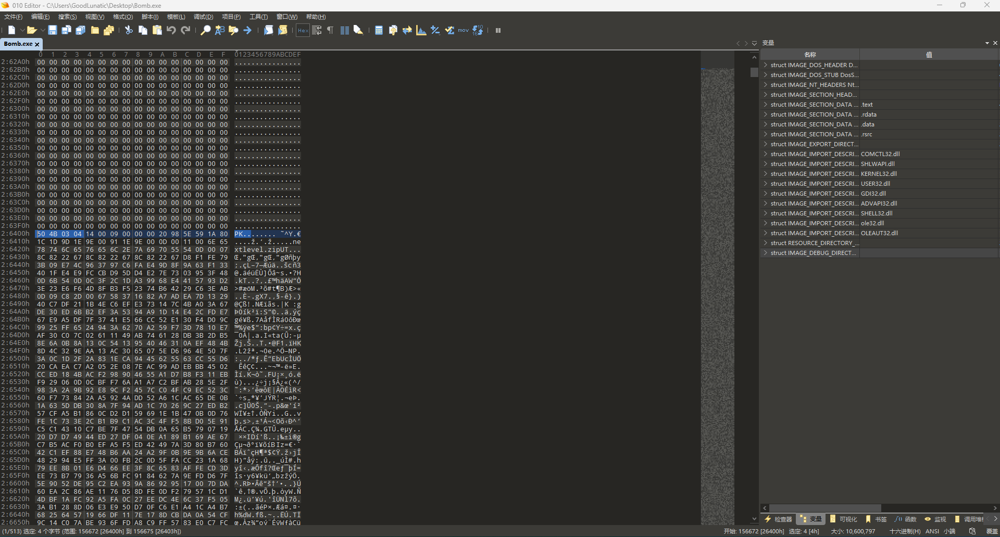
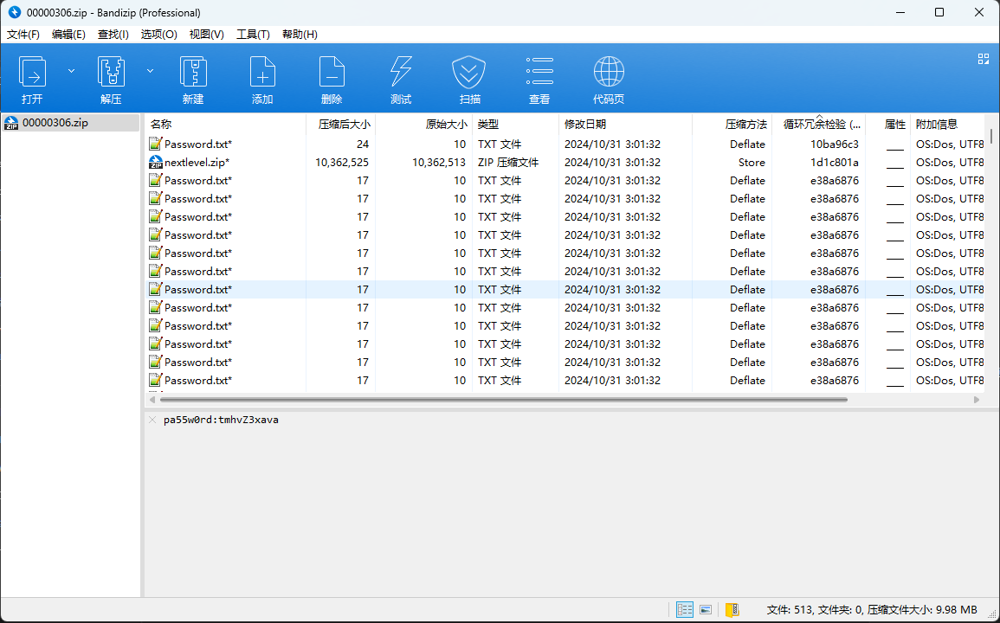

# 2024 HITCTF安天杯网络安全国际邀请赛 Misc Writeup

**比赛结束后有师傅来问里面的题，后面才知道原来是哈工大的邀请赛**

**羡慕能被邀请的学校，啥时候能顺便邀请一下A1natas呢 QAQ**
&lt;!--more--&gt;

&gt; 本文中涉及的具体题目附件可以进我的交流群获取，进群详见 [About](https://goodlunatic.github.io/about/)

## 题目名称 BOMB

解压附件压缩包，可以得到一个`Bomb.exe`，010打开发现里面藏了一个压缩包



这里可以直接使用`foremost`提取出来，压缩包注释中有第一层的解压密码



仔细观察可以发现有一个Passsword.txt的压缩后大小和别的明显不同，用解压密码分别解压一下两种Password.txt

发现压缩大小为24的那个TXT是里面那个压缩包的解压密码，因此很明显，就是压缩包套娃了

因此我们编写以下脚本，循环提取出压缩后大小大于17的TXT文件中的密码，然后压缩包解套

```python
import os
import pyzipper


def extract_zip(zip_file,passwd):
    if not os.path.exists(&#39;./tmp&#39;):
        os.mkdir(&#39;./tmp&#39;)
    with pyzipper.ZipFile(zip_file,&#34;r&#34;) as zip_ref:
        for zipinfo in zip_ref.filelist:
            if &#39;.txt&#39; not in zipinfo.filename:
                zip_ref.extract(zipinfo,&#39;./tmp&#39;,pwd=passwd.encode())
            else:
                # 提取压缩包中特定压缩大小的文件
                if zipinfo.compress_size &gt; 17:
                    zip_ref.extract(zipinfo,&#39;./tmp&#39;,pwd=passwd.encode())
    with open(&#34;./tmp/Password.txt&#34;,&#34;r&#34;) as f:
        passwd = f.read()
    os.remove(zip_file)
    os.system(&#34;mv ./tmp/*.zip .&#34;)
    return passwd

if __name__ == &#34;__main__&#34;:
    zip_file = &#34;nextlevel.zip&#34;
    passwd = &#34;Ll3zHsArHF&#34;
    cnt = 1
    while True:
        print(f&#34;[&#43;] 第{cnt}层的密码是：{passwd}&#34;)
        passwd = extract_zip(zip_file,passwd)
        cnt &#43;= 1

```

在WSL中运行以上脚本后即可得到flag：`flag{e1c1d86f-4407-41c7-94c4-9609fdb5862e}`

## 题目名称 Knock

## 题目名称 CAN

## 题目名称 Special_signal

## 题目名称 payment

---

> Author: [Lunatic](https://goodlunatic.github.io)  
> URL: http://localhost:1313/posts/9651477/  

