# 2024 “天一永安杯”宁波市网络安全大赛 Misc Writeup

宁波市赛的 Misc 还是一如既往的抽象 @_@

还是太菜了，赛中只做出了一道 Misc
<!--more-->


|                  |
| :---------------------------------------------------: |
| 本文中涉及的具体题目附件可以进我的 [知识星球](https://t.zsxq.com/an6p6) 获取 |

## 题目名称 babypng

题目附件给了一张 sakiko.png，用 stegsolve 查看，发现在 红色通道7 绿色通道7 蓝色通道7 中存在 LSB 隐写


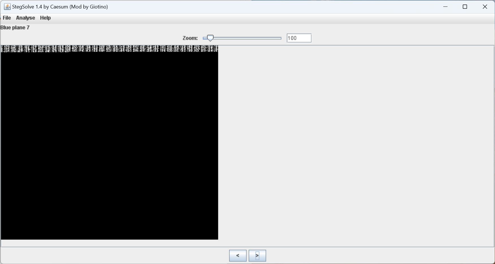

因此，我们使用 stegsolve 把这三个通道中的数据提取出来

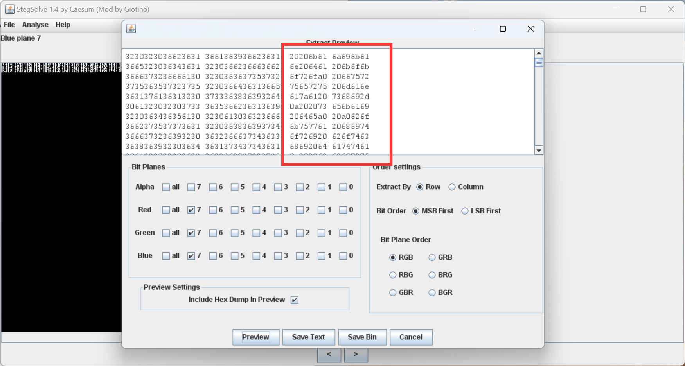

然后直接使用 CyberChef 解密即可

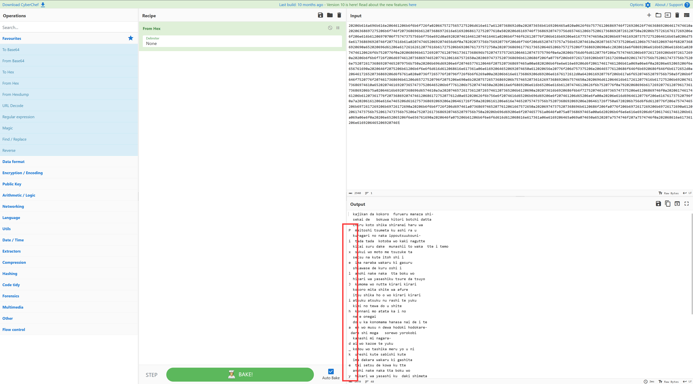

发现在每段前面都有可疑的字符，手动一个个提取出来可以得到：PixelJihad_key:ezgame

最后使用 PixelJihad 解密即可得到 flag：flag{f177a390334bfb71047cd2cd10a336a5}

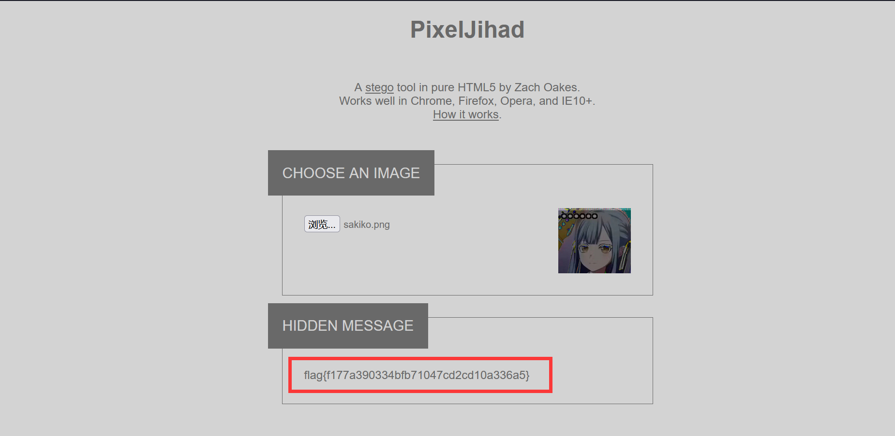

## 题目名称 code

题目附件给了一个 code.txt，打开后发现有零宽，解密后可以得到提示：ilove0an1（猜测需要把数据转成0和1）

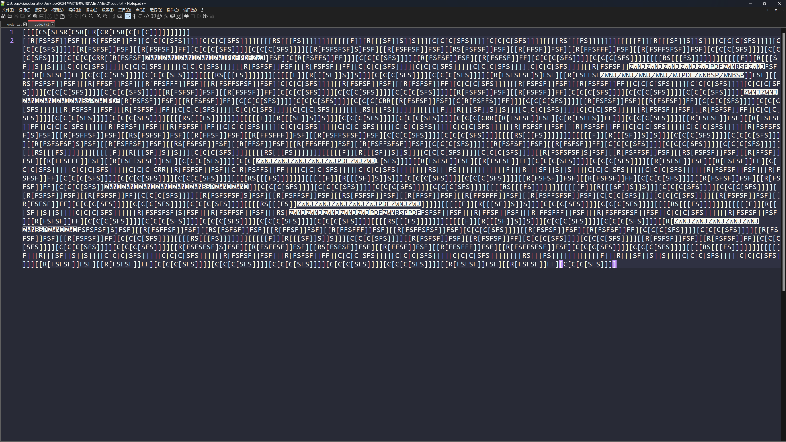

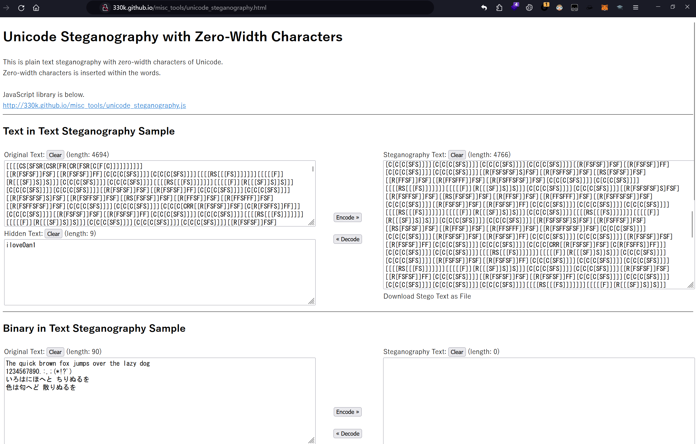

根据题面的提示：i love drawing，猜测是使用代码绘图，因此上面的那些代码应该是绘图代码

比赛的时候没找到，赛后和别的师傅交流的时候知道了下面这个开源项目：

https://github.com/susam/cfrs

然后还有对应的在线绘图的网站：

https://susam.net/cfrs.html

然后我们就可以尝试使用这个网站进行绘图，因为网站长度有限制，因此我们一段一段看

发现整个代码一共就以下几种情况：

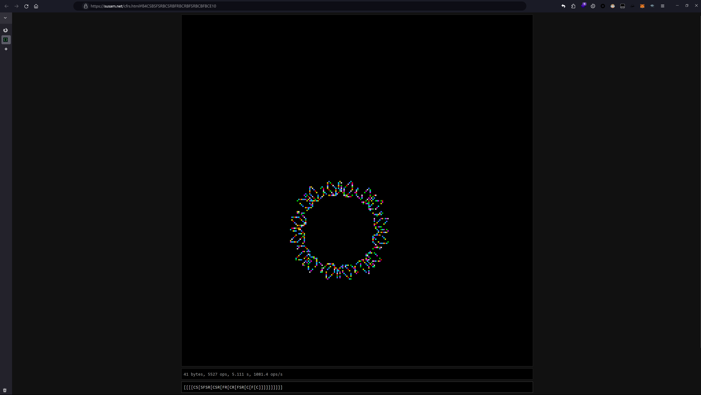

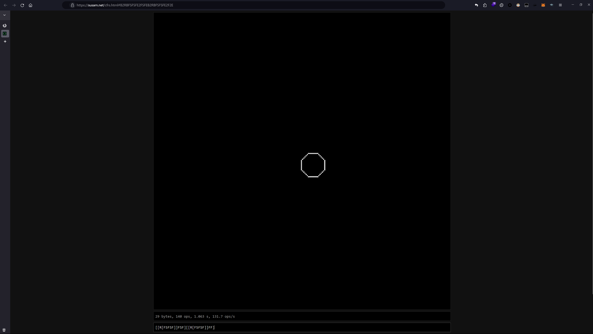

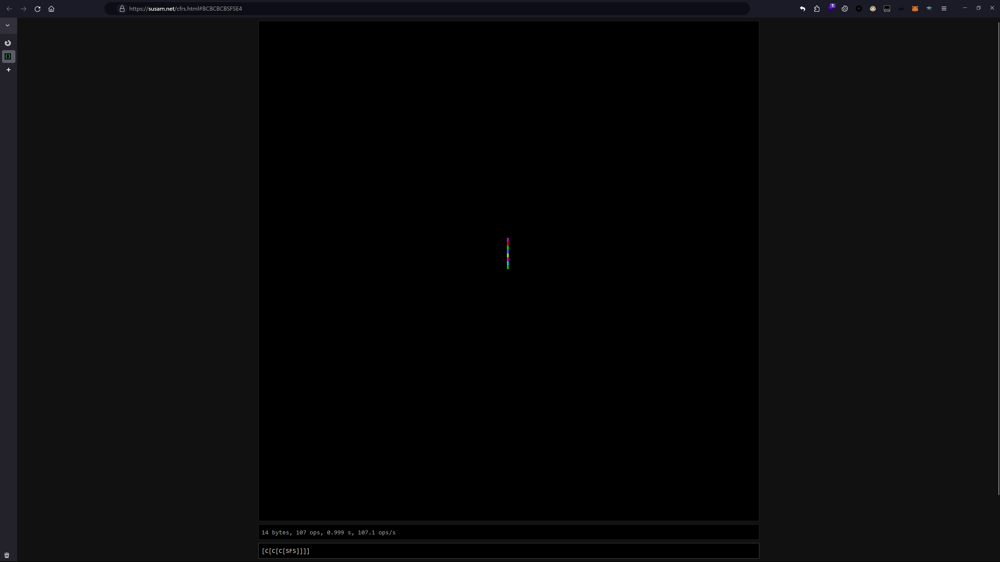

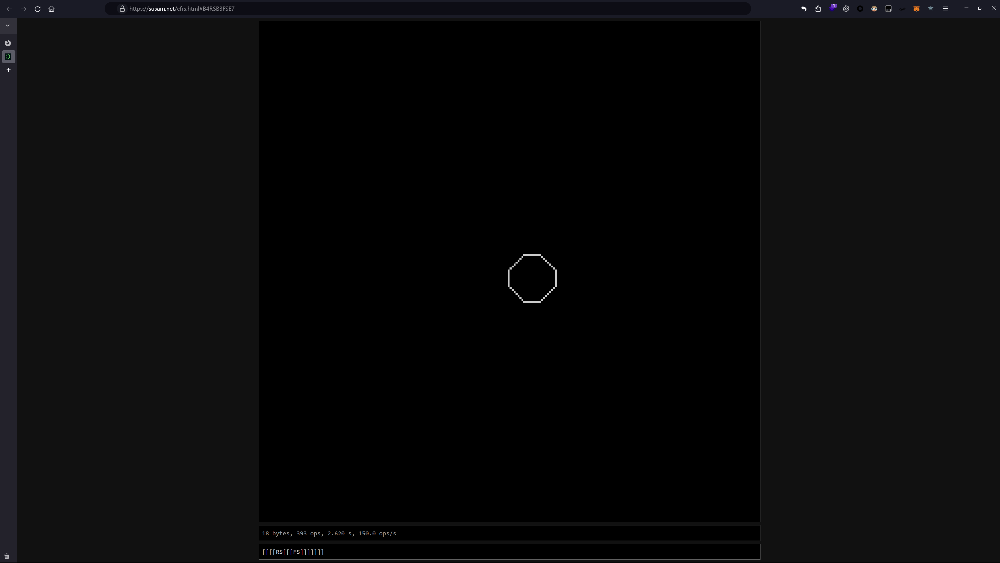

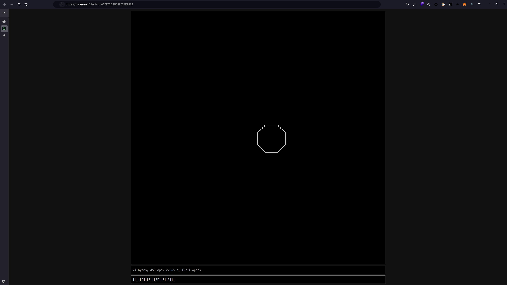

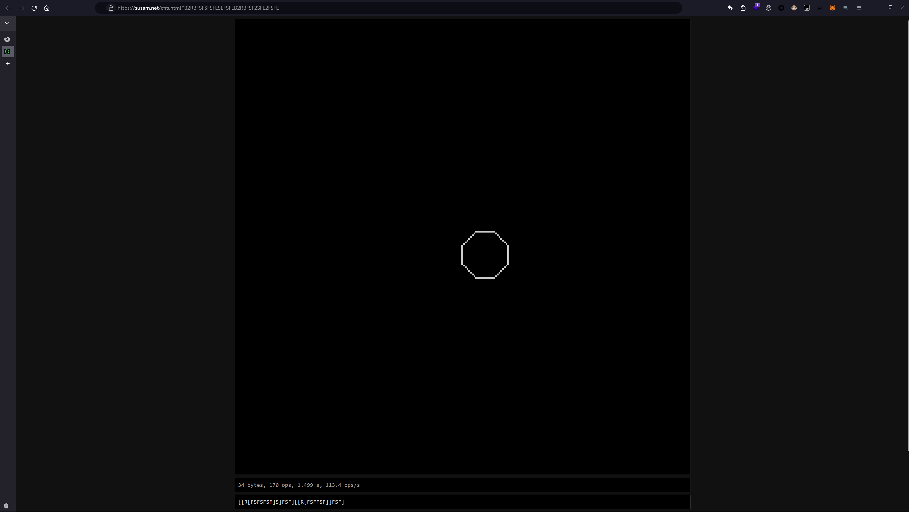


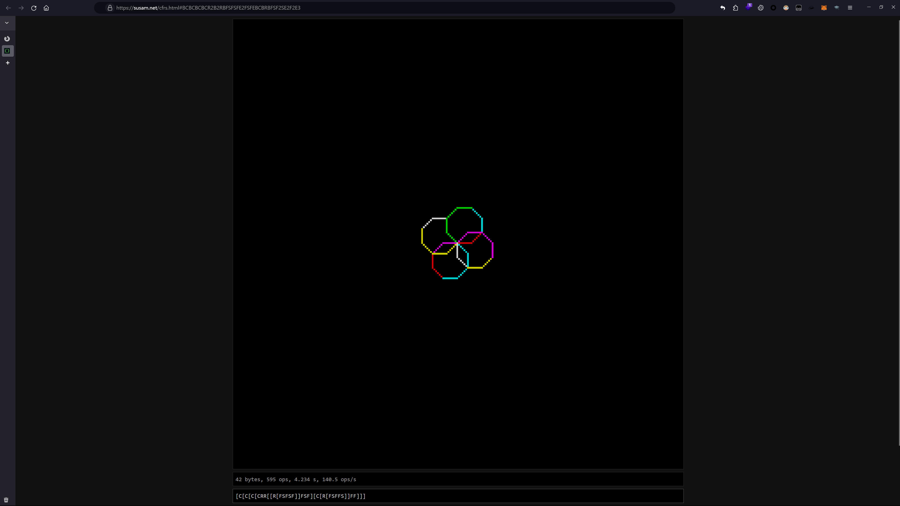

然后我们根据上面那个零宽解出来的提示，把圆圈替换为0，有几个圆圈就有几个0，然后把竖线替换为1

就是这里要特别注意，替换的时候要仔细一点，然后圆圈要一个一个替换，要不然最后会得不到 flag

使用 CyberChef 替换然后二进制转字符串即可得到flag：flag{1_wanna_c1rcl3s_4nd_1in3s}

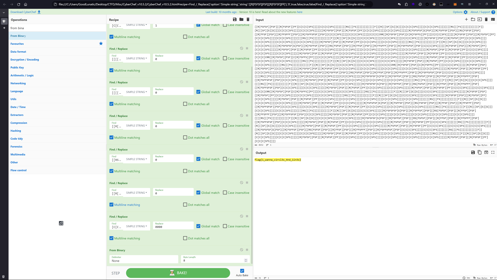

## 题目名称 grid's Secret

题目附件给了一个 secret.txt 打开发现有很多奇怪的数据，然后在末尾发现了零宽隐写

解零宽后可以得到一个提示：4invaild

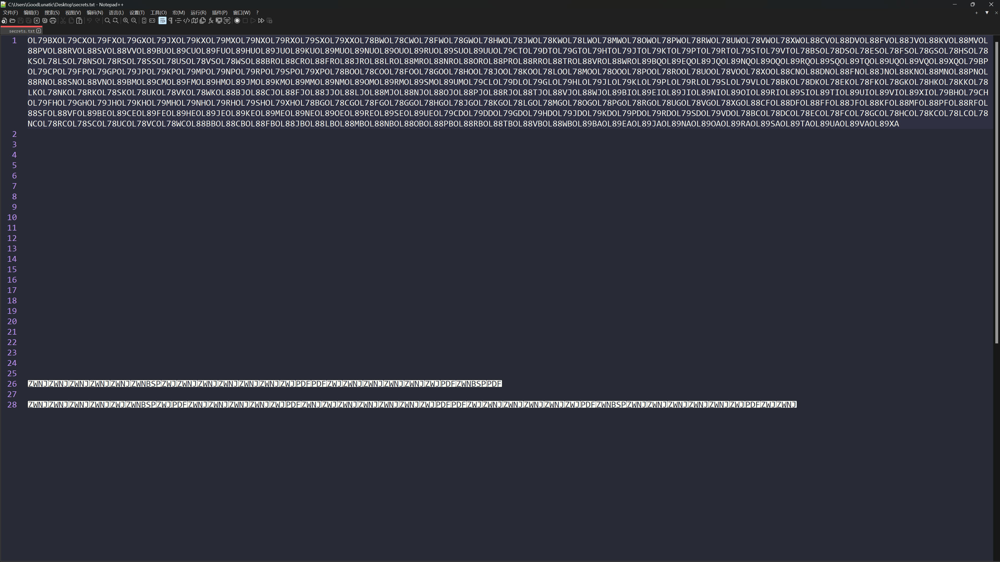

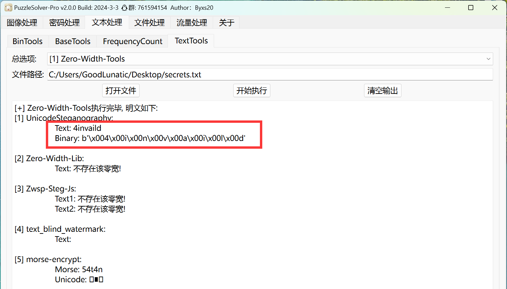

赛后和其他师傅交流了才知道，这个提示指的是前四个字符是无效的，因此可以直接删去

由题目 grid（网格）可以联想到坐标系，因此我们需要把数据划分为6个字符一组

然后用最后两个字符作为横纵坐标对表格进行填充，有数据的地方填上1，没有数据的地方都初始化为0

一开始以为是二维码，经过尝试后发现直接把二进制数据从最后一列开始连起来就行

```python
import pandas as pd
import libnum


data = []
with open("1.txt", 'r') as f:
    text = f.read()

for i in range(0, len(text), 6):
    pos = text[i+4:i+6]
    data.append(pos)
print(data)

df = pd.DataFrame(0, index=range(24), columns=range(24), dtype=int)

for point in data:
    x = ord(point[0]) - ord('A')
    y = ord(point[1]) - ord('A')
    df.iloc[x, y] = 1
print(df)

flag = ''
for y in range(23, 0, -1):
    for x in range(24):
        flag += str(df.iloc[x, y])
print(libnum.b2s(flag))
```

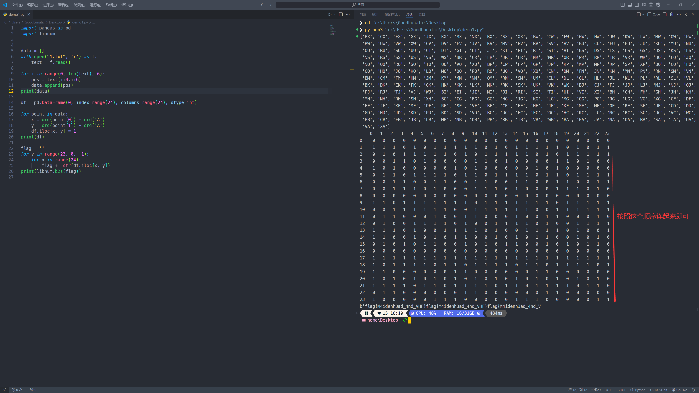

flag{M4idenh3ad_4nd_VHF}

---

> 作者: [Lunatic](https://goodlunatic.github.io)  
> URL: https://goodlunatic.github.io/posts/9d73413/  

