# 2024 “天一永安杯”宁波市赛初赛 Misc Writeup

宁波市赛的 Misc 还是一如既往的抽象 @_@

还是太菜了，赛中只做出了一道 Misc
&lt;!--more--&gt;
## 题目名称 babypng

题目附件给了一张 sakiko.png，用 stegsolve 查看，发现在 红色通道7 绿色通道7 蓝色通道7 中存在 LSB 隐写

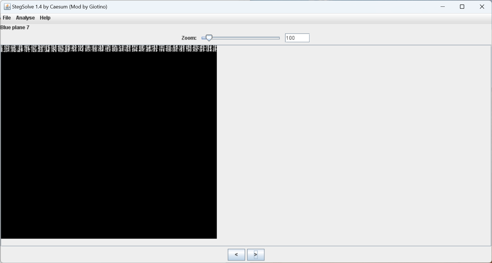

因此，我们使用 stegsolve 把这三个通道中的数据提取出来

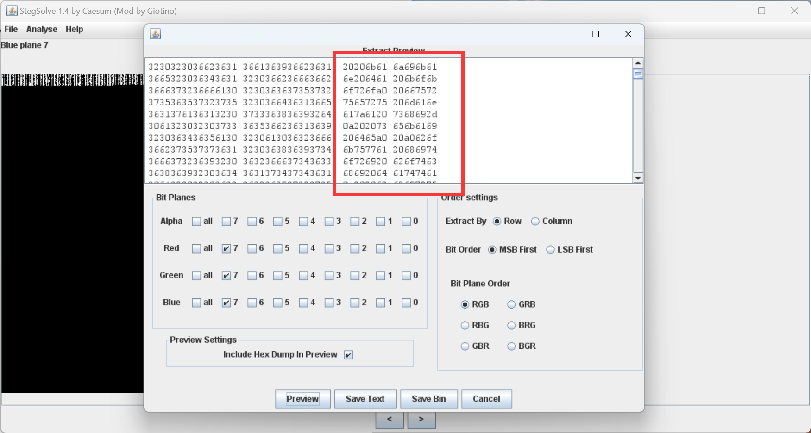

然后直接使用 CyberChef 解密即可

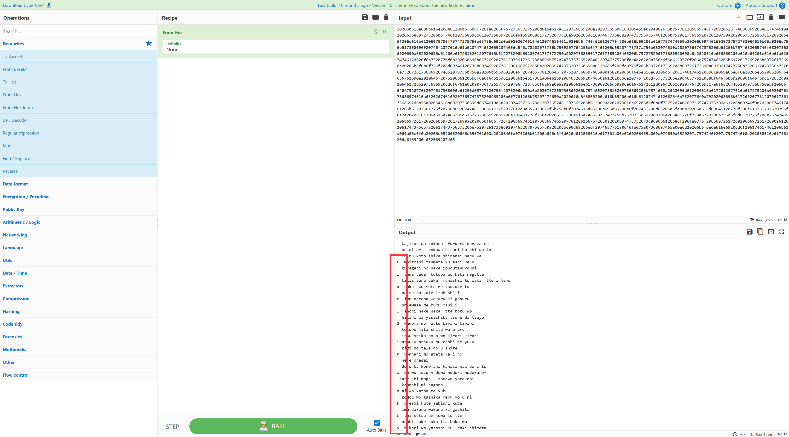

发现在每段前面都有可疑的字符，手动一个个提取出来可以得到：PixelJihad_key:ezgame

最后使用 PixelJihad 解密即可得到 flag：flag{f177a390334bfb71047cd2cd10a336a5}

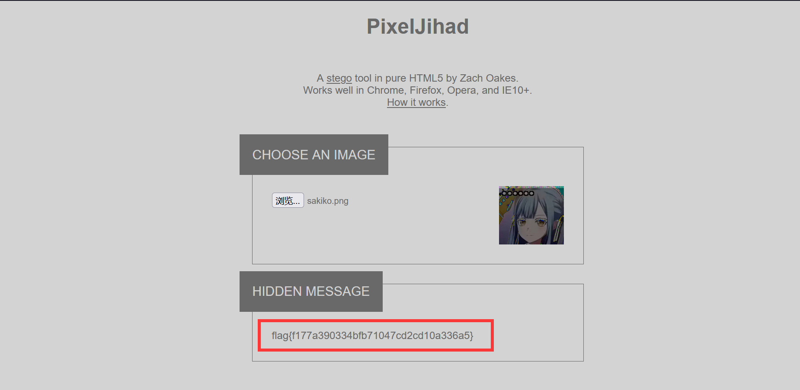

## 题目名称 code

题目附件给了一个 code.txt，打开后发现有零宽，解密后可以得到提示：ilove0an1（猜测需要把数据转成0和1）

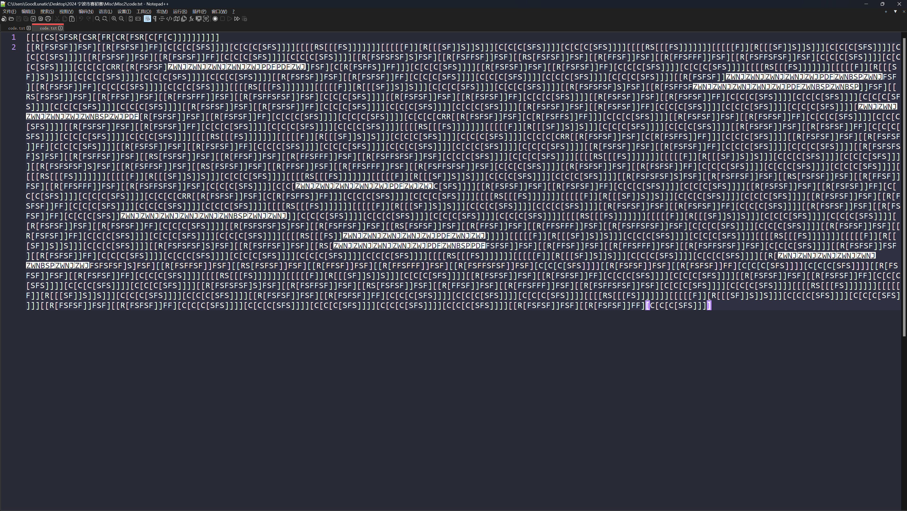

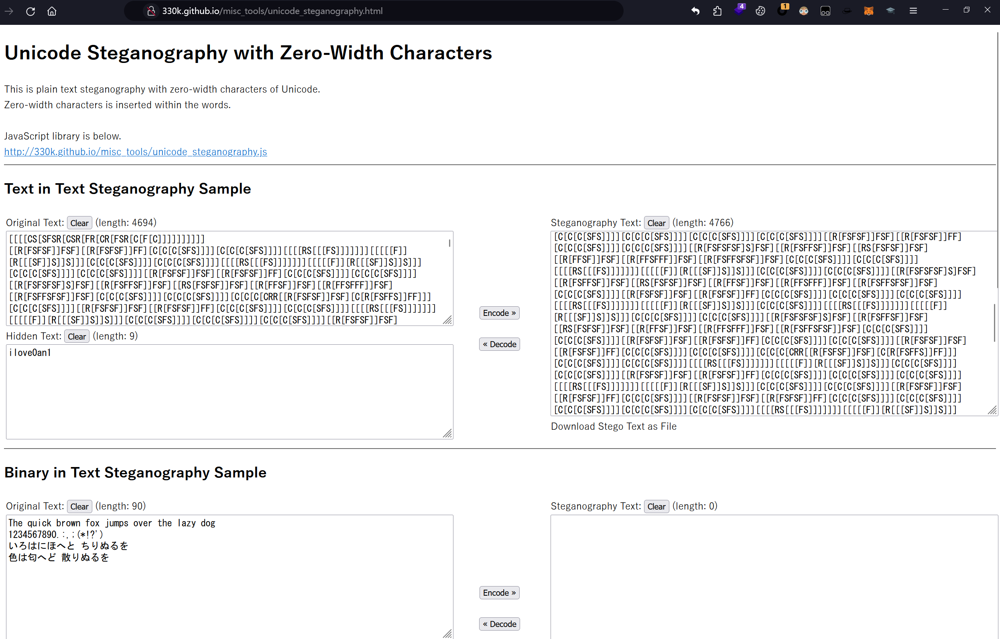

根据题面的提示：i love drawing，猜测是使用代码绘图，因此上面的那些代码应该是绘图代码

比赛的时候没找到，赛后和别的师傅交流的时候知道了下面这个开源项目：

https://github.com/susam/cfrs

然后还有对应的在线绘图的网站：

https://susam.net/cfrs.html

然后我们就可以尝试使用这个网站进行绘图，因为网站长度有限制，因此我们一段一段看

发现整个代码一共就以下几种情况：

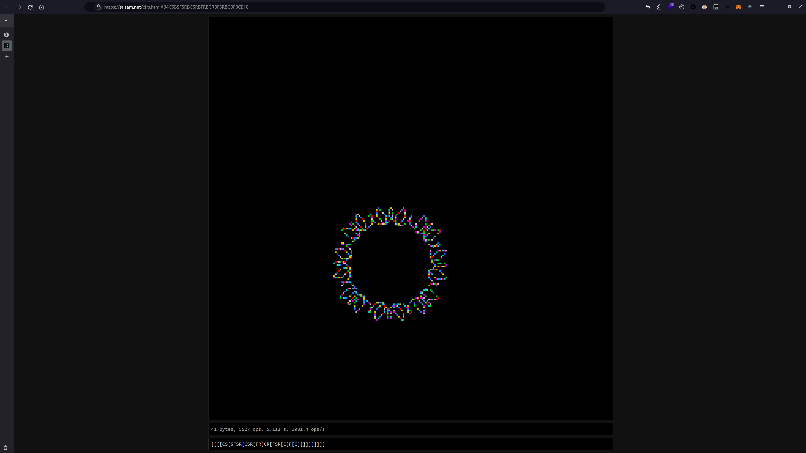

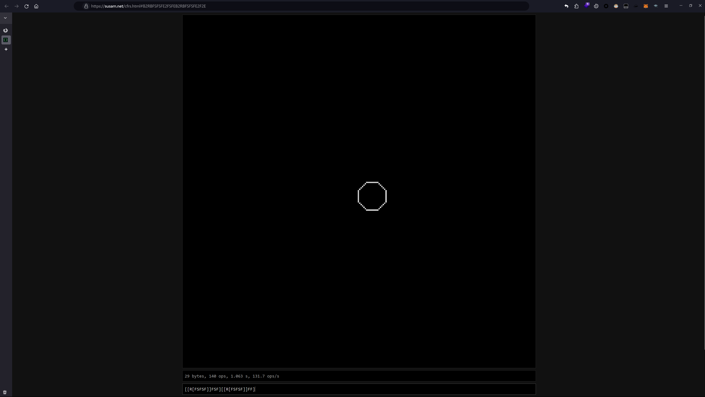

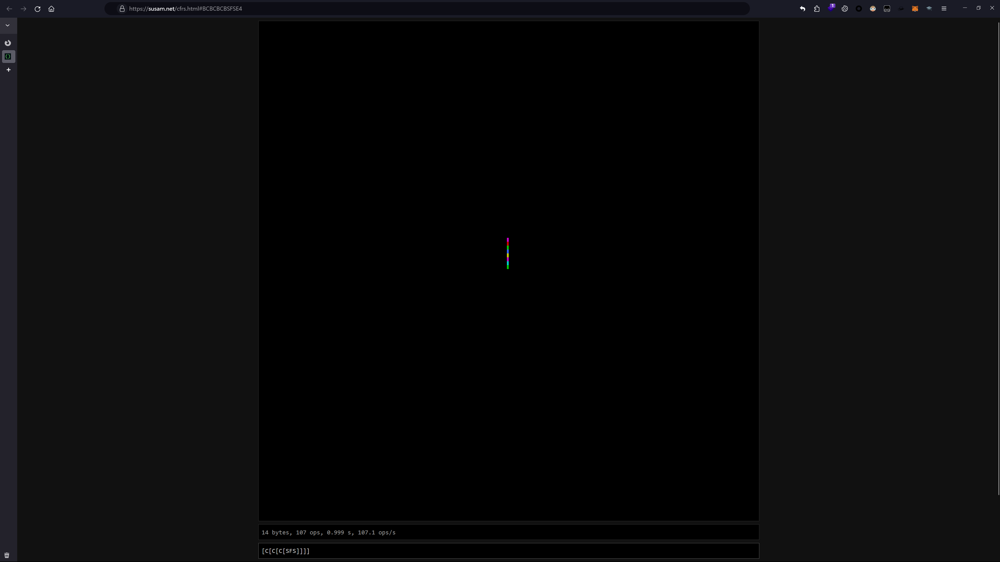

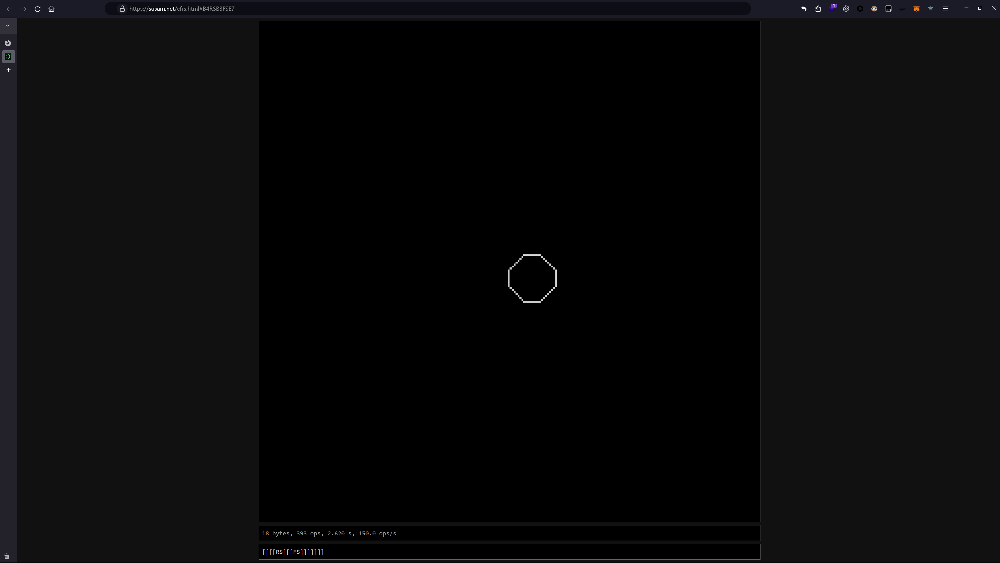

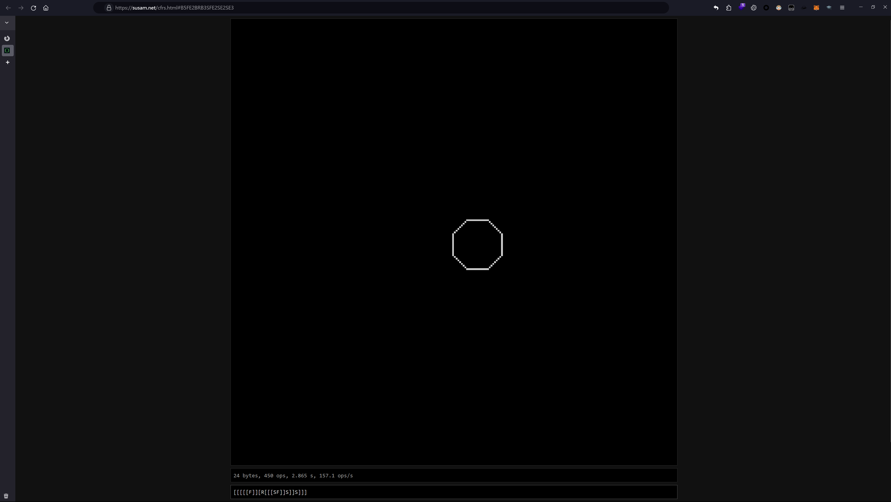

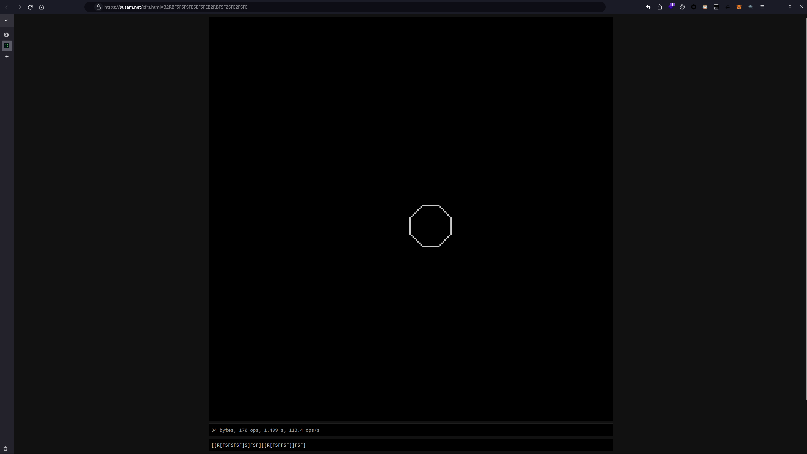

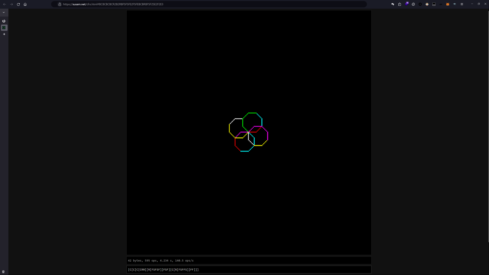

然后我们根据上面那个零宽解出来的提示，把圆圈替换为0，有几个圆圈就有几个0，然后把竖线替换为1

就是这里要特别注意，替换的时候要仔细一点，然后圆圈要一个一个替换，要不然最后会得不到 flag

使用 CyberChef 替换然后二进制转字符串即可得到flag：flag{1_wanna_c1rcl3s_4nd_1in3s}

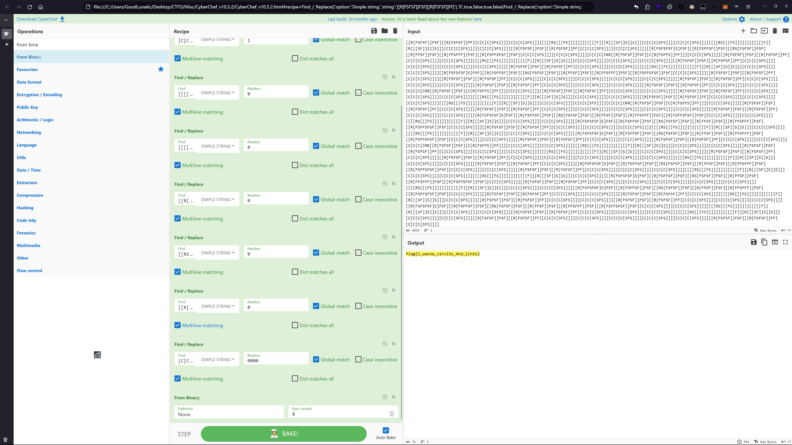

---

> Author: [Lunatic](https://goodlunatic.github.io)  
> URL: http://localhost:1313/posts/9d73413/  

