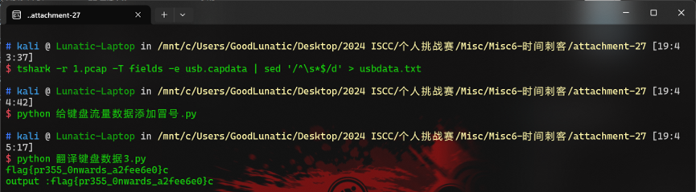
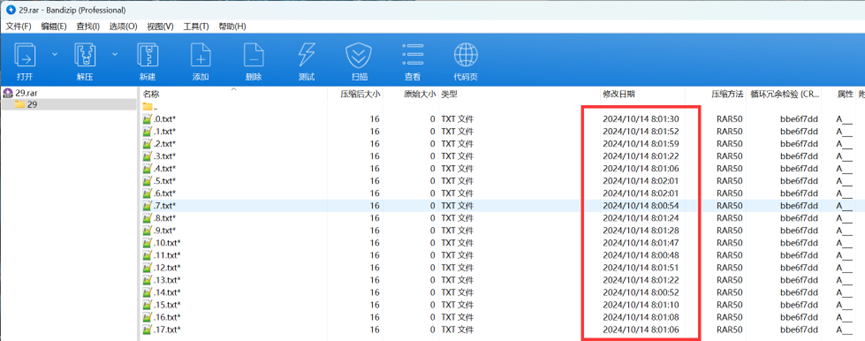
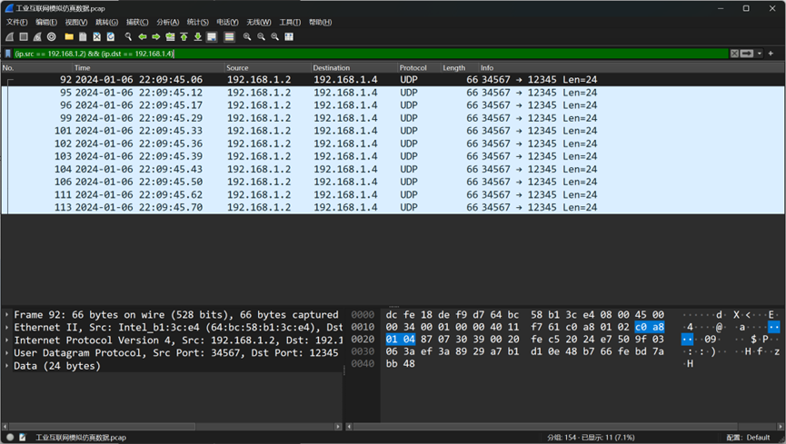
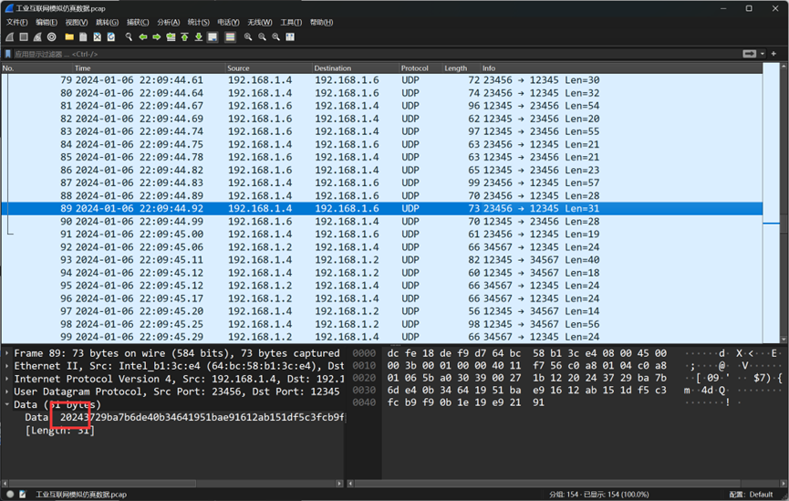
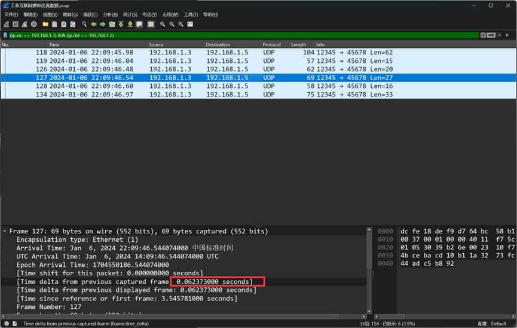
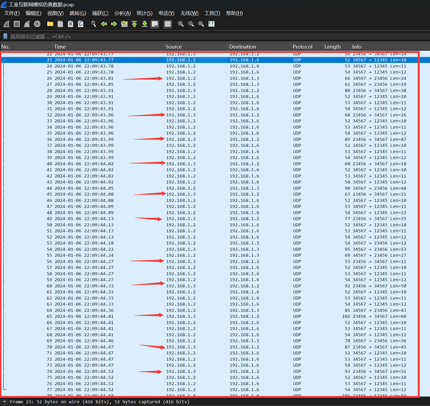
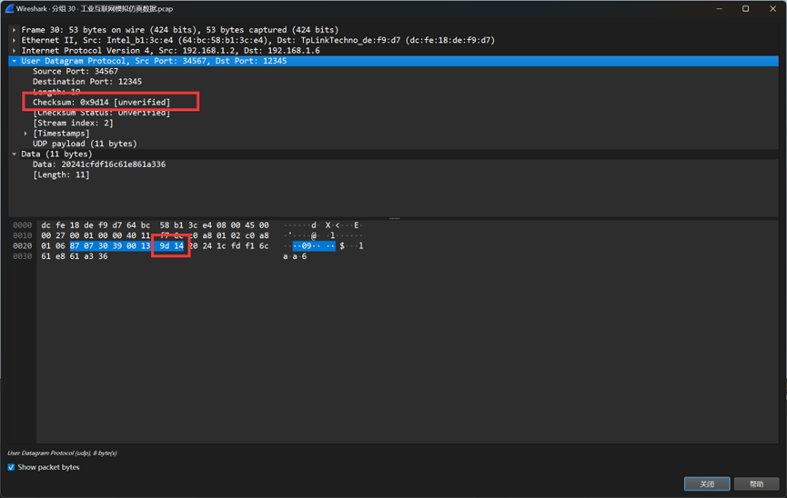

# 2024 全国大学生信息安全与对抗技术竞赛(ISCC) Misc Writeup

**这比赛有点难评只能说，但是确实是《人民的好比赛》**
&lt;!--more--&gt;
## 题目名称 RSA_KU
解一个方程就可以得到p和q，然后解RSA即可

```python
import gmpy2
from sympy import *
from Crypto.Util.number import *

n = 129699330328568350681562198986490514508637584957167129897472522138320202321246467459276731970410463464391857177528123417751603910462751346700627325019668100946205876629688057506460903842119543114630198205843883677412125928979399310306206497958051030594098963939139480261500434508726394139839879752553022623977
e = 65537
c = 81542950634170106435892662475507283547967877210216191810634513013031046158459269258017597038287472919950811537049030186565471870789076226171751774409328287149914234904307925163438628271194937049804334335349685851934799426152133152587428808924287968838087416148799251156379854263050430010921100416842555347176
r1 = 129699330328568350681562198986490514508637584957167129897472522138320202321246467459276731970410463464391857177528123417751603910462751346700627325019668067056973833292274532016607871906443481233958300928276492550916101187841666991944275728863657788124666879987399045804435273107746626297122522298113586003834
r2 = 129699330328568350681562198986490514508637584957167129897472522138320202321246467459276731970410463464391857177528123417751603910462751346700627325019668066482326285878341068180156082719320570801770055174426452966817548862938770659420487687194933539128855877517847711670959794869291907075654200433400668220458

p = Symbol(&#39;p&#39;)
q = Symbol(&#39;q&#39;)
res = solve([(p-2)*(q-1)-r1, (p-1)*(q-2)-r2], [p, q])[1]
p = int(res[0])
q = n//p
phi = (p-1)*(q-1)
d = gmpy2.invert(e, phi)
m = pow(c, d, n)
# print(m)
print(long_to_bytes(m))
# b&#39;ISCC{EmTOvTJP4NZQLr8Yy2--}&#39;
```
## 题目名称 时间刺客
题目附件给了一个压缩包，解压后得到`给你也用不了.pcap`和`29.7z`

打开流量包，发现是USB流量，直接用脚本进行提取后可以得到如下内容



但是经过尝试发现是个假的flag，其实流量包的文件名也提示了

之后仔细查看题目名称：时间刺客

以及题面的提示：2024年10月14日早8点，小明敲键盘时候解出了flag

猜测与这个时间有关，然后在29.rar中发现了接近的时间



经过尝试，发现直接把文件0.txt-1.txt的时间减去题面中的时间得到的秒数

转为ascii码然后套上ISCC{} 就是flag：ISCC{ZpwRByy6TXk0oR4FDB}

```python
data = &#34;90 112 119 82 66 121 121 54 84 88 107 48 111 82 52 70 68 66&#34;
ls = data.split()
print(ls)
for item in ls:
    print(chr(int(item)), end=&#34;&#34;)
```

## 题目名称 工业互联网模拟仿真数据分析

题目一：在某些网络会话中，数据包可能保持固定大小，请给出含有此确定性特征的会话IP地址和数据包字节大小值。

使用wireshark的过滤器一个个筛选，发现(ip.src == 192.168.1.2) &amp;&amp; (ip.dst == 192.168.1.4)的数据包的长度都是24，因此这题的答案就是

`192.168.1.2,192.168.1.4,24`



题目二：通信包数据某些字段可能为确定的，请给出确定字节数值。

翻看流量包，关注流量的data字段，发现data字段的前四位都是2024

因此本题的答案就是 `2024`



题目三：一些网络通信业务在时间序列上有确定性规律，请提供涉及的IP地址及时间规律数值（小数点后两位）

使用wireshark的过滤器进行筛选，发现只有(ip.src == 192.168.1.3) &amp;&amp; (ip.dst == 192.168.1.5)的每帧的间隔都大致为0.06

因此本题的答案为：`192.168.1.3,192.168.1.5,0.06`



题目四：一些网络通信业务存在逻辑关联性，请提供涉及的IP地址

因为题目中提示了逻辑关联性，因此猜测是两个以上ip之间连续的通信

翻看流量包，发现只有192.168.1.2,192.168.3,192.168.1.6有这样的特征

仔细查看下图中的分组，发现这三个ip的通信有明显的规律

因此大胆猜测本题答案就是 `192.168.1.2,192.168.3,192.168.1.6`



题目五：网络数据包往往会添加数据完整性校验值，请分析出数据校验算法名称及校验值在数据包的起始位和结束位（倒数位）

校验算法网上一搜很容易就可以知道只可能是：CRC16或CRC32



然后题目提示结束位是倒数位，如上图，很容易可以知道是 1

如果是上图那样的顺序，起始位应该是7，但是提交后发现不对

因此遍历1-7以及对CRC16和CRC32进行尝试，发现遍历到4且校验算法是CRC16的时候答案正确

因此本题的答案为：CRC16,4,1

最后使用题目附件给的 flag.py 生成flag即可

`adcca5c2a82064a17a645d35b6b054cd`

```python
import hashlib

def generate_flag(*answers):
    # 将所有答案使用英文逗号连接
    combined_answers = &#39;,&#39;.join(answers)
    # 生成flag格式
    initial_flag = f&#34;ISCC{{{combined_answers}}}&#34;
    # 对flag进行MD5加密
    md5_hash = hashlib.md5(initial_flag.encode()).hexdigest()
    return md5_hash

# 示例用法
if __name__ == &#34;__main__&#34;:
    answers = [
        &#34;192.168.1.2,192.168.1.4,24&#34;,  # 第一小题答案：IP顺序从小到大排列，涉及的IP个数由选手自己判断，数值为整数
        &#34;2024&#34;,  # 第二小题答案：数值为整数
        &#34;192.168.1.3,192.168.1.5,0.06&#34;,  # 第三小题答案：IP顺序从小到大排列，涉及的IP个数由选手自己判断，数值保留小数点后2位
        &#34;192.168.1.2,192.168.1.3,192.168.1.6&#34;,  # 第四小题答案：IP顺序从小到大排列，涉及的IP个数由选手自己判断
        &#34;CRC16,4,1&#34;   # 第五小题答案：数据校验算法名称长度为5个字符，其中英文字母大写
    ]
    # 生成MD5加密后的flag
    final_flag = generate_flag(*answers)
    # 输出最终的MD5加密字符串
    print(final_flag)
    # adcca5c2a82064a17a645d35b6b054cd

```

## 题目名称

## 题目名称

## 题目名称

## 题目名称

---

> Author: [Lunatic](https://goodlunatic.github.io)  
> URL: http://localhost:1313/posts/a7d0d5f/  

