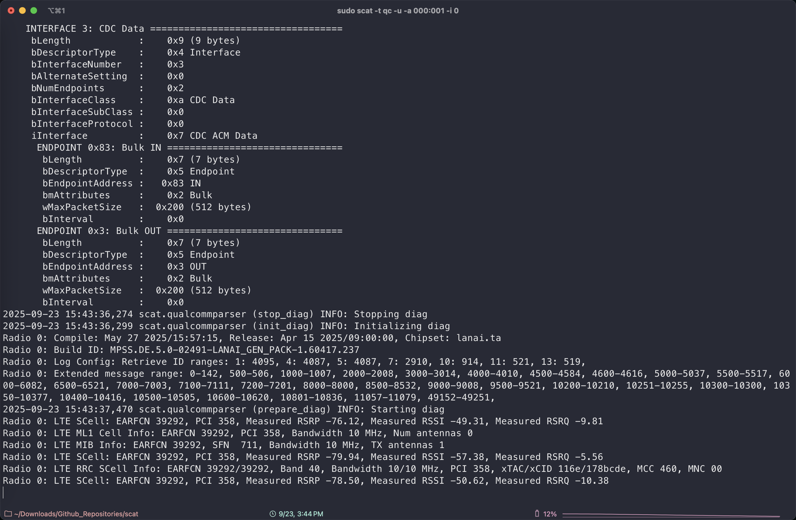

# 利用 SCAT 实时捕获 4G-LTE 和 5G-NR 层三以上消息


**之前复现论文，做实验的时候想要实时查看 LTE 和 NR 的信令消息，只能通过 CelllularPro**

**但是无奈这个软件是收费的，并且很多论文作者在实时捕获消息上并没有提到这个软件**

**反而都是用 SCAT 这个开源项目进行实时捕获，因此打算写篇博客来记录一下配置过程**

<!--more-->

**项目地址：https://github.com/fgsect/scat**

> 参考链接： 
> 
> [https://github.com/fgsect/scat/issues/111](https://github.com/fgsect/scat/issues/111) 
> 
> [https://www.youtube.com/watch?v=3eATjQASLLA&t=263s](https://www.youtube.com/watch?v=3eATjQASLLA&t=263s)
> 
> [https://github.com/arifkyi/5GLuafile](https://github.com/arifkyi/5GLuafile)
> 
> [https://www.youtube.com/watch?v=b0dbvIkkgCI](https://www.youtube.com/watch?v=b0dbvIkkgCI)

参考项目的 README 文档，SCAT 的安装可以直接用 pip install 完成

```bash
pip install "signalcat[fastcrc]"
```

然后手机用 USB线连上主机，并用 adb 打开诊断端口，输入以下命令启动 SCAT 即可

```bash
scat -t qc -u -a 000:001 -i 0
# -t 指定基带的品牌，qc 是高通，sec是三星，hisi是海思
# -u USB 模式（直接连接手机）
# -s /dev/ttyUSB0  # 串口模式（连接蜂窝模块）
# -d filename      # 文件模式（分析已有的诊断日志文件）
# -a 000:001 指定 USB 设备地址 总线号:设备号
# -i 指定诊断端口号，这个的数值与手机具体型号有关，可用 lsusb 命令查看，参考上面那个 youtube 视频
# -v 详细输出
# 当然也可以用下面命令把捕获到的消息转发到 127.0.0.2（虽然我感觉没啥必要 
scat -t qc -u -a 000:001 -i 0 -H 127.0.0.2
```

> 如果不知道诊断端口的序号，可以使用 lsusb 命令查看：
> 
> sudo apt install usbutils
> 
> lsusb -v

终端输入上面的命令后，SCAT正常运行的输出如下：

| <br><br> | <br><br> |
| :-------------------------------------------: | :-------------------------------------------: |

这时候我们打开 wireshark 监听本地回环地址lo0即可


如果之前的步骤一切正常，这时候我们就能看到实时捕获到的 LTE 信令了


然后我们可以用下面这个过滤器来过滤一下，会看的更清楚一些

```
(((((!(_ws.col.protocol == "TCP")) && !(_ws.col.protocol == "ICMP")) && !(_ws.col.protocol == "HTTP")) && !(_ws.col.protocol == "HTTP/JSON")) && !(_ws.col.protocol == "UDP")) && !(_ws.col.protocol == "MDNS")
```


SCAT 除了能实时捕获 4G-LTE 的消息，也支持实时捕获5G-NR消息，效果如下:


> Tips: 如果 UE 捕获不到消息并且终端里没有响应，可尝试重启手机，高通的基带时常会遇到这个问题

因为 wireshark 本身是不支持解析 GSMTAPv3 协议数据的，我们需要手动加入 lua 脚本来提供支持

SCAT 项目本身提供了解析 GSMTAPv3 协议数据的 lua 插件，但是好像还是不够完善

国外有个老哥重新写了一个，这个可能更好用：[5GLuafile](https://github.com/arifkyi/5GLuafile)

成功加载 lua 插件后再进行监听的效果如下：


> Tips：可以点击左上角的 Wireshark -> 关于 wireshark -> 文件夹 -> 个人 lua 插件 找到 lua 插件的目录
> 
> 然后把 lua 脚本复制到这个目录下即可 

然后我们可以比较一下 wireshark 里抓的消息和 CellularPro 里的消息

| <br><br> | <br><br> |
| :-------------------------------------------: | :-------------------------------------------: |

> 如果启用了 lua 插件后，4G-LTE的消息无法正常解析，可以按如下设置：  
> 
> wireshark -> 分析 -> 解码为 -> UDP port设置为4729 -> 把当前设置为 GSMTAP


> 如果要切换为解码 5G-NR的消息，把当前设置为GSMTAPv3 即可


---

> Author: [Lunatic](https://goodlunatic.github.io)  
> URL: https://goodlunatic.github.io/posts/a8aa439/  

