# 2024 帕鲁杯 Misc Writeup


**2024 帕鲁杯 Misc Writeup**

<!--more-->

## 题目名称 签到

**中文ascii码**

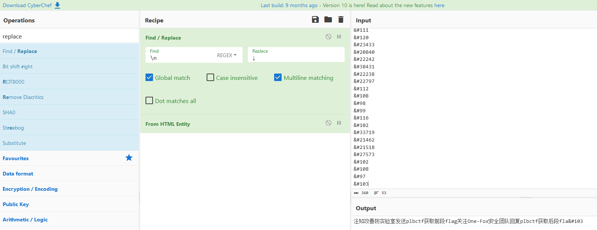 

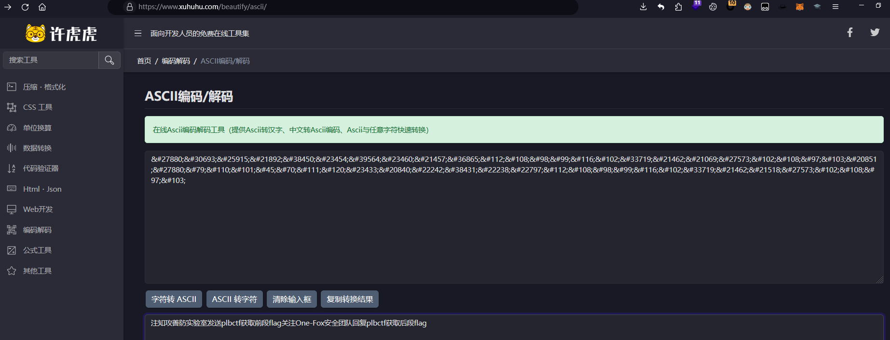

**flag{TreJaiuLT1rgbdfG0Eay}**

## 题目名称 FM 145.8

**直接SSTV开扫就行**

 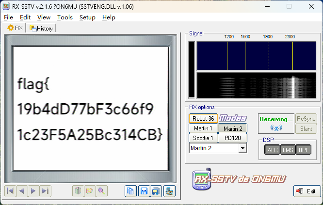

**flag{19b4dD77bF3c66f91c23F5A25Bc314CB}**

## 题目名称 350×350

**jpg图片foremost一下可以得到一个zip文件，解压后发现docx的结构，改后缀为.docx再打开**

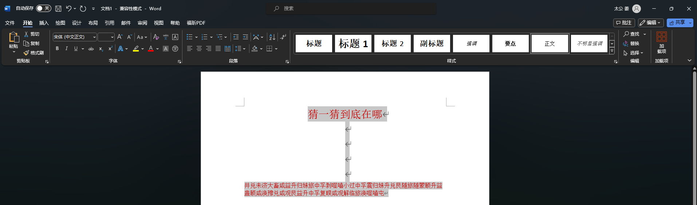

**伏羲六十四卦解密**

```python
s = '井兑未济大畜咸益升归妹旅中孚剥噬嗑小过中孚震归妹升兑艮随旅随蒙颐升益蛊颐咸涣豫兑咸观艮益升中孚复睽咸观解临旅涣噬嗑屯'
dic = {'坤': '000000', '剥': '000001', '比': '000010', '观': '000011', '豫': '000100', '晋': '000101', '萃': '000110', '否': '000111', '谦': '001000', '艮': '001001', '蹇': '001010', '渐': '001011', '小过': '001100', '旅': '001101', '咸': '001110', '遁': '001111', '师': '010000', '蒙': '010001', '坎': '010010', '涣': '010011', '解': '010100', '未济': '010101', '困': '010110', '讼': '010111', '升': '011000', '蛊': '011001', '井': '011010', '巽': '011011', '恒': '011100', '鼎': '011101', '大过': '011110', '姤': '011111',
       '复': '100000', '颐': '100001', '屯': '100010', '益': '100011', '震': '100100', '噬嗑': '100101', '随': '100110', '无妄': '100111', '明夷': '101000', '贲': '101001', '既济': '101010', '家人': '101011', '丰': '101100', '离': '101101', '革': '101110', '同人': '101111', '临': '110000', '损': '110001', '节': '110010', '中孚': '110011', '归妹': '110100', '睽': '110101', '兑': '110110', '履': '110111', '泰': '111000', '大畜': '111001', '需': '111010', '小畜': '111011', '大壮': '111100', '大有': '111101', '夬': '111110', '乾': '111111'}
li = []
k = 0
for i in range(len(s)):
    if k == 1:
        k = 0
        continue
    try:
        li.append(dic[s[i]])
    except:
        t = ''
        t = t+s[i]+s[i+1]
        li.append(dic[t])
        k = 1
ss = ''.join(li)
print(ss)
enc = ''
for i in range(0, len(ss), 8):
    enc += chr(eval('0b'+ss[i:i+8]))
print(enc)
```

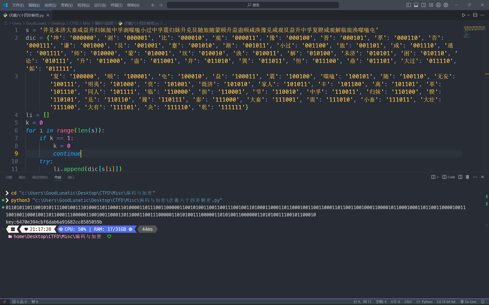

**得到压缩包密码：6470e394cbf6dab6a91682cc8585059b**

**解压压缩包后得到一个伪加密的压缩包，去除伪加密，可以得到一张 jpg**

**直接 foremost 可以得到一个压缩包，解压后得到两张 png 图片**

**经过尝试，发现是盲水印加密的一种**

**<https://github.com/guofei9987/blind_watermark>**

**根据题目名称猜测分辨率是 350x350，直接写个脚本提取即可得到一张二维码**

```python
# -*- coding: utf-8 -*-
import cv2

from blind_watermark import WaterMark
import os

bwm1 = WaterMark(password_wm=1, password_img=1)
# 注意需要设定水印的长宽wm_shape
bwm1.extract('33.png', wm_shape=(350, 350),
             out_wm_name='output.png', mode='img')
```

 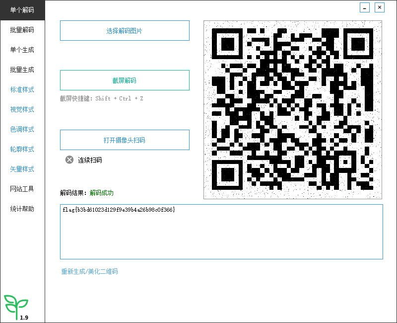

**扫码即可得到flag：flag{b3bd61023d129f9e39b4a26b98c0f366}**

## 题目名称 江

**flag{湖北省武汉市江汉二路与江汉路步行商业街交叉路口}**

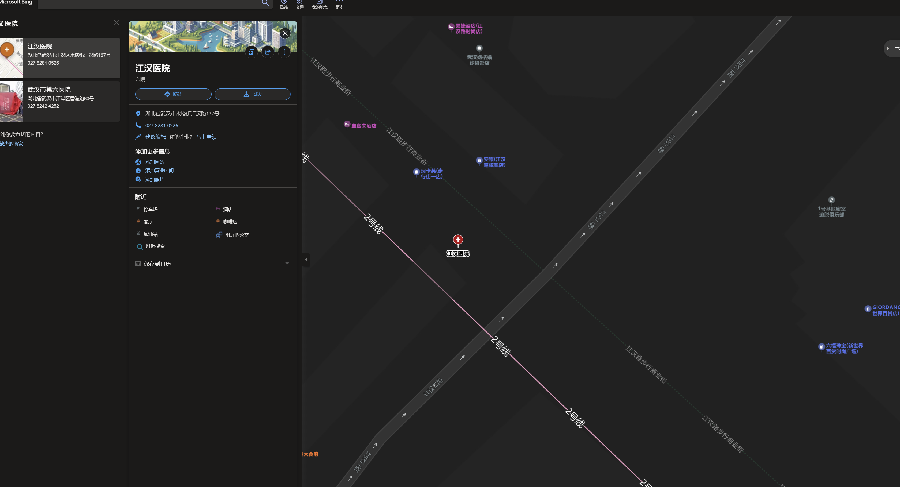

## 题目名称 ez_misc

**题目附件给了一个伪加密的压缩包，直接去除伪加密然后解压可以得到一个加密的 rar 和 一张 jpg**

**jpg 末尾有很多多余的空白数据**

**经过尝试不是 whitespace ，而是 SNOW，将多余数据另存为一个新文件**

**然后直接SONW解密即可得到压缩包密码：Carefree and carefree**

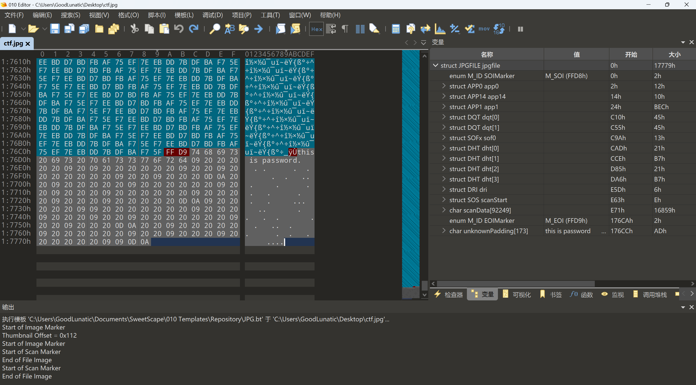 

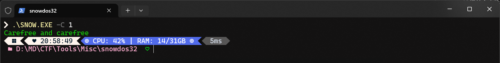

然后使用得到的密码解压rar即可得到 flag：flag{b220116fc6ca827ecf3cb6c6c06dac26}

## 题目名称 为什么我的新猫猫喂不饱

**题目附件给了一个压缩包，解压得到一张 gif 和一张 png**

**010打开 gif，在末尾可以看到多余的数据，看到关键的 UOZT{**

**直接拉入随波逐流一把梭，可以得到前半部分的 flag：flag{my_ca1_ssg5?**

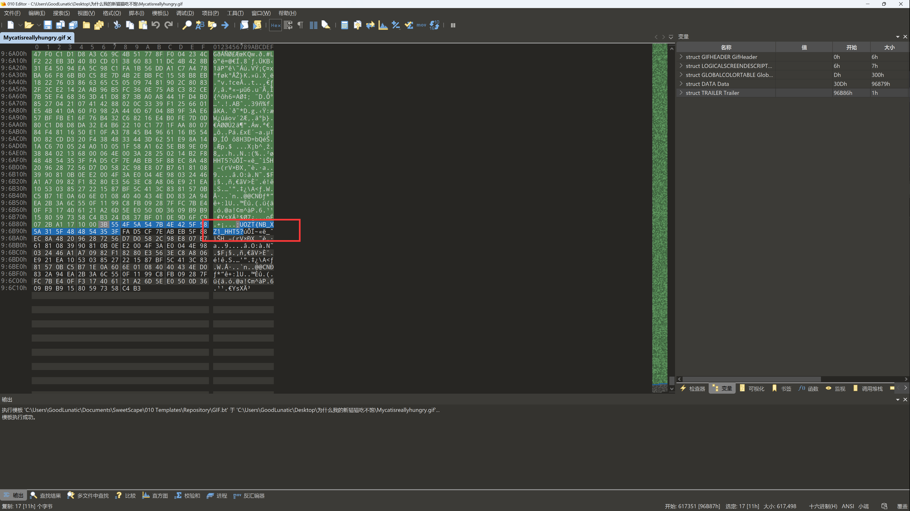 

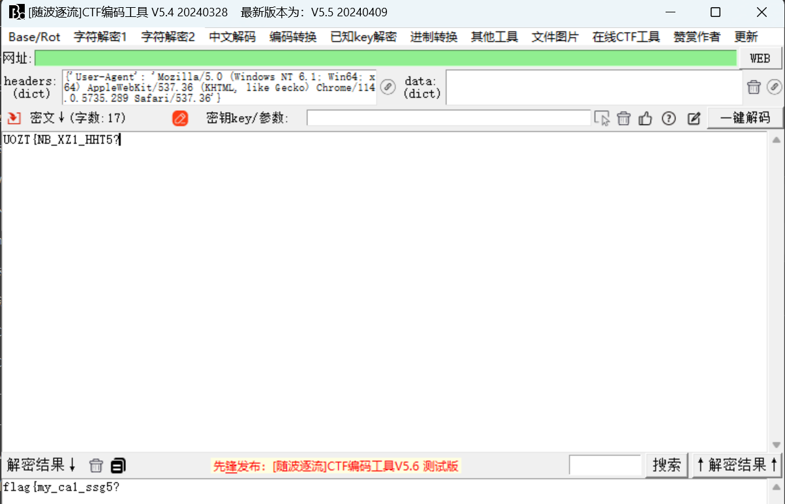

**然后使用 ffmpeg 命令分帧**

**ffmpeg -i Mycatisreallyhungry.gif frame%04d.png**

**然后发现第23帧的图片和那张png是一样的，猜测这里还有盲水印**

**经过尝试，发现是频域水印，直接使用网上的脚本解密即可**

 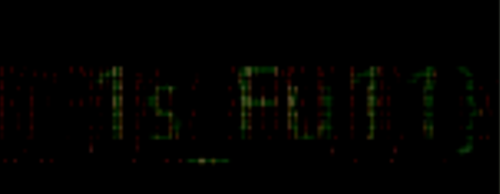

**最后经过尝试，得到最后的 flag：flag{my_ca1_1s_Fu11}**

## 题目名称 什么协议

**题目附件给了一个流量包，翻看一下 http 和 tcp 流，发现很多 curl 命令的特征\n直接导出所有的 HTTP 对象，然后在其中发现下载了一个网页**

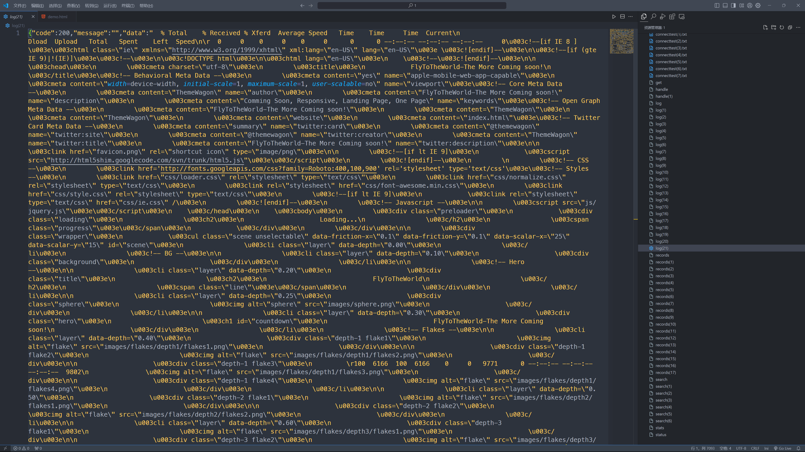

**直接用 CyberChef 提取出网页数据，然后仔细翻看一下，发现在末尾有疑似 flag 的字符串** 

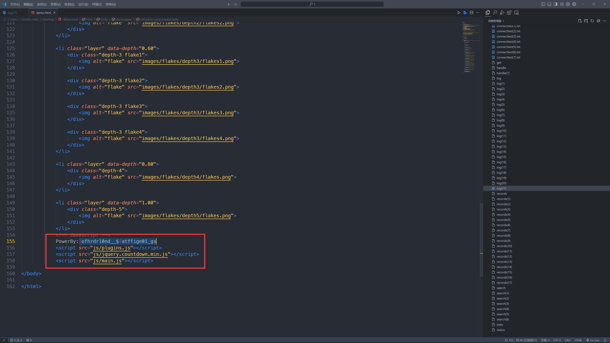

**最后直接使用最新版的随波逐流一把梭了，发现是块排序压缩BWT编码**

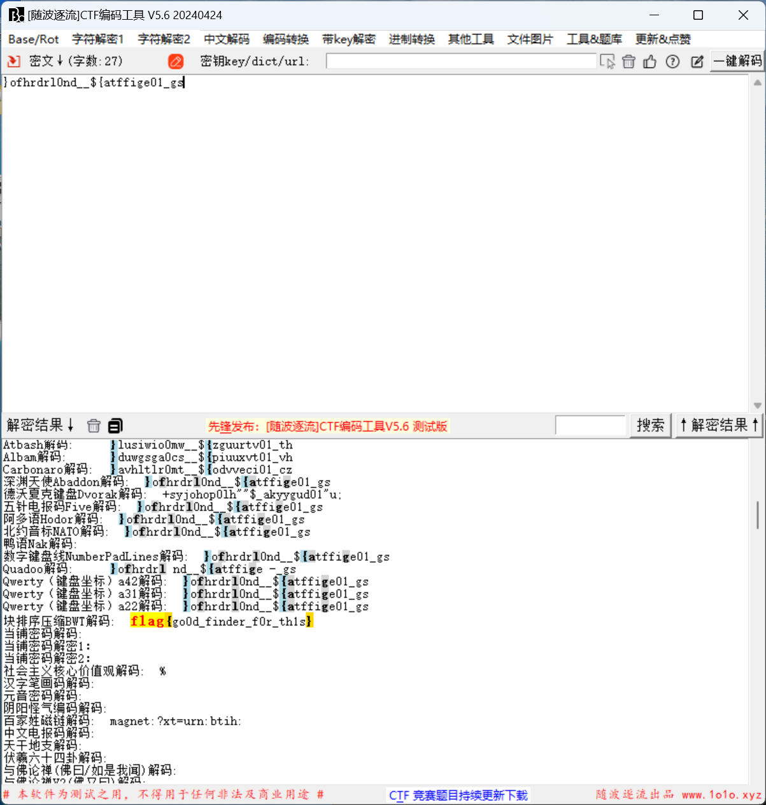

**flag{go0d_finder_f0r_th1s}**


---

> Author: [Lunatic](https://goodlunatic.github.io)  
> URL: https://goodlunatic.github.io/posts/a907e2b/  

