# 2024 VCTF Misc Writeup

**发现自己有段时间没有打比赛了，手有点生疏，于是打了 2024VCTF 来找找感觉**

<!--more-->

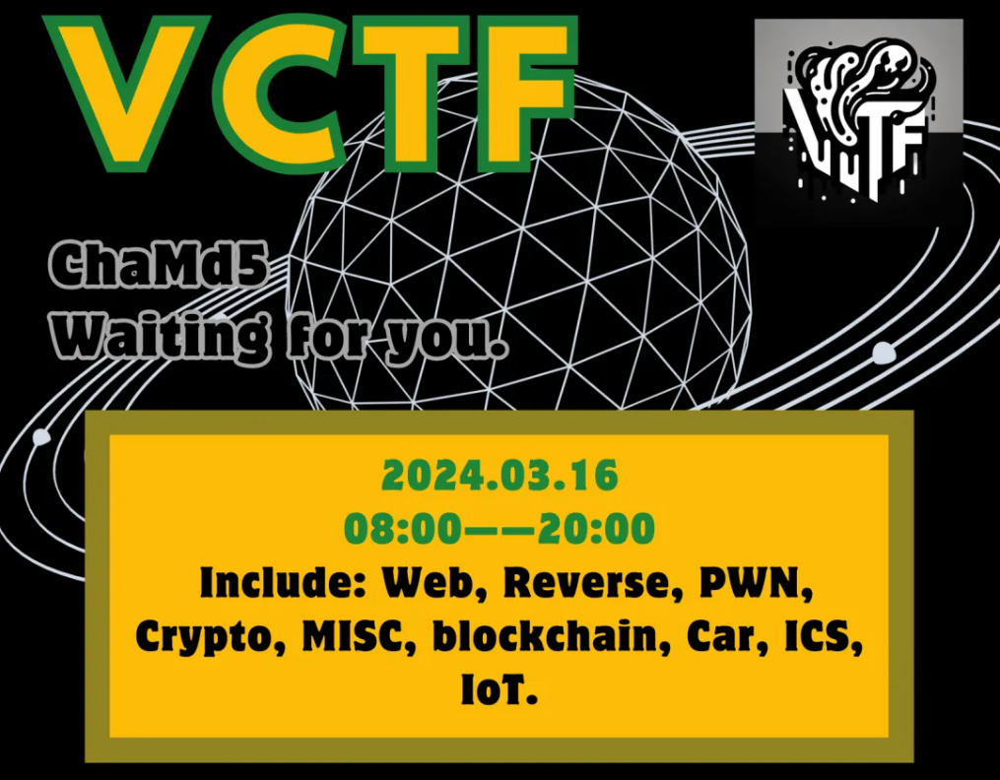

## 题目名称 checkin

**不愧是ChaMd5（查MD5获得flag）**
**flag{We1c0m3_VCTF_2024}**

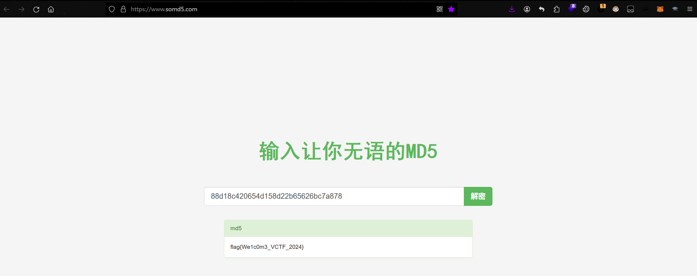

## 题目名称 f0rensicmaster

**下载得到一个 e01磁盘镜像文件，bitlocker加密了，尝试找密钥**
**用FTK打开part0，可以看到有一个hint.zip，里面有logo.png和key.txt**
**这里需要直接把root整个文件夹都导出，要不然图片会无法正常显示**

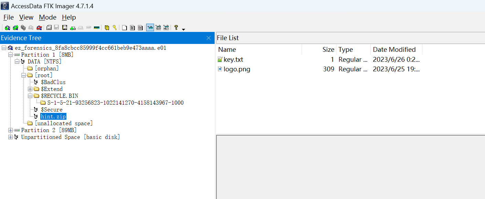

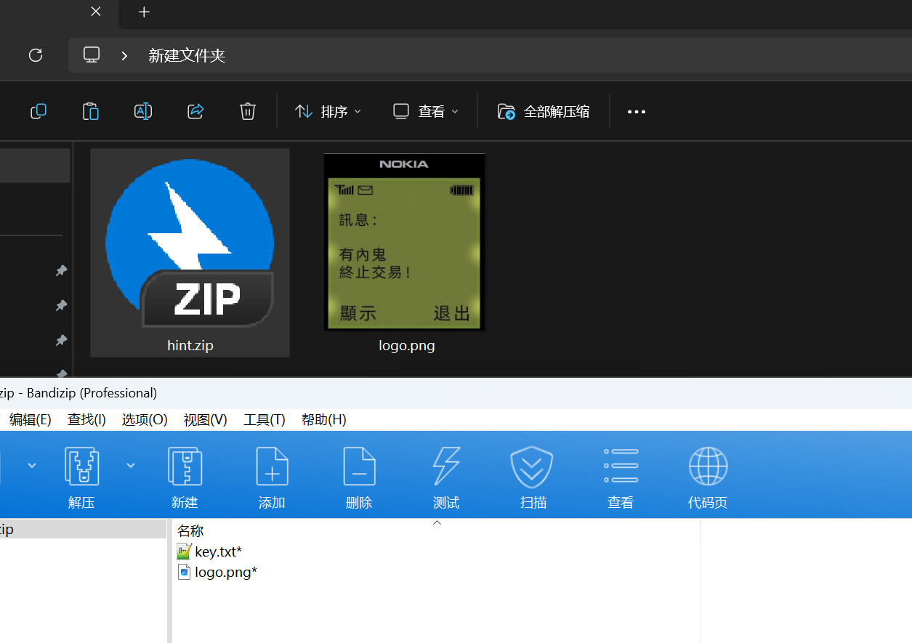

**压缩包也有一个logo.png猜测是需要明文攻击了**

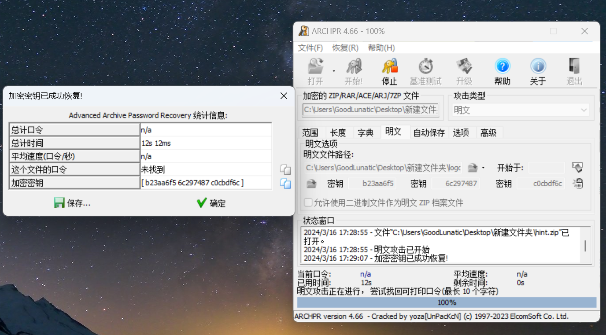

**成功获得加密密钥，解压压缩包即可得到bitlocker的恢复密钥**
**428560-250679-278762-263923-677336-652740-614834-399795**

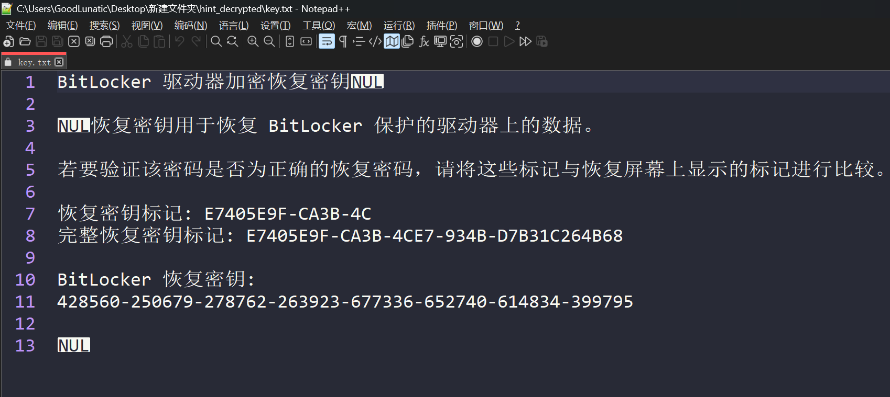

**用 Passware kit 填上得到的密钥恢复即可得到一个后缀为 DD 的文件**

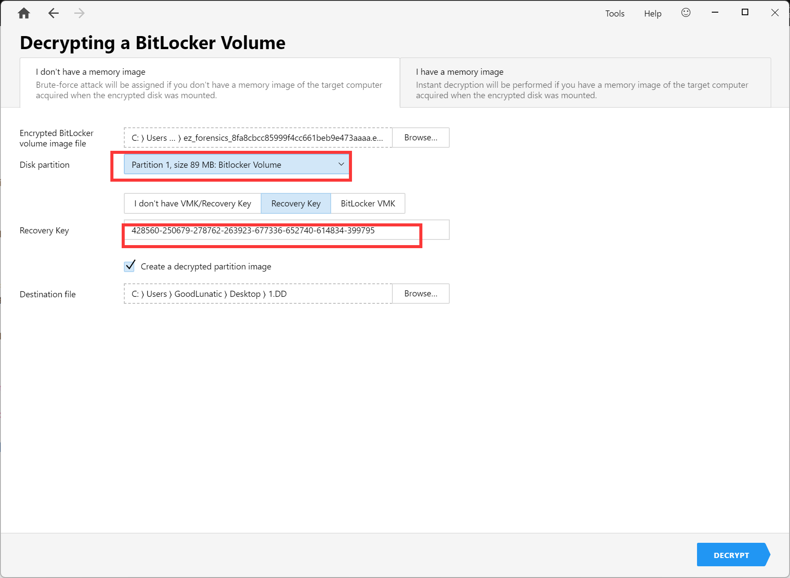

**用FTK打开后缀为 DD 的磁盘镜像文件**
**成功加载，然后发现用户ccpc桌面上有一个钓鱼木马的文件夹，尝试直接导出发现里面没东西**

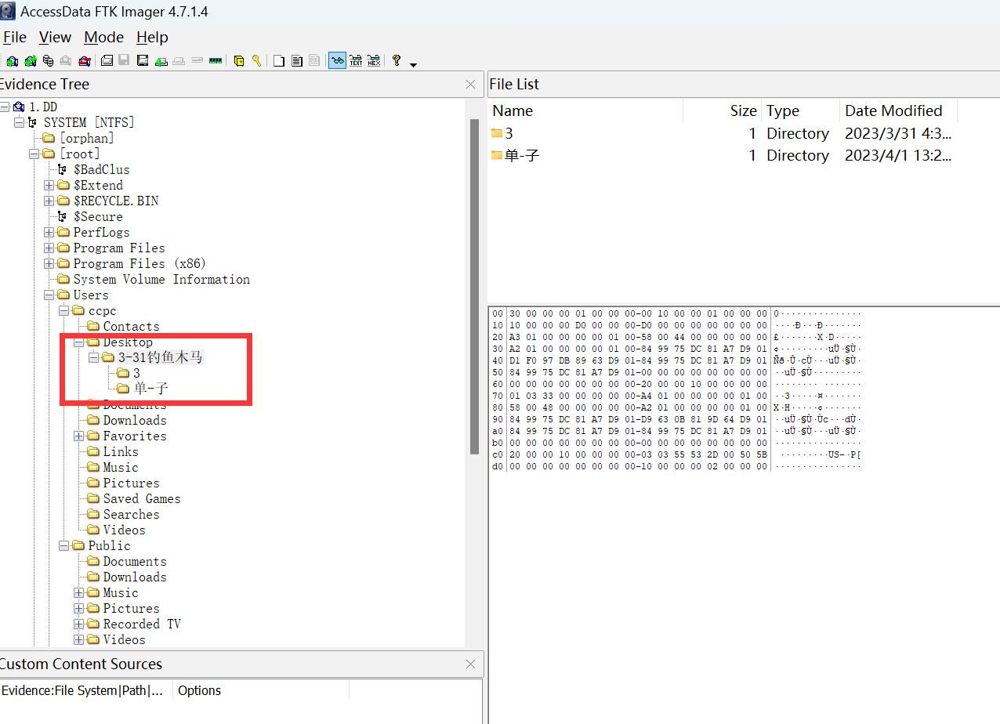

**尝试用FTK直接挂载到本地**

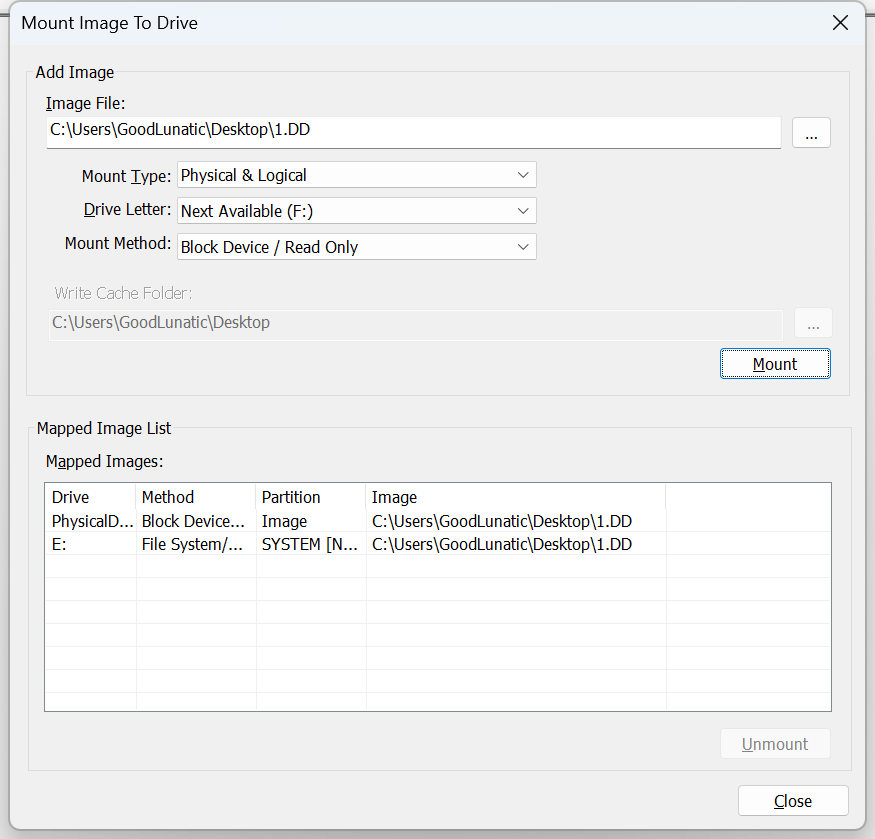

**发现根目录下有一个flag.txt**

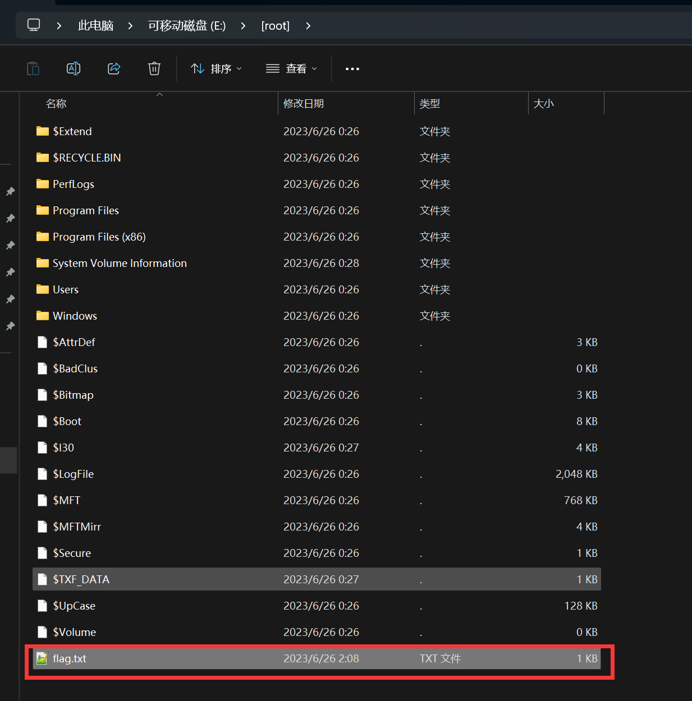

**打开，用CyberChef识别发现是摩斯电码，找在线网站解密可以得到一个奶牛快传的链接**

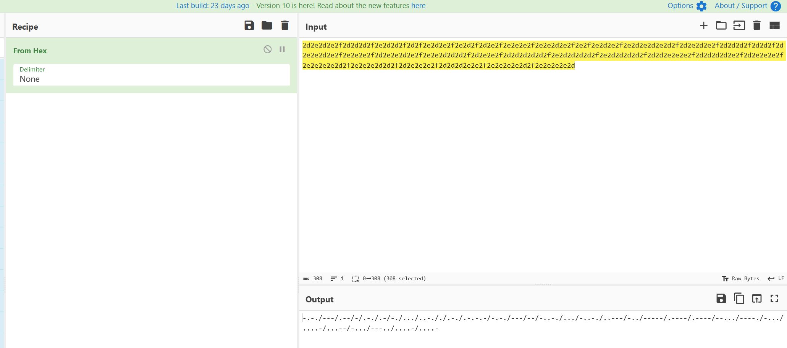

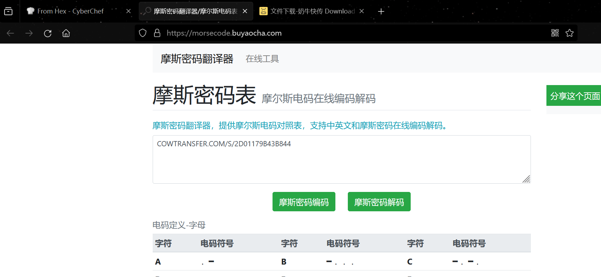

**访问链接，发现奶牛快传里也是一个flag.txt，打开发现是乱码的**


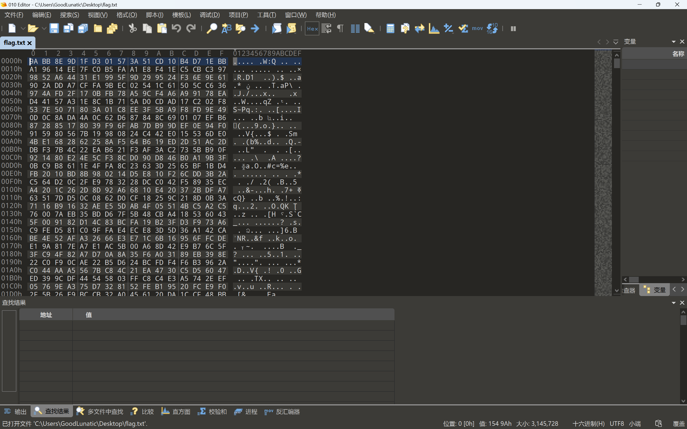

**用VeraCrypt解密并挂载flag.txt，密钥是平台给的Hint：RtTNZ&n*$GKaKuehKO3+**

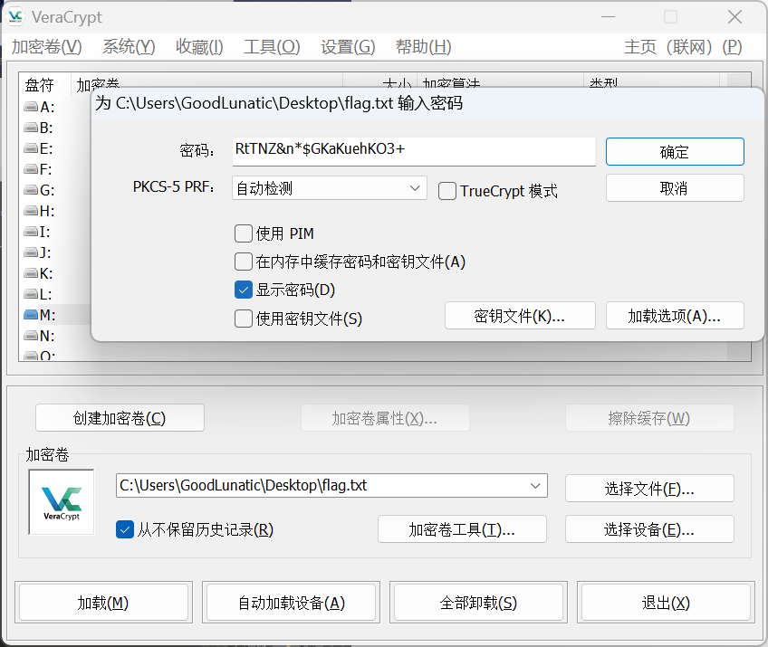

**挂载好后得到一个无间道.docx，改后缀为zip打开，得到四张图片**


**image2和opposite末尾有逆置的压缩包数据，尝试还原并提取出来**

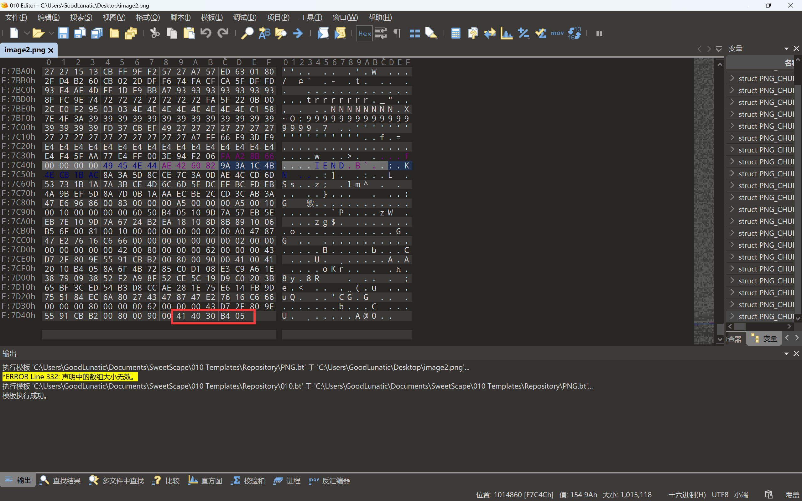

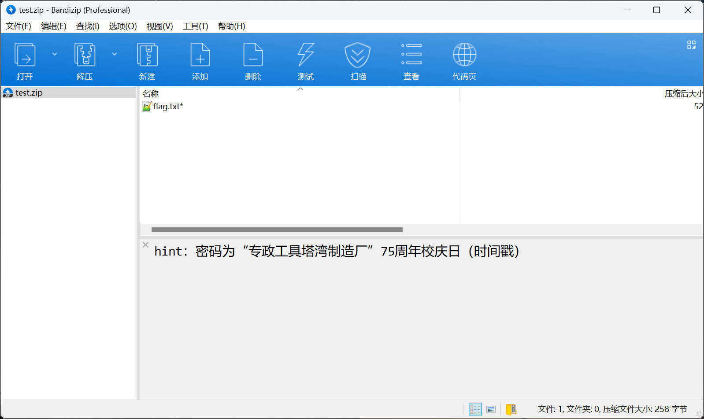

**不会真有人去查校庆日吧，懒惰的人都是直接开爆的**

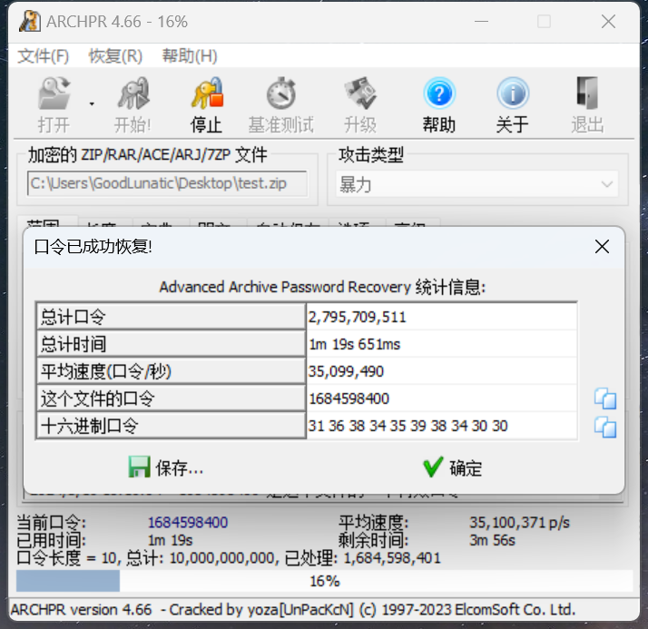

**解压最后一个压缩包即可得到flag：flag{ba93d8e998e5522c7d800f94125907dc}**

## 题目名称 ezmisc｜ TODO

**很早之前看到过这种，但是没有自己亲自动手实现过**

**参考链接：https://github.com/ggerganov/kbd-audio**

## 题目名称 狂飙

题目附件如下

```python
import os
from flag import flag
from Crypto.Util.number import *
from Crypto.Cipher import AES

m = 88007513702424243702066490849596817304827839547007641526433597788800212065249
key = os.urandom(24)
key = bytes_to_long(key)
n = m % key
flag += (16 - len(flag) % 16) * b'\x00'
iv = os.urandom(16)
aes = AES.new(key, AES.MODE_CBC, iv)
enc_flag = aes.encrypt(flag)

print(n)
print(enc_flag)
print(iv)
# 103560843006078708944833658339172896192389513625588
# b'\xfc\x87\xcb\x8e\x9d\x1a\x17\x86\xd9~\x16)\xbfU\x98D\xfe\x8f\xde\x9c\xb0\xd1\x9e\xe7\xa7\xefiY\x95C\x14\x13C@j1\x9d\x08\xd9\xe7W>F2\x96cm\xeb'
# b'UN\x1d\xe2r<\x1db\x00\xdb\x9a\x84\x1e\x82\xf0\x86'
```

因为key是随机生成的24字节 byte 类型的字符串，n倍的key 等于 m-n，因此我们可以分解 m-n ，然后根据因数和 key 的长度来爆破 key


```python
from Crypto.Util.number import *
from Crypto.Cipher import AES
import itertools
from math import *

m = 88007513702424243702066490849596817304827839547007641526433597788800212065249
n = 103560843006078708944833658339172896192389513625588
# print(m-n)
c = b'\xfc\x87\xcb\x8e\x9d\x1a\x17\x86\xd9~\x16)\xbfU\x98D\xfe\x8f\xde\x9c\xb0\xd1\x9e\xe7\xa7\xefiY\x95C\x14\x13C@j1\x9d\x08\xd9\xe7W>F2\x96cm\xeb'
iv = b'UN\x1d\xe2r<\x1db\x00\xdb\x9a\x84\x1e\x82\xf0\x86'

fac = [3, 37, 439, 3939851, 265898280367, 5036645362649,
       342291058100503482469327892079792475478873]

for f in itertools.product(fac, repeat=4):
    # 从列表中抽4个元素的所有情况
    # print(f)
    key = prod(f)
    # 计算可迭代对象中所有元素的乘积
    if 188 <= key.bit_length() <= 192:
        # [23.5*8,24*8]
        aes = AES.new(long_to_bytes(key), AES.MODE_CBC, iv)
        flag = aes.decrypt(c)
        if b'flag' in flag:
            print(flag)
# flag{cf735a4d-f9d9-5110-8a73-5017fc39b1b0}
```


---

> 作者: [Lunatic](https://goodlunatic.github.io)  
> URL: https://goodlunatic.github.io/posts/aa61ddd/  

