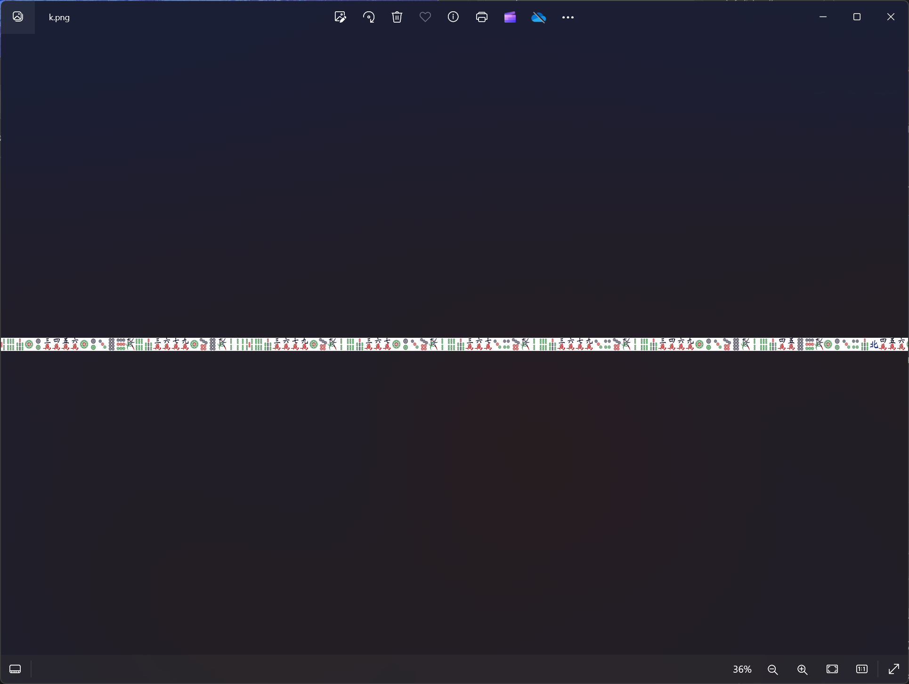
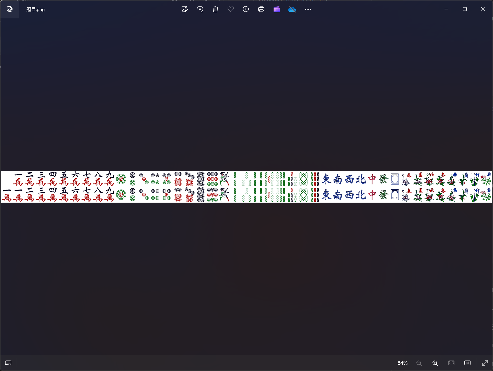
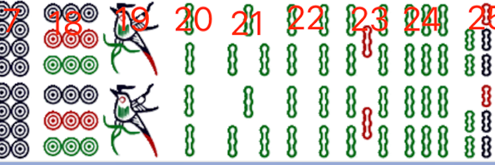
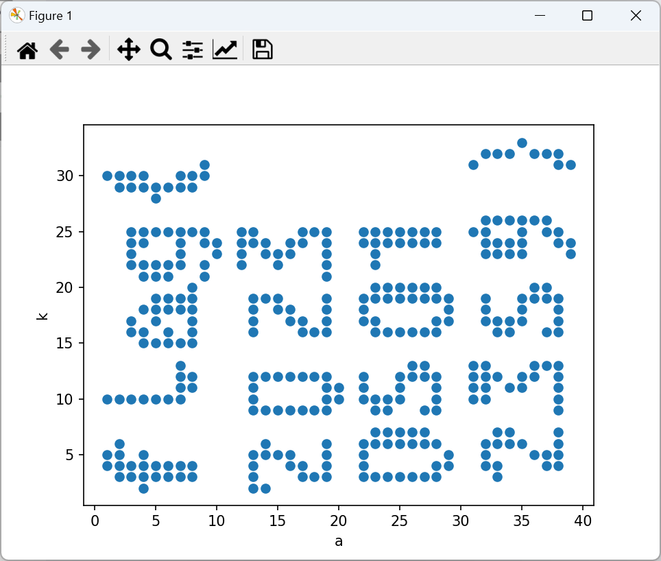

# 2023 CISCN初赛 Misc 国粹 赛题详解

**这是一个搁置了很久的坑，想当初被折磨了好久，这题还是需要一点点脑洞的。**

<!--more-->

题目的附件很简单，一共就给了三张png图片：a.png、k.png、题目.png






发现a.png和k.png的图片尺寸大小是一样的，所以猜测可能是一一对应的关系

发现一一对应的关系后可能就比较容易想到是坐标

然后题目.png中应该就是每个麻将所对应的具体值，按照下图这样给每个麻将编号



然后把a和k中麻将的值作为横纵坐标的值，用以下脚本画图即可得到flag

```python
import matplotlib.pyplot as plt
x = [1, 1, 1, 1, 2, 2, 2, 2, 2, 2, 2, 3, 3, 3, 3, 3, 3, 3, 3, 3, 3, 3, 4, 4, 4,
4, 4, 4, 4, 4, 4, 4, 4, 4, 4, 4, 5, 5, 5, 5, 5, 5, 5, 5, 5, 5, 5, 5, 6, 6, 6, 6, 6,
6, 6, 6, 6, 6, 6, 7, 7, 7, 7, 7, 7, 7, 7, 7, 7, 7, 7, 7, 7, 7, 8, 8, 8, 8, 8, 8, 8,
8, 8, 8, 8, 8, 8, 9, 9, 9, 9, 9, 9, 10, 10, 12, 12, 12, 12, 13, 13, 13, 13, 13, 13,
13, 13, 13, 13, 13, 13, 13, 13, 14, 14, 14, 14, 14, 14, 14, 14, 15, 15, 15, 15, 15,
15, 15, 16, 16, 16, 16, 16, 16, 16, 16, 17, 17, 17, 17, 17, 17, 17, 17, 18, 18, 18,
18, 18, 19, 19, 19, 19, 19, 19, 19, 19, 19, 19, 19, 19, 19, 19, 19, 19, 19, 20, 20,
22, 22, 22, 22, 22, 22, 22, 22, 22, 22, 22, 22, 23, 23, 23, 23, 23, 23, 23, 23, 23,
23, 23, 23, 23, 24, 24, 24, 24, 24, 24, 24, 24, 24, 24, 25, 25, 25, 25, 25, 25, 25,
25, 25, 25, 25, 26, 26, 26, 26, 26, 26, 26, 26, 26, 26, 27, 27, 27, 27, 27, 27, 27,
27, 27, 27, 27, 28, 28, 28, 28, 28, 28, 28, 28, 28, 28, 28, 28, 28, 29, 29, 29, 29,
29, 31, 31, 31, 31, 31, 31, 32, 32, 32, 32, 32, 32, 32, 32, 32, 32, 32, 32, 32, 32,
32, 33, 33, 33, 33, 33, 33, 33, 33, 33, 33, 33, 34, 34, 34, 34, 34, 34, 34, 34, 34,
35, 35, 35, 35, 35, 35, 35, 35, 35, 35, 35, 36, 36, 36, 36, 36, 36, 36, 37, 37, 37,
37, 37, 37, 37, 37, 37, 38, 38, 38, 38, 38, 38, 38, 38, 38, 38, 38, 38, 38, 38, 38,
38, 38, 39, 39, 39]
y = [4, 5, 10, 30, 3, 4, 5, 6, 10, 29, 30, 3, 4, 10, 16, 17, 22, 23, 24, 25,
29, 30, 2, 3, 4, 5, 10, 15, 16, 18, 21, 22, 24, 25, 29, 30, 3, 4, 10, 15, 17, 18,
19, 21, 22, 25, 28, 29, 3, 4, 10, 15, 16, 18, 19, 21, 22, 25, 29, 3, 4, 10, 11, 12,
13, 15, 18, 19, 22, 23, 24, 25, 29, 30, 3, 4, 11, 12, 15, 16, 17, 18, 19, 20, 25,
29, 30, 21, 22, 24, 25, 30, 31, 23, 24, 22, 23, 24, 25, 2, 3, 4, 5, 9, 10, 11, 12,
16, 17, 18, 19, 24, 25, 2, 5, 6, 9, 12, 19, 23, 24, 5, 9, 12, 18, 19, 22, 23, 4, 5,
9, 12, 17, 18, 23, 24, 3, 4, 9, 12, 16, 17, 24, 25, 3, 9, 12, 16, 25, 3, 4, 5, 6, 9,
10, 11, 12, 16, 17, 18, 19, 21, 22, 23, 24, 25, 10, 11, 3, 4, 5, 6, 10, 11, 12, 17,
18, 19, 24, 25, 3, 6, 7, 9, 10, 16, 17, 19, 20, 22, 23, 24, 25, 3, 6, 7, 9, 10, 16,
19, 20, 24, 25, 3, 6, 7, 10, 11, 12, 16, 19, 20, 24, 25, 3, 6, 7, 12, 13, 16, 19,
20, 24, 25, 3, 6, 7, 9, 12, 13, 16, 19, 20, 24, 25, 3, 4, 6, 9, 10, 11, 12, 16, 17,
19, 20, 24, 25, 4, 5, 17, 18, 19, 10, 11, 12, 13, 25, 31, 4, 5, 6, 10, 11, 12, 13,
17, 18, 19, 23, 24, 25, 26, 32, 3, 4, 6, 7, 12, 16, 17, 23, 24, 26, 32, 6, 7, 11,
16, 17, 23, 24, 26, 32, 6, 11, 12, 17, 18, 19, 23, 24, 25, 26, 33, 5, 12, 13, 19,
20, 26, 32, 4, 5, 13, 16, 19, 20, 25, 26, 32, 4, 5, 6, 7, 9, 10, 11, 12, 13, 16, 17,
18, 19, 24, 25, 31, 32, 23, 24, 31]
# print(len(x),len(y)) # 341:341 一一对应，故猜测可能是坐标
plt.scatter(x, y)
plt.xlabel('a')
plt.ylabel('k')
plt.show()
```




---

> Author: [Lunatic](https://goodlunatic.github.io)  
> URL: https://goodlunatic.github.io/posts/ade0159/  

