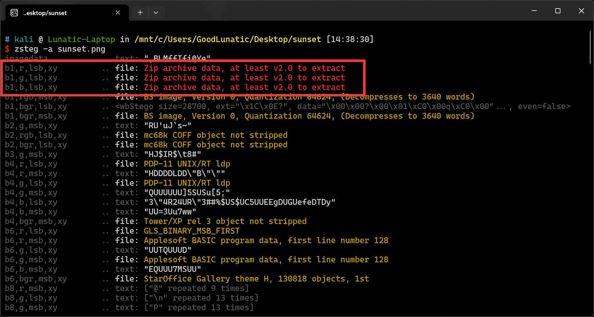
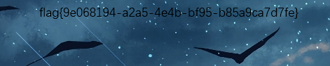

# Misc-LSB 小记

前几天在 PuzzleSolver 群里看到了这样一道题目，题目主要考察了 LSB 隐写

从这道题中发现自己的基础并不扎实，于是打算以这道题为契机，好好学习一下LSB隐写
&lt;!--more--&gt;
### 例题1-sunset

题目附件给了下面这张图片


上手用 zsteg 扫一下，发现 RGB 三个通道中都藏了一个压缩包



因此我们用以下命令分别导出三个压缩包

```shell
zsteg -e b1,r,lsb,xy sunset.png &gt; 1.zip
zsteg -e b1,g,lsb,xy sunset.png &gt; 2.zip
zsteg -e b1,b,lsb,xy sunset.png &gt; 3.zip
```

解压后分别得到 r.txt g.txt b.txt ，因此猜测是分别导出了三个通道的 hexdump

我们使用以下脚本把三个通道的数据组合一下

```python
def read_channel_data(file_path):
    with open(file_path, &#39;r&#39;) as file:
        channel_data = file.readlines()

    formatted_data = []
    for line in channel_data:
        data = line.split()
        formatted_data.append(data[0] &#43; data[1])

    return &#39;&#39;.join(formatted_data)


def combine_channels_to_bytes(r_data, g_data, b_data):
    binary_data = &#39;&#39;
    for r, g, b in zip(r_data, g_data, b_data):
        r_binary = bin(int(r, 16))[2:].zfill(4)
        g_binary = bin(int(g, 16))[2:].zfill(4)
        b_binary = bin(int(b, 16))[2:].zfill(4)
        # 逐位读取RGB合并后的二进制数据
        binary_data &#43;= &#39;&#39;.join(a &#43; b &#43; c for a, b,
                               c in zip(r_binary, g_binary, b_binary))

    byte_data = bytes([int(binary_data[i:i&#43;8], 2)
                      for i in range(0, len(binary_data), 8)])
    return byte_data


def main():
    # 读取并格式化 R、G、B 通道数据
    r_data = read_channel_data(&#39;r.txt&#39;)
    g_data = read_channel_data(&#39;g.txt&#39;)
    b_data = read_channel_data(&#39;b.txt&#39;)

    # 合并通道数据成字节数据
    byte_data = combine_channels_to_bytes(r_data, g_data, b_data)

    # 将字节数据写入文件
    with open(&#39;1.zip&#39;, &#39;wb&#39;) as f_out:
        f_out.write(byte_data)
    print(&#39;Done&#39;)


if __name__ == &#34;__main__&#34;:
    main()

```

组合后可以得到一个 zip 压缩包，解压后即可得到 flag




---

> Author: [Lunatic](https://goodlunatic.github.io)  
> URL: https://goodlunatic.github.io/posts/aded309/  

