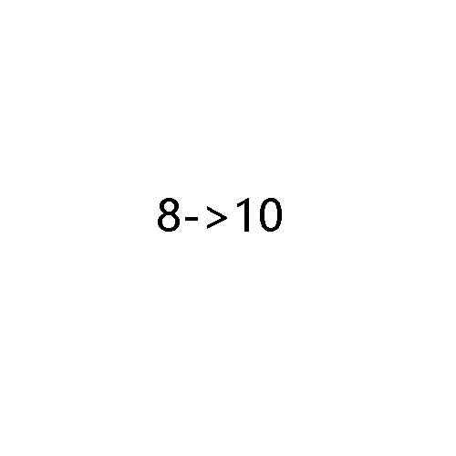
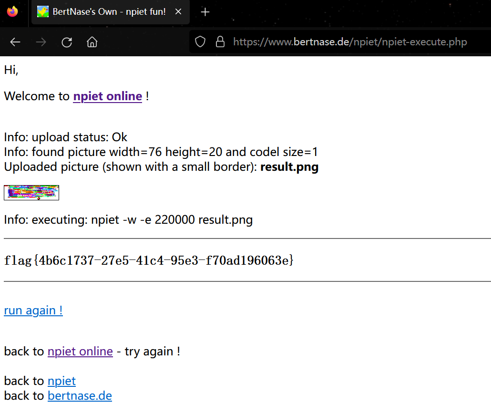

# 2023 香山杯网络安全大赛 Misc Writeup

**香山杯的Misc除了签到爆零了，因此打算复盘一下。**
<!--more-->
## 题目名称 pintu
打开压缩包，得到4703张黑白的png文件，还有一个tip图片，tip图片如下：



看了一会这个tip，非常确定题目肯定要考查八进制

然后这里被这个题目名字给误导了，比赛的时候一直以为是图片拼接类型的题目(不知道是不是出题人故意的)

之后读取图片的宽高，发现每张图片的宽都是65px，但是高度是有不一样的，于是用以下脚本提取每张图片的高

然后经过尝试发现，应该要把每张图片的高进行八进制转十进制，然后转为Ascii码输出

输出后发现出题人很贴心，连空格都给你精心准备好了，于是以空格为分隔，再次转Ascii码

之后得到一串base32编码后的密文，解码后得到一串base64编码后的密文，直接解码会出错，猜测是换表了

```python
def get_image_dimensions(image_path):
    with Image.open(image_path) as img:
        return img.width, img.height
def height_Steg():
    heights = []
    current_directory = os.getcwd()
    for i in range(1, 4704):
        image_name = f"{i}.png"
        image_path = os.path.join(current_directory, image_name)
        if os.path.exists(image_path):
            width, height = get_image_dimensions(image_path)
            heights.append(height)
            # print(f"{image_name}: Width = {width}, Height = {height}")
        else:
            print(f"{image_name} does not exist.")
    res = ''
    data = ''
    for item in heights:
        decimal_heights = int(str(item),8)
        res+=chr(decimal_heights)
    #print(res)
    res = res.split(' ')
    for item in res:
        data +=chr(int(item))
    #print(data)
    data = base64.b32decode(data)
    print(data)
```

于是再回去查看图片，将白色图片转为1，黑色图片转为0，并在前面补零对齐八位，然后再转为字符串

```python
def translate_pixel():
    res = ''
    output = []
    current_directory = os.getcwd()
    for i in range(1, 4704):
        image_name = f"{i}.png"
        image_path = os.path.join(current_directory, image_name)
        if os.path.exists(image_path):
            pixel_data = get_Image_Pixel(image_path)
            if pixel_data == 255:
                res += '1'
            else:
                res += '0'
    if len(res) % 8!=0:
        # 这里一定要注意是在前面补零还是在后面补零，一般都是在前面补零对齐
        # res+='0'*(8-len(res)%8)
        res = '0'*(8-len(res)%8) + res
    for i in range(0,len(res),8):
        binary_segment = res[i:i+8]
        int_value = int(binary_segment,2)
        char_value = chr(int_value)
        output += [char_value]
    # print(output)
    print(''.join([str(x) for x in output]))
```

转换后得到以下内容，很明显里面藏了一个base64的表

```shell
flagçå°666cæ¯ä¸æ¯ç¹å«å´å¥ï¼å¾å¯æflag并ä¸å¨è¿ãï¼ç头ä¿å½ï¼ï¼æ¢ç¶èµ°å°äºè¿éï¼é£æä¹ç»ä¸ä¸ªéå³çå³é®ä¿¡æ¯æ¿å»å§ï¼å»æ¾å°çæ­£çflagå§ï¼sUvcu5rgSeAmJQCfdXtEMKIB91Lj3niOo4hyV0b/2azpx8HqZP6wk7GNlTFYDR+W                                 åï¼å¯¹äºãæ¿èµ°ä¹åçä¸çæç²¾å¿æéçç¬è¯å§ï¼ç人æçï¼æçç¸å¼æªï¼âç °âå°ä¸å£°æªåä¹åç人死äºãçç¸åçè°ï¼å·ç¬ä¸å£°ï¼
â没æ³å°å§ï¼ææ¯åå°å¼§ãâ好ä¸å¥½ç¬ï¼ æ没ææè§ä¸åå¦ï¼å¤§èæ´æ¸æ°äºãà¸Õâ¢ï»â¢Õ à¸
```

用里面的base64的表去解码之前得到的base64编码的字符串，将得到的base64解码为图片后得到以下图片，一眼npiet


最后直接用 [npiet](https://www.bertnase.de/npiet/npiet-execute.php) 在线网站解密即可得到flag：flag{4b6c1737-27e5-41c4-95e3-f70ad196063e}



完整解题脚本如下
```python
from PIL import Image
import base64
import os

def get_image_dimensions(image_path):
    with Image.open(image_path) as img:
        return img.width, img.height

def get_Image_Pixel(image_path):
    with Image.open(image_path) as img:
        pixel_data = img.getpixel((0,0))[0]
        return pixel_data
    
def height_Steg():
    heights = []
    current_directory = os.getcwd()
    for i in range(1, 4704):
        image_name = f"{i}.png"
        image_path = os.path.join(current_directory, image_name)
        if os.path.exists(image_path):
            width, height = get_image_dimensions(image_path)
            heights.append(height)
            # print(f"{image_name}: Width = {width}, Height = {height}")
        else:
            print(f"{image_name} does not exist.")
    res = ''
    data = ''
    for item in heights:
        decimal_heights = int(str(item),8)
        res+=chr(decimal_heights)
    # print(res)
    res = res.split(' ')
    for item in res:
        data +=chr(int(item))
    # print(data)
    data = base64.b32decode(data)
    print(data)
    
def translate_pixel():
    res = ''
    output = []
    current_directory = os.getcwd()
    for i in range(1, 4704):
        image_name = f"{i}.png"
        image_path = os.path.join(current_directory, image_name)
        if os.path.exists(image_path):
            pixel_data = get_Image_Pixel(image_path)
            if pixel_data == 255:
                res += '1'
            else:
                res += '0'
    if len(res) % 8!=0:
        # 这里一定要注意是在前面补零还是在后面补零，一般都是在前面补零对齐
        # res+='0'*(8-len(res)%8)
        res = '0'*(8-len(res)%8) + res
    for i in range(0,len(res),8):
        binary_segment = res[i:i+8]
        int_value = int(binary_segment,2)
        char_value = chr(int_value)
        output += [char_value]
    # print(output)
    print(''.join([str(x) for x in output]))
    
if __name__ == "__main__":
    height_Steg()
    print('='*70)
    translate_pixel()
```

## 题目名称 AI
TODO...


---

> Author: [Lunatic](https://goodlunatic.github.io)  
> URL: https://goodlunatic.github.io/posts/b36b466/  

