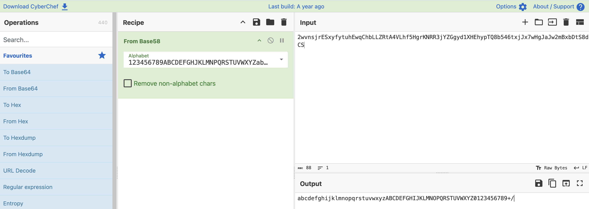
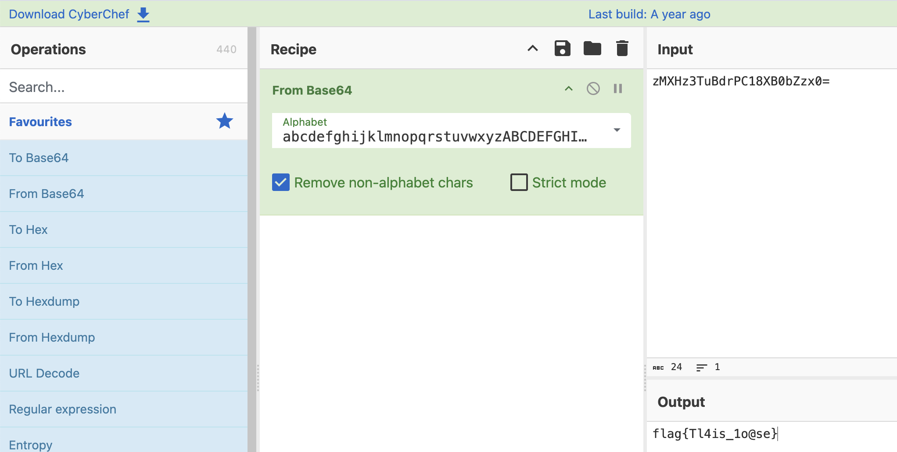
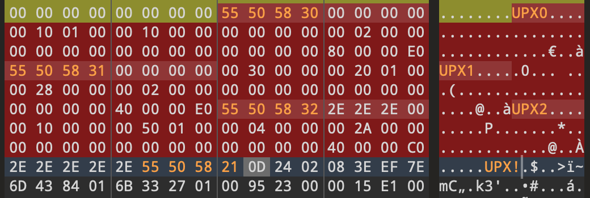
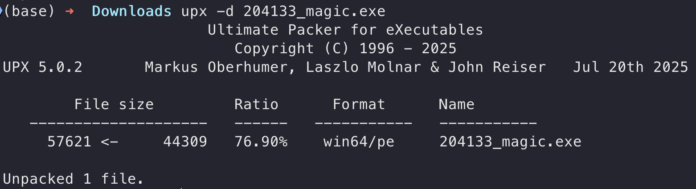

# CTF-Reverse刷题记录

**科研和项目中经常要用到逆向相关的知识，于是准备猛猛刷题，猛猛学逆向**
<!--more-->

## 2025 ?CTF

### 8086ASM

题目附件如下， 我在关键部分加了点注释

```asm
.MODEL SMALL
.STACK 100H
.DATA
    WELCOME_MSG db 'Welcome to 8086ASM.', 0DH, 0AH, '$'
    INPUT_MSG db 'Input your flag:', '$'

    WRONG_MSG db 0DH, 0AH, 'Wrong.', 0DH, 0AH, '$'
    CORRECT_MSG db 0DH, 0AH, 'Correct.', 0DH, 0AH, '$' 

    DATA1 DB 0BBH, 01BH, 083H, 08CH, 036H, 019H, 0CCH, 097H
            DB 08DH, 0E4H, 097H, 0CCH, 00CH, 048H, 0E4H, 01BH
            DB 00EH, 0D7H, 05BH, 065H, 01BH, 050H, 096H, 006H
            DB 03FH, 019H, 00CH, 04FH, 04EH, 0F9H, 01BH, 0D7H
            DB 0CH, 01DH, 0A0H, 0C6H

    DATA2 DW 01122H, 03344H, 01717H, 09090H, 0BBCCH 

    INPUT_BUFFER db 37 dup(0)
    BUFFER db 37 dup(0)
.CODE

START:
    MOV AX, @DATA
    MOV DS, AX
    MOV AH, 09H
    MOV DX, OFFSET WELCOME_MSG     ; 输出WELCOME_MSG
    INT 21H
    MOV DX, OFFSET INPUT_MSG       ; 输出INPUT_MSG
    INT 21H
    MOV AH,0AH
    MOV DX, OFFSET INPUT_BUFFER
    MOV BYTE PTR[INPUT_BUFFER], 37 ; 输入Flag
    INT 21H
    CALL ENCRYPT                   ; 调用Encrypt函数
    MOV DI, OFFSET DATA1
    MOV SI, OFFSET INPUT_BUFFER + 2
    MOV CX, 35
LOOP1:
    MOV AX, [DI]
    CMP AX, [SI]                   ; 对比密文
    JNE WRONG_EXIT
    INC DI
    INC SI
    LOOP LOOP1
    JMP CORRECT_EXIT
WRONG_EXIT:
    MOV AH,09H
    LEA DX,WRONG_MSG               ; 输出WRONG_MSG
    INT 21H
    JMP EXIT
CORRECT_EXIT:
    MOV AH,09H
    LEA DX,CORRECT_MSG             ; 输出CORRECT_MSG 
    INT 21H
    JMP EXIT
EXIT:
    MOV AX, 4C00H
    INT 21H
ENCRYPT PROC                       ; Encrypt函数
    PUSH AX
    PUSH BX
    PUSH CX
    MOV SI, OFFSET INPUT_BUFFER + 2
    MOV BX, OFFSET DATA2           ; DATA2数据
    MOV CX, 35                     ; 共循环35次
LOOP2:
    PUSH CX
    MOV CL, 2
    MOV AL, [SI]
    ROR AL, CL                     ; Flag[i]循环右移2
    POP CX
    MOV [SI], AL
    MOV AX, WORD PTR[SI]
    XOR AX, WORD PTR[BX]           ; (Word*)(Flag + i) ^= DATA2[i % 5]
    MOV WORD PTR[SI], AX
    INC SI
    ADD BX, 2
    CMP BX, OFFSET DATA2 + 10
    JNE CASE1
    MOV BX, OFFSET DATA2 
CASE1:
    LOOP LOOP2
    POP CX
    POP BX
    POP AX
    RET
ENCRYPT ENDP 

END START
```


汇编代码加密的大致逻辑如下

```c
Flag[35];
Data2[5] ={0x1122, 0x3344, 0x1717, 0x9090, 0xbbcc}; 
for (int i = 0; i < 35; i++) {
    Flag[i] = ror(Flag[i], 2);
    *(WORD*)(Flag+i) ^= Data2[i % 5];
}
```

对应的解密脚本如下：

C++版本

```c++
#include <iostream>

uint8_t rol(uint8_t val, uint8_t n)
{
    return (val << n) | (val >> (8 - n));
}

int main()
{
    uint16_t Key[] = {0x1122, 0x3344, 0x1717, 0x9090, 0xBBCC};
    uint8_t EncFlag[] = {
        0xBB, 0x1B, 0x83, 0x8C, 0x36, 0x19, 0xCC, 0x97,
        0x8D, 0xE4, 0x97, 0xCC, 0x0C, 0x48, 0xE4, 0x1B,
        0x0E, 0xD7, 0x5B, 0x65, 0x1B, 0x50, 0x96, 0x06,
        0x3F, 0x19, 0x0C, 0x4F, 0x4E, 0xF9, 0x1B, 0xD7,
        0x0C, 0x1D, 0xA0, 0xC6};

    for (int i = 34; i >= 0; i--)
    {
        uint16_t tmp = (EncFlag[i + 1] << 8 | EncFlag[i]);
        tmp ^= Key[i % 5];
        EncFlag[i] = tmp & 0xFF;
        EncFlag[i + 1] = (tmp >> 8) & 0xFF;
        EncFlag[i] = rol(EncFlag[i], 2);
    }
    printf("%.36s\n", EncFlag); // 只输出前36字节
    return 0;
}
// flag{W31c0m3_t0_8086_A5M_W0RlD___!!}
```

Python版本

```python
def rol(val, n):
    return ((val << n) & 0xFF) | (val >> (8 - n))

def main():
    key = [0x1122, 0x3344, 0x1717, 0x9090, 0xBBCC]
    enc_flag = [
        0xBB, 0x1B, 0x83, 0x8C, 0x36, 0x19, 0xCC, 0x97,
        0x8D, 0xE4, 0x97, 0xCC, 0x0C, 0x48, 0xE4, 0x1B,
        0x0E, 0xD7, 0x5B, 0x65, 0x1B, 0x50, 0x96, 0x06,
        0x3F, 0x19, 0x0C, 0x4F, 0x4E, 0xF9, 0x1B, 0xD7,
        0x0C, 0x1D, 0xA0, 0xC6
    ]
    enc_flag = bytearray(enc_flag)

    for i in range(34, -1, -1):
        val = (enc_flag[i + 1] << 8) | enc_flag[i]
        val ^= key[i % 5]
        enc_flag[i]     = val & 0xFF
        enc_flag[i + 1] = (val >> 8) & 0xFF
        enc_flag[i] = rol(enc_flag[i], 2)

    print(enc_flag)
    # bytearray(b'flag{W31c0m3_t0_8086_A5M_W0RlD___!!}')

if __name__ == "__main__":
    main()
```


### jvav

附件给了个apk，jadx打开发现是kotlin写的代码

定位到关键的check代码

```java
public final class EncKt {
    public static final byte[] encoder(String input) {
        Intrinsics.checkNotNullParameter(input, "input");
        byte[] bytes = input.getBytes(Charsets.UTF_8);
        Intrinsics.checkNotNullExpressionValue(bytes, "getBytes(...)");
        byte[] encode = Base64.getEncoder().encode(bytes);
        Intrinsics.checkNotNullExpressionValue(encode, "encode(...)");
        return encode;
    }

    public static final byte[] confuser(byte[] input) {
        Intrinsics.checkNotNullParameter(input, "input");
        int length = input.length;
        for (int i = 0; i < length; i++) {
            input[i] = (byte) (~((input[i] + 32) ^ 11));
        }
        return input;
    }

    public static final byte[] rounder(byte[] input) {
        Intrinsics.checkNotNullParameter(input, "input");
        byte[] bArr = new byte[input.length];
        int length = input.length;
        for (int i = 0; i < length; i++) {
            bArr[i] = input[(i + 5) % input.length];
        }
        return bArr;
    }

    public static final boolean checker(String input) {
        Intrinsics.checkNotNullParameter(input, "input");
        byte[] rounder = rounder(confuser(encoder(input)));
        byte[] bArr = {-89, 96, 102, 118, -89, -122, 103, -103, -125, -95, 114, 117, -116, -102, 114, -115, -125, 108, 110, 118, -91, -83, 101, -115, -116, -114, 124, 114, -123, -87, -87, -114, 121, 108, 124, -114};
        if (rounder.length != 36) {
            return false;
        }
        int length = rounder.length;
        for (int i = 0; i < length; i++) {
            if (rounder[i] != bArr[i]) {
                return false;
            }
        }
        return true;
    }
}
```

整体的加密逻辑就是先base64编码，然后混淆以及循环移位了一下

直接写个脚本逆着回去解密即可

```python
import base64

arr = [
    -89, 96, 102, 118, -89, -122, 103, -103, -125, -95,
    114, 117, -116, -102, 114, -115, -125, 108, 110, 118,
    -91, -83, 101, -115, -116, -114, 124, 114, -123, -87,
    -87, -114, 121, 108, 124, -114
]

ori = arr.copy()
for i in range(len(arr)):
    ori[i] = arr[(i - 5) % len(arr)]

print(ori)
for i in range(len(ori)):
    ori[i] = ((((~ori[i]) & 0xFF) ^ 11) - 32) & 0xFF

base64_str = bytes(ori).decode()
flag = base64.b64decode(base64_str)
print(flag)
# b'flag{kotl1n_is_also_java}'
```

### rand

附件给了个elf，IDA打开，定位到主函数

```c++
__int64 __fastcall main(int a1, char **a2, char **a3)
{
  int cnt; // ebp
  size_t len; // r12
  int idx1; // r13d
  int rand_num; // eax
  char tmp; // si
  __int64 idx2; // rax
  char *s; // rbx

  cnt = 256;
  __isoc99_scanf(&unk_2004, str1, a3);
  len = strlen(str1);
  do
  {
    idx1 = rand() % (int)len;
    rand_num = rand();                          // 依次循环要生成2个随机数
    tmp = str1[idx1];                           // 因此256次循环生成的随机数总数是512
    idx2 = rand_num % (int)len;
    str1[idx1] = str1[idx2];
    str1[idx2] = tmp;
    --cnt;
  }
  while ( cnt );
  s = str1;
  do
    *s++ ^= rand();                             // str1的长度是27，所以这里异或了27次
  while ( s != &str1[(unsigned int)(len - 1) + 1] );
  if ( len == 27 && unk_4010 == *(_OWORD *)str1 && byte_401B == xmmword_406B )
    puts("right !");
  else
    puts("wrong !");
  return 0;
}
```

发现主要逻辑就是，每次随机生成两个下标，交换数组中这两个下标对应的元素，然后重复这个过程256次

交换完成后，再把每个元素异或一个随机数

> 只要rand出现了，要么是随机数的值域很小可以爆破，要么就是用srand限定了随机数的种子

可以在下面这个函数里找到生成随机数的seed

```c++
void sub_10E0()
{
  srand(12345u);
}
```

得到seed后，我们就可以得到整个随机数序列，从而根据这个序列逆向还原出原始数据

```c++
#include <stdio.h>
#include <stdlib.h>
#include <algorithm>

int rands[1000];
unsigned char ida_chars[] =
    {
        0x5A, 0x66, 0x86, 0xCE, 0x46, 0x23, 0x75, 0x30, 0x18, 0x6F,
        0x5B, 0x7D, 0x4D, 0x4F, 0xF7, 0xC4, 0x4A, 0x0D, 0x45, 0xAE,
        0x36, 0xEF, 0x6B, 0x81, 0xC1, 0x82, 0x03};

int main()
{
    srand(12345);
    for (int i = 0; i < 512 + 27; i++)
    {
        rands[i] = rand();
    }
    for (int i = 0; i < 27; i++)
    {
        ida_chars[i] ^= rands[512 + i] & 0xFF; // rand()返回的是一个32位整数
    }
    for (int i = 512 - 1; i >= 0; i -= 2)
    {
        int idx1 = rands[i] % 27;
        int idx2 = rands[i - 1] % 27;
        std::swap(ida_chars[idx1], ida_chars[idx2]);
    }
    printf("%s\n", ida_chars);
    return 0;
}
// flag{there_1s_s0_many_rand}
```


### ezCalculate

IDA打开，定位到加密逻辑

```c++
int __fastcall main(int argc, const char **argv, const char **envp)
{
  size_t v3; // r12
  unsigned __int64 v4; // rdi
  size_t key_len; // rbx
  size_t v6; // r8
  unsigned __int64 v7; // rcx
  size_t v8; // r8
  unsigned __int64 v9; // rcx
  __int64 i; // rax
  char input[248]; // [rsp+20h] [rbp-F8h] BYREF

  _main(argc, argv, envp);
  scanf_constprop_0(&unk_14000C000, input);
  v3 = strlen(input);
  if ( !v3 )
    goto LABEL_17;
  v4 = 0;
  do
  {
    key_len = strlen(key);                      // "wwqessgxsddkaao123wms"
    input[v4] += key[v4 % key_len];             // "wwqessgxsddkaao123wms"
    ++v4;
  }
  while ( v3 != v4 );
  v6 = strlen(input);
  if ( !v6 )
    goto LABEL_17;
  v7 = 0;
  do
  {
    input[v7] ^= key[v7 % key_len];             // "wwqessgxsddkaao123wms"
    ++v7;
  }
  while ( v6 != v7 );
  v8 = strlen(input);
  if ( !v8 )
    goto LABEL_17;
  v9 = 0;
  do
  {
    input[v9] -= key[v9 % key_len];             // "wwqessgxsddkaao123wms"
    ++v9;
  }
  while ( v8 != v9 );
  if ( strlen(input) == 21 )
  {
    for ( i = 0; i != 21; ++i )
    {
      if ( input[i] != answer[i] )
      {
        printf("wrong");
        return 0;
      }
    }
    printf("right");
  }
  else
  {
LABEL_17:
    printf("incorrect length");
  }
  return 0;
}
```

写个脚本逆向还原即可

```python
enc = [0x33,0x1d,0x32,0x44,0x2a,0x54,0x45,0x2c,0x2e,0x74,0x8c,0x4b,0x40,0x42,0x43,0x73,0x71,0x82,0x24,0x35,0x10,0x00,0x00,0x00,0x00,0x00,0x00,0x00,0x00,0x00,0x00,0x00]

key = "wwqessgxsddkaao123wms"

for i in range(len(enc)):
    enc[i] = (enc[i] + ord(key[i % len(key)])) & 0xFF
for i in range(len(enc)):
    enc[i] = (enc[i] ^ ord(key[i % len(key)])) & 0xFF
for i in range(len(enc)):
    enc[i] = (enc[i] - ord(key[i % len(key)])) & 0xFF

print(bytes(enc))

# b'flag{Add_X0r_and_Sub}'
```

### ezCSharp

C#写的一个exe，用dnSpy打开，定位到主函数

```c#
using System;

// Token: 0x02000004 RID: 4
internal class Program
{
	// Token: 0x06000004 RID: 4 RVA: 0x0000206C File Offset: 0x0000026C
	private static void Main()
	{
		Console.WriteLine("Find the program entry point(main)");
		Console.WriteLine("(Press Enter to continue...)");
		Console.ReadLine();
		EncodedFlagAttribute encodedFlagAttribute = (EncodedFlagAttribute)Attribute.GetCustomAttribute(typeof(FlagContainer), typeof(EncodedFlagAttribute));
		string text = Program.DecodeFlag(encodedFlagAttribute.EncodedValue);
		Console.WriteLine("Program execution complete. Press any key to exit...");
		Console.ReadKey();
	}

	// Token: 0x06000005 RID: 5 RVA: 0x000020D4 File Offset: 0x000002D4
	private static string DecodeFlag(string encoded)
	{
		char[] array = encoded.ToCharArray();
		for (int i = 0; i < array.Length; i++)
		{
			char c = array[i];
			char c2 = c;
			if (c2 != '!')
			{
				switch (c2)
				{
				case 'a':
					array[i] = 'z';
					break;
				case 'b':
				case 'c':
				   ...
				case 'y':
				case 'z':
					array[i] -= '\u0001';
					break;
				}
			}
			else
			{
				array[i] = '_';
			}
		}
		return new string(array);
	}

	// Token: 0x04000002 RID: 2
	private static volatile string[] __hints = new string[]
	{
		"Locate the 'FlagContainer' class in the Program Resource Manager",
		"Submit in format: flag{xxxx}"
	};
}

```

大致的逻辑就是b-z所有字符减1，a变成z，其实就是偏移量为-1的凯撒加密

点击`FlagContainer`，可以看到密文

```C#
[EncodedFlag("D1ucj0u!tqjwf!fohjoffsjoh!xj!epspqz!ju!gvo!2025")]
```

写个脚本解密即可

```python
enc = "D1ucj0u!tqjwf!fohjoffsjoh!xj!epspqz!ju!gvo!2025"

def caesar_decrypt(ciphertext, shift):
    decrypted = ""
    for char in ciphertext:
        if char.isalpha():
            offset = 65 if char.isupper() else 97
            decrypted += chr((ord(char) - offset + shift) % 26 + offset)
        elif char.isdigit():
            decrypted += char
        else:
            decrypted += '_'
    return decrypted

print(caesar_decrypt(enc, -1))
# C1tbi0t_spive_engineering_wi_doropy_it_fun_2025
```

### PlzDebugMe

加密算法就是个简答的异或，但是需要动调去获取sub_401656()函数返回的密钥

```c++
int __cdecl sub_40167D(unsigned __int8 a1)
{
  return (unsigned __int8)sub_401656() ^ a1;
}
```

并且因为程序是逐字节进行比较，一旦比不上就会 return 0 退出程序

因此为了能一口气动态出所有的密钥，我们可以把 return 0 给 NOP 了

然后在下面异或的这行下断点动调，记录每次寄存器 al 的值即可

```
.text:0040168E 008 30 45 FC                      xor     [ebp+var_4], al
```

动调出所有的密钥后，写个脚本异或即可得到flag

```python
data=[0x5b,0x50,0xa1,0x25,0x84,0x8e,0x61,0xc4,0x6b,0xbb,0xae,0x5,0xb,0xc6,0x3d,0x42,0x5a,0xfb,0xc1,0xc9,0x4e,0xe9,0x8d,0x50,0x91,0x87,0x87,0x24,0xad,0xaf,0xd5,0x36]
num=[0x3D,0x3C,0xC0,0x42,0xFF,0XD7,0x51,0xb1,0x34,0xf0,0xc0,0x35,0x7c,0x99,0x75,0x72,0x2d,0xa4,0xb5,0xf9,
     0x11,0xad,0xbe,0x32,0xe4,0xe0,0xa6,0x5,0x8c,0x8e,0xf4,0x4b]
for i in range(len(data)):
    print(chr((data[i]^num[i]) & 0xff), end='')
    # flag{Y0u_Kn0w_H0w_t0_D3bug!!!!!}
```

### Flowers

去花指令

```c++
int __fastcall main(int argc, const char **argv, const char **envp)
{
  int v3; // kr00_4
  unsigned int i_1; // [rsp+30h] [rbp-10h]
  int k; // [rsp+34h] [rbp-Ch]
  int j; // [rsp+38h] [rbp-8h]
  unsigned int i; // [rsp+3Ch] [rbp-4h]

  _main(argc, argv, envp);
  printf("you may need to remove junk code\n");
  printf("flag start with flag{\n");
  scanf("%s", input);
  if ( (len(input) & 3) != 0 )
  {
    i_1 = 4 - (int)len(input) % 4;
    for ( i = 0; i < i_1; ++i )
      *(_WORD *)&input[strlen(input)] = 35;
  }
  v3 = len(input);
  for ( j = 0; j < v3 / 4; ++j )
    ((void (__fastcall *)(char *, void *))enc)(&input[8 * j], &_data_start__);
  if ( (unsigned int)len(input) == 48 )
  {
    for ( k = 0; k <= 47; ++k )
    {
      if ( input[k] != ans[k] )
        goto LABEL_14;
    }
    printf("right\n");
    return 0;
  }
  else
  {
LABEL_14:
    printf("wrong\n");
    return 0;
  }
}
```

```c++
__int64 __fastcall enc(unsigned int *v, _DWORD *key)
{
  __int64 result; // rax
  int i; // [rsp+10h] [rbp-10h]
  unsigned int r; // [rsp+14h] [rbp-Ch]
  unsigned int l; // [rsp+18h] [rbp-8h]
  int sum; // [rsp+1Ch] [rbp-4h]

  sum = 0;
  l = *v;
  result = v[1];
  r = v[1];
  for ( i = 0; i <= 31; ++i )
  {
	// 其实就是标准的TEA加密，改了个delta
    l += (r + sum) ^ (16 * r + *key) ^ ((r >> 5) + key[1]);
    sum += 0x114514;                            // delta = 0x114514
    result = (l + sum) ^ (16 * l + key[2]) ^ ((l >> 5) + key[3]);
    r += result;
  }
  return result;
}
```

发现是个 TEA 加密，delta = 0x114514，对照着写个解密脚本即可

```c++
#include <stdio.h>
#include <cstdint>
using namespace std;

void teaDecrypt(uint32_t *v, uint32_t *k)
{
	uint32_t sum = 0, v0 = v[0], v1 = v[1];
	uint32_t delta = 0x114514;
	sum = delta * 32;
	for (int i = 0; i < 32; i++)
	{
		v1 -= ((v0 << 4) + k[2]) ^ (v0 + sum) ^ ((v0 >> 5) + k[3]);
		sum -= delta;
		v0 -= ((v1 << 4) + k[0]) ^ (v1 + sum) ^ ((v1 >> 5) + k[1]);
	}
	v[0] = v0;
	v[1] = v1;
}
unsigned char ans[64] = {
	0xA5, 0x15, 0xA2, 0x47, 0x31, 0x1C, 0x8F, 0xDB, 0x13, 0xBF, 0x6A,
	0x91, 0x2F, 0x12, 0x25, 0xDE, 0x49, 0x26, 0xF5, 0x66, 0x55, 0x0E,
	0x9B, 0x4E, 0xDF, 0x19, 0x52, 0x3D, 0x88, 0x63, 0xB6, 0xCF, 0xDF,
	0x19, 0x52, 0x3D, 0x88, 0x63, 0xB6, 0xCF, 0xDF, 0x19, 0x52, 0x3D,
	0x88, 0x63, 0xB6, 0xCF, 0x00, 0x00, 0x00, 0x00, 0x00, 0x00, 0x00,
	0x00, 0x00, 0x00, 0x00, 0x00, 0x00, 0x00, 0x00, 0x00};
int main()
{
	uint32_t key[4] = {0x01234567, 0x89ABCDEF, 0xFEDCBA98, 0x76543210};
	for (int i = 0; i < 64; i += 8){
		teaDecrypt((uint32_t *)(ans + i), key);
	}
	for (int i = 0; i < 64; i++){
		printf("%c", ans[i]);
	}	
	return 0;
}
// flag{aCupOf_FlowerTea}
```

### base

IDA打开

```c++
__int64 __fastcall main(int argc, char **argv)
{
  const char *encoded_message; // [rsp+20h] [rbp-20h]
  const char *encoded_user_alphabet; // [rsp+28h] [rbp-18h]
  char *user_plaintext; // [rsp+30h] [rbp-10h]
  char *user_alphabet; // [rsp+38h] [rbp-8h]

  _main();
  if ( argc != 3 )
  {
    printf(&Format, *argv);
    printf(&Format_, *argv);
    return 1;
  }
  user_alphabet = argv[1];
  user_plaintext = argv[2];
  printf(&Format__0, user_alphabet);
  printf(&Format__1, user_plaintext);
  if ( strlen(user_alphabet) != 64 )
  {
    puts_0(&Buffer);
    return 1;
  }
  encoded_user_alphabet = base58_encode_str(user_alphabet);
  if ( !encoded_user_alphabet )
  {
    puts_0(&Buffer_);
    return 1;
  }
  puts_0(&Buffer__0);
  if ( !strcmp(encoded_user_alphabet, _data_start__) )// "2wvnsjrESxyfytuhEwqChbLLZRtA4VLhf5HgrKNRR3jYZGgyd1XHEhypTQ8b546txjJx7wHgJaJw2mBxbDtS8dCS"
  {
    puts_0(&Buffer__1);
    puts_0(&Buffer__2);
    encoded_message = base64_encode(user_plaintext, user_alphabet);
    if ( !encoded_message )
    {
      puts_0(&Buffer__3);
      return 1;
    }
    printf(&Format__2, encoded_message);
    puts_0(&Buffer__4);
    if ( !strcmp(encoded_message, CORRECT_ENCODED_MESSAGE) )// "zMXHz3TuBdrPC18XB0bZzx0="
    {
      puts_0(&Buffer__5);
      puts_0(asc_140005320);
    }
    else
    {
      puts_0(&Buffer__6);
      puts_0(asc_140005370);
      printf(asc_14000539E, CORRECT_ENCODED_MESSAGE);// "zMXHz3TuBdrPC18XB0bZzx0="
    }
  }
  else
  {
    puts_0(&Buffer__7);
    puts_0(asc_1400053D8);
    printf(asc_140005418, _data_start__);       // "2wvnsjrESxyfytuhEwqChbLLZRtA4VLhf5HgrKNRR3jYZGgyd1XHEhypTQ8b546txjJx7wHgJaJw2mBxbDtS8dCS"
    printf(asc_140005440, encoded_user_alphabet);
  }
  return 0;
}
```

发现其实就是base58编码了一个自定义的base64表，直接CyberChef解一下就行





### rc4

IDA打开发现是RC4加密，因为是同步流密码，加密和解密的逻辑是一样的

我们可以直接写个脚本解密

```c++
#include <stdio.h>
#include <string.h>

#define SBOX_LEN 256

void rc4_init(unsigned char *s, const unsigned char *key, size_t keylen)
{
    int i, j = 0;
    unsigned char k[SBOX_LEN];

    for (i = 0; i < SBOX_LEN; ++i)
    {
        s[i] = i;
        k[i] = key[i % keylen];
    }
    for (i = 0; i < SBOX_LEN; ++i)
    {
        j = (k[i] + s[i] + j) % SBOX_LEN;
        unsigned char tmp = s[i];
        s[i] = s[j];
        s[j] = tmp;
    }
}

// RC4 伪随机生成算法 (PRGA)
void rc4_crypt(unsigned char *s, unsigned char *data, size_t datalen)
{
    int i=0, j=0, t;
    size_t k;
    for (k = 0; k < datalen; ++k)
    {
        i = (i + 1) % SBOX_LEN;
        j = (s[i] + j) % SBOX_LEN;

        unsigned char tmp = s[i];
        s[i] = s[j];
        s[j] = tmp;

        t = (s[i] + s[j]) % SBOX_LEN;
        data[k] = (unsigned char)(data[k] ^ s[t] ^ (unsigned char)k);
    }
}

int main()
{
    unsigned char s[SBOX_LEN];
    unsigned char key[] = "ohhhRC4";
    unsigned char data[28]; // 明文
    unsigned char cipher[] = {
        0xf7, 0x5f, 0x7a, 0xc1, 0x5d, 0x34, 0xdb, 0xd6,
        0x2f, 0xd8, 0x75, 0x2d, 0xde, 0xe1, 0xda, 0x68,
        0xe0, 0x57, 0x9b, 0x4a, 0xce, 0xea, 0x07, 0xf9,
        0x5e, 0x79, 0x5e}; // 密文
    size_t datalen = 27;

    for (int i = 0; i < 27; i++)
    {
        data[i] = cipher[i];
    }

    rc4_init(s, key, strlen((char *)key));
    rc4_crypt(s, data, datalen);
    for (int i = 0; i < datalen; i++) {   
        printf("%c", data[i]);   
    }
    return 0;
}
// flag{S0NNE_Rc4_l$_c13@nged}
```

除了用脚本解密以外，还可以下断点动调，先在加密前下个断点dump出密文

然后把输入 Patching - change byte 成密文，再在加密后下个断点读取RC4解密后的明文即可

> 这里要注意的一点就是 Patching - change byte 一次只能 Patching 16 字节
> 
> 这里的密文是27字节，因此需要分成两次Patch

### UPX

upx魔改壳，把特征码删除了，对照着加壳后的exe恢复特征码，然后upx脱壳即可





```c++
__int64 __fastcall main()
{
  char part[48]; // [rsp+20h] [rbp-60h] BYREF
  char enc[33]; // [rsp+50h] [rbp-30h] BYREF
  int len_part; // [rsp+74h] [rbp-Ch]
  int len_enc; // [rsp+78h] [rbp-8h]
  int i; // [rsp+7Ch] [rbp-4h]

  _main();
  strcpy(enc, "fkyd{YNek_SD_AB@ars_OKT}");
  enc[25] = 0;
  *(_WORD *)&enc[26] = 0;
  *(_DWORD *)&enc[28] = 0;
  enc[32] = 0;
  len_enc = strlen(enc);
  enc[len_enc] = 0;
  puts_0("input the flag");
  scanf("%s", part);
  len_part = strlen(part);
  part[len_part] = 0;
  for ( i = 0; part[i] != 125; ++i )
  {
    if ( part[i] > 64 && part[i] <= 90 )
      part[i] = (part[i] - 65 + i + 26) % 26 + 65;
    if ( part[i] > 96 && part[i] <= 122 )
      part[i] = (part[i] - 97 - i + 26) % 26 + 97;
  }
  if ( !strcmp(part, enc) )
    puts_0("Congratulations!");
  else
    puts_0("Wrong!");
  return 0;
}
```


发现是个变异凯撒，直接写个脚本解密即可

```c++
#include <stdio.h>
#include <string.h>

int main()
{

    char enc[33] = "fkyd{YNek_SD_AB@ars_OKT}";
    for (int i = 0; i < 32; i++)
    {
        if (enc[i] > '@' && enc[i] <= 'Z')
            enc[i] = (enc[i] - 65 - i + 26) % 26 + 65;
        if (enc[i] > '`' && enc[i] <= 'z')
            enc[i] = (enc[i] - 97 + i + 26) % 26 + 97;
    }
    printf("%s\n", enc);
    return 0;
}
// flag{THls_IS_NN@qik_UPX}
```

> 这里除了用010修复特征码以外，还可以用XVolkolak脱壳
> 
> 或者用x64dbg手动脱壳


### CPPReverse

c++逆向，但是给了PDB文件，直接用IDA打开exe并导入PDB

主函数如下所示

```c++
int __fastcall main(int argc, const char **argv, const char **envp)
{
  std::ostream *v3; // rax
  std::ostream *v5; // rax
  unsigned __int64 lenth; // rax
  const std::_String_iterator<std::_String_val<std::_Simple_types<char> > > *v7; // rax
  std::string *v8; // rax
  std::ostream *v9; // rax
  std::string *v10; // rax
  EncryptClass *v11; // rax
  const std::_String_iterator<std::_String_val<std::_Simple_types<char> > > *v12; // rax
  std::ostream *v13; // rax
  bool format_flag; // [rsp+28h] [rbp-190h]
  EncryptClass *v15; // [rsp+40h] [rbp-178h]
  EncryptClass *v16; // [rsp+48h] [rbp-170h]
  std::string *_Left; // [rsp+58h] [rbp-160h]
  std::string *_Right; // [rsp+60h] [rbp-158h]
  const std::_String_iterator<std::_String_val<std::_Simple_types<char> > > *end_idx; // [rsp+68h] [rbp-150h]
  const std::_String_iterator<std::_String_val<std::_Simple_types<char> > > *v20; // [rsp+98h] [rbp-120h]
  std::_String_iterator<std::_String_val<std::_Simple_types<char> > > v21; // [rsp+A0h] [rbp-118h] BYREF
  std::_String_iterator<std::_String_val<std::_Simple_types<char> > > v22; // [rsp+A8h] [rbp-110h] BYREF
  std::_String_iterator<std::_String_val<std::_Simple_types<char> > > v23; // [rsp+B0h] [rbp-108h] BYREF
  std::_String_iterator<std::_String_val<std::_Simple_types<char> > > v24; // [rsp+B8h] [rbp-100h] BYREF
  std::string v25; // [rsp+C0h] [rbp-F8h] BYREF
  std::string v26; // [rsp+E0h] [rbp-D8h] BYREF
  std::string v27; // [rsp+100h] [rbp-B8h] BYREF
  std::string v28; // [rsp+120h] [rbp-98h] BYREF
  std::string Input; // [rsp+140h] [rbp-78h] BYREF
  std::string ImpStr; // [rsp+160h] [rbp-58h] BYREF
  std::string Result; // [rsp+180h] [rbp-38h] BYREF

  std::string::string(&Input);
  std::operator<<<std::char_traits<char>>(std::cout, "Please input your flag:");
  std::operator>><char>(std::cin, &Input);
  if ( std::string::size(&Input) >= 6 )
  {
    _Left = std::string::substr(&Input, &v25, 0, 5u);// 通过substr()截取前5个字符
    format_flag = std::operator!=<char>(_Left, "flag{") || *std::string::back(&Input) != '}';// 比较前5个字符和最后一个字符
    std::string::~string(&v25);
    if ( format_flag )
    {
      v5 = std::operator<<<std::char_traits<char>>(std::cout, "Wrong format.");
      std::ostream::operator<<(v5, std::endl<char,std::char_traits<char>>);
      system("pause");
      std::string::~string(&Input);
      return 0;
    }
    else
    {
      std::string::string(&ImpStr);             // 新定义一个ImpStr
      lenth = std::string::size(&Input);
      _Right = std::string::substr(&Input, &v26, 5u, lenth - 6);// 获取flag{}包裹的字符
      std::string::operator=(&ImpStr, _Right);  // 赋值给ImpStr
      std::string::~string(&v26);
      end_idx = std::string::end(&ImpStr, &v21);
      v7 = std::string::begin(&ImpStr, &v22);
      std::reverse<std::_String_iterator<std::_String_val<std::_Simple_types<char>>>>(
        (const std::_String_iterator<std::_String_val<std::_Simple_types<char> > >)v7->_Ptr,
        (const std::_String_iterator<std::_String_val<std::_Simple_types<char> > >)end_idx->_Ptr);
      std::string::string(&v27, &ImpStr);       // 利用reverse函数将字符串反转
      if ( CheckValidInput(v8) )
      {
        v15 = (EncryptClass *)operator new(0x18u);
        if ( v15 )
        {
          std::unique_ptr<std::_Facet_base>::__autoclassinit2(v15, 0x18u);
          std::string::string(&v28, &ImpStr);
          EncryptClass::EncryptClass(v15, v10); // 将字符串转为vector数组
          v16 = v11;
        }
        else
        {
          v16 = 0;
        }
        EncryptClass::Encrypt(v16, &Result);    // 调用加密函数
        v20 = std::string::end(&Result, &v23);
        v12 = std::string::begin(&Result, &v24);
        std::reverse<std::_String_iterator<std::_String_val<std::_Simple_types<char>>>>(// 再次调用reverse()
          (const std::_String_iterator<std::_String_val<std::_Simple_types<char> > >)v12->_Ptr,
          (const std::_String_iterator<std::_String_val<std::_Simple_types<char> > >)v20->_Ptr);
        if ( std::operator==<char>(&Result, &EncFlag) )
          v13 = std::operator<<<std::char_traits<char>>(std::cout, "Congratulation!You input a correct flag.");
        else
          v13 = std::operator<<<std::char_traits<char>>(std::cout, "Oooops.You input a wrong flag.");
        std::ostream::operator<<(v13, std::endl<char,std::char_traits<char>>);
        system("pause");
        std::string::~string(&Result);
        std::string::~string(&ImpStr);
        std::string::~string(&Input);
        return 0;
      }
      else
      {
        v9 = std::operator<<<std::char_traits<char>>(std::cout, "The string must be in hexadecimal format.");
        std::ostream::operator<<(v9, std::endl<char,std::char_traits<char>>);
        system("pause");
        std::string::~string(&ImpStr);
        std::string::~string(&Input);
        return 0;
      }
    }
  }
  else
  {
    v3 = std::operator<<<std::char_traits<char>>(std::cout, "Wrong length.");
    std::ostream::operator<<(v3, std::endl<char,std::char_traits<char>>);
    system("pause");
    std::string::~string(&Input);
    return 0;
  }
}
```

虽然Encflag是动态加载的，但是直接在Encflag上找交叉引用可以定位到这个函数

直接得到我们需要的密文

```c++
int dynamic_initializer_for__EncFlag__()
{
  std::string::string(&EncFlag, "EE1A9B5AFA59AF28DE5D594F8FB990B1D1345590");
  return atexit(dynamic_atexit_destructor_for__EncFlag__);
}
```

EncryptClass如下

```c++
void __fastcall EncryptClass::EncryptClass(EncryptClass *this, std::string *Input)
{
  std::string *v2; // rax
  std::string v3; // [rsp+30h] [rbp-28h] BYREF

  std::vector<unsigned char>::vector<unsigned char>(&this->Data);
  std::string::string(&v3, Input);
  EncryptClass::StringToVecData(this, v2);      // 将字符串2个为一组转成十六进制整数，添加到vector数组中
  std::string::~string(Input);
}
```

关键加密代码如下

```c++
EncryptClass *__fastcall EncryptClass::Encrypt(EncryptClass *this, std::string *p_Result)
{
  unsigned __int8 *v2; // rcx
  int i; // [rsp+20h] [rbp-38h]
  unsigned __int8 *v5; // [rsp+28h] [rbp-30h]
  unsigned __int8 *v6; // [rsp+30h] [rbp-28h]

  for ( i = 0; i < std::vector<unsigned char>::size(&this->Data); ++i )
  {
    v5 = std::vector<unsigned char>::operator[](&this->Data, i);
    *v5 += i + 7;                               // data[i] += i + 7;
    if ( i > 0 )
    {
      v6 = std::vector<unsigned char>::operator[](&this->Data, i);
      *v6 ^= *std::vector<unsigned char>::operator[](&this->Data, i - 1) - 1;// data[i] ^= data[i-1] - 1;
    }
    if ( !(i % 2) )
    {
      v2 = std::vector<unsigned char>::operator[](&this->Data, i);
      *v2 ^= 7u;                                // data[i] ^= 7;
    }
  }
  EncryptClass::VecDataToString(this, p_Result);
  return (EncryptClass *)p_Result;
}
```

对照着加密代码逆向还原即可，就是要注意这里有两个reverse函数

```c++
#include <iostream>
#include <string>
#include <vector>
#include <algorithm>

using namespace std;

int main()
{
    string Encflag = "EE1A9B5AFA59AF28DE5D594F8FB990B1D1345590";
    reverse(Encflag.begin(), Encflag.end());
    vector<uint8_t> data;

    for (int i = 0; i < Encflag.length(); i += 2)
    {
        // 从字符串 Encflag 中取出从位置 i 开始的 2 个字符，将其视为十六进制（hex）数字，并转换为对应的十进制整数（int 类型）
        data.push_back(stoi(Encflag.substr(i, 2), nullptr, 16));
    }

    string flag;
    for (int i = data.size() - 1; i >= 0; i--)
    {
        if (i % 2 == 0)
        {
            data[i] ^= 7;
        }
        if (i > 0)
        {
            data[i] ^= data[i - 1] - 1;
        }
        data[i] -= i + 7;
    }
    for (int i = 0; i < data.size(); i++)
    {
        char Buf[20] = {};
        sprintf(Buf, "%02X", data[i]);
        flag += Buf;
    }
    reverse(flag.begin(), flag.end());
    printf("flag{%s}\n", flag.c_str());
}
// flag{4350505F526576657253655F4578705F55705570}
```


---

> 作者: [Lunatic](https://goodlunatic.github.io)  
> URL: https://goodlunatic.github.io/posts/b7a1d1b/  

