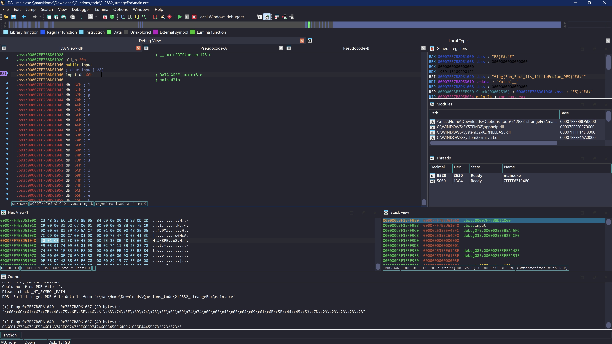

# CTF-Reverse刷题记录

**科研和项目中经常要用到逆向相关的知识，于是准备猛猛刷题，猛猛学逆向**
<!--more-->

## 2025 ?CTF

### 8086ASM

题目附件如下， 我在关键部分加了点注释

```asm
.MODEL SMALL
.STACK 100H
.DATA
    WELCOME_MSG db 'Welcome to 8086ASM.', 0DH, 0AH, '$'
    INPUT_MSG db 'Input your flag:', '$'

    WRONG_MSG db 0DH, 0AH, 'Wrong.', 0DH, 0AH, '$'
    CORRECT_MSG db 0DH, 0AH, 'Correct.', 0DH, 0AH, '$' 

    DATA1 DB 0BBH, 01BH, 083H, 08CH, 036H, 019H, 0CCH, 097H
            DB 08DH, 0E4H, 097H, 0CCH, 00CH, 048H, 0E4H, 01BH
            DB 00EH, 0D7H, 05BH, 065H, 01BH, 050H, 096H, 006H
            DB 03FH, 019H, 00CH, 04FH, 04EH, 0F9H, 01BH, 0D7H
            DB 0CH, 01DH, 0A0H, 0C6H

    DATA2 DW 01122H, 03344H, 01717H, 09090H, 0BBCCH 

    INPUT_BUFFER db 37 dup(0)
    BUFFER db 37 dup(0)
.CODE

START:
    MOV AX, @DATA
    MOV DS, AX
    MOV AH, 09H
    MOV DX, OFFSET WELCOME_MSG     ; 输出WELCOME_MSG
    INT 21H
    MOV DX, OFFSET INPUT_MSG       ; 输出INPUT_MSG
    INT 21H
    MOV AH,0AH
    MOV DX, OFFSET INPUT_BUFFER
    MOV BYTE PTR[INPUT_BUFFER], 37 ; 输入Flag
    INT 21H
    CALL ENCRYPT                   ; 调用Encrypt函数
    MOV DI, OFFSET DATA1
    MOV SI, OFFSET INPUT_BUFFER + 2
    MOV CX, 35
LOOP1:
    MOV AX, [DI]
    CMP AX, [SI]                   ; 对比密文
    JNE WRONG_EXIT
    INC DI
    INC SI
    LOOP LOOP1
    JMP CORRECT_EXIT
WRONG_EXIT:
    MOV AH,09H
    LEA DX,WRONG_MSG               ; 输出WRONG_MSG
    INT 21H
    JMP EXIT
CORRECT_EXIT:
    MOV AH,09H
    LEA DX,CORRECT_MSG             ; 输出CORRECT_MSG 
    INT 21H
    JMP EXIT
EXIT:
    MOV AX, 4C00H
    INT 21H
ENCRYPT PROC                       ; Encrypt函数
    PUSH AX
    PUSH BX
    PUSH CX
    MOV SI, OFFSET INPUT_BUFFER + 2
    MOV BX, OFFSET DATA2           ; DATA2数据
    MOV CX, 35                     ; 共循环35次
LOOP2:
    PUSH CX
    MOV CL, 2
    MOV AL, [SI]
    ROR AL, CL                     ; Flag[i]循环右移2
    POP CX
    MOV [SI], AL
    MOV AX, WORD PTR[SI]
    XOR AX, WORD PTR[BX]           ; (Word*)(Flag + i) ^= DATA2[i % 5]
    MOV WORD PTR[SI], AX
    INC SI
    ADD BX, 2
    CMP BX, OFFSET DATA2 + 10
    JNE CASE1
    MOV BX, OFFSET DATA2 
CASE1:
    LOOP LOOP2
    POP CX
    POP BX
    POP AX
    RET
ENCRYPT ENDP 

END START
```


汇编代码加密的大致逻辑如下

```c
Flag[35];
Data2[5] ={0x1122, 0x3344, 0x1717, 0x9090, 0xbbcc}; 
for (int i = 0; i < 35; i++) {
    Flag[i] = ror(Flag[i], 2);
    *(WORD*)(Flag+i) ^= Data2[i % 5];
}
```

对应的解密脚本如下：

C++版本

```c++
#include <iostream>

uint8_t rol(uint8_t val, uint8_t n)
{
    return (val << n) | (val >> (8 - n));
}

int main()
{
    uint16_t Key[] = {0x1122, 0x3344, 0x1717, 0x9090, 0xBBCC};
    uint8_t EncFlag[] = {
        0xBB, 0x1B, 0x83, 0x8C, 0x36, 0x19, 0xCC, 0x97,
        0x8D, 0xE4, 0x97, 0xCC, 0x0C, 0x48, 0xE4, 0x1B,
        0x0E, 0xD7, 0x5B, 0x65, 0x1B, 0x50, 0x96, 0x06,
        0x3F, 0x19, 0x0C, 0x4F, 0x4E, 0xF9, 0x1B, 0xD7,
        0x0C, 0x1D, 0xA0, 0xC6};

    for (int i = 34; i >= 0; i--)
    {
        uint16_t tmp = (EncFlag[i + 1] << 8 | EncFlag[i]);
        tmp ^= Key[i % 5];
        EncFlag[i] = tmp & 0xFF;
        EncFlag[i + 1] = (tmp >> 8) & 0xFF;
        EncFlag[i] = rol(EncFlag[i], 2);
    }
    printf("%.36s\n", EncFlag); // 只输出前36字节
    return 0;
}
// flag{W31c0m3_t0_8086_A5M_W0RlD___!!}
```

Python版本

```python
def rol(val, n):
    return ((val << n) & 0xFF) | (val >> (8 - n))

def main():
    key = [0x1122, 0x3344, 0x1717, 0x9090, 0xBBCC]
    enc_flag = [
        0xBB, 0x1B, 0x83, 0x8C, 0x36, 0x19, 0xCC, 0x97,
        0x8D, 0xE4, 0x97, 0xCC, 0x0C, 0x48, 0xE4, 0x1B,
        0x0E, 0xD7, 0x5B, 0x65, 0x1B, 0x50, 0x96, 0x06,
        0x3F, 0x19, 0x0C, 0x4F, 0x4E, 0xF9, 0x1B, 0xD7,
        0x0C, 0x1D, 0xA0, 0xC6
    ]
    enc_flag = bytearray(enc_flag)

    for i in range(34, -1, -1):
        val = (enc_flag[i + 1] << 8) | enc_flag[i]
        val ^= key[i % 5]
        enc_flag[i]     = val & 0xFF
        enc_flag[i + 1] = (val >> 8) & 0xFF
        enc_flag[i] = rol(enc_flag[i], 2)

    print(enc_flag)
    # bytearray(b'flag{W31c0m3_t0_8086_A5M_W0RlD___!!}')

if __name__ == "__main__":
    main()
```


### jvav

附件给了个apk，jadx打开发现是kotlin写的代码

定位到关键的check代码

```java
public final class EncKt {
    public static final byte[] encoder(String input) {
        Intrinsics.checkNotNullParameter(input, "input");
        byte[] bytes = input.getBytes(Charsets.UTF_8);
        Intrinsics.checkNotNullExpressionValue(bytes, "getBytes(...)");
        byte[] encode = Base64.getEncoder().encode(bytes);
        Intrinsics.checkNotNullExpressionValue(encode, "encode(...)");
        return encode;
    }

    public static final byte[] confuser(byte[] input) {
        Intrinsics.checkNotNullParameter(input, "input");
        int length = input.length;
        for (int i = 0; i < length; i++) {
            input[i] = (byte) (~((input[i] + 32) ^ 11));
        }
        return input;
    }

    public static final byte[] rounder(byte[] input) {
        Intrinsics.checkNotNullParameter(input, "input");
        byte[] bArr = new byte[input.length];
        int length = input.length;
        for (int i = 0; i < length; i++) {
            bArr[i] = input[(i + 5) % input.length];
        }
        return bArr;
    }

    public static final boolean checker(String input) {
        Intrinsics.checkNotNullParameter(input, "input");
        byte[] rounder = rounder(confuser(encoder(input)));
        byte[] bArr = {-89, 96, 102, 118, -89, -122, 103, -103, -125, -95, 114, 117, -116, -102, 114, -115, -125, 108, 110, 118, -91, -83, 101, -115, -116, -114, 124, 114, -123, -87, -87, -114, 121, 108, 124, -114};
        if (rounder.length != 36) {
            return false;
        }
        int length = rounder.length;
        for (int i = 0; i < length; i++) {
            if (rounder[i] != bArr[i]) {
                return false;
            }
        }
        return true;
    }
}
```

整体的加密逻辑就是先base64编码，然后混淆以及循环移位了一下

直接写个脚本逆着回去解密即可

```python
import base64

arr = [
    -89, 96, 102, 118, -89, -122, 103, -103, -125, -95,
    114, 117, -116, -102, 114, -115, -125, 108, 110, 118,
    -91, -83, 101, -115, -116, -114, 124, 114, -123, -87,
    -87, -114, 121, 108, 124, -114
]

ori = arr.copy()
for i in range(len(arr)):
    ori[i] = arr[(i - 5) % len(arr)]

print(ori)
for i in range(len(ori)):
    ori[i] = ((((~ori[i]) & 0xFF) ^ 11) - 32) & 0xFF

base64_str = bytes(ori).decode()
flag = base64.b64decode(base64_str)
print(flag)
# b'flag{kotl1n_is_also_java}'
```

### rand

附件给了个elf，IDA打开，定位到主函数

```c++
__int64 __fastcall main(int a1, char **a2, char **a3)
{
  int cnt; // ebp
  size_t len; // r12
  int idx1; // r13d
  int rand_num; // eax
  char tmp; // si
  __int64 idx2; // rax
  char *s; // rbx

  cnt = 256;
  __isoc99_scanf(&unk_2004, str1, a3);
  len = strlen(str1);
  do
  {
    idx1 = rand() % (int)len;
    rand_num = rand();                          // 依次循环要生成2个随机数
    tmp = str1[idx1];                           // 因此256次循环生成的随机数总数是512
    idx2 = rand_num % (int)len;
    str1[idx1] = str1[idx2];
    str1[idx2] = tmp;
    --cnt;
  }
  while ( cnt );
  s = str1;
  do
    *s++ ^= rand();                             // str1的长度是27，所以这里异或了27次
  while ( s != &str1[(unsigned int)(len - 1) + 1] );
  if ( len == 27 && unk_4010 == *(_OWORD *)str1 && byte_401B == xmmword_406B )
    puts("right !");
  else
    puts("wrong !");
  return 0;
}
```

发现主要逻辑就是，每次随机生成两个下标，交换数组中这两个下标对应的元素，然后重复这个过程256次

交换完成后，再把每个元素异或一个随机数

> 只要rand出现了，要么是随机数的值域很小可以爆破，要么就是用srand限定了随机数的种子

可以在下面这个函数里找到生成随机数的seed

```c++
void sub_10E0()
{
  srand(12345u);
}
```

得到seed后，我们就可以得到整个随机数序列，从而根据这个序列逆向还原出原始数据

```c++
#include <stdio.h>
#include <stdlib.h>
#include <algorithm>

int rands[1000];
unsigned char ida_chars[] =
    {
        0x5A, 0x66, 0x86, 0xCE, 0x46, 0x23, 0x75, 0x30, 0x18, 0x6F,
        0x5B, 0x7D, 0x4D, 0x4F, 0xF7, 0xC4, 0x4A, 0x0D, 0x45, 0xAE,
        0x36, 0xEF, 0x6B, 0x81, 0xC1, 0x82, 0x03};

int main()
{
    srand(12345);
    for (int i = 0; i < 512 + 27; i++)
    {
        rands[i] = rand();
    }
    for (int i = 0; i < 27; i++)
    {
        ida_chars[i] ^= rands[512 + i] & 0xFF; // rand()返回的是一个32位整数
    }
    for (int i = 512 - 1; i >= 0; i -= 2)
    {
        int idx1 = rands[i] % 27;
        int idx2 = rands[i - 1] % 27;
        std::swap(ida_chars[idx1], ida_chars[idx2]);
    }
    printf("%s\n", ida_chars);
    return 0;
}
// flag{there_1s_s0_many_rand}
```


### ezCalculate

IDA打开，定位到加密逻辑

```c++
int __fastcall main(int argc, const char **argv, const char **envp)
{
  size_t v3; // r12
  unsigned __int64 v4; // rdi
  size_t key_len; // rbx
  size_t v6; // r8
  unsigned __int64 v7; // rcx
  size_t v8; // r8
  unsigned __int64 v9; // rcx
  __int64 i; // rax
  char input[248]; // [rsp+20h] [rbp-F8h] BYREF

  _main(argc, argv, envp);
  scanf_constprop_0(&unk_14000C000, input);
  v3 = strlen(input);
  if ( !v3 )
    goto LABEL_17;
  v4 = 0;
  do
  {
    key_len = strlen(key);                      // "wwqessgxsddkaao123wms"
    input[v4] += key[v4 % key_len];             // "wwqessgxsddkaao123wms"
    ++v4;
  }
  while ( v3 != v4 );
  v6 = strlen(input);
  if ( !v6 )
    goto LABEL_17;
  v7 = 0;
  do
  {
    input[v7] ^= key[v7 % key_len];             // "wwqessgxsddkaao123wms"
    ++v7;
  }
  while ( v6 != v7 );
  v8 = strlen(input);
  if ( !v8 )
    goto LABEL_17;
  v9 = 0;
  do
  {
    input[v9] -= key[v9 % key_len];             // "wwqessgxsddkaao123wms"
    ++v9;
  }
  while ( v8 != v9 );
  if ( strlen(input) == 21 )
  {
    for ( i = 0; i != 21; ++i )
    {
      if ( input[i] != answer[i] )
      {
        printf("wrong");
        return 0;
      }
    }
    printf("right");
  }
  else
  {
LABEL_17:
    printf("incorrect length");
  }
  return 0;
}
```

写个脚本逆向还原即可

```python
enc = [0x33,0x1d,0x32,0x44,0x2a,0x54,0x45,0x2c,0x2e,0x74,0x8c,0x4b,0x40,0x42,0x43,0x73,0x71,0x82,0x24,0x35,0x10,0x00,0x00,0x00,0x00,0x00,0x00,0x00,0x00,0x00,0x00,0x00]

key = "wwqessgxsddkaao123wms"

for i in range(len(enc)):
    enc[i] = (enc[i] + ord(key[i % len(key)])) & 0xFF
for i in range(len(enc)):
    enc[i] = (enc[i] ^ ord(key[i % len(key)])) & 0xFF
for i in range(len(enc)):
    enc[i] = (enc[i] - ord(key[i % len(key)])) & 0xFF

print(bytes(enc))

# b'flag{Add_X0r_and_Sub}'
```

### ezCSharp

C#写的一个exe，用dnSpy打开，定位到主函数

```c#
using System;

// Token: 0x02000004 RID: 4
internal class Program
{
	// Token: 0x06000004 RID: 4 RVA: 0x0000206C File Offset: 0x0000026C
	private static void Main()
	{
		Console.WriteLine("Find the program entry point(main)");
		Console.WriteLine("(Press Enter to continue...)");
		Console.ReadLine();
		EncodedFlagAttribute encodedFlagAttribute = (EncodedFlagAttribute)Attribute.GetCustomAttribute(typeof(FlagContainer), typeof(EncodedFlagAttribute));
		string text = Program.DecodeFlag(encodedFlagAttribute.EncodedValue);
		Console.WriteLine("Program execution complete. Press any key to exit...");
		Console.ReadKey();
	}

	// Token: 0x06000005 RID: 5 RVA: 0x000020D4 File Offset: 0x000002D4
	private static string DecodeFlag(string encoded)
	{
		char[] array = encoded.ToCharArray();
		for (int i = 0; i < array.Length; i++)
		{
			char c = array[i];
			char c2 = c;
			if (c2 != '!')
			{
				switch (c2)
				{
				case 'a':
					array[i] = 'z';
					break;
				case 'b':
				case 'c':
				   ...
				case 'y':
				case 'z':
					array[i] -= '\u0001';
					break;
				}
			}
			else
			{
				array[i] = '_';
			}
		}
		return new string(array);
	}

	// Token: 0x04000002 RID: 2
	private static volatile string[] __hints = new string[]
	{
		"Locate the 'FlagContainer' class in the Program Resource Manager",
		"Submit in format: flag{xxxx}"
	};
}

```

大致的逻辑就是b-z所有字符减1，a变成z，其实就是偏移量为-1的凯撒加密

点击`FlagContainer`，可以看到密文

```C#
[EncodedFlag("D1ucj0u!tqjwf!fohjoffsjoh!xj!epspqz!ju!gvo!2025")]
```

写个脚本解密即可

```python
enc = "D1ucj0u!tqjwf!fohjoffsjoh!xj!epspqz!ju!gvo!2025"

def caesar_decrypt(ciphertext, shift):
    decrypted = ""
    for char in ciphertext:
        if char.isalpha():
            offset = 65 if char.isupper() else 97
            decrypted += chr((ord(char) - offset + shift) % 26 + offset)
        elif char.isdigit():
            decrypted += char
        else:
            decrypted += '_'
    return decrypted

print(caesar_decrypt(enc, -1))
# C1tbi0t_spive_engineering_wi_doropy_it_fun_2025
```

### PlzDebugMe

加密算法就是个简答的异或，但是需要动调去获取sub_401656()函数返回的密钥

```c++
int __cdecl sub_40167D(unsigned __int8 a1)
{
  return (unsigned __int8)sub_401656() ^ a1;
}
```

并且因为程序是逐字节进行比较，一旦比不上就会 return 0 退出程序

因此为了能一口气动态出所有的密钥，我们可以把 return 0 给 NOP 了

然后在下面异或的这行下断点动调，记录每次寄存器 al 的值即可

```
.text:0040168E 008 30 45 FC                      xor     [ebp+var_4], al
```

动调出所有的密钥后，写个脚本异或即可得到flag

```python
data=[0x5b,0x50,0xa1,0x25,0x84,0x8e,0x61,0xc4,0x6b,0xbb,0xae,0x5,0xb,0xc6,0x3d,0x42,0x5a,0xfb,0xc1,0xc9,0x4e,0xe9,0x8d,0x50,0x91,0x87,0x87,0x24,0xad,0xaf,0xd5,0x36]
num=[0x3D,0x3C,0xC0,0x42,0xFF,0XD7,0x51,0xb1,0x34,0xf0,0xc0,0x35,0x7c,0x99,0x75,0x72,0x2d,0xa4,0xb5,0xf9,
     0x11,0xad,0xbe,0x32,0xe4,0xe0,0xa6,0x5,0x8c,0x8e,0xf4,0x4b]
for i in range(len(data)):
    print(chr((data[i]^num[i]) & 0xff), end='')
    # flag{Y0u_Kn0w_H0w_t0_D3bug!!!!!}
```

### Flowers

去花指令

```c++
int __fastcall main(int argc, const char **argv, const char **envp)
{
  int v3; // kr00_4
  unsigned int i_1; // [rsp+30h] [rbp-10h]
  int k; // [rsp+34h] [rbp-Ch]
  int j; // [rsp+38h] [rbp-8h]
  unsigned int i; // [rsp+3Ch] [rbp-4h]

  _main(argc, argv, envp);
  printf("you may need to remove junk code\n");
  printf("flag start with flag{\n");
  scanf("%s", input);
  if ( (len(input) & 3) != 0 )
  {
    i_1 = 4 - (int)len(input) % 4;
    for ( i = 0; i < i_1; ++i )
      *(_WORD *)&input[strlen(input)] = 35;
  }
  v3 = len(input);
  for ( j = 0; j < v3 / 4; ++j )
    ((void (__fastcall *)(char *, void *))enc)(&input[8 * j], &_data_start__);
  if ( (unsigned int)len(input) == 48 )
  {
    for ( k = 0; k <= 47; ++k )
    {
      if ( input[k] != ans[k] )
        goto LABEL_14;
    }
    printf("right\n");
    return 0;
  }
  else
  {
LABEL_14:
    printf("wrong\n");
    return 0;
  }
}
```

```c++
__int64 __fastcall enc(unsigned int *v, _DWORD *key)
{
  __int64 result; // rax
  int i; // [rsp+10h] [rbp-10h]
  unsigned int r; // [rsp+14h] [rbp-Ch]
  unsigned int l; // [rsp+18h] [rbp-8h]
  int sum; // [rsp+1Ch] [rbp-4h]

  sum = 0;
  l = *v;
  result = v[1];
  r = v[1];
  for ( i = 0; i <= 31; ++i )
  {
	// 其实就是标准的TEA加密，改了个delta
    l += (r + sum) ^ (16 * r + *key) ^ ((r >> 5) + key[1]);
    sum += 0x114514;                            // delta = 0x114514
    result = (l + sum) ^ (16 * l + key[2]) ^ ((l >> 5) + key[3]);
    r += result;
  }
  return result;
}
```

发现是个 TEA 加密，delta = 0x114514，对照着写个解密脚本即可

```c++
#include <stdio.h>
#include <cstdint>
using namespace std;

void teaDecrypt(uint32_t *v, uint32_t *k)
{
	uint32_t sum = 0, v0 = v[0], v1 = v[1];
	uint32_t delta = 0x114514;
	sum = delta * 32;
	for (int i = 0; i < 32; i++)
	{
		v1 -= ((v0 << 4) + k[2]) ^ (v0 + sum) ^ ((v0 >> 5) + k[3]);
		sum -= delta;
		v0 -= ((v1 << 4) + k[0]) ^ (v1 + sum) ^ ((v1 >> 5) + k[1]);
	}
	v[0] = v0;
	v[1] = v1;
}
unsigned char ans[64] = {
	0xA5, 0x15, 0xA2, 0x47, 0x31, 0x1C, 0x8F, 0xDB, 0x13, 0xBF, 0x6A,
	0x91, 0x2F, 0x12, 0x25, 0xDE, 0x49, 0x26, 0xF5, 0x66, 0x55, 0x0E,
	0x9B, 0x4E, 0xDF, 0x19, 0x52, 0x3D, 0x88, 0x63, 0xB6, 0xCF, 0xDF,
	0x19, 0x52, 0x3D, 0x88, 0x63, 0xB6, 0xCF, 0xDF, 0x19, 0x52, 0x3D,
	0x88, 0x63, 0xB6, 0xCF, 0x00, 0x00, 0x00, 0x00, 0x00, 0x00, 0x00,
	0x00, 0x00, 0x00, 0x00, 0x00, 0x00, 0x00, 0x00, 0x00};
int main()
{
	uint32_t key[4] = {0x01234567, 0x89ABCDEF, 0xFEDCBA98, 0x76543210};
	for (int i = 0; i < 64; i += 8){
		teaDecrypt((uint32_t *)(ans + i), key);
	}
	for (int i = 0; i < 64; i++){
		printf("%c", ans[i]);
	}	
	return 0;
}
// flag{aCupOf_FlowerTea}
```

### base

IDA打开

```c++
__int64 __fastcall main(int argc, char **argv)
{
  const char *encoded_message; // [rsp+20h] [rbp-20h]
  const char *encoded_user_alphabet; // [rsp+28h] [rbp-18h]
  char *user_plaintext; // [rsp+30h] [rbp-10h]
  char *user_alphabet; // [rsp+38h] [rbp-8h]

  _main();
  if ( argc != 3 )
  {
    printf(&Format, *argv);
    printf(&Format_, *argv);
    return 1;
  }
  user_alphabet = argv[1];
  user_plaintext = argv[2];
  printf(&Format__0, user_alphabet);
  printf(&Format__1, user_plaintext);
  if ( strlen(user_alphabet) != 64 )
  {
    puts_0(&Buffer);
    return 1;
  }
  encoded_user_alphabet = base58_encode_str(user_alphabet);
  if ( !encoded_user_alphabet )
  {
    puts_0(&Buffer_);
    return 1;
  }
  puts_0(&Buffer__0);
  if ( !strcmp(encoded_user_alphabet, _data_start__) )// "2wvnsjrESxyfytuhEwqChbLLZRtA4VLhf5HgrKNRR3jYZGgyd1XHEhypTQ8b546txjJx7wHgJaJw2mBxbDtS8dCS"
  {
    puts_0(&Buffer__1);
    puts_0(&Buffer__2);
    encoded_message = base64_encode(user_plaintext, user_alphabet);
    if ( !encoded_message )
    {
      puts_0(&Buffer__3);
      return 1;
    }
    printf(&Format__2, encoded_message);
    puts_0(&Buffer__4);
    if ( !strcmp(encoded_message, CORRECT_ENCODED_MESSAGE) )// "zMXHz3TuBdrPC18XB0bZzx0="
    {
      puts_0(&Buffer__5);
      puts_0(asc_140005320);
    }
    else
    {
      puts_0(&Buffer__6);
      puts_0(asc_140005370);
      printf(asc_14000539E, CORRECT_ENCODED_MESSAGE);// "zMXHz3TuBdrPC18XB0bZzx0="
    }
  }
  else
  {
    puts_0(&Buffer__7);
    puts_0(asc_1400053D8);
    printf(asc_140005418, _data_start__);       // "2wvnsjrESxyfytuhEwqChbLLZRtA4VLhf5HgrKNRR3jYZGgyd1XHEhypTQ8b546txjJx7wHgJaJw2mBxbDtS8dCS"
    printf(asc_140005440, encoded_user_alphabet);
  }
  return 0;
}
```

发现其实就是base58编码了一个自定义的base64表，直接CyberChef解一下就行


### rc4

IDA打开发现是RC4加密，因为是同步流密码，加密和解密的逻辑是一样的

我们可以直接写个脚本解密

```c++
#include <stdio.h>
#include <string.h>

#define SBOX_LEN 256

void rc4_init(unsigned char *s, const unsigned char *key, size_t keylen)
{
    int i, j = 0;
    unsigned char k[SBOX_LEN];

    for (i = 0; i < SBOX_LEN; ++i)
    {
        s[i] = i;
        k[i] = key[i % keylen];
    }
    for (i = 0; i < SBOX_LEN; ++i)
    {
        j = (k[i] + s[i] + j) % SBOX_LEN;
        unsigned char tmp = s[i];
        s[i] = s[j];
        s[j] = tmp;
    }
}

// RC4 伪随机生成算法 (PRGA)
void rc4_crypt(unsigned char *s, unsigned char *data, size_t datalen)
{
    int i=0, j=0, t;
    size_t k;
    for (k = 0; k < datalen; ++k)
    {
        i = (i + 1) % SBOX_LEN;
        j = (s[i] + j) % SBOX_LEN;

        unsigned char tmp = s[i];
        s[i] = s[j];
        s[j] = tmp;

        t = (s[i] + s[j]) % SBOX_LEN;
        data[k] = (unsigned char)(data[k] ^ s[t] ^ (unsigned char)k);
    }
}

int main()
{
    unsigned char s[SBOX_LEN];
    unsigned char key[] = "ohhhRC4";
    unsigned char data[28]; // 明文
    unsigned char cipher[] = {
        0xf7, 0x5f, 0x7a, 0xc1, 0x5d, 0x34, 0xdb, 0xd6,
        0x2f, 0xd8, 0x75, 0x2d, 0xde, 0xe1, 0xda, 0x68,
        0xe0, 0x57, 0x9b, 0x4a, 0xce, 0xea, 0x07, 0xf9,
        0x5e, 0x79, 0x5e}; // 密文
    size_t datalen = 27;

    for (int i = 0; i < 27; i++)
    {
        data[i] = cipher[i];
    }

    rc4_init(s, key, strlen((char *)key));
    rc4_crypt(s, data, datalen);
    for (int i = 0; i < datalen; i++) {   
        printf("%c", data[i]);   
    }
    return 0;
}
// flag{S0NNE_Rc4_l$_c13@nged}
```

除了用脚本解密以外，还可以下断点动调，先在加密前下个断点dump出密文

然后把输入 Patching - change byte 成密文，再在加密后下个断点读取RC4解密后的明文即可

> 这里要注意的一点就是 Patching - change byte 一次只能 Patching 16 字节
> 
> 这里的密文是27字节，因此需要分成两次Patch

### UPX

upx魔改壳，把特征码删除了，对照着加壳后的exe恢复特征码，然后upx脱壳即可


```c++
__int64 __fastcall main()
{
  char part[48]; // [rsp+20h] [rbp-60h] BYREF
  char enc[33]; // [rsp+50h] [rbp-30h] BYREF
  int len_part; // [rsp+74h] [rbp-Ch]
  int len_enc; // [rsp+78h] [rbp-8h]
  int i; // [rsp+7Ch] [rbp-4h]

  _main();
  strcpy(enc, "fkyd{YNek_SD_AB@ars_OKT}");
  enc[25] = 0;
  *(_WORD *)&enc[26] = 0;
  *(_DWORD *)&enc[28] = 0;
  enc[32] = 0;
  len_enc = strlen(enc);
  enc[len_enc] = 0;
  puts_0("input the flag");
  scanf("%s", part);
  len_part = strlen(part);
  part[len_part] = 0;
  for ( i = 0; part[i] != 125; ++i )
  {
    if ( part[i] > 64 && part[i] <= 90 )
      part[i] = (part[i] - 65 + i + 26) % 26 + 65;
    if ( part[i] > 96 && part[i] <= 122 )
      part[i] = (part[i] - 97 - i + 26) % 26 + 97;
  }
  if ( !strcmp(part, enc) )
    puts_0("Congratulations!");
  else
    puts_0("Wrong!");
  return 0;
}
```


发现是个变异凯撒，直接写个脚本解密即可

```c++
#include <stdio.h>
#include <string.h>

int main()
{

    char enc[33] = "fkyd{YNek_SD_AB@ars_OKT}";
    for (int i = 0; i < 32; i++)
    {
        if (enc[i] > '@' && enc[i] <= 'Z')
            enc[i] = (enc[i] - 65 - i + 26) % 26 + 65;
        if (enc[i] > '`' && enc[i] <= 'z')
            enc[i] = (enc[i] - 97 + i + 26) % 26 + 97;
    }
    printf("%s\n", enc);
    return 0;
}
// flag{THls_IS_NN@qik_UPX}
```

> 这里除了用010修复特征码以外，还可以用XVolkolak脱壳
> 
> 或者用x64dbg手动脱壳


### CPPReverse

c++逆向，但是给了PDB文件，直接用IDA打开exe并导入PDB

主函数如下所示

```c++
int __fastcall main(int argc, const char **argv, const char **envp)
{
  std::ostream *v3; // rax
  std::ostream *v5; // rax
  unsigned __int64 lenth; // rax
  const std::_String_iterator<std::_String_val<std::_Simple_types<char> > > *v7; // rax
  std::string *v8; // rax
  std::ostream *v9; // rax
  std::string *v10; // rax
  EncryptClass *v11; // rax
  const std::_String_iterator<std::_String_val<std::_Simple_types<char> > > *v12; // rax
  std::ostream *v13; // rax
  bool format_flag; // [rsp+28h] [rbp-190h]
  EncryptClass *v15; // [rsp+40h] [rbp-178h]
  EncryptClass *v16; // [rsp+48h] [rbp-170h]
  std::string *_Left; // [rsp+58h] [rbp-160h]
  std::string *_Right; // [rsp+60h] [rbp-158h]
  const std::_String_iterator<std::_String_val<std::_Simple_types<char> > > *end_idx; // [rsp+68h] [rbp-150h]
  const std::_String_iterator<std::_String_val<std::_Simple_types<char> > > *v20; // [rsp+98h] [rbp-120h]
  std::_String_iterator<std::_String_val<std::_Simple_types<char> > > v21; // [rsp+A0h] [rbp-118h] BYREF
  std::_String_iterator<std::_String_val<std::_Simple_types<char> > > v22; // [rsp+A8h] [rbp-110h] BYREF
  std::_String_iterator<std::_String_val<std::_Simple_types<char> > > v23; // [rsp+B0h] [rbp-108h] BYREF
  std::_String_iterator<std::_String_val<std::_Simple_types<char> > > v24; // [rsp+B8h] [rbp-100h] BYREF
  std::string v25; // [rsp+C0h] [rbp-F8h] BYREF
  std::string v26; // [rsp+E0h] [rbp-D8h] BYREF
  std::string v27; // [rsp+100h] [rbp-B8h] BYREF
  std::string v28; // [rsp+120h] [rbp-98h] BYREF
  std::string Input; // [rsp+140h] [rbp-78h] BYREF
  std::string ImpStr; // [rsp+160h] [rbp-58h] BYREF
  std::string Result; // [rsp+180h] [rbp-38h] BYREF

  std::string::string(&Input);
  std::operator<<<std::char_traits<char>>(std::cout, "Please input your flag:");
  std::operator>><char>(std::cin, &Input);
  if ( std::string::size(&Input) >= 6 )
  {
    _Left = std::string::substr(&Input, &v25, 0, 5u);// 通过substr()截取前5个字符
    format_flag = std::operator!=<char>(_Left, "flag{") || *std::string::back(&Input) != '}';// 比较前5个字符和最后一个字符
    std::string::~string(&v25);
    if ( format_flag )
    {
      v5 = std::operator<<<std::char_traits<char>>(std::cout, "Wrong format.");
      std::ostream::operator<<(v5, std::endl<char,std::char_traits<char>>);
      system("pause");
      std::string::~string(&Input);
      return 0;
    }
    else
    {
      std::string::string(&ImpStr);             // 新定义一个ImpStr
      lenth = std::string::size(&Input);
      _Right = std::string::substr(&Input, &v26, 5u, lenth - 6);// 获取flag{}包裹的字符
      std::string::operator=(&ImpStr, _Right);  // 赋值给ImpStr
      std::string::~string(&v26);
      end_idx = std::string::end(&ImpStr, &v21);
      v7 = std::string::begin(&ImpStr, &v22);
      std::reverse<std::_String_iterator<std::_String_val<std::_Simple_types<char>>>>(
        (const std::_String_iterator<std::_String_val<std::_Simple_types<char> > >)v7->_Ptr,
        (const std::_String_iterator<std::_String_val<std::_Simple_types<char> > >)end_idx->_Ptr);
      std::string::string(&v27, &ImpStr);       // 利用reverse函数将字符串反转
      if ( CheckValidInput(v8) )
      {
        v15 = (EncryptClass *)operator new(0x18u);
        if ( v15 )
        {
          std::unique_ptr<std::_Facet_base>::__autoclassinit2(v15, 0x18u);
          std::string::string(&v28, &ImpStr);
          EncryptClass::EncryptClass(v15, v10); // 将字符串转为vector数组
          v16 = v11;
        }
        else
        {
          v16 = 0;
        }
        EncryptClass::Encrypt(v16, &Result);    // 调用加密函数
        v20 = std::string::end(&Result, &v23);
        v12 = std::string::begin(&Result, &v24);
        std::reverse<std::_String_iterator<std::_String_val<std::_Simple_types<char>>>>(// 再次调用reverse()
          (const std::_String_iterator<std::_String_val<std::_Simple_types<char> > >)v12->_Ptr,
          (const std::_String_iterator<std::_String_val<std::_Simple_types<char> > >)v20->_Ptr);
        if ( std::operator==<char>(&Result, &EncFlag) )
          v13 = std::operator<<<std::char_traits<char>>(std::cout, "Congratulation!You input a correct flag.");
        else
          v13 = std::operator<<<std::char_traits<char>>(std::cout, "Oooops.You input a wrong flag.");
        std::ostream::operator<<(v13, std::endl<char,std::char_traits<char>>);
        system("pause");
        std::string::~string(&Result);
        std::string::~string(&ImpStr);
        std::string::~string(&Input);
        return 0;
      }
      else
      {
        v9 = std::operator<<<std::char_traits<char>>(std::cout, "The string must be in hexadecimal format.");
        std::ostream::operator<<(v9, std::endl<char,std::char_traits<char>>);
        system("pause");
        std::string::~string(&ImpStr);
        std::string::~string(&Input);
        return 0;
      }
    }
  }
  else
  {
    v3 = std::operator<<<std::char_traits<char>>(std::cout, "Wrong length.");
    std::ostream::operator<<(v3, std::endl<char,std::char_traits<char>>);
    system("pause");
    std::string::~string(&Input);
    return 0;
  }
}
```

虽然Encflag是动态加载的，但是直接在Encflag上找交叉引用可以定位到这个函数

直接得到我们需要的密文

```c++
int dynamic_initializer_for__EncFlag__()
{
  std::string::string(&EncFlag, "EE1A9B5AFA59AF28DE5D594F8FB990B1D1345590");
  return atexit(dynamic_atexit_destructor_for__EncFlag__);
}
```

EncryptClass如下

```c++
void __fastcall EncryptClass::EncryptClass(EncryptClass *this, std::string *Input)
{
  std::string *v2; // rax
  std::string v3; // [rsp+30h] [rbp-28h] BYREF

  std::vector<unsigned char>::vector<unsigned char>(&this->Data);
  std::string::string(&v3, Input);
  EncryptClass::StringToVecData(this, v2);      // 将字符串2个为一组转成十六进制整数，添加到vector数组中
  std::string::~string(Input);
}
```

关键加密代码如下

```c++
EncryptClass *__fastcall EncryptClass::Encrypt(EncryptClass *this, std::string *p_Result)
{
  unsigned __int8 *v2; // rcx
  int i; // [rsp+20h] [rbp-38h]
  unsigned __int8 *v5; // [rsp+28h] [rbp-30h]
  unsigned __int8 *v6; // [rsp+30h] [rbp-28h]

  for ( i = 0; i < std::vector<unsigned char>::size(&this->Data); ++i )
  {
    v5 = std::vector<unsigned char>::operator[](&this->Data, i);
    *v5 += i + 7;                               // data[i] += i + 7;
    if ( i > 0 )
    {
      v6 = std::vector<unsigned char>::operator[](&this->Data, i);
      *v6 ^= *std::vector<unsigned char>::operator[](&this->Data, i - 1) - 1;// data[i] ^= data[i-1] - 1;
    }
    if ( !(i % 2) )
    {
      v2 = std::vector<unsigned char>::operator[](&this->Data, i);
      *v2 ^= 7u;                                // data[i] ^= 7;
    }
  }
  EncryptClass::VecDataToString(this, p_Result);
  return (EncryptClass *)p_Result;
}
```

对照着加密代码逆向还原即可，就是要注意这里有两个reverse函数

```c++
#include <iostream>
#include <string>
#include <vector>
#include <algorithm>

using namespace std;

int main()
{
    string Encflag = "EE1A9B5AFA59AF28DE5D594F8FB990B1D1345590";
    reverse(Encflag.begin(), Encflag.end());
    vector<uint8_t> data;

    for (int i = 0; i < Encflag.length(); i += 2)
    {
        // 从字符串 Encflag 中取出从位置 i 开始的 2 个字符，将其视为十六进制（hex）数字，并转换为对应的十进制整数（int 类型）
        data.push_back(stoi(Encflag.substr(i, 2), nullptr, 16));
    }

    string flag;
    for (int i = data.size() - 1; i >= 0; i--)
    {
        if (i % 2 == 0)
        {
            data[i] ^= 7;
        }
        if (i > 0)
        {
            data[i] ^= data[i - 1] - 1;
        }
        data[i] -= i + 7;
    }
    for (int i = 0; i < data.size(); i++)
    {
        char Buf[20] = {};
        sprintf(Buf, "%02X", data[i]);
        flag += Buf;
    }
    reverse(flag.begin(), flag.end());
    printf("flag{%s}\n", flag.c_str());
}
// flag{4350505F526576657253655F4578705F55705570}
```


### Do you like to drink Tea?

IDA打开定位到主函数

```c++
// local variable allocation has failed, the output may be wrong!
int __fastcall main(int argc, const char **argv, const char **envp)
{
  _DWORD enc[10]; // [rsp+20h] [rbp-80h]
  unsigned __int64 chunk_num; // [rsp+48h] [rbp-58h] BYREF
  _QWORD input[3]; // [rsp+50h] [rbp-50h] BYREF
  int v7; // [rsp+68h] [rbp-38h]
  __int16 v8; // [rsp+6Ch] [rbp-34h]
  int key_0; // [rsp+70h] [rbp-30h]
  unsigned int key_1; // [rsp+74h] [rbp-2Ch]
  int key_2; // [rsp+78h] [rbp-28h]
  int key_3; // [rsp+7Ch] [rbp-24h]
  _DWORD *Block; // [rsp+80h] [rbp-20h] OVERLAPPED
  int k; // [rsp+88h] [rbp-18h]
  int j; // [rsp+8Ch] [rbp-14h]
  int sum; // [rsp+90h] [rbp-10h]
  int i; // [rsp+94h] [rbp-Ch]
  unsigned int B; // [rsp+98h] [rbp-8h]
  unsigned int A; // [rsp+9Ch] [rbp-4h]

  sub_4023F0(*(__int64 *)&argc, argv, envp);
  key_0 = 0x12345678;
  key_1 = 0xABCDEF01;
  key_2 = 0x11451419;
  key_3 = 0x19198101;
  puts("Ciallo~");
  puts("Plz input your flag:");
  memset(input, 0, sizeof(input));
  v7 = 0;
  v8 = 0;
  scanf("%s", input);
  Block = ascii_to_dword_array((const char *)input, &chunk_num);
  for ( i = 0; i < chunk_num - 1; ++i )
  {
    A = Block[i];
    B = Block[i + 1];
    sum = 0;
    for ( j = 0; j <= 31; ++j )
    {
      A -= ((B << 6) + key_0) ^ (sum + B + 11) ^ ((B >> 9) + key_1);
      B -= ((A << 6) + key_2) ^ (sum + A + 20) ^ ((A >> 9) + key_3);
      sum -= 0x61C88647;
    }
    Block[i] = A;
    Block[i + 1] = B;
  }
  enc[0] = 0xF05D46E8;
  enc[1] = 0x4785FFEF;
  enc[2] = 0xF401BF82;
  enc[3] = 0xE5FCC60A;
  enc[4] = 0xBE70045D;
  enc[5] = 0x20788733;
  enc[6] = 0x933BA369;
  for ( k = 0; k < chunk_num; ++k )
  {
    if ( enc[k] != Block[k] )
    {
      printf("OH ~ NO!");
      exit(0);
    }
  }
  printf("I love drink tea too ~");
  free(Block);
  return 0;
}
```


```c++
void *__fastcall ascii_to_dword_array(const char *input, unsigned __int64 *chunk_num)
{
  void *dword_array; // [rsp+28h] [rbp-18h]
  size_t input_len; // [rsp+30h] [rbp-10h]
  size_t i; // [rsp+38h] [rbp-8h]

  input_len = strlen(input);
  *chunk_num = (input_len + 3) >> 2;            // 块的数量
  dword_array = malloc(4 * *chunk_num);
  if ( !dword_array )
    return 0;
  memset(dword_array, 0, 4 * *chunk_num);
  for ( i = 0; i < input_len; ++i )
    *((_DWORD *)dword_array + (i >> 2)) |= (unsigned __int8)input[i] << (8 * (i & 3));// 小端序
  return dword_array;
}
```


发现是TEA加密，写个脚本逆回去恢复即可


```c++
#include <stdio.h>
#include <string.h>
#include <stdint.h>

int main()
{
    uint32_t A, B, sum;
    uint32_t key[] = {0x12345678, 0xABCDEF01, 0x11451419, 0x19198101};
    uint32_t enc[] = {0xF05D46E8, 0x4785FFEF, 0xF401BF82, 0xE5FCC60A, 0xBE70045D, 0x20788733, 0x933BA369};
    int len = (sizeof(enc) + 3) >> 2;
    for (int i = len - 2; i >= 0; i--)
    {
        A = enc[i];
        B = enc[i + 1];
        sum = 0 - 32 * 0x61C88647;
        for (int j = 0; j < 32; j++)
        {
            sum += 0x61C88647;
            B += ((A << 6) + key[2]) ^ (sum + A + 20) ^ ((A >> 9) + key[3]);
            A += ((B << 6) + key[0]) ^ (sum + B + 11) ^ ((B >> 9) + key[1]);
        }
        enc[i] = A;
        enc[i + 1] = B;
    }
    for (int i = 0; i < 7; i++)
    {
        for (int j = 0; j < 4; j++)
        {
            printf("%c", enc[i] >> (j * 8) & 0xFF);
        }
    }
}
// flag{OH_I_L0VE_D3inK_Te4!!!}
```


### Pyc

附件给了一个python打包的exe，首先用 pyinstxtractor 解包

然后用在线网站反编译.pyc文件即可得到源码：https://pylingual.io/

```python
# Decompiled with PyLingual (https://pylingual.io)
# Internal filename: pyc.py
# Bytecode version: 3.8.0rc1+ (3413)
# Source timestamp: 1970-01-01 00:00:00 UTC (0)

print('Ciallo~')
print('Plz input your flag~')
flag = input()
flag_list = list(flag)
for i in range(len(flag_list)):
    a = flag_list[i]
    if 'a' <= a <= 'z':
        a = ord(a)
        a = (a - 12) * 2 + 6
    elif 'A' <= a <= 'Z':
        a = ord(a)
        a = (a + 6) * 3 + 9
    else:
        a = ord(a)
        a = a + 11
    flag_list[i] = chr(a)
flag = ''.join(flag_list)
hex_flag = ','.join([hex(ord(c)) for c in flag])
data = '0xba,0xc6,0xb0,0xbc,0x86,0x10b,0x126,0xe4,0x6a,0xc0,0x40,0x6a,0xda,0x3f,0xd2,0xe0,0x6a,0xb8,0x3f,0xd4,0xe0,0x89,0x88'
if data != hex_flag:
    print('wrong~')
else:
    print('great~')
```

直接写个脚本爆破就行

```python
from string import printable

data = [0xba,0xc6,0xb0,0xbc,0x86,0x10b,0x126,0xe4,0x6a,0xc0,0x40,0x6a,0xda,0x3f,0xd2,0xe0,0x6a,0xb8,0x3f,0xd4,0xe0,0x89,0x88]

for i in range(len(data)):
    for item in printable:
        a = item
        if 'a' <= a <= 'z':
            a = ord(a)
            a = (a - 12) * 2 + 6
        elif 'A' <= a <= 'Z':
            a = ord(a)
            a = (a + 6) * 3 + 9
        else:
            a = ord(a)
            a = a + 11
        if a == data[i]:
            print(item,end='')
            break
# flag{PYC_i5_v4ry_e4sy~}
```

### 螺旋密码机

附件给了个apk，jadx打开，发现有个 validateMasterPassword


然后把apk当做压缩包解压，可以在lib目录中找到一个libnative-lib.so

这里随便选一个架构下的就行，然后把这个so文件拖入IDA

搜索 validateMasterPassword 可以找到下面这个函数

```c++
__int64 __fastcall Java_com_example_eznative_MainActivity_validateMasterPassword(
        _JNIEnv *a1,
        __int64 a2,
        __int64 a3,
        __int64 a4)
{
  __int64 v5; // [rsp+40h] [rbp-E0h]
  int v6; // [rsp+5Ch] [rbp-C4h]
  __int64 StringUTFChars; // [rsp+70h] [rbp-B0h]
  __int64 v9; // [rsp+98h] [rbp-88h]
  __int64 v10; // [rsp+C0h] [rbp-60h] BYREF
  __int64 v11; // [rsp+C8h] [rbp-58h] BYREF
  char v12; // [rsp+D7h] [rbp-49h] BYREF
  char v13[24]; // [rsp+D8h] [rbp-48h] BYREF
  char ERROR:_NULL_INPUT[40]; // [rsp+F0h] [rbp-30h] BYREF
  unsigned __int64 v15; // [rsp+118h] [rbp-8h]

  v15 = __readfsqword(0x28u);
  StringUTFChars = _JNIEnv::GetStringUTFChars(a1, a4, 0);
  __android_log_print(4, "FibValidator", &unk_184DC);
  if ( !StringUTFChars )
    return _JNIEnv::NewStringUTF(a1, "ERROR: NULL_INPUT");
  std::string::basic_string[abi:ne180000]<0>(v13, StringUTFChars);
  sub_28440(v13);
  __android_log_print(4, "FibValidator", &unk_174C1);
  if ( (FibonacciValidator::validate(&v12, v13) & 1) != 0 )
  {
    __android_log_print(4, "FibValidator", &unk_16BA1);
    v6 = 0;
    v11 = sub_28820(v13);
    v10 = sub_28870(v13);
    while ( (sub_288C0(&v11, &v10) & 1) != 0 )
    {
      v6 += *(char *)sub_288F0(&v11);
      sub_28910(&v11);
    }
    __memset_chk(ERROR:_NULL_INPUT, 0, 32, 32);
    decryptFlag(&byte_187D0, ERROR:_NULL_INPUT, v6, 31737);
    __android_log_print(4, "FibValidator", &unk_16F64);
    v5 = _JNIEnv::NewStringUTF(a1, ERROR:_NULL_INPUT);
    _JNIEnv::ReleaseStringUTFChars(a1, a4, StringUTFChars);
    v9 = v5;
  }
  else
  {
    __android_log_print(4, "FibValidator", &unk_17C24);
    _JNIEnv::ReleaseStringUTFChars(a1, a4, StringUTFChars);
    v9 = _JNIEnv::NewStringUTF(a1, "ERROR: INVALID_PASSWORD");
  }
  std::string::~string(v13);
  return v9;
}
```

发现有个 decryptFlag 函数，点进去后可以得到如下代码

```c++
__int64 __fastcall decryptFlag(const unsigned __int8 *a1, char *a2, char a3, char a4)
{
  bool v5; // [rsp+Fh] [rbp-21h]
  int i; // [rsp+10h] [rbp-20h]
  char xor_key; // [rsp+15h] [rbp-1Bh]

  xor_key = a4 ^ a3 ^ 0x42;
  __android_log_print(4, "FibValidator", &unk_17287);
  for ( i = 0; ; ++i )
  {
    v5 = 0;
    if ( i < 31 )
      v5 = a1[i] != 0;
    if ( !v5 )
      break;                                    // 遇到0就说明处理完了，直接退出循环
    a2[i] = xor_key ^ a1[i];                    // a2用于存储解密后的结果
  }
  a2[i] = 0;
  return __android_log_print(4, "FibValidator", &unk_16CA2);
}
```

发现其实就是一个简单的异或，异或的密钥是 `a4 ^ a3 ^ 0x42` 生成的

我们只有一个a3不知道，但是a3的类型是char，因此我们可以直接爆破

a4的值就是十进制下的31737，因此提取出`&byte_187D0`，写个脚本爆破即可

```python
enc = [0xEE, 0xE4, 0xE9, 0xEF, 0xF3, 0xCC, 0xF1, 0xE6, 0xBC, 0xE5, 0xB9, 0xEB, 0xD7, 0xC4, 0xB8, 0xBC, 0xEC, 0xBB, 0xFA, 0xD7, 0xC5, 0xBC, 0xFB, 0xFC, 0xBB, 0xFA, 0xF5]

for a3 in range(256):
    key = (31737 & 0xFF) ^ a3 ^ 0x42
    decrypted = bytes([(b ^ key) & 0xFF for b in enc])
    if all(32 <= c < 127 for c in decrypted):
        s = decrypted.decode()
        if 'flag{' in s.lower():
            print(s)
# flag{Dyn4m1c_L04d3r_M4st3r}
```


### wtf

题目给了个靶机，考察的是JS逆向，有两个关键的js文件：`src.js` 和 `div.js`

src.js中的内容如下：

```js
var _a;
var ___Key = 'Komeji Satori';
var ans = [
  187, 202, 102, 155, 120, 201, 218, 28, 254, 113, 61, 130, 222, 12, 158, 43, 165, 51, 124, 64, 227, 128, 234, 61
];
(_a = document.querySelector('#submit')) === null || _a === void 0 ? void 0 : _a.addEventListener('click', function () {
    var flag = document.querySelector('#input');
    var input = flag.value;
    var bytes = new TextEncoder().encode(input);
    bytes[0] ^= 0x12;
    bytes[1] ^= 0x34;
    bytes[2] ^= 0x56;
    bytes[3] ^= 0x78;
    console.log(___Key);
    bytes = encode(bytes, ___Key);
    for (var i = 0; i < bytes.length; i++) {
        bytes[i] ^= ___Key[i % ___Key.length].charCodeAt(0);
    }
    for (var i = 0; i < ans.length; i++) {
        if (bytes[i] !== ans[i]) {
            document.querySelector('#input').value = 'Wrong flag!';
            return;
        }
    }
    document.querySelector('#input').value = 'Correct flag! you find Koishi!';
    document.body.style.backgroundImage = 'url(\'koishi.webp\')';
    document.body.style.backgroundPosition = 'center';
});
function encode(input, key) {
    var _a;
    var keyBytes = new Uint8Array(16);
    var keyData = new TextEncoder().encode(key);
    for (var i = 0; i < 16; i++) {
        keyBytes[i] = keyData[i % keyData.length];
    }
    var k = new Uint32Array(4);
    for (var i = 0; i < 4; i++) {
        k[i] = (keyBytes[i * 4] << 24) | (keyBytes[i * 4 + 1] << 16) |
            (keyBytes[i * 4 + 2] << 8) | keyBytes[i * 4 + 3];
    }
    var DELTA = 0x9e3779b9;
    function teaEncrypt(v0, v1) {
        var sum = 0;
        for (var i = 0; i < 32; i++) {
            sum = (sum + DELTA) >>> 0;
            v0 = (v0 + (((v1 << 4) + k[0]) ^ (v1 + sum) ^ ((v1 >>> 5) + k[1]))) >>> 0;
            v1 = (v1 + (((v0 << 4) + k[2]) ^ (v0 + sum) ^ ((v0 >>> 5) + k[3]))) >>> 0;
        }
        return [v0, v1];
    }
    var paddedLength = Math.ceil(input.length / 8) * 8;
    var padded = new Uint8Array(paddedLength);
    padded.set(input);
    for (var i = 0; i < paddedLength; i += 8) {
        var v0 = (padded[i] << 24) | (padded[i + 1] << 16) | (padded[i + 2] << 8) |
            padded[i + 3];
        var v1 = (padded[i + 4] << 24) | (padded[i + 5] << 16) |
            (padded[i + 6] << 8) | padded[i + 7];
        _a = teaEncrypt(v0, v1), v0 = _a[0], v1 = _a[1];
        padded[i] = (v0 >>> 24) & 0xFF;
        padded[i + 1] = (v0 >>> 16) & 0xFF;
        padded[i + 2] = (v0 >>> 8) & 0xFF;
        padded[i + 3] = v0 & 0xFF;
        padded[i + 4] = (v1 >>> 24) & 0xFF;
        padded[i + 5] = (v1 >>> 16) & 0xFF;
        padded[i + 6] = (v1 >>> 8) & 0xFF;
        padded[i + 7] = v1 & 0xFF;
    }
    if (input.length < paddedLength) {
        var newInput = new Uint8Array(paddedLength);
        newInput.set(input);
        input = newInput;
    }
    for (var i = 0; i < paddedLength; i++) {
        input[i] = padded[i];
    }
    return input;
}
```

div.js 用 jsfuck 混淆过了，找个在线网站解个混淆后可以得到如下内容：

```js
; ; ; ; ; ; ; ; ; ; ; ; ; ; ; ; ; ; ; ; ; ; ; ; ; ; ; ; ; ; ; ; ; ; ; ; ; ; ; ; ; ; ; ; ; ; ; ; ; ; ; ; ; ; ; ; ; ; ; ; ; ; ; ; ; ; ; ; ; ; ; ; ; ; ; ; ; ; ; ; ; ; ; ; ; ; ; ; ; ; ; ; ; ; ; ; ; ; ; ; ; ; ; ; ; ; ; ; ; ; ; ; ; ; ; ; ; ; ; ; ___Key = 'K0meji_K0ishi'; ; ; ; ; ; ; ; ; ; ; ; ; ; ; ; ; ; ; ; ; ; ; ; ; ; ; ; ; ; ; ; ; ; ; ; ; ; ; ; ; ; ; ; ; ; ; ; ; ; ; ; ; ; ; ; ; ; ; ; ; ; ; ; ; ; ; ; ; ; ; ; ; ; ___Key.toString = function () {   return 'Komeji Satori'; }; ; ; ; ; ; ; ; ; ; ; ; ; ; ; ; ; ; ; ; ; ; ; ; ; ; ; ; ; ; ; ; var Ori = console.log; ; ; ; ; ; ; ; ; ; ; ; ; ; ; ; ; ; ; ; ; ; ; ; ; ; ; ; ; ; ; ; ; ; ; ; ; ; ; ; ; ; ; ; ; ; ; ; ; ; ; ; ; ; ; ; ; ; ; ; ; ; ; ; ; ; ; ; ; ; ; ; ; ; console.log = function (...args) {   for (var i = 0; i < args.length; i++) {     if (args[i] == ___Key) {       args[i] = 'Komeji Satori';     }   }   Ori(...args); }; ; ; ; ; ; ; ; ; ; ; ; ; ; ; ; ; ; ; ; ; ; ; ; ; ; ; ; ; ; ; ; ; ; ; ; ; ; ; ; ; ; ; ; ; ; ; ; ; ; ; ; ; ; ; ; ; ; ; ; ; ; ; ; ; ; ; ; ; ; ;
```

发现进行了一个密钥赋值的操作，并且 hook 了 console.log，因此控制台输出的是假密钥

具体原理就是 html 解析 script 文件的的规则是从上到下解析并执行，新的会覆盖旧的

加密的代码就是一个TEA加密，因此我们用真正的密钥逆向解密回去即可

```python
ans = [
    94, 49, 141, 165, 142, 18, 244, 41, 247, 57, 51, 48, 210, 166, 164, 221, 1, 184, 186, 224, 188, 181, 172, 167
]

def get_tea_key(key):
    for i in range(len(ans)):
        ans[i] ^= ord(key[i % len(key)])

    # 准备 TEA 密钥，需要128位（16字节）的密钥
    key_bytes = [ord(c) for c in key]
    key_bytes = (key_bytes*16)[:16] # 扩展到 16 字节
    # print(key_bytes)

    key_array = []
    # 16字节的密钥数组转换为4个32位整数
    for i in range(4):
        key_array.append((key_bytes[i*4] << 24) | (key_bytes[i*4+1] << 16) | (key_bytes[i*4+2] << 8) | key_bytes[i*4+3])
    # print([hex(item) for item in key_array])
    return key_array

def tea_decrypt(v0, v1, k):
    delta = 0x9E3779B9
    sum = (delta * 32) & 0xFFFFFFFF
    
    for _ in range(32):
        v1 = (v1 - (((v0 << 4) + k[2]) ^ (v0 + sum) ^ ((v0 >> 5) + k[3]))) & 0xFFFFFFFF
        v0 = (v0 - (((v1 << 4) + k[0]) ^ (v1 + sum) ^ ((v1 >> 5) + k[1]))) & 0xFFFFFFFF
        sum = (sum - delta) & 0xFFFFFFFF
    
    return v0, v1

if __name__ == "__main__":
    key = "K0meji_K0ishi"
    key_array = get_tea_key(key)
    # print(key_array)

    flag = []
    for i in range(0,len(ans),8):
        # 大端序读取，每次读取8个字节（64位）
        v0 = (ans[i] << 24) | (ans[i+1] << 16) | (ans[i+2] << 8) | ans[i+3]
        v1 = (ans[i+4] << 24) | (ans[i+5] << 16) | (ans[i+6] << 8) | ans[i+7]
        v0, v1 = tea_decrypt(v0, v1, key_array)
        # 大端序写回
        flag.extend([
            (v0 >> 24) & 0xFF,
            (v0 >> 16) & 0xFF,
            (v0 >> 8) & 0xFF,
            v0 & 0xFF,
            (v1 >> 24) & 0xFF,
            (v1 >> 16) & 0xFF,
            (v1 >> 8) & 0xFF,
            v1 & 0xFF,
        ])

    flag[0] ^= 0x12
    flag[1] ^= 0x34
    flag[2] ^= 0x56
    flag[3] ^= 0x78
    print(bytes(flag))
    # b'flag{JS_l5_verY_dyn@mIC}'
```


### strangeEnc

IDA打开，发现DES加密的特征，DES加密可以动调出

只要把密文Patch到输入里，并且把每次生成的密钥逆序Patch回去就行

详细过程可参考：https://matriy330.github.io/32958ffb/

```c++
char *__fastcall sub_7FF76BDD1CC0(char *input, char *Koishi__)
{
  __int64 v2; // rsi
  __int64 v3; // rax
  unsigned __int64 v4; // rbx
  __int64 *v5; // rdx
  char v6; // cl
  __int64 v7; // rax
  int *p_Keys; // rdi
  __int64 Keys; // r10
  unsigned __int64 v10; // r8
  __int64 *v11; // rdx
  char v12; // cl
  unsigned int v13; // eax
  unsigned int v14; // eax
  unsigned int v15; // r8d
  unsigned __int64 v16; // r10
  __int64 *v17; // rdx
  char v18; // cl
  __int64 v19; // rax
  int v20; // eax
  __int64 v21; // r8
  __int64 *v22; // r11
  unsigned __int64 v23; // rsi
  __int64 v24; // r8
  char v25; // cl
  __int64 v26; // rax
  int v28; // [rsp+2Ch] [rbp-8Ch]
  __int64 v29; // [rsp+30h] [rbp-88h] BYREF
  __int64 v30; // [rsp+38h] [rbp-80h]
  __int64 v31; // [rsp+40h] [rbp-78h]
  __int64 v32; // [rsp+48h] [rbp-70h]
  __int64 v33; // [rsp+50h] [rbp-68h] BYREF
  __int64 v34; // [rsp+58h] [rbp-60h]
  __int64 v35; // [rsp+60h] [rbp-58h] BYREF
  __int64 v36; // [rsp+68h] [rbp-50h]
  _BYTE v37[72]; // [rsp+70h] [rbp-48h] BYREF

  v2 = 0;
  v3 = sub_7FF76BDD1360(*(_QWORD *)Koishi__);
  sub_7FF76BDD1550(v3);
  v4 = *(_QWORD *)input;
  v30 = 0x40C141C242C343CLL;
  v29 = 0x20A121A222A323ALL;
  v31 = 0x60E161E262E363ELL;
  v33 = 0x109111921293139LL;
  v32 = 0x810182028303840LL;
  v35 = 0x50D151D252D353DLL;
  v34 = 0x30B131B232B333BLL;
  v36 = 0x70F171F272F373FLL;
  v5 = &v29;
  do
  {
    v6 = (unsigned __int8)&v29 + 63 - (_BYTE)v5;
    v7 = (v4 >> (64 - *(_BYTE *)v5)) & 1;
    v5 = (__int64 *)((char *)v5 + 1);
    v2 |= v7 << v6;
  }
  while ( v37 != (_BYTE *)v5 );
  p_Keys = (int *)&Keys; // 这里下断点！
  v28 = HIDWORD(v2);
  while ( 1 )
  {
    Keys = *(_QWORD *)p_Keys;
    v10 = 0;
    v29 = 0x504050403020120LL;
    v31 = 0x11100F0E0D0C0D0CLL;
    v30 = 0xB0A090809080706LL;
    v33 = 0x1B1A191819181716LL;
    v32 = 0x1514151413121110LL;
    v34 = 0x1201F1E1D1C1D1CLL;
    v11 = &v29;
    do
    {
      v12 = (unsigned __int8)&v29 + 47 - (_BYTE)v11;
      v13 = ((unsigned int)v2 >> (32 - *(_BYTE *)v11)) & 1;
      v11 = (__int64 *)((char *)v11 + 1);
      v10 |= v13 << v12;
    }
    while ( &v35 != v11 );
    v14 = sub_7FF76BDD19B0(v10 ^ Keys);
    v15 = 0;
    v16 = v14;
    v30 = 0xA1F12051A170F01LL;
    v29 = 0x111C0C1D15140710LL;
    v31 = 0x9031B200E180802LL;
    v32 = 0x19040B16061E0D13LL;
    v17 = &v29;
    do
    {
      v18 = (unsigned __int8)&v29 + 31 - (_BYTE)v17;
      v19 = (v16 >> (32 - *(_BYTE *)v17)) & 1;
      v17 = (__int64 *)((char *)v17 + 1);
      v15 |= v19 << v18;
    }
    while ( &v33 != v17 );
    v20 = v28;
    p_Keys += 2;
    v28 = v2;
    v21 = v20 ^ v15;
    if ( &initialized == p_Keys )
      break;
    LODWORD(v2) = v21;
  }
  v22 = &v29;
  v23 = (v21 << 32) | (unsigned int)v2;
  v24 = 0;
  v29 = 0x2040183810300828LL;
  v30 = 0x1F3F17370F2F0727LL;
  v31 = 0x1E3E16360E2E0626LL;
  v32 = 0x1D3D15350D2D0525LL;
  v33 = 0x1C3C14340C2C0424LL;
  v34 = 0x1B3B13330B2B0323LL;
  v35 = 0x1A3A12320A2A0222LL;
  v36 = 0x1939113109290121LL;
  do
  {
    v25 = (unsigned __int8)&v29 + 63 - (_BYTE)v22;
    v26 = (v23 >> (64 - *(_BYTE *)v22)) & 1;
    v22 = (__int64 *)((char *)v22 + 1);
    v24 |= v26 << v25;
  }
  while ( v37 != (_BYTE *)v22 );
  *(_QWORD *)input = v24;
  return input;
}
```

断点下在 `p_Keys = (int *)&Keys;` 这一行，然后可以写个 ida-python 脚本帮我们执行

```c++
import ida_bytes
import ida_dbg

KEYS_BASE = 0x0007FF76BDE10C0
ROUNDS = 16
STRIDE = 8  

def reverse_keys():
    size = ROUNDS * STRIDE
    buf = ida_bytes.get_bytes(KEYS_BASE, size)
    blocks = [buf[i*STRIDE:(i+1)*STRIDE] for i in range(ROUNDS)]
    blocks.reverse()
    newbuf = b"".join(blocks)
    ok = ida_bytes.put_bytes(KEYS_BASE, newbuf)

reverse_keys()
```

同时，把密文Patch到输入里的步骤也可以写个 ida-python 脚本

```c++
import ida_bytes
import ida_dbg

INPUT_ADDR = 0x0007FF6E0E01040

CIPHERTEXT = bytes([
    0x57, 0xC6, 0x50, 0x75, 0x24, 0x8C, 0x55, 0x37,
    0x23, 0xE1, 0x7F, 0x71, 0xE2, 0x17, 0x49, 0xA7,
    0x3F, 0xD5, 0x1B, 0x68, 0xE2, 0xBA, 0xF3, 0xD1,
    0xC6, 0xF4, 0x2D, 0x48, 0x0B, 0xFD, 0xC0, 0x90,
    0xC4, 0xEA, 0xF3, 0xBD, 0xC7, 0x57, 0x5C, 0xEA
])

def patch_input():
    ok = ida_bytes.put_bytes(INPUT_ADDR, CIPHERTEXT)

patch_input()
```

最后在比较前下好断点，动调即可在 input 变量中得到最后的flag



`flag{Fun_Fact_its_littleEndian_DES}#####`

## 2021 绿城杯

### easy_re

main函数中发现存在一处花指令，修复后反编译可以得到如下代码

```c++
int __cdecl main(int argc, const char **argv, const char **envp)
{
  _DWORD *v3; // edx
  unsigned int input_len; // kr00_4
  unsigned int key_len; // kr04_4
  int i; // ecx
  int val_i; // edi
  int val_j; // ebx
  unsigned __int8 v9; // dl
  int new_i; // edi
  int new_j; // ebx
  unsigned __int8 tmp; // dl
  int idx_1; // ecx
  unsigned int j; // ecx
  char *good; // eax
  _BYTE v17[12]; // [esp+0h] [ebp-540h] BYREF
  _OWORD v18[2]; // [esp+Ch] [ebp-534h]
  int n1424414361; // [esp+2Ch] [ebp-514h]
  int n340807546; // [esp+30h] [ebp-510h]
  __int16 v21; // [esp+34h] [ebp-50Ch]
  int idx; // [esp+38h] [ebp-508h]
  char input[512]; // [esp+3Ch] [ebp-504h] BYREF
  char k_box[256]; // [esp+23Ch] [ebp-304h] BYREF
  char key[256]; // [esp+33Ch] [ebp-204h] BYREF
  _BYTE s_box[256]; // [esp+43Ch] [ebp-104h] BYREF

  *v3 += v17;
  memset(s_box, 0, sizeof(s_box));
  strcpy(key, "tallmewhy");
  memset(&key[10], 0, 0xF6u);
  v18[0] = xmmword_9921B0;
  v18[1] = xmmword_9921C0;
  n1424414361 = 1424414361;
  n340807546 = 340807546;
  v21 = -4891;
  puts("Hello, this is my world.If you want flag, give me something I like.");
  sub_991010("\n");
  memset(input, 0, sizeof(input));
  gets(input);
  input_len = strlen(input);
  key_len = strlen(key);
  memset(k_box, 0, sizeof(k_box));
  for ( i = 0; i < 256; ++i )
  {
    s_box[i] = i;                               // 初始化S表
    k_box[i] = key[i % key_len];                // 初始化K表
  }
  val_i = 0;
  val_j = 0;
  do                                            // 用K表对S表进行初始置换
  {
    v9 = s_box[val_i];
    val_j = (val_j + k_box[val_i] + v9) % 256;
    s_box[val_i++] = s_box[val_j];
    s_box[val_j] = v9 ^ 0x37;
  }
  while ( val_i < 256 );
  sub_991010("\n\n");
  new_i = 0;
  idx = 0;
  new_j = 0;
  if ( input_len )
  {
    do
    {                                           // 生成密钥流并异或
      new_i = (new_i + 1) % 256;
      tmp = s_box[new_i];
      new_j = (tmp + new_j) % 256;
      s_box[new_i] = s_box[new_j];
      s_box[new_j] = tmp;
      idx_1 = idx;
      input[idx] ^= s_box[(unsigned __int8)(tmp + s_box[new_i])];
      idx = idx_1 + 1;
    }
    while ( idx_1 + 1 < input_len );
    new_j = 0;
  }
  for ( j = 0; j < input_len; ++j )
    new_j = input[j] == *((_BYTE *)v18 + j);
  good = (char *)&unk_992184;
  if ( new_j == 1 )
    good = aGood;
  sub_991010(good);
  return 0;
}
```

写个脚本逆向还原即可

```c++
#include <stdio.h>
#include <stdlib.h>
#include <string.h>

int main()
{
	int k_box[256] = {0};
	int s_box[256] = {0};
	char key[] = "tallmewhy";
	int key_len = strlen(key);
	char flag[42] =
		{
			0xF5, 0x8C, 0x8D, 0xE4, 0x9F, 0xA5, 0x28, 0x65, 0x30, 0xF4,
			0xEB, 0xD3, 0x24, 0xA9, 0x91, 0x1A, 0x6F, 0xD4, 0x6A, 0xD7,
			0x0B, 0x8D, 0xE8, 0xB8, 0x83, 0x4A, 0x5A, 0x6E, 0xBE, 0xCB,
			0xF4, 0x4B, 0x99, 0xD6, 0xE6, 0x54, 0x7A, 0x4F, 0x50, 0x14,
			0xE5, 0xEC};

	for (int i = 0; i < 256; i++) // 初始化S表和K表
	{
		s_box[i] = i;
		k_box[i] = key[i % key_len];
	}

	int v9 = 0;
	int v8 = 0;
	for (int i = 0; i < 256; i++) // 用K表对S表进行初始置换
	{
		v9 = s_box[i];
		v8 = (v8 + k_box[i] + v9) % 256;
		s_box[i] = s_box[v8];
		s_box[v8] = v9 ^ 0x37; // 多了异或了一个0x37
	}

	v8 = 0,v9 = 0;
	int i = 0, tmp;
	for (int w = 0; w < 42; w++) // 生成密钥流并异或
	{
		i = (i + 1) % 256;
		v8 = (v8 + s_box[i]) % 256;
		v9 = s_box[i];
		s_box[i] = s_box[v8];
		s_box[v8] = v9;
		tmp = (s_box[i] + s_box[v8]) % 256;
		flag[i - 1] ^= s_box[tmp]; // s_box[tmp]是最后的密钥
	}

	for (i = 0; i < 42; i++)
	{
		printf("%c", flag[i]);
	}
	return 0;
}
// flag{c5e0f5f6-f79e-5b9b-988f-28f046117802}
```

```python
key = list('tallmewhy')

content = [
    0xF5, 0x8C, 0x8D, 0xE4, 0x9F, 0xA5, 0x28, 0x65, 0x30, 0xF4, 0xEB, 0xD3, 0x24, 0xA9, 0x91, 0x1A,
    0x6F, 0xD4, 0x6A, 0xD7, 0x0B, 0x8D, 0xE8, 0xB8, 0x83, 0x4A, 0x5A, 0x6E, 0xBE, 0xCB, 0xF4, 0x4B,
    0x99, 0xD6, 0xE6, 0x54, 0x7A, 0x4F, 0x50, 0x14, 0xE5, 0xEC               
]

rc4number = 256
s = [0] * rc4number
flag = ''

def rc4_init(s, key, rc4number):
    for i in range(rc4number):
        s[i] = i

    j = 0
    for i in range(rc4number):
        v8 = s[i]
        j = (j + v8 + ord(key[i % len(key)])) % rc4number
        s[i] = s[j]
        s[j] = v8 ^ 0x37

def rc4_endecode(s, content, rc4number):
    i = 0
    j = 0
    out = []
    for k in range(len(content)):
        i = (i + 1) % rc4number
        temp = s[i]
        j = (temp + j) % rc4number
        s[i] = s[j]
        s[j] = temp
        t = (temp + s[i]) % rc4number
        out.append(chr(content[k] ^ s[t]))
    out = ''.join(out)
    print(out)

rc4_init(s, key, rc4number)
rc4_endecode(s, content, rc4number)
# flag{c5e0f5f6-f79e-5b9b-988f-28f046117802}
```


### 抛石机

IDA打开反编译

```c++
__int64 __fastcall main(int a1, char **a2, char **a3)
{
  __int64 v3; // rcx
  __int64 v4; // r8
  __int64 v5; // r9
  __int64 tmp; // rdx
  int v4_1; // ebx
  int v8; // ebx
  int v9; // ebx
  int v10; // ebx
  _QWORD flag[6]; // [rsp+0h] [rbp-B0h] BYREF
  __int64 array; // [rsp+30h] [rbp-80h]
  __int64 v14; // [rsp+38h] [rbp-78h]
  __int64 v15; // [rsp+40h] [rbp-70h]
  __int64 v16; // [rsp+48h] [rbp-68h]
  int v17; // [rsp+50h] [rbp-60h]
  _QWORD input[5]; // [rsp+60h] [rbp-50h] BYREF
  __int16 v19; // [rsp+88h] [rbp-28h]
  char v20; // [rsp+8Ah] [rbp-26h]
  int k; // [rsp+90h] [rbp-20h]
  int j; // [rsp+94h] [rbp-1Ch]
  int i; // [rsp+98h] [rbp-18h]
  int idx; // [rsp+9Ch] [rbp-14h]

  memset(input, 0, sizeof(input));
  v19 = 0;
  v20 = 0;
  array = 0;
  v14 = 0;
  v15 = 0;
  v16 = 0;
  LOBYTE(v17) = 0;
  puts("input your flag:");
  idx = 0;
  __isoc99_scanf("%43s", input);
  strcpy((char *)flag, "flag{xxxxxxxx-xxxx-xxxx-xxxx-xxxxxxxxxxxx}");
  tmp = 'xxx-xxxx';
  for ( i = 0; i <= 42; ++i )
  {
    if ( *((_BYTE *)flag + i) == 'x' )
    {
      if ( (int)((__int64 (__fastcall *)(_QWORD, _QWORD *, __int64, __int64, __int64, __int64, _QWORD, _QWORD, _QWORD, _QWORD, _QWORD, _DWORD, __int64, __int64, __int64, __int64, int))hex2num)(
                  (unsigned int)*((char *)input + i),
                  input,
                  tmp,
                  v3,
                  v4,
                  v5,
                  flag[0],
                  flag[1],
                  flag[2],
                  flag[3],
                  flag[4],
                  flag[5],
                  array,
                  v14,
                  v15,
                  v16,
                  v17) < 0 )
      {
        puts("you lost!");
        exit(1);
      }
      tmp = *((unsigned __int8 *)input + i);
      *((_BYTE *)&array + idx++) = tmp;         // 将十六进制值添加到数组
    }
    else
    {
      tmp = *((unsigned __int8 *)input + i);
      if ( (_BYTE)tmp != *((_BYTE *)flag + i) ) // 比较除了十六进制以外的字符
      {
        puts("you lost!");
        exit(1);
      }
    }
  }
  for ( j = 0; j <= 3; ++j )                    // 初始化
  {
    *((_BYTE *)&x3 + j) = 0;
    *((_BYTE *)&x2 + j) = 0;
    *((_BYTE *)&x4 + j) = 0;
    *((_BYTE *)&x1 + j) = 0;
  }
  for ( k = 0; k <= 3; ++k )
  {
    v4_1 = k + 4;                               // 高4字符都是0，然后每8个字符的二进制转换为一个double
    *((_BYTE *)&x3 + v4_1) = sub_1198(*((_BYTE *)&array + 2 * k), (_QWORD *)*((unsigned __int8 *)&array + 2 * k + 1));// (0,1) (2,3) (4,5) (6,7)
    v8 = k + 4;
    *((_BYTE *)&x2 + v8) = sub_1198(*((_BYTE *)&array + 2 * k + 8), (_QWORD *)*((unsigned __int8 *)&array + 2 * k + 9));
    v9 = k + 4;
    *((_BYTE *)&x4 + v9) = sub_1198(
                             *((_BYTE *)&array + 2 * k + 16),
                             (_QWORD *)*((unsigned __int8 *)&array + 2 * k + 17));
    v10 = k + 4;
    *((_BYTE *)&x1 + v10) = sub_1198(
                              *((_BYTE *)&array + 2 * k + 24),
                              (_QWORD *)*((unsigned __int8 *)&array + 2 * k + 25));
  }
  if ( check_func() )
    puts("Missed!");
  else
    puts("You Win!");
  return 0;
}
```

```c++
__int64 __fastcall hex2num(char n47, _QWORD *input)
{
  unsigned int v3; // [rsp+10h] [rbp-4h]

  v3 = -1;
  if ( n47 <= 96 || n47 > 102 )                 // x的取值为1-9或者a-f
  {                                             // 把十六进制字符转为十进制数
    if ( n47 > 47 && n47 <= 57 )
      return (unsigned int)(n47 - 48);
  }
  else
  {
    return (unsigned int)(n47 - 87);
  }
  return v3;
}
```

```c++
_BOOL8 check_func()
{
  double v1; // [rsp+0h] [rbp-20h]
  double v2; // [rsp+8h] [rbp-18h]
  double v3; // [rsp+10h] [rbp-10h]
  double v4; // [rsp+18h] [rbp-8h]

  if ( *(double *)&x3 > *(double *)&x2 - 0.001 )
    return 1;
  if ( *(double *)&x4 > *(double *)&x1 - 0.001 )
    return 1;
  v4 = 149.2 * *(double *)&x3 + *(double *)&x3 * -27.6 * *(double *)&x3 - 129.0;// 解方程
  v3 = 149.2 * *(double *)&x2 + *(double *)&x2 * -27.6 * *(double *)&x2 - 129.0;
  v2 = *(double *)&x4 * -39.6 * *(double *)&x4 + 59.2 * *(double *)&x4 + 37.8;
  v1 = *(double *)&x1 * -39.6 * *(double *)&x1 + 59.2 * *(double *)&x1 + 37.8;
  return v4 <= -0.00003
      || v4 >= 0.00003
      || v3 <= -0.00003
      || v3 >= 0.00003
      || v2 <= -0.00002
      || v2 >= 0.00002
      || v1 <= -0.00003
      || v1 >= 0.00003;
}
```

直接写个脚本爆破即可

```c++
#include <stdio.h>

int main(void)
{
	unsigned long long i; // 这里要注意用 unsigned long long 
	unsigned long long tmp;
	double key;
	double v4 = 0, v2 = 0, v1 = 0;
	
	for (i = 0; i < 0xFFFFFFFF; i++)			
	{
		tmp = i << 32;				 
		key = *(double *)(&tmp); // 强制转为 double
		
		v4 = 149.2 * key + key * -27.6 * key - 129.0;
		if ( (v4 > -0.00003) && (v4 < 0.00003) )
			printf("v4:%p %lf\n", i, v4);
		
		v2 = key * -39.6 * key + 59.2 * key + 37.8;
		if ( (v2 > -0.00002) && (v2 < 0.00002) )
			printf("v2:%p %lf\n", i, v2);
		
		v1 = key * -39.6 * key + 59.2 * key + 37.8;
		if ( (v1 > -0.00003) && (v1 < 0.00003) )
			printf("v1:%p %lf\n", i, v1);
	} 
	return 0;	
} 
```

运行以上脚本可以得到如下内容：

```
v4:000000003ff14a45 -0.000015
v1:000000003fffa458 -0.000029
v4:0000000040114cf8 -0.000006
v1:00000000bfdee41d 0.000026
v2:00000000bfdee41e 0.000002
v1:00000000bfdee41e 0.000002
v1:00000000bfdee41f -0.000021
```

根据变量的读取顺序和大小关系，整理得到最后的flag

`flag{454af13f-f84c-1140-1ee4-debf58a4ff3f}`

### babyvxworks

附件给了一个 `helloworld.vxe` ，直接IDA打开

发现有花指令，并且函数的结尾有错，导致无法正常反编译

因此我们修复花指令并删除错误函数，添加函数结尾即可

```c++
int sub_3D0()
{
  int v0; // ebx
  int v1; // eax
  const char *Success; // ebx
  int lenth; // [esp+14h] [ebp-C4h]
  int n30; // [esp+18h] [ebp-C0h]
  int v6; // [esp+1Ch] [ebp-BCh]
  _DWORD v7[2]; // [esp+20h] [ebp-B8h] BYREF
  char input[52]; // [esp+28h] [ebp-B0h] BYREF
  char dst_1[124]; // [esp+5Ch] [ebp-7Ch] BYREF

  sub_32B0(input, 0, 48);
  sub_32B0(dst_1, 0, 120);
  v7[0] = 0;
  sub_2BF0(v7, input, 48);
  sub_2BF0(v7, dst_1, 120);
  n30 = 0;
  qmemcpy(input, src, 0x30u);
  printf("Plz Input Flag: ");
  scanf("%s", input);
  *(_DWORD *)sub_2450("C:/WindRiver/workspace/helloworld/helloworld.c", 21, dst_1, 0, 4) = 188;
  *(_DWORD *)sub_2450("C:/WindRiver/workspace/helloworld/helloworld.c", 21, dst_1, 4, 4) = 10;
  *(_DWORD *)sub_2450("C:/WindRiver/workspace/helloworld/helloworld.c", 21, dst_1, 8, 4) = 187;
  *(_DWORD *)sub_2450("C:/WindRiver/workspace/helloworld/helloworld.c", 21, dst_1, 12, 4) = 193;
  *(_DWORD *)sub_2450("C:/WindRiver/workspace/helloworld/helloworld.c", 21, dst_1, 16, 4) = 213;
  *(_DWORD *)sub_2450("C:/WindRiver/workspace/helloworld/helloworld.c", 21, dst_1, 20, 4) = 134;
  *(_DWORD *)sub_2450("C:/WindRiver/workspace/helloworld/helloworld.c", 21, dst_1, 24, 4) = 127;
  *(_DWORD *)sub_2450("C:/WindRiver/workspace/helloworld/helloworld.c", 21, dst_1, 28, 4) = 10;
  *(_DWORD *)sub_2450("C:/WindRiver/workspace/helloworld/helloworld.c", 21, dst_1, 32, 4) = 201;
  *(_DWORD *)sub_2450("C:/WindRiver/workspace/helloworld/helloworld.c", 21, dst_1, 36, 4) = 185;
  *(_DWORD *)sub_2450("C:/WindRiver/workspace/helloworld/helloworld.c", 21, dst_1, 40, 4) = 81;
  *(_DWORD *)sub_2450("C:/WindRiver/workspace/helloworld/helloworld.c", 21, dst_1, 44, 4) = 78;
  *(_DWORD *)sub_2450("C:/WindRiver/workspace/helloworld/helloworld.c", 21, dst_1, 48, 4) = 136;
  *(_DWORD *)sub_2450("C:/WindRiver/workspace/helloworld/helloworld.c", 21, dst_1, 52, 4) = 10;
  *(_DWORD *)sub_2450("C:/WindRiver/workspace/helloworld/helloworld.c", 21, dst_1, 56, 4) = 130;
  *(_DWORD *)sub_2450("C:/WindRiver/workspace/helloworld/helloworld.c", 21, dst_1, 60, 4) = 185;
  *(_DWORD *)sub_2450("C:/WindRiver/workspace/helloworld/helloworld.c", 21, dst_1, 64, 4) = 49;
  *(_DWORD *)sub_2450("C:/WindRiver/workspace/helloworld/helloworld.c", 21, dst_1, 68, 4) = 141;
  *(_DWORD *)sub_2450("C:/WindRiver/workspace/helloworld/helloworld.c", 21, dst_1, 72, 4) = 10;
  *(_DWORD *)sub_2450("C:/WindRiver/workspace/helloworld/helloworld.c", 21, dst_1, 76, 4) = 253;
  *(_DWORD *)sub_2450("C:/WindRiver/workspace/helloworld/helloworld.c", 21, dst_1, 80, 4) = 201;
  *(_DWORD *)sub_2450("C:/WindRiver/workspace/helloworld/helloworld.c", 21, dst_1, 84, 4) = 199;
  *(_DWORD *)sub_2450("C:/WindRiver/workspace/helloworld/helloworld.c", 21, dst_1, 88, 4) = 127;
  *(_DWORD *)sub_2450("C:/WindRiver/workspace/helloworld/helloworld.c", 21, dst_1, 92, 4) = 185;
  *(_DWORD *)sub_2450("C:/WindRiver/workspace/helloworld/helloworld.c", 21, dst_1, 96, 4) = 17;
  *(_DWORD *)sub_2450("C:/WindRiver/workspace/helloworld/helloworld.c", 21, dst_1, 100, 4) = 78;
  *(_DWORD *)sub_2450("C:/WindRiver/workspace/helloworld/helloworld.c", 21, dst_1, 104, 4) = 185;
  *(_DWORD *)sub_2450("C:/WindRiver/workspace/helloworld/helloworld.c", 21, dst_1, 108, 4) = 232;
  *(_DWORD *)sub_2450("C:/WindRiver/workspace/helloworld/helloworld.c", 21, dst_1, 112, 4) = 141;
  *(_DWORD *)sub_2450("C:/WindRiver/workspace/helloworld/helloworld.c", 21, dst_1, 116, 4) = 87;
  lenth = strlen(input);
  v0 = 0;
  if ( lenth <= 0 )
    goto LABEL_7;
  do
  {
    v1 = sub_2450("C:/WindRiver/workspace/helloworld/helloworld.c", 24, input, v0, 0);
    ((void (__cdecl *)(int, int))loc_330)(v1, lenth);
    v6 = *(unsigned __int8 *)sub_2450("C:/WindRiver/workspace/helloworld/helloworld.c", 26, input, v0, 1);
    if ( *(_DWORD *)sub_2450("C:/WindRiver/workspace/helloworld/helloworld.c", 26, dst_1, 4 * v0, 4) == v6 )
      ++n30;
    ++v0;
  }
  while ( v0 < lenth );
  if ( n30 == 30 )
    Success = "Success";
  else
LABEL_7:
    Success = "Try Again";
  sub_3350(Success);
  sub_2930(v7);
  return 0;
}
```

```c++
int __cdecl sub_330(int a1, int a2)
{
  _BYTE *v3; // [esp+4h] [ebp-10h]
  _BYTE *v4; // [esp+8h] [ebp-Ch]

  if ( !a2 )
    return 1;
  v4 = (_BYTE *)sub_2450("C:/WindRiver/workspace/helloworld/helloworld.c", 10, a1, 0, 1);
  *v4 ^= 0x22u;
  v3 = (_BYTE *)sub_2450("C:/WindRiver/workspace/helloworld/helloworld.c", 11, a1, 0, 1);
  *v3 += 3;
  return sub_330(a1, a2 - 1);
}
```

发现代码的加密逻辑就是先异或0x22，然后再加3，并且每个字符都要循环加密 a2(密文长度) 次

因此提取出密文，写个代码解密即可

```c++
#include <stdio.h>

int enc[] = {
    188, 10, 187, 193, 213, 134, 127, 10,
    201, 185, 81, 78, 136, 10, 130, 185,
    49, 141, 10, 253, 201, 199, 127, 185,
    17, 78, 185, 232, 141, 87
};

int main()
{
    int len = sizeof(enc) / sizeof(int);
    for (int i = 0; i < len; i++)
    {
        for (int j = 0; j < len; j++)
        {
            enc[i] -= 3;
            enc[i] ^= 0x22;
        }
        printf("%c", enc[i]);
    }
    return 0;
}
// flag{helo_w0rld_W3lcome_70_R3}
```

```python
enc = [
    188, 10, 187, 193, 213, 134, 127, 10,
    201, 185, 81, 78, 136, 10, 130, 185, 
    49, 141, 10, 253, 201, 199, 127, 185, 
    17, 78, 185, 232, 141, 87
]

lenth = len(enc)
for i in range(lenth):
    for j in range(lenth):
        enc[i] = (((enc[i] - 3) & 0xFF) ^ 0x22) & 0xFF

flag = [chr(item) for item in enc]
print("".join(flag))
# flag{helo_w0rld_W3lcome_70_R3}
```


---

> 作者: [Lunatic](https://goodlunatic.github.io)  
> URL: https://goodlunatic.github.io/posts/b7a1d1b/  

