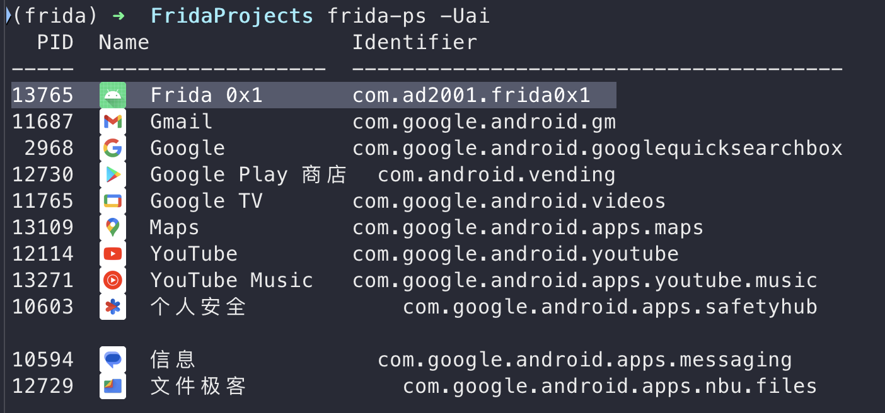
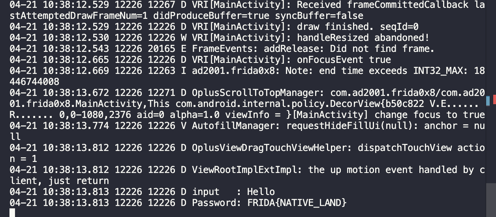
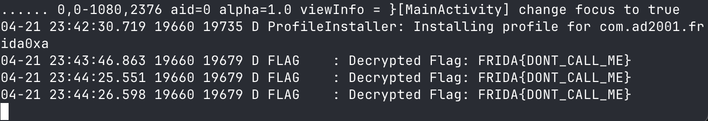
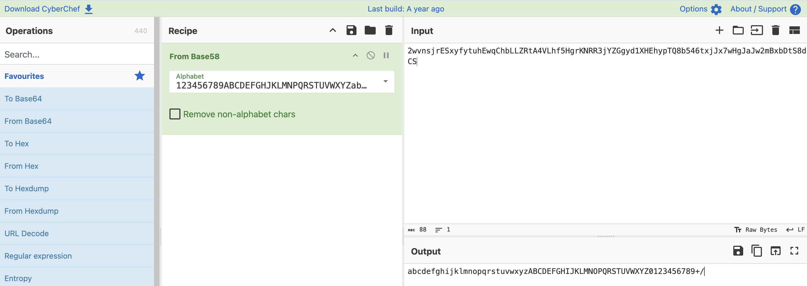
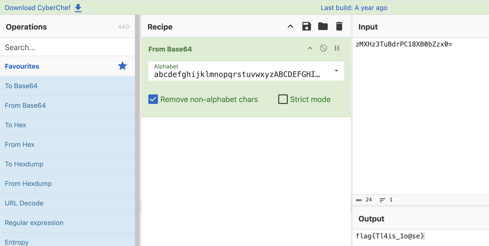
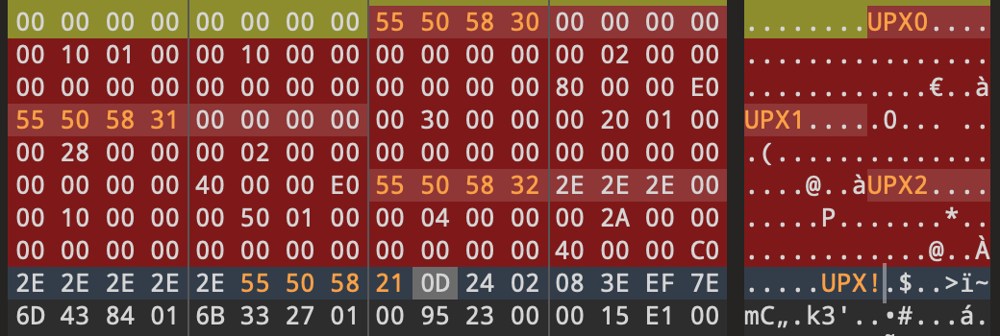
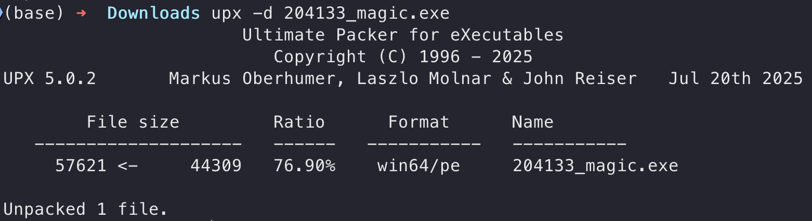
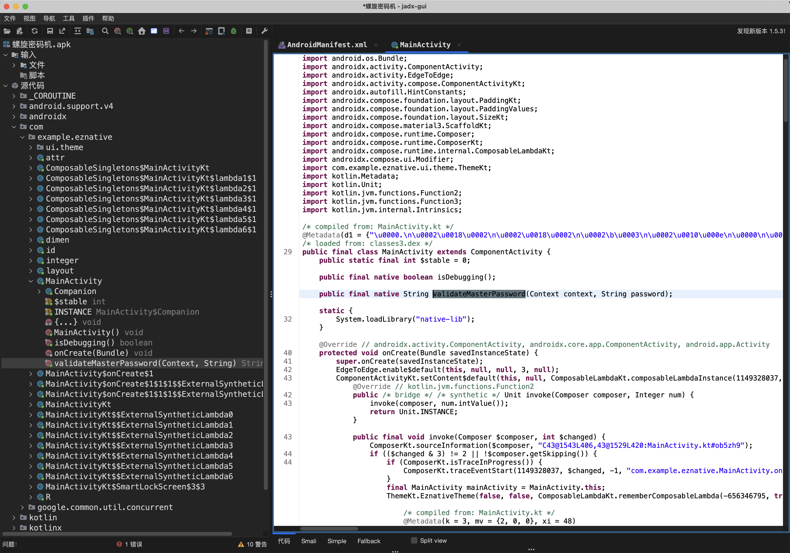
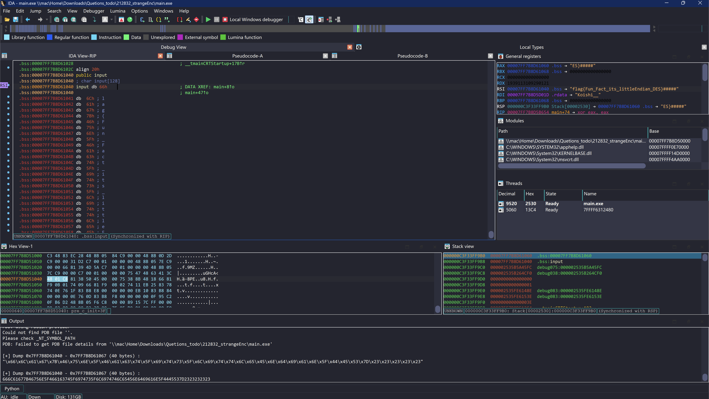
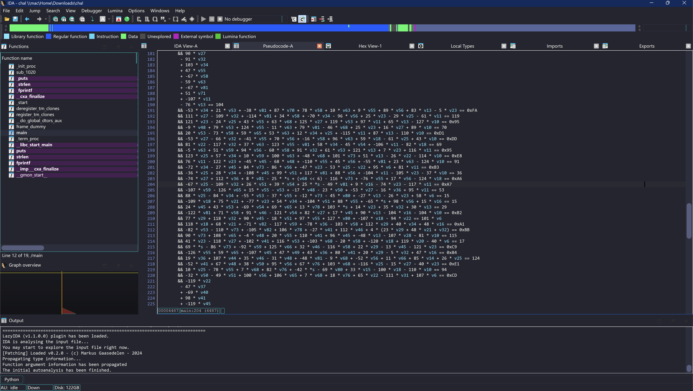

# CTF-Reverse刷题记录

**科研和项目中经常要用到逆向相关的知识，于是准备猛猛刷题，猛猛学逆向**
<!--more-->

## 专题系列

### 安卓逆向

#### Frida相关

##### Frida-Labs

###### Frida-0x1

这里主要就是学习一下 Frida Hook 脚本的编写

脚本的基本格式如下：

```javascript
Java.perform(function() {
  var <class_reference> = Java.use("<package_name>.<class>");
  <class_reference>.<method_to_hook>.implementation = function(<args>) {
    /*
      OUR OWN IMPLEMENTATION OF THE METHOD
    */
  }
})
```

程序的包名可以连上ADB后用`frida-ps -Uai`获取



jadx反编译一下apk，程序的逻辑很简单，就是比较用户的输入和随机生成的值


这里有两种Hook方式，分别是Hook`get_random()`和`check()`这两个函数

```javascript
function hook_1() {
    var utils = Java.use('com.ad2001.frida0x1.MainActivity');
    utils.get_random.implementation = function () {
        console.log("get_random() is hooked");
        var res = this.get_random();
        console.log("The return value is " + res);
        console.log("The value to bypass the check " + (res * 2 + 4));
        return res;
    }
}

function hook_2() {
    var utils = Java.use("com.ad2001.frida0x1.MainActivity");
    // 重载方法
    utils.check.overload('int', 'int').implementation = function (a, b) {
        console.log("check() is hooked");
        this.check(4, 12);
    }
}

function main() {
    Java.perform(function () {
        // hook_1();
        hook_2();
    });
}
setImmediate(main);
```

###### Frida-0x2

发现代码里写了 `get_flag()`，但是没有调用，因此我们主动调用一下即可

就是这里要注意，使用frida运行hook代码后，可能会hook不到

**我们修改一下hook脚本再保存即可，加个空格或者不修改直接 `Ctrl+S`**

```js
function hook_2() {
    var utils = Java.use('com.ad2001.frida0x2.MainActivity');
    utils.get_flag(4919);
}
```

###### Frida-0x3

修改 Checker类 的 code变量 的值为512即可

```js
function hook_3() {
    console.log("hook_3() is called");
    var Checker = Java.use('com.ad2001.frida0x3.Checker');
    Checker.code.value = 512;
}
```

###### Frida-0x4

主动调用非静态态方法，即主动调用从dex中动态加载的方法，使用`$new()`创建一个实例即可

```js
function hook_4() {
    console.log("hook_4() is called");
    var Check = Java.use('com.ad2001.frida0x4.Check');
    var check_obj = Check.$new();
    var res = check_obj.get_flag(1337);
    console.log(res);
}
```
###### Frida-0x5

> 直接使用 Frida 创建 `MainActivity` 或任何 Android 组件的实例可能会很棘手，这是由于 Android 的生命周期和线程规则所导致的。Android 组件（如 `Activity` 的子类）依赖应用程序的 context 才能正常运行，而在 Frida 中你可能缺少必要的 context。
> 
> Android UI 组件通常需要在一个关联了 `Looper` 的特定线程上运行。如果你在处理 UI 相关的任务，请确保你在一个已激活 `Looper` 的 main thread 上操作。
> 
> `Activity` 是 Android 应用程序更大的 lifecycle 的一部分。创建 `MainActivity` 的实例可能需要 app 处于特定状态，而通过 Frida 来管理整个 lifecycle 并不是一件简单的事。
> 
> 总之，直接为 `MainActivity` 创建实例并不是一个好主意。

> 那么解决方案是什么呢？
> 
> 当一个 Android 应用启动时，系统会自动创建一个 `MainActivity` 的实例（或者是在 `AndroidManifest.xml` 文件中指定的 launcher activity）。`MainActivity` 实例的创建是 Android 应用 lifecycle 的一部分。因此我们可以直接使用 Frida 来获取 `MainActivity` 已有的实例，然后调用 `flag()` 方法来获取我们想要的 flag。

在 Frida 中，对一个已有实例调用方法是很容易实现的。为此我们将使用两个 API：

- `Java.performNow`：用于在 Java runtime 上下文中执行代码的函数。
- `Java.choose`：在运行时枚举指定 Java 类（作为第一个参数传入）的所有实例。

```js
function hook_5() {
    // 使用 Java.choose 在运行时查找 MainActivity 的已有实例
    Java.choose('com.ad2001.frida0x5.MainActivity', {
        
        // 每找到一个实例就会触发一次 onMatch
        onMatch: function (instance) {
            console.log("Instance found"); // 打印找到实例的提示
            instance.flag(1337);           // 用找到的实例直接调用 flag() 方法，传入参数 1337
        },
        
        // 枚举完成后触发，这里不需要做任何处理，留空即可
        onComplete: function () { }
    });
}

function main() {
    // 使用 Java.performNow 在 Java runtime 上下文中立即执行代码
    // 与 Java.perform 的区别是：performNow 不需要等待 JS runtime 准备好
    Java.performNow(function () {
        hook_5();
    });
}

// 确保脚本注入完成后再执行 main，避免时序问题
setImmediate(main);
```

- **hook 方法**（等别人来调用）→ 用 `Java.perform`
- **主动调用实例方法**（我去找实例来执行）→ 用 `Java.performNow`

###### Frida-0x6

和之前一样，需要主动调用 `MainActivity` 中的 `get_flag` 方法

但是这里还需要传入一个Checker，并给里面的两个参数还需要等于指定值

因此我们使用 `Java.choose` 找到 `MainActivity` 的实例，并新建一个 `Checker` 实例并赋值

最后调用 `MainActivity.get_flag` 传入 `Checker` 实例即可

```js
function hook_6() {
    Java.choose("com.ad2001.frida0x6.MainActivity", {
        onMatch:function(instance) {
            var Checker = Java.use("com.ad2001.frida0x6.Checker");
            var Checker_obj = Checker.$new();
            Checker_obj.num1.value = 1234;
            Checker_obj.num2.value = 4321;
            instance.get_flag(Checker_obj);
        },
        onComplete:function() {
        }
    });
}

function main() {
    Java.performNow(function () {
        hook_6();
    });
}
setImmediate(main);
```

###### Frida-0x7

Checker类自己写好了构造器，直接传入参数新建实例即可

```js
function hook_7() {
    Java.choose("com.ad2001.frida0x7.MainActivity", {
        onMatch:function(instance) {
            var Checker = Java.use("com.ad2001.frida0x7.Checker");
            var Checker_obj = Checker.$new(513,513);
            instance.flag(Checker_obj);
        },
        onComplete:function() {
        }
    });
}
```
###### Frida-0x8

本题涉及到了 Hook 原生类中的函数

```java
package com.ad2001.frida0x8;

import android.os.Bundle;
import android.view.View;
import android.widget.Button;
import android.widget.EditText;
import android.widget.Toast;
import androidx.appcompat.app.AppCompatActivity;
import com.ad2001.frida0x8.databinding.ActivityMainBinding;

/* loaded from: classes4.dex */
public class MainActivity extends AppCompatActivity {
    private ActivityMainBinding binding;
    Button btn;
    EditText edt;

    public native int cmpstr(String str);

    static {
        System.loadLibrary("frida0x8");
    }

    @Override // androidx.fragment.app.FragmentActivity, androidx.activity.ComponentActivity, androidx.core.app.ComponentActivity, android.app.Activity
    protected void onCreate(Bundle savedInstanceState) {
        super.onCreate(savedInstanceState);
        ActivityMainBinding inflate = ActivityMainBinding.inflate(getLayoutInflater());
        this.binding = inflate;
        setContentView(inflate.getRoot());
        this.edt = (EditText) findViewById(R.id.editTextText);
        Button button = (Button) findViewById(R.id.button);
        this.btn = button;
        button.setOnClickListener(new View.OnClickListener() { // from class: com.ad2001.frida0x8.MainActivity.1
            @Override // android.view.View.OnClickListener
            public void onClick(View v) {
                String ip = MainActivity.this.edt.getText().toString();
                int res = MainActivity.this.cmpstr(ip);
                if (res == 1) {
                    Toast.makeText(MainActivity.this, "YEY YOU GOT THE FLAG " + ip, 1).show();
                } else {
                    Toast.makeText(MainActivity.this, "TRY AGAIN", 1).show();
                }
            }
        });
    }
}
```

加密函数 `cmpstr()`在so里，解压apk后，拿IDA打开so

```c++
bool __fastcall Java_com_ad2001_frida0x8_MainActivity_cmpstr(__int64 a1, __int64 a2, __int64 a3)
{
  int v4; // [xsp+20h] [xbp-C0h]
  int i; // [xsp+24h] [xbp-BCh]
  char *s1; // [xsp+30h] [xbp-B0h]
  char s2[100]; // [xsp+74h] [xbp-6Ch] BYREF
  __int64 v10; // [xsp+D8h] [xbp-8h]

  v10 = *(_QWORD *)(_ReadStatusReg(TPIDR_EL0) + 40);
  s1 = (char *)_JNIEnv::GetStringUTFChars();
  for ( i = 0; i < __strlen_chk("GSJEB|OBUJWF`MBOE~", 0xFFFFFFFFFFFFFFFFLL); ++i )
    s2[i] = aGsjebObujwfMbo[i] - 1;
  s2[__strlen_chk("GSJEB|OBUJWF`MBOE~", 0xFFFFFFFFFFFFFFFFLL)] = 0;
  v4 = strcmp(s1, s2);
  __android_log_print(3, "input ", "%s", s1);
  __android_log_print(3, "Password", "%s", s2);
  _JNIEnv::ReleaseStringUTFChars(a1, a3, (__int64)s1);
  _ReadStatusReg(TPIDR_EL0);
  return v4 == 0;
}
```

发现这里把Password也在日志信息里打印了，因此我们可以直接logcat获取

```bash
# 用以下命令打印目标应用的日志
adb logcat --pid=$(adb shell pidof -s com.ad2001.frida0x8)
```



除此之外，我们还发现里面调用了strcmp函数，其中第二个参数就是Password

因此我们也可以Hook这个strcmp函数

**FRIDA_VERSION < 17：**

```js
function hook_8() {
    var strcmp_adr = Module.findExportByName("libc.so", "strcmp");
    Interceptor.attach(strcmp_adr, {
        onEnter: function (args) {
            var arg0 = Memory.readUtf8String(args[0]); // first argument
            var flag = Memory.readUtf8String(args[1]); // second argument
            if (arg0.includes("123")) {
                console.log("Hookin the strcmp function");
                console.log("Input " + arg0);
                console.log("The flag is "+ flag);
            }
        },
        onLeave: function (retval) {
            // Modify or log return value if needed
        }
    });
}

function main() {
    Java.performNow(function () {
        hook_8();
    });
}
setImmediate(main);

// Input 123
// The flag is FRIDA{NATIVE_LAND}
```

**FRIDA_VERSION >= 17:**

```js
Process.attachModuleObserver({
    onAdded: function (module) {
        if (module.name === "libfrida0x8.so") {
            var strcmp_adr = module.getExportByName("strcmp");
            Interceptor.attach(strcmp_adr, {
                onEnter: function (args) {
                    if (args[0].isNull() || args[1].isNull()) return;
                    var str1 = args[0].readCString();
                    var str2 = args[1].readCString();
                    if (str1 === "Hello") {
                        console.log(" Our Input: " + str1 + "  Secret: " + str2);
                    }
                }
            });
        }
    },
    onRemoved: function (module) {}
});
```

###### Frida-0x9

Hook原生函数 `check_flag()`，然后把返回值修改为1337即可

```js
function hook_9() {
    var check_addr = Module.enumerateExports("liba0x9.so")[0]["address"];
    console.log(check_addr);
    Interceptor.attach(check_addr,{
        onEnter: function(args){
            console.log("check_func called");
        },
        onLeave: function(retval){
            retval.replace(1337);
        }
    })
}

function main() {
    Java.performNow(function () {
        hook_9();
    });
}
setImmediate(main);

```


###### Frida-0xA

主动调用原生函数 `get_flag()` ，并且传入两个和为3的参数即可

```js
__int64 __fastcall get_flag(__int64 result, int a2)
{
  int i; // [xsp+Ch] [xbp-44h]
  char v3[20]; // [xsp+34h] [xbp-1Ch] BYREF
  __int64 v4; // [xsp+48h] [xbp-8h]

  v4 = *(_QWORD *)(_ReadStatusReg(TPIDR_EL0) + 40);
  if ( (_DWORD)result + a2 == 3 )
  {
    for ( i = 0; i < __strlen_chk("FPE>9q8A>BK-)20A-#Y", 0xFFFFFFFFFFFFFFFFLL); ++i )
      v3[i] = aFpe9q8aBk20aY[i] + 2 * i;
    v3[19] = 0;
    result = __android_log_print(3, "FLAG", "Decrypted Flag: %s", v3);
  }
  _ReadStatusReg(TPIDR_EL0);
  return result;
}
```

先在 adb 中开启 logcat 监听

```bash
pidof -s com.ad2001.frida0xa
logcat --pid=19660
```

`frida -U -f com.ad2001.frida0xa` 后终端输入如下内容

```js
var funcAddr = Module.findBaseAddress("libfrida0xa.so").add(0x1DD60);
var get_flag = new NativeFunction(funcAddr , 'void', ['long', 'int']);
get_flag(2, 1);
```

或者 `frida -U -f com.ad2001.frida0xa -l 1.js`

```js
function hook_A() {
    var funcAddr = Module.findBaseAddress("libfrida0xa.so").add(0x1DD60);
    var get_flag = new NativeFunction(funcAddr , 'void', ['long', 'int']);
    get_flag(2, 1);
}

function main() {
    Java.performNow(function () {
        hook_A();
    });
}
setImmediate(main);
```

然后在 logcat 中即可得到 flag



###### Frida-0xB

参考链接：
https://github.com/DERE-ad2001/Frida-Labs/blob/main/Frida%200x8/Solution/Solution.md

和之前一样，关键逻辑在so文件里，因此我们用IDA反编译so文件

发现F5反编译后得到的 `get_flag()` 函数是空的，但是汇编中有如下内容：

> 注意我这里反汇编的是arm架构下的so

```c++
.text:0000000000015220 ; __unwind {
.text:0000000000015220                 SUB             SP, SP, #0x60
.text:0000000000015224                 STP             X29, X30, [SP,#0x50+var_s0]
.text:0000000000015228                 ADD             X29, SP, #0x50
.text:000000000001522C                 STUR            X0, [X29,#var_18]
.text:0000000000015230                 STUR            X1, [X29,#var_20]
.text:0000000000015234                 MOV             W8, #0xDEADBEEF
.text:000000000001523C                 STUR            W8, [X29,#var_24]
.text:0000000000015240                 LDUR            W8, [X29,#var_24]
.text:0000000000015244                 SUBS            W8, W8, #0x539
.text:0000000000015248                 B.NE            loc_1532C
.text:000000000001524C                 B               loc_15250
```

> 如果是x86架构下的so，得到的是如下内容

```c++
.text:00000000000170B0                                   ; __unwind {
.text:00000000000170B0 000 55                            push    rbp
.text:00000000000170B1 008 48 89 E5                      mov     rbp, rsp
.text:00000000000170B4 008 48 83 EC 50                   sub     rsp, 50h
.text:00000000000170B8 058 48 89 7D E8                   mov     [rbp+var_18], rdi
.text:00000000000170BC 058 48 89 75 E0                   mov     [rbp+var_20], rsi
.text:00000000000170C0 058 C7 45 DC EF BE AD DE          mov     [rbp+var_24], 0DEADBEEFh
.text:00000000000170C7 058 81 7D DC 39 05 00 00          cmp     [rbp+var_24], 539h
.text:00000000000170CE 058 0F 85 D2 00 00 00             jnz     loc_171A6
```

两个汇编大致的意思都一样，就是给一个值复制 `0xdeadbeef`，然后与 `0x539` 比较，如果相等就跳转

但是这里很明显不会相等，因此永远不会跳转，所以反编译后出来的函数是空的

但是我们可以在 ghidra 中关闭这项优化让它显示这段反编译代码：`Edit` -> `Tools Option` -> `Analysis` -> `Eliminate unreachable code`

关闭以后就可以得到如下反编译后的代码

```c++
void Java_com_ad2001_frida0xb_MainActivity_getFlag(void)

{
  uint uVar1;
  void *pvVar2;
  uint local_18;
  
  if (false) {
    uVar1 = __strlen_chk("j~ehmWbmxezisdmogi~Q",0xffffffff);
    pvVar2 = operator.new[](uVar1 + 1);
    for (local_18 = 0; local_18 < uVar1; local_18 = local_18 + 1) {
      *(byte *)((int)pvVar2 + local_18) = "j~ehmWbmxezisdmogi~Q"[local_18] ^ 0x2c;
    }
    *(undefined1 *)((int)pvVar2 + local_18) = 0;
    __android_log_print(3,"FLAG :",&DAT_0001687e,pvVar2);
    if (pvVar2 != (void *)0x0) {
      operator.delete[](pvVar2);
    }
  }
  return;
}
```

这里我们就可以使用 `X86Writer` 或 `Arm64Writer` 去修改 `jnz` -> `nop` 或 `B.NE` -> `B` 

具体的使用方法可以参考官方文档：

[https://frida.re/docs/javascript-api/#x86writer](https://frida.re/docs/javascript-api/#x86writer)

[https://frida.re/docs/javascript-api/#arm64writer](https://frida.re/docs/javascript-api/#arm64writer)

但是当前目标写入的位置在`.text`段，但是这个段默认是没有写的权限的，因此我们直接修改会导致程序崩溃

这里就可以使用 `Memory.protect()` 去修改这一段内存区域的保护属性

这部分的内容详见上面的参考链接

x86架构下的hook脚本：

> 我们可以用ghidra中的`0x20e2a`地址减去基址`0x00010000`来得到偏移。
> 
> 然后再把这个偏移加回模块基址，就能得到jnz指令的真实地址。

```js
var jnz = Module.getBaseAddress("libfrida0xb.so").add(0x20e2a - 0x00010000);
Memory.protect(jnz, 0x1000, "rwx");
var writer = new X86Writer(jnz);
try {
  // 当使用新指令覆盖旧指令时，必须保证新指令的长度足以覆盖旧指令的长度
  // 因为原jnz指令的长度为6，所以这里要 PutNop() 六次
  writer.putNop()
  writer.putNop()
  writer.putNop()
  writer.putNop()
  writer.putNop()
  writer.putNop()

  writer.flush(); // 将修改刷新到内存

} finally {
  writer.dispose(); // 释放 X86Writer 占用的资源
}
```

ARM架构下的hook脚本：

```js
function hook_B() {
    var addr = Module.findBaseAddress("libfrida0xb.so").add(0x15248);
    Memory.protect(addr, 0x1000, "rwx");
    var writer = new Arm64Writer(addr);
    var target = Module.findBaseAddress("libfrida0xb.so").add(0x1524c);
    try {
        writer.putBImm(target);   // 在 b.ne 的位置写入 <b target> 指令
        writer.flush();
    } finally {
        writer.dispose();
    }
}


function main() {
    Java.performNow(function () {
        hook_B();
    });
}
setImmediate(main);
```

**FRIDA_VERSION >= 17:**

```js
Process.attachModuleObserver({
    onAdded: function(module) {
        if (module.name === "libfrida0xb.so") {
            console.log(`Found libfrida0xb.so at: ${module.base}`);
            const targetAddress = module.base.add(0x15248);

            Memory.patchCode(targetAddress, 4, (code) => {
                const cw = new Arm64Writer(code, { pc: targetAddress });
                cw.putNop();
                cw.flush();
                console.log(`Instruction at ${targetAddress} successfully patched with NOP!`);
            });
        }
    },
    onRemoved: function(module) {}
});
```

最后用logcat监听日志，然后运行frida脚本即可得到flag

```bash
logcat | grep "FLAG"
```

#### 看雪上的三道例题

参考链接：https://bbs.kanxue.com/thread-260550.htm

##### 第一关

```js
function main(){
    Java.perform(function(){
        // 获取目标类的包装对象（可用于 Hook 方法、调用静态方法、访问静态字段）
        var VVVVV = Java.use("com.kanxue.pediy1.VVVVV");

        // 替换 VVVV 方法的实现（观察型 Hook，不影响原有逻辑）
        VVVVV.VVVV.implementation = function(x, y){
            var res = this.VVVV(x, y); // 调用原始方法
            console.log("x,y,res", x, y, res);
            return res; // 必须 return，否则调用方收到 undefined
        }
    })
}

// 脚本加载完成后立即异步执行 main，比直接调用更安全
setImmediate(main)
```

```js
function hook_1() {
    var VVVVV = Java.use("com.kanxue.pediy1.VVVVV");
    Java.openClassFile("/data/local/tmp/r0gson.dex").load();
    const gosn = Java.use("com.r0ysue.gson.Gson");
    VVVVV.eeeee.implementation = function (x) {
        var res = this.eeeee(x);
        // console.log("x,res", x, res);
        console.log("x,res", x, gosn.$new().toJson(res));
        return res;
    }
}

function hook_2() {
    var VVVVV = Java.use("com.kanxue.pediy1.VVVVV");
    var ByteString = Java.use("com.android.okhttp.okio.ByteString");
    var pSign = Java.use("java.lang.String").$new("6f452303f18605510aac694b0f5736beebf110bf").getBytes();
    console.log("pSign", pSign);
    // console.log("pSign_hex", ByteString.of(pSign).hex());
    for (var i = 9999; i < 100000; i++) {
        var v = Java.use("java.lang.String").$new(String(i));
        var vSign = VVVVV.eeeee(v);
        console.log("[+] ", i, ":", vSign);
        // byte[] 是 Java 引用类型，== 比较的是内存地址而非内容，需转成字符串基本类型后才能用 == 正确比较值。
        if (ByteString.of(vSign).hex() == ByteString.of(pSign).hex()) {
            console.log("[+] find it! ", i);
            break;
        }
    }
}

function hook_3() {
    var VVVVV = Java.use("com.kanxue.pediy1.VVVVV");
    Java.openClassFile("/data/local/tmp/r0gson.dex").load();
    const gosn = Java.use("com.r0ysue.gson.Gson");
    VVVVV.eeeee.implementation = function (x) {
        var res = this.eeeee(x);
        console.log("[+] 输入的内容: x,res", x, gosn.$new().toJson(res));
        // 创建一个 Java byte[] 数组, 'byte' 用来指定元素类型
        var value = Java.array('byte', [54, 102, 52, 53, 50, 51, 48, 51, 102, 49, 56, 54, 48, 53, 53, 49, 48, 97, 97, 99, 54, 57, 52, 98, 48, 102, 53, 55, 51, 54, 98, 101, 101, 98, 102, 49, 49, 48, 98, 102])
        console.log("[+] 修改后的内容: v", gosn.$new().toJson(value));
        return value;
    }
}

function main() {
    Java.perform(function () {
        hook_3();
    });
}

setImmediate(main);
```

##### 第二关

> 因为 DexClassLoader 是 App 运行时动态创建的，在脚本加载阶段它还不存在
> 
> 所以我们这里要先去堆中找已有的实例

```js
function hookDex(st,ed) {
    Java.perform(function () {
        // 从堆中找到 MainActivity 实例，主动触发 loadDexClass()
        // 目的：让 App 加载目标 dex，使 VVVVV 类进入内存
        Java.choose("com.kanxue.pediy1.MainActivity", {
            onMatch: function (instance) {
                console.log("found instance:", instance);
                console.log("invoke loadDexClass!", instance.loadDexClass());
            },
            onComplete() { }
        });
        // 从堆中找到 DexClassLoader 实例，替换全局 ClassLoader
        // 使 Java.use() 能够找到动态加载的类
        Java.choose("dalvik.system.DexClassLoader", {
            onMatch: function (loader) {
                Java.classFactory.loader = loader;
                console.log("the Loader:", Java.classFactory.loader);
            },
            onComplete: function () { }
        });

        // 获取动态加载的目标类
        var VVVVV_Class = Java.use("com.kanxue.pediy1.VVVVV");
        console.log("VVVVV_Class:", VVVVV_Class);
        // 创建 Java String 和 ByteString 对象，准备暴力枚举
        // ByteString 是 okhttp 提供的工具类，用于将 byte[] 转成十六进制字符串
        // 目的：byte[] 不能直接用 == 比较内容，转成 hex 字符串后才能比较
        var JavaString = Java.use("java.lang.String");
        var ByteString = Java.use("com.android.okhttp.okio.ByteString");
        var pSign = JavaString.$new("7c133979c8fc45943815792c0288300687cf0a16").getBytes();
        var pSign_hex = ByteString.of(pSign).hex();
        console.log("pSign:", pSign);
        console.log("pSign_hex:", pSign_hex);

        // 暴力枚举 10000 ~ 100000，逐个调用 eeeee() 计算 hash
        for (var i = st; i < ed; i++) {
            // 将数字转成 Java String 作为入参
            var v = JavaString.$new(String(i));
            // 调用目标类的 eeeee 方法，计算当前数字的 hash
            var vSign = VVVVV_Class.eeeee(v);
            var vSign_hex = ByteString.of(vSign).hex();
            console.log("[+]", i, ":", vSign_hex);
            if (vSign_hex == pSign_hex) {
                console.log("Found! i=" + i);
                break;
            }
        }
    });
}
// hookDex(60000,70000);
// Found! i=66999
```

> 因为这里直接从10000爆破到99999会爆内存，所以我改成了外部传入范围的方式

爆破可以得到答案66999，，但是当我们尝试到app中验证的时候，发现并不对

于是我们再回头去看jadx反编译出来的代码

```java
package com.kanxue.pediy1;

import android.os.Bundle;
import android.util.Log;
import android.view.View;
import android.widget.EditText;
import android.widget.TextView;
import androidx.appcompat.app.AppCompatActivity;
import dalvik.system.DexClassLoader;
import java.io.File;
import java.io.IOException;
import java.lang.reflect.InvocationTargetException;
import java.lang.reflect.Method;

/* JADX INFO: loaded from: classes.dex */
public class MainActivity extends AppCompatActivity {
    TextView message_tv;
    EditText password_et;
    EditText username_et;

    public native int stringFromJNI(String str);

    static {
        System.loadLibrary("native-lib");
    }

    @Override // androidx.appcompat.app.AppCompatActivity, androidx.fragment.app.FragmentActivity, androidx.activity.ComponentActivity, androidx.core.app.ComponentActivity, android.app.Activity
    protected void onCreate(Bundle savedInstanceState) {
        super.onCreate(savedInstanceState);
        setContentView(R.layout.activity_main);
        findViewById(R.id.button).setOnClickListener(new View.OnClickListener() { // from class: com.kanxue.pediy1.MainActivity.1
            @Override // android.view.View.OnClickListener
            public void onClick(View v) {
                MainActivity.this.loadDexClass();
            }
        });
    }

    /* JADX INFO: Access modifiers changed from: private */
    public void loadDexClass() {
        File cacheFile = FileUtils.getCacheDir(getApplicationContext());
        String internalPath = cacheFile.getAbsolutePath() + File.separator + "classes.dex";
        Log.i("assets", "loadDexClass:internalPath is " + internalPath);
        File desFile = new File(internalPath);
        try {
            desFile.createNewFile();
            FileUtils.copyFiles(this, "classes.dex", desFile);
        } catch (IOException e) {
            e.printStackTrace();
        }
        DexClassLoader dexClassLoader = new DexClassLoader(internalPath, cacheFile.getAbsolutePath(), null, getClassLoader());
        try {
            Class VVVVV_class = dexClassLoader.loadClass("com.kanxue.pediy1.VVVVV");
            this.password_et = (EditText) findViewById(R.id.editText2);
            this.username_et = (EditText) findViewById(R.id.editText);
            this.message_tv = (TextView) findViewById(R.id.textView);
            String str = this.username_et.getText().toString() + this.password_et.getText().toString();
            boolean result = false;
            try {
                try {
                    try {
                        Method publicStaticFunc_method = VVVVV_class.getDeclaredMethod("VVVV", String.class);
                        result = ((Boolean) publicStaticFunc_method.invoke(this, String.valueOf(stringFromJNI(str)))).booleanValue();
                    } catch (InvocationTargetException e2) {
                        e2.printStackTrace();
                    }
                } catch (IllegalAccessException e3) {
                    e3.printStackTrace();
                }
            } catch (NoSuchMethodException e4) {
                e4.printStackTrace();
            }
            if (result) {
                this.message_tv.setText("恭喜您，成功了！flag is " + str);
                return;
            }
            this.message_tv.setText("请继续加油 ~ ");
        } catch (Exception e5) {
            e5.printStackTrace();
        }
    }
}
```

发现是通过原生类中的`stringFromJNI`函数传入我们输入的值的，于是我们提取出so文件并用IDA反编译

```c++
__int64 Java_com_kanxue_pediy1_MainActivity_stringFromJNI()
{
  char *s; // [xsp+20h] [xbp-30h]
  int v2; // [xsp+44h] [xbp-Ch] BYREF
  __int64 v3; // [xsp+48h] [xbp-8h]

  v3 = *(_QWORD *)(_ReadStatusReg(TPIDR_EL0) + 40);
  s = (char *)_JNIEnv::GetStringUTFChars();
  sscanf(s, "%d", &v2);
  return (unsigned int)(v2 + 1);
}
```

发现这个函数的返回值会在输出的基础上加1，所以这道题最后的正确答案应该是`66999 - 1 = 66998`

##### 第三关

IDA打开so反编译一下，发现有`detect_frida_loop`这个检测frida的函数

```c++
void __fastcall __noreturn detect_frida_loop(void *a1)
{
  __pid_t v1; // w0
  char s1[8]; // [xsp+54h] [xbp-19Ch] BYREF
  int v3; // [xsp+5Ch] [xbp-194h]
  int i; // [xsp+60h] [xbp-190h]
  int fd; // [xsp+64h] [xbp-18Ch]
  struct sockaddr addr; // [xsp+68h] [xbp-188h] BYREF
  void *v7; // [xsp+78h] [xbp-178h]
  __int64 v8; // [xsp+80h] [xbp-170h]
  size_t n; // [xsp+88h] [xbp-168h]
  int c; // [xsp+94h] [xbp-15Ch]
  __int64 v11; // [xsp+98h] [xbp-158h]
  void *s; // [xsp+A0h] [xbp-150h]
  __int64 v13; // [xsp+A8h] [xbp-148h]
  __int64 v14; // [xsp+B0h] [xbp-140h]
  size_t v15; // [xsp+B8h] [xbp-138h]
  int v16; // [xsp+C4h] [xbp-12Ch]
  __int64 v17; // [xsp+C8h] [xbp-128h]
  void *v18; // [xsp+D0h] [xbp-120h]
  __int64 v19; // [xsp+D8h] [xbp-118h]
  int v20; // [xsp+E4h] [xbp-10Ch]
  __int64 v21; // [xsp+E8h] [xbp-108h]
  __int64 v22; // [xsp+F0h] [xbp-100h]
  void *v23; // [xsp+F8h] [xbp-F8h]
  int v24; // [xsp+100h] [xbp-F0h]
  int v25; // [xsp+104h] [xbp-ECh]
  __int64 v26; // [xsp+108h] [xbp-E8h]
  int v27; // [xsp+114h] [xbp-DCh]
  __int64 v28; // [xsp+118h] [xbp-D8h]
  __int64 v29; // [xsp+120h] [xbp-D0h]
  void *v30; // [xsp+128h] [xbp-C8h]
  int v31; // [xsp+130h] [xbp-C0h]
  int v32; // [xsp+134h] [xbp-BCh]
  __int64 v33; // [xsp+138h] [xbp-B8h]
  __int64 v34; // [xsp+140h] [xbp-B0h]
  const char *v35; // [xsp+148h] [xbp-A8h]
  int v36; // [xsp+150h] [xbp-A0h]
  int v37; // [xsp+154h] [xbp-9Ch]
  __int64 v38; // [xsp+158h] [xbp-98h]
  int v39; // [xsp+164h] [xbp-8Ch]
  __int64 v40; // [xsp+168h] [xbp-88h]
  __int64 v41; // [xsp+170h] [xbp-80h]
  const char *v42; // [xsp+178h] [xbp-78h]
  int v43; // [xsp+180h] [xbp-70h]
  int v44; // [xsp+184h] [xbp-6Ch]
  __int64 v45; // [xsp+188h] [xbp-68h]
  __int64 v46; // [xsp+190h] [xbp-60h]
  char *v47; // [xsp+198h] [xbp-58h]
  int v48; // [xsp+1A4h] [xbp-4Ch]
  __int64 v49; // [xsp+1A8h] [xbp-48h]
  __int64 v50; // [xsp+1B0h] [xbp-40h]
  int v51; // [xsp+1BCh] [xbp-34h]
  __int64 v52; // [xsp+1C0h] [xbp-30h]
  __int64 v53; // [xsp+1C8h] [xbp-28h]
  char *v54; // [xsp+1D0h] [xbp-20h]
  int v55; // [xsp+1DCh] [xbp-14h]

  v7 = a1;
  s = &addr;
  v11 = 16;
  c = 0;
  n = 16;
  v8 = 16;
  v13 = __memset_chk(&addr, 0, 16, 16);
  addr.sa_family = 2;
  inet_aton("0.0.0.0", (struct in_addr *)&addr.sa_data[2]);
  while ( 1 )
  {
    for ( i = 1; i <= 65533; ++i )
    {
      fd = socket(2, 1, 0);
      *(_WORD *)addr.sa_data = bswap32((unsigned __int16)i) >> 16;
      if ( connect(fd, &addr, 0x10u) != -1 )
      {
        v18 = s1;
        v17 = 7;
        v16 = 0;
        v15 = 7;
        v14 = 7;
        v19 = __memset_chk(s1, 0, 7, 7);
        v24 = fd;
        v23 = &unk_14A2;
        v22 = -1;
        v21 = 1;
        v20 = 0;
        v31 = fd;
        v30 = &unk_14A2;
        v29 = -1;
        v28 = 1;
        v27 = 0;
        v26 = 0;
        v25 = 0;
        sendto(fd, &unk_14A2, 1u, 0, 0, 0);
        v36 = fd;
        v35 = "AUTH\r\n";
        v34 = -1;
        v33 = 6;
        v32 = 0;
        v43 = fd;
        v42 = "AUTH\r\n";
        v41 = -1;
        v40 = 6;
        v39 = 0;
        v38 = 0;
        v37 = 0;
        sendto(fd, "AUTH\r\n", 6u, 0, 0, 0);
        usleep(0x1F4u);
        v48 = fd;
        v47 = s1;
        v46 = 7;
        v45 = 6;
        v44 = 64;
        v55 = fd;
        v54 = s1;
        v53 = 7;
        v52 = 6;
        v51 = 64;
        v50 = 0;
        v49 = 0;
        v3 = recvfrom(fd, s1, 6u, 64, 0, 0);
        if ( v3 != -1 )
        {
          if ( !strcmp(s1, "REJECT") )
          {
            v1 = getpid();
            kill(v1, 9);
          }
          else
          {
            __android_log_print(4, "pediy", "not FOUND FRIDA SERVER");
          }
        }
      }
      close(fd);
    }
  }
}
```

并且发现判断用的函数是`strcmp()`，因此我们可以直接hook这个函数并修改返回值

```js
function hookstrcmp(){
    var strcmp_addr = Module.findExportByName("libc.so", "strcmp");
    Interceptor.attach(strcmp_addr, {
        onEnter: function (args) {
            var arg0 = Memory.readUtf8String(args[0]); // first argument
            var arg1 = Memory.readUtf8String(args[1]); // second argument
            if (arg1.includes("REJECT")) {
                console.log("Hookin the target strcmp function");
            }
            this.isREJECT = true;
        },
        onLeave: function (retval) {
            if (this.isREJECT) {    
                retval.replace(0x1);
                console.log("strcmp returned:", retval);
            }
        }
    });
}
```

解决了这个问题后，后续的过程就和之前一样了，直接爆破

```js
function hookstrcmp(){
    var strcmp_addr = Module.findExportByName("libc.so", "strcmp");
    Interceptor.attach(strcmp_addr, {
        onEnter: function (args) {
            var arg0 = Memory.readUtf8String(args[0]); // first argument
            var arg1 = Memory.readUtf8String(args[1]); // second argument
            if (arg1.includes("REJECT")) {
                console.log("Hookin the target strcmp function");
            }
            this.isREJECT = true;
        },
        onLeave: function (retval) {
            if (this.isREJECT) {    
                retval.replace(0x1);
                console.log("strcmp returned:", retval);
            }
        }
    });
}


function hookDex(st,ed) {
    Java.perform(function () {
        // 从堆中找到 MainActivity 实例，主动触发 loadDexClass()
        // 目的：让 App 加载目标 dex，使 VVVVV 类进入内存
        Java.choose("com.kanxue.pediy1.MainActivity", {
            onMatch: function (instance) {
                console.log("found instance:", instance);
                console.log("invoke loadDexClass!", instance.loadDexClass());
            },
            onComplete() { }
        });
        // 从堆中找到 DexClassLoader 实例，替换全局 ClassLoader
        // 使 Java.use() 能够找到动态加载的类
        Java.choose("dalvik.system.DexClassLoader", {
            onMatch: function (loader) {
                Java.classFactory.loader = loader;
                console.log("the Loader:", Java.classFactory.loader);
            },
            onComplete: function () { }
        });

        // 获取动态加载的目标类
        var VVVVV_Class = Java.use("com.kanxue.pediy1.VVVVV");
        console.log("VVVVV_Class:", VVVVV_Class);
        // 创建 Java String 和 ByteString 对象，准备暴力枚举
        // ByteString 是 okhttp 提供的工具类，用于将 byte[] 转成十六进制字符串
        // 目的：byte[] 不能直接用 == 比较内容，转成 hex 字符串后才能比较
        var JavaString = Java.use("java.lang.String");
        var ByteString = Java.use("com.android.okhttp.okio.ByteString");
        var pSign = JavaString.$new("971b82e071392d8293e57b39fc5056c731517d4e").getBytes();
        var pSign_hex = ByteString.of(pSign).hex();
        console.log("pSign:", pSign);
        console.log("pSign_hex:", pSign_hex);

        // 暴力枚举 10000 ~ 100000，逐个调用 eeeee() 计算 hash
        for (var i = st; i < ed; i++) {
            // 将数字转成 Java String 作为入参
            var v = JavaString.$new(String(i));
            // 调用目标类的 eeeee 方法，计算当前数字的 hash
            var vSign = VVVVV_Class.eeeee(v);
            var vSign_hex = ByteString.of(vSign).hex();
            console.log("[+]", i, ":", vSign_hex);
            if (vSign_hex == pSign_hex) {
                console.log("Found! i=" + i);
                break;
            }
        }
    });
}
```

最后的结果也是和第二题一样，需要在爆破得到的结果上再-1：`99998`

因为原生类中的`stringFromJNI`函数会再返回值上+1

```c++
__int64 Java_com_kanxue_pediy1_MainActivity_stringFromJNI()
{
  char *s; // [xsp+20h] [xbp-30h]
  int v2; // [xsp+44h] [xbp-Ch] BYREF
  __int64 v3; // [xsp+48h] [xbp-8h]

  v3 = *(_QWORD *)(_ReadStatusReg(TPIDR_EL0) + 40);
  s = (char *)_JNIEnv::GetStringUTFChars();
  sscanf(s, "%d", &v2);
  return (unsigned int)(v2 + 1);
}
```


## 2025 ?CTF

### 8086ASM

题目附件如下， 我在关键部分加了点注释

```asm
.MODEL SMALL
.STACK 100H
.DATA
    WELCOME_MSG db 'Welcome to 8086ASM.', 0DH, 0AH, '$'
    INPUT_MSG db 'Input your flag:', '$'

    WRONG_MSG db 0DH, 0AH, 'Wrong.', 0DH, 0AH, '$'
    CORRECT_MSG db 0DH, 0AH, 'Correct.', 0DH, 0AH, '$' 

    DATA1 DB 0BBH, 01BH, 083H, 08CH, 036H, 019H, 0CCH, 097H
            DB 08DH, 0E4H, 097H, 0CCH, 00CH, 048H, 0E4H, 01BH
            DB 00EH, 0D7H, 05BH, 065H, 01BH, 050H, 096H, 006H
            DB 03FH, 019H, 00CH, 04FH, 04EH, 0F9H, 01BH, 0D7H
            DB 0CH, 01DH, 0A0H, 0C6H

    DATA2 DW 01122H, 03344H, 01717H, 09090H, 0BBCCH 

    INPUT_BUFFER db 37 dup(0)
    BUFFER db 37 dup(0)
.CODE

START:
    MOV AX, @DATA
    MOV DS, AX
    MOV AH, 09H
    MOV DX, OFFSET WELCOME_MSG     ; 输出WELCOME_MSG
    INT 21H
    MOV DX, OFFSET INPUT_MSG       ; 输出INPUT_MSG
    INT 21H
    MOV AH,0AH
    MOV DX, OFFSET INPUT_BUFFER
    MOV BYTE PTR[INPUT_BUFFER], 37 ; 输入Flag
    INT 21H
    CALL ENCRYPT                   ; 调用Encrypt函数
    MOV DI, OFFSET DATA1
    MOV SI, OFFSET INPUT_BUFFER + 2
    MOV CX, 35
LOOP1:
    MOV AX, [DI]
    CMP AX, [SI]                   ; 对比密文
    JNE WRONG_EXIT
    INC DI
    INC SI
    LOOP LOOP1
    JMP CORRECT_EXIT
WRONG_EXIT:
    MOV AH,09H
    LEA DX,WRONG_MSG               ; 输出WRONG_MSG
    INT 21H
    JMP EXIT
CORRECT_EXIT:
    MOV AH,09H
    LEA DX,CORRECT_MSG             ; 输出CORRECT_MSG 
    INT 21H
    JMP EXIT
EXIT:
    MOV AX, 4C00H
    INT 21H
ENCRYPT PROC                       ; Encrypt函数
    PUSH AX
    PUSH BX
    PUSH CX
    MOV SI, OFFSET INPUT_BUFFER + 2
    MOV BX, OFFSET DATA2           ; DATA2数据
    MOV CX, 35                     ; 共循环35次
LOOP2:
    PUSH CX
    MOV CL, 2
    MOV AL, [SI]
    ROR AL, CL                     ; Flag[i]循环右移2
    POP CX
    MOV [SI], AL
    MOV AX, WORD PTR[SI]
    XOR AX, WORD PTR[BX]           ; (Word*)(Flag + i) ^= DATA2[i % 5]
    MOV WORD PTR[SI], AX
    INC SI
    ADD BX, 2
    CMP BX, OFFSET DATA2 + 10
    JNE CASE1
    MOV BX, OFFSET DATA2 
CASE1:
    LOOP LOOP2
    POP CX
    POP BX
    POP AX
    RET
ENCRYPT ENDP 

END START
```


汇编代码加密的大致逻辑如下

```c
Flag[35];
Data2[5] ={0x1122, 0x3344, 0x1717, 0x9090, 0xbbcc}; 
for (int i = 0; i < 35; i++) {
    Flag[i] = ror(Flag[i], 2);
    *(WORD*)(Flag+i) ^= Data2[i % 5];
}
```

对应的解密脚本如下：

C++版本

```c++
#include <iostream>

uint8_t rol(uint8_t val, uint8_t n)
{
    return (val << n) | (val >> (8 - n));
}

int main()
{
    uint16_t Key[] = {0x1122, 0x3344, 0x1717, 0x9090, 0xBBCC};
    uint8_t EncFlag[] = {
        0xBB, 0x1B, 0x83, 0x8C, 0x36, 0x19, 0xCC, 0x97,
        0x8D, 0xE4, 0x97, 0xCC, 0x0C, 0x48, 0xE4, 0x1B,
        0x0E, 0xD7, 0x5B, 0x65, 0x1B, 0x50, 0x96, 0x06,
        0x3F, 0x19, 0x0C, 0x4F, 0x4E, 0xF9, 0x1B, 0xD7,
        0x0C, 0x1D, 0xA0, 0xC6};

    for (int i = 34; i >= 0; i--)
    {
        uint16_t tmp = (EncFlag[i + 1] << 8 | EncFlag[i]);
        tmp ^= Key[i % 5];
        EncFlag[i] = tmp & 0xFF;
        EncFlag[i + 1] = (tmp >> 8) & 0xFF;
        EncFlag[i] = rol(EncFlag[i], 2);
    }
    printf("%.36s\n", EncFlag); // 只输出前36字节
    return 0;
}
// flag{W31c0m3_t0_8086_A5M_W0RlD___!!}
```

Python版本

```python
def rol(val, n):
    return ((val << n) & 0xFF) | (val >> (8 - n))

def main():
    key = [0x1122, 0x3344, 0x1717, 0x9090, 0xBBCC]
    enc_flag = [
        0xBB, 0x1B, 0x83, 0x8C, 0x36, 0x19, 0xCC, 0x97,
        0x8D, 0xE4, 0x97, 0xCC, 0x0C, 0x48, 0xE4, 0x1B,
        0x0E, 0xD7, 0x5B, 0x65, 0x1B, 0x50, 0x96, 0x06,
        0x3F, 0x19, 0x0C, 0x4F, 0x4E, 0xF9, 0x1B, 0xD7,
        0x0C, 0x1D, 0xA0, 0xC6
    ]
    enc_flag = bytearray(enc_flag)

    for i in range(34, -1, -1):
        val = (enc_flag[i + 1] << 8) | enc_flag[i]
        val ^= key[i % 5]
        enc_flag[i]     = val & 0xFF
        enc_flag[i + 1] = (val >> 8) & 0xFF
        enc_flag[i] = rol(enc_flag[i], 2)

    print(enc_flag)
    # bytearray(b'flag{W31c0m3_t0_8086_A5M_W0RlD___!!}')

if __name__ == "__main__":
    main()
```


### jvav

附件给了个apk，jadx打开发现是kotlin写的代码

定位到关键的check代码

```java
public final class EncKt {
    public static final byte[] encoder(String input) {
        Intrinsics.checkNotNullParameter(input, "input");
        byte[] bytes = input.getBytes(Charsets.UTF_8);
        Intrinsics.checkNotNullExpressionValue(bytes, "getBytes(...)");
        byte[] encode = Base64.getEncoder().encode(bytes);
        Intrinsics.checkNotNullExpressionValue(encode, "encode(...)");
        return encode;
    }

    public static final byte[] confuser(byte[] input) {
        Intrinsics.checkNotNullParameter(input, "input");
        int length = input.length;
        for (int i = 0; i < length; i++) {
            input[i] = (byte) (~((input[i] + 32) ^ 11));
        }
        return input;
    }

    public static final byte[] rounder(byte[] input) {
        Intrinsics.checkNotNullParameter(input, "input");
        byte[] bArr = new byte[input.length];
        int length = input.length;
        for (int i = 0; i < length; i++) {
            bArr[i] = input[(i + 5) % input.length];
        }
        return bArr;
    }

    public static final boolean checker(String input) {
        Intrinsics.checkNotNullParameter(input, "input");
        byte[] rounder = rounder(confuser(encoder(input)));
        byte[] bArr = {-89, 96, 102, 118, -89, -122, 103, -103, -125, -95, 114, 117, -116, -102, 114, -115, -125, 108, 110, 118, -91, -83, 101, -115, -116, -114, 124, 114, -123, -87, -87, -114, 121, 108, 124, -114};
        if (rounder.length != 36) {
            return false;
        }
        int length = rounder.length;
        for (int i = 0; i < length; i++) {
            if (rounder[i] != bArr[i]) {
                return false;
            }
        }
        return true;
    }
}
```

整体的加密逻辑就是先base64编码，然后混淆以及循环移位了一下

直接写个脚本逆着回去解密即可

```python
import base64

arr = [
    -89, 96, 102, 118, -89, -122, 103, -103, -125, -95,
    114, 117, -116, -102, 114, -115, -125, 108, 110, 118,
    -91, -83, 101, -115, -116, -114, 124, 114, -123, -87,
    -87, -114, 121, 108, 124, -114
]

ori = arr.copy()
for i in range(len(arr)):
    ori[i] = arr[(i - 5) % len(arr)]

print(ori)
for i in range(len(ori)):
    ori[i] = ((((~ori[i]) & 0xFF) ^ 11) - 32) & 0xFF

base64_str = bytes(ori).decode()
flag = base64.b64decode(base64_str)
print(flag)
# b'flag{kotl1n_is_also_java}'
```

### rand

附件给了个elf，IDA打开，定位到主函数

```c++
__int64 __fastcall main(int a1, char **a2, char **a3)
{
  int cnt; // ebp
  size_t len; // r12
  int idx1; // r13d
  int rand_num; // eax
  char tmp; // si
  __int64 idx2; // rax
  char *s; // rbx

  cnt = 256;
  __isoc99_scanf(&unk_2004, str1, a3);
  len = strlen(str1);
  do
  {
    idx1 = rand() % (int)len;
    rand_num = rand();                          // 依次循环要生成2个随机数
    tmp = str1[idx1];                           // 因此256次循环生成的随机数总数是512
    idx2 = rand_num % (int)len;
    str1[idx1] = str1[idx2];
    str1[idx2] = tmp;
    --cnt;
  }
  while ( cnt );
  s = str1;
  do
    *s++ ^= rand();                             // str1的长度是27，所以这里异或了27次
  while ( s != &str1[(unsigned int)(len - 1) + 1] );
  if ( len == 27 && unk_4010 == *(_OWORD *)str1 && byte_401B == xmmword_406B )
    puts("right !");
  else
    puts("wrong !");
  return 0;
}
```

发现主要逻辑就是，每次随机生成两个下标，交换数组中这两个下标对应的元素，然后重复这个过程256次

交换完成后，再把每个元素异或一个随机数

> 只要rand出现了，要么是随机数的值域很小可以爆破，要么就是用srand限定了随机数的种子

可以在下面这个函数里找到生成随机数的seed

```c++
void sub_10E0()
{
  srand(12345u);
}
```

得到seed后，我们就可以得到整个随机数序列，从而根据这个序列逆向还原出原始数据

```c++
#include <stdio.h>
#include <stdlib.h>
#include <algorithm>

int rands[1000];
unsigned char ida_chars[] =
    {
        0x5A, 0x66, 0x86, 0xCE, 0x46, 0x23, 0x75, 0x30, 0x18, 0x6F,
        0x5B, 0x7D, 0x4D, 0x4F, 0xF7, 0xC4, 0x4A, 0x0D, 0x45, 0xAE,
        0x36, 0xEF, 0x6B, 0x81, 0xC1, 0x82, 0x03};

int main()
{
    srand(12345);
    for (int i = 0; i < 512 + 27; i++)
    {
        rands[i] = rand();
    }
    for (int i = 0; i < 27; i++)
    {
        ida_chars[i] ^= rands[512 + i] & 0xFF; // rand()返回的是一个32位整数
    }
    for (int i = 512 - 1; i >= 0; i -= 2)
    {
        int idx1 = rands[i] % 27;
        int idx2 = rands[i - 1] % 27;
        std::swap(ida_chars[idx1], ida_chars[idx2]);
    }
    printf("%s\n", ida_chars);
    return 0;
}
// flag{there_1s_s0_many_rand}
```


### ezCalculate

IDA打开，定位到加密逻辑

```c++
int __fastcall main(int argc, const char **argv, const char **envp)
{
  size_t v3; // r12
  unsigned __int64 v4; // rdi
  size_t key_len; // rbx
  size_t v6; // r8
  unsigned __int64 v7; // rcx
  size_t v8; // r8
  unsigned __int64 v9; // rcx
  __int64 i; // rax
  char input[248]; // [rsp+20h] [rbp-F8h] BYREF

  _main(argc, argv, envp);
  scanf_constprop_0(&unk_14000C000, input);
  v3 = strlen(input);
  if ( !v3 )
    goto LABEL_17;
  v4 = 0;
  do
  {
    key_len = strlen(key);                      // "wwqessgxsddkaao123wms"
    input[v4] += key[v4 % key_len];             // "wwqessgxsddkaao123wms"
    ++v4;
  }
  while ( v3 != v4 );
  v6 = strlen(input);
  if ( !v6 )
    goto LABEL_17;
  v7 = 0;
  do
  {
    input[v7] ^= key[v7 % key_len];             // "wwqessgxsddkaao123wms"
    ++v7;
  }
  while ( v6 != v7 );
  v8 = strlen(input);
  if ( !v8 )
    goto LABEL_17;
  v9 = 0;
  do
  {
    input[v9] -= key[v9 % key_len];             // "wwqessgxsddkaao123wms"
    ++v9;
  }
  while ( v8 != v9 );
  if ( strlen(input) == 21 )
  {
    for ( i = 0; i != 21; ++i )
    {
      if ( input[i] != answer[i] )
      {
        printf("wrong");
        return 0;
      }
    }
    printf("right");
  }
  else
  {
LABEL_17:
    printf("incorrect length");
  }
  return 0;
}
```

写个脚本逆向还原即可

```python
enc = [0x33,0x1d,0x32,0x44,0x2a,0x54,0x45,0x2c,0x2e,0x74,0x8c,0x4b,0x40,0x42,0x43,0x73,0x71,0x82,0x24,0x35,0x10,0x00,0x00,0x00,0x00,0x00,0x00,0x00,0x00,0x00,0x00,0x00]

key = "wwqessgxsddkaao123wms"

for i in range(len(enc)):
    enc[i] = (enc[i] + ord(key[i % len(key)])) & 0xFF
for i in range(len(enc)):
    enc[i] = (enc[i] ^ ord(key[i % len(key)])) & 0xFF
for i in range(len(enc)):
    enc[i] = (enc[i] - ord(key[i % len(key)])) & 0xFF

print(bytes(enc))

# b'flag{Add_X0r_and_Sub}'
```

### ezCSharp

C#写的一个exe，用dnSpy打开，定位到主函数

```c#
using System;

// Token: 0x02000004 RID: 4
internal class Program
{
	// Token: 0x06000004 RID: 4 RVA: 0x0000206C File Offset: 0x0000026C
	private static void Main()
	{
		Console.WriteLine("Find the program entry point(main)");
		Console.WriteLine("(Press Enter to continue...)");
		Console.ReadLine();
		EncodedFlagAttribute encodedFlagAttribute = (EncodedFlagAttribute)Attribute.GetCustomAttribute(typeof(FlagContainer), typeof(EncodedFlagAttribute));
		string text = Program.DecodeFlag(encodedFlagAttribute.EncodedValue);
		Console.WriteLine("Program execution complete. Press any key to exit...");
		Console.ReadKey();
	}

	// Token: 0x06000005 RID: 5 RVA: 0x000020D4 File Offset: 0x000002D4
	private static string DecodeFlag(string encoded)
	{
		char[] array = encoded.ToCharArray();
		for (int i = 0; i < array.Length; i++)
		{
			char c = array[i];
			char c2 = c;
			if (c2 != '!')
			{
				switch (c2)
				{
				case 'a':
					array[i] = 'z';
					break;
				case 'b':
				case 'c':
				   ...
				case 'y':
				case 'z':
					array[i] -= '\u0001';
					break;
				}
			}
			else
			{
				array[i] = '_';
			}
		}
		return new string(array);
	}

	// Token: 0x04000002 RID: 2
	private static volatile string[] __hints = new string[]
	{
		"Locate the 'FlagContainer' class in the Program Resource Manager",
		"Submit in format: flag{xxxx}"
	};
}

```

大致的逻辑就是b-z所有字符减1，a变成z，其实就是偏移量为-1的凯撒加密

点击`FlagContainer`，可以看到密文

```C#
[EncodedFlag("D1ucj0u!tqjwf!fohjoffsjoh!xj!epspqz!ju!gvo!2025")]
```

写个脚本解密即可

```python
enc = "D1ucj0u!tqjwf!fohjoffsjoh!xj!epspqz!ju!gvo!2025"

def caesar_decrypt(ciphertext, shift):
    decrypted = ""
    for char in ciphertext:
        if char.isalpha():
            offset = 65 if char.isupper() else 97
            decrypted += chr((ord(char) - offset + shift) % 26 + offset)
        elif char.isdigit():
            decrypted += char
        else:
            decrypted += '_'
    return decrypted

print(caesar_decrypt(enc, -1))
# C1tbi0t_spive_engineering_wi_doropy_it_fun_2025
```

### PlzDebugMe

加密算法就是个简答的异或，但是需要动调去获取sub_401656()函数返回的密钥

```c++
int __cdecl sub_40167D(unsigned __int8 a1)
{
  return (unsigned __int8)sub_401656() ^ a1;
}
```

并且因为程序是逐字节进行比较，一旦比不上就会 return 0 退出程序

因此为了能一口气动态出所有的密钥，我们可以把 return 0 给 NOP 了

然后在下面异或的这行下断点动调，记录每次寄存器 al 的值即可

```
.text:0040168E 008 30 45 FC                      xor     [ebp+var_4], al
```

动调出所有的密钥后，写个脚本异或即可得到flag

```python
data=[0x5b,0x50,0xa1,0x25,0x84,0x8e,0x61,0xc4,0x6b,0xbb,0xae,0x5,0xb,0xc6,0x3d,0x42,0x5a,0xfb,0xc1,0xc9,0x4e,0xe9,0x8d,0x50,0x91,0x87,0x87,0x24,0xad,0xaf,0xd5,0x36]
num=[0x3D,0x3C,0xC0,0x42,0xFF,0XD7,0x51,0xb1,0x34,0xf0,0xc0,0x35,0x7c,0x99,0x75,0x72,0x2d,0xa4,0xb5,0xf9,
     0x11,0xad,0xbe,0x32,0xe4,0xe0,0xa6,0x5,0x8c,0x8e,0xf4,0x4b]
for i in range(len(data)):
    print(chr((data[i]^num[i]) & 0xff), end='')
    # flag{Y0u_Kn0w_H0w_t0_D3bug!!!!!}
```

### Flowers

去花指令

```c++
int __fastcall main(int argc, const char **argv, const char **envp)
{
  int v3; // kr00_4
  unsigned int i_1; // [rsp+30h] [rbp-10h]
  int k; // [rsp+34h] [rbp-Ch]
  int j; // [rsp+38h] [rbp-8h]
  unsigned int i; // [rsp+3Ch] [rbp-4h]

  _main(argc, argv, envp);
  printf("you may need to remove junk code\n");
  printf("flag start with flag{\n");
  scanf("%s", input);
  if ( (len(input) & 3) != 0 )
  {
    i_1 = 4 - (int)len(input) % 4;
    for ( i = 0; i < i_1; ++i )
      *(_WORD *)&input[strlen(input)] = 35;
  }
  v3 = len(input);
  for ( j = 0; j < v3 / 4; ++j )
    ((void (__fastcall *)(char *, void *))enc)(&input[8 * j], &_data_start__);
  if ( (unsigned int)len(input) == 48 )
  {
    for ( k = 0; k <= 47; ++k )
    {
      if ( input[k] != ans[k] )
        goto LABEL_14;
    }
    printf("right\n");
    return 0;
  }
  else
  {
LABEL_14:
    printf("wrong\n");
    return 0;
  }
}
```

```c++
__int64 __fastcall enc(unsigned int *v, _DWORD *key)
{
  __int64 result; // rax
  int i; // [rsp+10h] [rbp-10h]
  unsigned int r; // [rsp+14h] [rbp-Ch]
  unsigned int l; // [rsp+18h] [rbp-8h]
  int sum; // [rsp+1Ch] [rbp-4h]

  sum = 0;
  l = *v;
  result = v[1];
  r = v[1];
  for ( i = 0; i <= 31; ++i )
  {
	// 其实就是标准的TEA加密，改了个delta
    l += (r + sum) ^ (16 * r + *key) ^ ((r >> 5) + key[1]);
    sum += 0x114514;                            // delta = 0x114514
    result = (l + sum) ^ (16 * l + key[2]) ^ ((l >> 5) + key[3]);
    r += result;
  }
  return result;
}
```

发现是个 TEA 加密，delta = 0x114514，对照着写个解密脚本即可

```c++
#include <stdio.h>
#include <cstdint>
using namespace std;

void teaDecrypt(uint32_t *v, uint32_t *k)
{
	uint32_t sum = 0, v0 = v[0], v1 = v[1];
	uint32_t delta = 0x114514;
	sum = delta * 32;
	for (int i = 0; i < 32; i++)
	{
		v1 -= ((v0 << 4) + k[2]) ^ (v0 + sum) ^ ((v0 >> 5) + k[3]);
		sum -= delta;
		v0 -= ((v1 << 4) + k[0]) ^ (v1 + sum) ^ ((v1 >> 5) + k[1]);
	}
	v[0] = v0;
	v[1] = v1;
}
unsigned char ans[64] = {
	0xA5, 0x15, 0xA2, 0x47, 0x31, 0x1C, 0x8F, 0xDB, 0x13, 0xBF, 0x6A,
	0x91, 0x2F, 0x12, 0x25, 0xDE, 0x49, 0x26, 0xF5, 0x66, 0x55, 0x0E,
	0x9B, 0x4E, 0xDF, 0x19, 0x52, 0x3D, 0x88, 0x63, 0xB6, 0xCF, 0xDF,
	0x19, 0x52, 0x3D, 0x88, 0x63, 0xB6, 0xCF, 0xDF, 0x19, 0x52, 0x3D,
	0x88, 0x63, 0xB6, 0xCF, 0x00, 0x00, 0x00, 0x00, 0x00, 0x00, 0x00,
	0x00, 0x00, 0x00, 0x00, 0x00, 0x00, 0x00, 0x00, 0x00};
int main()
{
	uint32_t key[4] = {0x01234567, 0x89ABCDEF, 0xFEDCBA98, 0x76543210};
	for (int i = 0; i < 64; i += 8){
		teaDecrypt((uint32_t *)(ans + i), key);
	}
	for (int i = 0; i < 64; i++){
		printf("%c", ans[i]);
	}	
	return 0;
}
// flag{aCupOf_FlowerTea}
```

### base

IDA打开

```c++
__int64 __fastcall main(int argc, char **argv)
{
  const char *encoded_message; // [rsp+20h] [rbp-20h]
  const char *encoded_user_alphabet; // [rsp+28h] [rbp-18h]
  char *user_plaintext; // [rsp+30h] [rbp-10h]
  char *user_alphabet; // [rsp+38h] [rbp-8h]

  _main();
  if ( argc != 3 )
  {
    printf(&Format, *argv);
    printf(&Format_, *argv);
    return 1;
  }
  user_alphabet = argv[1];
  user_plaintext = argv[2];
  printf(&Format__0, user_alphabet);
  printf(&Format__1, user_plaintext);
  if ( strlen(user_alphabet) != 64 )
  {
    puts_0(&Buffer);
    return 1;
  }
  encoded_user_alphabet = base58_encode_str(user_alphabet);
  if ( !encoded_user_alphabet )
  {
    puts_0(&Buffer_);
    return 1;
  }
  puts_0(&Buffer__0);
  if ( !strcmp(encoded_user_alphabet, _data_start__) )// "2wvnsjrESxyfytuhEwqChbLLZRtA4VLhf5HgrKNRR3jYZGgyd1XHEhypTQ8b546txjJx7wHgJaJw2mBxbDtS8dCS"
  {
    puts_0(&Buffer__1);
    puts_0(&Buffer__2);
    encoded_message = base64_encode(user_plaintext, user_alphabet);
    if ( !encoded_message )
    {
      puts_0(&Buffer__3);
      return 1;
    }
    printf(&Format__2, encoded_message);
    puts_0(&Buffer__4);
    if ( !strcmp(encoded_message, CORRECT_ENCODED_MESSAGE) )// "zMXHz3TuBdrPC18XB0bZzx0="
    {
      puts_0(&Buffer__5);
      puts_0(asc_140005320);
    }
    else
    {
      puts_0(&Buffer__6);
      puts_0(asc_140005370);
      printf(asc_14000539E, CORRECT_ENCODED_MESSAGE);// "zMXHz3TuBdrPC18XB0bZzx0="
    }
  }
  else
  {
    puts_0(&Buffer__7);
    puts_0(asc_1400053D8);
    printf(asc_140005418, _data_start__);       // "2wvnsjrESxyfytuhEwqChbLLZRtA4VLhf5HgrKNRR3jYZGgyd1XHEhypTQ8b546txjJx7wHgJaJw2mBxbDtS8dCS"
    printf(asc_140005440, encoded_user_alphabet);
  }
  return 0;
}
```

发现其实就是base58编码了一个自定义的base64表，直接CyberChef解一下就行





### rc4

IDA打开发现是RC4加密，因为是同步流密码，加密和解密的逻辑是一样的

我们可以直接写个脚本解密

```c++
#include <stdio.h>
#include <string.h>

#define SBOX_LEN 256

void rc4_init(unsigned char *s, const unsigned char *key, size_t keylen)
{
    int i, j = 0;
    unsigned char k[SBOX_LEN];

    for (i = 0; i < SBOX_LEN; ++i)
    {
        s[i] = i;
        k[i] = key[i % keylen];
    }
    for (i = 0; i < SBOX_LEN; ++i)
    {
        j = (k[i] + s[i] + j) % SBOX_LEN;
        unsigned char tmp = s[i];
        s[i] = s[j];
        s[j] = tmp;
    }
}

// RC4 伪随机生成算法 (PRGA)
void rc4_crypt(unsigned char *s, unsigned char *data, size_t datalen)
{
    int i=0, j=0, t;
    size_t k;
    for (k = 0; k < datalen; ++k)
    {
        i = (i + 1) % SBOX_LEN;
        j = (s[i] + j) % SBOX_LEN;

        unsigned char tmp = s[i];
        s[i] = s[j];
        s[j] = tmp;

        t = (s[i] + s[j]) % SBOX_LEN;
        data[k] = (unsigned char)(data[k] ^ s[t] ^ (unsigned char)k);
    }
}

int main()
{
    unsigned char s[SBOX_LEN];
    unsigned char key[] = "ohhhRC4";
    unsigned char data[28]; // 明文
    unsigned char cipher[] = {
        0xf7, 0x5f, 0x7a, 0xc1, 0x5d, 0x34, 0xdb, 0xd6,
        0x2f, 0xd8, 0x75, 0x2d, 0xde, 0xe1, 0xda, 0x68,
        0xe0, 0x57, 0x9b, 0x4a, 0xce, 0xea, 0x07, 0xf9,
        0x5e, 0x79, 0x5e}; // 密文
    size_t datalen = 27;

    for (int i = 0; i < 27; i++)
    {
        data[i] = cipher[i];
    }

    rc4_init(s, key, strlen((char *)key));
    rc4_crypt(s, data, datalen);
    for (int i = 0; i < datalen; i++) {   
        printf("%c", data[i]);   
    }
    return 0;
}
// flag{S0NNE_Rc4_l$_c13@nged}
```

除了用脚本解密以外，还可以下断点动调，先在加密前下个断点dump出密文

然后把输入 Patching - change byte 成密文，再在加密后下个断点读取RC4解密后的明文即可

> 这里要注意的一点就是 Patching - change byte 一次只能 Patching 16 字节
> 
> 这里的密文是27字节，因此需要分成两次Patch

### UPX

upx魔改壳，把特征码删除了，对照着加壳后的exe恢复特征码，然后upx脱壳即可





```c++
__int64 __fastcall main()
{
  char part[48]; // [rsp+20h] [rbp-60h] BYREF
  char enc[33]; // [rsp+50h] [rbp-30h] BYREF
  int len_part; // [rsp+74h] [rbp-Ch]
  int len_enc; // [rsp+78h] [rbp-8h]
  int i; // [rsp+7Ch] [rbp-4h]

  _main();
  strcpy(enc, "fkyd{YNek_SD_AB@ars_OKT}");
  enc[25] = 0;
  *(_WORD *)&enc[26] = 0;
  *(_DWORD *)&enc[28] = 0;
  enc[32] = 0;
  len_enc = strlen(enc);
  enc[len_enc] = 0;
  puts_0("input the flag");
  scanf("%s", part);
  len_part = strlen(part);
  part[len_part] = 0;
  for ( i = 0; part[i] != 125; ++i )
  {
    if ( part[i] > 64 && part[i] <= 90 )
      part[i] = (part[i] - 65 + i + 26) % 26 + 65;
    if ( part[i] > 96 && part[i] <= 122 )
      part[i] = (part[i] - 97 - i + 26) % 26 + 97;
  }
  if ( !strcmp(part, enc) )
    puts_0("Congratulations!");
  else
    puts_0("Wrong!");
  return 0;
}
```


发现是个变异凯撒，直接写个脚本解密即可

```c++
#include <stdio.h>
#include <string.h>

int main()
{

    char enc[33] = "fkyd{YNek_SD_AB@ars_OKT}";
    for (int i = 0; i < 32; i++)
    {
        if (enc[i] > '@' && enc[i] <= 'Z')
            enc[i] = (enc[i] - 65 - i + 26) % 26 + 65;
        if (enc[i] > '`' && enc[i] <= 'z')
            enc[i] = (enc[i] - 97 + i + 26) % 26 + 97;
    }
    printf("%s\n", enc);
    return 0;
}
// flag{THls_IS_NN@qik_UPX}
```

> 这里除了用010修复特征码以外，还可以用XVolkolak脱壳
> 
> 或者用x64dbg手动脱壳


### CPPReverse

c++逆向，但是给了PDB文件，直接用IDA打开exe并导入PDB

主函数如下所示

```c++
int __fastcall main(int argc, const char **argv, const char **envp)
{
  std::ostream *v3; // rax
  std::ostream *v5; // rax
  unsigned __int64 lenth; // rax
  const std::_String_iterator<std::_String_val<std::_Simple_types<char> > > *v7; // rax
  std::string *v8; // rax
  std::ostream *v9; // rax
  std::string *v10; // rax
  EncryptClass *v11; // rax
  const std::_String_iterator<std::_String_val<std::_Simple_types<char> > > *v12; // rax
  std::ostream *v13; // rax
  bool format_flag; // [rsp+28h] [rbp-190h]
  EncryptClass *v15; // [rsp+40h] [rbp-178h]
  EncryptClass *v16; // [rsp+48h] [rbp-170h]
  std::string *_Left; // [rsp+58h] [rbp-160h]
  std::string *_Right; // [rsp+60h] [rbp-158h]
  const std::_String_iterator<std::_String_val<std::_Simple_types<char> > > *end_idx; // [rsp+68h] [rbp-150h]
  const std::_String_iterator<std::_String_val<std::_Simple_types<char> > > *v20; // [rsp+98h] [rbp-120h]
  std::_String_iterator<std::_String_val<std::_Simple_types<char> > > v21; // [rsp+A0h] [rbp-118h] BYREF
  std::_String_iterator<std::_String_val<std::_Simple_types<char> > > v22; // [rsp+A8h] [rbp-110h] BYREF
  std::_String_iterator<std::_String_val<std::_Simple_types<char> > > v23; // [rsp+B0h] [rbp-108h] BYREF
  std::_String_iterator<std::_String_val<std::_Simple_types<char> > > v24; // [rsp+B8h] [rbp-100h] BYREF
  std::string v25; // [rsp+C0h] [rbp-F8h] BYREF
  std::string v26; // [rsp+E0h] [rbp-D8h] BYREF
  std::string v27; // [rsp+100h] [rbp-B8h] BYREF
  std::string v28; // [rsp+120h] [rbp-98h] BYREF
  std::string Input; // [rsp+140h] [rbp-78h] BYREF
  std::string ImpStr; // [rsp+160h] [rbp-58h] BYREF
  std::string Result; // [rsp+180h] [rbp-38h] BYREF

  std::string::string(&Input);
  std::operator<<<std::char_traits<char>>(std::cout, "Please input your flag:");
  std::operator>><char>(std::cin, &Input);
  if ( std::string::size(&Input) >= 6 )
  {
    _Left = std::string::substr(&Input, &v25, 0, 5u);// 通过substr()截取前5个字符
    format_flag = std::operator!=<char>(_Left, "flag{") || *std::string::back(&Input) != '}';// 比较前5个字符和最后一个字符
    std::string::~string(&v25);
    if ( format_flag )
    {
      v5 = std::operator<<<std::char_traits<char>>(std::cout, "Wrong format.");
      std::ostream::operator<<(v5, std::endl<char,std::char_traits<char>>);
      system("pause");
      std::string::~string(&Input);
      return 0;
    }
    else
    {
      std::string::string(&ImpStr);             // 新定义一个ImpStr
      lenth = std::string::size(&Input);
      _Right = std::string::substr(&Input, &v26, 5u, lenth - 6);// 获取flag{}包裹的字符
      std::string::operator=(&ImpStr, _Right);  // 赋值给ImpStr
      std::string::~string(&v26);
      end_idx = std::string::end(&ImpStr, &v21);
      v7 = std::string::begin(&ImpStr, &v22);
      std::reverse<std::_String_iterator<std::_String_val<std::_Simple_types<char>>>>(
        (const std::_String_iterator<std::_String_val<std::_Simple_types<char> > >)v7->_Ptr,
        (const std::_String_iterator<std::_String_val<std::_Simple_types<char> > >)end_idx->_Ptr);
      std::string::string(&v27, &ImpStr);       // 利用reverse函数将字符串反转
      if ( CheckValidInput(v8) )
      {
        v15 = (EncryptClass *)operator new(0x18u);
        if ( v15 )
        {
          std::unique_ptr<std::_Facet_base>::__autoclassinit2(v15, 0x18u);
          std::string::string(&v28, &ImpStr);
          EncryptClass::EncryptClass(v15, v10); // 将字符串转为vector数组
          v16 = v11;
        }
        else
        {
          v16 = 0;
        }
        EncryptClass::Encrypt(v16, &Result);    // 调用加密函数
        v20 = std::string::end(&Result, &v23);
        v12 = std::string::begin(&Result, &v24);
        std::reverse<std::_String_iterator<std::_String_val<std::_Simple_types<char>>>>(// 再次调用reverse()
          (const std::_String_iterator<std::_String_val<std::_Simple_types<char> > >)v12->_Ptr,
          (const std::_String_iterator<std::_String_val<std::_Simple_types<char> > >)v20->_Ptr);
        if ( std::operator==<char>(&Result, &EncFlag) )
          v13 = std::operator<<<std::char_traits<char>>(std::cout, "Congratulation!You input a correct flag.");
        else
          v13 = std::operator<<<std::char_traits<char>>(std::cout, "Oooops.You input a wrong flag.");
        std::ostream::operator<<(v13, std::endl<char,std::char_traits<char>>);
        system("pause");
        std::string::~string(&Result);
        std::string::~string(&ImpStr);
        std::string::~string(&Input);
        return 0;
      }
      else
      {
        v9 = std::operator<<<std::char_traits<char>>(std::cout, "The string must be in hexadecimal format.");
        std::ostream::operator<<(v9, std::endl<char,std::char_traits<char>>);
        system("pause");
        std::string::~string(&ImpStr);
        std::string::~string(&Input);
        return 0;
      }
    }
  }
  else
  {
    v3 = std::operator<<<std::char_traits<char>>(std::cout, "Wrong length.");
    std::ostream::operator<<(v3, std::endl<char,std::char_traits<char>>);
    system("pause");
    std::string::~string(&Input);
    return 0;
  }
}
```

虽然Encflag是动态加载的，但是直接在Encflag上找交叉引用可以定位到这个函数

直接得到我们需要的密文

```c++
int dynamic_initializer_for__EncFlag__()
{
  std::string::string(&EncFlag, "EE1A9B5AFA59AF28DE5D594F8FB990B1D1345590");
  return atexit(dynamic_atexit_destructor_for__EncFlag__);
}
```

EncryptClass如下

```c++
void __fastcall EncryptClass::EncryptClass(EncryptClass *this, std::string *Input)
{
  std::string *v2; // rax
  std::string v3; // [rsp+30h] [rbp-28h] BYREF

  std::vector<unsigned char>::vector<unsigned char>(&this->Data);
  std::string::string(&v3, Input);
  EncryptClass::StringToVecData(this, v2);      // 将字符串2个为一组转成十六进制整数，添加到vector数组中
  std::string::~string(Input);
}
```

关键加密代码如下

```c++
EncryptClass *__fastcall EncryptClass::Encrypt(EncryptClass *this, std::string *p_Result)
{
  unsigned __int8 *v2; // rcx
  int i; // [rsp+20h] [rbp-38h]
  unsigned __int8 *v5; // [rsp+28h] [rbp-30h]
  unsigned __int8 *v6; // [rsp+30h] [rbp-28h]

  for ( i = 0; i < std::vector<unsigned char>::size(&this->Data); ++i )
  {
    v5 = std::vector<unsigned char>::operator[](&this->Data, i);
    *v5 += i + 7;                               // data[i] += i + 7;
    if ( i > 0 )
    {
      v6 = std::vector<unsigned char>::operator[](&this->Data, i);
      *v6 ^= *std::vector<unsigned char>::operator[](&this->Data, i - 1) - 1;// data[i] ^= data[i-1] - 1;
    }
    if ( !(i % 2) )
    {
      v2 = std::vector<unsigned char>::operator[](&this->Data, i);
      *v2 ^= 7u;                                // data[i] ^= 7;
    }
  }
  EncryptClass::VecDataToString(this, p_Result);
  return (EncryptClass *)p_Result;
}
```

对照着加密代码逆向还原即可，就是要注意这里有两个reverse函数

```c++
#include <iostream>
#include <string>
#include <vector>
#include <algorithm>

using namespace std;

int main()
{
    string Encflag = "EE1A9B5AFA59AF28DE5D594F8FB990B1D1345590";
    reverse(Encflag.begin(), Encflag.end());
    vector<uint8_t> data;

    for (int i = 0; i < Encflag.length(); i += 2)
    {
        // 从字符串 Encflag 中取出从位置 i 开始的 2 个字符，将其视为十六进制（hex）数字，并转换为对应的十进制整数（int 类型）
        data.push_back(stoi(Encflag.substr(i, 2), nullptr, 16));
    }

    string flag;
    for (int i = data.size() - 1; i >= 0; i--)
    {
        if (i % 2 == 0)
        {
            data[i] ^= 7;
        }
        if (i > 0)
        {
            data[i] ^= data[i - 1] - 1;
        }
        data[i] -= i + 7;
    }
    for (int i = 0; i < data.size(); i++)
    {
        char Buf[20] = {};
        sprintf(Buf, "%02X", data[i]);
        flag += Buf;
    }
    reverse(flag.begin(), flag.end());
    printf("flag{%s}\n", flag.c_str());
}
// flag{4350505F526576657253655F4578705F55705570}
```


### Do you like to drink Tea?

IDA打开定位到主函数

```c++
// local variable allocation has failed, the output may be wrong!
int __fastcall main(int argc, const char **argv, const char **envp)
{
  _DWORD enc[10]; // [rsp+20h] [rbp-80h]
  unsigned __int64 chunk_num; // [rsp+48h] [rbp-58h] BYREF
  _QWORD input[3]; // [rsp+50h] [rbp-50h] BYREF
  int v7; // [rsp+68h] [rbp-38h]
  __int16 v8; // [rsp+6Ch] [rbp-34h]
  int key_0; // [rsp+70h] [rbp-30h]
  unsigned int key_1; // [rsp+74h] [rbp-2Ch]
  int key_2; // [rsp+78h] [rbp-28h]
  int key_3; // [rsp+7Ch] [rbp-24h]
  _DWORD *Block; // [rsp+80h] [rbp-20h] OVERLAPPED
  int k; // [rsp+88h] [rbp-18h]
  int j; // [rsp+8Ch] [rbp-14h]
  int sum; // [rsp+90h] [rbp-10h]
  int i; // [rsp+94h] [rbp-Ch]
  unsigned int B; // [rsp+98h] [rbp-8h]
  unsigned int A; // [rsp+9Ch] [rbp-4h]

  sub_4023F0(*(__int64 *)&argc, argv, envp);
  key_0 = 0x12345678;
  key_1 = 0xABCDEF01;
  key_2 = 0x11451419;
  key_3 = 0x19198101;
  puts("Ciallo~");
  puts("Plz input your flag:");
  memset(input, 0, sizeof(input));
  v7 = 0;
  v8 = 0;
  scanf("%s", input);
  Block = ascii_to_dword_array((const char *)input, &chunk_num);
  for ( i = 0; i < chunk_num - 1; ++i )
  {
    A = Block[i];
    B = Block[i + 1];
    sum = 0;
    for ( j = 0; j <= 31; ++j )
    {
      A -= ((B << 6) + key_0) ^ (sum + B + 11) ^ ((B >> 9) + key_1);
      B -= ((A << 6) + key_2) ^ (sum + A + 20) ^ ((A >> 9) + key_3);
      sum -= 0x61C88647;
    }
    Block[i] = A;
    Block[i + 1] = B;
  }
  enc[0] = 0xF05D46E8;
  enc[1] = 0x4785FFEF;
  enc[2] = 0xF401BF82;
  enc[3] = 0xE5FCC60A;
  enc[4] = 0xBE70045D;
  enc[5] = 0x20788733;
  enc[6] = 0x933BA369;
  for ( k = 0; k < chunk_num; ++k )
  {
    if ( enc[k] != Block[k] )
    {
      printf("OH ~ NO!");
      exit(0);
    }
  }
  printf("I love drink tea too ~");
  free(Block);
  return 0;
}
```


```c++
void *__fastcall ascii_to_dword_array(const char *input, unsigned __int64 *chunk_num)
{
  void *dword_array; // [rsp+28h] [rbp-18h]
  size_t input_len; // [rsp+30h] [rbp-10h]
  size_t i; // [rsp+38h] [rbp-8h]

  input_len = strlen(input);
  *chunk_num = (input_len + 3) >> 2;            // 块的数量
  dword_array = malloc(4 * *chunk_num);
  if ( !dword_array )
    return 0;
  memset(dword_array, 0, 4 * *chunk_num);
  for ( i = 0; i < input_len; ++i )
    *((_DWORD *)dword_array + (i >> 2)) |= (unsigned __int8)input[i] << (8 * (i & 3));// 小端序
  return dword_array;
}
```


发现是TEA加密，写个脚本逆回去恢复即可


```c++
#include <stdio.h>
#include <string.h>
#include <stdint.h>

int main()
{
    uint32_t A, B, sum;
    uint32_t key[] = {0x12345678, 0xABCDEF01, 0x11451419, 0x19198101};
    uint32_t enc[] = {0xF05D46E8, 0x4785FFEF, 0xF401BF82, 0xE5FCC60A, 0xBE70045D, 0x20788733, 0x933BA369};
    int len = (sizeof(enc) + 3) >> 2;
    for (int i = len - 2; i >= 0; i--)
    {
        A = enc[i];
        B = enc[i + 1];
        sum = 0 - 32 * 0x61C88647;
        for (int j = 0; j < 32; j++)
        {
            sum += 0x61C88647;
            B += ((A << 6) + key[2]) ^ (sum + A + 20) ^ ((A >> 9) + key[3]);
            A += ((B << 6) + key[0]) ^ (sum + B + 11) ^ ((B >> 9) + key[1]);
        }
        enc[i] = A;
        enc[i + 1] = B;
    }
    for (int i = 0; i < 7; i++)
    {
        for (int j = 0; j < 4; j++)
        {
            printf("%c", enc[i] >> (j * 8) & 0xFF);
        }
    }
}
// flag{OH_I_L0VE_D3inK_Te4!!!}
```


### Pyc

附件给了一个python打包的exe，首先用 pyinstxtractor 解包

然后用在线网站反编译.pyc文件即可得到源码：https://pylingual.io/

```python
# Decompiled with PyLingual (https://pylingual.io)
# Internal filename: pyc.py
# Bytecode version: 3.8.0rc1+ (3413)
# Source timestamp: 1970-01-01 00:00:00 UTC (0)

print('Ciallo~')
print('Plz input your flag~')
flag = input()
flag_list = list(flag)
for i in range(len(flag_list)):
    a = flag_list[i]
    if 'a' <= a <= 'z':
        a = ord(a)
        a = (a - 12) * 2 + 6
    elif 'A' <= a <= 'Z':
        a = ord(a)
        a = (a + 6) * 3 + 9
    else:
        a = ord(a)
        a = a + 11
    flag_list[i] = chr(a)
flag = ''.join(flag_list)
hex_flag = ','.join([hex(ord(c)) for c in flag])
data = '0xba,0xc6,0xb0,0xbc,0x86,0x10b,0x126,0xe4,0x6a,0xc0,0x40,0x6a,0xda,0x3f,0xd2,0xe0,0x6a,0xb8,0x3f,0xd4,0xe0,0x89,0x88'
if data != hex_flag:
    print('wrong~')
else:
    print('great~')
```

直接写个脚本爆破就行

```python
from string import printable

data = [0xba,0xc6,0xb0,0xbc,0x86,0x10b,0x126,0xe4,0x6a,0xc0,0x40,0x6a,0xda,0x3f,0xd2,0xe0,0x6a,0xb8,0x3f,0xd4,0xe0,0x89,0x88]

for i in range(len(data)):
    for item in printable:
        a = item
        if 'a' <= a <= 'z':
            a = ord(a)
            a = (a - 12) * 2 + 6
        elif 'A' <= a <= 'Z':
            a = ord(a)
            a = (a + 6) * 3 + 9
        else:
            a = ord(a)
            a = a + 11
        if a == data[i]:
            print(item,end='')
            break
# flag{PYC_i5_v4ry_e4sy~}
```

### 螺旋密码机

附件给了个apk，jadx打开，发现有个 validateMasterPassword



然后把apk当做压缩包解压，可以在lib目录中找到一个libnative-lib.so

这里随便选一个架构下的就行，然后把这个so文件拖入IDA

搜索 validateMasterPassword 可以找到下面这个函数

```c++
__int64 __fastcall Java_com_example_eznative_MainActivity_validateMasterPassword(
        _JNIEnv *a1,
        __int64 a2,
        __int64 a3,
        __int64 a4)
{
  __int64 v5; // [rsp+40h] [rbp-E0h]
  int v6; // [rsp+5Ch] [rbp-C4h]
  __int64 StringUTFChars; // [rsp+70h] [rbp-B0h]
  __int64 v9; // [rsp+98h] [rbp-88h]
  __int64 v10; // [rsp+C0h] [rbp-60h] BYREF
  __int64 v11; // [rsp+C8h] [rbp-58h] BYREF
  char v12; // [rsp+D7h] [rbp-49h] BYREF
  char v13[24]; // [rsp+D8h] [rbp-48h] BYREF
  char ERROR:_NULL_INPUT[40]; // [rsp+F0h] [rbp-30h] BYREF
  unsigned __int64 v15; // [rsp+118h] [rbp-8h]

  v15 = __readfsqword(0x28u);
  StringUTFChars = _JNIEnv::GetStringUTFChars(a1, a4, 0);
  __android_log_print(4, "FibValidator", &unk_184DC);
  if ( !StringUTFChars )
    return _JNIEnv::NewStringUTF(a1, "ERROR: NULL_INPUT");
  std::string::basic_string[abi:ne180000]<0>(v13, StringUTFChars);
  sub_28440(v13);
  __android_log_print(4, "FibValidator", &unk_174C1);
  if ( (FibonacciValidator::validate(&v12, v13) & 1) != 0 )
  {
    __android_log_print(4, "FibValidator", &unk_16BA1);
    v6 = 0;
    v11 = sub_28820(v13);
    v10 = sub_28870(v13);
    while ( (sub_288C0(&v11, &v10) & 1) != 0 )
    {
      v6 += *(char *)sub_288F0(&v11);
      sub_28910(&v11);
    }
    __memset_chk(ERROR:_NULL_INPUT, 0, 32, 32);
    decryptFlag(&byte_187D0, ERROR:_NULL_INPUT, v6, 31737);
    __android_log_print(4, "FibValidator", &unk_16F64);
    v5 = _JNIEnv::NewStringUTF(a1, ERROR:_NULL_INPUT);
    _JNIEnv::ReleaseStringUTFChars(a1, a4, StringUTFChars);
    v9 = v5;
  }
  else
  {
    __android_log_print(4, "FibValidator", &unk_17C24);
    _JNIEnv::ReleaseStringUTFChars(a1, a4, StringUTFChars);
    v9 = _JNIEnv::NewStringUTF(a1, "ERROR: INVALID_PASSWORD");
  }
  std::string::~string(v13);
  return v9;
}
```

发现有个 decryptFlag 函数，点进去后可以得到如下代码

```c++
__int64 __fastcall decryptFlag(const unsigned __int8 *a1, char *a2, char a3, char a4)
{
  bool v5; // [rsp+Fh] [rbp-21h]
  int i; // [rsp+10h] [rbp-20h]
  char xor_key; // [rsp+15h] [rbp-1Bh]

  xor_key = a4 ^ a3 ^ 0x42;
  __android_log_print(4, "FibValidator", &unk_17287);
  for ( i = 0; ; ++i )
  {
    v5 = 0;
    if ( i < 31 )
      v5 = a1[i] != 0;
    if ( !v5 )
      break;                                    // 遇到0就说明处理完了，直接退出循环
    a2[i] = xor_key ^ a1[i];                    // a2用于存储解密后的结果
  }
  a2[i] = 0;
  return __android_log_print(4, "FibValidator", &unk_16CA2);
}
```

发现其实就是一个简单的异或，异或的密钥是 `a4 ^ a3 ^ 0x42` 生成的

我们只有一个a3不知道，但是a3的类型是char，因此我们可以直接爆破

a4的值就是十进制下的31737，因此提取出`&byte_187D0`，写个脚本爆破即可

```python
enc = [0xEE, 0xE4, 0xE9, 0xEF, 0xF3, 0xCC, 0xF1, 0xE6, 0xBC, 0xE5, 0xB9, 0xEB, 0xD7, 0xC4, 0xB8, 0xBC, 0xEC, 0xBB, 0xFA, 0xD7, 0xC5, 0xBC, 0xFB, 0xFC, 0xBB, 0xFA, 0xF5]

for a3 in range(256):
    key = (31737 & 0xFF) ^ a3 ^ 0x42
    decrypted = bytes([(b ^ key) & 0xFF for b in enc])
    if all(32 <= c < 127 for c in decrypted):
        s = decrypted.decode()
        if 'flag{' in s.lower():
            print(s)
# flag{Dyn4m1c_L04d3r_M4st3r}
```


### wtf

题目给了个靶机，考察的是JS逆向，有两个关键的js文件：`src.js` 和 `div.js`

src.js中的内容如下：

```js
var _a;
var ___Key = 'Komeji Satori';
var ans = [
  187, 202, 102, 155, 120, 201, 218, 28, 254, 113, 61, 130, 222, 12, 158, 43, 165, 51, 124, 64, 227, 128, 234, 61
];
(_a = document.querySelector('#submit')) === null || _a === void 0 ? void 0 : _a.addEventListener('click', function () {
    var flag = document.querySelector('#input');
    var input = flag.value;
    var bytes = new TextEncoder().encode(input);
    bytes[0] ^= 0x12;
    bytes[1] ^= 0x34;
    bytes[2] ^= 0x56;
    bytes[3] ^= 0x78;
    console.log(___Key);
    bytes = encode(bytes, ___Key);
    for (var i = 0; i < bytes.length; i++) {
        bytes[i] ^= ___Key[i % ___Key.length].charCodeAt(0);
    }
    for (var i = 0; i < ans.length; i++) {
        if (bytes[i] !== ans[i]) {
            document.querySelector('#input').value = 'Wrong flag!';
            return;
        }
    }
    document.querySelector('#input').value = 'Correct flag! you find Koishi!';
    document.body.style.backgroundImage = 'url(\'koishi.webp\')';
    document.body.style.backgroundPosition = 'center';
});
function encode(input, key) {
    var _a;
    var keyBytes = new Uint8Array(16);
    var keyData = new TextEncoder().encode(key);
    for (var i = 0; i < 16; i++) {
        keyBytes[i] = keyData[i % keyData.length];
    }
    var k = new Uint32Array(4);
    for (var i = 0; i < 4; i++) {
        k[i] = (keyBytes[i * 4] << 24) | (keyBytes[i * 4 + 1] << 16) |
            (keyBytes[i * 4 + 2] << 8) | keyBytes[i * 4 + 3];
    }
    var DELTA = 0x9e3779b9;
    function teaEncrypt(v0, v1) {
        var sum = 0;
        for (var i = 0; i < 32; i++) {
            sum = (sum + DELTA) >>> 0;
            v0 = (v0 + (((v1 << 4) + k[0]) ^ (v1 + sum) ^ ((v1 >>> 5) + k[1]))) >>> 0;
            v1 = (v1 + (((v0 << 4) + k[2]) ^ (v0 + sum) ^ ((v0 >>> 5) + k[3]))) >>> 0;
        }
        return [v0, v1];
    }
    var paddedLength = Math.ceil(input.length / 8) * 8;
    var padded = new Uint8Array(paddedLength);
    padded.set(input);
    for (var i = 0; i < paddedLength; i += 8) {
        var v0 = (padded[i] << 24) | (padded[i + 1] << 16) | (padded[i + 2] << 8) |
            padded[i + 3];
        var v1 = (padded[i + 4] << 24) | (padded[i + 5] << 16) |
            (padded[i + 6] << 8) | padded[i + 7];
        _a = teaEncrypt(v0, v1), v0 = _a[0], v1 = _a[1];
        padded[i] = (v0 >>> 24) & 0xFF;
        padded[i + 1] = (v0 >>> 16) & 0xFF;
        padded[i + 2] = (v0 >>> 8) & 0xFF;
        padded[i + 3] = v0 & 0xFF;
        padded[i + 4] = (v1 >>> 24) & 0xFF;
        padded[i + 5] = (v1 >>> 16) & 0xFF;
        padded[i + 6] = (v1 >>> 8) & 0xFF;
        padded[i + 7] = v1 & 0xFF;
    }
    if (input.length < paddedLength) {
        var newInput = new Uint8Array(paddedLength);
        newInput.set(input);
        input = newInput;
    }
    for (var i = 0; i < paddedLength; i++) {
        input[i] = padded[i];
    }
    return input;
}
```

div.js 用 jsfuck 混淆过了，找个在线网站解个混淆后可以得到如下内容：

```js
; ; ; ; ; ; ; ; ; ; ; ; ; ; ; ; ; ; ; ; ; ; ; ; ; ; ; ; ; ; ; ; ; ; ; ; ; ; ; ; ; ; ; ; ; ; ; ; ; ; ; ; ; ; ; ; ; ; ; ; ; ; ; ; ; ; ; ; ; ; ; ; ; ; ; ; ; ; ; ; ; ; ; ; ; ; ; ; ; ; ; ; ; ; ; ; ; ; ; ; ; ; ; ; ; ; ; ; ; ; ; ; ; ; ; ; ; ; ; ; ___Key = 'K0meji_K0ishi'; ; ; ; ; ; ; ; ; ; ; ; ; ; ; ; ; ; ; ; ; ; ; ; ; ; ; ; ; ; ; ; ; ; ; ; ; ; ; ; ; ; ; ; ; ; ; ; ; ; ; ; ; ; ; ; ; ; ; ; ; ; ; ; ; ; ; ; ; ; ; ; ; ; ___Key.toString = function () {   return 'Komeji Satori'; }; ; ; ; ; ; ; ; ; ; ; ; ; ; ; ; ; ; ; ; ; ; ; ; ; ; ; ; ; ; ; ; var Ori = console.log; ; ; ; ; ; ; ; ; ; ; ; ; ; ; ; ; ; ; ; ; ; ; ; ; ; ; ; ; ; ; ; ; ; ; ; ; ; ; ; ; ; ; ; ; ; ; ; ; ; ; ; ; ; ; ; ; ; ; ; ; ; ; ; ; ; ; ; ; ; ; ; ; ; console.log = function (...args) {   for (var i = 0; i < args.length; i++) {     if (args[i] == ___Key) {       args[i] = 'Komeji Satori';     }   }   Ori(...args); }; ; ; ; ; ; ; ; ; ; ; ; ; ; ; ; ; ; ; ; ; ; ; ; ; ; ; ; ; ; ; ; ; ; ; ; ; ; ; ; ; ; ; ; ; ; ; ; ; ; ; ; ; ; ; ; ; ; ; ; ; ; ; ; ; ; ; ; ; ; ;
```

发现进行了一个密钥赋值的操作，并且 hook 了 console.log，因此控制台输出的是假密钥

具体原理就是 html 解析 script 文件的的规则是从上到下解析并执行，新的会覆盖旧的

加密的代码就是一个TEA加密，因此我们用真正的密钥逆向解密回去即可

```python
ans = [
    94, 49, 141, 165, 142, 18, 244, 41, 247, 57, 51, 48, 210, 166, 164, 221, 1, 184, 186, 224, 188, 181, 172, 167
]

def get_tea_key(key):
    for i in range(len(ans)):
        ans[i] ^= ord(key[i % len(key)])

    # 准备 TEA 密钥，需要128位（16字节）的密钥
    key_bytes = [ord(c) for c in key]
    key_bytes = (key_bytes*16)[:16] # 扩展到 16 字节
    # print(key_bytes)

    key_array = []
    # 16字节的密钥数组转换为4个32位整数
    for i in range(4):
        key_array.append((key_bytes[i*4] << 24) | (key_bytes[i*4+1] << 16) | (key_bytes[i*4+2] << 8) | key_bytes[i*4+3])
    # print([hex(item) for item in key_array])
    return key_array

def tea_decrypt(v0, v1, k):
    delta = 0x9E3779B9
    sum = (delta * 32) & 0xFFFFFFFF
    
    for _ in range(32):
        v1 = (v1 - (((v0 << 4) + k[2]) ^ (v0 + sum) ^ ((v0 >> 5) + k[3]))) & 0xFFFFFFFF
        v0 = (v0 - (((v1 << 4) + k[0]) ^ (v1 + sum) ^ ((v1 >> 5) + k[1]))) & 0xFFFFFFFF
        sum = (sum - delta) & 0xFFFFFFFF
    
    return v0, v1

if __name__ == "__main__":
    key = "K0meji_K0ishi"
    key_array = get_tea_key(key)
    # print(key_array)

    flag = []
    for i in range(0,len(ans),8):
        # 大端序读取，每次读取8个字节（64位）
        v0 = (ans[i] << 24) | (ans[i+1] << 16) | (ans[i+2] << 8) | ans[i+3]
        v1 = (ans[i+4] << 24) | (ans[i+5] << 16) | (ans[i+6] << 8) | ans[i+7]
        v0, v1 = tea_decrypt(v0, v1, key_array)
        # 大端序写回
        flag.extend([
            (v0 >> 24) & 0xFF,
            (v0 >> 16) & 0xFF,
            (v0 >> 8) & 0xFF,
            v0 & 0xFF,
            (v1 >> 24) & 0xFF,
            (v1 >> 16) & 0xFF,
            (v1 >> 8) & 0xFF,
            v1 & 0xFF,
        ])

    flag[0] ^= 0x12
    flag[1] ^= 0x34
    flag[2] ^= 0x56
    flag[3] ^= 0x78
    print(bytes(flag))
    # b'flag{JS_l5_verY_dyn@mIC}'
```


### strangeEnc

IDA打开，发现DES加密的特征，DES加密可以动调出

只要把密文Patch到输入里，并且把每次生成的密钥逆序Patch回去就行

详细过程可参考：https://matriy330.github.io/32958ffb/

```c++
char *__fastcall sub_7FF76BDD1CC0(char *input, char *Koishi__)
{
  __int64 v2; // rsi
  __int64 v3; // rax
  unsigned __int64 v4; // rbx
  __int64 *v5; // rdx
  char v6; // cl
  __int64 v7; // rax
  int *p_Keys; // rdi
  __int64 Keys; // r10
  unsigned __int64 v10; // r8
  __int64 *v11; // rdx
  char v12; // cl
  unsigned int v13; // eax
  unsigned int v14; // eax
  unsigned int v15; // r8d
  unsigned __int64 v16; // r10
  __int64 *v17; // rdx
  char v18; // cl
  __int64 v19; // rax
  int v20; // eax
  __int64 v21; // r8
  __int64 *v22; // r11
  unsigned __int64 v23; // rsi
  __int64 v24; // r8
  char v25; // cl
  __int64 v26; // rax
  int v28; // [rsp+2Ch] [rbp-8Ch]
  __int64 v29; // [rsp+30h] [rbp-88h] BYREF
  __int64 v30; // [rsp+38h] [rbp-80h]
  __int64 v31; // [rsp+40h] [rbp-78h]
  __int64 v32; // [rsp+48h] [rbp-70h]
  __int64 v33; // [rsp+50h] [rbp-68h] BYREF
  __int64 v34; // [rsp+58h] [rbp-60h]
  __int64 v35; // [rsp+60h] [rbp-58h] BYREF
  __int64 v36; // [rsp+68h] [rbp-50h]
  _BYTE v37[72]; // [rsp+70h] [rbp-48h] BYREF

  v2 = 0;
  v3 = sub_7FF76BDD1360(*(_QWORD *)Koishi__);
  sub_7FF76BDD1550(v3);
  v4 = *(_QWORD *)input;
  v30 = 0x40C141C242C343CLL;
  v29 = 0x20A121A222A323ALL;
  v31 = 0x60E161E262E363ELL;
  v33 = 0x109111921293139LL;
  v32 = 0x810182028303840LL;
  v35 = 0x50D151D252D353DLL;
  v34 = 0x30B131B232B333BLL;
  v36 = 0x70F171F272F373FLL;
  v5 = &v29;
  do
  {
    v6 = (unsigned __int8)&v29 + 63 - (_BYTE)v5;
    v7 = (v4 >> (64 - *(_BYTE *)v5)) & 1;
    v5 = (__int64 *)((char *)v5 + 1);
    v2 |= v7 << v6;
  }
  while ( v37 != (_BYTE *)v5 );
  p_Keys = (int *)&Keys; // 这里下断点！
  v28 = HIDWORD(v2);
  while ( 1 )
  {
    Keys = *(_QWORD *)p_Keys;
    v10 = 0;
    v29 = 0x504050403020120LL;
    v31 = 0x11100F0E0D0C0D0CLL;
    v30 = 0xB0A090809080706LL;
    v33 = 0x1B1A191819181716LL;
    v32 = 0x1514151413121110LL;
    v34 = 0x1201F1E1D1C1D1CLL;
    v11 = &v29;
    do
    {
      v12 = (unsigned __int8)&v29 + 47 - (_BYTE)v11;
      v13 = ((unsigned int)v2 >> (32 - *(_BYTE *)v11)) & 1;
      v11 = (__int64 *)((char *)v11 + 1);
      v10 |= v13 << v12;
    }
    while ( &v35 != v11 );
    v14 = sub_7FF76BDD19B0(v10 ^ Keys);
    v15 = 0;
    v16 = v14;
    v30 = 0xA1F12051A170F01LL;
    v29 = 0x111C0C1D15140710LL;
    v31 = 0x9031B200E180802LL;
    v32 = 0x19040B16061E0D13LL;
    v17 = &v29;
    do
    {
      v18 = (unsigned __int8)&v29 + 31 - (_BYTE)v17;
      v19 = (v16 >> (32 - *(_BYTE *)v17)) & 1;
      v17 = (__int64 *)((char *)v17 + 1);
      v15 |= v19 << v18;
    }
    while ( &v33 != v17 );
    v20 = v28;
    p_Keys += 2;
    v28 = v2;
    v21 = v20 ^ v15;
    if ( &initialized == p_Keys )
      break;
    LODWORD(v2) = v21;
  }
  v22 = &v29;
  v23 = (v21 << 32) | (unsigned int)v2;
  v24 = 0;
  v29 = 0x2040183810300828LL;
  v30 = 0x1F3F17370F2F0727LL;
  v31 = 0x1E3E16360E2E0626LL;
  v32 = 0x1D3D15350D2D0525LL;
  v33 = 0x1C3C14340C2C0424LL;
  v34 = 0x1B3B13330B2B0323LL;
  v35 = 0x1A3A12320A2A0222LL;
  v36 = 0x1939113109290121LL;
  do
  {
    v25 = (unsigned __int8)&v29 + 63 - (_BYTE)v22;
    v26 = (v23 >> (64 - *(_BYTE *)v22)) & 1;
    v22 = (__int64 *)((char *)v22 + 1);
    v24 |= v26 << v25;
  }
  while ( v37 != (_BYTE *)v22 );
  *(_QWORD *)input = v24;
  return input;
}
```

断点下在 `p_Keys = (int *)&Keys;` 这一行，然后可以写个 ida-python 脚本帮我们执行

```c++
import ida_bytes
import ida_dbg

KEYS_BASE = 0x0007FF76BDE10C0
ROUNDS = 16
STRIDE = 8  

def reverse_keys():
    size = ROUNDS * STRIDE
    buf = ida_bytes.get_bytes(KEYS_BASE, size)
    blocks = [buf[i*STRIDE:(i+1)*STRIDE] for i in range(ROUNDS)]
    blocks.reverse()
    newbuf = b"".join(blocks)
    ok = ida_bytes.put_bytes(KEYS_BASE, newbuf)

reverse_keys()
```

同时，把密文Patch到输入里的步骤也可以写个 ida-python 脚本

```c++
import ida_bytes
import ida_dbg

INPUT_ADDR = 0x0007FF6E0E01040

CIPHERTEXT = bytes([
    0x57, 0xC6, 0x50, 0x75, 0x24, 0x8C, 0x55, 0x37,
    0x23, 0xE1, 0x7F, 0x71, 0xE2, 0x17, 0x49, 0xA7,
    0x3F, 0xD5, 0x1B, 0x68, 0xE2, 0xBA, 0xF3, 0xD1,
    0xC6, 0xF4, 0x2D, 0x48, 0x0B, 0xFD, 0xC0, 0x90,
    0xC4, 0xEA, 0xF3, 0xBD, 0xC7, 0x57, 0x5C, 0xEA
])

def patch_input():
    ok = ida_bytes.put_bytes(INPUT_ADDR, CIPHERTEXT)

patch_input()
```

最后在比较前下好断点，动调即可在 input 变量中得到最后的flag



`flag{Fun_Fact_its_littleEndian_DES}#####`

### ezmath

IDA反编译，发现输入的字符串长度是80，然后依次从输入中取出字符作为变量

然后用表达式计算对变量进行了约束



写个脚本用Z3解线性方程组即可，就是这里要手动把s赋值给v83

IDA这里没反编译出来，表达式中直接用的是s

```python
from z3 import *

# 创建求解器
solver = Solver()
# 定义了一个符号列表, v0-v79 都是 0-255
s = [BitVec(f"v{i}", 8) for i in range(80)]
v83 = s[0]
v82 = s[1]
v81 = s[2]
v80 = s[3]
v79 = s[4]
v78 = s[5]
v77 = s[6]
v76 = s[7]
v75 = s[8]
v74 = s[9]
v73 = s[10]
v72 = s[11]
v71 = s[12]
v70 = s[13]
v69 = s[14]
v68 = s[15]
v67 = s[16]
v66 = s[17]
v65 = s[18]
v64 = s[19]
v63 = s[20]
v62 = s[21]
v61 = s[22]
v60 = s[23]
v59 = s[24]
v58 = s[25]
v57 = s[26]
v56 = s[27]
v55 = s[28]
v54 = s[29]
v53 = s[30]
v52 = s[31]
v51 = s[32]
v50 = s[33]
v49 = s[34]
v48 = s[35]
v47 = s[36]
v46 = s[37]
v45 = s[38]
v44 = s[39]
v43 = s[40]
v42 = s[41]
v41 = s[42]
v40 = s[43]
v39 = s[44]
v38 = s[45]
v37 = s[46]
v36 = s[47]
v35 = s[48]
v34 = s[49]
v33 = s[50]
v32 = s[51]
v31 = s[52]
v30 = s[53]
v29 = s[54]
v28 = s[55]
v27 = s[56]
v26 = s[57]
v25 = s[58]
v24 = s[59]
v23 = s[60]
v22 = s[61]
v21 = s[62]
v20 = s[63]
v19 = s[64]
v18 = s[65]
v17 = s[66]
v16 = s[67]
v15 = s[68]
v14 = s[69]
v13 = s[70]
v12 = s[71]
v11 = s[72]
v10 = s[73]
v9 = s[74]
v8 = s[75]
v7 = s[76]
v6 = s[77]
v5 = s[78]
v4 = s[79]

# 添加所有方程
solver.add(3 * v13 == 240)
solver.add(-27 * v22 - 125 * v13 == 100)
solver.add(74 * v22 - 51 * v58 - 109 * v13 == 34)
solver.add(-47 * v56 - 32 * v58 + 119 * v13 - 13 * v22 == 96)
solver.add(41 * v58 - 52 * v56 + 71 * v22 + 89 * v36 - 76 * v13 == 52)
solver.add(11 * v36 - 121 * v56 + -61 * v68 - 41 * v58 + 36 * v13 - 101 * v22 == 21)
solver.add(84 * v68 + 95 * v63 + -105 * v56 - 48 * v58 + 44 * v22 + 97 * v36 + 105 * v13 == 0xBF)
solver.add(58 * v58 - 19 * v63 + -42 * v77 + 103 * v68 + 96 * v36 + 78 * v56 + 49 * v22 + 7 * v34 - 103 * v13 == 0xF4)
solver.add(86 * v68 - 83 * v63 + 24 * v56 + 61 * v58 + -7 * v34 + 122 * v36 + -38 * v22 + 33 * v27 + 5 * v13 == 47)
solver.add(67 * v22 - 23 * v27 + -18 * v34 - 25 * v53 + -35 * v56 + 71 * v58 + 125 * v68 - 8 * v63 + 12 * v13 == 0xC8)
solver.add(-55 * v22 - 105 * v27 + 56 * v34 + 108 * v36 + -63 * v68 + 29 * v81 + -63 * v58 + (v63 << 7) + 127 * v13 == 48)
solver.add(-58 * v22 - 93 * v27 + -21 * v32 + 38 * v34 + -74 * v36 + 26 * v56 + 53 * v81 - 55 * v63 + 24 * v13 == 0xF8)
solver.add(-117 * v34 + 97 * v36 + -12 * v63 - 102 * v68 + 113 * v55 + 102 * v56 + v53 + -43 * v22 + 62 * v27 == 0xEC)
solver.add(90 * v27 - 91 * v32 + 103 * v34 + 47 * v55 + -67 * v58 - 59 * v63 + -67 * v81 + 51 * v71 + -107 * v11 - 76 * v13 == 104)
solver.add(-53 * v34 + 21 * v53 + -38 * v81 + 87 * v70 + 78 * v58 + 10 * v63 + 9 * v55 + 89 * v56 + 83 * v13 - 5 * v23 == 0xFA)
solver.add(111 * v27 - 109 * v32 + -114 * v81 + 34 * v58 + -70 * v34 - 96 * v56 + 25 * v23 - 29 * v25 - 61 * v11 == 119)
solver.add(121 * v23 - 24 * v25 + 43 * v55 + 63 * v68 + 125 * v27 + 119 * v53 + 97 * v11 + 65 * v13 - 127 * v10 == 0x95)
solver.add(-9 * v48 + 79 * v53 + 124 * v55 - 11 * v63 + 79 * v81 - 46 * v68 + 25 * v23 + 16 * v27 + 89 * v10 == 70)
solver.add(20 * v53 - 73 * v58 + 59 * v65 + 53 * v63 + 12 * v34 + v25 + -115 * v11 + 87 * v13 - 110 * v10 == 0xD1)
solver.add(-53 * v27 - 66 * v32 + -41 * v55 + 70 * v56 + -16 * v58 + 96 * v63 + 59 * v18 - 61 * v25 + 43 * v10 == 0xDD)
solver.add(81 * v22 - 117 * v32 + 37 * v63 - 123 * v55 - v81 + 58 * v34 - 45 * v54 + -106 * v11 - 82 * v18 == 69)
solver.add(-5 * v63 + 51 * v59 + 94 * v56 - 60 * v58 + 91 * v32 + 61 * v53 + 121 * v13 + 7 * v23 + 116 * v11 == 0x95)
solver.add(123 * v25 + 57 * v34 + 10 * v59 + 100 * v63 + -48 * v68 + 101 * v73 + 51 * v13 - 26 * v22 - 114 * v10 == 0xE8)
solver.add(76 * v11 - 122 * v23 + -45 * v45 - 68 * v48 + -110 * v55 + 45 * v56 + -55 * v81 + 23 * v63 - 124 * v10 == 91)
solver.add(-72 * v34 - 27 * v45 + 84 * v73 - 86 * v56 + -47 * v23 - 53 * v25 - v22 + 95 * v6 + 81 * v11 == 0xB3)
solver.add(-36 * v25 + 28 * v34 + -108 * v45 + 99 * v51 + 117 * v81 + 88 * v56 + -104 * v11 - 105 * v23 - 37 * v10 == 36)
solver.add(-74 * v27 + 112 * v36 + 8 * v81 - 25 * v83 + (v68 << 6) - 116 * v73 + -76 * v55 + 17 * v56 - 124 * v18 == 0xA6)
solver.add(-67 * v25 - 109 * v32 + 26 * v51 + 39 * v54 + 25 * v83 - 49 * v81 + 9 * v16 - 74 * v23 - 117 * v11 == 0xA7)
solver.add(-107 * v59 - 126 * v65 + 15 * v55 - v53 + -17 * v48 - 23 * v50 + -53 * v27 - 16 * v36 + 95 * v11 == 53)
solver.add(88 * v25 - 84 * v34 + -55 * v53 - 37 * v55 + -12 * v73 - 45 * v80 + -27 * v13 - 26 * v23 + 58 * v6 == 15)
solver.add(-109 * v18 + 75 * v21 + -77 * v23 + 54 * v34 + -104 * v51 + 88 * v55 + -65 * v83 + 98 * v56 + 15 * v16 == 15)
solver.add(24 * v45 + 43 * v53 + -69 * v54 + 69 * v65 + 13 * v78 + 103 * v83 + 14 * v23 + 35 * v32 + 30 * v13 == 29)
solver.add(-122 * v81 + 71 * v58 + 91 * v46 - 121 * v54 + 82 * v27 + 17 * v45 + 90 * v13 - 104 * v16 - 104 * v10 == 0xB2)
solver.add(77 * v29 + 118 * v32 + 90 * v45 - 18 * v51 + 97 * v55 + 127 * v80 + -107 * v18 - 94 * v22 == 101 * v6)
solver.add(118 * v18 + 68 * v21 + -71 * v82 - 117 * v59 + -78 * v36 - 103 * v58 + 112 * v29 + 40 * v34 + 48 * v16 == 0xA1)
solver.add(-82 * v53 - 110 * v73 + -105 * v82 + 106 * v78 + -27 * v41 + 112 * v46 + 4 * (23 * v29 + 48 * v21 + v32) == 0xBB)
solver.add(90 * v73 + 108 * v65 + -4 * v48 + 20 * v55 + 110 * v41 + 96 * v45 + -48 * v13 - 107 * v28 - 81 * v10 == 115)
solver.add(41 * v23 - 118 * v27 + -102 * v41 + 116 * v53 + -103 * v68 - 20 * v58 + -120 * v18 + 119 * v20 - 40 * v6 == 17)
solver.add(69 * v83 - 86 * v73 + -92 * v59 + 125 * v66 + 32 * v46 - 116 * v58 + 22 * v29 - 13 * v45 - 121 * v23 == 0xC9)
solver.add(-126 * v55 + 59 * v65 + -107 * v45 + 47 * v49 + 43 * v36 + 80 * v41 + 20 * v29 - 5 * v32 + 47 * v16 == 0x84)
solver.add(19 * v36 + 107 * v44 + 35 * v46 - 31 * v48 + -48 * v81 - 9 * v68 + -52 * v56 + 11 * v66 + 85 * v14 + 26 * v25 == 124)
solver.add(-52 * v41 + 67 * v48 + 38 * v50 + 95 * v56 + 67 * v76 + 103 * v68 + -116 * v25 - 15 * v27 - 40 * v23 == 0xE1)
solver.add(10 * v25 - 78 * v55 + 7 * v68 + 82 * v76 + -42 * v83 - 69 * v80 + 33 * v15 - 100 * v18 - 110 * v10 == 94)
solver.add(-32 * v50 - 49 * v51 + 100 * v56 + 106 * v65 + 7 * v68 + 18 * v76 + 65 * v22 - 111 * v31 + 107 * v6 == 0xCD)
solver.add(-119 * v22 - 47 * v37 + -69 * v40 + 98 * v41 + -119 * v45 - 100 * v48 + 53 * v80 - 85 * v56 + 27 * v13 + 58 * v18 == 24)
solver.add(-89 * v29 + 31 * v49 + 51 * v82 - 22 * v73 + -95 * v59 + 2 * v66 + 126 * v18 + 48 * v28 + 121 * v4 == 91)
solver.add(-46 * v48 + 91 * v50 + 84 * v66 + 101 * v62 + -23 * v51 - (v53 << 6) + 101 * v27 + 125 * v29 + 26 * v13 == 79)
solver.add(-124 * v53 + 3 * v55 + -56 * v58 + 53 * v81 + 105 * v49 + 84 * v50 + 55 * v14 + 19 * v39 - 50 * v10 == 85)
solver.add(-27 * v37 + 106 * v39 + -51 * v51 - 81 * v58 + -87 * v83 + 126 * v76 + 87 * v31 + 23 * v33 - 109 * v21 == 0xFA)
solver.add(46 * v63 + 112 * v65 + -108 * v78 + 12 * v81 + 127 * v37 - 84 * v49 + -23 * v14 + 2 * (86 * v23 + v35) + 67 * v9 == 0xB6)
solver.add(-109 * v36 + 86 * v46 + 89 * v67 + 26 * v62 + -79 * v23 + 46 * v34 + 107 * v16 - 12 * v20 - 41 * v13 == 0xDB)
solver.add(4 * v27 - 125 * v32 + 43 * v45 - 7 * v47 + -9 * v68 + 35 * v76 + 61 * v33 + 59 * v37 + 26 * v20 == 0xFC)
solver.add(41 * v33 - 27 * v36 + 119 * v43 - 111 * v51 + 40 * v53 + 92 * v62 + 29 * v16 + 59 * v32 - 46 * v13 == 0xA1)
solver.add(-95 * v46 - 106 * v48 + 59 * v83 + 84 * v68 + -26 * v59 - 4 * v65 + -125 * v24 + 62 * v45 - 122 * v6 == 18)
solver.add(21 * v24 - 69 * v30 + -32 * v31 - 119 * v54 + -17 * v83 - (v81 << 6) + 50 * v14 - 55 * v21 + -5 * v8 + 73 * v10 == 0xC9)
solver.add(-101 * v10 - 119 * v11 + -116 * v16 + 58 * v23 + -27 * v43 + 120 * v59 + -70 * v80 - 46 * v76 + 81 * v5 == 87)
solver.add(108 * v22 - 112 * v25 + -86 * v54 + 86 * v43 + 36 * v27 + 106 * v29 + -27 * v16 + 73 * v19 + 88 * v11 == 66)
solver.add(13 * v24 - 96 * v25 + -119 * v33 - 122 * v48 + 13 * v51 + 72 * v55 + -3 * v65 + 39 * v64 - 120 * v6 == 0x99)
solver.add(-121 * v15 + 78 * v19 + -40 * v24 + 78 * v26 + 115 * v39 + 100 * v46 + -39 * v74 + 38 * v54 + -73 * v4 - 74 * v11 == 0xA5)
solver.add(77 * v32 - 88 * v36 + 27 * v45 - 34 * v68 + 116 * v80 + 16 * v76 + 30 * v73 + 11 * v75 - 30 * v28 == 32)
solver.add(-44 * v28 - 52 * v34 + -105 * v39 - 53 * v45 + 101 * v57 - 98 * v56 + 44 * v21 + 69 * v24 - 70 * v8 == 0xC6)
solver.add(-5 * v78 + 55 * v73 + -74 * v63 - 6 * v64 + -67 * v14 - 123 * v61 + -111 * v11 - 8 * v13 + 63 * v8 == 0x84)
solver.add(79 * v74 + 59 * v68 + 15 * v65 - 92 * v66 + -43 * v26 - 126 * v57 + 27 * v13 - 13 * v14 - 19 * v9 == 0x94)
solver.add(-105 * v10 + 90 * v20 + 120 * v25 + 42 * v28 + 65 * v72 - 26 * v55 + -21 * v45 - 16 * v50 + 20 * v8 == 54)
solver.add(-2 * v65 - 7 * v69 + -99 * v83 + 51 * v78 + -116 * v51 + 38 * v55 + 105 * v24 - 96 * v43 - 25 * v4 == 0x99)
solver.add(76 * v8 - 55 * v14 + 80 * v27 + 33 * v50 + -108 * v55 - 47 * v62 + -87 * v69 + 16 * v67 + 33 * v7 == 0xA8)
solver.add(93 * v28 + 95 * v81 - 20 * v62 + -49 * v32 + 107 * v42 + v27 + 106 * v24 - 11 * v25 + 30 * v6 == 42)
solver.add(-48 * v21 + 9 * v28 + 47 * v30 + 83 * v31 + -64 * v57 + 17 * v62 + 112 * v11 - 43 * v16 - 125 * v9 == 0xD4)
solver.add(13 * v81 - 58 * v69 - v47 + -43 * v41 - 81 * v44 + -13 * v24 + 105 * v36 + -45 * v10 + 65 * v23 == 0x9E)
solver.add(-122 * v14 - 63 * v29 + -22 * v36 + 102 * v61 + 24 * v62 - 26 * v68 + -53 * v80 - 85 * v70 - 120 * v7 == 59)
solver.add(-18 * v27 + 68 * v33 + -9 * v52 + 92 * v54 + 21 * v74 + 91 * v64 + 72 * v13 - 63 * v14 - 109 * v7 == 22)
solver.add(-115 * v46 + 39 * v48 + 9 * v79 - 98 * v72 + 57 * v51 - (v63 << 6) + 31 * v14 + 102 * v20 - 73 * v13 == 0x91)
solver.add(-97 * v83 + 71 * v79 + 57 * v50 + 39 * v72 + -25 * v13 - (v42 << 6) + -45 * v10 - 125 * v12 - 92 * v5 == 0xF0)
solver.add(-72 * v74 + 97 * v81 + -27 * v83 + 92 * v82 + 41 * v51 - 74 * v73 + 97 * v38 + 80 * v41 - 60 * v25 == 0xDA)
solver.add(94 * v69 - 36 * v74 + 5 * v83 - 20 * v82 + 47 * v76 + 41 * v77 + 30 * v57 - 25 * v59 - 58 * v22 == 0xE7)
solver.add(65 * v40 + 92 * v53 + 34 * v54 + 85 * v68 + 123 * v81 + 2 * v75 + 77 * v9 - 110 * v12 + 56 * v4 == 15)
solver.add(43 * v16 - 67 * v17 + -113 * v38 - 81 * v47 + -39 * v53 - 102 * v52 + 25 * v6 + 113 * v14 - 38 * v5 == 68)
solver.add(-40 * v37 + 106 * v55 + -16 * v62 - 114 * v69 + -52 * v79 - 55 * v76 + -58 * v16 - 75 * v35 + 75 * v14 == 0x92)
solver.add(-43 * v15 - 108 * v16 + -68 * v75 - 101 * v62 + -126 * v42 - 121 * v60 + 45 * v18 + 20 * v29 + 33 * v7 == 0xDA)
solver.add(-72 * v17 - 25 * v18 + 74 * v25 + 51 * v34 + 98 * v60 - 95 * v71 + -63 * v52 - 94 * v53 - 120 * v4 == 0xC0)


# 为每个 flag 字符添加上可见字符范围的约束
for v in s:
    solver.add(And(v >= 32, v <= 126))

if solver.check() == sat:
    model = solver.model()
    flag = ''.join([chr(model[v].as_long()) for v in s])
    print(flag)

# flag{W31cOMe_T0_thE_?e_W#r1D_HOPE_You_eNJ#y_iT_6JJ1ZxMDYzHEWJdaRYcYarmPkl6zdSK7}
```

### Trap

```c++
__int64 __fastcall enc_func(__int64 a1)
{
  __int64 result; // rax
  int i; // [rsp+0h] [rbp-38h]
  __int64 lenth; // [rsp+8h] [rbp-30h]

  lenth = -1;
  do
    ++lenth;
  while ( *(_BYTE *)(a1 + lenth) );
  for ( i = 0; ; ++i )
  {
    result = (unsigned int)lenth;
    if ( i >= (int)lenth )
      break;
    if ( i % 2 )
      *(_BYTE *)(a1 + i) ^= byte_140005680[i % 11] + 1;
    else
      *(_BYTE *)(a1 + i) ^= byte_140005680[i % 11];
    if ( i )
      *(_BYTE *)(a1 + i) ^= *(_BYTE *)(a1 + i - 1);
  }
  return result;
}
```

加密函数很简单，就是个异或，但是交叉引用一下密钥，发现有反调试的内容

如果检测到调试，就会返回错误的密钥

```c++
__int64 __fastcall sub_140001200(__int64 a1)
{
  int i; // [rsp+20h] [rbp-38h]
  int j; // [rsp+24h] [rbp-34h]
  _BYTE v4[16]; // [rsp+28h] [rbp-30h] BYREF

  qmemcpy(v4, "1i4W", 4);
  v4[4] = '\x99';
  v4[5] = '5';
  v4[6] = 'w';
  v4[7] = '\x11';
  qmemcpy(&v4[8], "6Rv", 3);
  if ( IsDebuggerPresent() )                    // 如果检测到调试
  {
    for ( i = 0; i < 32; ++i )
      byte_140005078[i] ^= i;
    for ( j = 0; j < 11; ++j )
      v4[j] ^= (_BYTE)j + 1;
  }
  qmemcpy(byte_140005680, v4, sizeof(byte_140005680));
  return a1;
}
```

因此我们手动提取出正确的密钥，然后写个脚本逆向还原即可

```python
key = [0x31,0x69,0x34,0x57,0x99,0x35,0x77,0x11,0x36,0x52,0x76]

enc = [0x57,0x51,0x04,0x3b,0xd9,0xb6,0xf1,0x96,0xff,0xc4,0xf2,0x96,0xcc,0xa6,0xb4,0x1b,0x4d,0x01,0x60,0x32,0x04,0x2c,0x5b,0x43,0x47,0x72,0xb4,0xb5,0xb0,0x96,0xd0,0xfe]

for i in range(31, -1, -1):
    if i:
        enc[i] = (enc[i] ^ enc[i - 1]) & 0xFF
    if i % 2:
        enc[i] = (enc[i] ^ (key[i % 11] + 1)) & 0xFF
    else:
        enc[i] = (enc[i] ^ key[i % 11]) & 0xFF

print(bytes(enc))
# b'flag{Y0u_h@V3_E5c4ped_Fr0m_7r4p}'
```

### BrokenData

本题主要考察了MD5和AES，然后套了一个循环和奇偶块分别用不同的密钥加密

核心加密逻辑如下：

```python
from Crypto.Cipher import AES

BlockNumMap = [1, 4, 6, 9, 11, 6, 3, 2, 3, 1, 7, 1, 2]

def aes_encrypt_block(key16: bytes, block16: bytes) -> bytes:
    return AES.new(key16, AES.MODE_ECB).encrypt(block16)

def enc_func_readable(plain: bytes, key32: bytes) -> bytes:
    out = bytearray()
    plain_pos = 0
    pad_byte = plain[5]

    for i in range(13):
        take_len = BlockNumMap[i]

        # 取真实数据
        part = plain[plain_pos:plain_pos + take_len]

        # 不足 16 字节时，用 plain[5] 补齐
        block = part + bytes([pad_byte]) * (16 - take_len)

        # 奇偶块交替 key
        if i % 2 == 1:
            enc = aes_encrypt_block(key32[:16], block)
        else:
            enc = aes_encrypt_block(key32[16:], block)

        out.extend(enc)
        plain_pos += take_len

    return bytes(out)
```

并且由于第二段密钥是用flag的第10位替换模板串中的3个位置

```c++
int main(void)
{
    char key_template[24] = "%es_&ou_fou**_ke%";
    uint8_t key[32] = {0};
    char input[100] = {0};
    uint8_t cipher[208] = {0};

    printf("Input the flag: ");
    scanf("%99s", input);

    size_t input_length = strlen(input);

    if (input_length != 56)
    {
        printf("Wrong length.\n");
        system("pause");
        return 0;
    }

    // 第一把 16 字节 key：原模板串的 MD5
    md5_func(key_template, 17, key);

    // 用输入的第 11 个字符替换模板串中的 3 个位置
    key_template[0]  = input[10];
    key_template[4]  = input[10];
    key_template[16] = input[10];

    // 第二把 16 字节 key：替换后的模板串的 MD5
    md5_func(key_template, 17, key + 16);

    // 用两把 key 按自定义规则加密整个输入
    enc_func(input, key, cipher);

    // 和程序内置的正确密文比较
    if (memcmp(Buf1_, cipher, 208) == 0)
        printf("Correct.\n");
    else
        printf("Wrong.\n");

    system("pause");
    return 0;
}
```

因此我们需要爆破这个字符来得到第二段密钥，最终的解题代码如下：

> 不过如果观察的够仔细的话，也可以一眼猜出来用来替换的字符是y

```python
from hashlib import md5
from Crypto.Cipher import AES

BlockNumMap = [
    0x00000001, 0x00000004, 0x00000006, 0x00000009, 0x0000000B,
    0x00000006, 0x00000003, 0x00000002, 0x00000003, 0x00000001,
    0x00000007, 0x00000001, 0x00000002
]

EncFlag = bytes([
    0x81, 0x6D, 0xF2, 0xDA, 0x3B, 0x09, 0xCF, 0x85, 0xBC, 0x3F, 0xDC, 0x25, 0xED, 0x45, 0x52, 0xAF,
    0x3A, 0xDD, 0x51, 0x69, 0x6B, 0x5E, 0x97, 0x2E, 0xF6, 0xF4, 0x2B, 0x3F, 0xC9, 0x01, 0xBC, 0xFB,
    0xD1, 0xA5, 0x58, 0x8E, 0x1F, 0xE6, 0xB8, 0x36, 0xA7, 0x1E, 0xA1, 0x9D, 0x3E, 0x42, 0x52, 0x6C,
    0x91, 0xFD, 0xDE, 0xDC, 0x1B, 0xD2, 0x88, 0x3C, 0x89, 0x48, 0x19, 0x57, 0x2F, 0x30, 0x03, 0x3D,
    0x02, 0x32, 0x8E, 0xFC, 0x3C, 0x5B, 0x8A, 0x47, 0xCA, 0xB4, 0x3E, 0xD3, 0x8E, 0x05, 0x5D, 0xCD,
    0x8D, 0xE7, 0xFC, 0x29, 0xCA, 0xBA, 0xDE, 0x9E, 0x6C, 0x3B, 0x96, 0x92, 0x0B, 0x54, 0x7F, 0xC6,
    0x71, 0x4D, 0x2A, 0x82, 0x8F, 0x42, 0x0C, 0x54, 0x2C, 0x84, 0xF8, 0x67, 0x34, 0x7E, 0xC8, 0x77,
    0xE1, 0x1B, 0x7F, 0xDB, 0x8B, 0x87, 0x97, 0x01, 0x01, 0x63, 0x14, 0x05, 0x4D, 0xBF, 0xCC, 0x10,
    0x52, 0x49, 0x87, 0xBC, 0x5E, 0x16, 0xEA, 0x0F, 0x7D, 0xF5, 0x75, 0x8D, 0x05, 0xB0, 0x43, 0xF2,
    0x57, 0xFD, 0x7E, 0x40, 0xFE, 0xB4, 0x5C, 0xA8, 0xC0, 0x63, 0x8B, 0x08, 0x80, 0xE6, 0x2B, 0x4D,
    0x41, 0x77, 0x71, 0x07, 0xFC, 0x71, 0xFE, 0x21, 0x77, 0x07, 0x8B, 0xE2, 0x7D, 0x9E, 0xB6, 0x04,
    0x64, 0x0D, 0xBD, 0xE1, 0x59, 0x10, 0x5F, 0xA7, 0x80, 0x08, 0xAB, 0x96, 0x3C, 0x34, 0xC6, 0xBB,
    0x81, 0x0D, 0xE4, 0xFA, 0x53, 0x99, 0x22, 0xC1, 0xC9, 0xA7, 0xE9, 0x39, 0x75, 0x10, 0xDA, 0xA4
])


def aes_decrypt_block(key16: bytes, block16: bytes) -> bytes:
    cipher = AES.new(key16, AES.MODE_ECB)
    return cipher.decrypt(block16)


def decrypt(input_data: bytes, key32: bytes) -> bytes:
    out = bytearray()

    for i in range(13):
        block_num = BlockNumMap[i]
        block = input_data[i * 16:(i + 1) * 16]

        if i % 2:
            dec = aes_decrypt_block(key32[:16], block)
        else:
            dec = aes_decrypt_block(key32[16:], block)

        out.extend(dec[:block_num]) # extend能一次添加一段字节，append一次只能添加一字节

    return bytes(out)


def is_visible_ascii(data: bytes) -> bool:
    return all(32 <= b < 126 for b in data)


def main():
    for c in range(32, 127):
        keystr = bytearray(b"%es_&ou_fou**_ke%")
        key = bytearray(32)
        key[:16] = md5(bytes(keystr)).digest() # 前16位

        keystr[0] = c
        keystr[4] = c
        keystr[16] = c

        key[16:] = md5(bytes(keystr)).digest() # 后16位

        flag = decrypt(EncFlag, bytes(key))

        if len(flag) == 56 and is_visible_ascii(flag):
            print("candidate char:", chr(c))
            print(flag.decode("ascii"))
            break


if __name__ == "__main__":
    main()
# candidate char: Y
# flag{Wow!_You_restored_the_data_and_this_is_your_reward}
```

## 2024 NewStarCTF


### begin

考察IDA的基础用法，flag被分成了三段

`flag{Mak3_aN_3Ff0rt_tO_5eArcH_F0r_th3_f14g_C0Rpse}`


## 2021 绿城杯

### easy_re

main函数中发现存在一处花指令，修复后反编译可以得到如下代码

```c++
int __cdecl main(int argc, const char **argv, const char **envp)
{
  _DWORD *v3; // edx
  unsigned int input_len; // kr00_4
  unsigned int key_len; // kr04_4
  int i; // ecx
  int val_i; // edi
  int val_j; // ebx
  unsigned __int8 v9; // dl
  int new_i; // edi
  int new_j; // ebx
  unsigned __int8 tmp; // dl
  int idx_1; // ecx
  unsigned int j; // ecx
  char *good; // eax
  _BYTE v17[12]; // [esp+0h] [ebp-540h] BYREF
  _OWORD v18[2]; // [esp+Ch] [ebp-534h]
  int n1424414361; // [esp+2Ch] [ebp-514h]
  int n340807546; // [esp+30h] [ebp-510h]
  __int16 v21; // [esp+34h] [ebp-50Ch]
  int idx; // [esp+38h] [ebp-508h]
  char input[512]; // [esp+3Ch] [ebp-504h] BYREF
  char k_box[256]; // [esp+23Ch] [ebp-304h] BYREF
  char key[256]; // [esp+33Ch] [ebp-204h] BYREF
  _BYTE s_box[256]; // [esp+43Ch] [ebp-104h] BYREF

  *v3 += v17;
  memset(s_box, 0, sizeof(s_box));
  strcpy(key, "tallmewhy");
  memset(&key[10], 0, 0xF6u);
  v18[0] = xmmword_9921B0;
  v18[1] = xmmword_9921C0;
  n1424414361 = 1424414361;
  n340807546 = 340807546;
  v21 = -4891;
  puts("Hello, this is my world.If you want flag, give me something I like.");
  sub_991010("\n");
  memset(input, 0, sizeof(input));
  gets(input);
  input_len = strlen(input);
  key_len = strlen(key);
  memset(k_box, 0, sizeof(k_box));
  for ( i = 0; i < 256; ++i )
  {
    s_box[i] = i;                               // 初始化S表
    k_box[i] = key[i % key_len];                // 初始化K表
  }
  val_i = 0;
  val_j = 0;
  do                                            // 用K表对S表进行初始置换
  {
    v9 = s_box[val_i];
    val_j = (val_j + k_box[val_i] + v9) % 256;
    s_box[val_i++] = s_box[val_j];
    s_box[val_j] = v9 ^ 0x37;
  }
  while ( val_i < 256 );
  sub_991010("\n\n");
  new_i = 0;
  idx = 0;
  new_j = 0;
  if ( input_len )
  {
    do
    {                                           // 生成密钥流并异或
      new_i = (new_i + 1) % 256;
      tmp = s_box[new_i];
      new_j = (tmp + new_j) % 256;
      s_box[new_i] = s_box[new_j];
      s_box[new_j] = tmp;
      idx_1 = idx;
      input[idx] ^= s_box[(unsigned __int8)(tmp + s_box[new_i])];
      idx = idx_1 + 1;
    }
    while ( idx_1 + 1 < input_len );
    new_j = 0;
  }
  for ( j = 0; j < input_len; ++j )
    new_j = input[j] == *((_BYTE *)v18 + j);
  good = (char *)&unk_992184;
  if ( new_j == 1 )
    good = aGood;
  sub_991010(good);
  return 0;
}
```

写个脚本逆向还原即可

```c++
#include <stdio.h>
#include <stdlib.h>
#include <string.h>

int main()
{
	int k_box[256] = {0};
	int s_box[256] = {0};
	char key[] = "tallmewhy";
	int key_len = strlen(key);
	char flag[42] =
		{
			0xF5, 0x8C, 0x8D, 0xE4, 0x9F, 0xA5, 0x28, 0x65, 0x30, 0xF4,
			0xEB, 0xD3, 0x24, 0xA9, 0x91, 0x1A, 0x6F, 0xD4, 0x6A, 0xD7,
			0x0B, 0x8D, 0xE8, 0xB8, 0x83, 0x4A, 0x5A, 0x6E, 0xBE, 0xCB,
			0xF4, 0x4B, 0x99, 0xD6, 0xE6, 0x54, 0x7A, 0x4F, 0x50, 0x14,
			0xE5, 0xEC};

	for (int i = 0; i < 256; i++) // 初始化S表和K表
	{
		s_box[i] = i;
		k_box[i] = key[i % key_len];
	}

	int v9 = 0;
	int v8 = 0;
	for (int i = 0; i < 256; i++) // 用K表对S表进行初始置换
	{
		v9 = s_box[i];
		v8 = (v8 + k_box[i] + v9) % 256;
		s_box[i] = s_box[v8];
		s_box[v8] = v9 ^ 0x37; // 多了异或了一个0x37
	}

	v8 = 0,v9 = 0;
	int i = 0, tmp;
	for (int w = 0; w < 42; w++) // 生成密钥流并异或
	{
		i = (i + 1) % 256;
		v8 = (v8 + s_box[i]) % 256;
		v9 = s_box[i];
		s_box[i] = s_box[v8];
		s_box[v8] = v9;
		tmp = (s_box[i] + s_box[v8]) % 256;
		flag[i - 1] ^= s_box[tmp]; // s_box[tmp]是最后的密钥
	}

	for (i = 0; i < 42; i++)
	{
		printf("%c", flag[i]);
	}
	return 0;
}
// flag{c5e0f5f6-f79e-5b9b-988f-28f046117802}
```

```python
key = list('tallmewhy')

content = [
    0xF5, 0x8C, 0x8D, 0xE4, 0x9F, 0xA5, 0x28, 0x65, 0x30, 0xF4, 0xEB, 0xD3, 0x24, 0xA9, 0x91, 0x1A,
    0x6F, 0xD4, 0x6A, 0xD7, 0x0B, 0x8D, 0xE8, 0xB8, 0x83, 0x4A, 0x5A, 0x6E, 0xBE, 0xCB, 0xF4, 0x4B,
    0x99, 0xD6, 0xE6, 0x54, 0x7A, 0x4F, 0x50, 0x14, 0xE5, 0xEC               
]

rc4number = 256
s = [0] * rc4number
flag = ''

def rc4_init(s, key, rc4number):
    for i in range(rc4number):
        s[i] = i

    j = 0
    for i in range(rc4number):
        v8 = s[i]
        j = (j + v8 + ord(key[i % len(key)])) % rc4number
        s[i] = s[j]
        s[j] = v8 ^ 0x37

def rc4_endecode(s, content, rc4number):
    i = 0
    j = 0
    out = []
    for k in range(len(content)):
        i = (i + 1) % rc4number
        temp = s[i]
        j = (temp + j) % rc4number
        s[i] = s[j]
        s[j] = temp
        t = (temp + s[i]) % rc4number
        out.append(chr(content[k] ^ s[t]))
    out = ''.join(out)
    print(out)

rc4_init(s, key, rc4number)
rc4_endecode(s, content, rc4number)
# flag{c5e0f5f6-f79e-5b9b-988f-28f046117802}
```


### 抛石机

IDA打开反编译

```c++
__int64 __fastcall main(int a1, char **a2, char **a3)
{
  __int64 v3; // rcx
  __int64 v4; // r8
  __int64 v5; // r9
  __int64 tmp; // rdx
  int v4_1; // ebx
  int v8; // ebx
  int v9; // ebx
  int v10; // ebx
  _QWORD flag[6]; // [rsp+0h] [rbp-B0h] BYREF
  __int64 array; // [rsp+30h] [rbp-80h]
  __int64 v14; // [rsp+38h] [rbp-78h]
  __int64 v15; // [rsp+40h] [rbp-70h]
  __int64 v16; // [rsp+48h] [rbp-68h]
  int v17; // [rsp+50h] [rbp-60h]
  _QWORD input[5]; // [rsp+60h] [rbp-50h] BYREF
  __int16 v19; // [rsp+88h] [rbp-28h]
  char v20; // [rsp+8Ah] [rbp-26h]
  int k; // [rsp+90h] [rbp-20h]
  int j; // [rsp+94h] [rbp-1Ch]
  int i; // [rsp+98h] [rbp-18h]
  int idx; // [rsp+9Ch] [rbp-14h]

  memset(input, 0, sizeof(input));
  v19 = 0;
  v20 = 0;
  array = 0;
  v14 = 0;
  v15 = 0;
  v16 = 0;
  LOBYTE(v17) = 0;
  puts("input your flag:");
  idx = 0;
  __isoc99_scanf("%43s", input);
  strcpy((char *)flag, "flag{xxxxxxxx-xxxx-xxxx-xxxx-xxxxxxxxxxxx}");
  tmp = 'xxx-xxxx';
  for ( i = 0; i <= 42; ++i )
  {
    if ( *((_BYTE *)flag + i) == 'x' )
    {
      if ( (int)((__int64 (__fastcall *)(_QWORD, _QWORD *, __int64, __int64, __int64, __int64, _QWORD, _QWORD, _QWORD, _QWORD, _QWORD, _DWORD, __int64, __int64, __int64, __int64, int))hex2num)(
                  (unsigned int)*((char *)input + i),
                  input,
                  tmp,
                  v3,
                  v4,
                  v5,
                  flag[0],
                  flag[1],
                  flag[2],
                  flag[3],
                  flag[4],
                  flag[5],
                  array,
                  v14,
                  v15,
                  v16,
                  v17) < 0 )
      {
        puts("you lost!");
        exit(1);
      }
      tmp = *((unsigned __int8 *)input + i);
      *((_BYTE *)&array + idx++) = tmp;         // 将十六进制值添加到数组
    }
    else
    {
      tmp = *((unsigned __int8 *)input + i);
      if ( (_BYTE)tmp != *((_BYTE *)flag + i) ) // 比较除了十六进制以外的字符
      {
        puts("you lost!");
        exit(1);
      }
    }
  }
  for ( j = 0; j <= 3; ++j )                    // 初始化
  {
    *((_BYTE *)&x3 + j) = 0;
    *((_BYTE *)&x2 + j) = 0;
    *((_BYTE *)&x4 + j) = 0;
    *((_BYTE *)&x1 + j) = 0;
  }
  for ( k = 0; k <= 3; ++k )
  {
    v4_1 = k + 4;                               // 高4字符都是0，然后每8个字符的二进制转换为一个double
    *((_BYTE *)&x3 + v4_1) = sub_1198(*((_BYTE *)&array + 2 * k), (_QWORD *)*((unsigned __int8 *)&array + 2 * k + 1));// (0,1) (2,3) (4,5) (6,7)
    v8 = k + 4;
    *((_BYTE *)&x2 + v8) = sub_1198(*((_BYTE *)&array + 2 * k + 8), (_QWORD *)*((unsigned __int8 *)&array + 2 * k + 9));
    v9 = k + 4;
    *((_BYTE *)&x4 + v9) = sub_1198(
                             *((_BYTE *)&array + 2 * k + 16),
                             (_QWORD *)*((unsigned __int8 *)&array + 2 * k + 17));
    v10 = k + 4;
    *((_BYTE *)&x1 + v10) = sub_1198(
                              *((_BYTE *)&array + 2 * k + 24),
                              (_QWORD *)*((unsigned __int8 *)&array + 2 * k + 25));
  }
  if ( check_func() )
    puts("Missed!");
  else
    puts("You Win!");
  return 0;
}
```

```c++
__int64 __fastcall hex2num(char n47, _QWORD *input)
{
  unsigned int v3; // [rsp+10h] [rbp-4h]

  v3 = -1;
  if ( n47 <= 96 || n47 > 102 )                 // x的取值为1-9或者a-f
  {                                             // 把十六进制字符转为十进制数
    if ( n47 > 47 && n47 <= 57 )
      return (unsigned int)(n47 - 48);
  }
  else
  {
    return (unsigned int)(n47 - 87);
  }
  return v3;
}
```

```c++
_BOOL8 check_func()
{
  double v1; // [rsp+0h] [rbp-20h]
  double v2; // [rsp+8h] [rbp-18h]
  double v3; // [rsp+10h] [rbp-10h]
  double v4; // [rsp+18h] [rbp-8h]

  if ( *(double *)&x3 > *(double *)&x2 - 0.001 )
    return 1;
  if ( *(double *)&x4 > *(double *)&x1 - 0.001 )
    return 1;
  v4 = 149.2 * *(double *)&x3 + *(double *)&x3 * -27.6 * *(double *)&x3 - 129.0;// 解方程
  v3 = 149.2 * *(double *)&x2 + *(double *)&x2 * -27.6 * *(double *)&x2 - 129.0;
  v2 = *(double *)&x4 * -39.6 * *(double *)&x4 + 59.2 * *(double *)&x4 + 37.8;
  v1 = *(double *)&x1 * -39.6 * *(double *)&x1 + 59.2 * *(double *)&x1 + 37.8;
  return v4 <= -0.00003
      || v4 >= 0.00003
      || v3 <= -0.00003
      || v3 >= 0.00003
      || v2 <= -0.00002
      || v2 >= 0.00002
      || v1 <= -0.00003
      || v1 >= 0.00003;
}
```

直接写个脚本爆破即可

```c++
#include <stdio.h>

int main(void)
{
	unsigned long long i; // 这里要注意用 unsigned long long 
	unsigned long long tmp;
	double key;
	double v4 = 0, v2 = 0, v1 = 0;
	
	for (i = 0; i < 0xFFFFFFFF; i++)			
	{
		tmp = i << 32;				 
		key = *(double *)(&tmp); // 强制转为 double
		
		v4 = 149.2 * key + key * -27.6 * key - 129.0;
		if ( (v4 > -0.00003) && (v4 < 0.00003) )
			printf("v4:%p %lf\n", i, v4);
		
		v2 = key * -39.6 * key + 59.2 * key + 37.8;
		if ( (v2 > -0.00002) && (v2 < 0.00002) )
			printf("v2:%p %lf\n", i, v2);
		
		v1 = key * -39.6 * key + 59.2 * key + 37.8;
		if ( (v1 > -0.00003) && (v1 < 0.00003) )
			printf("v1:%p %lf\n", i, v1);
	} 
	return 0;	
} 
```

运行以上脚本可以得到如下内容：

```
v4:000000003ff14a45 -0.000015
v1:000000003fffa458 -0.000029
v4:0000000040114cf8 -0.000006
v1:00000000bfdee41d 0.000026
v2:00000000bfdee41e 0.000002
v1:00000000bfdee41e 0.000002
v1:00000000bfdee41f -0.000021
```

根据变量的读取顺序和大小关系，整理得到最后的flag

`flag{454af13f-f84c-1140-1ee4-debf58a4ff3f}`

### babyvxworks

附件给了一个 `helloworld.vxe` ，直接IDA打开

发现有花指令，并且函数的结尾有错，导致无法正常反编译

因此我们修复花指令并删除错误函数，添加函数结尾即可

```c++
int sub_3D0()
{
  int v0; // ebx
  int v1; // eax
  const char *Success; // ebx
  int lenth; // [esp+14h] [ebp-C4h]
  int n30; // [esp+18h] [ebp-C0h]
  int v6; // [esp+1Ch] [ebp-BCh]
  _DWORD v7[2]; // [esp+20h] [ebp-B8h] BYREF
  char input[52]; // [esp+28h] [ebp-B0h] BYREF
  char dst_1[124]; // [esp+5Ch] [ebp-7Ch] BYREF

  sub_32B0(input, 0, 48);
  sub_32B0(dst_1, 0, 120);
  v7[0] = 0;
  sub_2BF0(v7, input, 48);
  sub_2BF0(v7, dst_1, 120);
  n30 = 0;
  qmemcpy(input, src, 0x30u);
  printf("Plz Input Flag: ");
  scanf("%s", input);
  *(_DWORD *)sub_2450("C:/WindRiver/workspace/helloworld/helloworld.c", 21, dst_1, 0, 4) = 188;
  *(_DWORD *)sub_2450("C:/WindRiver/workspace/helloworld/helloworld.c", 21, dst_1, 4, 4) = 10;
  *(_DWORD *)sub_2450("C:/WindRiver/workspace/helloworld/helloworld.c", 21, dst_1, 8, 4) = 187;
  *(_DWORD *)sub_2450("C:/WindRiver/workspace/helloworld/helloworld.c", 21, dst_1, 12, 4) = 193;
  *(_DWORD *)sub_2450("C:/WindRiver/workspace/helloworld/helloworld.c", 21, dst_1, 16, 4) = 213;
  *(_DWORD *)sub_2450("C:/WindRiver/workspace/helloworld/helloworld.c", 21, dst_1, 20, 4) = 134;
  *(_DWORD *)sub_2450("C:/WindRiver/workspace/helloworld/helloworld.c", 21, dst_1, 24, 4) = 127;
  *(_DWORD *)sub_2450("C:/WindRiver/workspace/helloworld/helloworld.c", 21, dst_1, 28, 4) = 10;
  *(_DWORD *)sub_2450("C:/WindRiver/workspace/helloworld/helloworld.c", 21, dst_1, 32, 4) = 201;
  *(_DWORD *)sub_2450("C:/WindRiver/workspace/helloworld/helloworld.c", 21, dst_1, 36, 4) = 185;
  *(_DWORD *)sub_2450("C:/WindRiver/workspace/helloworld/helloworld.c", 21, dst_1, 40, 4) = 81;
  *(_DWORD *)sub_2450("C:/WindRiver/workspace/helloworld/helloworld.c", 21, dst_1, 44, 4) = 78;
  *(_DWORD *)sub_2450("C:/WindRiver/workspace/helloworld/helloworld.c", 21, dst_1, 48, 4) = 136;
  *(_DWORD *)sub_2450("C:/WindRiver/workspace/helloworld/helloworld.c", 21, dst_1, 52, 4) = 10;
  *(_DWORD *)sub_2450("C:/WindRiver/workspace/helloworld/helloworld.c", 21, dst_1, 56, 4) = 130;
  *(_DWORD *)sub_2450("C:/WindRiver/workspace/helloworld/helloworld.c", 21, dst_1, 60, 4) = 185;
  *(_DWORD *)sub_2450("C:/WindRiver/workspace/helloworld/helloworld.c", 21, dst_1, 64, 4) = 49;
  *(_DWORD *)sub_2450("C:/WindRiver/workspace/helloworld/helloworld.c", 21, dst_1, 68, 4) = 141;
  *(_DWORD *)sub_2450("C:/WindRiver/workspace/helloworld/helloworld.c", 21, dst_1, 72, 4) = 10;
  *(_DWORD *)sub_2450("C:/WindRiver/workspace/helloworld/helloworld.c", 21, dst_1, 76, 4) = 253;
  *(_DWORD *)sub_2450("C:/WindRiver/workspace/helloworld/helloworld.c", 21, dst_1, 80, 4) = 201;
  *(_DWORD *)sub_2450("C:/WindRiver/workspace/helloworld/helloworld.c", 21, dst_1, 84, 4) = 199;
  *(_DWORD *)sub_2450("C:/WindRiver/workspace/helloworld/helloworld.c", 21, dst_1, 88, 4) = 127;
  *(_DWORD *)sub_2450("C:/WindRiver/workspace/helloworld/helloworld.c", 21, dst_1, 92, 4) = 185;
  *(_DWORD *)sub_2450("C:/WindRiver/workspace/helloworld/helloworld.c", 21, dst_1, 96, 4) = 17;
  *(_DWORD *)sub_2450("C:/WindRiver/workspace/helloworld/helloworld.c", 21, dst_1, 100, 4) = 78;
  *(_DWORD *)sub_2450("C:/WindRiver/workspace/helloworld/helloworld.c", 21, dst_1, 104, 4) = 185;
  *(_DWORD *)sub_2450("C:/WindRiver/workspace/helloworld/helloworld.c", 21, dst_1, 108, 4) = 232;
  *(_DWORD *)sub_2450("C:/WindRiver/workspace/helloworld/helloworld.c", 21, dst_1, 112, 4) = 141;
  *(_DWORD *)sub_2450("C:/WindRiver/workspace/helloworld/helloworld.c", 21, dst_1, 116, 4) = 87;
  lenth = strlen(input);
  v0 = 0;
  if ( lenth <= 0 )
    goto LABEL_7;
  do
  {
    v1 = sub_2450("C:/WindRiver/workspace/helloworld/helloworld.c", 24, input, v0, 0);
    ((void (__cdecl *)(int, int))loc_330)(v1, lenth);
    v6 = *(unsigned __int8 *)sub_2450("C:/WindRiver/workspace/helloworld/helloworld.c", 26, input, v0, 1);
    if ( *(_DWORD *)sub_2450("C:/WindRiver/workspace/helloworld/helloworld.c", 26, dst_1, 4 * v0, 4) == v6 )
      ++n30;
    ++v0;
  }
  while ( v0 < lenth );
  if ( n30 == 30 )
    Success = "Success";
  else
LABEL_7:
    Success = "Try Again";
  sub_3350(Success);
  sub_2930(v7);
  return 0;
}
```

```c++
int __cdecl sub_330(int a1, int a2)
{
  _BYTE *v3; // [esp+4h] [ebp-10h]
  _BYTE *v4; // [esp+8h] [ebp-Ch]

  if ( !a2 )
    return 1;
  v4 = (_BYTE *)sub_2450("C:/WindRiver/workspace/helloworld/helloworld.c", 10, a1, 0, 1);
  *v4 ^= 0x22u;
  v3 = (_BYTE *)sub_2450("C:/WindRiver/workspace/helloworld/helloworld.c", 11, a1, 0, 1);
  *v3 += 3;
  return sub_330(a1, a2 - 1);
}
```

发现代码的加密逻辑就是先异或0x22，然后再加3，并且每个字符都要循环加密 a2(密文长度) 次

因此提取出密文，写个代码解密即可

```c++
#include <stdio.h>

int enc[] = {
    188, 10, 187, 193, 213, 134, 127, 10,
    201, 185, 81, 78, 136, 10, 130, 185,
    49, 141, 10, 253, 201, 199, 127, 185,
    17, 78, 185, 232, 141, 87
};

int main()
{
    int len = sizeof(enc) / sizeof(int);
    for (int i = 0; i < len; i++)
    {
        for (int j = 0; j < len; j++)
        {
            enc[i] -= 3;
            enc[i] ^= 0x22;
        }
        printf("%c", enc[i]);
    }
    return 0;
}
// flag{helo_w0rld_W3lcome_70_R3}
```

```python
enc = [
    188, 10, 187, 193, 213, 134, 127, 10,
    201, 185, 81, 78, 136, 10, 130, 185, 
    49, 141, 10, 253, 201, 199, 127, 185, 
    17, 78, 185, 232, 141, 87
]

lenth = len(enc)
for i in range(lenth):
    for j in range(lenth):
        enc[i] = (((enc[i] - 3) & 0xFF) ^ 0x22) & 0xFF

flag = [chr(item) for item in enc]
print("".join(flag))
# flag{helo_w0rld_W3lcome_70_R3}
```


---

> 作者: [Lunatic](https://goodlunatic.github.io)  
> URL: https://goodlunatic.github.io/posts/b7a1d1b/  

