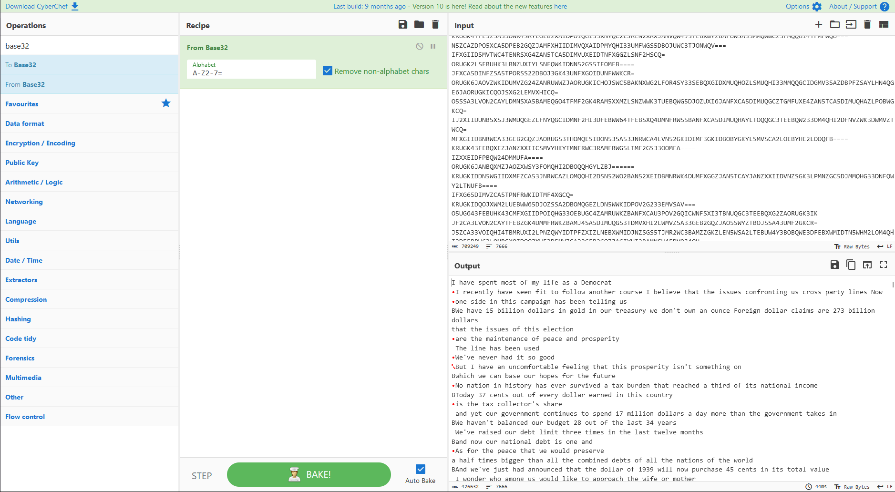

# 攻防世界 Misc PyHAHA 题目详解

**这两天刷题的时候做到了这道比较有意思的题目，于是就打算稍微总结一下。**

<!--more-->

**本题考察的知识点：pyc反编译、zip伪加密、DeEgger Embedder、base32隐写、OPT加密算法、二进制数据转图片**

**题目附件给了一个后缀为 .pyc 文件，010打开仔细查看数据，发现有倒置的 flag1 和 flag2**


**因此猜测数据杯倒置了，因此我们写个 python 脚本将数据倒置回来**

**然后 foremost 一下可以得到一个伪加密的压缩包，压缩包的注释中有 flag1 和 flag2**


**去除伪加密后解压可以得到一个 Dream It Possible.mp3**

**在这个 mp3 文件的备注中发现有一串开头为 163key 的奇怪字符**


**网上查了一下发现是网易云导出 flac 的时候会带有的标记，对解题没有什么用**

**看了网上的 wp 后知道了这里需要使用 DeEgger Embedder 提取出隐藏的数据**


**用上面那个工具可以提取出一大串 base32 编码的字符串，直接解码发现没有得到什么有用的信息**



**因此我们这里尝试 base32 隐写，这里我就偷懒直接使用 PuzzleSolver 一把梭了**


**提取base32隐写的数据可以得到一大串二进制的字符，这里还不知道具体干啥用，转图片也没有发现有用的信息**

**因此我们回头分析那个 pyc 文件，直接使用 uncompyle6 就可以反编译出原来的 Python 源码**

```bash
uncompyle6 .\reverse_1_PyHaHa.pyc > decompile.py
```

```python
# uncompyle6 version 3.9.1
# Python bytecode version base 2.7 (62211)
# Decompiled from: Python 3.8.10 (tags/v3.8.10:3d8993a, May  3 2021, 11:48:03) [MSC v.1928 64 bit (AMD64)]
# Embedded file name: Fl4g.py
# Compiled at: 2017-07-02 00:15:33
from os import urandom

def generate(m, k):
    result = 0
    for i in bin(m ^ k)[2:]:
        result = result << 1
        if int(i):
            result = result ^ m ^ k
        if result >> 256:
            result = result ^ P

    return result


def encrypt(seed):
    key = int(urandom(32).encode('hex'), 16)
    while True:
        yield key
        key = generate(key, seed) + 233333333333L


def convert(string):
    return int(string.encode('hex'), 16)


P = 115792089237316195423570985008687907853269984665640564039457584007913129640997L
flag1 = 'ThIs_Fl4g_Is_Ri9ht'
flag2 = 'Hey_Fl4g_Is_Not_HeRe'
key = int(urandom(32).encode('hex'), 16)
data = open('data.txt', 'r').read()
result = encrypt(key)
encrypt1 = bin(int(data, 2) ^ eval('0x' + hex(result.next())[2:-1] * 22))[2:]
encrypt2 = hex(convert(flag1) ^ result.next())[2:-1]
encrypt3 = hex(convert(flag2) ^ result.next())[2:-1]
print 'flag1:', encrypt2
print 'flag2:', encrypt3
f = open('encrypt.txt', 'w')
f.write(encrypt1)
f.close()

# okay decompiling .\reverse_1_PyHaHa.pyc
```

**分析上面的加密，赛后看了 wp 知道了是 OPT 加密（加密原理的具体分析在文末）**

**由上述代码可知我们之前得到的二进制数据应该就是上述代码中的 encrypt.txt**

**因此我们写一个 Python 脚本去还原出原来的数据，具体脚本如下：**

```python
from PIL import Image
import libnum
import os


def generate(m, k):
    result = 0
    for i in bin(m ^ k)[2:]:
        result = result << 1
        if int(i):
            result = result ^ m ^ k
        if result >> 256:
            result = result ^ P

    return result


def draw2pic(data):
    if os.path.exists("pic_output"):
        print("[!] pic_output 目录已存在")
    else:
        print("[+] pic_output 目录创建成功")
        os.mkdir("pic_output")
    length = len(data)
    dic = {X: int(length / X)
           for X in range(1, length) if length % X == 0}
    for item in dic.items():
        pos = 0
        img = Image.new("RGB", (item[0], item[1]))
        for x in range(item[0]):
            for y in range(item[1]):
                if data[pos] == '0':
                    img.putpixel([x, y], (0, 0, 0))
                else:
                    img.putpixel([x, y], (255, 255, 255))
                pos += 1
        img.save(f"./pic_output/{item[0]}_{item[1]}.png")
        print(
            f"./pic_output/{item[0]}_{item[1]}.png Saved!")


if __name__ == "__main__":
    P = 115792089237316195423570985008687907853269984665640564039457584007913129640997
    flag1 = 'ThIs_Fl4g_Is_Ri9ht'
    flag2 = 'Hey_Fl4g_Is_Not_HeRe'
    encrypt2 = 0xec8d57d820ad8c586e4be0122b442c871a3d71cd8036c45083d860caf1793ddc
    encrypt3 = 0xc40a0be335babcfbd8c47aa771f6a2ceca2c8638caa5924da58286d2a942697e
    encrypt1 = open('encrypt.txt', 'r').read()
    key2 = encrypt2 ^ libnum.s2n(flag1)
    key3 = encrypt3 ^ libnum.s2n(flag2)
    print(key2)
    print(key3)
    tmp = key3 - 233333333333
    for i in range(0, 255):
        tmp = generate(tmp, 0)
    seed = tmp ^ key2
    print('Found seed:', seed)
    print('use seed generate key3:', generate(key2, seed)+233333333333)
    tmp = key2 - 233333333333
    for i in range(0, 255):
        tmp = generate(tmp, 0)
    key1 = tmp ^ seed
    print('Found key1:', key1)
    print('use key1 generate key2:', generate(key1, seed)+233333333333)
    tmp1 = hex(int(encrypt1, 2))
    tmp2 = '0x'+hex(key1)[2:]*22
    pic_data = bin(int(tmp1, 16) ^ int(tmp2, 16))[2:]
    draw2pic(pic_data)
```

**脚本运行后即可得到有 flag 的图片**


**OPT(One-Time Pad)（一次性密码本）加密详解**

TODO

---

> Author: [Lunatic](https://goodlunatic.github.io)  
> URL: https://goodlunatic.github.io/posts/bc64ef8/  

