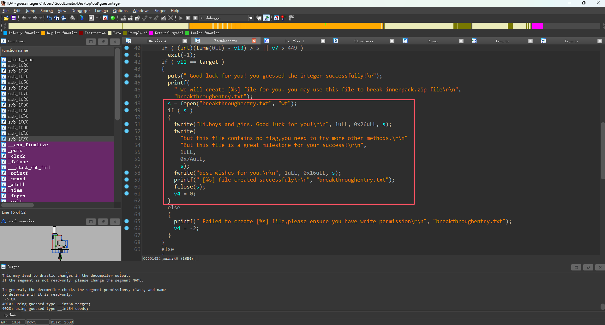
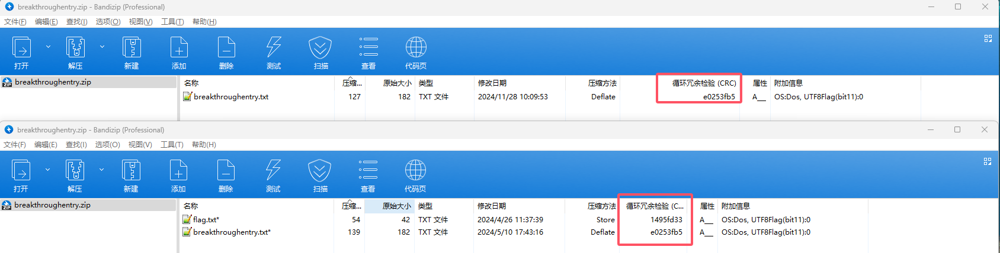

# 2024 长城杯信息安全铁人三项赛 Misc Writeup


**不愧是竞速长城杯，时间这么短，只能说强度很高**。

<!--more-->

> 本文中涉及的具体题目附件可以进我的交流群获取，进群详见 [About](https://goodlunatic.github.io/about/)

## 题目名称 压一压

**题目附件给了一个 压一压.zip，然后里面有一个 flag.7z 和一个 pass.txt**

**pass.txt 中是一串有一个 ? 的字符串，经过尝试发现是掩码爆破**

**试着手动解了几层，发现一共有三种类型的压缩包：7z、rar、zip**

**于是写一个 Python 脚本逐层爆破解套即可**

**全部解压完以后可以得到一个 flag.txt ，内容如下**

```
congratulations ，but did you notice  the "?" ,combine all of them plz.
```

**由此可知有信息隐藏在了掩码中的?里，于是进一步修改脚本，提取每层密码中的?位置的字符**

**全部提取完后，仔细观察发现了 89504e470d0a 这个图片的文件头，使用 CyberChef 转为图片可以得到下图**


**由这个提示可知，压缩包的后缀隐写了摩斯电码，修改脚本将隐写的数据提取出来，然后解摩斯电码即可得到 flag**


**完整的提取脚本如下：**

```python
from string import printable
import zipfile
import rarfile
import py7zr
import os


def decompress_7z(archive_file):
    with py7zr.SevenZipFile(archive_file, 'r') as archive:
        file_list = archive.list()
        new_archive_file = file_list[0].filename
    table = printable[:62]
    with open("pass.txt", 'r') as f:
        part_passwd = f.read().strip()
    for item in table:
        passwd = part_passwd.replace("?", item)
        try:
            # print(f"正在尝试密码：{passwd}")
            with py7zr.SevenZipFile(archive_file, mode='r', password=passwd) as archive:
                archive.extractall("tmp/")
            print(f"用{passwd}成功解压缩")
            data.append(item)
            break
        except:
            pass
    os.remove(archive_file)
    os.remove("pass.txt")
    os.system("mv tmp/* .")
    os.rmdir("tmp")
    return new_archive_file


def decompress_rar(archive_file):
    with rarfile.RarFile(archive_file, 'r') as rar_ref:
        file_list = rar_ref.namelist()
        new_archive_file = file_list[0]
        # print(new_archive_file)
    table = printable[:62]
    with open("pass.txt", 'r') as f:
        part_passwd = f.read().strip()
    for item in table:
        passwd = part_passwd.replace("?", item)
        try:
            # print(f"正在尝试密码：{passwd}")
            with rarfile.RarFile(archive_file, 'r') as rar_ref:
                rar_ref.extractall(path="tmp/", pwd=passwd.encode())
            print(f"用{passwd}成功解压缩")
            data.append(item)
            break
        except:
            pass
    os.remove(archive_file)
    os.remove("pass.txt")
    os.system("mv tmp/* .")
    os.rmdir("tmp")
    return new_archive_file


def decompress_zip(archive_file):
    with zipfile.ZipFile(archive_file, 'r') as zip_ref:
        file_list = zip_ref.namelist()
        new_archive_file = file_list[0]
    os.mkdir("tmp")
    table = printable[:62]
    with open("pass.txt", 'r') as f:
        part_passwd = f.read().strip()
    for item in table:
        passwd = part_passwd.replace("?", item)
        try:
            # print(f"正在尝试密码：{passwd}")
            with zipfile.ZipFile(archive_file, 'r') as zip_ref:
                zip_ref.extractall(path="tmp/", pwd=passwd.encode())
                print(f"用{passwd}成功解压缩")
                data.append(item)
                break
        except:
            pass
    os.remove(archive_file)
    os.remove("pass.txt")
    os.system("mv tmp/* .")
    os.rmdir("tmp")
    return new_archive_file


if __name__ == "__main__":
    data = []
    morse_code = []
    archive_file = "flag.7z"
    # archive_file = "flag.zip"
    # archive_file = "flag.rar"
    while True:
        if "7z" in archive_file:
            archive_file = decompress_7z(archive_file)
            morse_code.append("-")
        elif "rar" in archive_file:
            archive_file = decompress_rar(archive_file)
            morse_code.append("/")
        elif "zip" in archive_file:
            archive_file = decompress_zip(archive_file)
            morse_code.append(".")
        else:
            break
print("掩码隐写内容如下：")
print("".join(data))
print("后缀隐写内容如下")
print("".join(morse_code))
```

## 题目名称 Flow

**题目附件给了一个流量包，打开，拉到最下面，追踪TCP流**

**看到一串熟悉的字符串，base32解码即可得到 flag：flag{0ddeff-g9ef9ef0-defffef-mkt25gtf-kf}**


## 题目名称 pcap

题目附件给了一个流量包，打开发现主要是 HTTP 和 TCP 流量

尝试直接导出 HTTP 对象，筛选一下，发现在里面发现一个 file.zip

直接导出即可得到一个加密的压缩包


在压缩包的注释中得到 key:66666666，压缩包中还有一个 1.txt


直接用 010 打开压缩包，尝试修改两个加密位后发现是伪加密


解压压缩包后可以得到一大串 base64 编码后的字符串，猜测是 base64隐写，这里就偷懒直接用 Puzzle Solver 一把梭了


解密 base64 隐写后可以得到密文，结合之前得到的 key，经过尝试发现是 DES 加密
因此我们直接 DES 解密即可得到 flag：flag{2_Hell0_ctf_world_2}


## 题目名称 clocked

**题目附件给了一个压缩包，打开发现缺少了文件头，给它补上 504B0304**

**解压后得到了一个 elephant 文件，用010打开发现是一张base64编码后的图片**

**用CyberChef解码即可得到以下图片**


**然后用 cloacked-pixel 解密即可，密钥就是 cloacked-pixel**


**然后用010打开发现是个压缩包，该后缀为 zip 解压即可得到flag**

**flag{just_a_demo_picture}**


## 题目名称 ctfer

**附件给了一个加密的压缩包，直接用弱密码爆破得到密码是123321**


**解压压缩包可以得到一个 ctfer.png 和一个 secret.py**

**secret.py 内容如下**

```
the password is "Hav1F6n",plz use it to solve other wav by py.
```

**根据提示可以知道那个 png 图片中藏了一个 wav 文件**

**根据 wav 的文件头手动提取即可**


**把 wav 文件头前的所有数据都删除，然后用 CyberChef 解码并保存即可**


**然后用stegpy解密即可得到flag，解密密钥就是 secret.txt 中的 Hav1F6n**

**flag{57d69ef29caff0c7ad2fc921ee6c8e06}**


## 题目名称 Device

**题目附件给了一个 pcapng 流量包文件，用Wireshark打开发现一堆红条和黑条，因此猜测是加密了**

**在没有解密的情况下翻阅流量包，发现有两个可疑文件，server.key 和 keep_going.jpg**

**因此尝试将这两个文件导出**


**图片导出的时候，wireshark直接选择原始数据然后另存为即可**


**然后在010中打开，把 jpg 文件头前的数据删除改后缀为.jpg即可得到图片**


**发现 server.key 的内容是RSA私钥，因此联系以前做过的题目，感觉是TLS加密**

**因此我们打开 编辑->首选项->Protocols->TLS ，并把 server.key 导入**


**点击确认后再查看流量包，发现已经解密了（这里如果无法解密，有可能是Wireshark有问题，可以重新安装一个)**

**直接在过滤器中输出 tls 进行过滤，就可以看到解密后出题人的各种操作**

**然后在流 3132 中可以看到哥斯拉的代码，然后加密的 key=e45e329feb5d925b**


**有了加密的 key 之后就可以开始解密后面的操作了，具体的解密原理可以看我流量分析的那篇博客**

**然后在流 3149 中发现了 picture_passwd=053700357621**


**然后直接用这个密钥 steghide 解密之前提取出来的那张图片即可得到 flag：flag{i_am_4_Sk111ed_H4ck32}**


**这里还有一个小插曲，就是出题人在test目录下写了一个假的flag，可能有的师傅被这个假flag误导了**


**但是综上所述，只要会解密 TLS 和哥斯拉流量，这道题还是不难的。**

**很多师傅分析 Webshell 流量都是用一把梭脚本辅助分析的，之前自己也写过冰蝎的一把梭脚本**

**哥斯拉的一把梭脚本就等我之后写完再放上来吧**

## 题目名称 决赛-zip_guessinteger

题目附件给了一个加密的压缩包，看到`store`压缩方法，猜测需要我们使用明文攻击破解


然后发现里面那个压缩包的名字很长，甚至远超过了12字符，因此满足压缩包明文攻击的要求

为了避免`.`和`+`这俩符号对明文攻击的影响，我们把里面的压缩包重命名一下


然后使用以下命令进行明文攻击

```bash
echo -n "breakthroughentry" > plain1.txt

bkcrack -C zip_guessinteger-20240524095540-lxuhr4t.zip -c breakthroughentry.zip -p plain1.txt -o 30  -x 0 504B0304

bkcrack -C zip_guessinteger-20240524095540-lxuhr4t.zip -k 003e5ac3 885a9927 00c436d9 -U out.zip 123
```


然后使用密码`123`解压压缩包可以得到下面这几个文件


`md.txt`里内容如下

> 恭喜你，已经破解了这个zip包。这是成功的第一步。还需要您破解内部的zip包。你可能需要先从研究guessinteger入手哦。期待你的好消息。

`guessinteger` 是个Linux下的可执行文件，但是缺少动态链接库没法直接执行


因此我们使用IDA打开，逆向一下，发现就是一个简单的生成明文的程序



我们手写一下生成明文的`cpp`代码，Linux下编译并运行即可得到明文


```c++
#include<bits/stdc++.h>
using namespace std;

int main(){
	FILE *s;
	s = fopen("breakthroughentry.txt", "wt");
	if ( s )
	{
		fwrite("Hi.boys and girs. Good luck for you!\r\n", 1uLL, 0x26uLL, s);
		fwrite(
			"but this file contains no flag,you need to try more other methods.\r\n"
			"But this file is a great milestone for your success!\r\n",
			1uLL,
			0x7AuLL,
			s);
		fwrite("best wishes for you.\r\n", 1uLL, 0x16uLL, s);
		printf(" [%s] file created successfuly\r\n", "breakthroughentry.txt");
		fclose(s);
	}
	return 0;
}
```

压缩成压缩包后可以发现CRC校验一致



然后我们用010打开那个加密的压缩包，从`ushort deVersionMadeBy == 63`可以知道出题人是用`7z`压缩的这个文件


因此我们尝试用`7z`压缩明文，然后用以下命令进行明文攻击即可

这里我为了方便，把加密压缩包重命名为`flag.zip`了

```bash
bkcrack -C flag.zip -c 'breakthroughentry.txt' -P breakthroughentry.zip -p breakthroughentry.txt

bkcrack -C flag.zip -k 04d5c2a8 d6b29a38 09c04226 -U out.zip 123
```


最后使用密码`123`解压压缩包即可得到flag：`flag{ea4c4090-a512-47ed-a817-8771e1640a63}`

## 题目名称 RSA

```python
import gmpy2
from Crypto.Util.number import *

p = 3570689330324393
q = 8539449885098290729
e = 17
c = 11499128260801730440456056246212361
n = p*q
phi = (p-1)*(q-1)
d = gmpy2.invert(e, phi)
m = pow(c, d, n)
# print(m)
print(long_to_bytes(m))
# b'flag{p*q*r*s_'
```

**先用 yafu 对n进行分解**


```python
import gmpy2
from Crypto.Util.number import *

n = 0xe708251f8e8b616121419de1369f44b4a92f9641b8270ae6c50cef2bb6548de7633176399640a553cc764ab02decfd4cbe45

c = 0x8a20cca012e973b2a8ca161bd1e82804714cc75bd1238f8579cc7a5143c8bb955320b8c2811dc98a4547e9f4fe856e039630

e = 0x10001
p = 1235542029039790988583258906019
q = 1235542029039790988583258906103
r = 1235542029039790988583258906107
s = 1235542029039790988583258906163

phin = (p - 1) * (q - 1) * (r-1) * (s-1)
d = gmpy2.invert(e, phin)

m = pow(c, d, n)
print(long_to_bytes(m))
# b'32cacb2f994f6b42183a1300d9a3e8d6'
```

## 题目名称 problem

```python
import numpy as np
b = [365.3380741019429, 382.9348279538775, 400.42579800048895, 417.69442927923313, 434.6303893364646, 451.1328235950389, 467.1129885608525, 482.49611309888235, 497.2224159317516, 511.24728909914063, 524.5407330215357, 537.0861907152837, 548.8789697709385, 559.924456152371, 570.2363118210399, 579.8348106134365, 588.7454100986312, 596.9975917422082, 604.623940363264, 611.6593889049138, 618.1405346943841, 624.1049414214108, 629.5903729819167, 634.6339513469939, 639.2712778511839, 643.5355931639111, 647.4570665963693, 651.062296802938, 654.3740761160973, 657.4114277566009, 660.1898800636891, 662.721905822581, 665.0174360076303, 667.0843591835542, 668.9289382235431, 670.5561080544453, 671.9696524780957, 673.1722857205089, 674.1656791346916, 674.9504738581217, 675.5263092044213, 675.891880219468,
     676.0450227999515, 675.9828157869154, 675.7016878388554, 675.1975206792983, 674.4657457122553, 673.5014344953479, 672.2993835499913, 670.854191183101, 669.160320557414, 667.212141256343, 665.0039417550423, 662.5299065386313, 659.7840521403762, 656.7601145259869, 653.4513760321006, 649.850415511934, 645.9487639524807, 641.7364532425047, 637.2014601736236, 632.329070655695, 627.1012169780441, 621.4958678310563, 615.4865699906779, 609.0422464759123, 602.1273458417706, 594.7024119149082, 586.725106882277, 578.1516794116279, 568.9388298736699, 559.04589174303, 548.437224306799, 537.0846965991266, 524.9701337618151, 512.0875920842229, 498.44532620026223, 484.06731192301584, 468.9941939012366, 453.283542943475, 437.0093373305306, 420.2606273426102, 403.1394006941144, 385.757733022054, 368.23437359601235]
b = [i*10**32 for i in b]


def gravity(n, d=0.25):
    A = np.zeros([n, n])
    for i in range(n):
        for j in range(n):
            A[i, j] = d/n*(d**2+((i-j)/n)**2)**(-1.5)
    return A


n = 85

A = gravity(n)
A = A.transpose()
for i in range(n):
    for j in range(n):
        A[i, j] = int(A[i, j]*10**32)
M = matrix(ZZ, n+1, n+1)
for i in range(n):
    for j in range(n):
        M[i, j] = A[i, j]
for i in range(n):
    M[n, i] = b[i]
M[:-1, -1] = 2 ^ 60
M[-1, -1] = 1
s = M.LLL()
X = s*M**-1

s = ''
for i in range(n+1):
    if X[i, -1] == -1 or X[i, -1] == 1:
        for j in range(n):
            s += chr(abs(X[i, j]))
        break
print(s)
```


---

> Author: [Lunatic](https://goodlunatic.github.io)  
> URL: https://goodlunatic.github.io/posts/bd957c3/  

