# 2023 鹏城杯联邦网络靶场协同攻防演练 Misc Writeup

**2023 鹏城杯联邦网络靶场协同攻防演练 Misc Writeup**
<!--more-->

|                  |
| :---------------------------------------------------: |
| 本文中涉及的具体题目附件可以进我的 [知识星球](https://t.zsxq.com/an6p6) 获取 |

## 题目名称 我的壁纸

题目附件给了一张jpeg、一个wav和一个txt文件，并且压缩包注释中有提示

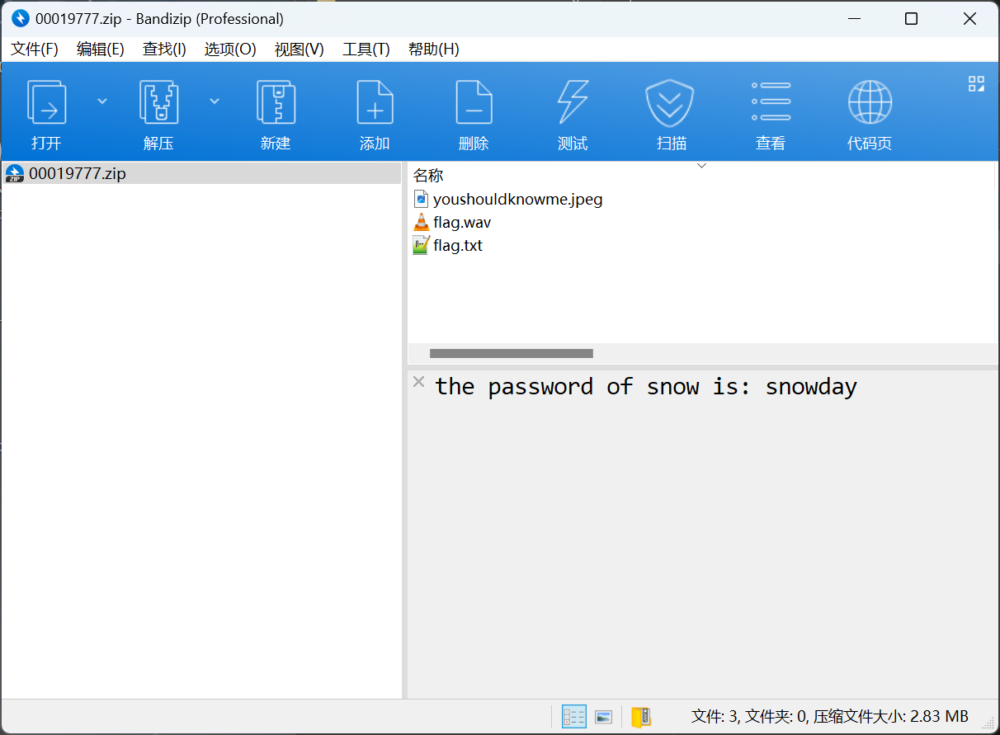

jpeg图片的exif信息中有提示：`passwd_is_7hR@1nB0w$&8`

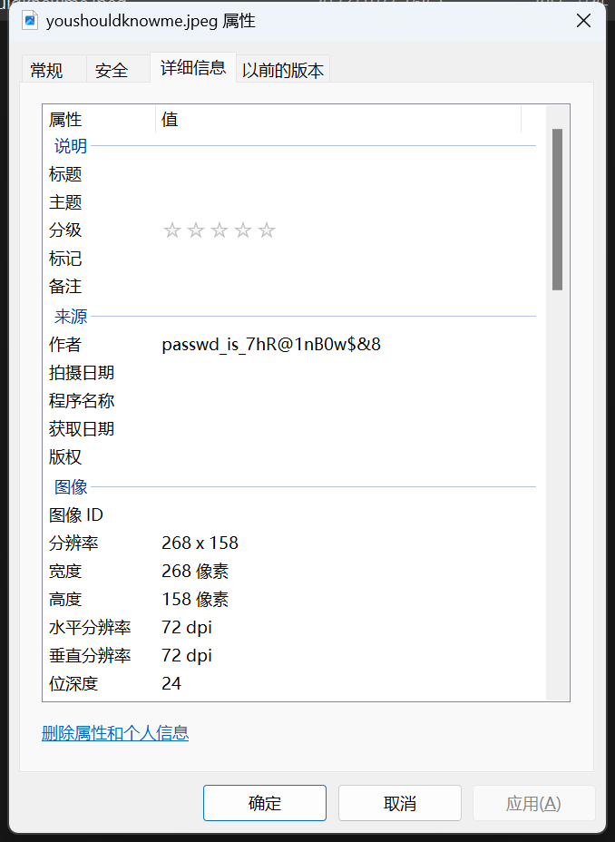

经过尝试发现是`steghide`隐写

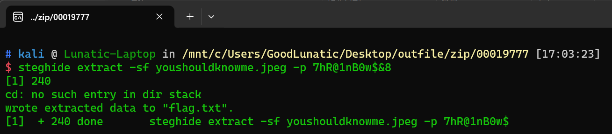

使用`steghide`提取隐写的内容，可以得到第一段flag：flag{b921323f-

第二段flag是SSTV，直接放到RX-SSTV中扫描可以得到一个二维码

扫码即可得到第二段flag：`eaa2-4d62-ace6-`

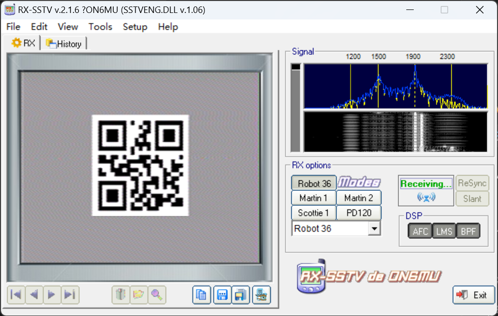

第三段flag是个SNOW隐写，密码在压缩包注释里:snowday


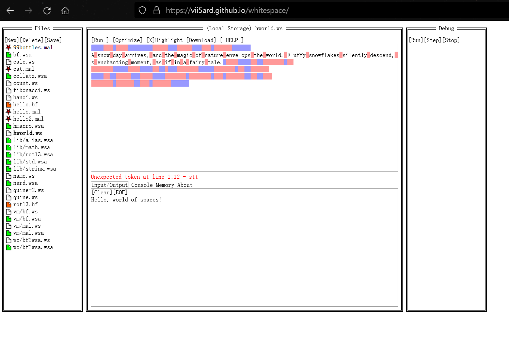

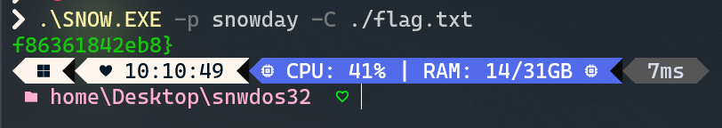

综上，最后的flag为：flag{b921323f-eaa2-4d62-ace6-f86361842eb8}

## 题目名称 流量深处

附件给了一个30MB的流量包，发现主要是UDP和ICMP的流量

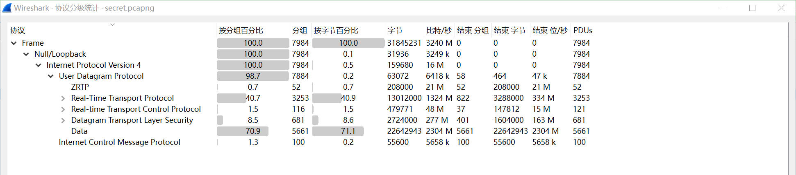

ICMP里没看出来什么信息，并且观察到UDP中的Data字节占比很高

因此我们直接用过滤器单独把UDP的流量过滤出来

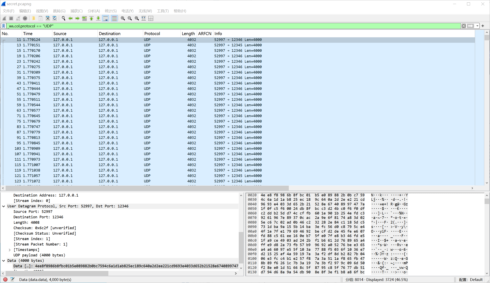

可以观察到一共向两个端口交替发送了数据，分别是12345和12346

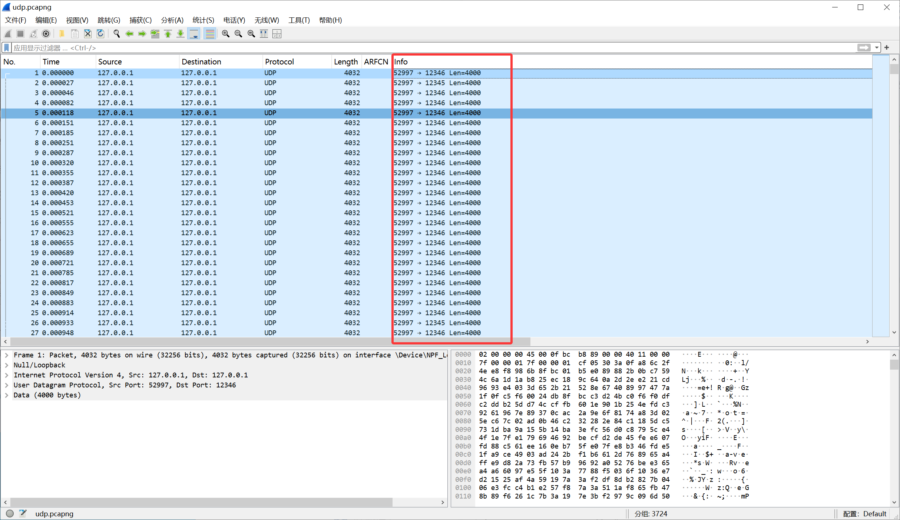

追踪UDP流，发现存在zip的特征，但是是zip的尾部数据了，并且还有个提示：`key:LP49.13_m7sdq0#J`

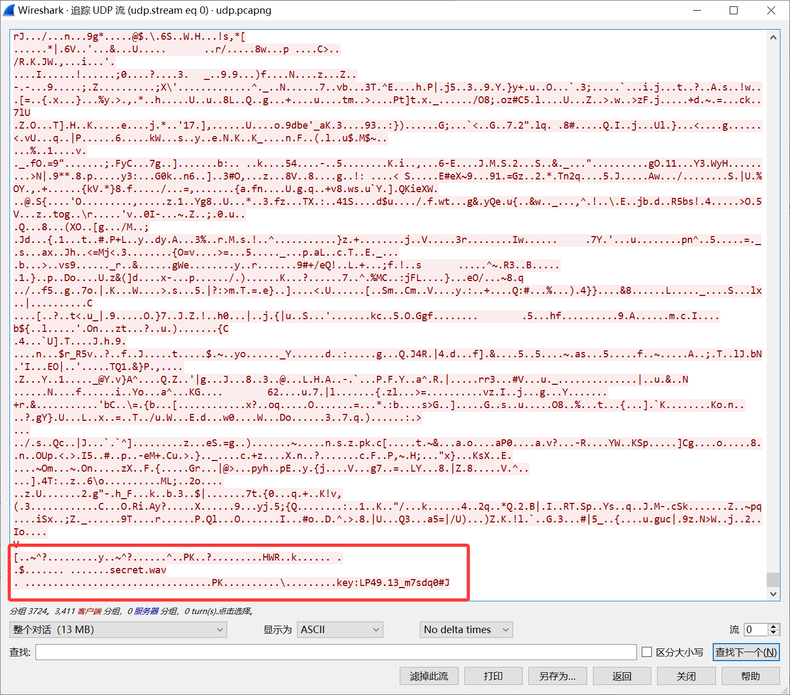

往前面找并没有发现zip的头部数据

后来知道了这里，12346端口接受的是正向的16进制数据，12345端口是反向的16进制数据

因此我们写个脚本提取一下，可以得到一个zip

```python
from scapy.all import *

def extract_udp_data(pcap_file, output_file):
    udp_data = []
    packets = rdpcap(pcap_file)

    for packet in packets:
        if UDP in packet:
            udp_payload = packet[UDP].payload
            timestamp = packet.time
            udp_data.append((timestamp, bytes(udp_payload), packet[UDP].dport))

    udp_data.sort(key=lambda x: x[0])

    with open(output_file, 'wb') as file:
        for timestamp, data, port in udp_data:
            if port == 12345:
                data = data[::-1]
            file.write(data)

if __name__ == "__main__":
    pcap_file = "secret.pcapng"
    output_file = "out.zip"
    extract_udp_data(pcap_file, output_file)
```

解压提取得到的zip可以得到一个`secret.wav`，经过尝试发现是deepsound隐写

密钥就是之前的：`LP49.13_m7sdq0#J`，提取隐写的内容可以得到一个txt，内容像是鼠标坐标

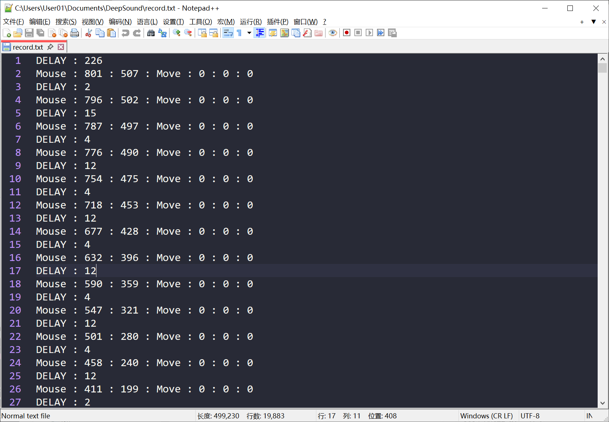

写个脚本画出轨迹即可得到最后的flag：`flag{63c30192-a5b7-741c-60e1-45e784166b2d}`

```python
import re
import matplotlib.pyplot as plt

points = []

with open("record.txt", "r", encoding="utf-8") as f:
    for line in f:
        m = re.match(r"Mouse\s*:\s*(\d+)\s*:\s*(\d+)\s*:", line)
        if m:
            points.append((int(m.group(1)), int(m.group(2))))

x = [p[0] for p in points]
y = [p[1] for p in points]

plt.figure(figsize=(8, 6))
plt.plot(x, y, linewidth=1.5, color="tab:blue")
plt.scatter(x[0], y[0], color="green", s=40, label="start")
plt.scatter(x[-1], y[-1], color="red", s=40, label="end")
plt.gca().invert_yaxis()
plt.title("Mouse Trail")
plt.xlabel("X")
plt.ylabel("Y")
plt.legend()
plt.tight_layout()
plt.savefig("mouse_trail.png", dpi=200)
```

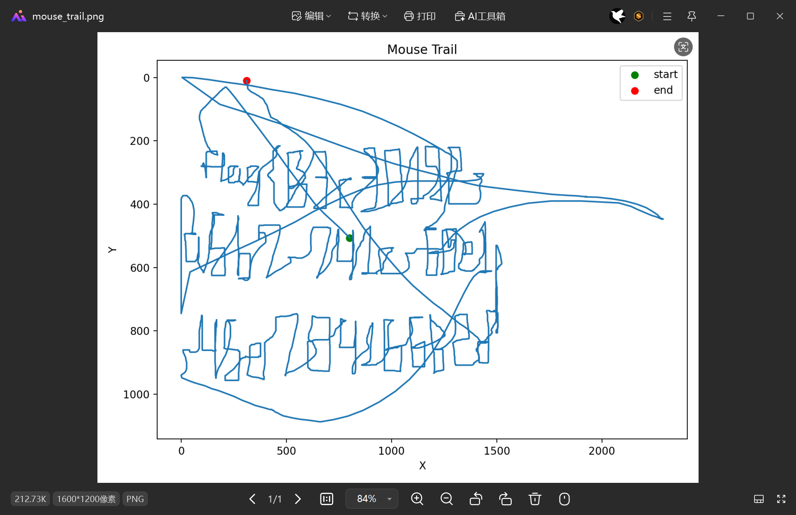

## 题目名称 2333

附件给了一张 `2333.png`，如下所示

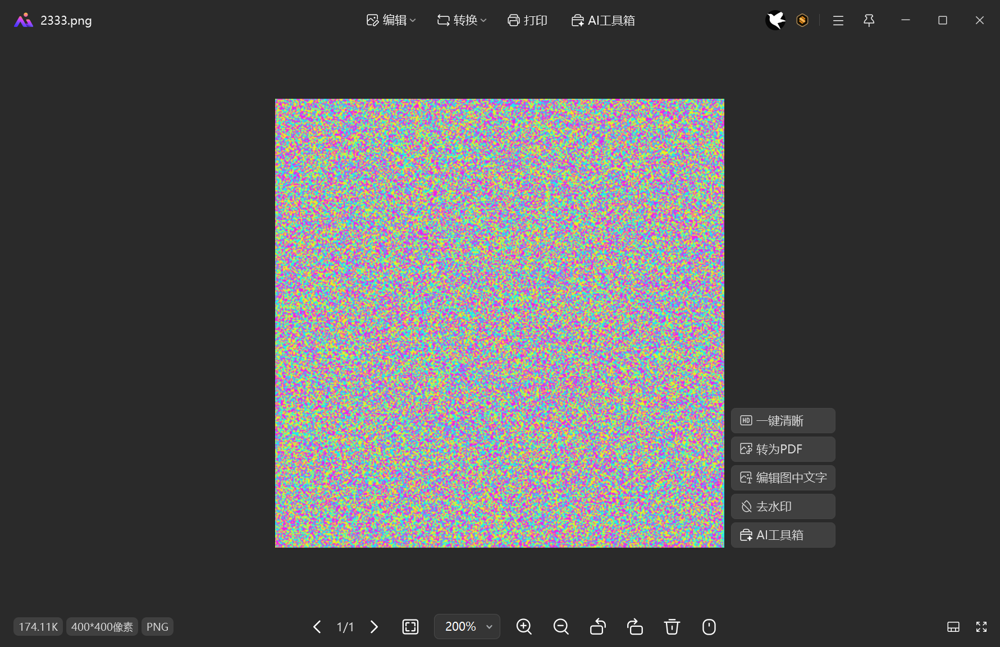

010打开，发现图片末尾还藏了另一张PNG图片，手动提取出来

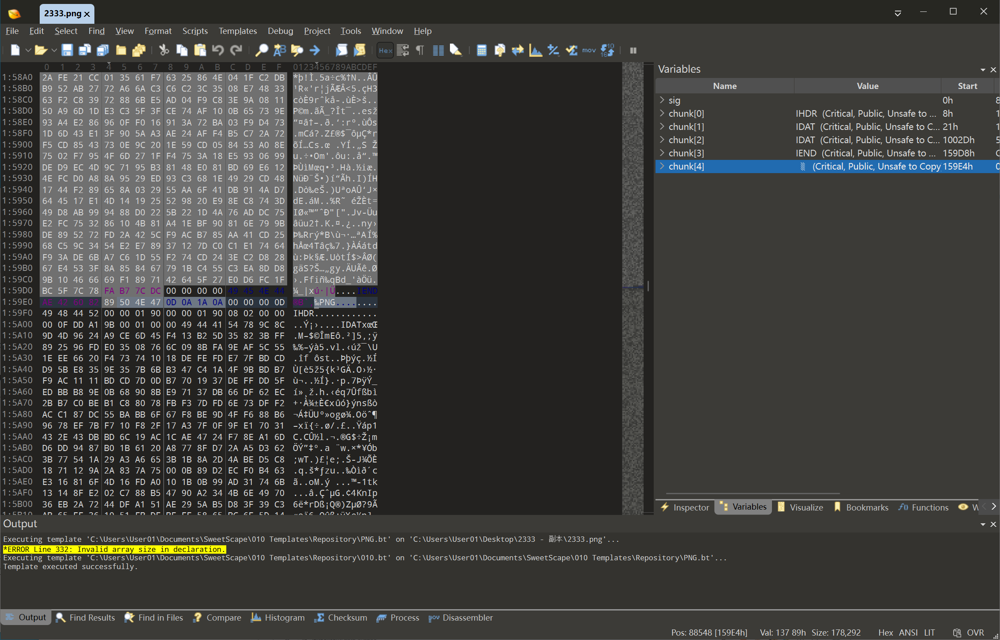

用StegSolve打开提取得到的图片，发现里面有一张QRcode，不一定要Red Plane0，很多个平面都能看到

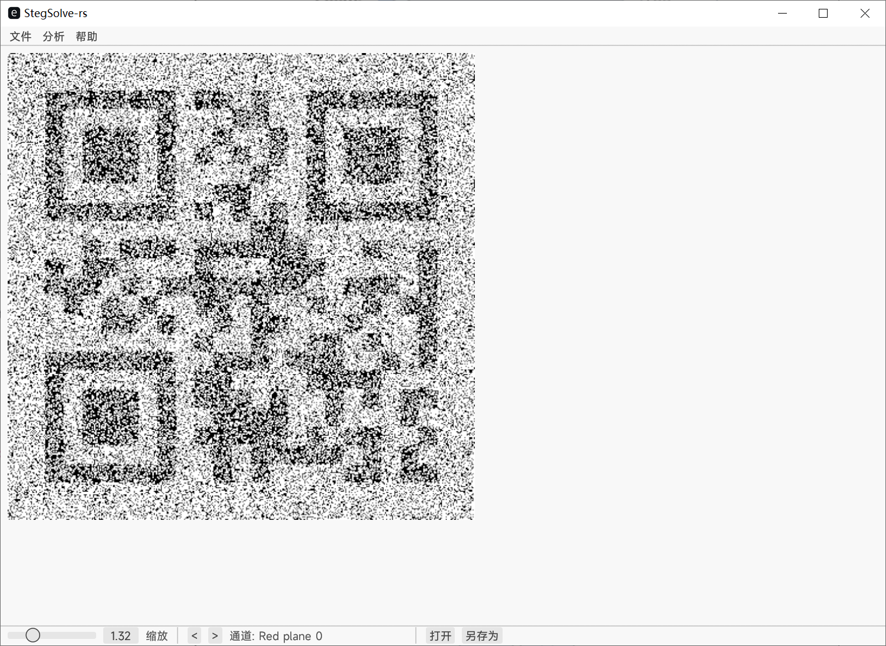

扫码可以得到 `25 70` 这两个数字


---

> 作者: [Lunatic](https://goodlunatic.github.io)  
> URL: https://goodlunatic.github.io/posts/be397f9/  

