# 2025 台州市网络安全大赛 Misc Writeup

**2025 台州市网络安全大赛 Misc Writeup**
<!--more-->

## 题目名称 pic

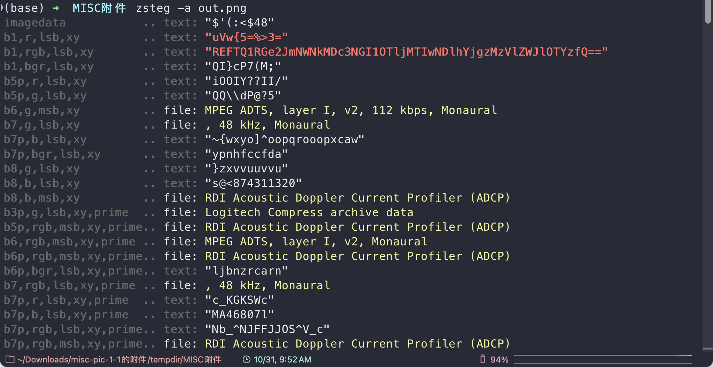

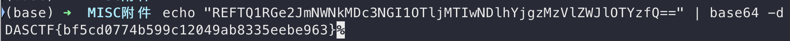

`DASCTF{bf5cd0774b599c12049ab8335eebe963}`

## 题目名称 flow

简单的 PHP-Webshell 流量分析，HTTP 流44 中找到 flag


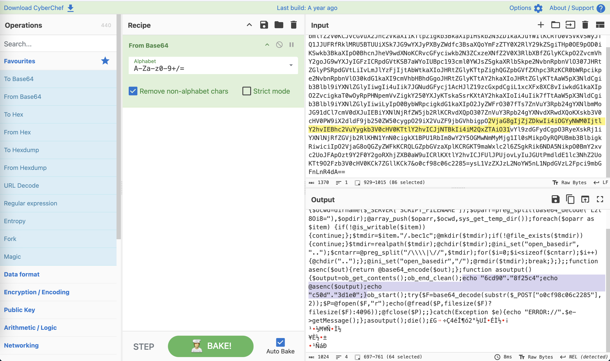

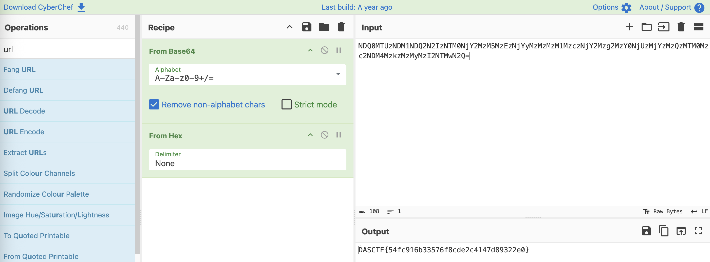

`DASCTF{54fc916b33576f8cde2c4147d89322e0}`

## 题目名称 baby-misc

原题，参考链接：[https://www.cnblogs.com/lpppp/p/18379812](https://www.cnblogs.com/lpppp/p/18379812)

附件给了一个 raw 内存镜像

我们先用 R-STUDIO 扫一下，在 DASCTF 用户的桌面上可以看到一个 hint.zip 还有一个 flag.zip

尝试提取出来，hint.zip 中有个 hint.txt，内容如下

> calc???

但是 flag.zip 是加密的

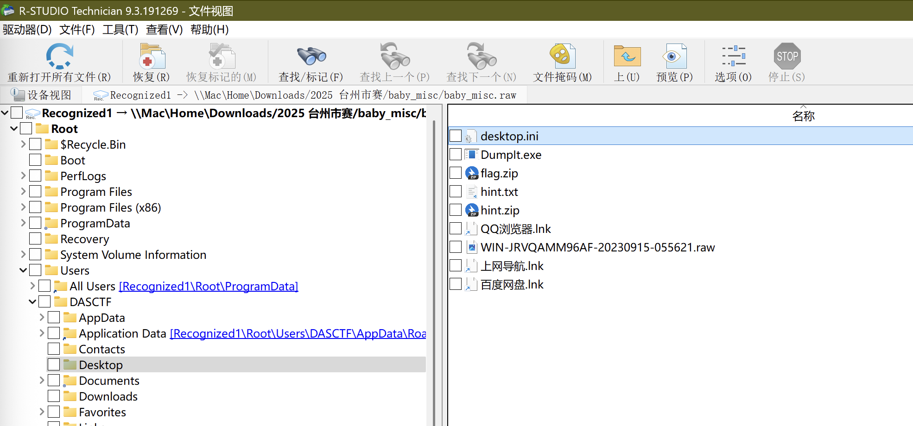

然后在 download 目录下发现另一个 flag(1).zip，里面有个 flag.txt，内容如下

> flag{b1c16538-33f1-56b1-e620-b3a3f403a7f4}

发现是 fakeflag

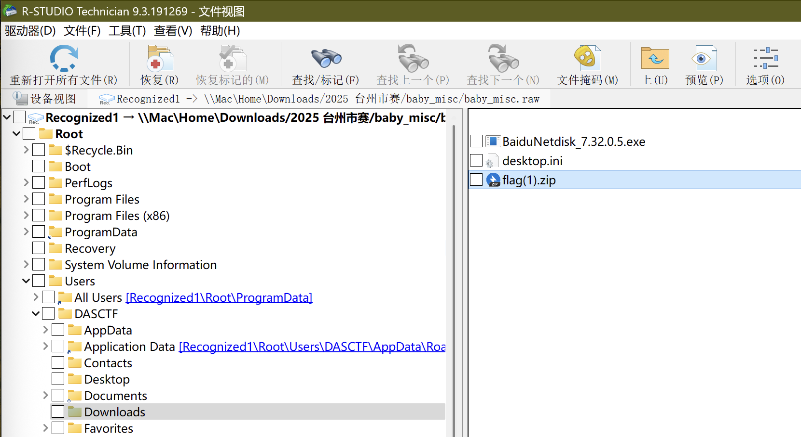

然后尝试用 vol2 对内存镜像进行取证

```bash
python2 ~/CTF/volatility2-enhanced/vol.py -f baby_misc.raw imageinfo
Volatility Foundation Volatility Framework 2.6.1
          Suggested Profile(s) : Win7SP1x64, Win7SP0x64, Win2008R2SP0x64, Win2008R2SP1x64_24000, Win2008R2SP1x64_23418, Win2008R2SP1x64, Win7SP1x64_24000, Win7SP1x64_23418
                     AS Layer1 : WindowsAMD64PagedMemory (Kernel AS)
                     AS Layer2 : FileAddressSpace (/Users/lunatic/Downloads/2025 台州市赛/baby_misc.raw/tempdir/MISC附件/baby_misc.raw)
                      PAE type : No PAE
                           DTB : 0x187000L
                          KDBG : 0xf8000404c070L
          Number of Processors : 2
     Image Type (Service Pack) : 0
                KPCR for CPU 0 : 0xfffff8000404dd00L
                KPCR for CPU 1 : 0xfffff880009ee000L
             KUSER_SHARED_DATA : 0xfffff78000000000L
           Image date and time : 2023-09-15 05:56:26 UTC+0000
     Image local date and time : 2023-09-15 13:56:26 +0800
```

扫了一下内存中的进程，发现有个 calc 进程，结合之前得到的提示，猜测这里可能有关键信息

```bash
python2 ~/CTF/volatility2-enhanced/vol.py -f baby_misc.raw --profile=Win7SP1x64 pslist
Volatility Foundation Volatility Framework 2.6.1
Offset(V)          Name                    PID   PPID   Thds     Hnds   Sess  Wow64 Start                          Exit
------------------ -------------------- ------ ------ ------ -------- ------ ------ ------------------------------ ------------------------------
0xfffffa8000cc5040 System                    4      0     81      478 ------      0 2023-09-15 00:15:21 UTC+0000
0xfffffa8002508130 smss.exe                260      4      2       30 ------      0 2023-09-15 00:15:21 UTC+0000
0xfffffa8002d35060 csrss.exe               340    328      9      311      0      0 2023-09-15 00:15:24 UTC+0000
0xfffffa8002d3a5b0 wininit.exe             380    328      3       77      0      0 2023-09-15 00:15:25 UTC+0000
0xfffffa8000cc8060 csrss.exe               396    388      8      307      1      0 2023-09-15 00:15:25 UTC+0000
0xfffffa8002d5c920 winlogon.exe            436    388      3      115      1      0 2023-09-15 00:15:25 UTC+0000
0xfffffa8002cf4b30 services.exe            484    380      6      188      0      0 2023-09-15 00:15:25 UTC+0000
0xfffffa8002daf560 lsass.exe               492    380      6      567      0      0 2023-09-15 00:15:25 UTC+0000
0xfffffa8002db1b30 lsm.exe                 500    380     10      142      0      0 2023-09-15 00:15:26 UTC+0000
0xfffffa8002e239e0 svchost.exe             620    484      9      346      0      0 2023-09-15 00:15:26 UTC+0000
0xfffffa8002e64b30 svchost.exe             692    484      7      237      0      0 2023-09-15 00:15:27 UTC+0000
0xfffffa8002ea6ac0 svchost.exe             776    484     17      458      0      0 2023-09-15 00:15:28 UTC+0000
0xfffffa8002eec740 svchost.exe             820    484     11      294      0      0 2023-09-15 00:15:29 UTC+0000
0xfffffa8002f0a890 svchost.exe             848    484     31     1054      0      0 2023-09-15 00:15:29 UTC+0000
0xfffffa8002f78260 svchost.exe             984    484     13      332      0      0 2023-09-15 00:15:30 UTC+0000
0xfffffa8002f14b30 svchost.exe             288    484     14      500      0      0 2023-09-15 00:15:30 UTC+0000
0xfffffa8002fee060 spoolsv.exe            1052    484     12      271      0      0 2023-09-15 00:15:32 UTC+0000
0xfffffa800306e920 svchost.exe            1080    484     17      305      0      0 2023-09-15 00:15:32 UTC+0000
0xfffffa80031a8060 taskhost.exe           1456    484      9      174      1      0 2023-09-15 00:15:33 UTC+0000
0xfffffa80032ba060 svchost.exe            1548    484      6       93      0      0 2023-09-15 00:15:33 UTC+0000
0xfffffa80032d2b30 dwm.exe                1816    820      3       71      1      0 2023-09-15 00:15:34 UTC+0000
0xfffffa80032af060 explorer.exe           1824   1736     25      889      1      0 2023-09-15 00:15:34 UTC+0000
0xfffffa80033a2b30 QQBrowser.exe          2032   1824      2       77      1      1 2023-09-15 00:15:37 UTC+0000
0xfffffa80033a2060 YunDetectServi         2040   1824     16      237      1      1 2023-09-15 00:15:37 UTC+0000
0xfffffa800344db30 QQBrowser.exe          1992   1908     10      412      1      1 2023-09-15 00:15:38 UTC+0000
0xfffffa80034ceb30 BaiduNetdisk.e         2308   1824     46     1080      1      1 2023-09-15 00:15:42 UTC+0000
0xfffffa80034d9060 SearchIndexer.         2332    484     11      572      0      0 2023-09-15 00:15:42 UTC+0000
0xfffffa80030e8b30 BaiduNetdiskHo         1172   2308     27      300      1      1 2023-09-15 00:16:18 UTC+0000
0xfffffa800330d910 BaiduNetdiskHo         2824   2308      6      132      1      1 2023-09-15 00:16:23 UTC+0000
0xfffffa8000e69060 sppsvc.exe             1396    484      4      148      0      0 2023-09-15 00:17:33 UTC+0000
0xfffffa8000e998d0 svchost.exe            1620    484      9      311      0      0 2023-09-15 00:17:34 UTC+0000
0xfffffa8003105670 calc.exe               1516   1824      4       78      1      0 2023-09-15 00:26:19 UTC+0000
0xfffffa8000f31060 audiodg.exe            1788    776      4      123      0      0 2023-09-15 05:56:19 UTC+0000
0xfffffa80031dab30 DumpIt.exe             1812   1824      2       46      1      1 2023-09-15 05:56:21 UTC+0000
0xfffffa8000d7e060 conhost.exe            2112    396      2       55      1      0 2023-09-15 05:56:21 UTC+0000
```

直接用以下命令导出

```bash
python2 ~/CTF/volatility2-enhanced/vol.py -f baby_misc.raw --profile=Win7SP1x64 memdump -p 1516 --dump-dir=./
```

然后改后缀为.data，拉入 GIMP 中调整

当然如果这里不知道屏幕分辨率，可尝试先用 `screenshot` 命令导出截图

```bash
python2 ~/CTF/volatility2-enhanced/vol.py -f baby_misc.raw --profile=Win7SP1x64 --plugins=/Users/lunatic/CTF/volatility2-enhanced/volatility/plugins screenshot --dump-dir=./
```

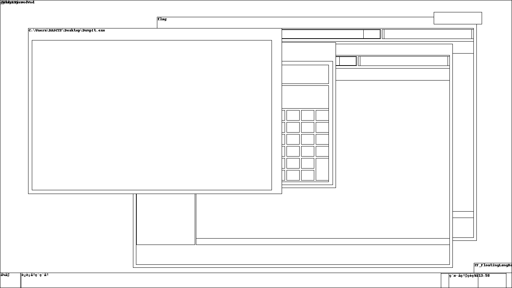

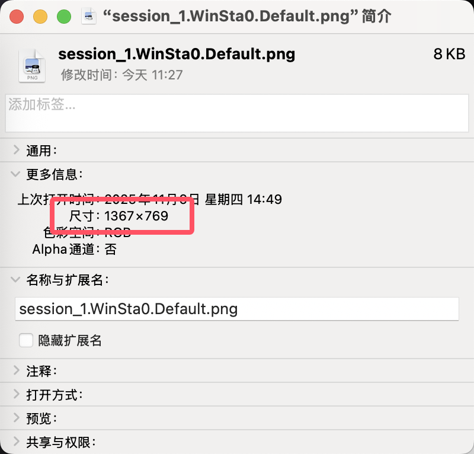

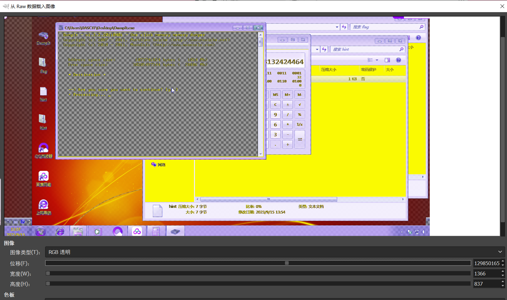

可以在计算器中得到这一串数字：`132424464`

把这串数字当成解压密码去解压，发现密码不正确

因此我们使用 vol2 的 windows 插件去打印出窗口信息

```
python2 ~/CTF/volatility2-enhanced/vol.py -f baby_misc.raw --profile=Win7SP1x64 windows | grep "132424464"
Volatility Foundation Volatility Framework 2.6.1
Window Handle: #10234 at 0xfffff900c0629680, Name: 5E26473132424464
```

十六进制转字符串即可得到解压密码：`^&G12BDd`

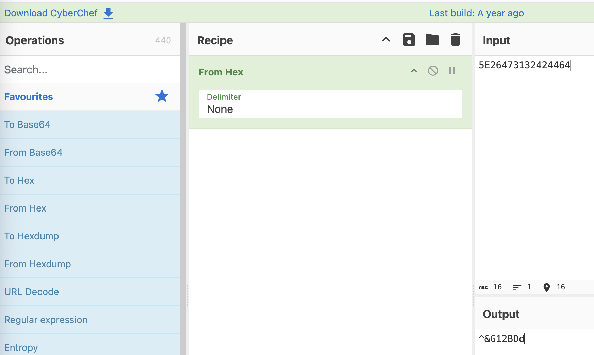

用上面得到的解压密码解压那个加密的压缩包即可得到最后的 flag:

`flag{fba99a87-2278-f175-5055-a47f5773c131}`

当然，如果不知道 windows 这个插件，也可以利用部分十六进制转字符串后生成掩码来爆破

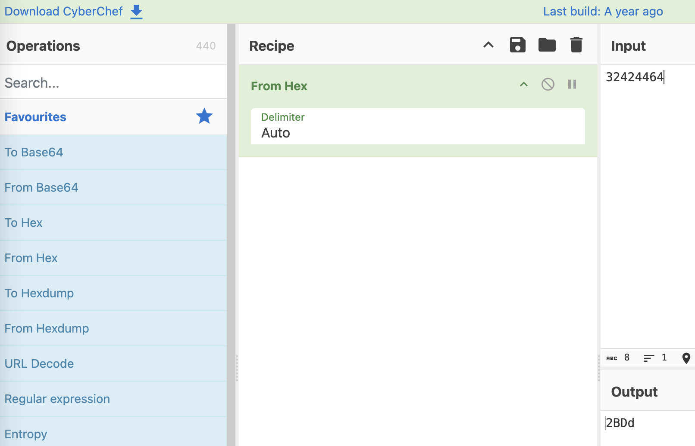

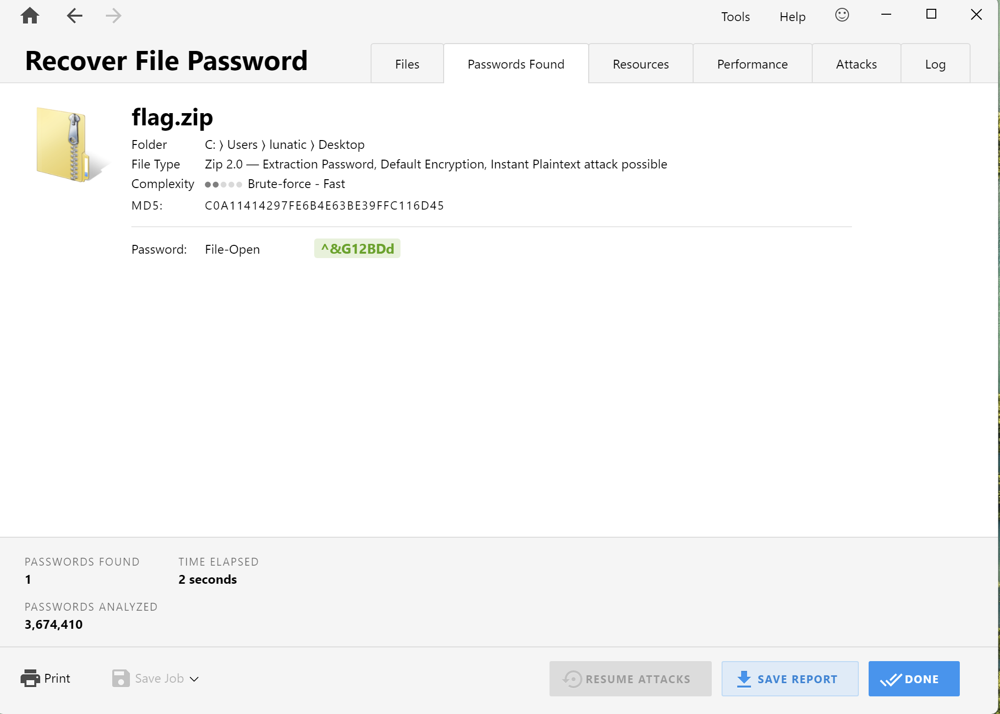


---

> 作者: [Lunatic](https://goodlunatic.github.io)  
> URL: https://goodlunatic.github.io/posts/bfeb088/  

