# 2024 浙江省大学生网络与信息安全竞赛 Misc Writeup

**2024 浙江省大学生网络与信息安全竞赛 Misc Writeup**
&lt;!--more--&gt;

&gt; 题目附件下载：https://pan.baidu.com/s/140Wxcv0w4eJJ1XX1r_sRcg?pwd=uvj4 提取码：uvj4

## 初赛
### 题目名称 签到题2
题目给了如下密文
```
6L&lt;Ak3,*@VM*&gt;7U&amp;FZFNWc,Ib=t,X!&#43;,BnSDfoaNhdiO*][5F];eV^]Lm&amp;?$&#39;&lt;oeGH&amp;6tqcgK_JDp-3;8wh?Si,G$BarTFjE?b$eR/,Igij&lt;({u90M$5If589[&lt;4&#43;jp%3_%R(526#1J|m5p&amp;H&#43;%.#d0&lt;DmLK*#-\8w:xD2Y[3jO{l8[)&lt;(F[=Bcixb&gt;Jp^%L2XvVTzW@9OTko/P74d1sFscEbMO7Vhp&amp;HM;&#43;ww/v[KM1%2M*7O\}rEZM.LM0&#39;\iwK:])pg-nJef\Rt4
```

先尝试用`basecrack`梭一把


`basecrack`可以得到如下密文
```
5C9VB8W09FG6DC9LX6J1A3T9ZY9P7BKG6&#43;M9B1AO7BI%6OTAZY91G60Z9%IBG09NIBNB9TB9
```

然后放到CyberChef中 `From base45` &#43; `From base32` 即可得到flag：`DASCTF{welcome_to_zjctf_2024}`

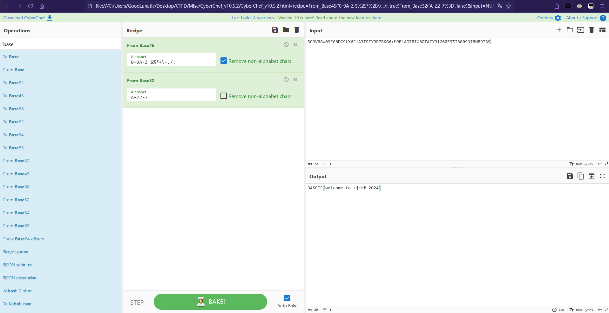

当然这里也可以直接在CyberChef中一个个尝试（要求CyberChef的版本要比较新）

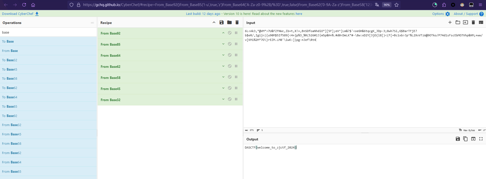

### 题目名称 RealSignin

解压附件压缩包，得到一张`out.png`


直接使用`zsteg`一把梭，可以得到一串编码和一个表，猜测是换表的base64

因此直接把两个东西复制到CyberChef中解码即可得到flag：`DASCTF{We1C0me_2_ZJCTF2024!}`

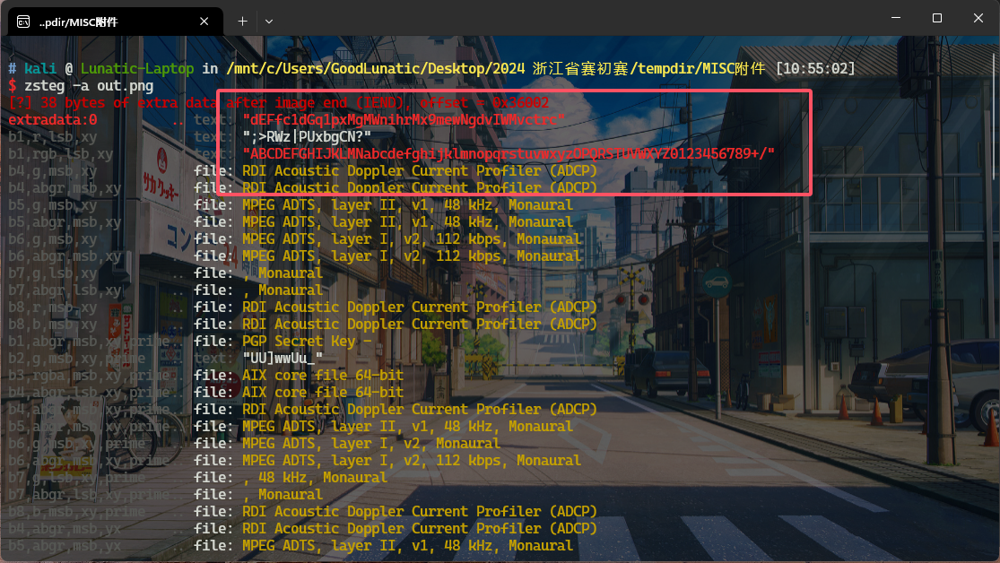

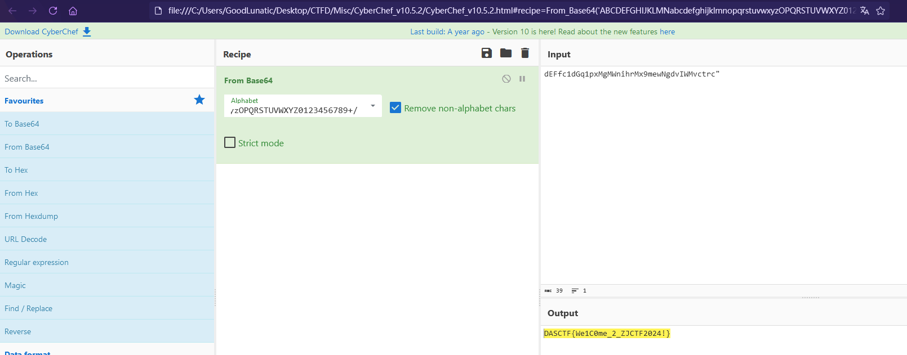

### 题目名称 机密文档

解压附件压缩包，得到一个加密的`机密文档.zip`

里面有一个`the_secret_you_never_ever_know_hahahaha.zip`，文件名很长并且还是用的Store压缩方法

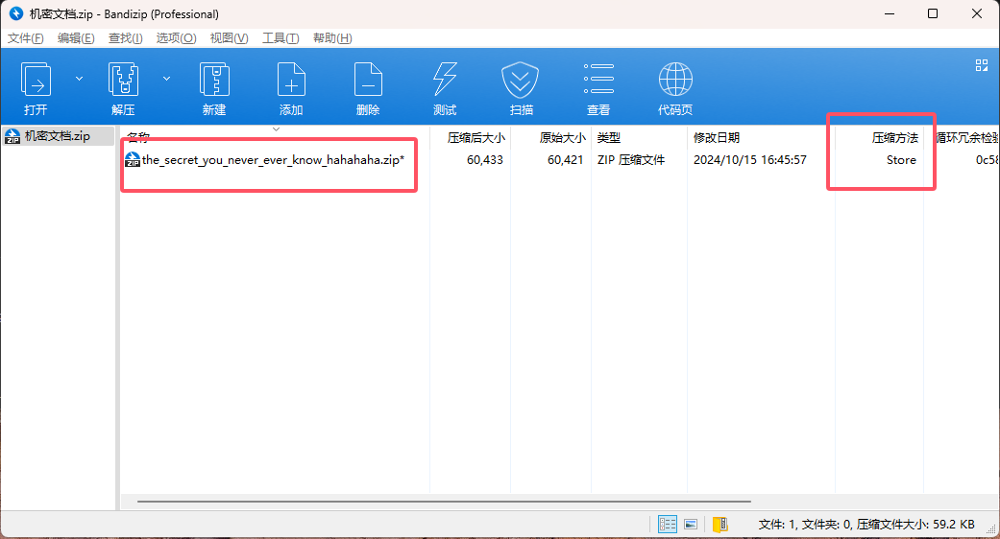

因此我们猜测考察的是压缩包的明文攻击，压缩包考点的详细讲解可以看[我的这篇博客](https://goodlunatic.github.io/posts/1ad9200/#3%E5%88%A9%E7%94%A8%E5%8E%8B%E7%BC%A9%E5%8C%85%E6%A0%BC%E5%BC%8F%E7%A0%B4%E8%A7%A3)

直接使用`bkcrack`进行明文攻击可以得到三段密钥，然后用密钥修改压缩包密码即可

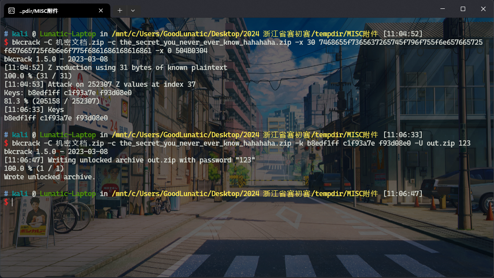

解压压缩包后得到`the_secret_you_never_ever_know_hahahaha.docm`

打开文件发现存在宏代码，因此我们尝试使用`olevba`提取宏代码


```python
olevba 0.60.1 on Python 3.8.10 - http://decalage.info/python/oletools
===============================================================================
FILE: .\the_secret_you_never_ever_know_hahahaha.docm
Type: OpenXML
WARNING  For now, VBA stomping cannot be detected for files in memory
-------------------------------------------------------------------------------
VBA MACRO ThisDocument.cls
in file: word/vbaProject.bin - OLE stream: &#39;VBA/ThisDocument&#39;
- - - - - - - - - - - - - - - - - - - - - - - - - - - - - - - - - - - - - - -
(empty macro)
-------------------------------------------------------------------------------
VBA MACRO NewMacros.bas
in file: word/vbaProject.bin - OLE stream: &#39;VBA/NewMacros&#39;
- - - - - - - - - - - - - - - - - - - - - - - - - - - - - - - - - - - - - - -
Sub key()
    Dim decValues As Variant
    Dim str As String
    Dim result As String
    Dim i As Integer
    Dim xorValue As Integer

    decValues = Array(26, 25, 28, 0, 16, 1, 74, 75, 45, 29, 19, 49, 61, 60, 3)
    str = &#34;outguess&#34;
    result = &#34;&#34;

    For i = LBound(decValues) To UBound(decValues)
        xorValue = decValues(i) Xor Asc(Mid(str, (i Mod Len(str)) &#43; 1, 1))
        result = result &amp; Chr(xorValue)
    Next i

End Sub
&#43;----------&#43;--------------------&#43;---------------------------------------------&#43;
|Type      |Keyword             |Description                                  |
&#43;----------&#43;--------------------&#43;---------------------------------------------&#43;
|Suspicious|Chr                 |May attempt to obfuscate specific strings    |
|          |                    |(use option --deobf to deobfuscate)          |
|Suspicious|Xor                 |May attempt to obfuscate specific strings    |
|          |                    |(use option --deobf to deobfuscate)          |
|Suspicious|Base64 Strings      |Base64-encoded strings were detected, may be |
|          |                    |used to obfuscate strings (option --decode to|
|          |                    |see all)                                     |
&#43;----------&#43;--------------------&#43;---------------------------------------------&#43;
```

发现就是一个简单的异或，因此我们可以使用CyberChef或者自己写个脚本解出密钥：`ulhged98BhgVHYp`

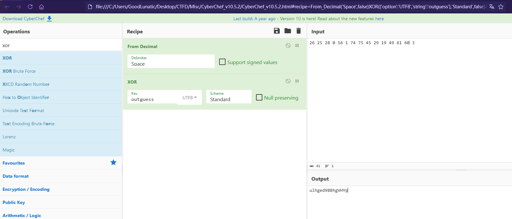

这里我脚本里给出了两种方法

```python
from pwn import xor

data = [26, 25, 28, 0, 16, 1, 74, 75, 45, 29, 19, 49, 61, 60, 3]
str = &#34;outguess&#34;
res = []

def func1():
    key = xor(data,str)
    print(key.decode())
    
def func2():
    for i in range(len(data)):
        tmp = data[i] ^ ord(str[i%(len(str))])
        res.append(chr(tmp))
    print(&#39;&#39;.join(res))
    
if __name__ == &#34;__main__&#34;:
    func1() # ulhged98BhgVHYp
    func2() # ulhged98BhgVHYp
```

这里的`str`提示了`outguess`，因此猜测这里就是图片的`outguess`隐写

把`the_secret_you_never_ever_know_hahahaha.docm`后缀改为`zip`并解压

在`the_secret_you_never_ever_know_hahahaha\word\media`目录下得到`image1.jpeg`

直接使用之前得到的密钥`outguess`解密即可得到flag：`DASCTF{B1g_S3CR3t_F0R_Y0u}`

&gt; tips：这里会报错未知的数据类型，我们直接把后缀改成jpg即可正常解密

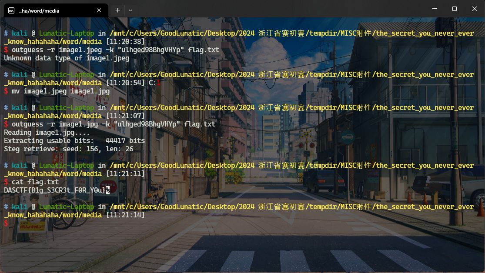

### 题目名称 EZtraffic

解压附件压缩包，得到一个pcapng文件，翻看流量包发现主要是`SMB`流量

追踪流发现传输了压缩包，因此我们直接使用Wireshark导出传输的压缩包即可

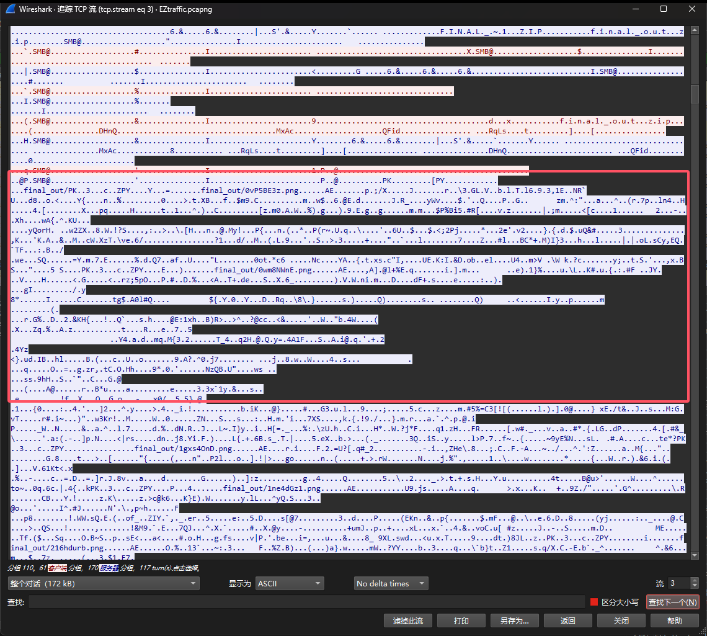

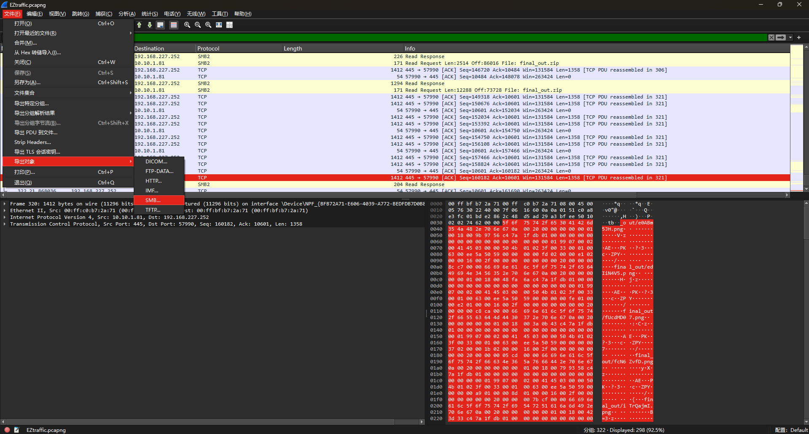

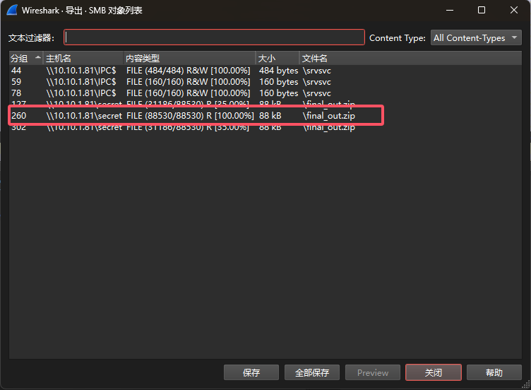

这里导出的时候要注意，选择那个`100%`的压缩包导出，另外两个压缩包是不完整的

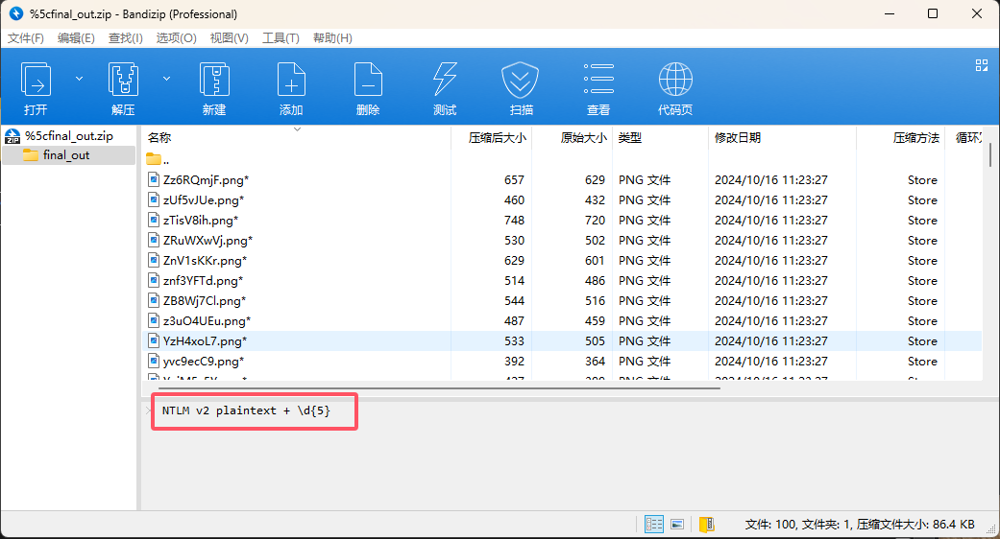

在导出的压缩包注释中发现提示：`NTLM v2 plaintext &#43; \d{5}`

因此猜测需要我们提取 NTLMv2 哈希值并破解密码，详细的步骤可以看[我的这篇博客](https://goodlunatic.github.io/posts/5422d65/#ntlm%E6%B5%81%E9%87%8F%E5%88%86%E6%9E%90)

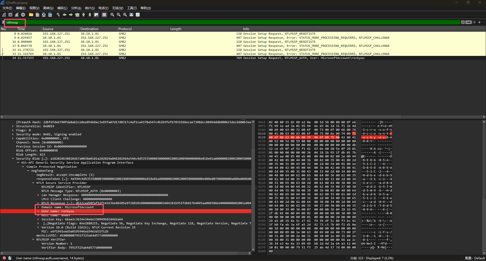

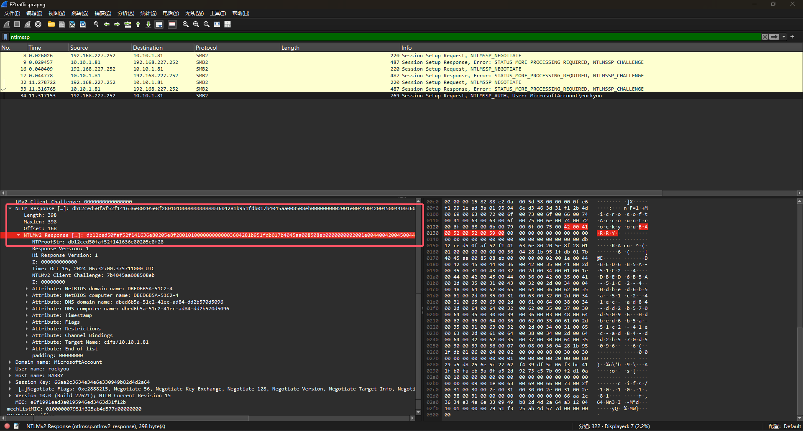

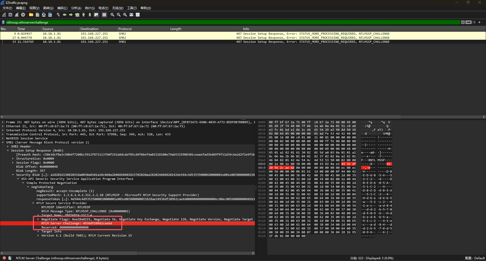

最后组合得到的hash如下
```
rockyou::MicrosoftAccount:4936df20962cae6d:db12ced50faf52f141636e80205e8f28:01010000000000003604281b951fdb017b4045aa008508eb0000000002001e00440042004500440036004200350041002d0035003100430032002d00340001001e00440042004500440036004200350041002d0035003100430032002d00340004004800640062006500640036006200350061002d0035003100630032002d0034003100650063002d0061006400380034002d0064006400320062003500370030006400350030003900360003004800640062006500640036006200350061002d0035003100630032002d0034003100650063002d0061006400380034002d00640064003200620035003700300064003500300039003600070008003604281b951fdb01060004000200000008003000300000000000000001000000002000008029a5d8256e5c2762f439df5c06f3bc411fb0faeb3a6fa52d9273c57b09f2d10a0010000000000000000000000000000000000009001e0063006900660073002f00310030002e00310030002e0031002e00380031000000000000000000
```

然后使用hashcat字典爆破即可得到密码：haticehatice

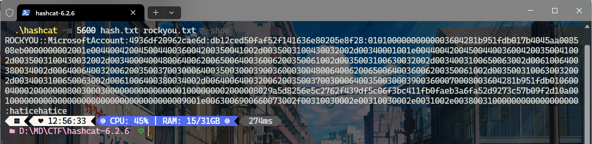

因此我们现在就可以去爆破之前提取出来的压缩包的密码

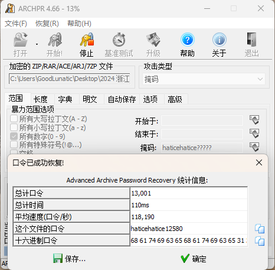

爆破得到压缩包解压密码为：`haticehatice12580`, 解压后得到100张图片碎片，猜测是拼图

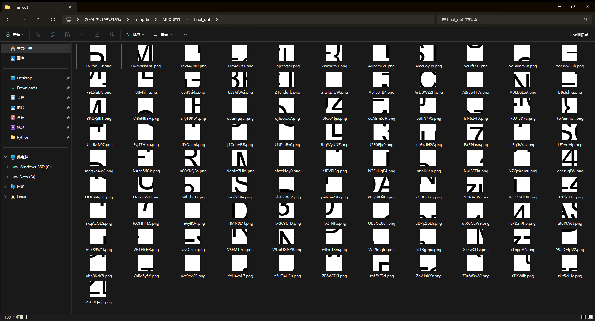

这里我拿gaps大致拼了一下，然后尝试手动拼图

```
magick montage *.png -tile 10x10 -geometry &#43;0&#43;0 out.png
```

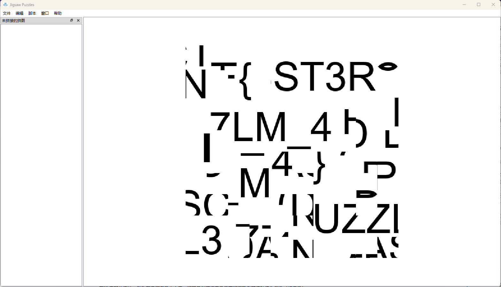

gaps可以大致拼出来 `DASCTF` `PUZZL3` `ST3R` 这几个字符

尝试用PPT手动拼图，发现光靠这样是不可能拼出来的，比赛的时候就更加了。。

手动拼出下面的这几个字符串已经是本人的极限了。。。

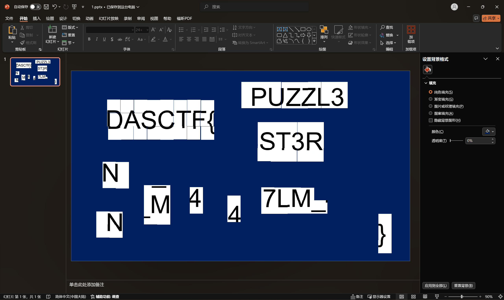

因此猜测，图片中一定是隐藏了正确的顺序，我们尝试使用`stegsolve`打开其中一张拼图

发现在红色0通道LSB隐写了一张二维码

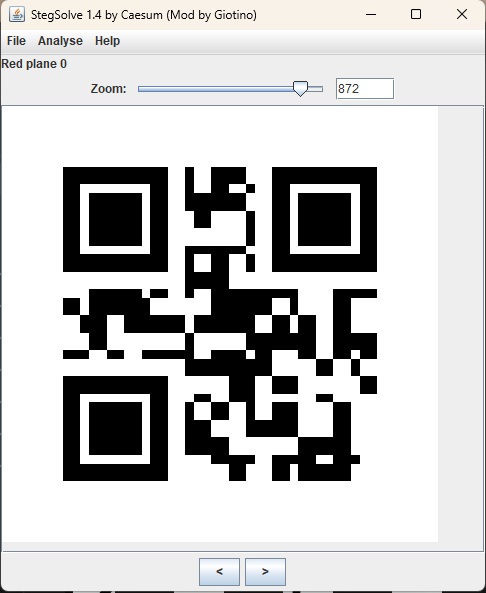

扫码可以得到数字，猜测这个数字应该就是拼图的正确顺序

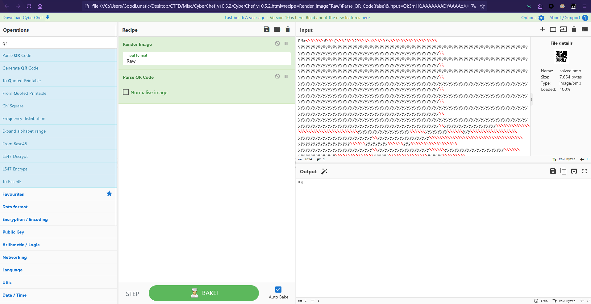

因此我们写个脚本把所有的顺序提取出来，并将拼图碎片按照顺序拼起来即可得到最后的flag

`DASCTF{N7LM_4ND_PUZZL3_M4ST3R}`

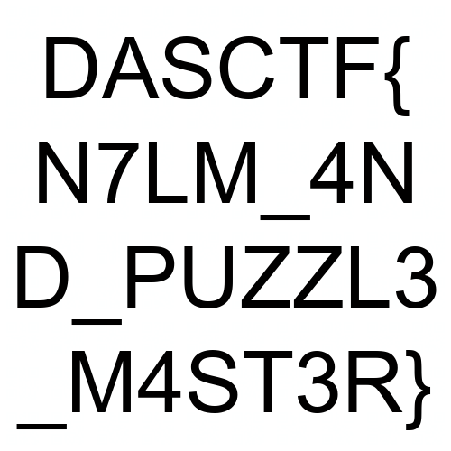

最终的解题代码如下：

```python
from PIL import Image
from pyzbar.pyzbar import decode
import os

def extract_lsb(imgname):
    r = []
    img = Image.open(imgname)
    width,height = img.size
    for x in range(width):
        for y in range(height):
            pixel = img.getpixel((x,y))
            r.append(str(pixel[0] &amp; 1))
            # print(pixel)
    bin_data = &#39;&#39;.join(r)
    return bin_data  
            
def bin2img(bin_data):
    imgname = &#34;tmp.png&#34;
    pixels = []
    img = Image.new(&#34;RGB&#34;,(50,50))
    for item in bin_data:
        if item ==&#39;0&#39;:
            pixels.append((0,0,0))
        else :
            pixels.append((255,255,255))
    img.putdata(pixels)
    # img.show()
    img = img.resize((500,500)) 
    # 这里调整一下图片的大小，便于后面pyzbar的识别
    img.save(imgname)
    return imgname
    
    
def read_qrcode(imgname):
    img = Image.open(imgname)
    decode_data = decode(img)
    # print(decode_data)
    res = decode_data[0].data.decode()
    os.remove(imgname)
    return res
        
def rename_img():
    filenames = os.listdir(&#34;./final_out&#34;)
    for filename in filenames:
        try:
            src_img = &#34;./final_out/&#34;&#43;filename
            bin_data = extract_lsb(src_img)
            imgname = bin2img(bin_data)
            res = read_qrcode(imgname)
            dst_img = f&#34;./final_out/{res}.png&#34;
            os.rename(src_img,dst_img)
            print(f&#34;[&#43;] {src_img} ===&gt; {dst_img} down!!!&#34;)
        except:
            print(f&#34;[-] {src_img} Error!!!&#34;)

def merge_img():
    cols = 10
    rows = 10
    img_list = []
    new_img = Image.new(&#34;RGB&#34;,(500,500))
    
    for i in range(1,101):
        img = Image.open(f&#34;./final_out/{i}.png&#34;)
        img_list.append(img)
        
    for y in range(rows):
        for x in range(cols):
            idx = y * cols &#43; x
            img = img_list[idx]
            x_offset = x * 50
            y_offset = y * 50
            new_img.paste(img,(x_offset,y_offset))
            
    # new_img.show()
    new_img.save(&#34;flag.png&#34;)
        
if __name__ == &#34;__main__&#34;:
    # rename_img()
    merge_img()
```

### 题目名称 数据安全ds-enen

解压附件压缩包，可以得到一个data.vhd磁盘文件

直接`binwalk`一下可以得到一个加密的zip压缩包

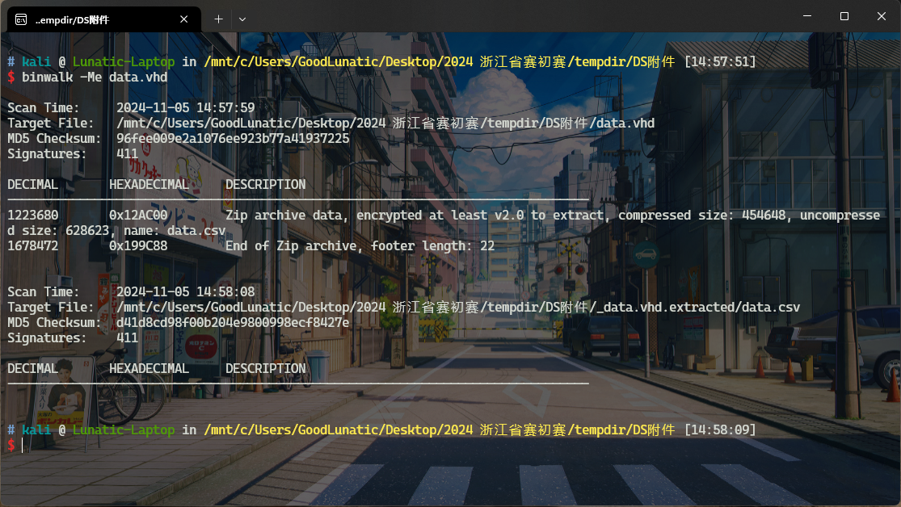

提取得到的压缩包是弱密码，直接纯数字爆破一下即可得到解压密码：`60111106`
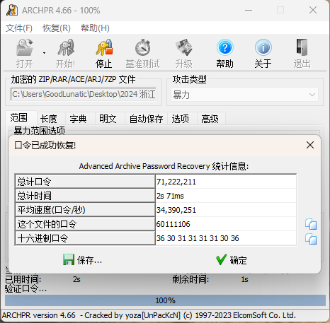

解压后可以得到一个`data.csv`，内容如下所示

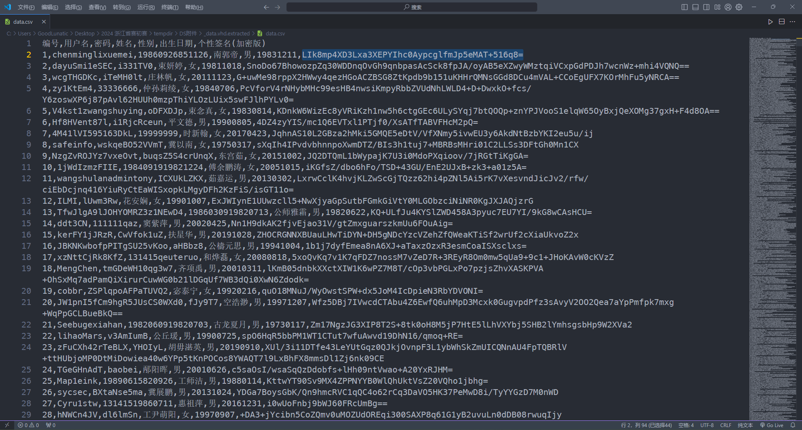

提示了个性签名是加密的，猜测flag就在个性签名里，看这个格式感觉像是AES加密

经过尝试发现是AES-ECB加密，密钥是用户的密码，长度为128bit，密钥长度不足则在末尾填充`\0`

padding模式是zeropadding，因此写个脚本批量解密AES即可

`DASCTF{dcd85182008e3a2d51b37f9845df3312}`

完整的解题脚本如下

```python
import csv
from base64 import b64decode
from Crypto.Cipher import AES

lst = []

def zeropadding(key):
    key = key &#43; b&#39;\x00&#39; * (16 - len(key) % 16)
    return key

with open(&#34;data.csv&#34;,&#34;r&#34;,encoding=&#39;utf-8&#39;) as f:
    reader = csv.reader(f)
    for row in reader:
        lst.append(row)
    
for row in lst[1:]:
    key = zeropadding(row[2].encode())
    enc = row[-1]
    data = b64decode(enc)
    aes = AES.new(key,AES.MODE_ECB)
    text = aes.decrypt(data)
    if b&#39;DASCTF&#39; in text:
        print(text)
        
# DASCTF{dcd85182008e3a2d51b37f9845df3312}
```

---

> Author: [Lunatic](https://goodlunatic.github.io)  
> URL: http://localhost:1313/posts/c216d58/  

