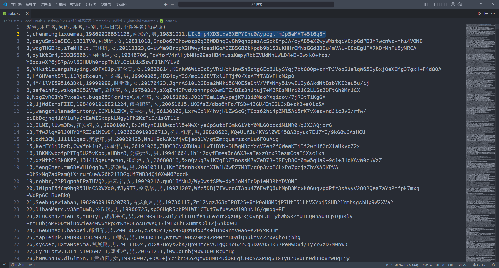

# 2024 浙江省大学生网络与信息安全竞赛 Misc Writeup

**2024 浙江省大学生网络与信息安全竞赛 Misc Writeup**
<!--more-->


> 本文中涉及的具体题目附件可以进我的交流群获取，进群详见 [About](https://goodlunatic.github.io/about/)

## 初赛
### 题目名称 签到题2
题目给了如下密文
```
6L<Ak3,*@VM*>7U&FZFNWc,Ib=t,X!+,BnSDfoaNhdiO*][5F];eV^]Lm&?$'<oeGH&6tqcgK_JDp-3;8wh?Si,G$BarTFjE?b$eR/,Igij<({u90M$5If589[<4+jp%3_%R(526#1J|m5p&H+%.#d0<DmLK*#-\8w:xD2Y[3jO{l8[)<(F[=Bcixb>Jp^%L2XvVTzW@9OTko/P74d1sFscEbMO7Vhp&HM;+ww/v[KM1%2M*7O\}rEZM.LM0'\iwK:])pg-nJef\Rt4
```

先尝试用`basecrack`梭一把


`basecrack`可以得到如下密文
```
5C9VB8W09FG6DC9LX6J1A3T9ZY9P7BKG6+M9B1AO7BI%6OTAZY91G60Z9%IBG09NIBNB9TB9
```

然后放到CyberChef中 `From base45` + `From base32` 即可得到flag：`DASCTF{welcome_to_zjctf_2024}`


当然这里也可以直接在CyberChef中一个个尝试（要求CyberChef的版本要比较新）


### 题目名称 RealSignin

解压附件压缩包，得到一张`out.png`


直接使用`zsteg`一把梭，可以得到一串编码和一个表，猜测是换表的base64

因此直接把两个东西复制到CyberChef中解码即可得到flag：`DASCTF{We1C0me_2_ZJCTF2024!}`


### 题目名称 机密文档

解压附件压缩包，得到一个加密的`机密文档.zip`

里面有一个`the_secret_you_never_ever_know_hahahaha.zip`，文件名很长并且还是用的Store压缩方法


因此我们猜测考察的是压缩包的明文攻击，压缩包考点的详细讲解可以看[我的这篇博客](https://goodlunatic.github.io/posts/1ad9200/#3%E5%88%A9%E7%94%A8%E5%8E%8B%E7%BC%A9%E5%8C%85%E6%A0%BC%E5%BC%8F%E7%A0%B4%E8%A7%A3)

直接使用`bkcrack`进行明文攻击可以得到三段密钥，然后用密钥修改压缩包密码即可


解压压缩包后得到`the_secret_you_never_ever_know_hahahaha.docm`

打开文件发现存在宏代码，因此我们尝试使用`olevba`提取宏代码


```python
olevba 0.60.1 on Python 3.8.10 - http://decalage.info/python/oletools
===============================================================================
FILE: .\the_secret_you_never_ever_know_hahahaha.docm
Type: OpenXML
WARNING  For now, VBA stomping cannot be detected for files in memory
-------------------------------------------------------------------------------
VBA MACRO ThisDocument.cls
in file: word/vbaProject.bin - OLE stream: 'VBA/ThisDocument'
- - - - - - - - - - - - - - - - - - - - - - - - - - - - - - - - - - - - - - -
(empty macro)
-------------------------------------------------------------------------------
VBA MACRO NewMacros.bas
in file: word/vbaProject.bin - OLE stream: 'VBA/NewMacros'
- - - - - - - - - - - - - - - - - - - - - - - - - - - - - - - - - - - - - - -
Sub key()
    Dim decValues As Variant
    Dim str As String
    Dim result As String
    Dim i As Integer
    Dim xorValue As Integer

    decValues = Array(26, 25, 28, 0, 16, 1, 74, 75, 45, 29, 19, 49, 61, 60, 3)
    str = "outguess"
    result = ""

    For i = LBound(decValues) To UBound(decValues)
        xorValue = decValues(i) Xor Asc(Mid(str, (i Mod Len(str)) + 1, 1))
        result = result & Chr(xorValue)
    Next i

End Sub
+----------+--------------------+---------------------------------------------+
|Type      |Keyword             |Description                                  |
+----------+--------------------+---------------------------------------------+
|Suspicious|Chr                 |May attempt to obfuscate specific strings    |
|          |                    |(use option --deobf to deobfuscate)          |
|Suspicious|Xor                 |May attempt to obfuscate specific strings    |
|          |                    |(use option --deobf to deobfuscate)          |
|Suspicious|Base64 Strings      |Base64-encoded strings were detected, may be |
|          |                    |used to obfuscate strings (option --decode to|
|          |                    |see all)                                     |
+----------+--------------------+---------------------------------------------+
```

发现就是一个简单的异或，因此我们可以使用CyberChef或者自己写个脚本解出密钥：`ulhged98BhgVHYp`


这里我脚本里给出了两种方法

```python
from pwn import xor

data = [26, 25, 28, 0, 16, 1, 74, 75, 45, 29, 19, 49, 61, 60, 3]
str = "outguess"
res = []

def func1():
    key = xor(data,str)
    print(key.decode())
    
def func2():
    for i in range(len(data)):
        tmp = data[i] ^ ord(str[i%(len(str))])
        res.append(chr(tmp))
    print(''.join(res))
    
if __name__ == "__main__":
    func1() # ulhged98BhgVHYp
    func2() # ulhged98BhgVHYp
```

这里的`str`提示了`outguess`，因此猜测这里就是图片的`outguess`隐写

把`the_secret_you_never_ever_know_hahahaha.docm`后缀改为`zip`并解压

在`the_secret_you_never_ever_know_hahahaha\word\media`目录下得到`image1.jpeg`

直接使用之前得到的密钥`outguess`解密即可得到flag：`DASCTF{B1g_S3CR3t_F0R_Y0u}`

> tips：这里会报错未知的数据类型，我们直接把后缀改成jpg即可正常解密


### 题目名称 EZtraffic

解压附件压缩包，得到一个pcapng文件，翻看流量包发现主要是`SMB`流量

追踪流发现传输了压缩包，因此我们直接使用Wireshark导出传输的压缩包即可


这里导出的时候要注意，选择那个`100%`的压缩包导出，另外两个压缩包是不完整的


在导出的压缩包注释中发现提示：`NTLM v2 plaintext + \d{5}`

因此猜测需要我们提取 NTLMv2 哈希值并破解密码，详细的步骤可以看[我的这篇博客](https://goodlunatic.github.io/posts/5422d65/#ntlm%E6%B5%81%E9%87%8F%E5%88%86%E6%9E%90)


最后组合得到的hash如下
```
rockyou::MicrosoftAccount:4936df20962cae6d:db12ced50faf52f141636e80205e8f28:01010000000000003604281b951fdb017b4045aa008508eb0000000002001e00440042004500440036004200350041002d0035003100430032002d00340001001e00440042004500440036004200350041002d0035003100430032002d00340004004800640062006500640036006200350061002d0035003100630032002d0034003100650063002d0061006400380034002d0064006400320062003500370030006400350030003900360003004800640062006500640036006200350061002d0035003100630032002d0034003100650063002d0061006400380034002d00640064003200620035003700300064003500300039003600070008003604281b951fdb01060004000200000008003000300000000000000001000000002000008029a5d8256e5c2762f439df5c06f3bc411fb0faeb3a6fa52d9273c57b09f2d10a0010000000000000000000000000000000000009001e0063006900660073002f00310030002e00310030002e0031002e00380031000000000000000000
```

然后使用hashcat字典爆破即可得到密码：haticehatice


因此我们现在就可以去爆破之前提取出来的压缩包的密码


爆破得到压缩包解压密码为：`haticehatice12580`, 解压后得到100张图片碎片，猜测是拼图


这里我拿gaps大致拼了一下，然后尝试手动拼图

```
magick montage *.png -tile 10x10 -geometry +0+0 out.png
```


gaps可以大致拼出来 `DASCTF` `PUZZL3` `ST3R` 这几个字符

尝试用PPT手动拼图，发现光靠这样是不可能拼出来的，比赛的时候就更加了。。

手动拼出下面的这几个字符串已经是本人的极限了。。。


因此猜测，图片中一定是隐藏了正确的顺序，我们尝试使用`stegsolve`打开其中一张拼图

发现在红色0通道LSB隐写了一张二维码


扫码可以得到数字，猜测这个数字应该就是拼图的正确顺序


因此我们写个脚本把所有的顺序提取出来，并将拼图碎片按照顺序拼起来即可得到最后的flag

`DASCTF{N7LM_4ND_PUZZL3_M4ST3R}`


最终的解题代码如下：

```python
from PIL import Image
from pyzbar.pyzbar import decode
import os

def extract_lsb(imgname):
    r = []
    img = Image.open(imgname)
    width,height = img.size
    for x in range(width):
        for y in range(height):
            pixel = img.getpixel((x,y))
            r.append(str(pixel[0] & 1))
            # print(pixel)
    bin_data = ''.join(r)
    return bin_data  
            
def bin2img(bin_data):
    imgname = "tmp.png"
    pixels = []
    img = Image.new("RGB",(50,50))
    for item in bin_data:
        if item =='0':
            pixels.append((0,0,0))
        else :
            pixels.append((255,255,255))
    img.putdata(pixels)
    # img.show()
    img = img.resize((500,500)) 
    # 这里调整一下图片的大小，便于后面pyzbar的识别
    img.save(imgname)
    return imgname
    
    
def read_qrcode(imgname):
    img = Image.open(imgname)
    decode_data = decode(img)
    # print(decode_data)
    res = decode_data[0].data.decode()
    os.remove(imgname)
    return res
        
def rename_img():
    filenames = os.listdir("./final_out")
    for filename in filenames:
        try:
            src_img = "./final_out/"+filename
            bin_data = extract_lsb(src_img)
            imgname = bin2img(bin_data)
            res = read_qrcode(imgname)
            dst_img = f"./final_out/{res}.png"
            os.rename(src_img,dst_img)
            print(f"[+] {src_img} ===> {dst_img} down!!!")
        except:
            print(f"[-] {src_img} Error!!!")

def merge_img():
    cols = 10
    rows = 10
    img_list = []
    new_img = Image.new("RGB",(500,500))
    
    for i in range(1,101):
        img = Image.open(f"./final_out/{i}.png")
        img_list.append(img)
        
    for y in range(rows):
        for x in range(cols):
            idx = y * cols + x
            img = img_list[idx]
            x_offset = x * 50
            y_offset = y * 50
            new_img.paste(img,(x_offset,y_offset))
            
    # new_img.show()
    new_img.save("flag.png")
        
if __name__ == "__main__":
    # rename_img()
    merge_img()
```

### 题目名称 数据安全ds-enen

解压附件压缩包，可以得到一个data.vhd磁盘文件

直接`binwalk`一下可以得到一个加密的zip压缩包


提取得到的压缩包是弱密码，直接纯数字爆破一下即可得到解压密码：`60111106`


解压后可以得到一个`data.csv`，内容如下所示



提示了个性签名是加密的，猜测flag就在个性签名里，看这个格式感觉像是AES加密

经过尝试发现是AES-ECB加密，密钥是用户的密码，长度为128bit，密钥长度不足则在末尾填充`\0`

padding模式是zeropadding，因此写个脚本批量解密AES即可

`DASCTF{dcd85182008e3a2d51b37f9845df3312}`

完整的解题脚本如下

```python
import csv
from base64 import b64decode
from Crypto.Cipher import AES

lst = []

def zeropadding(key):
    key = key + b'\x00' * (16 - len(key) % 16)
    return key

with open("data.csv","r",encoding='utf-8') as f:
    reader = csv.reader(f)
    for row in reader:
        lst.append(row)
    
for row in lst[1:]:
    key = zeropadding(row[2].encode())
    enc = row[-1]
    data = b64decode(enc)
    aes = AES.new(key,AES.MODE_ECB)
    text = aes.decrypt(data)
    if b'DASCTF' in text:
        print(text)
        
# DASCTF{dcd85182008e3a2d51b37f9845df3312}
```

### 题目名称 数据安全ds-encode

解压附件压缩包，可以得到一个mysql的数据目录


然后在日志文件中找到了mysql的版本：`MySQL 5.7.29`


因此我们本地用`phpstudy`起一个`MySQL`服务，然后把上面的数据文件拷贝到`MySQL`的data目录中


然后尝试在`Navicat`中用默认密码`root`登录，并把数据以`CSV`文件的格式导出


导出成功后，根据附件中`个人信息数据规范文档`的要求，写一个脚本处理数据即可


```python
import csv
import hashlib
import base64

data_list = []
res_list = []

with open("data.csv", "r", encoding='utf-8') as f:
    reader = csv.reader(f)
    for row in reader:
        data_list.append(row)

def basedecode(line):
    try:
        if line[-1] == "Base32":
            for i in range(1,6):
                line[i] = base64.b32decode(line[i]).decode()
        elif line[-1] == "Base64":
            for i in range(1,6):
                line[i] = base64.b64decode(line[i]).decode()
        elif line[-1] == "Base85":
            for i in range(1,6):
                line[i] = base64.b85decode(line[i]).decode()
    except:
        pass


def username_solve(username):
    res = ''
    if len(username) == 2:
        res = username[0] + '*'
    else:
        res = username[0] + "*"*(len(username)-2)+username[-1]
    return res


def password_solve(pwd):
    md5_hash = hashlib.md5()
    md5_hash.update(pwd.encode('utf-8'))
    res = md5_hash.hexdigest()
    return res


def name_solve(name):
    sha1_hash = hashlib.sha1()
    sha1_hash.update(name.encode('utf-8'))
    res = sha1_hash.hexdigest()
    return res


def id_solve(id):
    res = "*"*6 + id[6:10] + "*"*8
    return res


def phone_solve(phone):
    res = phone[:3] + "*"*4 + phone[7:]
    return res


if __name__ == "__main__":
    data_list[0].remove(data_list[0][6])
    res_list.append(data_list[0])

    for line in data_list[1:]:
        basedecode(line)
        line[1] = username_solve(line[1])
        line[2] = password_solve(line[2])
        line[3] = name_solve(line[3])
        line[4] = id_solve(line[4])
        line[5] = phone_solve(line[5])
        line.remove(line[6])
        res_list.append(line)
        
    with open('data1.csv',"w",newline='',encoding='utf-8') as f:
        writer = csv.writer(f)
        writer.writerows(res_list)
```

## 决赛

### 题目名称 网安知识大挑战-FINAL

下载附件，内容如下：
```
题目：
1. **习近平总书记强调“没有网络安全就没有国家安全”。这句话主要强调了以下哪一方面？**
   - A) 网络安全与教育发展的关系
   - B) 网络安全与文化交流的关系
   - C) 网络安全与经济发展的关系
   - D) 网络安全与国家安全的关系

2. **在习近平总书记的网络安全论述中，哪一项被视为网络安全的基础性手段？**
   - A) 公众教育
   - B) 依法治网
   - C) 国际合作
   - D) 技术创新

3. **习近平总书记提出的网络安全观中，以下哪一项是关键内容？**
   - A) 网络安全与文化传播的结合
   - B) 网络安全与金融安全的融合
   - C) 网络安全与信息化的一体化
   - D) 网络安全与旅游发展的协同

4. **习近平总书记强调网络安全为人民、网络安全靠人民。这一论述强调了哪一方面的重要性？**
   - A) 企业的技术创新
   - B) 国际社会的合作
   - C) 人民群众的参与和支持
   - D) 政府的监管作用

5. **在习近平总书记的网络安全论述中，哪一项被视为推动全球互联网治理的方向？**
   - A) 扩大网络基础设施建设
   - B) 推动网络文化输出
   - C) 尊重网络主权
   - D) 加强网络技术封锁

6. **根据习近平总书记的论述，面对网络犯罪日益严重的形势，以下哪一项是有效的应对措施？**
   - A) 增加网络娱乐内容
   - B) 放宽网络监管
   - C) 加强网络立法和执法
   - D) 降低网络安全标准

7. **习近平总书记在网络安全方面强调要做到“关口前移，防患于未然”。这主要指的是哪一项措施？**
   - A) 提高网络攻击后的应急响应速度
   - B) 加强网络安全的事前防护和预警
   - C) 增加网络安全的资金投入
   - D) 扩大网络安全的国际宣传

8. **习近平总书记提到要加强关键信息基础设施的保护。以下哪一项是关键信息基础设施的典型例子？**
   - A) 在线游戏服务器
   - B) 社交媒体平台
   - C) 国家电力系统
   - D) 电子商务网站

9. **习近平总书记强调国际社会应该在相互尊重、相互信任的基础上推动互联网全球治理。这一观点主要旨在：**
   - A) 推动全球网络文化的统一
   - B) 实现全球网络经济一体化
   - C) 加强网络技术的全球标准化
   - D) 建立多边、民主、透明的互联网治理体系

10. **习近平总书记在网络安全领域强调要统筹兼顾、综合施策。以下哪一项最能体现这一策略？**
    - A) 单一技术手段解决所有网络安全问题
    - B) 多部门协作、综合运用法律、技术、管理等手段
    - C) 依赖国际援助解决国内网络安全问题
    - D) 聚焦某一领域的网络安全，忽略其他领域


密文: 570fc2416dad7569c13356820ba67ba628c6a5fcbc73f1c8689612d23c3a779befeacf678f93ff5eb4b58dc09dcb9a89
Key：??????????000000 <= ?是每个题目的答案大写
IV: 12345678

flag格式为 DASTCF{xxxxx}，提交时只需要提交括号中间的内容。
```

然后比赛的时候给了下面这个Hint，提示了是3DES加密


因此直接写个脚本爆破即可

```python
from Crypto.Cipher import DES3
from Crypto.Util.Padding import pad, unpad
import itertools

def des_cbc_decode(key, iv, cipher_data):
    des = DES3.new(key, mode=DES3.MODE_CBC, IV=iv)
    result = des.decrypt(cipher_data)
    return result

lst = ['A','B','C','D']

def solve():
    des_iv = b"12345678"
    enc_hex = "570fc2416dad7569c13356820ba67ba628c6a5fcbc73f1c8689612d23c3a779befeacf678f93ff5eb4b58dc09dcb9a89"
    enc_flag = bytes.fromhex(enc_hex)
    for i in itertools.product(lst, repeat=10):
        des_key = ''.join(i)+"000000"
        des_key = des_key.encode()
        des_dec_data = des_cbc_decode(des_key, des_iv, enc_flag)
        # print(des_dec_data)
        if b"DASCTF" in des_dec_data:
            print(des_dec_data)
            break


if __name__ == "__main__":
    solve()
# b'DASCTF{Cyber_Security_2024_N1SC_Fina1_JiaY0u}\x03\x03\x03'
```

`DASCTF{Cyber_Security_2024_N1SC_Fina1_JiaY0u}`

### 题目名称 简单的爆破

题目附件内容如下：
```python
import numpy as np

def substitute(state, sub_box):
    return [sub_box[b & 0xF] | (sub_box[(b >> 4) & 0xF] << 4) for b in state]

def generate_round_keys(base_key, rounds):
    round_keys = []
    temp_key = base_key
    for _ in range(rounds):
        round_keys.append(temp_key & 0xFFFFFFFF)
        temp_key ^= ((temp_key << 1) & 0xFFFFFFFF) | ((temp_key >> 31) & 0x1)
    return round_keys

def process_state(base_key, state, rounds, encrypt):
    sub_box = [0x9, 0x4, 0xA, 0xB, 0xD, 0x1, 0x8, 0x5, 0x6, 0x2, 0x0, 0x3, 0xC, 0xE, 0xF, 0x7]
    inv_sub_box = [0xA, 0x5, 0x9, 0xB, 0x1, 0x7, 0x8, 0xF, 0x6, 0x0, 0x2, 0x3, 0xC, 0x4, 0xD, 0xE]

    round_keys = generate_round_keys(base_key, rounds)

    if encrypt:
        for round in range(rounds):
            state = substitute(state, sub_box)
            state = [s ^ ((round_keys[round] >> (i * 8)) & 0xFF) for i, s in enumerate(state)]
    else:
        for round in range(rounds - 1, -1, -1):
            state = [s ^ ((round_keys[round] >> (i * 8)) & 0xFF) for i, s in enumerate(state)]
            state = substitute(state, inv_sub_box)

    return state

def encrypt(plaintext, key, rounds=10):
    length = len(plaintext)
    padded_length = length if length % 4 == 0 else length + (4 - (length % 4))
    plaintext += b'\x00' * (padded_length - length)

    ciphertext = bytearray(padded_length)
    for i in range(0, padded_length, 4):
        state = list(plaintext[i:i+4])
        state = process_state(key, state, rounds, True)
        ciphertext[i:i+4] = state

    return ciphertext

def decrypt(ciphertext, key, rounds=10):
    length = len(ciphertext)
    plaintext = bytearray(length)
    for i in range(0, length, 4):
        state = list(ciphertext[i:i+4])
        state = process_state(key, state, rounds, False)
        plaintext[i:i+4] = state

    return plaintext.rstrip(b'\x00')

def main():
    plaintext = b"DASCTF{******}"
    key = 0xECB... # 4 bytes
    ciphertext = encrypt(plaintext, key)
    print("Ciphertext:", ''.join(f"{b:02X}" for b in ciphertext))

if __name__ == "__main__":
    main()
# Ciphertext: A6B343D2C6BE1B268C3EA4744E3AA9914E29A0789F299022820299248C23D678442A902B4C24A8784A3EA401
```

解密函数`decrypt`直接给我们了，因此我们注意一下数据的格式，直接调用一下这个函数爆破即可

```python
import numpy as np

def substitute(state, sub_box):
    return [sub_box[b & 0xF] | (sub_box[(b >> 4) & 0xF] << 4) for b in state]

def generate_round_keys(base_key, rounds):
    round_keys = []
    temp_key = base_key
    for _ in range(rounds):
        round_keys.append(temp_key & 0xFFFFFFFF)
        temp_key ^= ((temp_key << 1) & 0xFFFFFFFF) | ((temp_key >> 31) & 0x1)
    return round_keys

def process_state(base_key, state, rounds, encrypt):
    sub_box = [0x9, 0x4, 0xA, 0xB, 0xD, 0x1, 0x8, 0x5, 0x6, 0x2, 0x0, 0x3, 0xC, 0xE, 0xF, 0x7]
    inv_sub_box = [0xA, 0x5, 0x9, 0xB, 0x1, 0x7, 0x8, 0xF, 0x6, 0x0, 0x2, 0x3, 0xC, 0x4, 0xD, 0xE]

    round_keys = generate_round_keys(base_key, rounds)

    if encrypt:
        for round in range(rounds):
            state = substitute(state, sub_box)
            state = [s ^ ((round_keys[round] >> (i * 8)) & 0xFF) for i, s in enumerate(state)]
    else:
        for round in range(rounds - 1, -1, -1):
            state = [s ^ ((round_keys[round] >> (i * 8)) & 0xFF) for i, s in enumerate(state)]
            state = substitute(state, inv_sub_box)

    return state

def encrypt(plaintext, key, rounds=10):
    length = len(plaintext)
    padded_length = length if length % 4 == 0 else length + (4 - (length % 4))
    plaintext += b'\x00' * (padded_length - length)

    ciphertext = bytearray(padded_length)
    for i in range(0, padded_length, 4):
        state = list(plaintext[i:i+4])
        state = process_state(key, state, rounds, True)
        ciphertext[i:i+4] = state

    return ciphertext

def decrypt(ciphertext, key, rounds=10):
    length = len(ciphertext)
    plaintext = bytearray(length)
    for i in range(0, length, 4):
        state = list(ciphertext[i:i+4])
        state = process_state(key, state, rounds, False)
        plaintext[i:i+4] = state

    return plaintext.rstrip(b'\x00')

def main():
    plaintext = b"DASCTF{test_flag}"
    key = 0xECB00000 # 4 bytes
    ciphertext = encrypt(plaintext, key)
    print(type(ciphertext))
    # bytearray(b'D\xffS\xd4\xb4\xf7+\x06\xadB/\xfe\xa8mns\xfb#\xf2\xc5')
    print(bytes(ciphertext))
    # b'D\xffS\xd4\xb4\xf7+\x06\xadB/\xfe\xa8mns\xfb#\xf2\xc5'
    output = ''.join(f"{b:02X}" for b in ciphertext)
    print("Ciphertext:", output)
    # Ciphertext: 44FF53D4B4F72B06AD422FFEA86D6E73FB23F2C5
    print(bytes.fromhex(output))
    # b'D\xffS\xd4\xb4\xf7+\x06\xadB/\xfe\xa8mns\xfb#\xf2\xc5'
    print(bytearray(bytes.fromhex(output)))

def solve():
    ciphertext = "A6B343D2C6BE1B268C3EA4744E3AA9914E29A0789F299022820299248C23D678442A902B4C24A8784A3EA401"
    enc_bytesarray = bytearray(bytes.fromhex(ciphertext))
    for i in range(0xECB00000,0xECBFFFFF):
        res = decrypt(enc_bytesarray,i)
        res = bytes(res)
        print(res)
        if b"DASCTF" in res:
            print(res)
            break

if __name__ == "__main__":
    solve()
```


`DASCTF{6ef4d8e1-845a-4e3c-a4e1-a15e5530a0f4}`

### 题目名称 datasecurity_classify1
题目附件给了一个`data.csv`文件，我们写个脚本根据`个人信息数据规范文档`处理一下数据

然后上传处理好的文件验证即可得到flag，注意我这里脚本生成的csv需要手动去除双引号（待优化）

```python
import csv
import re
import string

data_list = []
res_list = []
phone_lst = [734, 735, 736, 737, 738, 739, 747, 748, 750, 751, 752, 757, 758, 759, 772,
778, 782, 783, 784, 787, 788, 795, 798, 730, 731, 732, 740, 745, 746, 755,
756, 766, 767, 771, 775, 776, 785, 786, 796, 733, 749, 753, 773, 774, 777,
780, 781, 789, 790, 791, 793, 799]
num_lst = [7, 9, 10, 5, 8, 4, 2, 1, 6, 3, 7, 9, 10, 5, 8, 4, 2]
check = ['1','0','X','9','8','7','6','5','4','3','2']

def is_chinese(char):
    try:
        chinese = re.findall(r'[\u4e00-\u9fff]', char)
        name = "".join(chinese)
        if name == char:
            return True
        else:
            return False
    except:
        return False

def is_valid_id_number(id_number):
    tmp = 0
    if len(id_number) == 18:
        if(re.match(r'\d{17}',id_number)):
            for i in range(17):
                tmp += int(id_number[i]) * num_lst[i]
            tmp = tmp % 11
            if id_number[17] == str(check[tmp]):
                return True
        else:
            return False
    else:
        return False

def is_valid_phone_number(phone_number):
    if len(phone_number)==11:
        if int(phone_number[:3]) in phone_lst:
            return True
        else:
            return False
    else:
        return False

if __name__ == "__main__":
    # 读取csv文件
    with open("data.csv", "r", encoding='utf-8') as f:
        reader = csv.reader(f) # 创建 CSV 读取器
        for row in reader:
            data_list.append(row)
    res_list.append(["类型,数据值"])
    for row in data_list[1:]:
        if is_chinese(row[0]):
            res_list.append(["姓名,"+row[0]])
        if is_valid_phone_number(row[0]):
            res_list.append(["手机号,"+row[0]])
        if is_valid_id_number(row[0]):
            res_list.append(["身份证号,"+row[0]])

    print(res_list[:20])
    # 保存列表到csv文件
    with open('res.csv',"w",newline='',encoding='utf-8') as f:
        writer = csv.writer(f)
        writer.writerows(res_list)
```


`DASCTF{10906667788249998436596587902838}`

### 题目名称 FinalSign
解压附件压缩包，得到一个txt文件，内容如下：
```
恭喜你来到这里，你能解开下面的秘密吗？	     	      
2c243f2f3b3114345d0a0909333f06100143023b2c55020912   	   	   	 
 	   	   	  		  	       	 	  	    
   	    	       	      	   	   	    	      	      	      
  	      	   	 		

```
在`vscode`中打开发现有很多空白字符，因此猜测是`snow`隐写


直接用工具尝试解密无密码`snow`隐写即可得到：xorkey：`helloworld`


最后使用`CyberChef`解密一下即可得到flag：`DASCTF{F1nal_Sign1n_D0ne}`


### 题目名称 非黑即白

解压附件压缩包，得到一个数据逆置的GIF文件


尝试把数据逆置回来，可以得到一个只有黑白帧的GIF

直接使用B神的工具将GIF分帧，可以得到1536帧的图像


然后编写以下脚本提取数据，可以得到一个加密的压缩包

```python
import libnum
from PIL import Image

data = ""
for i in range(1536):
    filename = f"{i}.png"
    img = Image.open(filename)
    pixel = img.getpixel((0,0))[0]
    # print(tmp_pixel)
    if pixel < 200:
        data += '0'
    else:
        data += '1'

with open("1.zip","wb") as f:
    f.write(libnum.b2s(data))
```

发现压缩包需要解压密码，因此我们继续看刚刚的那张GIF，发现存在GIF帧间隔隐写

因此我们直接用工具提取出来，把末尾多的0去掉然后转ASCII，即可得到解压密码：`vjEJ0bSuMOVAZge`


最后使用得到的密码解压压缩包即可得到flag：`DASCTF{H3r3_1s_C0L0rful_W0rld}`

### 题目名称 天命人（赛后复现）

题目附件给了一个压缩包，压缩包的注释中有提示


解压后用010打开，发现就是把一个压缩包的数据按照顺序分到了六个文件里

因此我们写个脚本，按照顺序恢复一下压缩包即可

```python
with open("1","rb") as f:
    data1 = f.read()

with open("2","rb") as f:
    data2 = f.read()

with open("3","rb") as f:
    data3 = f.read()
    
with open("4","rb") as f:
    data4 = f.read()
    
with open("5","rb") as f:
    data5 = f.read()

with open("6","rb") as f:
    data6 = f.read()
    
print(len(data1))
print(len(data2))
print(len(data3))
print(len(data4))
print(len(data5))
print(len(data6))

res = []
for i in range(387797):
    try:
        res.append(data1[i])
        res.append(data2[i])
        res.append(data3[i])
        res.append(data4[i])
        res.append(data5[i])
        res.append(data6[i])
    except:
        pass
    
print(len(res))
with open("1.zip","wb") as f:
    f.write(bytes(res))
```

解压得到的压缩包，又可以得到两个新的加密的压缩包


发现根器.zip中的文件很短，只有几字节，因此可以直接使用`CRC32`爆破文件内容


爆破后即可得到另一个压缩包的解压密码：`C0M3_4ND_Get_S1X_R00TS!!`

使用得到的密码解压`未竟.zip`，可以得到一张png图片，还有一个名为`紧箍咒`的未知后缀的数据文件


发现png图片中存在等距像素隐写，因此我们尝试等距提取像素，这里我就直接用了B神的代码

> Tips：这里需要注意这个脚本建议在`Windows`下运行，然后把`金箍棒.png`改成`1.png`，要不然可能会有点问题，无法正常提取出后面的图片


```python
import os
import re
import cv2
import argparse
import itertools
import numpy as np


parser = argparse.ArgumentParser()
parser.add_argument('-f', type=str, default=None, required=True,
                    help='输入文件名称')
parser.add_argument('-p', type=str, default=None, required=True,
                    help='输入左上顶点和右下顶点坐标 (如:-p 220x344+3520x2150)')
parser.add_argument('-n', type=str, default=None, required=True,
                    help='输入宽度间隔和高度间隔 (如:-n 44x86)')
parser.add_argument('-size', type=str, default='1x1', required=False,
                    help='输入截取图像的大小 (如:-size 7x7)')
parser.add_argument('-resize', type=int, default=1, required=False,
                    help='输入截取图像放大倍数 (如:-resize 1)')
args  = parser.parse_args()

if __name__ == '__main__':
    if re.search(r"^\d{1,}x\d{1,}\+\d{1,}x\d{1,}$", args.p) and re.search(r"^\d{1,}x\d{1,}$", args.n) and re.search(r"^\d{1,}x\d{1,}$", args.size):
        x1, y1 = map(lambda x: int(x), args.p.split("+")[0].split("x"))
        x2, y2 = map(lambda x: int(x), args.p.split("+")[1].split("x"))
        width, height = map(lambda x: int(x), args.n.split("x"))
        width_size, height_size = map(lambda x: int(x), args.size.split("x"))

        img_path = os.path.abspath(args.f)
        file_name = img_path.split("\\")[-1]

        img = cv2.imread(img_path, cv2.IMREAD_COLOR)
        row, col = img.shape[:2]

        r, c = len(range(y1, y2 + 1, height)), len(range(x1, x2 + 1, width))
        new_img = np.zeros(shape=(r * height_size * args.resize, c * width_size * args.resize, 3))
        for y, x in itertools.product(range(r), range(c)):
            for y_size in range(height_size):
                for x_size in range(width_size):
                    # new_img[y * height_size + y_size, x * width_size + x_size] = img[y1 + y * height + y_size, x1 + x * width + x_size]
                    pt1 = ((x * width_size + x_size) * args.resize, (y * height_size + y_size) * args.resize)
                    pt2 = ((x * width_size + x_size) * args.resize + args.resize, (y * height_size + y_size) * args.resize + args.resize)
                    color = img[y1 + y * height + y_size, x1 + x * width + x_size].tolist()
                    cv2.rectangle(new_img, pt1=pt1, pt2=pt2, color=color, thickness=-1)
            
        # cv2.imshow(new_img)
        cv2.imwrite(f"_{file_name}", new_img)
        print("已保存到运行目录中...")
    else:
        print("参数-p或参数-n或参数-size, 输入错误!")
```

我们这里把图片重命名为1.png，然后输入以下命令提取等距像素点

```bash
python3 Get_Pixels.py -f 1.png -p 5x5+1915x1075 -n 10x10
```


提取出来的图片中我们可以得到：`verapass1:jinggubang`


这张图片提示了另一个`紧箍咒`文件是一个Veracrypt加密的磁盘文件

刚刚好之前的那张图片显示的也是金箍棒，因此我们把之前的那张图片作为密钥文件，并输入密码`jinggubang`挂载


挂载成功后即可得到flag：`DASCTF{T1m3_t0_F4Ce_De5t1nY}`


---

> Author: [Lunatic](https://goodlunatic.github.io)  
> URL: https://goodlunatic.github.io/posts/c216d58/  

