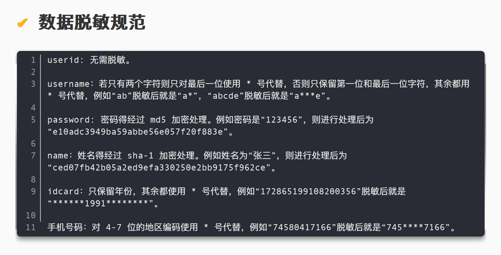

# CTF-数据安全

最近的CTF比赛中经常出现数据安全的板块(尤其是安恒承办的比赛)

感觉这类题目是可以靠积累来提升解题速度的，因此准备写这样一篇博客来总结一下常见的考点
<!--more-->

## 数据读取

### 从xlsx中读取数据并实现脱敏

```python
import pandas as pd
import hashlib

def desensitize_name(name):
    length = len(name)
    if length == 2:
        return name[0] + '*'
    elif length == 3:
        return name[0] + '*' + name[2]
    elif length == 4:
        return name[0] + '**' + name[3]
    else:
        return name  # 对于非2-4字姓名，原样返回（可根据需求修改）

def desensitize_phone(phone):
    if len(phone) == 11:
        return phone[:3] + '*****' + phone[8:]
    return phone  # 对于非11位手机号，原样返回

def desensitize_id(id_num):
    if len(id_num) >= 6:
        return id_num[:6] + '*' * (len(id_num) - 6)
    return id_num  # 对于不足6位的身份证号，原样返回

def desensitize_bank_card(card):
    card_str = str(card).strip()  # 转换为字符串并去除空白
    length = len(card_str)
    
    if length < 14:
        return '*' * length
    else:
        # 计算需要保留的中间部分
        keep_length = max(0, length - 14)  # 总长度-14=中间保留位数
        middle = card_str[4:4+keep_length] if keep_length > 0 else ''
        return '****' + middle + '*' * 10

def desensitize_email(email):
    parts = email.split('@')
    if len(parts) == 2:
        local_part = parts[0]
        # 找到最后一个.的位置
        last_dot = local_part.rfind('.')
        if last_dot != -1:
            # 保留.及其前面的字符
            to_keep = local_part[:last_dot+1]
            to_mask = local_part[last_dot+1:]
        else:
            to_keep = ''
            to_mask = local_part
        masked = to_keep + '*' * len(to_mask)
        return masked + '@' + parts[1]
    return email  # 对于不包含@的email，原样返回

def desensitize_gender(gender):
    return '未知'

def desensitize_wechat(wechat):
    if wechat:
        return '*' * len(wechat)
    return wechat
    
def concatenate_and_hash(file_path):
    # 读取Excel文件
    df = pd.read_excel(file_path)
    # 移除标题行（第一行）
    data_rows = df.iloc[1:] if len(df) > 1 else df
    # 按照先行后列的顺序拼接所有单元格内容
    concatenated_str = ''
    for _, row in data_rows.iterrows():
        for value in row:
            concatenated_str += str(value) if pd.notna(value) else ''
    # 计算MD5哈希值
    md5_hash = hashlib.md5(concatenated_str.encode('utf-8')).hexdigest()
    return md5_hash

if __name__ == "__main__":
    # 读取Excel文件
    df = pd.read_excel('data.xlsx')

    # 应用脱敏函数
    df['姓名'] = df['姓名'].apply(desensitize_name)
    df['手机号'] = df['手机号'].astype(str).apply(desensitize_phone)
    df['身份证号'] = df['身份证号'].astype(str).apply(desensitize_id)
    df['银行卡号'] = df['银行卡号'].astype(str).apply(desensitize_bank_card)
    df['Email'] = df['Email'].apply(desensitize_email)
    df['性别'] = df['性别'].apply(desensitize_gender)
    df['微信号'] = df['微信号'].apply(desensitize_wechat)

    # 保存脱敏后的数据到新文件
    df.to_excel('desensitized_data.xlsx', index=False)

    print("[+] 数据脱敏完成，结果已保存到 desensitized_data.xlsx")

    file_path = 'desensitized_data.xlsx'  # 替换为你的Excel文件路径
    result = concatenate_and_hash(file_path)
    print(f"[+] 拼接后的字符串的MD5值为: {result}")
```

### 从csv中读取数据并实现脱敏

```python
import csv
import hashlib
import base64

data_list = []
res_list = []

def basedecode(line):
    try:
        if line[-1] == "Base32":
            for i in range(1,6):
                line[i] = base64.b32decode(line[i]).decode()
        elif line[-1] == "Base64":
            for i in range(1,6):
                line[i] = base64.b64decode(line[i]).decode()
        elif line[-1] == "Base85":
            for i in range(1,6):
                line[i] = base64.b85decode(line[i]).decode()
    except:
        pass

def username_solve(username):
    res = ''
    if len(username) == 2:
        res = username[0] + '*'
    else:
        res = username[0] + "*"*(len(username)-2)+username[-1]
    return res

def password_solve(pwd):
    md5_hash = hashlib.md5()
    md5_hash.update(pwd.encode('utf-8'))
    res = md5_hash.hexdigest()
    return res

def name_solve(name):
    sha1_hash = hashlib.sha1()
    sha1_hash.update(name.encode('utf-8'))
    res = sha1_hash.hexdigest()
    return res

def id_solve(id):
    res = "*"*6 + id[6:10] + "*"*8
    return res

def phone_solve(phone):
    res = phone[:3] + "*"*4 + phone[7:]
    return res

if __name__ == "__main__":
	with open("data.csv", "r", encoding='utf-8') as f:
	    reader = csv.reader(f)
    for row in reader:
        data_list.append(row)
    data_list[0].remove(data_list[0][6])
    res_list.append(data_list[0])

    for line in data_list[1:]:
        basedecode(line)
        line[1] = username_solve(line[1])
        line[2] = password_solve(line[2])
        line[3] = name_solve(line[3])
        line[4] = id_solve(line[4])
        line[5] = phone_solve(line[5])
        line.remove(line[6])
        res_list.append(line)
        
    with open('out.csv',"w",newline='',encoding='utf-8') as f:
        writer = csv.writer(f)
        writer.writerows(res_list)
```


### 从json中读取数据并实现脱敏

```python
import json
from scapy.all import *

# 解析JSON文件，建立IP到域名的映射
ip_domain = {}
with open('国外敏感域名清单.json', 'r') as f:
    data = json.load(f)
    for category in data['categories'].values():
        domains = category['domains']
        for domain, ip in domains.items():
            ip_domain[ip] = domain

# 解析PCAP文件，统计目标IP访问次数
ip_count = {}
packets = rdpcap('某流量审计平台导出的镜像流量.pcap')
for pkt in packets:
    if IP in pkt:
        dst_ip = pkt[IP].dst
        if dst_ip in ip_domain:
            ip_count[dst_ip] = ip_count.get(dst_ip, 0) + 1

# 找出访问次数最多的IP
max_ip = None
max_count = 0
for ip, count in ip_count.items():
    if count > max_count:
        max_count = count
        max_ip = ip

# 生成结果
if max_ip:
    domain = ip_domain[max_ip]
    print(f"{domain}:{max_ip}:{max_count}")
else:
    print("无访问记录")
```

## 数据脱敏

例如下面这张图片中`数据脱敏`的例子



### 身份证

### 手机号

### 中文字符

### IP地址


## 数据校验

### 序列号

### 用户名

### 用户名的MD5

### 密码

### 密码的MD5

### IP地址

### 签名值


## 比赛中用到的一些脚本

```python
import csv
import hashlib
import base64

data_list = []
res_list = []

with open("data.csv", "r", encoding='utf-8') as f:
    reader = csv.reader(f)
    for row in reader:
        data_list.append(row)

def basedecode(line):
    try:
        if line[-1] == "Base32":
            for i in range(1,6):
                line[i] = base64.b32decode(line[i]).decode()
        elif line[-1] == "Base64":
            for i in range(1,6):
                line[i] = base64.b64decode(line[i]).decode()
        elif line[-1] == "Base85":
            for i in range(1,6):
                line[i] = base64.b85decode(line[i]).decode()
    except:
        pass


def username_solve(username):
    res = ''
    if len(username) == 2:
        res = username[0] + '*'
    else:
        res = username[0] + "*"*(len(username)-2)+username[-1]
    return res


def password_solve(pwd):
    md5_hash = hashlib.md5()
    md5_hash.update(pwd.encode('utf-8'))
    res = md5_hash.hexdigest()
    return res


def name_solve(name):
    sha1_hash = hashlib.sha1()
    sha1_hash.update(name.encode('utf-8'))
    res = sha1_hash.hexdigest()
    return res


def id_solve(id):
    res = "*"*6 + id[6:10] + "*"*8
    return res


def phone_solve(phone):
    res = phone[:3] + "*"*4 + phone[7:]
    return res


if __name__ == "__main__":
    data_list[0].remove(data_list[0][6])
    res_list.append(data_list[0])

    for line in data_list[1:]:
        basedecode(line)
        line[1] = username_solve(line[1])
        line[2] = password_solve(line[2])
        line[3] = name_solve(line[3])
        line[4] = id_solve(line[4])
        line[5] = phone_solve(line[5])
        line.remove(line[6])
        res_list.append(line)
        
    with open('data1.csv',"w",newline='',encoding='utf-8') as f:
        writer = csv.writer(f)
        writer.writerows(res_list)
```


```python
import csv
import re
import string

data_list = []
res_list = []
phone_lst = [734, 735, 736, 737, 738, 739, 747, 748, 750, 751, 752, 757, 758, 759, 772,
778, 782, 783, 784, 787, 788, 795, 798, 730, 731, 732, 740, 745, 746, 755,
756, 766, 767, 771, 775, 776, 785, 786, 796, 733, 749, 753, 773, 774, 777,
780, 781, 789, 790, 791, 793, 799]
num_lst = [7, 9, 10, 5, 8, 4, 2, 1, 6, 3, 7, 9, 10, 5, 8, 4, 2]
check = ['1','0','X','9','8','7','6','5','4','3','2']

def is_chinese(char):
    try:
        chinese = re.findall(r'[\u4e00-\u9fff]', char)
        name = "".join(chinese)
        if name == char:
            return True
        else:
            return False
    except:
        return False

def is_valid_id_number(id_number):
    tmp = 0
    if len(id_number) == 18:
        if(re.match(r'\d{17}',id_number)):
            for i in range(17):
                tmp += int(id_number[i]) * num_lst[i]
            tmp = tmp % 11
            if id_number[17] == str(check[tmp]):
                return True
        else:
            return False
    else:
        return False

def is_valid_phone_number(phone_number):
    if len(phone_number)==11:
        if int(phone_number[:3]) in phone_lst:
            return True
        else:
            return False
    else:
        return False

if __name__ == "__main__":
    # 读取csv文件
    with open("data.csv", "r", encoding='utf-8') as f:
        reader = csv.reader(f) # 创建 CSV 读取器
        for row in reader:
            data_list.append(row)
    res_list.append(["类型,数据值"])
    for row in data_list[1:]:
        if is_chinese(row[0]):
            res_list.append(["姓名,"+row[0]])
        if is_valid_phone_number(row[0]):
            res_list.append(["手机号,"+row[0]])
        if is_valid_id_number(row[0]):
            res_list.append(["身份证号,"+row[0]])

    print(res_list[:20])
    # 保存列表到csv文件
    with open('res.csv',"w",newline='',encoding='utf-8') as f:
        writer = csv.writer(f)
        writer.writerows(res_list)
```

```python
import csv
import re

f = open("C:/Users/67300/Downloads/person_data.csv", "r", encoding="utf-8")
c = list(csv.reader(f))[1:]

def is_chinese(char):
    if re.match(r'[\u4e00-\u9fff]', char):
        return True
    else:
        return False

def is_md5(char):
    if re.match(r'[a-f0-9]{32}', char):
        return True
    else:
        return False

def is_valid_id_number(id_number):
    pattern = r'^[0-9]\d{5}(18|19|20|21|22)?\d{2}(0[1-9]|1[0-2])(0[1-9]|[12]\d|3[01])\d{3}(\d|[Xx])$'
    return bool(re.match(pattern, id_number))

def is_valid_phone_number(phone_number):
    pattern = re.compile(r'^\d{7,15}$')
    if pattern.match(phone_number):
        return True
    else:
        return False

dt = []

for line in c:
    mp = {}
    for ele in line:
        if is_chinese(ele):
            if ele in ["男", "女"]:
                mp["性别"] = ele
            else:
                mp["姓名"] = ele
            continue
        if ele.isdigit() and len(ele) == 8:
            mp["出生日期"] = ele
            continue
        if is_md5(ele):
            mp["密码"] = ele
            continue
        if is_valid_id_number(ele):
            mp["身份证号"] = ele
            continue
        if is_valid_phone_number(ele):
            mp["手机号码"] = ele
            continue
        if ele.isdigit() and 0 <= int(ele) <= 11000:
            mp["编号"] = ele
            continue
        mp["用户名"] = ele
    if len(mp.items()) != 8:
        print(line)
        exit()
    dt.append(mp)

# 将数据保存到CSV文件
with open('output.csv', 'w', newline='', encoding="utf-8") as csvfile:
    writer = csv.DictWriter(csvfile, fieldnames=["编号","用户名","密码","姓名","性别","出生日期","身份证号","手机号码"])
    writer.writeheader()
    for row in dt:
        writer.writerow(row)
```

```python
import pandas as pd
import hashlib
import re
import os
import base64
from ecdsa import VerifyingKey, BadSignatureError

def md5_hash(text):
    return hashlib.md5(text.encode('utf-8')).hexdigest()

def validate_username(username):
    return username.startswith('User-')

def validate_password(password):
    return bool(re.fullmatch(r'[a-zA-Z0-9]+', password))

def validate_ip(ip):
    ip_pattern = re.compile(r'^(?:[0-9]{1,3}\.){3}[0-9]{1,3}$')
    if not ip_pattern.match(ip):
        return False
    parts = list(map(int, ip.split('.')))
    return all(0 <= part <= 255 for part in parts)

def verify_signature(username, signature, key_path):
    try:
        with open(key_path, 'rb') as f:
            vk = VerifyingKey.from_pem(f.read())
        decoded_signature = base64.b64decode(signature)
        vk.verify(decoded_signature, username.encode('utf-8'))
        return True
    except (BadSignatureError, ValueError, FileNotFoundError, base64.binascii.Error):
        return False

def main():
    # 读取数据
    df = pd.read_csv('data.csv')

    invalid_serials = []

    for index, row in df.iterrows():
        serial = row['Serial_Number']
        username = row['UserName']
        username_check = row['UserName_Check']
        password = row['Password']
        password_check = row['Password_Check']
        ip = row['IP']
        signature = row['Signature']

        # 1. 校验 UserName 格式
        if not validate_username(username):
            invalid_serials.append(serial)
            continue

        # 2. 校验 UserName 的 MD5 值
        if md5_hash(username) != username_check:
            invalid_serials.append(serial)
            continue

        # 3. 校验 Password 格式
        if not validate_password(password):
            invalid_serials.append(serial)
            continue

        # 4. 校验 Password 的 MD5 值
        if md5_hash(password) != password_check:
            invalid_serials.append(serial)
            continue

        # 5. 校验 IP 地址格式
        if not validate_ip(ip):
            invalid_serials.append(serial)
            continue

        # 6. 校验签名
        key_path = f"ecdsa-key/{serial}.pem"
        if not verify_signature(username, signature, key_path):
            invalid_serials.append(serial)

    if invalid_serials:
        # 按照从小到大排序
        invalid_serials.sort()

        print(invalid_serials)
        # 生成 flag
        joined_serials = '_'.join(map(str, invalid_serials))

        print(joined_serials)
        flag = f"flag{{{md5_hash(joined_serials)}}}"
        print("Flag:", flag)
    else:
        print("所有数据均符合要求。")

if __name__ == '__main__':
    main()
```

---

> 作者: [Lunatic](https://goodlunatic.github.io)  
> URL: https://goodlunatic.github.io/posts/c49ae8a/  

