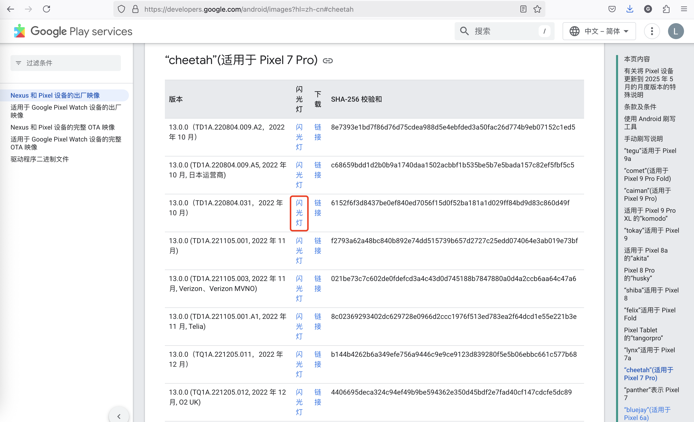
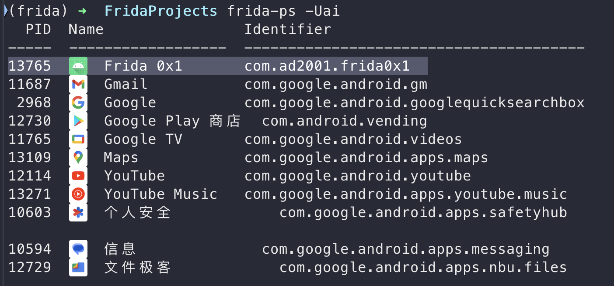
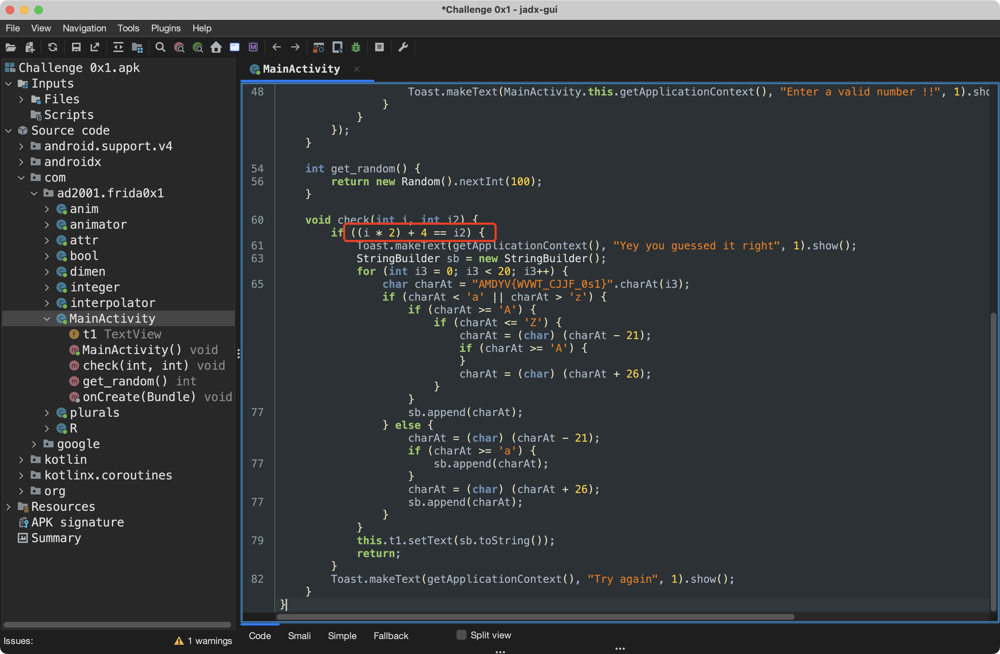

# Frida Learning Record


**在学习爬虫的过程中，发现有时候需要用到Frida，因此就想着学习一下**

**之前经常听到队友念叨 FridaHook，现在终于有机会来学一下里面具体的内容了**

<!--more-->

## 系统环境配置

安卓设备：Pixel7 Pro（Rooted）

> 原来的版本是安卓14，但是好像安卓14在使用Frida的时候会显示Timeout
> 
> 询问了队友后，发现可能是安卓版本的问题，于是把版本降低到了安卓13

Pixel的系统降级非常方便，Google官网提供了一个flash安装系统的界面，完全是傻瓜式操作



启用USB调试并安装好ADB后，直接跟着指示无脑安装及通即可

安装好系统后需要安装Magisk来获取Root权限

Root的教程可以参考这篇文章：https://zhuanlan.zhihu.com/p/647937696

> 这里安装Magisk的时候要注意安装新版的，要不然后面安装别的模块会显示 `unzip error`
> 
> 新版Magisk仓库：https://github.com/topjohnwu/Magisk

配置完环境后，就可以开始学习Frida了，我这里主要参考的是Github上的[Frida-Labs](https://github.com/DERE-ad2001/Frida-Labs/)

## Frida-0x1

这里主要就是学习一下 Frida Hook 脚本的编写

脚本的基本格式如下：

```javascript
Java.perform(function() {
  var <class_reference> = Java.use("<package_name>.<class>");
  <class_reference>.<method_to_hook>.implementation = function(<args>) {
    /*
      OUR OWN IMPLEMENTATION OF THE METHOD
    */
  }
})
```

程序的包名可以连上ADB后用`frida-ps -Uai`获取



jadx反编译一下apk，程序的逻辑很简单，就是比较用户的输入和随机生成的值



这里有两种Hook方式，分别是Hook`get_random()`和`check()`两个函数

```javascript
Java.perform(function() {
  var a = Java.use("com.ad2001.frida0x1.MainActivity");
  a.get_random.implementation = function(){
    console.log("This method is hooked");
    var ret_val = this.get_random();
    console.log("The return value is " + ret_val);
    console.log("The value to bypass the check " + (ret_val * 2 + 4 )) // To bypass the check
    return ret_val; //returning the original random value from the get_random method
  }
})
```

```javascript
Java.perform(function(){
    var a = Java.use("com.ad2001.frida0x1.MainActivity");
    a.check.overload('int','int').implementation = function(a,b){// 注意参数的传递
        console.log("The random num is " + a);
        console.log("The num user input is " + b);
        this.check(4,12);
    }
})
```

---

> 作者: [Lunatic](https://goodlunatic.github.io)  
> URL: https://goodlunatic.github.io/posts/ca974cb/  

