# CTF-Misc &#34;雅&#34;题共赏

**用这篇博客来记录一下本人在比赛中遇到的一些疑难题（本人尚未解出的题）**

**如果师傅们有进一步的想法或者做出来了，可以联系我一起交流一下解题思路**
&lt;!--more--&gt;
{{&lt; admonition type=danger title=&#34;【重要】阅前须知&#34; open=true &gt;}}
**这篇博客可以算是本人的求助贴，因此本文中的大部分内容并不适合刚接触Misc方向的新同学**

**尝试本文中提到的相关题目可能会耗费大量时间，请各位读者量力而行【慎行】**
{{&lt; /admonition &gt;}}

## 题目名称 Fingers_play (2024 ISCC 个人挑战赛)

题目附件： https://pan.baidu.com/s/1wSR_G9N-5739BeJgP4zouQ?pwd=6dqv 提取码: 6dqv


## 题目名称 one (2024 古剑山)

题目附件： https://pan.baidu.com/s/1iSL1P1Z1Oa8WB0tXRWjSmg?pwd=vc66 提取码: vc66

题目附件给了一个`cnc.txt`，内容是10000行每行114个字符的十六进制数据

部分内容如下：

```
dd1bbd60cff3095f188b70af36a4ea2644f5241a425469a3b2b7c92fabd639ad55dfc8dd4393e4c572af31dbc4dab5173cc0bcb768331fb51d
a3f4057ce7fee14d7a79a28f9b51fb0e64063e41e09a0102b9024ed8da62c79a7e02155b23e9f2f66d8962260a04a6a92a4336aca932cc7431
be509b0be9e225cf2d639bbfb6e9595eb8111deb74b2b236265359a0bf5f2cdae1825a9072ce751f9fa40ea1bef650b5137506282ee02674c7
e8041edfc9dd08a5e74e4c4abe8c9dbca089572974798180fd5c11a15dad2a10968803c191592084600ce534cd9361194010759e97d30dfa15
9ab9a7966725e87fe0c92b4fdc95e7ae833aa180db6f295340cbcf294c7d08834e91dfdfafa98c7cc03404dbdf502bdc2e7e4c046ebd62fb23
c8725bb8060e13fead44e9a5ffb6f331383a717e9ec8498112a33ca8940a75947a8b191c68ac68e8459f7a6eb5737413a6484ff0b91004ec1a
cc385111badde9d78f2f5aee756eb34a09b86a4284a18902eee1bbbfadf1915bf8d19a03a7dc6b9bad117530dc505a76e6d5fc9f3897e89034
b318450ba8c7c8cd618ea3c4d396a2e99c3d99fe150218f2ff484003ed13e205ebe61b6108970ff530635f8fbc57e61e476618b3566de76ef2
95cda1e94b9d59843069fb8f2c4415404f31be077ebc1f83a61f08cd62d75e3d6379ca0b69e375372fd0f206d1009ebf397683c927da0ab63d
bc3cf1722bf8f617acc85ba7169649ecd70c7e9575c05ef04cde5bd8eb79120a756e1a7755acb17da63fe76286759b68f646178c8a01fac142
```

发现每行长度都一样，然后结合one联想到可能是一个密钥加密的，一开始猜测是OPT或者MPT但是发现做不出来

## 题目名称 nothing (2024 蓝桥杯全国总决赛)  [SOLVED]

题目附件： https://pan.baidu.com/s/1eGIfajRXx3uqjlk54CaZ1g?pwd=ax6g 提取码: ax6g

下载附件，得到一个`noting.zip`，打开发现是DOCX的结构

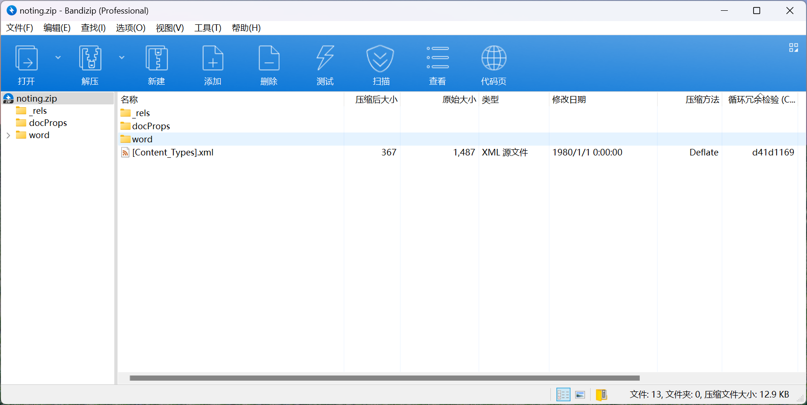

因此改后缀为.docx并打开，发现有一张白色的图片，还有一段白色的文字：什么都没有

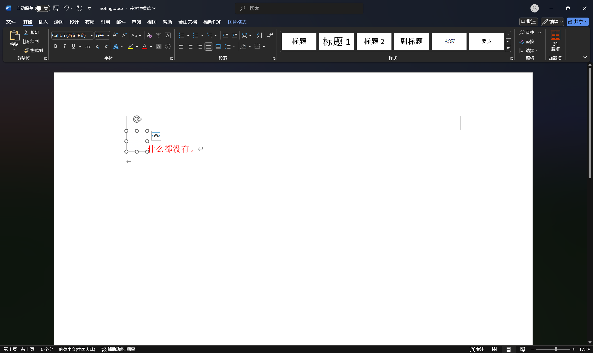

可以把DOCX作为ZIP解压，然后直接从`noting\word\media`路径中把这张白色图片`image1.png`提取出来

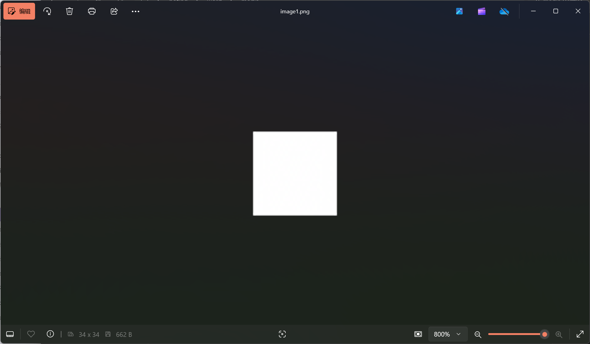

图片的大小是34x34，我们把图片分通道提取出来，猜测存在LSB隐写

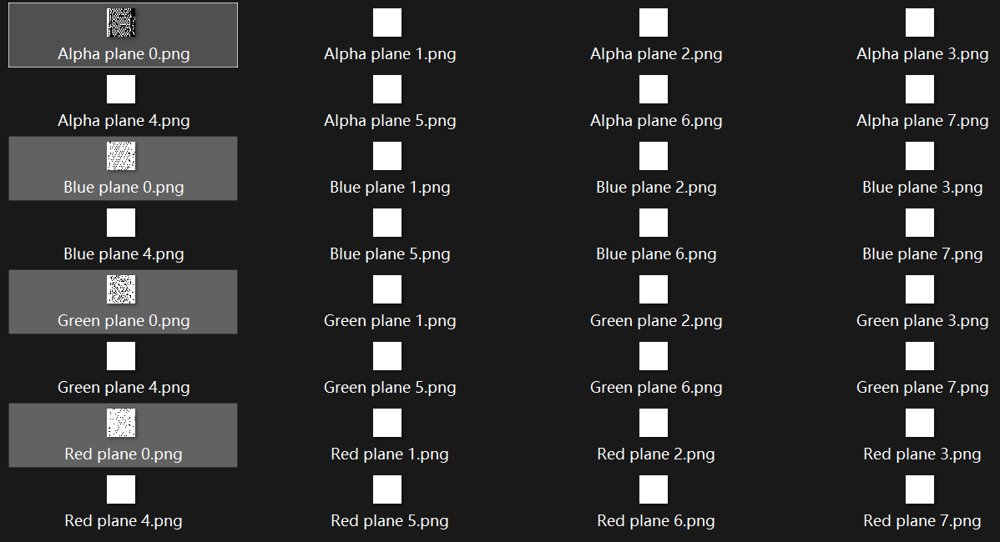

仔细观察各通道的数据，发现RGBA的0通道中都隐写了信息

RGBA里面都有LSB的数据，按道理来说一共就4x3x2x1=24种排列组合，爆破一下组合的顺序应该就能得到flag

但是我尝试后并没有发现flag，下面放的是我尝试的提取LSB数据的脚本

```python
from PIL import Image
import libnum
import itertools

img = Image.open(&#34;image1.png&#34;)
width,height = img.size
# print(width,height) 34 34 
r = []
g = []
b = []
a = []

for y in range(height):
    for x in range(width):
        pixel = img.getpixel((x,y))
        r.append(pixel[0]&amp;1)
        g.append(pixel[1]&amp;1)
        b.append(pixel[2]&amp;1)
        a.append(pixel[3]&amp;1)

channels = [&#39;r&#39;, &#39;g&#39;, &#39;b&#39;, &#39;a&#39;]
color_arrays = {&#39;r&#39;: r, &#39;g&#39;: g, &#39;b&#39;: b, &#39;a&#39;: a}
permutations = itertools.permutations(channels)

for perm in permutations:
    res = &#34;&#34;
    for i in range(len(r)):
        for channel in perm:
            res &#43;= str(color_arrays[channel][i])
    print(f&#34;[&#43;] {&#39; &#39;.join(perm)}&#34;)
    print(libnum.b2s(res))
    print()
```

后来在`@byxs20`师傅的帮助下，获得了新的解题思路，其实这张图片种一共就一下五种像素点

```
(255, 255, 255, 255)
(255, 255, 255, 254)
(255, 255, 254, 255)
(255, 254, 255, 255)
(254, 255, 255, 255)
```

其中`(255, 255, 255, 255)`像素是没有隐写数据的，然后另外几个像素分别按照254的位置用四进制隐写了数据

&gt; 这里为啥能想到`(255, 255, 255, 255)`像素是没有隐写数据的呢？
&gt; 
&gt; 因为如果师傅们尝试把不同像素的坐标打出来，可以发现这个像素是主要集中在前两列和第三列的前16个像素的
&gt; 
&gt; 因此比较有经验的Misc师傅就会感觉到，大段连在一起的相同像素是不存在隐写数据的，因此需要把这个像素剔除
&gt; 
&gt; 并且这里这样的排列方式，也提示了我们后续步骤中提取像素点需要按列提取

具体的对照表如下：

```python
table = {
        (255, 255, 255, 254):0,
        (255, 255, 254, 255):1,
        (255, 254, 255, 255):2,
        (254, 255, 255, 255):3
    }
```

然后具体隐写的原理就是每轮的值x4，再加上当前的四进制值，最后可以得到一个长整型，具体解密代码如下：

```python
def extract_data_from_img(img_name):
    img = Image.open(img_name)
    width,height = img.size
    # 四进制的表
    table = {
        (255, 255, 255, 254):0,
        (255, 255, 254, 255):1,
        (255, 254, 255, 255):2,
        (254, 255, 255, 255):3
    }
    raw_long = 0
    # 按列提取
    for x in range(width):
        for y in range(height):
            pixel = img.getpixel((x,y))
            if pixel != (255, 255, 255, 255):
                # print(pixel)
                raw_long = raw_long*4&#43;table[pixel]
    
    print(raw_long)
    data = long_to_bytes(raw_long)
    print(data)
    
    with open(&#34;out.zip&#34;,&#39;wb&#39;) as f:
        f.write(data)
```

还得是感谢B神脚本提供的思路，要不然根本想不到这个原理

运行以上脚本后就可以得到一个ZIP压缩包，但是Windows下直接打开是看不到内容的

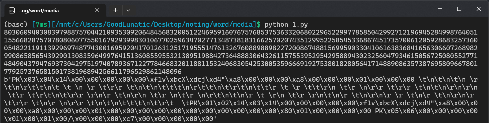

因为被压缩的文件内容包括文件名都是 `\r`、`\n`、`\t`、`空格` 这种空白字符

因此我们在**Linux**下使用脚本解压并提取其中的内容（因为Windows下看不到文件名为空格的文件）

然后里面内容的加密方式其实和上面的原理是一样的，也是四进制，就是具体的对照表是未知的

但是因为一共就四种字符，所以我们可以直接爆破一下

```python
def blankbytes_decode(raw, blank_character):
    raw_long = 0
    for c in raw:
        for i in range(len(blank_character)):
            if c == ord(blank_character[i]):
                raw_long = raw_long * 4 &#43; i
    return long_to_bytes(raw_long)

def blankbytes_brute(raw):
    blank_character_base = [b&#34;\x09&#34;, b&#34;\x0a&#34;, b&#34;\x0d&#34;, b&#34;\x20&#34;]
    for perm in permutations(blank_character_base):
        print(f&#34;Testing permutation: {perm}&#34;)
        try:
            result = blankbytes_decode(raw, perm)
            print(f&#34;Decoded result: {result}&#34;)
        except Exception as e:
            print(f&#34;Error with permutation {perm}: {e}&#34;)
```

爆破后即可得到正确的表和最后的flag：`flag{46eade75-846b-4d26-98f7-2cb3cb4686ed}`

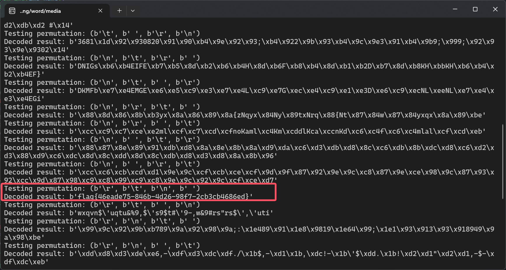

完整的解题脚本如下：

```python
from Crypto.Util.number import long_to_bytes
from itertools import permutations
from PIL import Image
import pyzipper


def extract_data_from_img(img_name):
    img = Image.open(img_name)
    width,height = img.size
    # 四进制的表
    table = {
        (255, 255, 255, 254):0,
        (255, 255, 254, 255):1,
        (255, 254, 255, 255):2,
        (254, 255, 255, 255):3
    }
    raw_long = 0
    # 按列提取
    for x in range(width):
        for y in range(height):
            pixel = img.getpixel((x,y))
            if pixel != (255, 255, 255, 255):
                # print(pixel)
                raw_long = raw_long*4&#43;table[pixel]
    
    print(raw_long)
    data = long_to_bytes(raw_long)
    print(data)
    
    with open(&#34;out.zip&#34;,&#39;wb&#39;) as f:
        f.write(data)

def blankbytes_decode(raw, blank_character):
    raw_long = 0
    for c in raw:
        for i in range(len(blank_character)):
            if c == ord(blank_character[i]):
                raw_long = raw_long * 4 &#43; i
    return long_to_bytes(raw_long)

def blankbytes_brute(raw):
    blank_character_base = [b&#34;\x09&#34;, b&#34;\x0a&#34;, b&#34;\x0d&#34;, b&#34;\x20&#34;]
    for perm in permutations(blank_character_base):
        print(f&#34;Testing permutation: {perm}&#34;)
        try:
            result = blankbytes_decode(raw, perm)
            print(f&#34;Decoded result: {result}&#34;)
        except Exception as e:
            print(f&#34;Error with permutation {perm}: {e}&#34;)


if __name__ == &#34;__main__&#34;:
    img_name = &#34;image1.png&#34;
    extract_data_from_img(img_name)
    zip_file = &#34;out.zip&#34;
    with pyzipper.ZipFile(zip_file,&#34;r&#34;) as zip_ref:
        zip_ref.extract(&#34; &#34;,&#34;./&#34;)
    with open(&#34; &#34;,&#34;rb&#34;) as f:
        data = f.read()
    res = blankbytes_brute(data)
    print(res)
```

## 题目名称 pingping (2024 蓝桥杯全国总决赛) 

题目附件： https://pan.baidu.com/s/1nE4F_kVzgRaDulA0xOjiWQ?pwd=33tm 提取码: 33tm


## 题目名称 tag (2023 福建省职业院校技能大赛高职组信息安全管理与评估)

题目附件：https://pan.baidu.com/s/1TJrAnVSDirjdl3xk6wJRHA?pwd=ee6p 提取码: ee6p

&gt; 参考链接：https://blog.csdn.net/m0_45155797/article/details/135027395

题目的内容就是要从下面这张图片中找出`evidence2`的字样


已经知道答案，但是不知道这个`evidence2`被出题人藏哪了，感觉是内幕题。。

## 题目名称 破译行动 (2024 ISCC 博弈对抗赛)

题目附件：https://pan.baidu.com/s/1GAhnDyy_2yplJeWibRsadg?pwd=py7u 提取码: py7u

赛后主办方给出了本题考察的知识点：

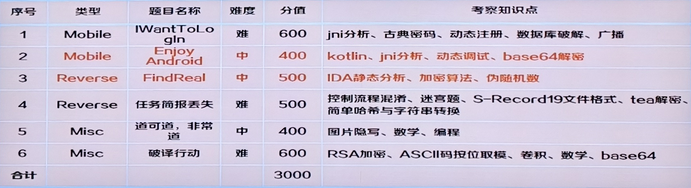

附件给了一张图片和一个TXT，其中TXT内容如下

&gt; 不要忘记我们的接头暗号:58,20,36,40,32,60,48,88,42,46,70,21,42, 6,51,71,40,14,30,4,37,25,28,7,39,46,20,33

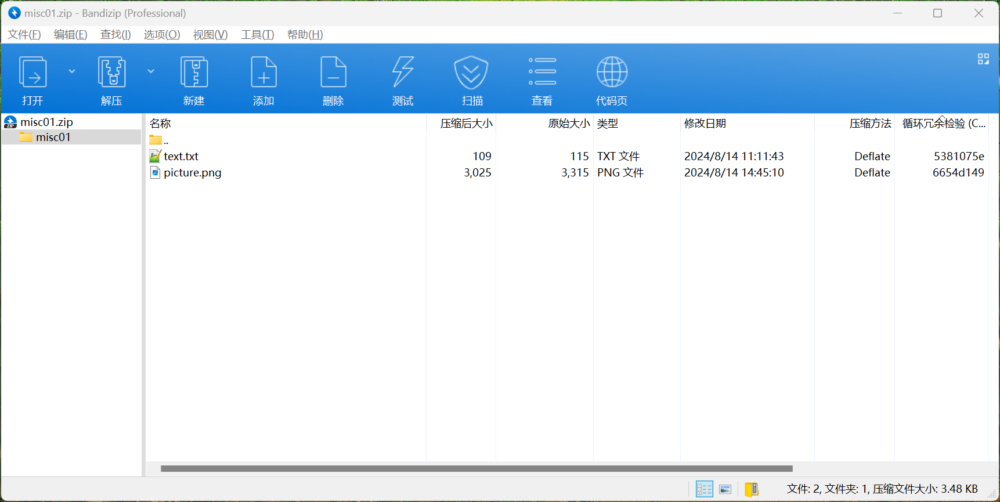

图片打开内容如下

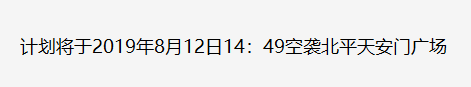

用010打开发现图片末尾藏了以下数据，并且提示了后面那串base64是加密后的

&gt; IHaveEncryptedTheSignalToPreventLeakage:U2FsdGVkX18SCg3hRbbWKiIXLrevGD0Sv0aCNfGr5YEBzPi8f7oWRq5vQ5QziXjuYrfShzuxlEQe9qAN0SYZUU&#43;cQLB3wREFNCyhjvhHTlt3dmTjDFElG3okDzg3Eu4Xj&#43;2AINbme9zgOjdsJgpVZg==

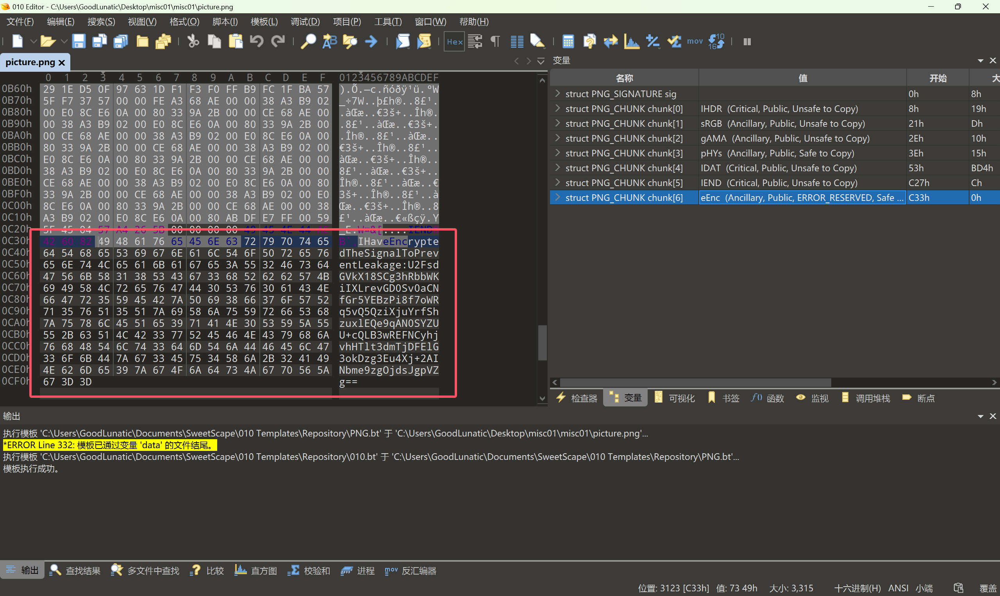

解密需要密钥，但是找不到密钥，猜测会和图片中的那个时间有关系，但是不知道具体什么关系。。


## 题目名称 道可道，非常道 (2024 ISCC 博弈对抗赛) [SOLVED]

&gt; 非常感谢 @Aura 师傅最后的奇思妙想，发现了频谱图中的二维码需要旋转，给这道题画上了圆满的句号。

题目附件： https://pan.baidu.com/s/1dyDJ_az_smtX6exFLinavg?pwd=pnet 提取码: pnet

赛后主办方给出了本题考察的知识点：


附件给了两个txt还有三个7z压缩包

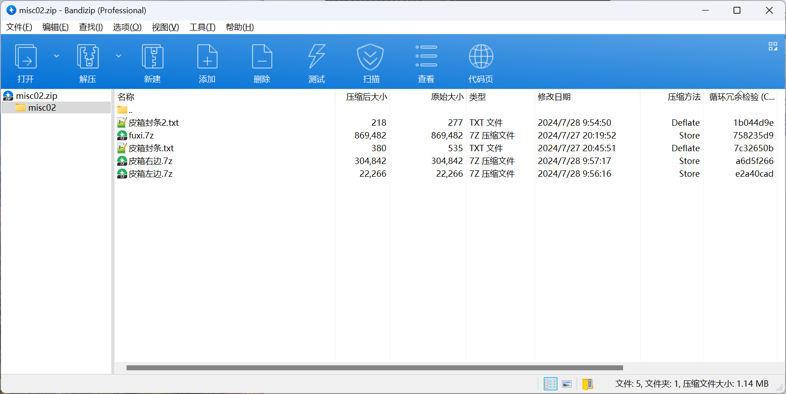

`皮箱封条.txt`的内容如下：

&gt; 大衍数列，来源于《乾坤谱》中对易传“大衍之数五十”的推论。主要用于解释中国传统文化中的太极衍生原理。
&gt; 
&gt; 数列中的每一项，都代表太极衍生过程中，曾经经历过的两仪数量总和。是中华传统文化中隐藏着的世界数学史上第一道数列题。
&gt; 
&gt; 请依据下面的提示总结出大衍数列的通项式
&gt; 
&gt; 0，2，4，8，12，18，24，32，40，50，60，72，84，98……
&gt; 
&gt; 最后请求出第22002244位是多少？（好像他比较喜欢十六进制）

解决该问题的脚本如下，最后算出答案是`242049370517768`，十六进制是`dc2482bf7108`

```python
lst = [0] * 22002245

for i in range(1,22002245):
    if i % 2 == 1:
        lst[i] = (i * i - 1) // 2
    else:
        lst[i] = (i * i) // 2
    
res = lst[22002244]
print(res,hex(res),hex(res)[2:])
# 242049370517768 0xdc2482bf7108 dc2482bf7108
```

尝试使用得到的答案去解压压缩包，但是发现不是解压密码，不知道哪里出问题了，因此打算直接爆破了

先用下面这个脚本生成所有可能的结果，然后把结果输出到一个字典中

用在线网站或者`7z2john`生成压缩包的hash，然后使用hashcat进行爆破

```python
lst = [0] * 22002245

for i in range(1,22002245):
    if i % 2 == 1:
        lst[i] = (i * i - 1) // 2
    else:
        lst[i] = (i * i) // 2
    print(hex(lst[i])[2:])
```

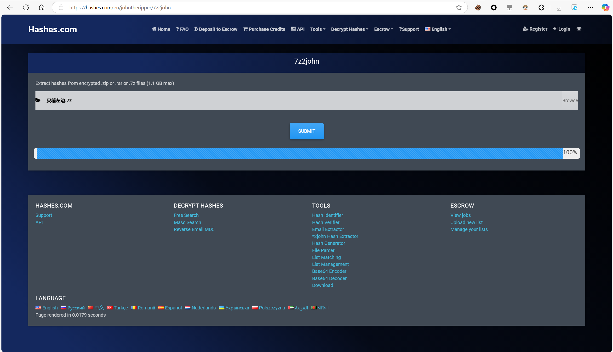

```bash
python3 1.py &gt; dic.txt
hashcat -a 0 -m 11600 hash.txt dic.txt
```

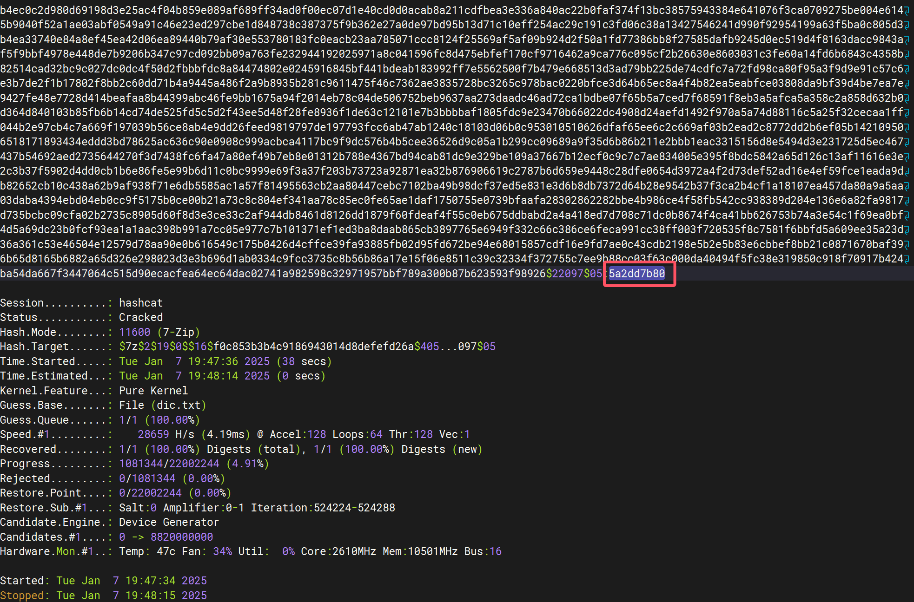

爆破即可得到`皮箱左边.7z`压缩包的解压密码：`5a2dd7b80`，这个数字转十进制是`24207260544`，是数列的第`220033`项

当然，这里也可以用 `PasswareKit` 进行爆破，大概要爆个十分钟左右也能得到压缩包的解压密码

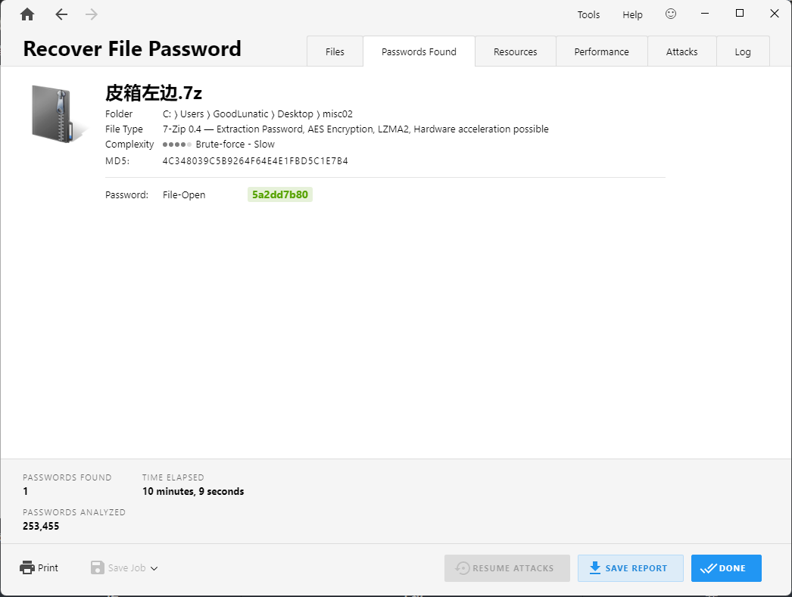

解压后可以得到下面这5张二维码碎片

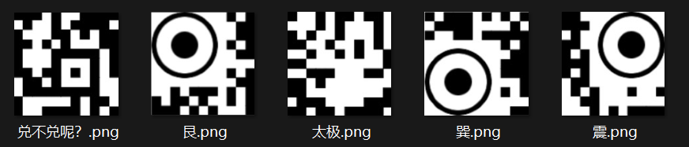

对二维码比较熟悉的师傅可以看出来，`兑不兑呢？`这个图片的位置好像有点不对劲

并且我们拿010打开可以在末尾得到一个提示：`overturn180`

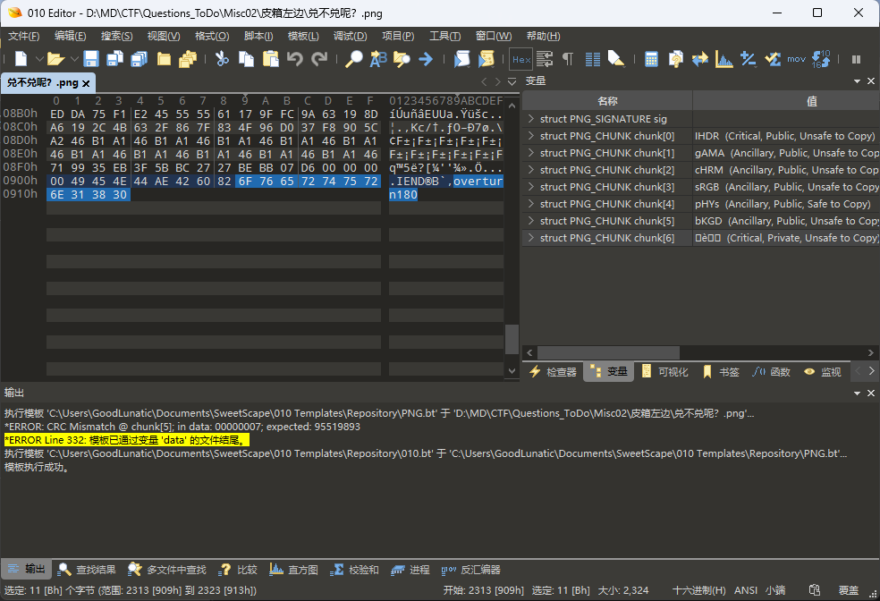

因此我们需要把上面那个`兑不兑呢？`图片旋转180度（当然，我一开始没看到这个提示，但也凭着感觉把这个图片旋转了180度。。

`皮箱封条2.txt`的内容如下：

&gt; 203879 * 203879 = 41566646641,
&gt; 
&gt; 仔细观察，203879 是个6位数，
&gt; 
&gt; 它的每个数位上的数字都是不同的，
&gt; 
&gt; 平方后的所有数位上都不出现组成它自身的数字。
&gt; 
&gt; 在1000000以内具有这样特点的6位数还有一个，两数相乘是多少？

解决该问题的脚本如下，可以得到另一个数为`639172`，因此和`203879`相乘的结果为`130313748188`

```python
for num in range(100000, 1000000):
    num_str = str(num)
    if len(set(num_str)) != len(num_str):
        continue
    tmp = num * num
    tmp_str = str(tmp)
    flag = False
    for digit in tmp_str:
        if digit in num_str:
            flag = True
            break
    if not flag:
        print(num, tmp)
        
# 203879 41566646641
# 639172 408540845584
```

经过尝试，发现`130313748188`的十六进制值`1e574dfedc`就是`皮箱右边.7z`的解压密码

解压后可以得到以下四个文件夹

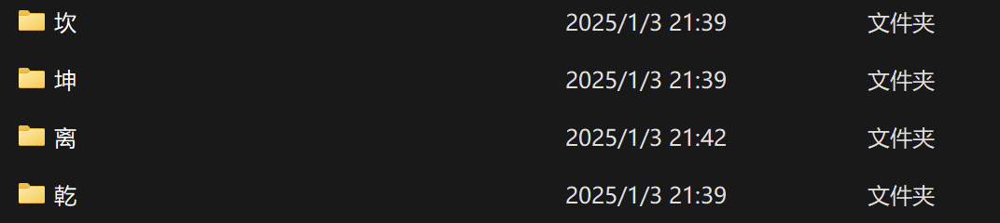

第一个文件夹里有加急密信.word，010打开查看文件头发现是PNG图片，改后缀为.png可以得到下图

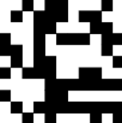

第二个文件夹里有个wav文件，au打开看频谱图可以得到下图

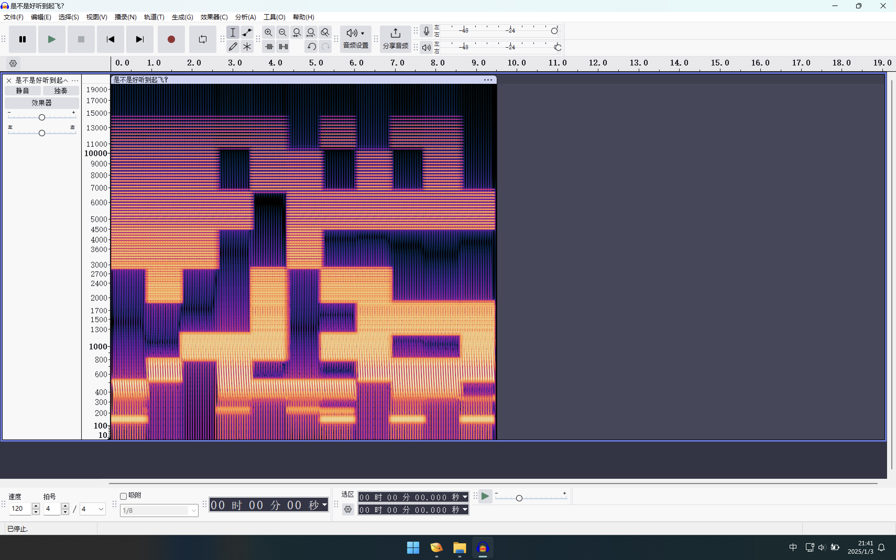

第三个文件夹里有一张宽高被修改导致CRC报错的PNG图片，还原宽高后可以得到下图


第四个文件夹里有一张food.png，直接stegsolve打开查看，发现红色通道里藏了下图

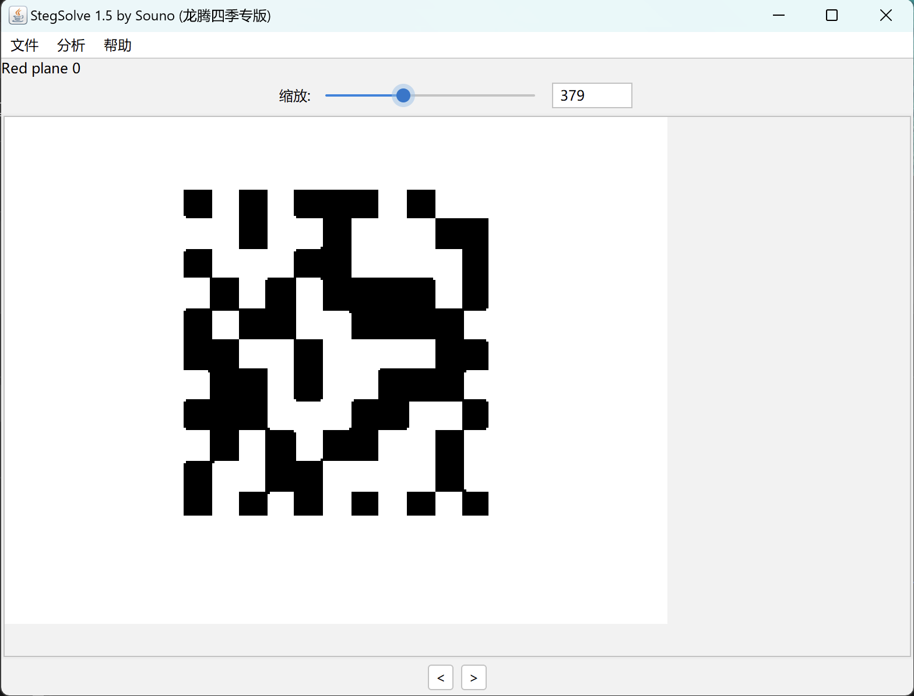

因此结合文件夹的名称和得到的类似二维码的碎片，大概就能猜到出题人的意图了。。

听说比赛快结束的时候，主办方给出了`fuxi.7z`的密码：`iscc1234`

&gt; 额，虽然确实是弱密码，但是大部分人字典里应该都没有这个吧
&gt; 
&gt; 直接爆破的话，8位的7zip密码也几乎不可能在赛中爆出来吧
&gt; 
&gt; 不知道出题人咋想的，有没有测过题？或者出题人就是一个完全不懂Misc的新手？

解压压缩包后，可以得到下面这张bmp图片

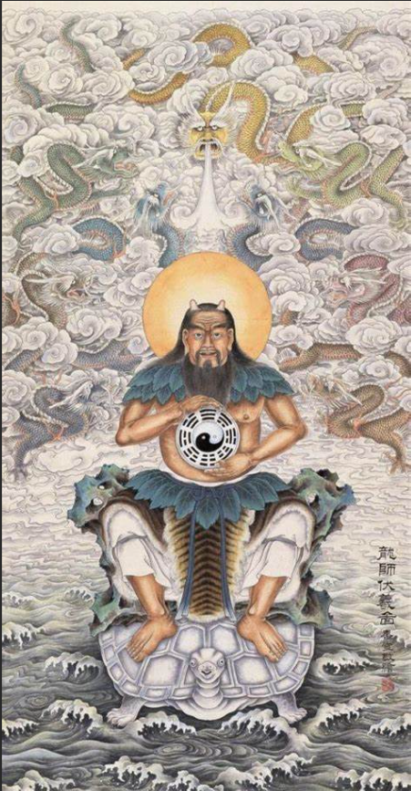

上面这张图片结合之前得到二维码碎片的文件名，很容易联想到是伏羲八卦图

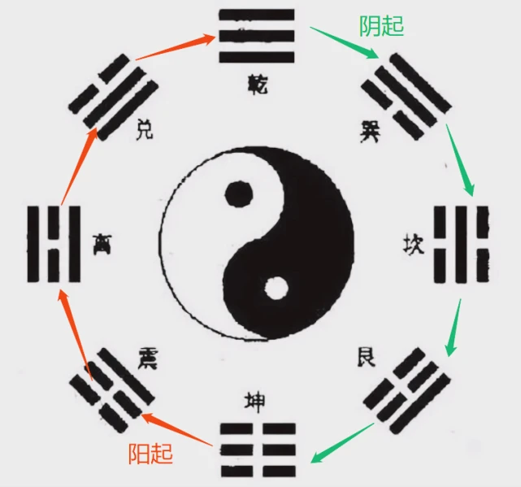

去网上搜一个伏羲八卦图，按照图中的顺序，二维码碎片的分布应该如下

| **艮** | **坤**  | **震** |
| :---: | :----: | :---: |
| **坎** | **太极** | **离** |
| **巽** | **乾**  | **兑** |

但是经过尝试，发现按照这个顺序拼出来的二维码扫出来是乱码，因此尝试换了一个想法

首先我们可以保证正确的是二维码三块定位块以及中间`太极`这几张图片的位置

我们尝试先将上面确定的四块用`QRazyBox`拼好，然后观察下图中红色框框标出的部分，猜测这两块碎片中一定有一行是这样的

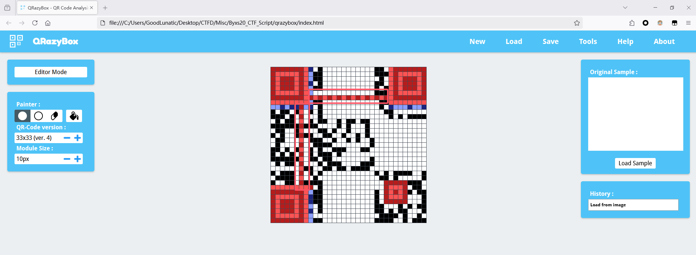

因此，经过对比，我们首先可以确定出左侧中部的那一块是`离`

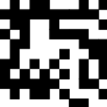

然后经过反复比对，发现中间上面那块找不到对应的碎片，这里需要感谢@Aura师傅，发现了wav频谱图中那块碎片旋转后正好符合

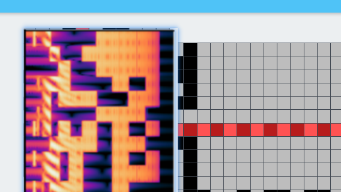

到这一步，我们就可以完全确定出每块碎片的位置了，因为`离`的对面肯定是`坎`，`坤`的对面肯定是`乾`

| **艮** | **坤**  | **震** |
| :---: | :----: | :---: |
| **离** | **太极** | **坎** |
| **巽** | **乾**  | **兑** |

最后我们用`QRazyBox`按照上面的顺序拼出完整的图片，然后扫码即可得到最后的flag：`ISCC{wisH_U_ki7mo5_all_tHe_bEst}`

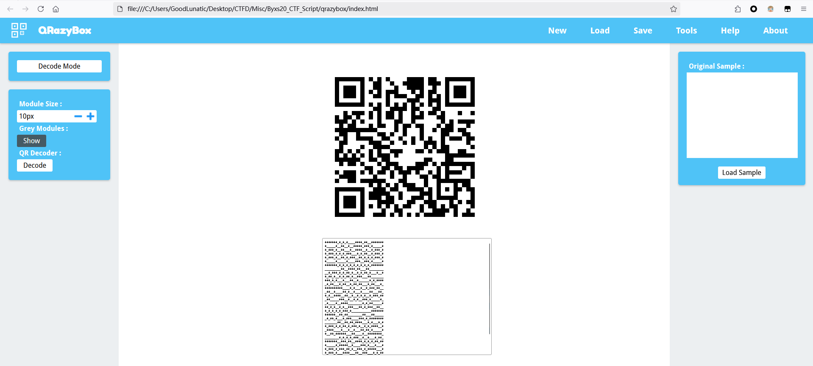

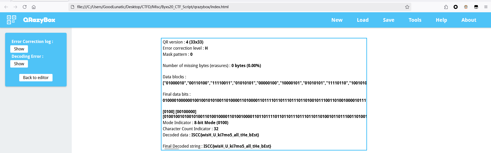

&gt; **完结撒花 \*★,°\*:.☆(￣▽￣)/$:\*.°★\* 。**
&gt; 
&gt; **不知道有没有和我一样一直在等待这道题答案的师傅，但是人海茫茫，还是感谢师傅们能看到这里！**

## 题目名称 QRSACode

题目附件： https://pan.baidu.com/s/1Jtgzh2AOcR4J7A-Wa-83LQ?pwd=8zcj 提取码: 8zcj

题面信息如下

&gt; 描述：p = 13,q = 19,e = ?

解压附件给的压缩包，可以得到如下两张图片，其中`task.png`中隐约可以看到一张二维码

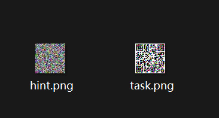

然后结合题面的信息，我们知道在RSA中`e`要和`phi`互质，其中`phi=(q-1)*(p-1)`

因此我们可以写个脚本得到`e`所有可能的取值范围

```python
import gmpy2

def cal_e():
    p = 13
    q = 19
    phi = (p - 1) * (q - 1)
    res = [e for e in range(2, 256) if gmpy2.gcd(e, phi) == 1]
    # print(len(res)) # 84
    # print(res)
    return res
```

得到`e`所有可能的取值如下，一共84种可能取值：

```
[5, 7, 11, 13, 17, 19, 23, 25, 29, 31, 35, 37, 41, 43, 47, 49, 53, 55, 59, 61, 65, 67, 71, 73, 77, 79, 83, 85, 89, 91, 95, 97, 101, 103, 107, 109, 113, 115, 119, 121, 125, 127, 131, 133, 137, 139, 143, 145, 149, 151, 155, 157, 161, 163, 167, 169, 173, 175, 179, 181, 185, 187, 191, 193, 197, 199, 203, 205, 209, 211, 215, 217, 221, 223, 227, 229, 233, 235, 239, 241, 245, 247, 251, 253]
```

然后我们尝试去读取`hint.png`中的像素点

```python
def func1():
    dic = {}
    img1 = Image.open(&#34;hint.png&#34;)
    width,height = img1.size # 50 50
    for y in range(height):
        for x in range(width):
            pixel = img1.getpixel((x,y))
            if pixel not in dic:
                dic[pixel] = 1
            else:
                dic[pixel] &#43;= 1
    # print(len(dic)) # 2496
    print(dic)
```

发现2500个像素点中有2496种像素，并且只有以下两种像素出现了2次，别的像素都是只出现一次

```
(133, 167, 215): 2
(31, 163, 119): 2
```

我们把所有像素打印出来可以发现，每个像素的RGB值都是取自我们之前得到的`e`的取值范围中

然后我们再去看`task.png`，发现图像时RGBA格式的，只不过A通道的值都是255

```python
def solve():
    dic = {}
    img1 = Image.open(&#34;task.png&#34;)
    width,height = img1.size # 50 50
    for y in range(height):
        for x in range(width):
            pixel = img1.getpixel((x,y))
            if pixel not in dic:
                dic[pixel] = 1
            else:
                dic[pixel] &#43;= 1
    # print(len(dic)) # 1112
    # print(dic)
```

发现一共有1112种不同的像素

并且背景接近白色的像素点的RGBA的值为`(246, 246, 246, 255)`，黑色像素点的RGBA值为`(0, 0, 0, 255)`

&gt; 目前的想法是：题目需要我们根据像素的某种规律，去除`task.png`种的干扰像素，复原原始的二维码


## 题目名称 Boxing Boxer

题目附件： https://pan.baidu.com/s/195It-h7CBEXJ53-cV9MkoA?pwd=dahr 提取码: dahr

题面信息如下：

&gt; A boxing boxer unbox a box in which another box boxes little boxes and boxes and boxes and so on.
&gt; 
&gt; 翻译：一位拳击手打开一个箱子，里面装着另一个装满小箱子的箱子，而这些小箱子里面又装着更多的小箱子，如此这般，层层叠叠。

解压附件压缩包，可以得到一个`flag.gif`


尝试分帧提取，可以得到504张图片

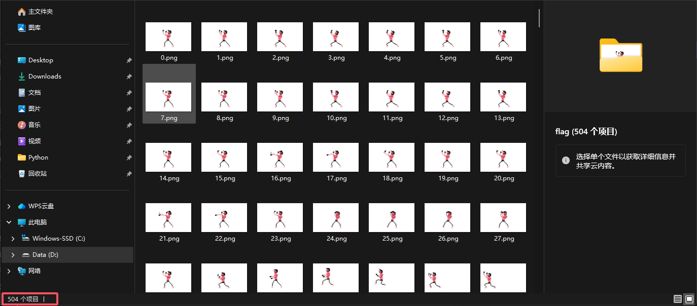

尝试用`stegsolve`查看每张图片的LSB信息，并没有发现什么特殊的信息

然后尝试提取出GIF每一帧的间隔，可以得到如下内容，发现开头和结尾都是70，一共`32&#43;31=63`个

```
[&#39;70&#39;, &#39;70&#39;, &#39;70&#39;, &#39;70&#39;, &#39;70&#39;, &#39;70&#39;, &#39;70&#39;, &#39;70&#39;, &#39;70&#39;, &#39;70&#39;, &#39;70&#39;, &#39;70&#39;, &#39;70&#39;, &#39;70&#39;, &#39;70&#39;, &#39;70&#39;, &#39;70&#39;, &#39;70&#39;, &#39;70&#39;, &#39;70&#39;, &#39;70&#39;, &#39;70&#39;, &#39;70&#39;, &#39;70&#39;, &#39;70&#39;, &#39;70&#39;, &#39;70&#39;, &#39;70&#39;, &#39;70&#39;, &#39;70&#39;, &#39;70&#39;, &#39;70&#39;, &#39;50&#39;, &#39;60&#39;, &#39;50&#39;, &#39;50&#39;, &#39;50&#39;, &#39;50&#39;, &#39;50&#39;, &#39;50&#39;, &#39;60&#39;, &#39;50&#39;, &#39;60&#39;, &#39;50&#39;, &#39;60&#39;, &#39;50&#39;, &#39;60&#39;, &#39;60&#39;, &#39;50&#39;, &#39;60&#39;, &#39;60&#39;, &#39;60&#39;, &#39;50&#39;, &#39;50&#39;, &#39;50&#39;, &#39;60&#39;, &#39;50&#39;, &#39;50&#39;, &#39;50&#39;, &#39;50&#39;, &#39;60&#39;, &#39;50&#39;, &#39;50&#39;, &#39;50&#39;, &#39;60&#39;, &#39;60&#39;, &#39;60&#39;, &#39;50&#39;, &#39;50&#39;, &#39;60&#39;, &#39;50&#39;, &#39;60&#39;, &#39;60&#39;, &#39;50&#39;, &#39;60&#39;, &#39;50&#39;, &#39;60&#39;, &#39;60&#39;, &#39;50&#39;, &#39;50&#39;, &#39;60&#39;, &#39;60&#39;, &#39;60&#39;, &#39;50&#39;, &#39;60&#39;, &#39;50&#39;, &#39;50&#39;, &#39;60&#39;, &#39;60&#39;, &#39;60&#39;, &#39;50&#39;, &#39;60&#39;, &#39;50&#39;, &#39;50&#39;, &#39;60&#39;, &#39;50&#39;, &#39;60&#39;, &#39;50&#39;, &#39;60&#39;, &#39;60&#39;, &#39;60&#39;, &#39;50&#39;, &#39;60&#39;, &#39;60&#39;, &#39;60&#39;, &#39;60&#39;, &#39;60&#39;, &#39;60&#39;, &#39;50&#39;, &#39;60&#39;, &#39;60&#39;, &#39;60&#39;, &#39;60&#39;, &#39;60&#39;, &#39;60&#39;, &#39;60&#39;, &#39;60&#39;, &#39;60&#39;, &#39;50&#39;, &#39;60&#39;, &#39;60&#39;, &#39;50&#39;, &#39;60&#39;, &#39;50&#39;, &#39;50&#39;, &#39;60&#39;, &#39;50&#39;, &#39;50&#39;, &#39;50&#39;, &#39;60&#39;, &#39;60&#39;, &#39;50&#39;, &#39;50&#39;, &#39;60&#39;, &#39;50&#39;, &#39;50&#39;, &#39;60&#39;, &#39;60&#39;, &#39;50&#39;, &#39;50&#39;, &#39;50&#39;, &#39;60&#39;, &#39;60&#39;, &#39;50&#39;, &#39;50&#39;, &#39;60&#39;, &#39;50&#39;, &#39;50&#39;, &#39;50&#39;, &#39;50&#39;, &#39;50&#39;, &#39;60&#39;, &#39;50&#39;, &#39;60&#39;, &#39;50&#39;, &#39;60&#39;, &#39;60&#39;, &#39;60&#39;, &#39;60&#39;, &#39;50&#39;, &#39;50&#39;, &#39;50&#39;, &#39;50&#39;, &#39;60&#39;, &#39;60&#39;, &#39;50&#39;, &#39;60&#39;, &#39;50&#39;, &#39;50&#39;, &#39;50&#39;, &#39;50&#39;, &#39;50&#39;, &#39;60&#39;, &#39;50&#39;, &#39;60&#39;, &#39;50&#39;, &#39;50&#39;, &#39;50&#39;, &#39;60&#39;, &#39;50&#39;, &#39;60&#39;, &#39;60&#39;, &#39;60&#39;, &#39;50&#39;, &#39;60&#39;, &#39;60&#39;, &#39;60&#39;, &#39;60&#39;, &#39;50&#39;, &#39;50&#39;, &#39;50&#39;, &#39;60&#39;, &#39;50&#39;, &#39;50&#39;, &#39;50&#39;, &#39;50&#39;, &#39;60&#39;, &#39;50&#39;, &#39;60&#39;, &#39;50&#39;, &#39;60&#39;, &#39;60&#39;, &#39;50&#39;, &#39;60&#39;, &#39;60&#39;, &#39;50&#39;, &#39;60&#39;, &#39;50&#39;, &#39;60&#39;, &#39;60&#39;, &#39;50&#39;, &#39;60&#39;, &#39;60&#39;, &#39;50&#39;, &#39;50&#39;, &#39;60&#39;, &#39;60&#39;, &#39;60&#39;, &#39;50&#39;, &#39;60&#39;, &#39;50&#39;, &#39;50&#39;, &#39;50&#39;, &#39;50&#39;, &#39;50&#39;, &#39;60&#39;, &#39;50&#39;, &#39;50&#39;, &#39;50&#39;, &#39;50&#39;, &#39;60&#39;, &#39;60&#39;, &#39;50&#39;, &#39;60&#39;, &#39;50&#39;, &#39;60&#39;, &#39;60&#39;, &#39;50&#39;, &#39;50&#39;, &#39;50&#39;, &#39;50&#39;, &#39;60&#39;, &#39;60&#39;, &#39;50&#39;, &#39;50&#39;, &#39;60&#39;, &#39;60&#39;, &#39;50&#39;, &#39;50&#39;, &#39;60&#39;, &#39;50&#39;, &#39;60&#39;, &#39;50&#39;, &#39;50&#39;, &#39;50&#39;, &#39;60&#39;, &#39;50&#39;, &#39;50&#39;, &#39;60&#39;, &#39;60&#39;, &#39;60&#39;, &#39;50&#39;, &#39;50&#39;, &#39;50&#39;, &#39;60&#39;, &#39;60&#39;, &#39;60&#39;, &#39;50&#39;, &#39;50&#39;, &#39;50&#39;, &#39;60&#39;, &#39;60&#39;, &#39;50&#39;, &#39;60&#39;, &#39;50&#39;, &#39;60&#39;, &#39;50&#39;, &#39;50&#39;, &#39;60&#39;, &#39;50&#39;, &#39;50&#39;, &#39;50&#39;, &#39;50&#39;, &#39;50&#39;, &#39;60&#39;, &#39;60&#39;, &#39;60&#39;, &#39;60&#39;, &#39;50&#39;, &#39;60&#39;, &#39;60&#39;, &#39;60&#39;, &#39;60&#39;, &#39;60&#39;, &#39;60&#39;, &#39;60&#39;, &#39;50&#39;, &#39;60&#39;, &#39;50&#39;, &#39;50&#39;, &#39;60&#39;, &#39;50&#39;, &#39;60&#39;, &#39;60&#39;, &#39;60&#39;, &#39;60&#39;, &#39;50&#39;, &#39;60&#39;, &#39;60&#39;, &#39;50&#39;, &#39;50&#39;, &#39;50&#39;, &#39;60&#39;, &#39;50&#39;, &#39;50&#39;, &#39;50&#39;, &#39;60&#39;, &#39;60&#39;, &#39;50&#39;, &#39;50&#39;, &#39;60&#39;, &#39;50&#39;, &#39;50&#39;, &#39;50&#39;, &#39;60&#39;, &#39;50&#39;, &#39;60&#39;, &#39;60&#39;, &#39;60&#39;, &#39;60&#39;, &#39;60&#39;, &#39;60&#39;, &#39;60&#39;, &#39;60&#39;, &#39;60&#39;, &#39;50&#39;, &#39;50&#39;, &#39;60&#39;, &#39;50&#39;, &#39;60&#39;, &#39;60&#39;, &#39;60&#39;, &#39;50&#39;, &#39;60&#39;, &#39;50&#39;, &#39;60&#39;, &#39;60&#39;, &#39;60&#39;, &#39;50&#39;, &#39;60&#39;, &#39;50&#39;, &#39;50&#39;, &#39;50&#39;, &#39;50&#39;, &#39;50&#39;, &#39;50&#39;, &#39;60&#39;, &#39;60&#39;, &#39;50&#39;, &#39;60&#39;, &#39;60&#39;, &#39;60&#39;, &#39;50&#39;, &#39;60&#39;, &#39;60&#39;, &#39;50&#39;, &#39;50&#39;, &#39;50&#39;, &#39;50&#39;, &#39;50&#39;, &#39;60&#39;, &#39;50&#39;, &#39;50&#39;, &#39;60&#39;, &#39;50&#39;, &#39;60&#39;, &#39;50&#39;, &#39;50&#39;, &#39;60&#39;, &#39;60&#39;, &#39;50&#39;, &#39;50&#39;, &#39;60&#39;, &#39;50&#39;, &#39;50&#39;, &#39;60&#39;, &#39;60&#39;, &#39;60&#39;, &#39;50&#39;, &#39;60&#39;, &#39;50&#39;, &#39;60&#39;, &#39;60&#39;, &#39;60&#39;, &#39;60&#39;, &#39;60&#39;, &#39;60&#39;, &#39;60&#39;, &#39;50&#39;, &#39;60&#39;, &#39;50&#39;, &#39;60&#39;, &#39;60&#39;, &#39;50&#39;, &#39;50&#39;, &#39;60&#39;, &#39;60&#39;, &#39;50&#39;, &#39;60&#39;, &#39;60&#39;, &#39;50&#39;, &#39;50&#39;, &#39;60&#39;, &#39;50&#39;, &#39;50&#39;, &#39;50&#39;, &#39;60&#39;, &#39;50&#39;, &#39;60&#39;, &#39;50&#39;, &#39;60&#39;, &#39;50&#39;, &#39;50&#39;, &#39;60&#39;, &#39;50&#39;, &#39;60&#39;, &#39;60&#39;, &#39;50&#39;, &#39;60&#39;, &#39;50&#39;, &#39;60&#39;, &#39;50&#39;, &#39;60&#39;, &#39;60&#39;, &#39;50&#39;, &#39;60&#39;, &#39;60&#39;, &#39;60&#39;, &#39;60&#39;, &#39;60&#39;, &#39;50&#39;, &#39;50&#39;, &#39;60&#39;, &#39;50&#39;, &#39;60&#39;, &#39;50&#39;, &#39;60&#39;, &#39;50&#39;, &#39;50&#39;, &#39;50&#39;, &#39;60&#39;, &#39;60&#39;, &#39;60&#39;, &#39;50&#39;, &#39;50&#39;, &#39;50&#39;, &#39;50&#39;, &#39;60&#39;, &#39;60&#39;, &#39;50&#39;, &#39;50&#39;, &#39;50&#39;, &#39;50&#39;, &#39;60&#39;, &#39;50&#39;, &#39;60&#39;, &#39;60&#39;, &#39;50&#39;, &#39;60&#39;, &#39;50&#39;, &#39;50&#39;, &#39;60&#39;, &#39;60&#39;, &#39;70&#39;, &#39;70&#39;, &#39;70&#39;, &#39;70&#39;, &#39;70&#39;, &#39;70&#39;, &#39;70&#39;, &#39;70&#39;, &#39;70&#39;, &#39;70&#39;, &#39;70&#39;, &#39;70&#39;, &#39;70&#39;, &#39;70&#39;, &#39;70&#39;, &#39;70&#39;, &#39;70&#39;, &#39;70&#39;, &#39;70&#39;, &#39;70&#39;, &#39;70&#39;, &#39;70&#39;, &#39;70&#39;, &#39;70&#39;, &#39;70&#39;, &#39;70&#39;, &#39;70&#39;, &#39;70&#39;, &#39;70&#39;, &#39;70&#39;, &#39;70&#39;]
```

除去开头和结尾的70，发现中间的部分只有50和60，然后统计了一下一共441个，因为`441=21x21`

所以我们猜测可能隐写了一张二维码，我们尝试把50和60转为0和1，然后尝试绘制二维码，可以得到下面这些图片

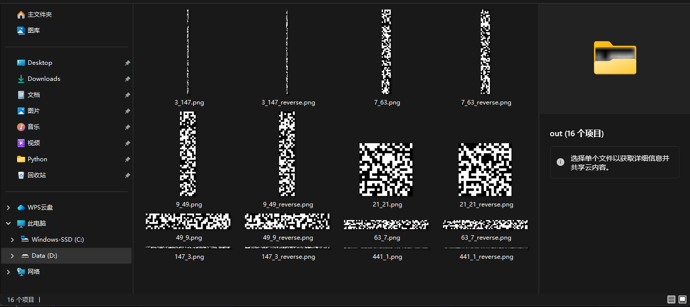

转换出来后发现并不是二维码，并且尝试直接二进制转字符串也得不到什么有效的信息

```python
import libnum

bin_data = &#34;010000001010101101110001000010001110010110101100111010011101001010111011111101111111110110100100011001001100011001000001010111100001101000001010001011101111000100001010110110101101100111010000010000110101100001100110010100010011100011100011010100100000111101111111010010111101100010001100100010111111111001011101011101000000110111011000001001010011001001110101111111010110011011001000101010010110101011011111001010100011100001100001011010011&#34;

print(libnum.b2s(bin_data))
# b&#39;\x81V\xe2\x11\xcbY\xd3\xa5w\xef\xfbH\xc9\x8c\x82\xbc4\x14]\xe2\x15\xb5\xb3\xa0\x86\xb0\xcc\xa2q\xc6\xa4\x1e\xfe\x97\xb1\x19\x17\xfc\xba\xe8\x1b\xb0Jd\xeb\xfa\xcd\x91R\xd5\xbeTp\xc2\xd3&#39;
```


---

> Author: [Lunatic](https://goodlunatic.github.io)  
> URL: https://goodlunatic.github.io/posts/d0736a7/  

