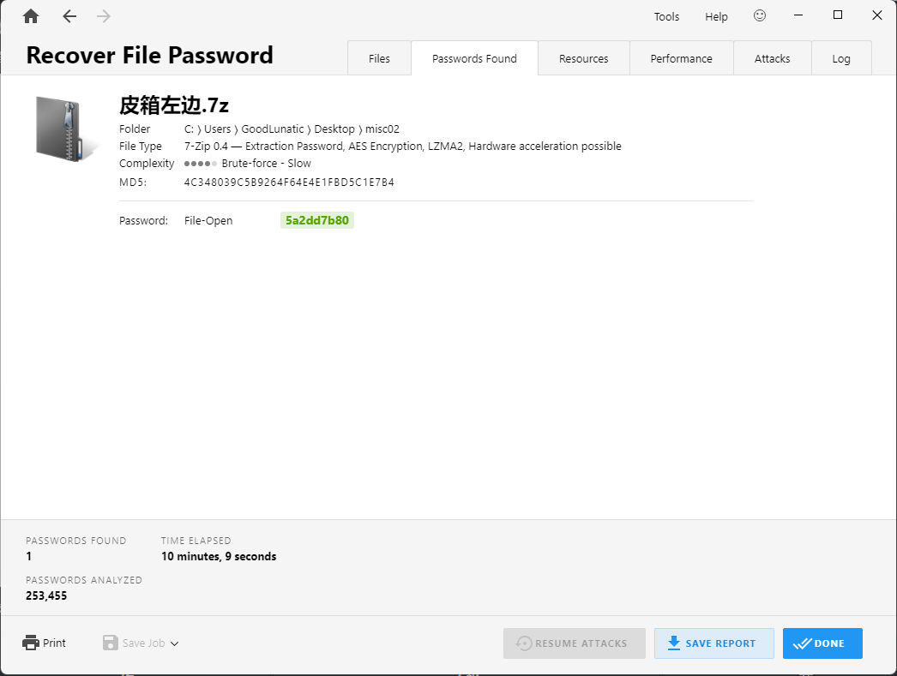
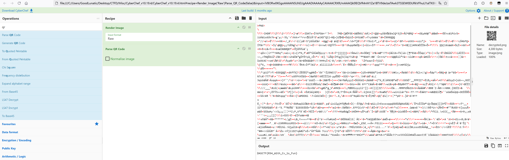
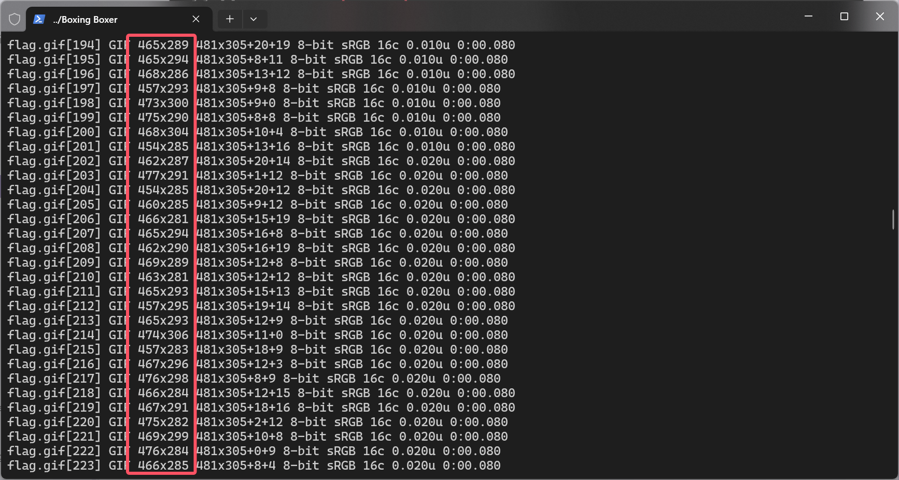
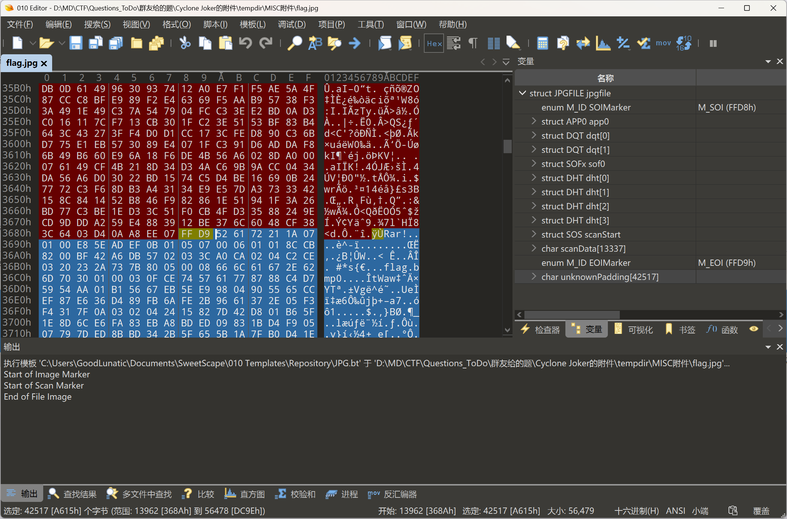
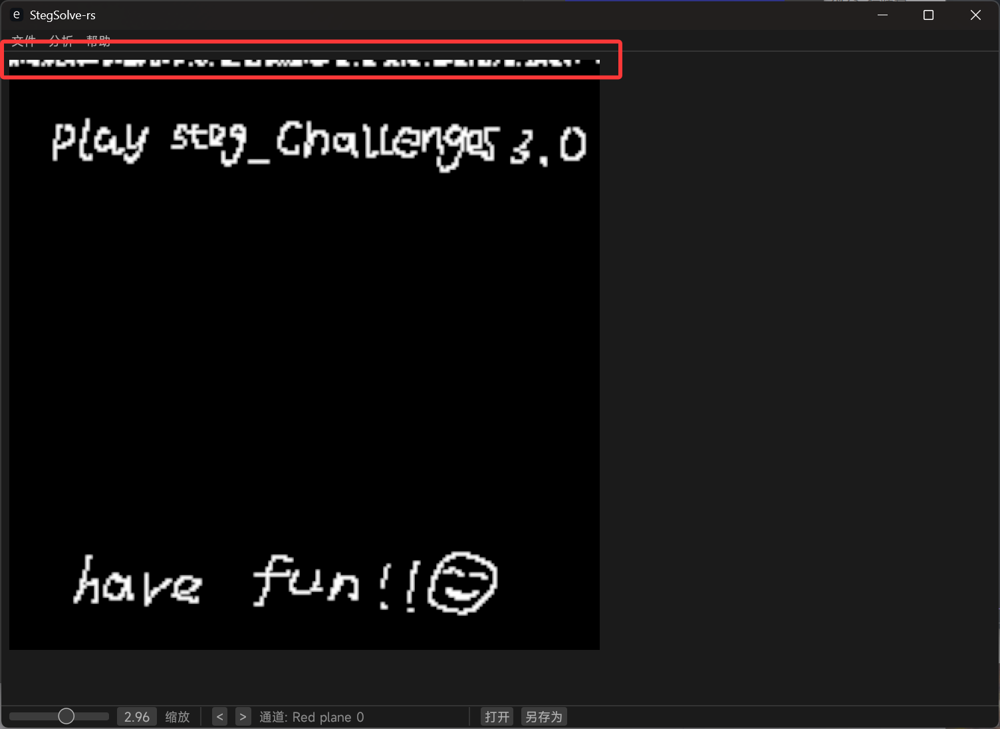
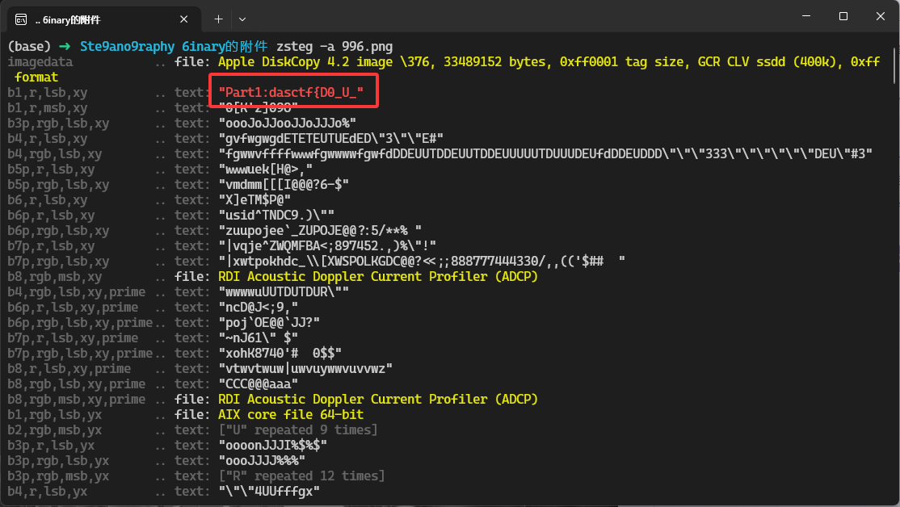
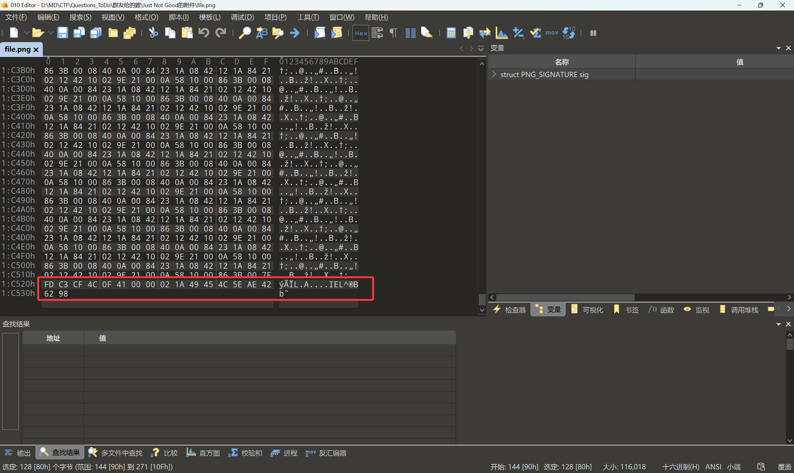

# CTF-Misc "雅"题共赏

**用这篇博客来记录一下本人在比赛中遇到的一些疑难题（本人尚未解出的题）**

**如果师傅们有进一步的想法或者做出来了，可以联系我一起交流一下解题思路**
<!--more-->



**这篇博客可以算是本人的求助贴，因此本文中的大部分内容并不适合刚接触Misc方向的新同学**

**尝试本文中提到的相关题目可能会耗费大量时间，请各位读者量力而行【慎行】**



## [SOLVED] 题目名称 nothing (2024 蓝桥杯全国总决赛)

> 题目附件： https://pan.baidu.com/s/1eGIfajRXx3uqjlk54CaZ1g?pwd=ax6g 提取码: ax6g

下载附件，得到一个`noting.zip`，打开发现是DOCX的结构


因此改后缀为.docx并打开，发现有一张白色的图片，还有一段白色的文字：什么都没有


可以把DOCX作为ZIP解压，然后直接从`noting\word\media`路径中把这张白色图片`image1.png`提取出来


图片的大小是34x34，我们把图片分通道提取出来，猜测存在LSB隐写


仔细观察各通道的数据，发现RGBA的0通道中都隐写了信息

RGBA里面都有LSB的数据，按道理来说一共就4x3x2x1=24种排列组合，爆破一下组合的顺序应该就能得到flag

但是我尝试后并没有发现flag，下面放的是我尝试的提取LSB数据的脚本

```python
from PIL import Image
import libnum
import itertools

img = Image.open("image1.png")
width,height = img.size
# print(width,height) 34 34 
r = []
g = []
b = []
a = []

for y in range(height):
    for x in range(width):
        pixel = img.getpixel((x,y))
        r.append(pixel[0]&1)
        g.append(pixel[1]&1)
        b.append(pixel[2]&1)
        a.append(pixel[3]&1)

channels = ['r', 'g', 'b', 'a']
color_arrays = {'r': r, 'g': g, 'b': b, 'a': a}
permutations = itertools.permutations(channels)

for perm in permutations:
    res = ""
    for i in range(len(r)):
        for channel in perm:
            res += str(color_arrays[channel][i])
    print(f"[+] {' '.join(perm)}")
    print(libnum.b2s(res))
    print()
```

后来在`@byxs20`师傅的帮助下，获得了新的解题思路，其实这张图片种一共就一下五种像素点

```
(255, 255, 255, 255)
(255, 255, 255, 254)
(255, 255, 254, 255)
(255, 254, 255, 255)
(254, 255, 255, 255)
```

其中`(255, 255, 255, 255)`像素是没有隐写数据的，然后另外几个像素分别按照254的位置用四进制隐写了数据

> 这里为啥能想到`(255, 255, 255, 255)`像素是没有隐写数据的呢？
> 
> 因为如果师傅们尝试把不同像素的坐标打出来，可以发现这个像素是主要集中在前两列和第三列的前16个像素的
> 
> 因此比较有经验的Misc师傅就会感觉到，大段连在一起的相同像素是不存在隐写数据的，因此需要把这个像素剔除
> 
> 并且这里这样的排列方式，也提示了我们后续步骤中提取像素点需要按列提取

具体的对照表如下：

```python
table = {
        (255, 255, 255, 254):0,
        (255, 255, 254, 255):1,
        (255, 254, 255, 255):2,
        (254, 255, 255, 255):3
    }
```

然后具体隐写的原理就是每轮的值x4，再加上当前的四进制值，最后可以得到一个长整型，具体解密代码如下：

```python
def extract_data_from_img(img_name):
    img = Image.open(img_name)
    width,height = img.size
    # 四进制的表
    table = {
        (255, 255, 255, 254):0,
        (255, 255, 254, 255):1,
        (255, 254, 255, 255):2,
        (254, 255, 255, 255):3
    }
    raw_long = 0
    # 按列提取
    for x in range(width):
        for y in range(height):
            pixel = img.getpixel((x,y))
            if pixel != (255, 255, 255, 255):
                # print(pixel)
                raw_long = raw_long*4+table[pixel]
    
    print(raw_long)
    data = long_to_bytes(raw_long)
    print(data)
    
    with open("out.zip",'wb') as f:
        f.write(data)
```

还得是感谢B神脚本提供的思路，要不然根本想不到这个原理

运行以上脚本后就可以得到一个ZIP压缩包，但是Windows下直接打开是看不到内容的


因为被压缩的文件内容包括文件名都是 `\r`、`\n`、`\t`、`空格` 这种空白字符

因此我们在**Linux**下使用脚本解压并提取其中的内容（因为Windows下看不到文件名为空格的文件）

然后里面内容的加密方式其实和上面的原理是一样的，也是四进制，就是具体的对照表是未知的

但是因为一共就四种字符，所以我们可以直接爆破一下

```python
def blankbytes_decode(raw, blank_character):
    raw_long = 0
    for c in raw:
        for i in range(len(blank_character)):
            if c == ord(blank_character[i]):
                raw_long = raw_long * 4 + i
    return long_to_bytes(raw_long)

def blankbytes_brute(raw):
    blank_character_base = [b"\x09", b"\x0a", b"\x0d", b"\x20"]
    for perm in permutations(blank_character_base):
        print(f"Testing permutation: {perm}")
        try:
            result = blankbytes_decode(raw, perm)
            print(f"Decoded result: {result}")
        except Exception as e:
            print(f"Error with permutation {perm}: {e}")
```

爆破后即可得到正确的表和最后的flag：`flag{46eade75-846b-4d26-98f7-2cb3cb4686ed}`


完整的解题脚本如下：

```python
from Crypto.Util.number import long_to_bytes
from itertools import permutations
from PIL import Image
import pyzipper


def extract_data_from_img(img_name):
    img = Image.open(img_name)
    width,height = img.size
    # 四进制的表
    table = {
        (255, 255, 255, 254):0,
        (255, 255, 254, 255):1,
        (255, 254, 255, 255):2,
        (254, 255, 255, 255):3
    }
    raw_long = 0
    # 按列提取
    for x in range(width):
        for y in range(height):
            pixel = img.getpixel((x,y))
            if pixel != (255, 255, 255, 255):
                # print(pixel)
                raw_long = raw_long*4+table[pixel]
    
    print(raw_long)
    data = long_to_bytes(raw_long)
    print(data)
    
    with open("out.zip",'wb') as f:
        f.write(data)

def blankbytes_decode(raw, blank_character):
    raw_long = 0
    for c in raw:
        for i in range(len(blank_character)):
            if c == ord(blank_character[i]):
                raw_long = raw_long * 4 + i
    return long_to_bytes(raw_long)

def blankbytes_brute(raw):
    blank_character_base = [b"\x09", b"\x0a", b"\x0d", b"\x20"]
    for perm in permutations(blank_character_base):
        print(f"Testing permutation: {perm}")
        try:
            result = blankbytes_decode(raw, perm)
            print(f"Decoded result: {result}")
        except Exception as e:
            print(f"Error with permutation {perm}: {e}")


if __name__ == "__main__":
    img_name = "image1.png"
    extract_data_from_img(img_name)
    zip_file = "out.zip"
    with pyzipper.ZipFile(zip_file,"r") as zip_ref:
        zip_ref.extract(" ","./")
    with open(" ","rb") as f:
        data = f.read()
    res = blankbytes_brute(data)
    print(res)
```

B站讲解视频中的脚本如下：

```python
from PIL import Image
from itertools import permutations
from Crypto.Util.number import long_to_bytes

def func1():
    img = Image.open("image1.png")
    width, height = img.size # 34 34 
    pixel_dic = {}

    for y in range(height):
        for x in range(width):
            pixel = img.getpixel((x,y))
            if pixel not in pixel_dic:
                pixel_dic[pixel] = 1
            else:
                pixel_dic[pixel] += 1
                
    print(pixel_dic)


def func2():
    img = Image.open("image1.png")
    width, height = img.size
    img2 = Image.new("RGBA",(width,height),(0,0,0,255))
    for y in range(height):
        for x in range(width):
            pixel = img.getpixel((x,y))
            # if pixel == (255, 255, 255, 255):
                # img2.putpixel((x,y),(255,255,255,255))
            # if pixel == (255, 255, 255, 254):
            #     img2.putpixel((x,y),(255,255,255,254))
            # if pixel == (255, 255, 254, 255):
            #     img2.putpixel((x,y),(255,255,254,255))
            # if pixel == (255, 254, 255, 255):
            #     img2.putpixel((x,y),(255,254,255,255))
            # if pixel == (254, 255, 255, 255):
            #     img2.putpixel((x,y),(254,255,255,255))
    img2.show()
    
    
def deocde_img(perm):
    img = Image.open("image1.png")
    width, height = img.size # 34 34 
    res = 0
    # ** 注意需要按列提取 **
    for x in range(width):
        for y in range(height):
            pixel = img.getpixel((x,y))
            if pixel != (255, 255, 255, 255):
                for idx,item in enumerate(perm):
                    if pixel == item:
                        res = res*4 + idx
    print(f"{'='*20} {perm} {'='*20}")
    print(res)
    print(long_to_bytes(res))    
    
    
def func3():
    table_list = [(255, 255, 255, 254),(255, 255, 254, 255),(255, 254, 255, 255),(254, 255, 255, 255)]
    for perm in permutations(table_list):
        # print(perm)
        deocde_img(perm)
    
    
def func4():
    perm = [(255, 255, 255, 254),(255, 255, 254, 255),(255, 254, 255, 255),(254, 255, 255, 255)]
    img = Image.open("image1.png")
    width, height = img.size # 34 34 
    res = 0
    # ** 注意需要按列提取 **
    for x in range(width):
        for y in range(height):
            pixel = img.getpixel((x,y))
            if pixel != (255, 255, 255, 255):
                for idx,item in enumerate(perm):
                    if pixel == item:
                        res = res*4 + idx
    print(res)
    print(long_to_bytes(res))
    
    with open("1.zip",'wb') as f:
        f.write(long_to_bytes(res))        


def decode_cipher(perm):
    res = 0
    with open("flag",'rb') as f:
        data = f.read()
    # print(data)
    for item in data:
        for idx,elem in enumerate(perm):
            if item == elem:
                res = 4 * res + idx

    print(f"{'='*20} {perm} {'='*20}")
    print(res)
    print(long_to_bytes(res))
                
        
def func5():
    with open("flag","rb") as f:
        data = f.read()
    # print(data)
    
    elem_list = [ord('\n'),ord('\t'),ord(' '),ord('\r')]
    for perm in permutations(elem_list):
        # print(perm)
        decode_cipher(perm)


if __name__ == "__main__":
    # func1()
    # func2()
    # func3()
    # func4()
    func5()
```

## [SOLVED] 题目名称 道可道，非常道 (2024 ISCC 博弈对抗赛)

> 非常感谢 @Aura 师傅最后的奇思妙想，发现了频谱图中的二维码需要旋转，给这道题画上了圆满的句号。
> 
> 题目附件： https://pan.baidu.com/s/1dyDJ_az_smtX6exFLinavg?pwd=pnet 提取码: pnet

赛后主办方给出了本题考察的知识点：


> 题面信息如下：
> 一个热衷于研究道家文化的人在伏羲画像前留下了一个皮箱。
> Hint: 暴力破解密码：iscc1234

附件给了两个txt还有三个7z压缩包


`皮箱封条.txt`的内容如下：

> 大衍数列，来源于《乾坤谱》中对易传“大衍之数五十”的推论。主要用于解释中国传统文化中的太极衍生原理。
> 
> 数列中的每一项，都代表太极衍生过程中，曾经经历过的两仪数量总和。是中华传统文化中隐藏着的世界数学史上第一道数列题。
> 
> 请依据下面的提示总结出大衍数列的通项式
> 
> 0，2，4，8，12，18，24，32，40，50，60，72，84，98……
> 
> 最后请求出第22002244位是多少？（好像他比较喜欢十六进制）

解决该问题的脚本如下，最后算出答案是`242049370517768`，十六进制是`dc2482bf7108`

```python
lst = [0] * 22002245

for i in range(1,22002245):
    if i % 2 == 1:
        lst[i] = (i * i - 1) // 2
    else:
        lst[i] = (i * i) // 2
    
res = lst[22002244]
print(res,hex(res),hex(res)[2:])
# 242049370517768 0xdc2482bf7108 dc2482bf7108
```

尝试使用得到的答案去解压压缩包，但是发现不是解压密码，不知道哪里出问题了，因此打算直接爆破了

先用下面这个脚本生成所有可能的结果，然后把结果输出到一个字典中

用在线网站或者`7z2john`生成压缩包的hash，然后使用hashcat进行爆破

```python
lst = [0] * 22002245

for i in range(1,22002245):
    if i % 2 == 1:
        lst[i] = (i * i - 1) // 2
    else:
        lst[i] = (i * i) // 2
    print(hex(lst[i])[2:])
```


```bash
python3 1.py > dic.txt
hashcat -a 0 -m 11600 hash.txt dic.txt
```


爆破即可得到`皮箱左边.7z`压缩包的解压密码：`5a2dd7b80`，这个数字转十进制是`24207260544`，是数列的第`220033`项

当然，这里也可以用 `PasswareKit` 进行爆破，大概要爆个十分钟左右也能得到压缩包的解压密码



解压后可以得到下面这5张二维码碎片


对二维码比较熟悉的师傅可以看出来，`兑不兑呢？`这个图片的位置好像有点不对劲

并且我们拿010打开可以在末尾得到一个提示：`overturn180`


因此我们需要把上面那个`兑不兑呢？`图片旋转180度（当然，我一开始没看到这个提示，但也凭着感觉把这个图片旋转了180度。。

`皮箱封条2.txt`的内容如下：

> 203879 * 203879 = 41566646641,
> 
> 仔细观察，203879 是个6位数，
> 
> 它的每个数位上的数字都是不同的，
> 
> 平方后的所有数位上都不出现组成它自身的数字。
> 
> 在1000000以内具有这样特点的6位数还有一个，两数相乘是多少？

解决该问题的脚本如下，可以得到另一个数为`639172`，因此和`203879`相乘的结果为`130313748188`

```python
for num in range(100000, 1000000):
    num_str = str(num)
    if len(set(num_str)) != len(num_str):
        continue
    tmp = num * num
    tmp_str = str(tmp)
    flag = False
    for digit in tmp_str:
        if digit in num_str:
            flag = True
            break
    if not flag:
        print(num, tmp)
        
# 203879 41566646641
# 639172 408540845584
```

经过尝试，发现`130313748188`的十六进制值`1e574dfedc`就是`皮箱右边.7z`的解压密码

解压后可以得到以下四个文件夹


第一个文件夹里有加急密信.word，010打开查看文件头发现是PNG图片，改后缀为.png可以得到下图


第二个文件夹里有个wav文件，au打开看频谱图可以得到下图


第三个文件夹里有一张宽高被修改导致CRC报错的PNG图片，还原宽高后可以得到下图


第四个文件夹里有一张food.png，直接stegsolve打开查看，发现红色通道里藏了下图


因此结合文件夹的名称和得到的类似二维码的碎片，大概就能猜到出题人的意图了。。

听说比赛快结束的时候，主办方给出了`fuxi.7z`的密码：`iscc1234`

> 额，虽然确实是弱密码，但是大部分人字典里应该都没有这个吧
> 
> 直接爆破的话，8位的7zip密码也几乎不可能在赛中爆出来吧
> 
> 不知道出题人咋想的，有没有测过题？或者出题人就是一个完全不懂Misc的新手？

解压压缩包后，可以得到下面这张bmp图片


上面这张图片结合之前得到二维码碎片的文件名，很容易联想到是伏羲八卦图


去网上搜一个伏羲八卦图，按照图中的顺序，二维码碎片的分布应该如下

| **艮** | **坤**  | **震** |
| :---: | :----: | :---: |
| **坎** | **太极** | **离** |
| **巽** | **乾**  | **兑** |

但是经过尝试，发现按照这个顺序拼出来的二维码扫出来是乱码，因此尝试换了一个想法

首先我们可以保证正确的是二维码三块定位块以及中间`太极`这几张图片的位置

我们尝试先将上面确定的四块用`QRazyBox`拼好，然后观察下图中红色框框标出的部分，猜测这两块碎片中一定有一行是这样的


因此，经过对比，我们首先可以确定出左侧中部的那一块是`离`


然后经过反复比对，发现中间上面那块找不到对应的碎片，这里需要感谢@Aura师傅，发现了wav频谱图中那块碎片旋转后正好符合


到这一步，我们就可以完全确定出每块碎片的位置了，因为`离`的对面肯定是`坎`，`坤`的对面肯定是`乾`

| **艮** | **坤**  | **震** |
| :---: | :----: | :---: |
| **离** | **太极** | **坎** |
| **巽** | **乾**  | **兑** |

最后我们用`QRazyBox`按照上面的顺序拼出完整的图片，然后扫码即可得到最后的flag：`ISCC{wisH_U_ki7mo5_all_tHe_bEst}`


> **完结撒花 \*★,°\*:.☆(￣▽￣)/$:\*.°★\* 。**
> 
> **不知道有没有和我一样一直在等待这道题答案的师傅，但是人海茫茫，还是感谢师傅们能看到这里！**

## [SOLVED] 题目名称 破译行动 (2024 ISCC 博弈对抗赛)

> 题目附件：https://pan.baidu.com/s/1GAhnDyy_2yplJeWibRsadg?pwd=py7u 提取码: py7u

赛后主办方给出了本题考察的知识点：


> 题面信息如下:
> 
> 你抓到一个间谍，从他身上搜出来一张照片和一个纸条，请破译出来他的过来的用意。

本题在和北理工师傅交流下已经解出了，但是由于那边不同意公开 wp 因此博客里就不放了

有兴趣的师傅可以私聊我或者在我的[知识星球](https://t.zsxq.com/an6p6)中获取详细思路

我只能说这道题根本算不上一道合格的 CTF 题，解题的每一步都莫名其妙

对我而言，我认为出题人的出题水平是受到质疑的，就算是 防AK 的题也应该有理有据思路清晰

而不是和这题一样纯粹是为了刁难参赛选手而随便凑几个自以为高深的脑洞出题

（如果出题人能看到这里，并觉得我的看法有误的话，也欢迎随时联系我一起探讨一下出题意图

> 同时也借这道题表达一下我个人对  CTF- Misc 方向的看法吧：有很多没有入门 MIsc 的初学者老是会认为 Misc 方向就是脑洞，不知道为什么要一步步这样做然后得到 flag。当然我不否认确实有部分赛题和ISCC 这道破译行动一样，纯是为了折磨刁难参赛选手东拼西凑的不合格的垃圾脑洞题，但是我觉得大部分出题人还是很负责的，非常巧妙的去构思题目，让参赛选手做出来后恍然大悟茅塞顿开。我觉得 Misc 最重要的就是 经验+观察+分析，首先你要通过刷题了解常见的套路以及基础知识，当然你可能没办法一开始就了解的很深刻很底层，但是随着你不断的学习与刷题，量变产生质变，你对知识点的理解也会越来越深刻，当你发现做 Misc 题可以不再依靠各种一把梭工具，而是尝试依靠发现的细节自己分析写脚本的时候，那才算是真正入门Misc了。**有时候做不出来的题不一定就是“shi 题”，也有可能是选手本身目前对题目考察的知识点理解的还不够深刻**（说这句话的原因是最近老是有人发我一些签到题然后说是 shi 题。。）。

## [SOLVED] 题目名称 QRSACode

> 题目附件： https://pan.baidu.com/s/1Jtgzh2AOcR4J7A-Wa-83LQ?pwd=8zcj 提取码: 8zcj
> 
> 这道题要感谢 @Aura 师傅的奇思妙想，发现了`hint.png`中的每个像素其实都是RSA中的`e`

题面信息如下

> 描述：p = 13,q = 19,e = ?

解压附件给的压缩包，可以得到如下两张图片，其中`task.png`中隐约可以看到一张二维码


然后结合题面的信息，我们知道在RSA中`e`要和`phi`互质，其中`phi=(q-1)*(p-1)`

因此我们可以写个脚本得到`e`所有可能的取值范围

```python
import gmpy2

def cal_e():
    p = 13
    q = 19
    phi = (p - 1) * (q - 1)
    res = [e for e in range(2, 256) if gmpy2.gcd(e, phi) == 1]
    # print(len(res)) # 84
    # print(res)
    return res
```

得到`e`所有可能的取值如下，一共84种可能取值：

```
[5, 7, 11, 13, 17, 19, 23, 25, 29, 31, 35, 37, 41, 43, 47, 49, 53, 55, 59, 61, 65, 67, 71, 73, 77, 79, 83, 85, 89, 91, 95, 97, 101, 103, 107, 109, 113, 115, 119, 121, 125, 127, 131, 133, 137, 139, 143, 145, 149, 151, 155, 157, 161, 163, 167, 169, 173, 175, 179, 181, 185, 187, 191, 193, 197, 199, 203, 205, 209, 211, 215, 217, 221, 223, 227, 229, 233, 235, 239, 241, 245, 247, 251, 253]
```

然后我们尝试去读取`hint.png`中的像素点

```python
def func1():
    dic = {}
    img1 = Image.open("hint.png")
    width,height = img1.size # 50 50
    for y in range(height):
        for x in range(width):
            pixel = img1.getpixel((x,y))
            if pixel not in dic:
                dic[pixel] = 1
            else:
                dic[pixel] += 1
    # print(len(dic)) # 2496
    print(dic)
```

发现2500个像素点中有2496种像素，并且只有以下两种像素出现了2次，别的像素都是只出现一次

```
(133, 167, 215): 2
(31, 163, 119): 2
```

我们把所有像素打印出来可以发现，每个像素的RGB值都是取自我们之前得到的`e`的取值范围中

然后我们再去看`task.png`，发现图像时RGBA格式的，只不过A通道的值都是255

```python
def solve():
    dic = {}
    img1 = Image.open("task.png")
    width,height = img1.size # 50 50
    for y in range(height):
        for x in range(width):
            pixel = img1.getpixel((x,y))
            if pixel not in dic:
                dic[pixel] = 1
            else:
                dic[pixel] += 1
    # print(len(dic)) # 1112
    # print(dic)
```

发现一共有1112种不同的像素

并且背景接近白色的像素点的RGBA的值为`(246, 246, 246, 255)`，黑色像素点的RGBA值为`(0, 0, 0, 255)`

> 后来在 `@Aura` 师傅的帮助下，发现了其实图片中的每个像素的每个RGB的值都是RSA加密中的参数

因为我们之前得到了，`hint.png`中每个像素的每个RGB值都在`e`的取值范围中

然后`hint.png`和`task.png`的长宽是一样的，也就是说像素的个数以及RGB值的个数也是一样的，所以是一一对应的

因此我们可以联想到，把每个像素的每个RGB值都做一次RSA解密，`hint.png`中的是`e`，`task.png`中的是密文`c`

最后把我们RSA解密得到的`m`转为RGB值塞回图像中即可复原出二维码，扫码即可得到最后的flag：`DASCTF{R54_W1th_Cv_1s_Fun}`




最终的解题脚本如下：

```python
from PIL import Image
import gmpy2
import numpy as np

p = 13
q = 19
n = p * q # 247
phi = (p-1)*(q-1) # 216

def get_e():
    e_list = []
    img1 = Image.open("hint.png")
    width,height = img1.size
    for y in range(height):
        for x in range(width):
            pixel = img1.getpixel((x,y))
            for item in pixel:
                e_list.append(item)
    print(len(e_list))
    return e_list

def func1(e_list):
    c_list = []
    m_list = []
    img1 = Image.open("task.png")
    width,height = img1.size # 50 50
    for y in range(height):
        for x in range(width):
            r,g,b,a = img1.getpixel((x,y))
            c_list.append(r)
            c_list.append(g)
            c_list.append(b)
    print(len(c_list))
    for idx,e in enumerate(e_list):
        c = c_list[idx]
        d = gmpy2.invert(e, phi)
        m = pow(c, d, n)
        m_list.append(m)
    print(len(m_list))
    pixel_array = np.array(m_list, dtype=np.uint8).reshape((height, width, 3))
    img2 = Image.fromarray(pixel_array, mode="RGB")
    img2.save("decrypted.png")
    print("[+] 处理完成，已保存为 decrypted.png")
    
if __name__ == "__main__":
    e_list = get_e()
    func1(e_list)
```


## [SOLVED] 题目名称 Boxing Boxer

> 题目附件： https://pan.baidu.com/s/195It-h7CBEXJ53-cV9MkoA?pwd=dahr 提取码: dahr
> 
> 这道题的成功解决要感谢`@烛影摇红`师傅提供的解题思路

题面信息如下：

> A boxing boxer unbox a box in which another box boxes little boxes and boxes and boxes and so on.
> 
> 翻译：一位拳击手打开一个箱子，里面装着另一个装满小箱子的箱子，而这些小箱子里面又装着更多的小箱子，如此这般，层层叠叠。

解压附件压缩包，可以得到一个`flag.gif`


尝试分帧提取，可以得到504张图片


尝试用`stegsolve`查看每张图片的LSB信息，并没有发现什么特殊的信息

然后尝试提取出GIF每一帧的间隔，可以得到如下内容，发现开头和结尾都是70，一共`32+31=63`个

```
['70', '70', '70', '70', '70', '70', '70', '70', '70', '70', '70', '70', '70', '70', '70', '70', '70', '70', '70', '70', '70', '70', '70', '70', '70', '70', '70', '70', '70', '70', '70', '70', '50', '60', '50', '50', '50', '50', '50', '50', '60', '50', '60', '50', '60', '50', '60', '60', '50', '60', '60', '60', '50', '50', '50', '60', '50', '50', '50', '50', '60', '50', '50', '50', '60', '60', '60', '50', '50', '60', '50', '60', '60', '50', '60', '50', '60', '60', '50', '50', '60', '60', '60', '50', '60', '50', '50', '60', '60', '60', '50', '60', '50', '50', '60', '50', '60', '50', '60', '60', '60', '50', '60', '60', '60', '60', '60', '60', '50', '60', '60', '60', '60', '60', '60', '60', '60', '60', '50', '60', '60', '50', '60', '50', '50', '60', '50', '50', '50', '60', '60', '50', '50', '60', '50', '50', '60', '60', '50', '50', '50', '60', '60', '50', '50', '60', '50', '50', '50', '50', '50', '60', '50', '60', '50', '60', '60', '60', '60', '50', '50', '50', '50', '60', '60', '50', '60', '50', '50', '50', '50', '50', '60', '50', '60', '50', '50', '50', '60', '50', '60', '60', '60', '50', '60', '60', '60', '60', '50', '50', '50', '60', '50', '50', '50', '50', '60', '50', '60', '50', '60', '60', '50', '60', '60', '50', '60', '50', '60', '60', '50', '60', '60', '50', '50', '60', '60', '60', '50', '60', '50', '50', '50', '50', '50', '60', '50', '50', '50', '50', '60', '60', '50', '60', '50', '60', '60', '50', '50', '50', '50', '60', '60', '50', '50', '60', '60', '50', '50', '60', '50', '60', '50', '50', '50', '60', '50', '50', '60', '60', '60', '50', '50', '50', '60', '60', '60', '50', '50', '50', '60', '60', '50', '60', '50', '60', '50', '50', '60', '50', '50', '50', '50', '50', '60', '60', '60', '60', '50', '60', '60', '60', '60', '60', '60', '60', '50', '60', '50', '50', '60', '50', '60', '60', '60', '60', '50', '60', '60', '50', '50', '50', '60', '50', '50', '50', '60', '60', '50', '50', '60', '50', '50', '50', '60', '50', '60', '60', '60', '60', '60', '60', '60', '60', '60', '50', '50', '60', '50', '60', '60', '60', '50', '60', '50', '60', '60', '60', '50', '60', '50', '50', '50', '50', '50', '50', '60', '60', '50', '60', '60', '60', '50', '60', '60', '50', '50', '50', '50', '50', '60', '50', '50', '60', '50', '60', '50', '50', '60', '60', '50', '50', '60', '50', '50', '60', '60', '60', '50', '60', '50', '60', '60', '60', '60', '60', '60', '60', '50', '60', '50', '60', '60', '50', '50', '60', '60', '50', '60', '60', '50', '50', '60', '50', '50', '50', '60', '50', '60', '50', '60', '50', '50', '60', '50', '60', '60', '50', '60', '50', '60', '50', '60', '60', '50', '60', '60', '60', '60', '60', '50', '50', '60', '50', '60', '50', '60', '50', '50', '50', '60', '60', '60', '50', '50', '50', '50', '60', '60', '50', '50', '50', '50', '60', '50', '60', '60', '50', '60', '50', '50', '60', '60', '70', '70', '70', '70', '70', '70', '70', '70', '70', '70', '70', '70', '70', '70', '70', '70', '70', '70', '70', '70', '70', '70', '70', '70', '70', '70', '70', '70', '70', '70', '70']
```

除去开头和结尾的70，发现中间的部分只有50和60，然后统计了一下一共441个，因为`441=21x21`

所以我们猜测可能隐写了一张二维码，我们尝试把50和60转为0和1，然后尝试绘制二维码，可以得到下面这些图片


转换出来后发现并不是二维码，并且尝试直接二进制转字符串也得不到什么有效的信息

```python
import libnum

bin_data = "010000001010101101110001000010001110010110101100111010011101001010111011111101111111110110100100011001001100011001000001010111100001101000001010001011101111000100001010110110101101100111010000010000110101100001100110010100010011100011100011010100100000111101111111010010111101100010001100100010111111111001011101011101000000110111011000001001010011001001110101111111010110011011001000101010010110101011011111001010100011100001100001011010011"

print(libnum.b2s(bin_data))
# b'\x81V\xe2\x11\xcbY\xd3\xa5w\xef\xfbH\xc9\x8c\x82\xbc4\x14]\xe2\x15\xb5\xb3\xa0\x86\xb0\xcc\xa2q\xc6\xa4\x1e\xfe\x97\xb1\x19\x17\xfc\xba\xe8\x1b\xb0Jd\xeb\xfa\xcd\x91R\xd5\xbeTp\xc2\xd3'
```

后来在`@烛影摇红`师傅的帮助下，知道了这题GIF隐写的关键

这里出题人是把二维码像素的坐标隐写到了GIF`每一帧的偏移量`以及GIF`每一帧图像的实际尺寸中了`




因此，我们可以接着我们上面的分析，因为除去开头和结尾的70，中间的50和60一共有441个，又因为`441=21x21`

所以很明显暗示了我们是一个`21x21`的二维码，因此我们可以编写以下脚本提取出隐写的坐标并绘制二维码

> Tips：以下脚本需要在Linux中运行

```python
import subprocess
from PIL import Image
from datetime import datetime

time_space = ['70', '70', '70', '70', '70', '70', '70', '70', '70', '70', '70', '70', '70', '70', '70', '70', '70', '70', '70', '70', '70', '70', '70', '70', '70', '70', '70', '70', '70', '70', '70', '70', '50', '60', '50', '50', '50', '50', '50', '50', '60', '50', '60', '50', '60', '50', '60', '60', '50', '60', '60', '60', '50', '50', '50', '60', '50', '50', '50', '50', '60', '50', '50', '50', '60', '60', '60', '50', '50', '60', '50', '60', '60', '50', '60', '50', '60', '60', '50', '50', '60', '60', '60', '50', '60', '50', '50', '60', '60', '60', '50', '60', '50', '50', '60', '50', '60', '50', '60', '60', '60', '50', '60', '60', '60', '60', '60', '60', '50', '60', '60', '60', '60', '60', '60', '60', '60', '60', '50', '60', '60', '50', '60', '50', '50', '60', '50', '50', '50', '60', '60', '50', '50', '60', '50', '50', '60', '60', '50', '50', '50', '60', '60', '50', '50', '60', '50', '50', '50', '50', '50', '60', '50', '60', '50', '60', '60', '60', '60', '50', '50', '50', '50', '60', '60', '50', '60', '50', '50', '50', '50', '50', '60', '50', '60', '50', '50', '50', '60', '50', '60', '60', '60', '50', '60', '60', '60', '60', '50', '50', '50', '60', '50', '50', '50', '50', '60', '50', '60', '50', '60', '60', '50', '60', '60', '50', '60', '50', '60', '60', '50', '60', '60', '50', '50', '60', '60', '60', '50', '60', '50', '50', '50', '50', '50', '60', '50', '50', '50', '50', '60', '60', '50', '60', '50', '60', '60', '50', '50', '50', '50', '60', '60', '50', '50', '60', '60', '50', '50', '60', '50', '60', '50', '50', '50', '60', '50', '50', '60', '60', '60', '50', '50', '50', '60', '60', '60', '50', '50', '50', '60', '60', '50', '60', '50', '60', '50', '50', '60', '50', '50', '50', '50', '50', '60', '60', '60', '60', '50', '60', '60', '60', '60', '60', '60', '60', '50', '60', '50', '50', '60', '50', '60', '60', '60', '60', '50', '60', '60', '50', '50', '50', '60', '50', '50', '50', '60', '60', '50', '50', '60', '50', '50', '50', '60', '50', '60', '60', '60', '60', '60', '60', '60', '60', '60', '50', '50', '60', '50', '60', '60', '60', '50', '60', '50', '60', '60', '60', '50', '60', '50', '50', '50', '50', '50', '50', '60', '60', '50', '60', '60', '60', '50', '60', '60', '50', '50', '50', '50', '50', '60', '50', '50', '60', '50', '60', '50', '50', '60', '60', '50', '50', '60', '50', '50', '60', '60', '60', '50', '60', '50', '60', '60', '60', '60', '60', '60', '60', '50', '60', '50', '60', '60', '50', '50', '60', '60', '50', '60', '60', '50', '50', '60', '50', '50', '50', '60', '50', '60', '50', '60', '50', '50', '60', '50', '60', '60', '50', '60', '50', '60', '50', '60', '60', '50', '60', '60', '60', '60', '60', '50', '50', '60', '50', '60', '50', '60', '50', '50', '50', '60', '60', '60', '50', '50', '50', '50', '60', '60', '50', '50', '50', '50', '60', '50', '60', '60', '50', '60', '50', '50', '60', '60', '70', '70', '70', '70', '70', '70', '70', '70', '70', '70', '70', '70', '70', '70', '70', '70', '70', '70', '70', '70', '70', '70', '70', '70', '70', '70', '70', '70', '70', '70', '70']

def get_pos(gif_file):
    offset_x = []
    offset_y = []
    pic_width = []
    pic_height = []
    cmd = f'identify {gif_file}'
    res = subprocess.run(cmd,shell=True,stdout=subprocess.PIPE,stderr=subprocess.PIPE,text=True)
    output = res.stdout
    lines = output.strip().split('\n')
    
    for line in lines:
        tmp_lst = line.split(' ')
        frame_size,tmp_x,tmp_y = tmp_lst[3].split('+')
        offset_x.append(int(tmp_x))
        offset_y.append(int(tmp_y))
        tmp_x,tmp_y = tmp_lst[2].split('x')
        pic_width.append(int(tmp_x))
        pic_height.append(int(tmp_y))
        
    return offset_x,offset_y,pic_width,pic_height

def draw2pic(offset_x,offset_y,pic_width,pic_height):
    img = Image.new("RGB",(500,500),(255,255,255)) # 新建一张尺寸为500x500的RGB图像
    for idx,item in enumerate(time_space):
        if item == '70':
            continue
        elif item == '50':
            img.putpixel((offset_x[idx],offset_y[idx]),(255,255,255))
            img.putpixel((offset_x[idx]+pic_width[idx],offset_y[idx]+pic_height[idx]),(255,255,255))
        elif item == '60':
            img.putpixel((offset_x[idx],offset_y[idx]),(0,0,0))
            img.putpixel((offset_x[idx]+pic_width[idx],offset_y[idx]+pic_height[idx]),(0,0,0))
            
    timestamp = datetime.now().strftime("%Y%m%d%H%M%S")
    print(timestamp)
    img.save(f"{timestamp}.png")

if __name__ == "__main__":
    gif_file = "flag.gif"
    offset_x,offset_y,pic_width,pic_height = get_pos(gif_file)
    draw2pic(offset_x,offset_y,pic_width,pic_height)
```

运行以上脚本后，即可得到左上和右下两个二维码，分别对应一半的flag

最后把两段flag组合即可得到最后的flag：`DASCTF{Unb0x_a_Fil3_t0_Get_a_Fl4g}`


然后至于为啥右下角的二维码像素的坐标等于`帧图像的实际尺寸+偏移量`，一开始我也没想明白

一开始我也是直接用帧图像的实际尺寸绘图发现出不来

我这里为读者提供了两种理解方法：

第一种理解方法就是，出题人出题的时候，肯定是预先已经确定了两个二维码的位置

第一个二维码没问题，直接用偏移量隐写就行，但是第二个二维码要怎么隐写呢？

还是可以用偏移量，但是由于第一个二维码已经确定了偏移量具体的值，所以这里，只能配合偏移量改变帧图像的实际尺寸

当然这里直接通过帧图像的实际尺寸来隐写也是可以的，直接让帧图像的实际尺寸等于二维码像素的坐标就行

第二种理解方法就是，我们仔细去查看那个`identify`的输出结果

可以发现从第32个帧(下图中的下标是从0开始，所以下图中31代表第32帧)开始它的帧实际尺寸还是没变的

但是我们之前统计过，时间间隔为`70`的帧只存在于`前32帧`，因此这里也可以看出不是直接根据帧的实际尺寸隐写的

这时候可能就会联想到需要结合偏移量生成新的坐标

第三种的理解思路来源于`@八神`：把每一帧gif的实际位置的左上角和右下角像素当成两个画笔

441帧之后画出来的图形就是这两个QR码（本题思路类似于ctfshow-misc入门题-aka赛博扶乩）


## [SOLVED] 题目名称 Cyclone Joker

> 题目附件： https://pan.baidu.com/s/11DkgyTOBwumhHzIh5TKfNA?pwd=c2rb 提取码: c2rb
> 
> 本题的成功解出离不开 `@Aura` `@zysgmzb` `@八神`这几位师傅的帮助，师傅们都太强了！【膜拜】

题面信息如下：

> W is for double.

解压附件压缩包，可以得到下面这张`flag.jpg`的图片


用010打开图片，发现末尾藏了个rar，手动给它提取出来，发现rar是加密的，并且里面有个`flag.bmp`




猜测需要我们去那张`flag.jpg`中寻找压缩包的解压密码

尝试用PS打开图片，仔细观察可以发现最后两列的像素明显与之前的像素不同，因此猜测有内容隐写在了这里


但是尝试了多种方法提取像素里的信息，都没有发现明显的压缩包密码

不知道这里提取像素中的信息是否需要用到题面中的 `W is for double` ，具体又该如何使用呢？

```python
from PIL import Image
import libnum

img = Image.open("flag.jpg")
pixel_list = []
res = ""


width, height = img.size # 378 222
for y in range(height):
    for x in range(376,378):
        r,g,b = img.getpixel((x,y))
        res += str(b&1)
        # res += str(r&1) + str(g&1) + str(b&1)
        
print(len(res))
print(res)
print(libnum.b2s(res))
```

后来在`@八神`的指点下，知道了`JPG`图片还存在宽度(width)隐写

> JPEG（jpg）图像的最小编码单元（MCU，Minimum Coded Unit）是 8×8 像素的块。换句话说，JPEG 压缩过程中会把图像划分为 8×8 的小方块进行处理。但如果宽度 **不是 8 的倍数**，JPEG 编码时通常会在 **右边补足** 至最近的 8 的倍数，以符合 **8×8 MCU** 处理的要求。

因此，我们尝试把上面那张JPG的宽度加到8的整数倍，即384


然后打开就能很清晰的看见后面隐藏的内容


发现主要是黑白像素块，因此我们写个脚本去提取里面的数据，并尝试转二进制为字符串

```python
from PIL import Image
import libnum

img = Image.open("flag.jpg")
pixel_list = []
res = ""

width, height = img.size # 378 222
# print(width,height)

for y in range(height):
    for x in range(380,384): # 因为最后4列像素才有黑色块，并且4是8的二分之一
        r,g,b = img.getpixel((x,y))
        # print(r,g,b)
        if b > 200:
            res += "0"
        else:
            res += "1"
            
print(res)
pwd = libnum.b2s(res)
print(pwd)
print(pwd.decode())
# password:ysiUDvXg(20~lPZi#2\*&)<,nb7m)x;ZBeZo+k*=t7npWGQ[w&s;#&yThd+PHnmAOd7bf3~~?)#0bg29+|F;E/u>Evv0oML:R$07
```

运行以上脚本即可得到rar的解压密码：`ysiUDvXg(20~lPZi#2\*&)<,nb7m)x;ZBeZo+k*=t7npWGQ[w&s;#&yThd+PHnmAOd7bf3~~?)#0bg29+|F;E/u>Evv0oML:R$07`

解压后可以得到下面这张bmp图片


尝试了常见的BMP的隐写后发现无果，然后发现BMP图片的宽度也不是8的整数倍

因此猜测可能和上面一样，存在宽度隐写

所以我们把BMP的图片也增加到8的整数倍，即在010中把宽度改为184


改完后就能清晰的看到隐写的像素


然后尝试用stegsolve去看看有没有LSB隐写的时候，发现了PNG文件的特征，只不过数据是逆置的


发现其实这里就是直接把PNG的十六进制数据转为bytes类型分三段隐写到RGB像素里了

因此我们写个脚本把数据提取出来就行，但是这里要注意每段数据前后有多余的`\x00`

```python
from PIL import Image

img = Image.open("flag.bmp")
r_lst = []
g_lst = []
b_lst = []

width, height = img.size # 184 107
# print(width,height)
for y in range(height):
    for x in range(183,184):
        r,g,b = img.getpixel((x,y))
        r_lst.append(r)
        g_lst.append(g)
        b_lst.append(b)

print(bytes(r_lst))
print(bytes(g_lst))
print(bytes(b_lst))
part1 = bytes(r_lst)[::-1][7:-7]
part2 = bytes(g_lst)[::-1][7:-7]
part3 = bytes(b_lst)[::-1][7:-7]
res = part3 + part2 + part1
print(res)

with open("flag.png","wb") as f:
    f.write(res)
```

运行以上脚本后即可得到下图


经过尝试发现这张图片其实也和上面一样，用`width`隐写了内容（其实也可以说题面 `W (width) is double` 提示了这个）

因此我们还是一样，把这张PNG图片的宽度加到8的倍数。即把宽度修改为`64`


然后就可以看到如下隐写的内容


因此我们写个脚本去提取里面的数据，但是在提取的过程中发现因为宽度被修改了，CRC校验会报错

从而导致PIL和CV都无法识别这张图片，所以我们可以用PS重新导出一下这张PNG


重新导出后的图片就能被PIL正常识别了，然后我们看这道题的出题模板


很容易就能看出是安恒的题，因此猜测flag的前缀是`DASCTF{`

因此我们转二进制，然后和图片对应起来看，很容易找到对应的规律：`黑色-0 白色-1`

但是由于后面只有7列，因此我们需要在每一行的二进制数据前补0


最后写个脚本提取数据即可

```python
from PIL import Image, ImageFile
import libnum


img = Image.open("1.png")
width, height = img.size # 184 107
# print(width,height)
res = ""
for y in range(height):
    res += '0'
    for x in range(width-7,width):
        r,g,b,a = img.getpixel((x,y))
        if r > 200:
            res += "1"
        else:
            res += "0"
print(res)
print(libnum.b2s(res))
# 000000000100010001000001010100110100001101010100010001100111101101001110011011110111011100101100010111110110001101101111011101010110111001110100010111110111010101110000010111110111100101101111011101010111001001011111011100110110100101101110011100110010000101111101
# b'DASCTF{Now,_count_up_your_sins!}'
```

运行以上脚本即可得到最后的flag：`DASCTF{Now,_count_up_your_sins!}`

> 这个flag翻译成中文就是：`现在，数一数你的罪过。`
> 
> 也许出题人也知道自己干了坏事，对那场比赛的选手心存愧疚吧
> 
> 至此，这道题也是圆满结束了，最后还是再次感谢`@Aura` `@zysgmzb` `@八神`这几位师傅的帮助


## [SOLVED] 题目名称 Steganography_challenges0.3（2025 西湖论剑全国总决赛）

> 题目附件： https://pan.baidu.com/s/1F6ZBdr-Nnhw0UmjF3_9DzA?pwd=f83m 提取码: f83m
> 
> 附件已更新，原来的附件是损坏的，感谢`@1cePeak`师傅的提醒，要不然对着坏的附件，这题这辈子都做不出来了

> 本题的成功解出离不开`@1cePeak`师傅的帮助

解压附件压缩包，可以得到一个`encrypt.py`和一张PNG图片，内容如下所示

```python
from PIL import Image
from Crypto.Cipher import ARC4

def rc4_encrypt(data, key):
    cipher = ARC4.new(key.encode())
    return cipher.encrypt(data)

image = Image.open('flag1.png').convert('RGB')
width, height = image.size

new_image = Image.new('RGB', (width, height))

key = ''#ps:Passwords are common passwords (weak passwords) that may be required...

for y in range(height):
    for x in range(width):
        r, g, b = image.getpixel((x, y))
        rgb_bytes = bytes([r, g, b])
        encrypted_rgb = rc4_encrypt(rgb_bytes, key)
        new_image.putpixel((x, y), (encrypted_rgb[0], encrypted_rgb[1], encrypted_rgb[2]))

new_image.save('Steganography_challenges0.3.png')
```


发现是用弱密码简单加密了一下图片，然后我们用stegsolve打开图片可以发现图片存在LSB隐写



因此我们根据LSB隐写的内容写个脚本爆破一下密钥即可

```python
def func1():
    with open("rockyou.txt",'r',errors='ignore') as f:
        keys = f.read().split()
    for key in keys:
        img = Image.open("1.png")
        w,h = img.size
        img1 = Image.new('RGB',(w,h))
        for y in range(h):
            for x in range(w):
                r,g,b = img.getpixel((x,y))
                rgb_bytes = bytes([r,g,b])
                dec_rgb = rc4_decrypt(rgb_bytes,key)
                img1.putpixel((x,y),(dec_rgb[0],dec_rgb[1],dec_rgb[2]))
        # img1.show()
        bin_data = (np.array(img1) & 1).flatten().astype(str)
        res = libnum.b2s(''.join(bin_data))
        print(res[:100])
        if b'flag' in res or b'DASCTF' in res:
            print(f"[+] 爆破成功，密钥是 {key}")
            print(res[:150])
            break
# [+] 爆破成功，密钥是 password
# b"DASCTF{01d0eed8-2e4b,Do you know DWT-QIM? Now I'll give you the key information,
# next_information_length = 102,block_size = 8,delta=8,Green channel
```

运行以上脚本后即可得到第一段flag：`DASCTF{01d0eed8-2e4b`，以及下一步的提示

并且可以用爆破出来的密码还原图片，还原后的图片如下


然后去网上搜`DWT-QIM`相关的内容，可以搜到[2024WMCTF-steg_allInOne](https://blog.wm-team.cn/index.php/archives/80/#steg_allInOne)这道题

发现整体思路和这道题差不多，猜测出题人的出题思路也是来源于这道题

然后我们010打开附件给的那张PNG，发现图片的末尾藏了一张base64编码后的图片


提取出来base64解码即可得到下图


参考上面`2024WMCTF`那道题的wp，改一下提取水印的脚本

```python
from PIL import Image
import numpy as np
import libnum
import pywt

def extract_qim(block, delta):
    block_flat = block.flatten()
    avg = np.mean(block_flat)
    mod_value = avg % delta
    if mod_value < delta / 4 or mod_value > 3 * delta / 4:
        return '0'
    else:
        return '1'

def extract_watermark1(G_watermarked, watermark_length, delta):
    watermark_bits = []
    block_size = 8
    k = 0
    for i in range(0, G_watermarked.shape[0], block_size):
        for j in range(0, G_watermarked.shape[1], block_size):
            if k < watermark_length * 8:
                block = G_watermarked[i:i+block_size, j:j+block_size]
                if block.shape != (block_size, block_size):
                    continue
                coeffs = pywt.dwt2(block, 'haar')
                LL, (LH, HL, HH) = coeffs
                bit = extract_qim(LL, delta)
                watermark_bits.append(bit)
                k += 1

    watermark_str = ''.join(watermark_bits)
    return watermark_str

if __name__ == "__main__":
    p = Image.open('download.png').convert('RGB')
    p_data = np.array(p)
    G = p_data[:,:,1].astype(np.float32)
    print(libnum.b2s(extract_watermark1(G,102,8)))
# b"Hey boy, I'm here to help you, now you'ze one step away from successl let me |ell you key:79557c2d8f94"
```

运行后可以得到如下内容，提示了我们一个key：`79557c2d8f94`

```
b"Hey boy, I'm here to help you, now you'ze one step away from successl let me |ell you key:79557c2d8f94"
```


然后我们010打开提取得到的图片，发现有一块异常的`IDAT chunk`


尝试给他单独提取出来，发现按照`2024WMCTF`的思路做得不到有用的东西

然后也尝试了异或密钥，也没有得到有效的信息，在`@IcePeak`师傅的提醒下，查看了这块数据的大小

发现刚刚好是300kb，因此结合题目给了密钥，联想到可能是VeraCrypt加密容器


然后这里提取这块数据的时候要注意，不要把表示数据长度的那四个字节也提取出来

我们要从下图中高亮的位置后面开始提取


提取出来后，用VC挂载即可得到flag2：`-4dc6-9152-ffe56b0f70b4}`


综上，将得到的两段flag拼起来即可得到最后的flag：`DASCTF{01d0eed8-2e4b-4dc6-9152-ffe56b0f70b4}`

> 一些碎碎念：出题人最后套了一个VC加密容器确实会比较难想到，需要选手结合数据的长度和密钥进行联想
> 
> 但也正是出题人这最后套了一下VC加密容器，让这道题更贴合“数据安全”这个分类吧

## [SOLVED] 题目名称 扫一扫 (2025 安徽省赛)

> 题目附件： https://pan.baidu.com/s/1Xuo8ACEdarB8Z4D989Ytvw?pwd=hbph 提取码: hbph

解压附件压缩包，得到一张`flag.png`,是张二维码，扫码后可以得到：`123`


010打开，发现末尾藏了另一张二维码还有一个加密的压缩包，二维码提取出来扫码后得到：`qwe`


用密码`123qwe`解压压缩包，可以得到一个`flag.pcap.pcapng`流量包文件


追踪流发现只有一个HTTP请求，但是没有看到响应

010打开流量包，发现里面有一串AES加密后的密文


用密钥`123qwe`作为密钥去解密这段密文，可以得到一串Base64


Base64解码后可以得到一串32位的字符串，经过尝试发现是MD5


最后，用somd5反查MD5即可得到最后的flag：`flag{you_are_the_best}`


> 这道题本身出的没啥水平，最后一步反查MD5更是典中典(听说赛后才能查得到)
> 
> 把它挂在这里也就是想记录一下这场比赛的某些主办方丑陋的行径

## [SOLVED] 题目名称 discretedpoint

> 题目附件： https://pan.baidu.com/s/1V9ndTVFoiFWzdndj18N92w?pwd=8ppa 提取码: 8ppa

解压附件压缩包，可以得到下面这张比较杂乱的图片


010打开提示报错，发现是图片高度被篡改了，因此我们爆破一下图片宽高并修复，可以得到下面这张图片


可以看到一串红色的字符串：`DL5aRqTz39`

然后我们用PS打开分析这张图片，从像素点上看我们可以发现出题人应该是把两张图片合到一起了

合成的方法应该是提取一列像素，然后以一定的间隔合成，我们仔细观察下面的黑色像素，就可以知道间隔是3


因此我们可以尝试以3作为间隔，写个脚本提取一下上图中黑色像素构成的图像

```python
from PIL import Image
import numpy as np

def fix_png():
    img = Image.open('1.png')
    w,h = img.size
    # print(w,h) # 840 598
    for y in range(h):
        for x in range(0,w,4):
            r,g,b,a = img.getpixel((x,y))
            pixel_list.append([r,g,b,a])

    new_wifth = len(pixel_list) // h
    print(np.array(pixel_list,dtype=np.uint8))
    img_pixel = np.array(pixel_list,dtype=np.uint8).reshape(h,new_wifth,4)
    fix_img = Image.fromarray(img_pixel,'RGBA')
    fix_img.save("fixed.png")

if __name__ == "__main__":
    fix_png()
```

运行以上脚本后即可得到下图


然后我们继续关注剩下的像素，尝试把像素点的RGBA值打印出来，看看是否有什么规律


首先我们观察图像的最后几列，发现彩色的像素数据到倒数第二列中间就中断了

因此猜测我们需要按列来遍历像素


然后当我们按列遍历像素，并把RGBA值转为十六进制打印出来的时候

发现了明显的压缩包的PK头(504B0304)，因此我们写个脚本提取一下数据

```python
from PIL import Image
import numpy as np

r_list = []
g_list = []
b_list = []
a_list = []
pixel_list = []

def extract_data():
    hex_data = ""
    img = Image.open('1.png')
    w,h = img.size
    # print(w,h) # 840 598
    for r in range(1,w,4):
        for x in range(r,r+3):
            for y in range(h):
                r,g,b,a = img.getpixel((x,y))
                r_list.append(f"{r:02x}")
                g_list.append(f"{g:02x}")
                b_list.append(f"{b:02x}")
                a_list.append(f"{a:02x}")

    print(r_list[:30])
    print(g_list[:30])
    print(b_list[:30])
    print(a_list[:30])

    for i in range(len(r_list)):
        hex_data += r_list[i]+g_list[i]+b_list[i]+a_list[i]

    with open("flag.zip",'wb') as f:
        f.write(bytes.fromhex(hex_data))

if __name__ == "__main__":
    extract_data()
```

运行以上脚本即可得到一个加密的压缩包，然后用之前得到的`DL5aRqTz39`作为解压密码解压

即可得到最后的flag：`DASCTF{8ea740d3c5fc1022739fdb6c055eb8cb}`


## [SOLVED] 题目名称 Ste9ano9raphy 6inary（2022CISCN 华南分区赛）

> 题目附件： https://pan.baidu.com/s/1-yjWWcdAwGmNDsGxAA8Gow?pwd=93bs 提取码: 93bs
> 
> 本题的成功解出，离不开`@1cePeak`师傅的帮助

附件压缩包中有一张PNG图片和一个看起来是加密的wav文件


其中 `996.png` 那张图片的内容如下：


直接`zsteg`扫一下，发现LSB隐写了第一段的flag：`Part1:dasctf{D0_U_`



然后经过尝试，发现了上面压缩包中的那个wav是伪加密的，010打开压缩包改一下加密位即可正常解压

然后在`@1cePeak`师傅的帮助下，知道了这个WAV音频存在LSB隐写

因此写个脚本提取出其中的LSB数据后可以得到一个密码：`password:NO996!`

```python
import wave
import libnum

wav = wave.open('996.wav', 'r')

# 读取前1000帧的音频数据并将其转换为十六进制字符串
# readframes()返回的是字节数据，.hex()将其转换为十六进制表示
frames_data = wav.readframes(1000).hex()
res = ''

# 遍历十六进制数据，每次处理4个字符(2字节)
# 因为WAV文件通常使用16位(2字节)采样
for i in range(0, len(frames_data), 4):
    data = frames_data[i:i+4]
    # 将数据从小端序转换为大端序，因为WAV文件使用小端序存储数据
    data_rev = int(data[2:] + data[:2], 16)
    # 使用位与运算(&)获取最低有效位(LSB)
    res += str(data_rev & 1)
    
print(libnum.b2s(res))
# 7avpassword:NO996!=
```

然后用上面得到的密码去`Silenteye`中解密即可得到第二段的flag：`like_996?}`

最后，把两段flag合起来就是本题最后的flag：`dasctf{D0_U_like_996?}`


## [SOLVED] 题目名称 环环相扣

> 题目附件： https://pan.baidu.com/s/1WRXY2Ki_BCZTlUnrZhnQWA?pwd=8jjq 提取码: 8jjq
> 
> 本题的成功解出，需要感谢`@烛影摇红`师傅提供的思路

解压附件压缩包可以得到下面这张`001.png`，其中有文字 `无情哈拉少zbc`


010打开图片，发现图片存在明显`OurSecret`隐写的痕迹，并且末尾藏了一个压缩包


我们把压缩包提取出来后打开，发现里面有如下几个文件


我们从flag.pdf中可以得到flag1.zip的解压密码：`3f9ed0gw2jk`
``


解压后可以得到一个flag.txt


经过尝试，发现存在snow隐写，并且snow隐写的密钥就是之前的 `无情哈拉少zbc`


snow隐写提取得到的内容如下：

```
11011 10101 10101 10101 11111 01110 11011 10101 10111 10101 00111 00111 11111 11001 11011 10000 00111 00001 10110 00111 00111 00111 00111 00111 00111 10000
```

然后我们用随波逐流梭一把，发现`博多baudot码`可以正常解码得到`666C`开头的十六进制字符串


把解码后得到的十六进制数据转字符串即可得到第一段flag：`flag{W0www`


然后我们再把注意力集中到压缩包中那几个没有内容txt文件中，猜测是文件创建时间戳隐写

因此我们写个脚本，提取一下时间戳，并尝试通过某种方式转换到Ascii码上

```python
import pyzipper
import datetime

def get_zip_timestamps(zip_path):
    timestamps = []
    with pyzipper.ZipFile(zip_path) as zip_file:
        for file_info in zip_file.infolist():
            filename = file_info.filename
            modified_datetime = datetime.datetime(*file_info.date_time)
            modified_timestamp = modified_datetime.timestamp()
            timestamps.append({
                'filename': filename,
                'modified_timestamp': modified_timestamp
            })
    return timestamps

def translate_data(timestamps):
    for entry in timestamps:
        # print(f"{entry['filename']} {entry['modified_timestamp']}")
        if '.txt' in entry['filename']:
            print(chr(int(entry['modified_timestamp']) - 1737276000+1),end='')
            # YUKWOU9sUYeWSU5qUUKOaA==

if __name__ == '__main__':
    zip_file_path = '1.zip'
    timestamps = get_zip_timestamps(zip_file_path)
    translate_data(timestamps)
```

发现提取出来的数据，最后两个字符是相同的，因此猜测可能是Base64编码中的==

按照这个想法，将每个字符的Ascii码后移一位即可得到：`YUKWOU9sUYeWSU5qUUKOaA==`

这里需要感谢`@烛影摇红`师傅提供的思路，这里读取时间戳需要把压缩包中的`.txt`文件先解压到一个目录中

然后再读取目录中所有`.txt`文件修改时间的时间戳

```python
import os
import base64
from datetime import datetime

def get_numeric_part(filename):
    try:
        base_name = os.path.splitext(filename)[0]
        return int(base_name)
    except ValueError:
        return float('inf')

def get_file_timestamps(directory):
    file_timestamps = {}
    file_list = []
    
    for root, dirs, files in os.walk(directory):
        for filename in files:
            filepath = os.path.join(root, filename)
            file_list.append((filename, filepath))
    
    file_list.sort(key=lambda x: get_numeric_part(x[0]))
    
    for filename, filepath in file_list:
        try:
            stat_info = os.stat(filepath)
            # 获取修改时间和创建时间
            modified_time = stat_info.st_mtime
            if os.name == 'nt':
                created_time = stat_info.st_ctime
            else:
                created_time = stat_info.st_ctime
            
            # 转换为datetime对象
            modified_dt = datetime.fromtimestamp(modified_time)
            created_dt = datetime.fromtimestamp(created_time)
            
            file_timestamps[filepath] = {
                'created_unix': created_time,
                'modified_unix': modified_time,
                'created_datetime': created_dt.strftime('%Y-%m-%d %H:%M:%S'),
                'modified_datetime': modified_dt.strftime('%Y-%m-%d %H:%M:%S')
            }
        except Exception as e:
            print(f"无法获取文件 {filepath} 的时间戳: {str(e)}")
            continue
    
    # 按排序后的顺序打印
    for filename, filepath in file_list:
        if filepath in file_timestamps:
            time_info = file_timestamps[filepath]
            print(f"{filepath} 创建时间: {time_info['created_unix']} 修改时间: {time_info['modified_unix']}")
    
    return file_timestamps

def extract_data(timestamps):
    res = ""
    # 按文件名中的数字排序，会把字典中的键值对转为元组列表
    sorted_files = sorted(timestamps.items(), key=lambda x: get_numeric_part(os.path.basename(x[0])))
    # print(sorted_files)
    for filepath, time_info in sorted_files:
        res += chr(int(time_info['modified_unix']-1737276000))
    print(res)

if __name__ == "__main__":
    target_directory = "out"
    timestamps = get_file_timestamps(target_directory)
    extract_data(timestamps)
    # YTJWNU9sTXdVRU5qTTJNaA==
```

读取出来后可以得到一串base64编码，解两次base64后即可得到密钥：`key:S0PCc3c!`


然后用这个密钥去解密`Oursecret`即可得到`flag2.txt`


`flag2.txt`中的内容如下：

```
11111 01101 11011 01010 11111 01001 11011 00001 10111 00111 00001 10101 00001 10000 11111 01101 11011 01010 11111 01001 11011 01010 10110 00111 00001 00111 01010 00001 00001 00111 10011 00001 00001 00001 00001 00001 00001 10011 10111 10011 10111 10011 10111 00111 11111 01001
```

猜测是和之前一样的博多码，因此我们把两段密文合起来，然后用随波逐流解密

```
11011 10101 10101 10101 11111 01110 11011 10101 10111 10101 00111 00111 11111 11001 11011 10000 00111 00001 10110 00111 00111 00111 00111 00111 00111 10000 11111 01101 11011 01010 11111 01001 11011 00001 10111 00111 00001 10101 00001 10000 11111 01101 11011 01010 11111 01001 11011 01010 10110 00111 00001 00111 01010 00001 00001 00111 10011 00001 00001 00001 00001 00001 00001 10011 10111 10011 10111 10011 10111 00111 11111 01001
```


最后把十六进制转字符串即可得到最后的flag：`flag{W0www_M1sc_M@st3r333!!!}`


## [SOLVED] 题目名称 两个数 (2025 上海市赛初赛)

> 题目附件： https://pan.baidu.com/s/1SF7RQzv6DWLGOdLf1S4g1g?pwd=8r8p 提取码: 8r8p

解压附件压缩包得到chal1.txt和加密的level2.zip

其中chal1.txt的内容如下：

> 1100001 000011 0111011 1110011 0100111 001011 0010111 1010111 100011 1000011 0010111 1001011 1111011 0111011 100001 100001 1001101 000011 1010111 1111101 0001011 1000011 0110111 110011 1111101 0000111 1000011 1100111 1100111 1010011 0010011 1111101 0010111 0001011 110011 1111101 0110011 1001011 0100111 1100111 0010111 1111101 0011011 110011 0110111 1010011 100011 100001 100001

发现是二进制字符串，但是长度并没有对齐八位，经过尝试发现是将原来的二进制反转了

写个脚本还原一下即可得到解压密码：`C0ngr4tu1ation!!Y0u_hav3_passed_th3_first_l3ve1!!`

```python
def func1():
    data = "1100001 000011 0111011 1110011 0100111 001011 0010111 1010111 100011 1000011 0010111 1001011 1111011 0111011 100001 100001 1001101 000011 1010111 1111101 0001011 1000011 0110111 110011 1111101 0000111 1000011 1100111 1100111 1010011 0010011 1111101 0010111 0001011 110011 1111101 0110011 1001011 0100111 1100111 0010111 1111101 0011011 110011 0110111 1010011 100011 100001 100001".split()
    for item in data:
        print(chr(int(item[::-1],2)),end="")
        # C0ngr4tu1ation!!Y0u_hav3_passed_th3_first_l3ve1!!
if __name__ == '__main__':
    func1()
```

level_2的压缩包注释中有提示：`8bit`


用上面的解压密码解压后可以得到chal2.txt和level_3.zip

其中chal2.txt内容如下：

> 01111011011110110111101101111011011110111100100101011001100100010101100101110011000001011101100110001001111100110011100101011001001100010000010100110011111010011101000100000101001100111001000101101001101100011011000101111001000001010011001110010001011110011110100100000101010101011111001101100001

结合之前得到的提示，经过尝试发现把0和1互换，然后字符串reverse一下再解码即可得到解压密码：`y0U_hav3_arriv3_th3_sec0nd_1evel!!!!!`


也可以写个脚本处理

```python
import libnum
        
def func2():
    data = "01111011011110110111101101111011011110111100100101011001100100010101100101110011000001011101100110001001111100110011100101011001001100010000010100110011111010011101000100000101001100111001000101101001101100011011000101111001000001010011001110010001011110011110100100000101010101011111001101100001"
    data = ''.join('1' if bit == '0' else '0' for bit in data)[::-1]
    print(libnum.b2s(data))
    # b'y0U_hav3_arriv3_th3_sec0nd_1evel!!!!!'
    
if __name__ == '__main__':
    func2()
```

用上面的密码解压后可以得到chal3.txt和level_4.zip

其中chal3.txt的内容如下：

> 01010110 01110101 01111000 01110010 100000 01111001 100010 01011010 01010100 100000 01011010 01111000 100010 01100111 01110101 100001 01011010 01100100 01111100 01100011 100010 01110101 110001 110001 110001 110001

与此同时，压缩包的注释中也提示了我们`格雷码`


经过尝试发现，把每组二进制按2位一次，转为格雷码后，再组合起来转ASCII即可得到解压密码：`Welc0m3_T0_l3ve1_thr3e!!!!`

```python
import libnum

def binary_to_gray(binary_str):
    """将两位二进制转换为两位格雷码"""
    if len(binary_str) != 2:
        raise ValueError("输入必须是两位二进制")
    # 格雷码转换：第一位不变，第二位是第一位和第二位的异或
    gray = binary_str[0] + str(int(binary_str[0]) ^ int(binary_str[1]))
    return gray
        
def func3():
    binary_data = "01010110 01110101 01111000 01110010 100000 01111001 100010 01011010 01010100 100000 01011010 01111000 100010 01100111 01110101 100001 01011010 01100100 01111100 01100011 100010 01110101 110001 110001 110001 110001".split()
    for item in binary_data:
        tmp = ""
        for i in range(0,len(item),2):
            tmp += binary_to_gray(item[i:i+2])
        print(libnum.b2s(tmp).decode(),end="")
        # Welc0m3_T0_l3ve1_thr3e!!!!
    
    
if __name__ == '__main__':
    func3()
```

level_4.zip中的注释内容如下：


解压后可以得到chal4.txt和last_level.zip

其中chal4.txt中是长度为360000的01字符串

因为360000刚刚好是600的平方，因此猜测可能是二维码


写个脚本把0和1分别转为黑白像素即可得到下图


```python
from PIL import Image

def func4():
    w,h = 600,600
    img = Image.new("RGB",(600,600))
    with open('chal4.txt','r') as f:
        data = f.read()
    for i in range(360000):
        y = i // 600
        x = i % 600
        if data[i] == '1':
            img.putpixel((x,y),(255,255,255))
        else:
             img.putpixel((x,y),(0,0,0))
        
    img.save('out.png')

if __name__ == '__main__':
    func4()
```

扫码得到解压密码：`y0u_g3t_th3_l4st_1ev3llllll!!!!!`

解压后得到一堆文件名为`1.x`或者`0.x`的文件，并且每个文件中的数据都是`\x00`


因此猜测x就是0和1在原始文件中的位置，

我们写个脚本还原一下然后转字符串即可得到最后的flag：`flag{92e321a1-43a7-2661-afe4-206581b782f3}`

```python
import os
import libnum

def func5():
    res = ['']*500
    filenames = os.listdir("last_level")
    for filename in filenames:
        num,idx = filename.split('.')
        res[int(idx)] = num
    print(libnum.b2s("".join(res)))
    # b'flag{92e321a1-43a7-2661-afe4-206581b782f3}'
    
if __name__ == '__main__':
    func5()
```


## [SOLVED] 题目名称 一闪一闪亮晶晶

> 题目附件： https://pan.baidu.com/s/19y1jth5uG7QRGqHrOREWgg?pwd=qrp6 提取码: qrp6

> 本题的成功解出，需要感谢`@烛影摇红`师傅提供的思路

题目附件给了一张 GIF，直接逐帧分割并提取帧间隔


```python
data = ['1150', '1110', '1140', '1140', '1210', '440', '1100', '1110', '320', '1020', '1080', '970', '1030', '320', '1040', '1010', '1140', '1010', '440', '980', '1170', '1160', '320', '1050', '320', '990', '970', '1100', '320', '1160', '1010', '1080', '1080', '320', '1210', '1110', '1170', '320', '1040', '1050', '1100', '1160', '580', '350', '690', '680', '880', '900', '650', '870', '950', '360', '350', '870', '830', '680', '820', '360', '950', '1160', '950', '370', '360', '690', '680', '700', '950', '940', '840', '710', '720', '850', '380', '950', '940', '890', '720', '660', '860', '700', '840', '950', '730', '790', '400', '420', '850', '740', '750', '760']

for item in data:
    print(chr(int(item) // 10), end='')
# sorry,no flag here,but i can tell you hint:#EDXZAW_$#WSDR$_t_%$EDF_^TGHU&_^YHBVFT_IO(*UJKL
```

观察了一下上面得到的 Hint，发现它们在键盘上是连续的，猜测可能是用键盘上的位置传递了什么信息

其中有几个很容易看出来，但是有俩不知道对应的是什么字符，因此可以写个脚本爆破一下

```python
from string import printable

table = printable[10:36]
print(table)

for item in table:
    tmp = item + "_o_t_c_o_"+item+"_e"
    print(tmp.replace('_',''))
```


得到提示：dotcode，去网上搜了一下发现 dotcode 大致长下面这样


然后我们再回头看 GIF 分出来的那几张图片，发现每个图片中都有一个黄色区域


并且可以发现它是两种样式交错出现的，所以我们需要写个判断去获取中心像素的坐标

一开始以为只要提取出所有图片最中心那一个像素然后绘图就行，但是看点阵密度感觉不太对

因此尝试把所有图片最中心那个 4x4 的区域都提取并绘制到一张图片中了

```python
import os
from PIL import Image

def get_pos(imgpath):
    img = Image.open(imgpath)
    w,h = img.size
    for y in range(h):
        for x in range(w):
            pixel = img.getpixel((x,y))
            if pixel == (204,204,0):
                print(f"[+] 遇到的第一个黄色像素的坐标为 {(x,y)}",end = ' ')
                print(f"用于判定的像素的坐标为 {(x,y+5)}",end=' ')
                tmp_pixel = img.getpixel((x,y+5))
                
                if tmp_pixel == (204,204,0):
                    res_x,res_y = x+2,y+7
                else:
                    res_x,res_y = x+7,y+7
                print(f"中心点坐标为 {(res_x,res_y)}")
                return (res_x,res_y)

def func():
    pos_list = []
    out_img = Image.new("RGB",(355,150),(255,255,255))
    imglist = os.listdir("output")
    for imgname in imglist:
        if '.png' in imgname:
            imgpath = "./output/"+imgname
            pos_list.append(get_pos(imgpath))
    # print(pos_list)
    for pos_x,pos_y in pos_list:
        for y in range(pos_y-2,pos_y+3):
            for x in range(pos_x-2,pos_x+3):
                out_img.putpixel((x,y),(0,0,0))
        
    out_img.show()
    out_img.save("flag.png")
            
if __name__ == "__main__":
    func()
```


最后在线网站识别即可得到最后的 flag：`flag{b829c3a6a06b9a29c9e8ae5037d826eb}`


## [SOLVED] 题目名称 qrxor

> 题目附件： https://pan.baidu.com/s/1h8UsZXYmPvmoLG6DG4sOpA?pwd=g2vw 提取码: g2vw 

题目附件给了下面这张被污染了的二维码


尝试手动修复了一下，并用红色标注了不确定的像素点

 

然后尝试搓了个 Python 脚本爆破不确定的位置，但是也没有爆破出来

```python
import cv2
import numpy as np
from pyzbar.pyzbar import decode
from itertools import product
import argparse
import os

def find_red_pixels(image_path):
    img = cv2.imread(image_path)
    
    # 直接使用BGR颜色空间寻找纯红色像素 (B=0, G=0, R=255)
    red_pixels = []
    height, width, _ = img.shape
    
    for y in range(height):
        for x in range(width):
            b, g, r = img[y, x]
            if r == 255 and g == 0 and b == 0:
                red_pixels.append((x, y))
    
    return img, red_pixels

def preprocess_image(image):
    # 转换为灰度图像
    gray = cv2.cvtColor(image, cv2.COLOR_BGR2GRAY)
    
    # 应用二值化
    _, binary = cv2.threshold(gray, 128, 255, cv2.THRESH_BINARY)
    
    # 计算二维码的大致尺寸
    height, width = binary.shape
    qr_size = max(height, width)
    
    # 调整图像大小到标准二维码尺寸（推荐300x300以上）
    target_size = max(400, qr_size * 2)  # 至少400像素，或者原尺寸的2倍
    resized = cv2.resize(binary, (target_size, target_size), interpolation=cv2.INTER_NEAREST)
    
    return resized

def try_decode(image):
    # 预处理图像
    processed = preprocess_image(image)
    
    # 尝试解码
    decoded_objects = decode(processed)
    
    if decoded_objects:
        return decoded_objects[0].data.decode('utf-8')
    
    # 如果第一次尝试失败，尝试其他预处理方法
    # 方法2: 使用自适应阈值
    gray = cv2.cvtColor(image, cv2.COLOR_BGR2GRAY)
    adaptive = cv2.adaptiveThreshold(gray, 255, cv2.ADAPTIVE_THRESH_GAUSSIAN_C, 
                                   cv2.THRESH_BINARY, 11, 2)
    adaptive = cv2.resize(adaptive, (400, 400), interpolation=cv2.INTER_NEAREST)
    
    decoded_objects = decode(adaptive)
    if decoded_objects:
        return decoded_objects[0].data.decode('utf-8')
    
    # 方法3: 使用高斯模糊后二值化
    blurred = cv2.GaussianBlur(gray, (5, 5), 0)
    _, binary_blur = cv2.threshold(blurred, 0, 255, cv2.THRESH_BINARY + cv2.THRESH_OTSU)
    binary_blur = cv2.resize(binary_blur, (400, 400), interpolation=cv2.INTER_NEAREST)
    
    decoded_objects = decode(binary_blur)
    if decoded_objects:
        return decoded_objects[0].data.decode('utf-8')
    
    return None

def brute_force_qr(image_path, output_dir="solutions"):
    # 创建输出目录
    if not os.path.exists(output_dir):
        os.makedirs(output_dir)
    
    # 找到红色像素
    img, red_pixels = find_red_pixels(image_path)
    print(f"找到 {len(red_pixels)} 个红色像素点")
    
    if len(red_pixels) == 0:
        print("未找到红色像素点，请检查图像中的红色标记是否为RGB(255,0,0)")
        return [], []
    
    if len(red_pixels) > 20:
        print(f"警告: 发现 {len(red_pixels)} 个红色像素点，爆破可能需要很长时间!")
        print("考虑先手动修复一些明显可以确定的像素点")
        response = input("是否继续? (y/n): ")
        if response.lower() != 'y':
            return [], []
    
    # 生成所有可能的黑白组合
    combinations = list(product([0, 255], repeat=len(red_pixels)))
    print(f"共有 {len(combinations)} 种可能组合需要尝试")
    
    solutions = []
    
    for i, combo in enumerate(combinations):
        # 显示进度
        if i % 100 == 0:
            print(f"尝试第 {i}/{len(combinations)} 种组合...")
        
        # 创建图像副本
        test_img = img.copy()
        
        # 设置像素值
        for j, (x, y) in enumerate(red_pixels):
            color = combo[j]
            test_img[y, x] = [color, color, color]  # 设置为黑白
        
        # 尝试解码
        result = try_decode(test_img)
        
        if result:
            print(f"找到有效组合! 解码结果: {result}")
            # 保存解决方案
            output_path = os.path.join(output_dir, f"solution_{i}.png")
            cv2.imwrite(output_path, test_img)
            
            # 同时保存预处理后的图像
            processed = preprocess_image(test_img)
            processed_path = os.path.join(output_dir, f"solution_{i}_processed.png")
            cv2.imwrite(processed_path, processed)
            
            solutions.append((combo, result, output_path, processed_path))
            
            # 如果只需要一个解决方案，可以取消下面的break注释
            # break
    
    return solutions, red_pixels

if __name__ == "__main__":
    parser = argparse.ArgumentParser(description="爆破二维码中的不确定像素")
    parser.add_argument("image_path", help="包含红色标记像素的二维码图像路径")
    parser.add_argument("--output", "-o", default="solutions", help="输出目录")
    parser.add_argument("--size", "-s", type=int, default=400, help="调整后的图像尺寸")
    
    args = parser.parse_args()
    
    if not os.path.exists(args.image_path):
        print(f"错误: 文件 {args.image_path} 不存在")
        exit(1)
    
    solutions, red_pixels = brute_force_qr(args.image_path, args.output)
    
    if solutions:
        print(f"\n找到 {len(solutions)} 个解决方案:")
        for i, (combo, result, path, processed_path) in enumerate(solutions):
            print(f"{i+1}. 组合: {combo}")
            print(f"   结果: {result}")
            print(f"   原始图像: {path}")
            print(f"   预处理图像: {processed_path}")
            print()
    else:
        print("未找到有效的解决方案")
        print("建议尝试:")
        print("1. 检查红色标记是否正确")
        print("2. 确保二维码没有被过度损坏")
        print("3. 尝试手动修复一些明显可以确定的像素点")
```

最后这里要感谢`@烛影摇红`师傅，其实只要把上面不确定的红色像素都涂黑

然后用 qrazybox 爆破一下二维码的掩码就能得到最后的 flag：`DASCTF{QrCoDEI5eAsy}`


## 题目名称 像素流量（2025 上海市赛初赛）

> 本题是 `2025上海市大学生网络安全竞赛暨磐石行动初赛` Misc 方向的一道 0 解题
> 
> 题面信息如下：
> 
> 小明是网络安全高手，刚刚截取到黑客的新型通信方式，现在邀请你一同破解，通信载体被小明以一种常见的存储方式隐藏了，流量就藏在那个载体上，情况紧急，请速速破解！！

> 题目附件： https://pan.baidu.com/s/1NnxJxEmW4zYa2MJdoSzNwA?pwd=dun9 提取码: dun9

题目附件给了下面这张 PNG 图片


zsteg 扫一下可以发现隐写了一张 PNG 图片


提取出来后可以得到下图


猜测这张图片是被处理过的，我们需要结合之前那张图里的提示提取出图片中隐写的数据

我们首先用 PS 打开图片，发现末尾有一段全是黑色(0,0,0)的像素，并且中断在中间

因此很明显，隐写的顺序是一行一行这样下来的了


然后在 `@Aristore` 师傅的提示一下，知道了图片是直接把文件原始的 bytes 值转为十进制隐写到像素值里了

> 最近好像还挺流行这种的，之前在软件赛决赛见到过一次，那次是图片套娃，详细原理可以到我 Misc-Guide 这篇文章里看

所以我们根据之前图片给我们的提示，但是这里其实需要尝试一下，就是按照不同顺序打印一下 bytes 数据连起来的结果

发现按照 GBR 的顺序提取像素值转为 bytes 连起来可以得到一个 pcap 流量包

```python
from PIL import Image
import itertools

# R G B
# G B R

r_list = []
g_list = []
b_list = []

def func():
    img = Image.open('out.png')
    w,h = img.size # 530 530
    # print(w,h)
    for y in range(h):
        for x in range(w):
            r,g,b = img.getpixel((x,y))
            r_list.append(r)
            g_list.append(g)
            b_list.append(b)
    hex_data = ""
    for i in range(len(r_list)):
        hex_g = format(g_list[i], '02x')
        hex_b = format(b_list[i], '02x')
        hex_r = format(r_list[i], '02x')
        hex_data += f'{hex_g}{hex_b}{hex_r}' # 这里这个顺序需要根据提示尝试一下
    byte_data = bytes.fromhex(hex_data)
    print(byte_data[:200])
    with open('out.pcap', 'wb') as f:
        f.write(byte_data)

if __name__ == '__main__':
    func()
```


wireshark 打开提取得到的 pcap 流量包发现会报错，其实是因为末尾有多余的 `\x00` 的数据

我们直接用 010 打开，手动把末尾多余的 `\x00` 数据删除即可


然后我们翻看流量包，发现上传了一个 ZIP 压缩包，里面有 flag.txt，但是提取出来后发现是加密的

```
504b03041400010008000127055b1880ac07310000002300000008000000666c61672e747874d22b6577708f6f16823408c5a61de5b894aca5b285db17ff81271f24b10afe454200e5f8ceefec89d2847f9746615642f0504b010200001400010008000127055b1880ac073100000023000000080000000000000001000000000000000000666c61672e747874504b0506000000000100010036000000570000000000
```


因此猜测我们需要到流量包中获取压缩包的解压密码

我们继续翻看流量包，发现其中这几个数据包很可疑，用不同的协议传输了同一段 base64

```
ODhjZjMzM2RkOTJmZjRkMGNlZmYyNjZkMzY2ZGJlYzMzNWY2M2JiMzMxZGNjN2E3OTQyODUwYTE=
```


base64解码上面那段内容可以得到：`88cf333dd92ff4d0ceff266d366dbec335f63bb331dcc7a7942850a1`

但是发现这段长度为 56 字节的数据并不是压缩包的解压密码


## 题目名称 Just Not Good

> 题目附件： https://pan.baidu.com/s/12j_kEm7Vw0PETvJ8GSiC8g?pwd=u7q6 提取码: u7q6

解压附件压缩包可以得到一个`file`，但是打开发现有PNG的文件头，但改后缀为`.png`后图片无法正常显示




在010中打开图片，发现PNG头还在，但是尾部已经损坏了，并且发现里面由一大串`02 1A 00 00`

因此猜测是异或了`02 1A 00 00`，因此我们用CyberChef异或一下


异或完后下载到本地，再用010打开，PNG头坏了也没事

尝试foremost一下，发现可以得到下图


其实我们在010中爆搜也能找到JPG的头，因此也可以手动提取


得到上述图片后，用010改一下图片的高度，即可得到部分 flag：

`ASCTF{fab6ce57e3131f1635b0`

`c953debe67ac165f}`


还剩下几个字符不知道，尝试回去看剩下的数据，发现剩下的数据其实是个 PNG 图片

补上文件头，然后爆破宽高即可得到剩下的 flag


## 题目名称 one (2024 古剑山)

题目附件： https://pan.baidu.com/s/1iSL1P1Z1Oa8WB0tXRWjSmg?pwd=vc66 提取码: vc66

题目附件给了一个`cnc.txt`，内容是10000行每行114个字符的十六进制数据

部分内容如下：

```
dd1bbd60cff3095f188b70af36a4ea2644f5241a425469a3b2b7c92fabd639ad55dfc8dd4393e4c572af31dbc4dab5173cc0bcb768331fb51d
a3f4057ce7fee14d7a79a28f9b51fb0e64063e41e09a0102b9024ed8da62c79a7e02155b23e9f2f66d8962260a04a6a92a4336aca932cc7431
be509b0be9e225cf2d639bbfb6e9595eb8111deb74b2b236265359a0bf5f2cdae1825a9072ce751f9fa40ea1bef650b5137506282ee02674c7
e8041edfc9dd08a5e74e4c4abe8c9dbca089572974798180fd5c11a15dad2a10968803c191592084600ce534cd9361194010759e97d30dfa15
9ab9a7966725e87fe0c92b4fdc95e7ae833aa180db6f295340cbcf294c7d08834e91dfdfafa98c7cc03404dbdf502bdc2e7e4c046ebd62fb23
c8725bb8060e13fead44e9a5ffb6f331383a717e9ec8498112a33ca8940a75947a8b191c68ac68e8459f7a6eb5737413a6484ff0b91004ec1a
cc385111badde9d78f2f5aee756eb34a09b86a4284a18902eee1bbbfadf1915bf8d19a03a7dc6b9bad117530dc505a76e6d5fc9f3897e89034
b318450ba8c7c8cd618ea3c4d396a2e99c3d99fe150218f2ff484003ed13e205ebe61b6108970ff530635f8fbc57e61e476618b3566de76ef2
95cda1e94b9d59843069fb8f2c4415404f31be077ebc1f83a61f08cd62d75e3d6379ca0b69e375372fd0f206d1009ebf397683c927da0ab63d
bc3cf1722bf8f617acc85ba7169649ecd70c7e9575c05ef04cde5bd8eb79120a756e1a7755acb17da63fe76286759b68f646178c8a01fac142
```

发现每行长度都一样，然后结合one联想到可能是一个密钥加密的，一开始猜测是OPT或者MPT但是发现做不出来

## 题目名称 pingping (2024 蓝桥杯全国总决赛) 

> 题目附件： https://pan.baidu.com/s/1nE4F_kVzgRaDulA0xOjiWQ?pwd=33tm 提取码: 33tm

> 题面信息如下：
> 
> 你是一个网络安全管理员，负责监控公司内部网络的安全性。
> 
> 最近，你收到了关于内部网络存在异常 ICMP 流量的报告。
> 
> 你决定分析这些流量，以确定是否将公司的机密信息传输到了外部。

题目附件给了一个流量包文件，首先看了HTTP流量，发现没有什么关键信息

结合题目名`pingping`，猜测关键信息在`icmp`协议的流量中

因此结合过滤器查看，发现果然有关键信息，如下图中压缩包的PK头(504B0304)


因此我们尝试使用`tshark`把不同`icmp.idnt`流量包的数据都提取出来

```bash
tshark -r 1.pcap -Y '((_ws.col.protocol == "ICMP") && (ip.src == 10.211.55.4)) && (icmp.ident == 44329)' -T fields -e 'data' > ad29.txt
tshark -r 1.pcap -Y '((_ws.col.protocol == "ICMP") && (ip.src == 10.211.55.4)) && (icmp.ident == 5930)' -T fields -e 'data' > 172a.txt
tshark -r 1.pcap -Y '((_ws.col.protocol == "ICMP") && (ip.src == 10.211.55.4)) && (icmp.ident == 16429)' -T fields -e 'data' > 402d.txt
tshark -r 1.pcap -Y '((_ws.col.protocol == "ICMP") && (ip.src == 10.211.55.4)) && (icmp.ident == 41517)' -T fields -e 'data' > a22d.txt
tshark -r 1.pcap -Y '((_ws.col.protocol == "ICMP") && (ip.src == 10.211.55.4)) && (icmp.ident == 21038)' -T fields -e 'data' > 522e.txt
tshark -r 1.pcap -Y '((_ws.col.protocol == "ICMP") && (ip.src == 10.211.55.4)) && (icmp.ident == 29237)' -T fields -e 'data' > 7235.txt
tshark -r 1.pcap -Y '((_ws.col.protocol == "ICMP") && (ip.src == 10.211.55.4)) && (icmp.ident == 55349)' -T fields -e 'data' > d835.txt
```

数据提取出来，解码Hex可以得到多个zip压缩包，解压后可以得到多张PNG图片

经过比较MD5值去重后，一共可以得到下面这25张大部分像素为蓝色并且大小为`20x20`的PNG图片

> 这里其实只要提取 `icmp.ident == 0x522e` 的数据包就行，直接可以提出来所有的图片


每张图片的文件名长度都是32，因此猜测可能是MD5的哈希值

经过尝试发现，其实就是字符1-25的MD5哈希值，因此我们可以把图片重命名一下

```python
import os
import hashlib

files = [f for f in os.listdir('.') if f.endswith('.png')]

md5_map = {}
for i in range(1, 26):
    md5_hash = hashlib.md5(str(i).encode('utf-8')).hexdigest()
    md5_map[md5_hash + '.png'] = f'{i}.png'

for filename in files:
    if filename in md5_map:
        new_name = md5_map[filename]
        os.rename(filename, new_name)
        print(f'Renamed: {filename} -> {new_name}')
```

观察到某些图片并不是全是蓝色像素`(0,0,255)`，因此写了个脚本提取像素点并转为Ascii码

```python
from PIL import Image

def func1():
    res = ""
    for i in range(1,26):
        img_name = f"{i}.png"
        img = Image.open(img_name)
        w,h = img.size
        tmp_list = []
        pixel_list = []

        for y in range(h):
            for x in range(w):
                pixel = img.getpixel((x,y))
                pixel_list.append(pixel)
                if pixel != (0,0,255):
                    tmp_list.append((pixel[0],chr(pixel[0]),(x,y)))
                    res += chr(pixel[0])
        print(f"{img_name}: {tmp_list}")
        # print(pixel_list)
    print(res)

if __name__ == "__main__":
    func1()
```

运行以上脚本后得到如下内容（我打印输出了RGB值、Ascii码转换后的字符、像素的坐标）：

```python
1.png: [(45, '-', (13, 3)), (0, '\x00', (4, 7))]
2.png: [(101, 'e', (4, 3))]
3.png: [(98, 'b', (7, 15))]
4.png: [(103, 'g', (0, 7)), (56, '8', (12, 17))]
5.png: [(54, '6', (7, 12))]
6.png: [(53, '5', (10, 0)), (55, '7', (5, 3)), (52, '4', (16, 19))]
7.png: [(125, '}', (13, 7)), (51, '3', (5, 16))]
8.png: [(48, '0', (5, 3))]
9.png: [(45, '-', (6, 0)), (100, 'd', (19, 6)), (51, '3', (2, 11)), (102, 'f', (11, 17)), (123, '{', (19, 17))]
10.png: [(50, '2', (13, 10))]
11.png: []
12.png: [(99, 'c', (6, 0)), (100, 'd', (16, 2)), (97, 'a', (3, 6)), (102, 'f', (16, 7)), (45, '-', (4, 19))]
13.png: [(45, '-', (16, 0)), (100, 'd', (3, 19)), (99, 'c', (10, 19))]
14.png: [(52, '4', (3, 1)), (52, '4', (18, 1)), (98, 'b', (6, 3))]
15.png: [(97, 'a', (0, 0))]
16.png: [(53, '5', (9, 15))]
17.png: []
18.png: []
19.png: [(108, 'l', (12, 6)), (97, 'a', (1, 12))]
20.png: [(57, '9', (16, 12)), (101, 'e', (10, 15)), (101, 'e', (19, 15))]
21.png: [(99, 'c', (5, 10)), (49, '1', (15, 12))]
22.png: [(99, 'c', (1, 3)), (101, 'e', (6, 4))]
23.png: [(52, '4', (3, 3))]
24.png: []
25.png: [(57, '9', (19, 10))]
-ebg86574}30-d3f{2cdaf--dc44ba5la9eec1ce49
```

结合字符查看得到的字符串，很明显flag就是藏在这里了，但是不知道flag具体的排列规律

结合题面的信息，猜测肯定是有内网的主机向外网通信了，使用过滤器过滤一下

发现ip地址为`10.211.55.7`的主机嫌疑最大


然后发现`10.211.55.7`主要和`185.125.188.55`和`91.189.91.43`这两个主机通信了

并且通信的数据包还都是`TLSv1.3`加密的，因此猜测需要我们解密这些数据包才能得到flag的排列规律


## 题目名称 tag (2023 福建省职业院校技能大赛高职组信息安全管理与评估)

题目附件：https://pan.baidu.com/s/1TJrAnVSDirjdl3xk6wJRHA?pwd=ee6p 提取码: ee6p

> 参考链接：https://blog.csdn.net/m0_45155797/article/details/135027395

题目的内容就是要从下面这张图片中找出`evidence2`的字样


已经知道答案，但是不知道这个`evidence2`被出题人藏哪了，感觉是内幕题。。

## 题目名称 Sakura

题目附件： https://pan.baidu.com/s/1qQ94akilsReXwJeAgjltjg?pwd=s9dh 提取码: s9dh

题面信息如下：

> This is my favorite Sakura photo, There is also a secret hidden in it. I need to make a backup.

题目附件给了一个`secret.pcapng`的流量包文件，打开发现主要是USBMS流量（U盘流量）


然后翻看一下流量包发现其中分段传输了一张很大的PNG图片，因此尝试写个Python提取出图片的数据

```python
import subprocess
import os
import json

tshark_path = r"tshark"
file_path = "secret.pcapng"
output = ""
command = [
	tshark_path,  # 使用完整的 tshark 路径
	'-r', file_path,  # 读取指定的 pcapng 文件
	'-Y', 'frame.len == 65563',  # 过滤出 HTTP 数据包
	'-T', 'jsonraw',  # 输出为 JSON 格式
]
result = subprocess.run(
    command, check=True, stdout=subprocess.PIPE, stderr=subprocess.PIPE, text=True)
json_output = json.loads(result.stdout)
# print(json.dumps(json_output, indent=4))  # 这个输出是用来调试的，可以移除

# 遍历 JSON 数据并提取字段
for packet in json_output:
    layers = packet.get('_source', {}).get('layers', {})
    
    data = layers.get('frame_raw', ['None'])[0]
    # print(data[54:100])
    output += data[54:]

pic_data = bytes.fromhex(output)
with open("output.png", "wb") as f:
    f.write(pic_data)
```

图片最后一段的数据需要手动提取一下，把所有图片数据都提取出来后可以得到下图


图片的像素看起来很复杂，尝试了`zsteg`和`stegsolve`，没有得到什么有效的信息

也尝试了单图盲水印，也是没有得到什么有用的信息

拿工具统计了一下像素的频次，发现纯黑色和纯红色的像素异常的多


写了个脚本输出了一下这两个像素的分布

```python
from PIL import Image

def func1():
    img = Image.open("output.png")
    w,h = img.size
    # print(w,h) # 1400 788
    img1 = Image.new("RGB",(w,h),(255,255,255))
    for y in range(h):
        for x in range(w):
            r,g,b = img.getpixel((x,y))
            if (r,g,b) == (0,0,0):
                img1.putpixel((x,y),(0,0,0))
    img1.show()
                
    
if __name__ == '__main__':
    func1()
```


## 题目名称 1.png (2025 交通运输行业大赛)

> 题目附件： https://pan.baidu.com/s/1kNFzj0KPw8WhWP0Q9v5GYA?pwd=9y9f 提取码: 9y9f

解压附件压缩包，可以得到下面这张PNG


010查看，发现图片末尾藏了另一张PNG图片


提取出来后可以得到下面这张PNG


尝试了zsteg和stegsolve，没有发现啥明显的信息


尝试用PS打开图片查看，发现像素的排列存在一定的规律

图中蓝色像素点所在行应该就是隐写内容的像素


写了个脚本统计了一下像素，像素要么是只有蓝色通道是有值的，否则RGB值就是(0,0,0)黑色

因此猜测出题人是通过蓝色通道隐写了数据

同时也尝试输出了一下存在隐写的像素在图中的分布，发现主要是一行一行的（下图中白色的就是存在隐写的像素）


然后写了个脚本统计了一下像素蓝色通道的数值范围，发现是在0~255之间（不连续）

```python
def func6():
    b_range = {}
    img = Image.open("download.png")
    w,h = img.size # 1024 1024
    for y in range(h):
        for x in range(w):
            r,g,b = img.getpixel((x,y))
            if b in b_range:
                b_range[b] += 1
            else:
                b_range[b] = 1
    
    print(dict(sorted(b_range.items())).keys())
    
    # dict_keys([0, 1, 2, 3, 4, 5, 6, 7, 8, 9, 10, 11, 12, 13, 14, 15, 16, 17, 18, 19, 20, 21, 22, 23, 24, 25, 26, 27, 28, 29, 30, 31, 33, 34, 36, 37, 41, 42, 43, 44, 45, 46, 47, 48, 49, 50, 51, 52, 53, 54, 55, 56, 57, 58, 59, 60, 61, 62, 63, 64, 66, 70, 71, 78, 79, 80, 81, 82, 83, 85, 86, 88, 90, 99, 100, 102, 104, 105, 106, 107, 108, 109, 110, 111, 112, 113, 114, 115, 116, 117, 118, 119, 120, 121, 122, 123, 124, 125, 126, 127, 128, 132, 143, 145, 148, 232, 233, 234, 235, 236, 237, 238, 239, 240, 241, 242, 243, 244, 245, 246, 247, 248, 249, 250, 251, 252, 253, 254, 255])

```

然后也尝试了一下提取一行的像素的最低位转为二维码，因为 1024 = 32 x 32

```python
from PIL import Image

data = "0101010010100111100010011101110111110000110001111010110010101111111100001011100110010000010001100001001001001010101111111000010110101011000100011000101100000000001110100111110001001010001000100110110001100110101101111011001110010011011100000100111001111101000100100001110100110010010110111110001010100010100110110011011000000100100011000100010001001101111111010010010110010010111100000000011100110100100111111001100110001111101111000110011010011010001010001001111111111010111011000011011001000101000011111001011111110100111110000101000100110110000110111010111111111100100010100010110010110011000111101111100011001100111111001001011001110000000001111010010011010010010111111101100100010001000110001001000000110110011011001010001010100011111011010010011001011100001001000101111100111001000001110110010011100110111101101011001100011010001000100010100100011111001011100000000001101000110001000110101011010000111111101010100100100100001100000000010011001110100000111111101010011010111100111100011111011101110010001111001010000101"

def func1():
    w,h = 32,32
    img = Image.new("RGB", (w,h))
    for i in range(len(data)):
        x = i % w
        y = i // w
        if data[i] == '1':
            img.putpixel((x,y), (255,255,255))
        else:
            img.putpixel((x,y), (0,0,0))
    img.show()

if __name__ == '__main__':
    func1()
```

但是发现转换出来的图也并不是二维码

## 题目名称 dd

> 题目附件： https://pan.baidu.com/s/1dprb5uPFR310ofJU6xFKrA?pwd=a1e5 提取码: a1e5

附件给了一张dd.png，用exiftool看一下发现是apng


用 apngdis_gui 跑一下，分割后可以得到28张PNG图片

尝试用zsteg、stegsolve、盲水印提取工具分析了一下得到的PNG图片，没有得到有效的信息

## 题目名称 ezpng

> 题目附件： https://pan.baidu.com/s/1TfkbCACGFVLp6cWSlskP8g?pwd=jbgi 提取码: jbgi


题目附件给了一个pocky.txt，内容大致如下


用CyberChef中的From Binary解码后可以得到下面这张JPG图片


010打开发现末尾藏了一个zip压缩包


提取出来后得到password.png和加密的cookies.zip

其中password.png的数据被逆置了，而且删除了PNG头

尝试修复后可以得到下图：


猜测需要从上图中获取压缩包的解压密码

cookies.zip中的内容如下：


## 题目名称 itch+years

题目附件给了一个 7z 压缩包，手动解压几个发现是 7z套娃，并且发现里面的文件名都是 6 位大小写字母


于是写了个脚本解套，发现 txt 中的内容一共有以下七种情况

```python
import py7zr
import os
import shutil

def decompress_7z(archive_file):
    global res  # 声明使用全局变量
    global name_res
    # 确保tmp目录存在且为空
    if os.path.exists("tmp"):
        shutil.rmtree("tmp")
    os.makedirs("tmp", exist_ok=True)
    
    new_archive_file = None
    txt_filename = None
    
    try:
        with py7zr.SevenZipFile(archive_file, 'r') as archive:
            file_list = archive.list()
            for file in file_list:
                if file.filename.endswith('.7z'):
                    name_res.append(file.filename.split('.')[0])
                    new_archive_file = file.filename
                elif file.filename.endswith('.txt'):
                    txt_filename = file.filename
                    name_res.append(file.filename.split('.')[0])
        # 解压文件
        with py7zr.SevenZipFile(archive_file, mode='r') as archive:
            archive.extractall("tmp/")
        
        print(f"[+] {archive_file} 解压成功")
        
        # 读取txt文件内容
        if txt_filename and os.path.exists(f"./tmp/{txt_filename}"):
            with open(f"./tmp/{txt_filename}", 'r') as f:
                data = f.read().strip()
                if data == 'Come on!':
                    res += "a"
                elif data == 'Go ahead!':
                    res += "b"
                elif data == 'Go for it.':
                    res += "c"
                elif data == 'Keep it up.':
                    res += "d"
                elif data == 'You can do it.':
                    res += "e"
                elif data == 'Cheer up!':
                    res += "f"
                elif data == 'Hang in there!':
                    res += "g"
                else:
                    print(f"未知的内容: {data}")
        
        # 移动文件到当前目录
        for filename in os.listdir("tmp"):
            src = os.path.join("tmp", filename)
            dst = os.path.join(".", filename)
            if os.path.exists(dst):
                os.remove(dst)
            shutil.move(src, dst)
        
        # 清理
        shutil.rmtree("tmp")
        os.remove(archive_file)
        
        return new_archive_file
        
    except Exception as e:
        print(f"解压 {archive_file} 时出错: {e}")
        # 清理临时文件
        if os.path.exists("tmp"):
            shutil.rmtree("tmp")
        return None

if __name__ == "__main__":
    res = ""  # 初始化全局变量
    name_res = []
    archive_file = "flag.7z"
    
    while True:
        if archive_file and archive_file.endswith('.7z') and os.path.exists(archive_file):
            archive_file = decompress_7z(archive_file)
            if archive_file is None:
                break
        else:
            break
    
    print(res)
    print(name_res)
```

结合题目名的意思七年之痒，猜测最后的 flag 肯定和数字七有关了，尝试了转七进制但是依旧无果

```python
from itertools import permutations
from Crypto.Util.number import long_to_bytes

def func_decode(raw, character_base):
    raw_long = 0
    for c in raw:
        for i in range(len(character_base)):
            if c == character_base[i]:
                raw_long = raw_long * 7 + i
                break  # 找到匹配后跳出内层循环
        else:
            continue
    # print(f"Raw long: {raw_long}")
    return long_to_bytes(raw_long)

def func_burp(raw):
    character_base = ['a', 'b', 'c', 'd', 'e', 'f', 'g']
    
    for perm in permutations(character_base):
        # print(f"Testing permutation: {perm}")
        try:
            result = func_decode(raw, perm)
            result_str = result
            if b'flag' in result_str or b'CTF' in result_str:
                print(f"Decoded result: {result_str}")
                
        except Exception as e:
            print(f"Error with permutation {perm}: {e}")

if __name__ == "__main__":
    raw = "bcffaccccgdbcgeeecbbgafeebdbaededbebbdagdedfbbgbaedaagbggffeggcgccbefedbgfbggdbccgecadcaaeecbbaabe"
    func_burp(raw)
```


然后这里在`@默`师傅的帮助下，发现部分7z压缩包在文件尾前插入了部分数据，并且结合文件头猜测可能是切片后的webp图像数据。


但是要提取出完整的 webp 数据，需要分析出每段数据具体的分布规律，目前还没找到


## 题目名称 魔法少女的消失术

> 题目附件： https://pan.baidu.com/s/1m7JegAUuTKKc30xUKSMwzQ?pwd=7kw9 提取码: 7kw9

题目附件给了一个 `encode.mat` 和 `original.jpg`

尝试写了个脚本读取了一下 .mat 文件中的数据，发现一共有三个字段，其中 FAO 字段是复数（存在虚部）

因此猜测是用了频域变换，并且很大概率是傅里叶变换（FFT）

```python
import numpy as np
import scipy.io

# 读取 .mat 文件
data = scipy.io.loadmat('encode.mat')
fao_enc = data['FAO']
data_M = data['M']
data_N = data['N']

# 直接打印整个数组（不推荐，因为数据量太大）
print(fao_enc) # (512, 512, 3)
print(data_M) # (1, 256)
print(data_N) # (1, 512)

[[[0.46233529+2.25514052e-17j 0.45057059+4.51028104e-17j
   0.51723726-1.04083409e-17j]
  [0.18714971-4.14643266e-05j 0.175385  -4.14643266e-05j
   0.24205167-4.14643266e-05j]
  [0.19052091+2.12586365e-04j 0.17483464+2.12586365e-04j
   0.2415013 +2.12586365e-04j]
  ...
  [0.27267809+1.82864888e-04j 0.19424672+1.82864888e-04j
   0.38640358+1.82864888e-04j]
  [0.21012875-2.12586365e-04j 0.18659934-2.12586365e-04j
   0.35914836-2.12586365e-04j]
  [0.27734579+4.14643266e-05j 0.30871833+4.14643266e-05j
   0.4498948 +4.14643266e-05j]]

 [[0.16183775-6.46386367e-06j 0.15007304-6.46386367e-06j
   0.21673971-6.46386367e-06j]
  [0.09818292-4.98908587e-05j 0.08641821-4.98908587e-05j
   0.15308488-4.98908587e-05j]
  [0.12031285-4.90767992e-05j 0.10462657-4.90767992e-05j
   0.17129324-4.90767992e-05j]
  ...
  [0.18152564-8.23439268e-05j 0.09525113-8.23439268e-05j
   0.27564329-8.23439268e-05j]
  [0.14218146-1.78961162e-05j 0.11080891-1.78961162e-05j
   0.27159323-1.78961162e-05j]
  [0.18338518+9.10729825e-18j 0.19514988+6.33174069e-17j
   0.31671851-4.10912623e-17j]]

 [[0.18659959-7.61804641e-05j 0.17091331-7.61804641e-05j
   0.23757998-7.61804641e-05j]
  [0.11003044-4.17014394e-06j 0.09434416-4.17014394e-06j
   0.16101083-4.17014394e-06j]
  [0.12911186+7.36233455e-06j 0.11342558+7.36233455e-06j
   0.18009225+7.36233455e-06j]
  ...
  [0.18379016-3.21259221e-06j 0.08575095-3.21259221e-06j
   0.25045683-3.21259221e-06j]
  [0.14833369-1.39862080e-17j 0.0855886 -1.41488384e-17j
   0.22676507+3.21465944e-17j]
  [0.19269445-3.29863386e-06j 0.17700818-3.29863386e-06j
   0.27504739-3.29863386e-06j]]

 ...

 [[0.22177438-1.04505344e-04j 0.19040183-1.04505344e-04j
   0.24922536-1.04505344e-04j]
  [0.15129389-2.02162122e-05j 0.11992134-2.02162122e-05j
   0.17874487-2.02162122e-05j]
  [0.16855623-4.37000265e-07j 0.13718368-4.37000265e-07j
   0.19600721-4.37000265e-07j]
  ...
  [0.80577051+6.81006255e-05j 0.38616267+6.81006255e-05j
   0.66067247+6.81006255e-05j]
  [0.78995337+5.27265680e-05j 0.40563965+5.27265680e-05j
   0.64485533+5.27265680e-05j]
  [0.81736196+4.11358089e-05j 0.45657765+4.11358089e-05j
   0.65657765+4.11358089e-05j]]

 [[0.21797214+7.61804641e-05j 0.19444273+7.61804641e-05j
   0.24934469+7.61804641e-05j]
  [0.13779249+3.29863386e-06j 0.11426308+3.29863386e-06j
   0.16916504+3.29863386e-06j]
  [0.1600984 -3.73236598e-17j 0.13656899-2.62919027e-18j
   0.19147095+6.07153217e-17j]
  ...
  [0.86401413+3.89455619e-05j 0.4169553 +3.89455619e-05j
   0.68754354+3.89455619e-05j]
  [0.78401382-7.36233455e-06j 0.37617068-7.36233455e-06j
   0.60754323-7.36233455e-06j]
  [0.76101083+4.17014394e-06j 0.37669711+4.17014394e-06j
   0.57669711+4.17014394e-06j]]

 [[0.29909265+6.46386367e-06j 0.27556324+6.46386367e-06j
   0.3304652 +6.46386367e-06j]
  [0.22260086+6.73289549e-17j 0.19907145+1.14654380e-16j
   0.25397341+8.57332868e-17j]
  [0.25198538+1.78961162e-05j 0.22845597+1.78961162e-05j
   0.28335793+1.78961162e-05j]
  ...
  [0.92986312+2.03618486e-04j 0.47888273+2.03618486e-04j
   0.74162783+2.03618486e-04j]
  [0.91639128+4.90767992e-05j 0.4889403 +4.90767992e-05j
   0.71246971+4.90767992e-05j]
  [0.95700645+4.98908587e-05j 0.55308488+4.98908587e-05j
   0.7373986 +4.98908587e-05j]]]
[[ 56  29  94  59  41 115 142 228  78 252   8 200  17 226  21  45  99  89
  241  50 133 251 103 195 185 158  71 186 214 171  22  91   1 130  40 137
  221  33 250  64 238 122  58  62  81 102  72 170 175 244 183  12 217 162
  240  23 204 126 224  31 220 140 196  57 149 229  28  70 234 223 219 148
  245  60  69 110  96 216 236 230 209 187 201 172  19  18 218 199 190  27
  176 177 167 182 146 169  38 242 164  66  35  51 134 248 161  16 138 202
  105 198   7 191  49  65 189 159 132 147  20  54 237  82 179 246 211 120
  125 131  76  95  53 256  83  34 152 163 157 253 180 208  48 225  86 118
  193  87 151 255 155 141  44 124  98   9   6  92 212 203  26  84 232 117
  247 174  75 129 123  67  90  97 231 222  80 192  14 249 143 213 197 145
   77 111 233 215  13 119  52   4 165 106  73 150 166 154 210  10  24  36
  136 181 156 139  93 135   2  11 184 227 144 114  55 194 205  47 160 188
  121  25  30 108  68 113  46 206  79 254 100  61 178 239 112  42 116  74
    5  39  37 128 107 207  43  88 101 173 109  85 168  15 127   3  32 104
   63 243 153 235]]
[[221 177 363 336  90 377   9 333 211 482 138 169 150  58 172 330 490  19
  285  88 250  31 318 276 350  75 284 207 386 202 325 367 216 502 512 324
  496 504 392  44 237 305  17 391 415 472 283 501 232 371 217 249 266 128
  345  30 152 258 384 397 426  69 194 460 372 259  54 173 261  24 122  95
  130 412 319 450 403 195 153 385  64 456 304 401 231 440 225 267 334 229
  414 163 282 275 262 103 134 137  25 387  36 164 155 402 458 477 406 158
  475  98 436  76 243 416 420 310 494 408 421 203 185 369 244 111 257   7
   22  55  89 174 383 213 100 113 117  53 178 235 424 315 374  65 498  47
  499  60   3 438  29 238 193  23  32 466 188 323 353  38   8  10  73 131
  143 102 505 479 423  93 300 311 271 303 396  96 344 322 140  21  51 495
  429 428 170 486 435 264 197 480 223 349 328 329  11 242  56 352 218 270
  184 497 167 351 484 220 132  91 127 331  66 136 246 263 348 511 314 274
    2  87  37 445 289 449 399  42  97 278 227 356 465 510 294 370 114 454
  215 409 308 129 507  71 265 419 126 313 379  63 204 443 337 297 500 478
  287 254  49 293 398 241 320 451 455 375 340 210 295 161 219 280  68 394
  376 296 248  18 417 473 491 366 307 206  81  62 489 431 509 148 187  52
  368 493 342 186 381 364 256  35 326 463 316 411 485 146 142 434 461 279
  236 358  13  80   4 179 160 444 252 198 182 226 357 437 112  34 413   5
  268   1 432 471 191  12 171 447 135 224  33 165 355 427 407 418 196 228
  459 453 286  86 464 240  46  57  59 346  78 457 107 291 116 222 361 483
  301 192 104 273 470 154 469 159 312 200  48 201 118 156 166 347 260  43
   28  27 141 306 405  82  14  40   6 125 233 124 360 245  99 389 448 462
  343 209 199  77  74 115 506 269 395 309 208 441  20 373 139 317 108 149
  147 144 503 247 492 430 476 335 338  26  39 327 341 120 433 190 239 151
  452 474 302 488  85 299  61 123 175 487  41 332 109 157  94 388 290  50
  189 382 378  83 362  15 101 230 110 422 321 145  84 234  16 281 425 272
  205 339 214 106  72  92 119  79 508 354 176  70 400 442 133 288 481 390
  251 410 292 277 183 105 404  45 298 162  67 468 446 121 365 212 439 168
  393 467 181 380 359 255 180 253]]
```

## 题目名称 double_phantom

> 题目附件:  https://pan.baidu.com/s/1-9eWVITCh3oxKZfSSfF0FQ?pwd=scnb 提取码: scnb

> 题面信息如下：
> 
> 这张看似平静的风景图中隐藏了一个秘密。你能穿透表面的宁静，找到被分割的Flag吗

题目附件给了一张 `double_phantom.png`，zsteg 扫一下发现 `b2,r,lsb,xy` 中有东西


导出来后发现有一段base32编码的字符串：`MZWGCZJANBZSA3DSOQ======`


base32解码后得到：`flae hs lrt`

尝试写了个脚本提像素出来手动分析

```python
from PIL import Image


def func():
    res = ""
    pixel_list = []
    img = Image.open("double_phantom.png")
    w,h = img.size
    # print(w,h) # 500 500
    for y in range(h):
        for x in range(w):
            r,g,b = img.getpixel((x,y))
            pixel_list.append((r,g,b))
    for idx,(r,g,b) in enumerate(pixel_list[:96]):
         print(f"[{idx+1}] {(r, g, b)}: {r:08b} {g:08b} {b:08b}")
         res += f"{r:08b}"[-2:]
    print(res)

if __name__ == '__main__':
    func()
```

因为前面隐写 base32 一共用了 96 像素，所以这里我就打印了前 96 像素的内容

运行以上脚本后可以得到如下内容：

```
[1] (45, 64, 111): 00101101 01000000 01101111
[2] (44, 64, 111): 00101100 01000000 01101111
[3] (47, 65, 111): 00101111 01000001 01101111
[4] (45, 65, 110): 00101101 01000001 01101110
[5] (41, 66, 110): 00101001 01000010 01101110
[6] (45, 67, 113): 00101101 01000011 01110001
[7] (46, 68, 113): 00101110 01000100 01110001
[8] (46, 69, 115): 00101110 01000101 01110011
[9] (49, 75, 119): 00110001 01001011 01110111
[10] (49, 73, 116): 00110001 01001001 01110100
[11] (49, 72, 116): 00110001 01001000 01110100
[12] (51, 72, 117): 00110011 01001000 01110101
[13] (49, 72, 117): 00110001 01001000 01110101
[14] (48, 72, 116): 00110000 01001000 01110100
[15] (49, 72, 117): 00110001 01001000 01110101
[16] (51, 72, 117): 00110011 01001000 01110101
[17] (49, 74, 117): 00110001 01001010 01110101
[18] (48, 74, 117): 00110000 01001010 01110101
[19] (48, 74, 116): 00110000 01001010 01110100
[20] (51, 74, 117): 00110011 01001010 01110101
[21] (49, 73, 114): 00110001 01001001 01110010
[22] (49, 73, 114): 00110001 01001001 01110010
[23] (50, 73, 115): 00110010 01001001 01110011
[24] (50, 73, 114): 00110010 01001001 01110010
[25] (49, 72, 117): 00110001 01001000 01110101
[26] (44, 71, 115): 00101100 01000111 01110011
[27] (50, 70, 114): 00110010 01000110 01110010
[28] (46, 69, 115): 00101110 01000101 01110011
[29] (45, 69, 114): 00101101 01000101 01110010
[30] (44, 69, 115): 00101100 01000101 01110011
[31] (44, 70, 115): 00101100 01000110 01110011
[32] (45, 70, 115): 00101101 01000110 01110011
[33] (41, 67, 108): 00101001 01000011 01101100
[34] (40, 67, 108): 00101000 01000011 01101100
[35] (43, 67, 108): 00101011 01000011 01101100
[36] (42, 67, 108): 00101010 01000011 01101100
[37] (41, 66, 107): 00101001 01000010 01101011
[38] (40, 66, 107): 00101000 01000010 01101011
[39] (40, 66, 107): 00101000 01000010 01101011
[40] (42, 66, 107): 00101010 01000010 01101011
[41] (41, 66, 110): 00101001 01000010 01101110
[42] (41, 66, 110): 00101001 01000010 01101110
[43] (42, 67, 108): 00101010 01000011 01101100
[44] (42, 67, 108): 00101010 01000011 01101100
[45] (37, 65, 104): 00100101 01000001 01101000
[46] (37, 65, 104): 00100101 01000001 01101000
[47] (36, 65, 102): 00100100 01000001 01100110
[48] (39, 65, 102): 00100111 01000001 01100110
[49] (41, 65, 105): 00101001 01000001 01101001
[50] (40, 65, 105): 00101000 01000001 01101001
[51] (40, 65, 105): 00101000 01000001 01101001
[52] (41, 65, 105): 00101001 01000001 01101001
[53] (40, 67, 104): 00101000 01000011 01101000
[54] (43, 67, 104): 00101011 01000011 01101000
[55] (40, 67, 104): 00101000 01000011 01101000
[56] (43, 67, 104): 00101011 01000011 01101000
[57] (45, 68, 104): 00101101 01000100 01101000
[58] (48, 70, 106): 00110000 01000110 01101010
[59] (49, 71, 107): 00110001 01000111 01101011
[60] (48, 70, 106): 00110000 01000110 01101010
[61] (49, 72, 108): 00110001 01001000 01101100
[62] (49, 71, 107): 00110001 01000111 01101011
[63] (48, 71, 105): 00110000 01000111 01101001
[64] (51, 71, 105): 00110011 01000111 01101001
[65] (49, 73, 106): 00110001 01001001 01101010
[66] (52, 75, 108): 00110100 01001011 01101100
[67] (55, 77, 111): 00110111 01001101 01101111
[68] (59, 80, 113): 00111011 01010000 01110001
[69] (61, 82, 115): 00111101 01010010 01110011
[70] (61, 82, 115): 00111101 01010010 01110011
[71] (60, 82, 115): 00111100 01010010 01110011
[72] (61, 82, 117): 00111101 01010010 01110101
[73] (64, 81, 117): 01000000 01010001 01110101
[74] (67, 81, 117): 01000011 01010001 01110101
[75] (67, 81, 119): 01000011 01010001 01110111
[76] (65, 81, 119): 01000001 01010001 01110111
[77] (60, 78, 113): 00111100 01001110 01110001
[78] (59, 73, 108): 00111011 01001001 01101100
[79] (59, 74, 106): 00111011 01001010 01101010
[80] (61, 78, 111): 00111101 01001110 01101111
[81] (60, 77, 110): 00111100 01001101 01101110
[82] (59, 75, 108): 00111011 01001011 01101100
[83] (59, 75, 110): 00111011 01001011 01101110
[84] (57, 78, 112): 00111001 01001110 01110000
[85] (56, 78, 112): 00111000 01001110 01110000
[86] (59, 78, 112): 00111011 01001110 01110000
[87] (59, 78, 114): 00111011 01001110 01110010
[88] (57, 78, 114): 00111001 01001110 01110010
[89] (60, 80, 116): 00111100 01010000 01110100
[90] (63, 80, 116): 00111111 01010000 01110100
[91] (63, 79, 118): 00111111 01001111 01110110
[92] (61, 79, 118): 00111101 01001111 01110110
[93] (56, 80, 118): 00111000 01010000 01110110
[94] (59, 80, 118): 00111011 01010000 01110110
[95] (63, 81, 122): 00111111 01010001 01111010
[96] (61, 82, 123): 00111101 01010010 01111011
010011010101101001010111010001110100001101011010010010100100000101001110010000100101101001010011010000010011001101000100010100110100111101010001001111010011110100111101001111010011110100111101
```


## 题目名称 custom_firmware

这道题已经被赛题复用了两次

> 题目附件： https://pan.baidu.com/s/12XUlgWCeuM8dPJZhNlVS9g?pwd=j9u5 提取码: j9u5

> 题面信息如下：
> 
> 这个文件经过了好几重加密，要把里面的内容找出来可不容易。经过排查发现加密步骤有字符串分割、字符替换、异或加密、打乱顺序。

题目的附件很简单，就没多少数据


```
9D 76 70 74 64 7A 77 70 33 29 76 47 74 21 4C 74
9F 22 73 79 59 6E 74 25
```

## 题目名称 Chaos and Torus 

> 题目附件： https://pan.baidu.com/s/11NwSPtcUEqk81m1-45Mr3g?pwd=2ihu 提取码: 2ihu 

附件给了一个 cat.gif，gif 的内容表达的是 Aronld 变换，尝试分帧，发现一共有 70 帧


然后尝试提取了一下每帧的帧间隔和偏移量，但是没有发现什么有用的信息


## 题目名称 MIW

> 题目附件： https://pan.baidu.com/s/1tAq558vRuyap_P4ZDS4F9g?pwd=3bue 提取码: 3bue

题目附件给了一个 npbk 文件（夜神模拟器的磁盘文件）

由于我这电脑上没有安装夜神模拟器，所以就只能用常规方法先进行取证

首先用 7z 先解压，可以得到一个 vmdk 文件，然后这时候我们就可以用 DiskGenius 挂载了

挂载后尝试恢复删除的文件，可以得到如下关键信息：


发现有个 flag.jpg 和 g-a-l-f-gpj.aze，然后发现 flag.jpg 也是可以直接提取出来的


并且还可以在 PNG 目录中发现如下这张图片：


目前得到的两段密文：

> OuzOzRy2XCH17sNCDownEpwIPjZ3HSfJ/EY48+FqM+nXQ5497BFOwA==
> 
> XhyDfF1j53ZPe3J8wtfp+1G4b2M4verNcvANyQLpLmZN+fDOyGa3h6kmerc84xb40mFVdJex/hw+Vm9gqy/Bbw==

然后在 `@李上网来` 师傅的帮助下，用夜神模拟器打开镜像，在机主信息中发现了密钥：`0nEup6O7`


并且用 DiskGenius 挂载，可以在 `/data/com.amaze.filemanager/database` 中得到几个 db 文件


| id  |                     path                     |             password             |
| :-: | :------------------------------------------: | :------------------------------: |
|  1  | /storage/emulated/0/Pictures/g-a-l-f.gpj.aze | AVb8oli7E1rDBDoYma5MrhlDbFPTBWHo |

## 题目名称 未知

> 题目附件： https://pan.baidu.com/s/1VmSVAmCKS_3xl4Z-22EvNg?pwd=3sx7 提取码: 3sx7

题目附件给了一张 `1788x975` 的 JPG 图片，010 打开发现末尾有多余的数据


并且得到了出题人给的提示：`something important:odd and even`，应该是要我们注意奇偶关系

并且仔细观察可以发现后面的数据中有 pHYs 和 IDAT 字符，因此猜测后面的数据应该是一张 PNG 图片

只不过文件头和文件尾被篡改和删除了

我们知道 IDAT 数据才是真正存储 PNG 图像数据的地方，前面的 pHYs 和 pLTE 都是可选字段

因此我们可以直接把每个 IDAT 块的长度和数据都复制出来，然后爆破一下图片的宽高


爆破后可以得到正确的宽高`1841x1026`和下面这张正常显示的 PNG 图片


尝试写了个脚本比较了一下奇数位和偶数位的像素，但是也没有得到什么有用的信息

```python
from PIL import Image


def func():
    pixel_list1 = []
    odd_list = []
    even_list = []
    res = []
    img1 = Image.open('fixed.png')
    img2 = Image.open('1.jpg')
    w1,h1 = img1.size # 1841 1026
    w2,h2 = img2.size # 1788 975
    for y in range(h1):
        for x in range(w1):
            pixel1 = img1.getpixel((x,y))
            pixel_list1.append(pixel1)
            
    # print(len(pixel_list))
    # print(pixel_list1[:20])
    
    for idx,pixel in enumerate(pixel_list1):
        if idx % 2 == 0:
            odd_list.append(pixel)
        else:
            even_list.append(pixel)
    
    # print(len(odd_list))
    # print(len(even_list))
    # print(odd_list[:10])
    # print(even_list[:10])
    
    for i in range(len(odd_list)):
        if odd_list[i] == even_list[i]:
            res.append('0')
        else:
            res.append('1')
            
    print("".join(res)[:100])
    flag = libnum.b2s(''.join(res))
    print(flag[:100])
    
    
if __name__ == '__main__':
    func()
```


---

> 作者: [Lunatic](https://goodlunatic.github.io)  
> URL: https://goodlunatic.github.io/posts/d0736a7/  

