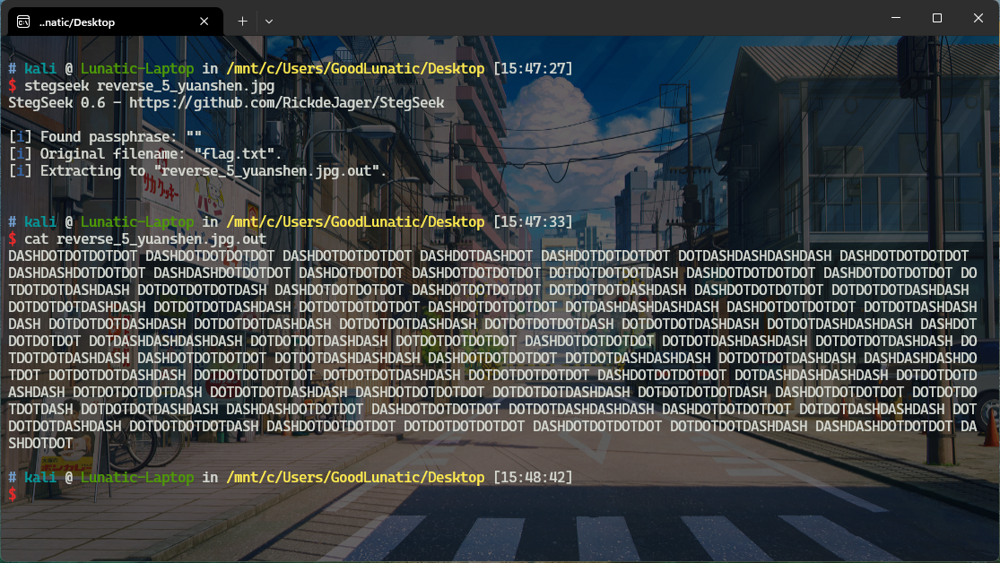

# 2023 浙江省大学生网络与信息安全竞赛 Misc Writeup

**全靠队友带飞。拿了省一**

**这里对赛中的部分Misc题进行一个简单的复盘**
<!--more-->
## 初赛
### 题目名称 Easy_Cipher
题目如下：
```
["Kln/qZwlOsux+b/Gv0WsxkOec5E70dNhvczSLFs+0pkHaovEOBqUApBGBDBUrH08。RUNCIDAgMTI4IHNpeCBudW1iZXJz","Kln/qZwlOsux+b/Gv0WsxkOec5E70dNhvczSLFs+0pkHaovEOBqUApBGBDBUrH08"]
```

把中间的那段密文base64解码可以得到
```
RUNCIDAgMTI4IHNpeCBudW1iZXJz
ECB 0 128 six numbers
```

因此写个Python脚本爆破一下AES-ECB模式的密钥即可
```python
import base64
from Crypto.Cipher import AES
def aes_decrypt(data, key):
    key = key.encode('utf-8')+b'\x00\x00\x00\x00\x00\x00\x00\x00\x00\x00'
    # print(key)
    cipher = AES.new(key, AES.MODE_ECB)
    decrypted = cipher.decrypt(base64.b64decode(data))
    return decrypted
    
if __name__ == "__main__":
    data = 'Kln/qZwlOsux+b/Gv0WsxkOec5E70dNhvczSLFs+0pkHaovEOBqUApBGBDBUrH08'
    for i in range(100000,999999):
        key = str(i)
        res = aes_decrypt(data=data,key=key)
        res = str(res)
        if 'flag' in res or 'DASCTF' in res:
            print(f"key:{key}")
            print(f"flag:{res}")
            break
#key:515764
#flag:b'DASCTF{W0w_Y0u_Succ3s5ful1y_Cr4ck_Th1s_C1ph3r}\x00\x00'
```

### 题目名称 Ez_misc

附件给了一个未知后缀的`yuanshen`文件，用010打开观察文件头，发现是单字节翻转后的JPG图片


将数据翻转回来，改后缀为jpg，即可得到下图


用`stegseek`爆破一下，发现藏了一个`flag.txt`



仔细观察内容，感觉是摩斯电码，因此我们CyberChef解码一下即可得到flag：`flag{df4f635ab342a5b3bb855a464d7bb4ec}`


### 题目名称 Steins_Gate
题目附件给了下面这张图片，图片有点大，有50M


在PS中打开，发现图片由很多`嘟噜嘟噜`组成，然后发现一个汉字占用了`16x16`的像素区块，图像的宽高也刚好是16的倍数`(10752x6048)`


因此我们写一个脚本，获取每个区块中出现频率最高的像素，并尝试恢复原图`(672x378)`

```python
def fix_img():
    img = Image.open("Steins_Gate.png")
    width,height = img.size # 10752 6048
    source_data = []
    for y in range(0,height,16):
        for x in range(0,width,16):
            pixel_dict = {}
            # 获取每个16x16区块中出现频率最高的像素
            for j in range(y,y+16):
                for i in range(x,x+16):
                    pixel = img.getpixel((i,j))
                    if pixel != (211, 211, 211):
                        if pixel not in pixel_dict:
                            pixel_dict[pixel] = 1
                        else:
                            pixel_dict[pixel] += 1
                            
            sorted_pixel = sorted(pixel_dict.items(),key = lambda item:item[1],reverse=True)
            most_pixel = sorted_pixel[0][0]
            source_data.append(most_pixel) 

    new_img = Image.new("RGB",(width//16,height//16))
    new_img.putdata(source_data) # [(255, 0, 0), (0, 255, 0), (0, 0, 255)]
    new_img.show()
    # new_img.save("new.png")
```

运行以上脚本，即可恢复得到下图


zsteg和StegSolve扫一下，发现存在LSB隐写


尝试直接提取出来，但是发现每串base64编码数据后面都有垃圾数据

因此我们尝试写个脚本提取

```python
def extract_lsb():
    res = ""
    base64_data = []
    img =  Image.open("new.png")
    width,height = img.size # 672 378
    for y in range(height):
        lsb_data = "" # 一行一行地提取LSB数据
        for x in range(width):
            pixel = img.getpixel((x,y))
            lsb_data += str(pixel[0] & 1) + str(pixel[1] & 1) + str(pixel[2] & 1)
        bytes_data = libnum.b2s(lsb_data)
        # print(bytes_data)
        try:
            base64_data.append(bytes_data[:bytes_data.index(b"==")+2])
        except:
            pass
    for item in base64_data:
        res += item.decode() + '\n'
    with open("base64.txt","w") as f:
        f.write(res)
```

提取出来的数据`CyberChef`解码可以得到一张jpg图片


然后还发现上面的base64编码的数据中存在base64隐写，直接使用工具提取出来可以得到：`DuDuLu~T0_Ch3@t_THe_w0r1d`


最后使用得到的密钥`outguess`解密图片即可得到flag：`DASCTF{699948e3ae1195f819b23b759684ac8e}`


完整解题代码如下：
```python
from PIL import Image
import libnum


def fix_img():
    img = Image.open("Steins_Gate.png")
    width,height = img.size # 10752 6048
    source_data = []
    for y in range(0,height,16):
        for x in range(0,width,16):
            pixel_dict = {}
            # 获取每个16x16区块中出现频率最高的像素
            for j in range(y,y+16):
                for i in range(x,x+16):
                    pixel = img.getpixel((i,j))
                    if pixel != (211, 211, 211):
                        if pixel not in pixel_dict:
                            pixel_dict[pixel] = 1
                        else:
                            pixel_dict[pixel] += 1
                            
            sorted_pixel = sorted(pixel_dict.items(),key = lambda item:item[1],reverse=True)
            most_pixel = sorted_pixel[0][0]
            source_data.append(most_pixel) 

    new_img = Image.new("RGB",(width//16,height//16))
    new_img.putdata(source_data) # [(255, 0, 0), (0, 255, 0), (0, 0, 255)]
    new_img.show()
    # new_img.save("new.png")
    
def extract_lsb():
    res = ""
    base64_data = []
    img =  Image.open("new.png")
    width,height = img.size # 672 378
    for y in range(height):
        lsb_data = "" # 一行一行地提取LSB数据
        for x in range(width):
            pixel = img.getpixel((x,y))
            lsb_data += str(pixel[0] & 1) + str(pixel[1] & 1) + str(pixel[2] & 1)
        bytes_data = libnum.b2s(lsb_data)
        # print(bytes_data)
        try:
            base64_data.append(bytes_data[:bytes_data.index(b"==")+2])
        except:
            pass
    for item in base64_data:
        res += item.decode() + '\n'
    with open("base64.txt","w") as f:
        f.write(res)

if __name__ == "__main__":
    # fix_img()
    extract_lsb()
```

## 决赛

### 题目名称 Xcode

题目附件给了一个`flag.txt`，内容如下
```
hAXBCEaBZMLZNJbRAQnNlOZdARqFAB1QpKa7IF4F5R1ElBKErIKpFQZNcNEc+
```

先使用`随波逐流工具`进行`XXencode`解码


然后`base58`解码即可得到flag：`DASCTF{The_new_encode_master!!}`


### 题目名称 Ez_Signin(三血)

题目附件给了一个加密的压缩包，经过尝试，发现是纯数字的弱密码：`11452`


解压后得到一串`base64编码`后的数据，直接用CyberChef解码可以得到类似坐标的数据


手动处理一下上面的数据，注意要把每个`LeftUp 1 到 LeftDown 1`之间的数据都删除

然后只保留坐标数值，写一个脚本画图即可

```python
import matplotlib.pyplot as plt
import numpy as np

x, y = np.loadtxt('flag.txt', delimiter=' ', unpack=True)
plt.plot(x, y, '.')
plt.show()
```


`flag{8f16a9717824aa456eb9a98653eb3993}`

### 题目名称 NewGrating

Byxs20出的题，给了一个冰蝎webshell流量，最后一步套了一个光栅

最后是卡在了光栅上，没有解出来，这里就贴一下解光栅的脚本吧

```python
from PIL import Image
import numpy as np

img = np.array(Image.open('flag.png'))
print(img.shape)
for i in range(5):
    z = np.zeros_like(img)
    z[:, i::5, :] = img[:, i::5, :]
    Image.fromarray(z).show()
```

---

> Author: [Lunatic](https://goodlunatic.github.io)  
> URL: https://goodlunatic.github.io/posts/db7acab/  

