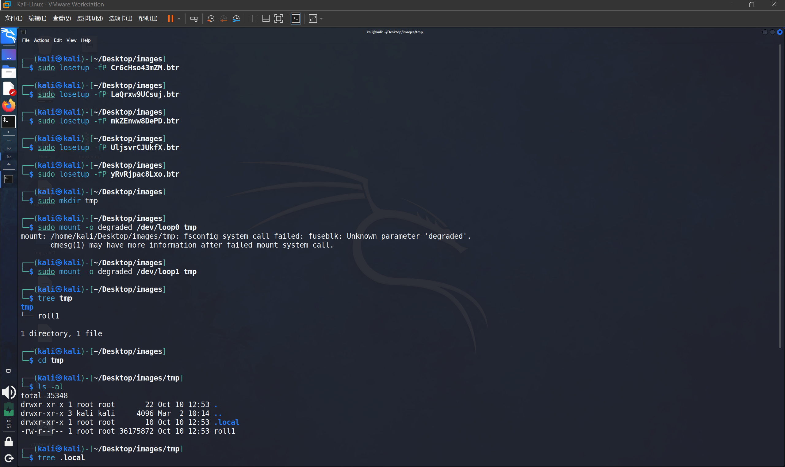
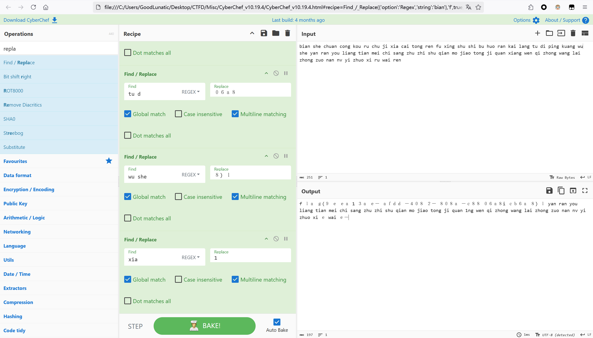

# 2024 强网拟态防御国际精英挑战赛初赛 Misc Writeup

**这比赛虽然有些Misc题比较搞心态，但是不得不说题目质量还是在的**

<!--more-->


|                                      |
| :-----------------------------------------------------------------------: |
| 本文中涉及的具体题目附件可以进我的交流群获取，进群详见 [About](https://goodlunatic.github.io/about/) |

## 题目名称 ezflag
打开流量包，发现直接传输了一个zip压缩包


因此我们直接把原始的Hex复制到cyberchef中

然后选择 From Hex 然后下载转换后的压缩包即可

> Tips: 这里不推荐用CyberChef的magic功能，要不然转出来的压缩包会提示已损坏
> 
> 易损坏的压缩包，需要我们自己去修复文件目录区和文件目录结束区
> 
> 其实就是多了一位的错误数据

压缩包解压后可以得到一个flag.zip，010查看发现是一张png图片，改后缀为png即可得到flag


`flag{140c7366-c217-4039-af6a-d36c4591a4c8}`

## 题目名称 PvZ
解压题目给的压缩包，得到一个名为 `key is md5(price)` 的文件夹和一个加密的压缩包

文件夹里有一个txt和一张图片，内容如下

> 李华的梦想是攒钱买毁灭菇加农炮，可是他总攒不住钱，请帮他理财，算一下他刚开始的这局游戏花了多少钱


很明显地提示了压缩包的解压密码，但是让我算是不可能算的，直接写个脚本生成一下MD5，然后爆破即可

```python
import hashlib

res = ''
for i in range(10000):
    res += hashlib.md5(str(i).encode()).hexdigest() + '\n'

with open("dic.txt",'w') as f:
    f.write(res)
```


爆破得到压缩包解压密码：217eedd1ba8c592db97d0dbe54c7adfc

解压后可以得到如下两张图片


用PS的透视裁剪工具调整图片，然后把前面那个角和三个定位块补上就能得到一张二维码


识别二维码得到如下内容
```
D'`_q^K![YG{VDTveRc10qpnJ+*)G!~f1{d@-}v<)9xqYonsrqj0hPlkdcb(`Hd]#a`_A@VzZY;Qu8NMqKPONGkK-,BGF?cCBA@">76Z:321U54-21*Non,+*#G'&%$d"y?w_uzsr8vunVrk1ongOe+ihgfeG]#[ZY^W\UZSwWVUNrRQ3IHGLEiCBAFE>=aA:9>765:981Uvu-2+O/.nm+$Hi'~}|B"!~}|u]s9qYonsrqj0hmlkjc)gIedcb[!YX]\UZSwWVUN6LpP2HMFEDhHG@dDCBA:^!~<;:921U/u3,+*Non&%*)('&}C{cy?}|{zs[q7unVl2ponmleMib(fHG]b[Z~k
```

这个时候回头去看图片的名字：M41b0lg3.png

把M41b0lg3转换为malbolge，上网一搜发现是一种编程语言，直接在线网站运行即可得到flag


`flag{5108a32f-1c7f-4a40-a4fa-fd8982e6eb49}`

## 题目名称 Find way to read video
解压题目附件给的压缩包，得到一个bonan7654.txt，内容如下

> bonan7654 has put his email template on a public platform.

然后就是要找bonan7654在哪个平台上发东西了，比赛的时候，社工这个人把我心态都搞崩了

国内外各大平台都搜了就是搜不到，赛后才知道是在gitcode上发的【无语】


唉，还是见的东西太少了，通过这次比赛也是让我知道了还有gitcode这个东西。。

下载这个项目中的README.md，发现是垃圾邮件隐写(spammimic)，找个在线网站解密一下


decode后得到如下内容：
```
BV1wm2EY2Egx eyJ2IjozLCJuIjoiZjE0ZyIsInMiOiIiLCJoIjoiZjczZDEyZCIsIm0iOjkwLCJrIjo4MSwibWciOjIwMCwia2ciOjEzMCwibCI6NDMsInNsIjoxLCJmaGwiOlsiMjUyZjEwYyIsImFjYWM4NmMiLCJjYTk3ODExIiwiY2QwYWE5OCIsIjAyMWZiNTkiLCIyYzYyNDIzIiwiNGUwNzQwOCIsIjRlMDc0MDgiLCJjYTk3ODExIiwiMmU3ZDJjMCIsIjZiODZiMjciLCIzZjc5YmI3IiwiNGUwNzQwOCIsIjM5NzNlMDIiLCJkNDczNWUzIiwiNGIyMjc3NyIsIjc5MDI2OTkiLCJlN2Y2YzAxIiwiMzk3M2UwMiIsIjRiMjI3NzciLCI0YjIyNzc3IiwiNmI4NmIyNyIsIjJlN2QyYzAiLCIzOTczZTAyIiwiY2E5NzgxMSIsIjNmNzliYjciLCI0ZTA3NDA4IiwiZDQ3MzVlMyIsIjM5NzNlMDIiLCIzZjc5YmI3IiwiM2Y3OWJiNyIsIjI1MmYxMGMiLCIzZjc5YmI3IiwiNmI4NmIyNyIsIjE4YWMzZTciLCI1ZmVjZWI2IiwiNGUwNzQwOCIsIjE4YWMzZTciLCIxOGFjM2U3IiwiMTk1ODFlMiIsIjNmNzliYjciLCJkMTBiMzZhIiwiMDFiYTQ3MSIsIjZlMzQwYjkiLCI2ZTM0MGI5IiwiNmUzNDBiOSIsIjZlMzQwYjkiLCI2ZTM0MGI5IiwiNmUzNDBiOSIsIjZlMzQwYjkiLCI2ZTM0MGI5IiwiNmUzNDBiOSIsIjZlMzQwYjkiLCI2ZTM0MGI5IiwiNmUzNDBiOSIsIjZlMzQwYjkiLCI2ZTM0MGI5IiwiNmUzNDBiOSIsIjZlMzQwYjkiLCI2ZTM0MGI5IiwiNmUzNDBiOSIsIjZlMzQwYjkiLCI2ZTM0MGI5IiwiNmUzNDBiOSIsIjZlMzQwYjkiLCI2ZTM0MGI5IiwiNmUzNDBiOSIsIjZlMzQwYjkiLCI2ZTM0MGI5IiwiNmUzNDBiOSIsIjZlMzQwYjkiLCI2ZTM0MGI5IiwiNmUzNDBiOSIsIjZlMzQwYjkiLCI2ZTM0MGI5IiwiNmUzNDBiOSIsIjZlMzQwYjkiLCI2ZTM0MGI5IiwiNmUzNDBiOSIsIjZlMzQwYjkiLCI2ZTM0MGI5IiwiNzdhZGZjOSIsImRlN2QxYjciLCI0NGJkN2FlIiwiYmI3MjA4YiIsIjgzODkxZDciLCIyYTBhYjczIiwiZmUxZGNkMyIsIjU1OWFlYWQiLCJmMDMxZWZhIl19
```

CyberChef解base64可以得到一个json


```json
{
    "v": 3,
    "n": "f14g",
    "s": "",
    "h": "f73d12d",
    "m": 90,
    "k": 81,
    "mg": 200,
    "kg": 130,
    "l": 43,
    "sl": 1,
    "fhl": [
        "252f10c",
        "acac86c",
        "ca97811",
        "cd0aa98",
        "021fb59",
        "2c62423",
        "4e07408",
        "4e07408",
        "ca97811",
        "2e7d2c0",
        "6b86b27",
        "3f79bb7",
        "4e07408",
        "3973e02",
        "d4735e3",
        "4b22777",
        "7902699",
        "e7f6c01",
        "3973e02",
        "4b22777",
        "4b22777",
        "6b86b27",
        "2e7d2c0",
        "3973e02",
        "ca97811",
        "3f79bb7",
        "4e07408",
        "d4735e3",
        "3973e02",
        "3f79bb7",
        "3f79bb7",
        "252f10c",
        "3f79bb7",
        "6b86b27",
        "18ac3e7",
        "5feceb6",
        "4e07408",
        "18ac3e7",
        "18ac3e7",
        "19581e2",
        "3f79bb7",
        "d10b36a",
        "01ba471",
        "6e340b9",
        "6e340b9",
        "6e340b9",
        "6e340b9",
        "6e340b9",
        "6e340b9",
        "6e340b9",
        "6e340b9",
        "6e340b9",
        "6e340b9",
        "6e340b9",
        "6e340b9",
        "6e340b9",
        "6e340b9",
        "6e340b9",
        "6e340b9",
        "6e340b9",
        "6e340b9",
        "6e340b9",
        "6e340b9",
        "6e340b9",
        "6e340b9",
        "6e340b9",
        "6e340b9",
        "6e340b9",
        "6e340b9",
        "6e340b9",
        "6e340b9",
        "6e340b9",
        "6e340b9",
        "6e340b9",
        "6e340b9",
        "6e340b9",
        "6e340b9",
        "6e340b9",
        "6e340b9",
        "6e340b9",
        "6e340b9",
        "77adfc9",
        "de7d1b7",
        "44bd7ae",
        "bb7208b",
        "83891d7",
        "2a0ab73",
        "fe1dcd3",
        "559aead",
        "f031efa"
    ]
}
```

在赛后参考了别的师傅的wp后，知道这里处理这段json有两种方法

### 解法一：根据题目名获取video

根据题目名字的提示：Find way to read video

可以猜测这段json与video有关，观察到原来那段base64数据前有一段BV开头的字符串：BV1wm2EY2Egx 

搜索这个字符串可以在B站上找到下面这个视频，视频标题：`ZjE0Zw==` base64解码后可以得到 `fl4g`


因此，猜测需要从这些视频里提取flag

首先，我们需要批量下载这90个视频到本地，爬虫大佬可以自己写脚本爬，这里我就偷懒直接借助插件了


油猴插件直接安装这个脚本，然后本地需要先打开 [Aria2](https://github.com/aria2/aria2) 备用

然后刷新b站视频界面，可以在屏幕左侧看到脚本已启用


然后勾上所有的视频，选择 `AriaNgGUI` 下载即可


我们直接播放视频可以看到前面有几帧是条纹的干扰画面，因此将视频下载到本地后，我们可以先尝试用以下代码分离视频中的所有帧

```python
def video2imgs(video_path,imgs_dir): # 分离视频中的所有帧
    cap = cv2.VideoCapture(video_path)
    if not cap.isOpened():
        print(f"[-] 视频读取失败")
        return
    frames_num = cap.get(7)
    print(f"[+] 视频读取成功，总帧数为 {frames_num}")
    if not os.path.exists(imgs_dir):
        os.mkdir(imgs_dir)
    frame_cnt = 1
    while True:
        ret,frame = cap.read()
        if not ret:
            break
        img_name = imgs_dir+f"{frame_cnt}.png"
        cv2.imwrite(img_name,frame)
        print(f"[+] 视频第 {frame_cnt} 帧保存成功")
        frame_cnt += 1
    cap.release()
    print(f"[+] 视频 {video_path.split('/')[-1]} 所有帧已读取完毕")
```

分离出来后可以发现前四帧和最后四帧是干扰项，然后查看后面的图片可以明显看到图像上方有白色的原点，猜测隐写了内容


因此我们尝试提取图像中的的像素，因为所有白色的像素都在第一行，因此我们先分析第一行的225个像素

```python
def extract_flag(video_path):
    # 使用cv2读取视频
    cap = cv2.VideoCapture(video_path)
    # frame_width = cap.get(3)
    # frame_height = cap.get(4)
    # print(frame_width,frame_height)# 224,224
    res = ""
    frames_cnt = 1
    while True: 
        # 读取视频的下一帧，并返回布尔值和当前帧的图像数据
        ret, frame = cap.read()
        # print(frame[0][0][0])
        if(frames_cnt == 5):# 经过尝试发现flag就藏在每个视频的第 5 帧中
            # 自动计算行数，待转换的列数为3，并取出前225个像素R通道的值
            pixels = frame.reshape((-1,3))[:224][:,0]
            for i in range(len(pixels)):
                if pixels[i] > 200:
                    pixels[i] = 1
                else:
                    pixels[i] = 0
            res = decode_pixel(pixels)
            break
        frames_cnt += 1
    return res

```

根据`flag{`头的八位二进制表示，我们可以找到隐写的对应位置

最后经过尝试，发现flag的每个字符都藏在每个视频第五帧第一行32-40的像素点中

```python
def decode_pixel(pixels):
    '''
    f：01100110
    l：01101100
    a：01100001
    g：01100111
    {：01111011
    '''
    res = ""
    for i in range(8):
        # 经过尝试，发现flag是隐写在24-40这十六个像素中
        res += str(pixels[32+i])
    flag_char = libnum.b2s(res)
    return flag_char
```

最后，完整的解题代码如下：

```python
import cv2
import os
import libnum

def video2imgs(video_path,imgs_dir): # 分离视频中的所有帧
    cap = cv2.VideoCapture(video_path)
    if not cap.isOpened():
        print(f"[-] 视频读取失败")
        return
    frames_num = cap.get(7)
    print(f"[+] 视频读取成功，总帧数为 {frames_num}")
    if not os.path.exists(imgs_dir):
        os.mkdir(imgs_dir)
    frame_cnt = 1
    while True:
        ret,frame = cap.read()
        if not ret:
            break
        img_name = imgs_dir+f"{frame_cnt}.png"
        cv2.imwrite(img_name,frame)
        print(f"[+] 视频第 {frame_cnt} 帧保存成功")
        frame_cnt += 1
    cap.release()
    print(f"[+] 视频 {video_path.split('/')[-1]} 所有帧已读取完毕")
        

def decode_pixel(pixels):
    '''
    f：01100110
    l：01101100
    a：01100001
    g：01100111
    {：01111011
    '''
    res = ""
    for i in range(8):
        # 经过尝试，发现flag是隐写在24-40这十六个像素中
        res += str(pixels[32+i])
    flag_char = libnum.b2s(res)
    return flag_char

def extract_flag(video_path):
    # 使用cv2读取视频
    cap = cv2.VideoCapture(video_path)
    # frame_width = cap.get(3)
    # frame_height = cap.get(4)
    # print(frame_width,frame_height)# 224,224
    res = ""
    frames_cnt = 1
    while True: 
        # 读取视频的下一帧，并返回布尔值和当前帧的图像数据
        ret, frame = cap.read()
        # print(frame[0][0][0])
        if(frames_cnt == 5):# 经过尝试发现flag就藏在每个视频的第 5 帧中
            # 自动计算行数，待转换的列数为3，并取出前225个像素R通道的值
            pixels = frame.reshape((-1,3))[:224][:,0]
            for i in range(len(pixels)):
                if pixels[i] > 200:
                    pixels[i] = 1
                else:
                    pixels[i] = 0
            res = decode_pixel(pixels)
            break
        frames_cnt += 1
    return res

if __name__ == "__main__":
    flag = [b'']*100
    dir = os.listdir("./videos/")
    # print(dir)
    # output_dir = "./output/"
    # if not os.path.exists(output_dir):
        # os.mkdir(output_dir)
    for item in dir:
        index = int(item.split('_')[2])
        video_path = f"./videos/{item}"
        # imgs_dir = f"./output/imgs_{index}/"
        # video2imgs(video_path,imgs_dir)
        flag[index] = extract_flag(video_path)  
    print(b''.join(flag))
```


`flag{833ac1e3-2476-441c-ae32-eefe1d03dd9e}`

### 解法二：直接从json中获取flag
这里主要关注json中的fhl键，发现每个元素都是长度为7的字符串

然后字符串看起来有点像是某种Hash，然后只截取了其中的一部分

我这里先尝试了字符f的各种Hash

```
MD5：8fa14cdd754f91cc6554c9e71929cce7
SHA-256：252f10c83610ebca1a059c0bae8255eba2f95be4d1d7bcfa89d7248a82d9f111
```

然后发现第一个元素刚刚好是字符f的SHA-256的前七位，继续尝试lag{这四个字符的SHA-256
```
f: 252f10c83610ebca1a059c0bae8255eba2f95be4d1d7bcfa89d7248a82d9f111
l: acac86c0e609ca906f632b0e2dacccb2b77d22b0621f20ebece1a4835b93f6f0
a: ca978112ca1bbdcafac231b39a23dc4da786eff8147c4e72b9807785afee48bb
g: cd0aa9856147b6c5b4ff2b7dfee5da20aa38253099ef1b4a64aced233c9afe29
{: 021fb596db81e6d02bf3d2586ee3981fe519f275c0ac9ca76bbcf2ebb4097d96
```

发现刚刚好全对上了，因此我们接下来直接写个脚本提取flag即可

```python
import hashlib
from string import printable

table = {}

for item in printable:
    hash_data = hashlib.sha256(item.encode()).hexdigest()[:7]
    table[hash_data] = item

fhl=["252f10c","acac86c","ca97811","cd0aa98","021fb59","2c62423","4e07408","4e07408","ca97811","2e7d2c0","6b86b27","3f79bb7","4e07408","3973e02","d4735e3","4b22777","7902699","e7f6c01","3973e02","4b22777","4b22777","6b86b27","2e7d2c0","3973e02","ca97811","3f79bb7","4e07408","d4735e3","3973e02","3f79bb7","3f79bb7","252f10c","3f79bb7","6b86b27","18ac3e7","5feceb6","4e07408","18ac3e7","18ac3e7","19581e2","3f79bb7","d10b36a","01ba471","6e340b9","6e340b9","6e340b9","6e340b9","6e340b9","6e340b9","6e340b9","6e340b9","6e340b9","6e340b9","6e340b9","6e340b9","6e340b9","6e340b9","6e340b9","6e340b9","6e340b9","6e340b9","6e340b9","6e340b9","6e340b9","6e340b9","6e340b9","6e340b9","6e340b9","6e340b9","6e340b9","6e340b9","6e340b9","6e340b9","6e340b9","6e340b9","6e340b9","6e340b9","6e340b9","6e340b9","6e340b9","6e340b9","77adfc9","de7d1b7","44bd7ae","bb7208b","83891d7","2a0ab73","fe1dcd3","559aead","f031efa"]
flag = ''

for item in fhl:
    try:
        flag += table[item]
    except:
        print(f"[-] {item}解码失败，可能为不可打印字符！")

print(flag)
```


`flag{833ac1e3-2476-441c-ae32-eefe1d03dd9e}`

## 题目名称 Streaming

下载附件，得到一个流量包和一个未知后缀的数据文件

发现协议中有RTCP协议，然后尝试追踪UDP流，发现有H.264的字样


因此我们手动修改解码方法


然后我们去Github上下载[这个插件](https://github.com/volvet/h264extractor)，然后放到wireshark安装目录中的plugin目录下即可

使用插件导出H.264流传输的数据


导出后可以得到一个后缀为.264的文件，直接使用爱奇艺万能播放器打开可以得到第一段flag和一堆FF字符


然后提示了flag1不仅仅是flag，联想到之前的那段未知数据，猜测这个也是密钥（算上引号长度刚好为16）

文本中的FF提示了需要先异或0xFF（别问为啥，问就是Misc手的经验）


AES-ECB解密后可以得到一个压缩包，解压后可以得到一个`badapple`和一个`secret`文件

badapple用010打开发现是一张png图片，因此我们改后缀为png，可以得到下图


010打开发现存在`IDOT`块，赛后知道了是一种特殊的图片文件，苹果和安卓系统上会显示出不同的图片

可以使用[在线网站](https://fotoforensics.com/analysis.php?id=49aa281215134389445673fd09e5ebb0f7d6ffe4.8537)直接看


也可以借助这个[开源项目](https://github.com/GGN-2015/macos_shadow_tank)，将图片重命名为`merged.png`，并放到`sample`目录下

运行 `preview_macos.py` 即可得到第二段flag


最后再看`s4cret`这个文件，补上文件头`00`，并改后缀为.mov


然后再用播放器打开，发现是由一组黑白帧组成的视频，直接写一个脚本提取黑白帧转二进制即可得到第三段flag

```python
import cv2
import libnum


cap = cv2.VideoCapture('s4cret.mov')
frame_count = 0
res = ''

while True:
    ret, frame = cap.read()
    if not ret:
        break
    pixel = frame.reshape((-1,3)) # 将像素化为3列n行的格式
    r = pixel[0][0] # 获取第一个像素r通道的数值
    if r > 200:
        res += '0'
    else:
        res += '1'
cap.release()

# print(libnum.b2s(res))
lenth = len(res) # 259
res += (8 - (lenth % 8)) * '0'
print(libnum.b2s(res))
# b'the flag3 is -13891ba324da}\xff\xff\xff\xff\xff\xe0'
```

将三段flag组合即可得到最后的flag：`flag{3b3a9c08-88e4-4d65-b59e-13891ba324da}`

## 题目名称 Input Page Walk

参考链接：[强网拟态 2024 By W&M - W&M Team](https://blog.wm-team.cn/index.php/archives/84/#Input+Page+Walk)

解压附件压缩包，可以得到下面这几个文件


因为后缀未知，因此尝试用010打开，发现是`webp`图片


改后缀为`webp`后可以看到下面这张图片，然后发现五个文件显示的内容是一样的


因此猜测重点不在图片上，赛后参考了WM师傅的Writeup后知道了可以用`010editor`diff一下这几个文件


然后发现`0x3B142`前面的数据都是一样的，因此我们需要重点关注后面的数据

把每个文件从`0x3B142`开始的数据都提取出来，提取出来的数据大小如下


然后拉到`Kali`虚拟机里(这里最好用`kali`，因为经过测试，发现我WSL2中的Ubuntu20.04是无法准备识别这几个文件的）


然后我们使用以下几个命令挂载一下上面文件格式为`BTRFS`磁盘

```bash
sudo losetup -fP Cr6cHso43mZM.btr
sudo losetup -fP LaQrxw9UCsuj.btr
sudo losetup -fP UljsvrCJUkfX.btr
sudo losetup -fP mkZEnww8DePD.btr
sudo losetup -fP yRvRjpac8Lxo.btr
sudo mkdir tmp
sudo mount -o degraded /dev/loop1 tmp # 用于强制挂载可能降级（设备丢失或损坏）的Btrfs文件系统
```




然后发现有一个`roll1`的文件以及一些输入法的配置文件

用010打开`roll1`没有发现什么有用的信息


然后再翻看输入法的配置文件

`README.txt`中的内容如下，发现是桃花源记

> 便舍船，从口入。初极狭，才通人。复行数十步，豁然开朗。土地平旷，屋舍俨然。有良田美池桑竹之属。阡陌交通，鸡犬相闻。其中往来种作，男女衣著，悉如外人。

根据这个输入法的配置文件，猜测对应关系藏在输入法的用户词库中

我们去网上搜`rime`输入法，可以搜到一个小狼毫输入法，我们尝试在windows下安装


把配置文件复制到用户文件夹中


然后打开用户词典管理-导出文本码表


导出后即可得到如下内容

```
# Rime user dictionary export
#@/db_name	meow_emoji
#@/db_type	userdb
#@/rime_version	1.11.2
#@/tick	20
#@/user_id	364e1e09-5ee6-4cef-8e69-1a6a587b431e
ｆ	bian	1
２－	bu	1
３ａ	cai tong	1
ｅａ	chu ji	1
ｇ(９	cong kou	3
ｇａ	cong tong	1
ａｆｄｄ	fu xing	1
８０８ａ	huo ran	1
－ｃ８８	kai lang	1
ｃｂ６ａ	ping kuang	1
ｅ－	ren	2
ｅ	ru	1
ｌａ	she chuan	1
－４０８	shu shi	1
０６ａ８	tu di	1
８) ｌ	wu she	1
１	xia	1
```

最后对照这个码表替换一下上面`README.txt`中的内容即可得到flag：`flag{9eea13ae-afdd-4082-808a-c8806a8icb6a8}`



最后，做完上面的题后，别忘了用以下命令卸载之前挂载的镜像

```bash
sudo umount /dev/loop1
sudo losetup -d /dev/loop0
sudo losetup -d /dev/loop1
sudo losetup -d /dev/loop2
sudo losetup -d /dev/loop3
sudo losetup -d /dev/loop4
```

---

> Author: [Lunatic](https://goodlunatic.github.io)  
> URL: https://goodlunatic.github.io/posts/de8e2be/  

