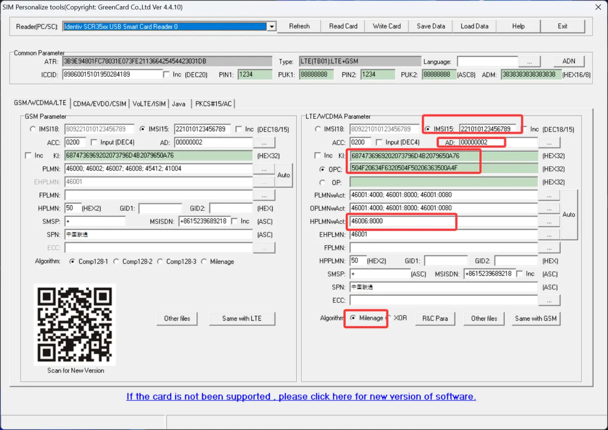

# 如何基于 SrsRAN_4G 搭建 LTE 基站

**记录一下如何基于 srsRAN_4G 搭建 LTE 基站**
<!--more-->

本文使用的软硬件环境如下：

> CPU: Intel i7-14700KF (28) @ 5.500GHz 
> 
> USRP: B210  
> 
> OS: Ubuntu 20.04.6 LTS x86_64  
> 
> UHD: UHD 4.6.0.0

## 安装UHD

参考官方链接：[https://files.ettus.com/manual/page_build_guide.html](https://files.ettus.com/manual/page_build_guide.html)

```bash
# 安装依赖
sudo apt-get install autoconf automake build-essential ccache cmake cpufrequtils doxygen ethtool \
g++ git inetutils-tools libboost-all-dev libncurses5 libncurses5-dev libusb-1.0-0 libusb-1.0-0-dev \
libusb-dev python3-dev python3-mako python3-numpy python3-requests python3-scipy python3-setuptools \
python3-ruamel.yaml
# 下载源码
git clone https://github.com/EttusResearch/uhd.git
# 编译安装
cd uhd
mkdir build
cd build
cmake ../
make -j$(nproc) && sudo make install
# 刷新动态链接库
sudo ldconfig
# 下载镜像并测试连接
sudo uhd_images_downloader
sudo uhd_usrp_probe
```

## 安装srsRAN_4G

```bash
# 安装依赖
sudo apt-get install libfftw3-dev libmbedtls-dev libboost-program-options-dev libconfig++-dev libsctp-dev
# 下载源码
git clone https://github.com/srsRAN/srsRAN_4G.git
# 编译安装
cd srsRAN_4G
mkdir build
cd build
cmake ../
make -j$(nproc)
```

## 配置srsRAN_4G

经过测试可以正常使用的配置文件如下

如果找不到UE搜不到小区，就尝试取消注释中“修改点”的代码

### epc.conf

```yaml
#####################################################################
#                   srsEPC configuration file
#####################################################################

#####################################################################
# MME configuration
#
# mme_code:         8-bit MME code identifies the MME within a group.
# mme_group:        16-bit MME group identifier.
# tac:              16-bit Tracking Area Code.
# mcc:              Mobile Country Code
# mnc:              Mobile Network Code
# full_net_name     Display Name of the Network
# short_net_name    Short Display Name of the Network
# apn:                  Set Access Point Name (APN)
# mme_bind_addr:    IP bind addr to listen for eNB S1-MME connnections
# dns_addr:         DNS server address for the UEs
# encryption_algo:  Preferred encryption algorithm for NAS layer 
#                   (supported: EEA0 (default), EEA1, EEA2, EEA3)
# integrity_algo:   Preferred integrity protection algorithm for NAS 
#                   (supported: EIA0 (rejected by most UEs), EIA1 (default), EIA2, EIA3
# paging_timer:     Value of paging timer in seconds (T3413)
# request_imeisv:   Request UE's IMEI-SV in security mode command
# lac:              16-bit Location Area Code.
#
#####################################################################
[mme]
mme_code = 0x1a
mme_group = 0x0001
tac = 0x0007
mcc = 001
mnc = 01
mme_bind_addr = 127.0.1.100
apn = srsapn
dns_addr = 8.8.8.8
encryption_algo = EEA0
integrity_algo = EIA1
paging_timer = 2
request_imeisv = false
lac = 0x0006

#####################################################################
# HSS configuration
#
# db_file:         Location of .csv file that stores UEs information.
#
#####################################################################
[hss]
db_file = ../config/user_db.csv

#####################################################################
# SP-GW configuration
#
# gtpu_bind_addr:   GTP-U bind address.
# sgi_if_addr:      SGi TUN interface IP address.
# sgi_if_name:      SGi TUN interface name.
# max_paging_queue: Maximum packets in paging queue (per UE).
#
#####################################################################

[spgw]
gtpu_bind_addr   = 127.0.1.100
sgi_if_addr      = 172.16.0.1
sgi_if_name      = srs_spgw_sgi
max_paging_queue = 100

####################################################################
# PCAP configuration
#
# Packets are captured to file in the compact format decoded by 
# the Wireshark s1ap dissector and with DLT 150. 
# To use the dissector, edit the preferences for DLT_USER to 
# add an entry with DLT=150, Payload Protocol=s1ap.
#
# enable:   Enable or disable the PCAP.
# filename: File name where to save the PCAP.
#
####################################################################
[pcap]
enable   = false
filename = /tmp/epc.pcap

####################################################################
# Log configuration
#
# Log levels can be set for individual layers. "all_level" sets log
# level for all layers unless otherwise configured.
# Format: e.g. s1ap_level = info
#
# In the same way, packet hex dumps can be limited for each level.
# "all_hex_limit" sets the hex limit for all layers unless otherwise
# configured.
# Format: e.g. s1ap_hex_limit = 32
#
# Logging layers: nas, s1ap, mme_gtpc, spgw_gtpc, gtpu, spgw, hss, all
# Logging levels: debug, info, warning, error, none
#
# filename: File path to use for log output. Can be set to stdout
#           to print logs to standard output
#####################################################################
[log]
all_level = info
all_hex_limit = 32
filename = /tmp/epc.log

#nas_level = debug
#s1ap_level = debug
#mme_gtpc_level = debug
#spgw_gtpc_level = debug
#gtpu_level = debug
#spgw_level = debug
#hss_level = debug
```

### enb.conf

```yaml
#####################################################################
#                   srsENB configuration file
#####################################################################

#####################################################################
# eNB configuration
#
# enb_id:               20-bit eNB identifier.
# mcc:                  Mobile Country Code
# mnc:                  Mobile Network Code
# mme_addr:             IP address of MME for S1 connnection
# gtp_bind_addr:        Local IP address to bind for GTP connection
# gtp_advertise_addr:   IP address of eNB to advertise for DL GTP-U Traffic
# s1c_bind_addr:        Local IP address to bind for S1AP connection
# s1c_bind_port:        Source port for S1AP connection (0 means any)
# n_prb:                Number of Physical Resource Blocks (6,15,25,50,75,100)
# tm:                   Transmission mode 1-4 (TM1 default)
# nof_ports:            Number of Tx ports (1 port default, set to 2 for TM2/3/4)
#
#####################################################################
[enb]
enb_id = 0x19B
mcc = 001
mnc = 01
mme_addr = 127.0.1.100
gtp_bind_addr = 127.0.1.1
s1c_bind_addr = 127.0.1.1
s1c_bind_port = 0
n_prb = 50
# n_prb = 100 # 修改处1-物理资源块数量
#tm = 4
# tm = 1 # 修改处2-传输模式
#nof_ports = 2
# nof_ports = 1 # 修改处3-天线端口数量


#####################################################################
# eNB configuration files
#
# sib_config:  SIB1, SIB2 and SIB3 configuration file 
# note: When enabling MBMS, use the sib.conf.mbsfn configuration file which includes SIB13
# rr_config:   Radio Resources configuration file 
# rb_config:   SRB/DRB configuration file 
#####################################################################
[enb_files]
sib_config = ../config/sib.conf
rr_config  = ../config/rr.conf
rb_config = ../config/rb.conf

#####################################################################
# RF configuration
#
# dl_earfcn: EARFCN code for DL (only valid if a single cell is configured in rr.conf)
# tx_gain: Transmit gain (dB).
# rx_gain: Optional receive gain (dB). If disabled, AGC if enabled
#
# Optional parameters:
# dl_freq:            Override DL frequency corresponding to dl_earfcn
# ul_freq:            Override UL frequency corresponding to dl_earfcn (must be set if dl_freq is set)
# device_name:        Device driver family
#                     Supported options: "auto" (uses first driver found), "UHD", "bladeRF", "soapy", "zmq" or "Sidekiq"
# device_args:        Arguments for the device driver. Options are "auto" or any string.
#                     Default for UHD: "recv_frame_size=9232,send_frame_size=9232"
#                     Default for bladeRF: ""
# time_adv_nsamples:  Transmission time advance (in number of samples) to compensate for RF delay
#                     from antenna to timestamp insertion.
#                     Default "auto". B210 USRP: 100 samples, bladeRF: 27
#####################################################################
[rf]
dl_earfcn = 3350
# dl_earfcn = 500 # 修改处4-下行 LTE 载波的中心频率
tx_gain = 80 # 发射功率
rx_gain = 40
# rx_gain = 70 # 修改处5-接收信号的灵敏度
# device_args = type=b200, clock=external,master_clock_rate=23.04e6 # 修改处7-SDR设备、时钟源、主时钟频率

#device_name = auto

# For best performance in 2x2 MIMO and >= 15 MHz use the following device_args settings:
#     USRP B210: num_recv_frames=64,num_send_frames=64
#     And for 75 PRBs, also append ",master_clock_rate=15.36e6" to the device args

# For best performance when BW<5 MHz (25 PRB), use the following device_args settings:
#     USRP B210: send_frame_size=512,recv_frame_size=512

#device_args = auto
#time_adv_nsamples = auto

# Example for ZMQ-based operation with TCP transport for I/Q samples
#device_name = zmq
#device_args = fail_on_disconnect=true,tx_port=tcp://*:2000,rx_port=tcp://localhost:2001,id=enb,base_srate=23.04e6

#####################################################################
# Packet capture configuration
#
# MAC-layer packets are captured to a file in the compact format which can
# be decoded by Wireshark. For decoding, use the UDP dissector and the UDP 
# heuristic dissection. Edit the preferences (Edit > Preferences > 
# Protocols > DLT_USER) for DLT_USER to add an entry for DLT=149 with 
# Protocol=udp. Further, enable the heuristic dissection in UDP under:
# Analyze > Enabled Protocols > MAC-LTE > mac_lte_udp and MAC-NR > mac_nr_udp
# For more information see: https://wiki.wireshark.org/MAC-LTE
# Configuring this Wireshark preferences is needed for decoding the MAC PCAP
# files as well as for the live network capture option.
#
# Please note that this setting will by default only capture MAC
# frames on dedicated channels, and not SIB.  You have to build with
# WRITE_SIB_PCAP enabled in srsenb/src/stack/mac/mac.cc if you want
# SIB to be part of the MAC pcap file.
#
# S1AP Packets are captured to a file in the compact format which can
# be decoded by the Wireshark s1ap dissector with DLT 150. 
# To use the dissector, edit the preferences for DLT_USER to 
# add an entry with DLT=150, Payload Protocol=s1ap.
#
# enable:        Enable MAC layer packet captures (true/false)
# filename:      File path to use for LTE MAC packet captures
# nr_filename:   File path to use for NR MAC packet captures
# s1ap_enable:   Enable or disable the PCAP.
# s1ap_filename: File name where to save the PCAP.
#
# mac_net_enable: Enable MAC layer packet captures sent over the network (true/false default: false)
# bind_ip: Bind IP address for MAC network trace (default: "0.0.0.0")
# bind_port: Bind port for MAC network trace (default: 5687)
# client_ip: Client IP address for MAC network trace (default: "127.0.0.1")
# client_port Client IP address for MAC network trace (default: 5847)
#####################################################################
[pcap]
#enable = false
#filename = /tmp/enb_mac.pcap
#nr_filename = /tmp/enb_mac_nr.pcap
#s1ap_enable = false
#s1ap_filename = /tmp/enb_s1ap.pcap

#mac_net_enable = false
#bind_ip = 0.0.0.0
#bind_port = 5687
#client_ip = 127.0.0.1
#client_port = 5847

#####################################################################
# Log configuration
#
# Log levels can be set for individual layers. "all_level" sets log
# level for all layers unless otherwise configured.
# Format: e.g. phy_level = info
#
# In the same way, packet hex dumps can be limited for each level.
# "all_hex_limit" sets the hex limit for all layers unless otherwise
# configured.
# Format: e.g. phy_hex_limit = 32
#
# Logging layers: rf, phy, phy_lib, mac, rlc, pdcp, rrc, gtpu, s1ap, stack, all
# Logging levels: debug, info, warning, error, none
#
# filename: File path to use for log output. Can be set to stdout
#           to print logs to standard output
# file_max_size: Maximum file size (in kilobytes). When passed, multiple files are created.
#                If set to negative, a single log file will be created.
#####################################################################
[log]
all_level = warning
all_hex_limit = 32
filename = /tmp/enb.log
file_max_size = -1

[gui]
enable = false

#####################################################################
# Scheduler configuration options
#
# sched_policy:      User MAC scheduling policy (E.g. time_rr, time_pf)
# min_aggr_level:    Optional minimum aggregation level index (l=log2(L) can be 0, 1, 2 or 3)
# max_aggr_level:    Optional maximum aggregation level index (l=log2(L) can be 0, 1, 2 or 3)
# adaptive_aggr_level: Boolean flag to enable/disable adaptive aggregation level based on target BLER
# pdsch_mcs:         Optional fixed PDSCH MCS (ignores reported CQIs if specified)
# pdsch_max_mcs:     Optional PDSCH MCS limit
# pusch_mcs:         Optional fixed PUSCH MCS (ignores reported CQIs if specified)
# pusch_max_mcs:     Optional PUSCH MCS limit
# min_nof_ctrl_symbols: Minimum number of control symbols
# max_nof_ctrl_symbols: Maximum number of control symbols
# pucch_multiplex_enable: Allow PUCCH HARQ to collide with PUSCH and other PUCCH
# pucch_harq_max_rb: Maximum number of RB to be used for PUCCH on the edges of the grid.
#                    If defined and greater than 0, the scheduler will avoid DL PDCCH allocations if
#                    PUCCH HARQ falls outside this region
# target_bler:       Target BLER (in decimal) to achieve via adaptive link
# max_delta_dl_cqi:  Maximum shift in CQI for adaptive DL link
# max_delta_ul_snr:  Maximum shift in UL SNR for adaptive UL link
# adaptive_dl_mcs_step_size: Step size or learning rate used in adaptive DL MCS link
# adaptive_ul_mcs_step_size: Step size or learning rate used in adaptive UL MCS link
# min_tpc_tti_interval: Minimum TTI interval between TPCs different than 1
# ul_snr_avg_alpha:  Exponential Average alpha coefficient used in estimation of UL SNR
# init_ul_snr_value: Initial UL SNR value used for computing MCS in the first UL grant
# init_dl_cqi:       DL CQI value used before any CQI report is available to the eNB
# max_sib_coderate:  Upper bound on SIB and RAR grants coderate
# pdcch_cqi_offset:  CQI offset in derivation of PDCCH aggregation level
# nr_pdsch_mcs:      Optional fixed NR PDSCH MCS (ignores reported CQIs if specified)
# nr_pusch_mcs:      Optional fixed NR PUSCH MCS (ignores reported CQIs if specified)
#
#####################################################################
[scheduler]
#policy     = time_pf
#policy_args = 2
#min_aggr_level   = 0
#max_aggr_level   = 3
#adaptive_aggr_level = false
#pdsch_mcs        = -1
#pdsch_max_mcs    = -1
#pusch_mcs        = -1
#pusch_max_mcs    = 16
#min_nof_ctrl_symbols = 1
#max_nof_ctrl_symbols = 3
#pucch_multiplex_enable = false
#pucch_harq_max_rb = 0
#target_bler = 0.05
#max_delta_dl_cqi = 5
#max_delta_ul_snr = 5
#adaptive_dl_mcs_step_size = 0.001
#adaptive_ul_mcs_step_size = 0.001
#min_tpc_tti_interval = 1
#ul_snr_avg_alpha=0.05
#init_ul_snr_value=5
#init_dl_cqi=5
#max_sib_coderate=0.3
#pdcch_cqi_offset=0
#nr_pdsch_mcs=28
#nr_pusch_mcs=28

#####################################################################
# Slicing configuration
# enable_eMBB           Enables enhanced mobile broadband (eMBB) slice in the gNodeB
# enable_URLLC          Enables Ultra Reliable Low Latency Communications (URLLC) slice in the gNodeB
# enable_MIoT           Enables Massive Internet of Things (MIoT) slice in the gNodeB
# eMBB_sd               eMBB slice differentiator
# URLLC_sd              URLLC slice differentiator
# MIoT_sd               MIoT slice differentiator
#####################################################################
[slicing]
#enable_eMBB = false
#enable_URLLC = false
#enable_MIoT = false
#eMBB_sd = 1
#URLLC_sd = 1
#MIoT_sd = 1

#####################################################################
# eMBMS configuration options
#
# enable:               Enable MBMS transmission in the eNB
# m1u_multiaddr:        Multicast address the M1-U socket will register to
# m1u_if_addr:          Address of the interface the M1-U interface will listen to for multicast packets
# mcs:                  Modulation and Coding scheme for MBMS traffic
#
#####################################################################
[embms]
#enable = false
#m1u_multiaddr = 239.255.0.1
#m1u_if_addr = 127.0.1.201
#mcs = 20


#####################################################################
# Channel emulator options:
# enable:            Enable/disable internal Downlink/Uplink channel emulator
#
# -- AWGN Generator
# awgn.enable:       Enable/disable AWGN generator
# awgn.snr:          Target SNR in dB
#
# -- Fading emulator
# fading.enable:     Enable/disable fading simulator
# fading.model:      Fading model + maximum doppler (E.g. none, epa5, eva70, etu300, etc)
#
# -- Delay Emulator     delay(t) = delay_min + (delay_max - delay_min) * (1 + sin(2pi*t/period)) / 2
#                       Maximum speed [m/s]: (delay_max - delay_min) * pi * 300 / period
# delay.enable:      Enable/disable delay simulator
# delay.period_s:    Delay period in seconds
# delay.init_time_s: Delay initial time in seconds
# delay.maximum_us:  Maximum delay in microseconds
# delay.minumum_us:  Minimum delay in microseconds
#
# -- Radio-Link Failure (RLF) Emulator
# rlf.enable:        Enable/disable RLF simulator
# rlf.t_on_ms:       Time for On state of the channel (ms)
# rlf.t_off_ms:      Time for Off state of the channel (ms)
#
# -- High Speed Train Doppler model simulator
# hst.enable:        Enable/disable HST simulator
# hst.period_s:      HST simulation period in seconds
# hst.fd_hz:         Doppler frequency in Hz
# hst.init_time_s:   Initial time in seconds
#####################################################################
[channel.dl]
#enable        = false

[channel.dl.awgn]
#enable        = false
#snr            = 30

[channel.dl.fading]
#enable        = false
#model         = none

[channel.dl.delay]
#enable        = false
#period_s      = 3600
#init_time_s   = 0
#maximum_us    = 100
#minimum_us    = 10

[channel.dl.rlf]
#enable        = false
#t_on_ms       = 10000
#t_off_ms      = 2000

[channel.dl.hst]
#enable        = false
#period_s      = 7.2
#fd_hz         = 750.0
#init_time_s   = 0.0

[channel.ul]
#enable        = false

[channel.ul.awgn]
#enable        = false
#n0            = -30

[channel.ul.fading]
#enable        = false
#model         = none

[channel.ul.delay]
#enable        = false
#period_s      = 3600
#init_time_s   = 0
#maximum_us    = 100
#minimum_us    = 10

[channel.ul.rlf]
#enable        = false
#t_on_ms       = 10000
#t_off_ms      = 2000

[channel.ul.hst]
#enable        = false
#period_s      = 7.2
#fd_hz         = -750.0
#init_time_s   = 0.0

#####################################################################
# CFR configuration options
#
# The CFR module provides crest factor reduction for the transmitted signal.
#
# enable:           Enable or disable the CFR. Default: disabled
#
# mode:             manual:   CFR threshold is set by cfr_manual_thres (default).
#                   auto_ema: CFR threshold is adaptive based on the signal PAPR. Power avg. with Exponential Moving Average.
#                             The time constant of the averaging can be tweaked with the ema_alpha parameter.
#                   auto_cma: CFR threshold is adaptive based on the signal PAPR. Power avg. with Cumulative Moving Average.
#                             Use with care, as CMA's increasingly slow response may be unsuitable for most use cases.
#
# strength:         Ratio between amplitude-limited vs unprocessed signal (0 to 1). Default: 1
# manual_thres:     Fixed manual clipping threshold for CFR manual mode. Default: 0.5
# auto_target_papr: Signal PAPR target (in dB) in CFR auto modes. output PAPR can be higher due to peak smoothing. Default: 8
# ema_alpha:        Alpha coefficient for the power average in auto_ema mode. Default: 1/7
#
#####################################################################
[cfr]
#enable           = false
#mode             = manual
#manual_thres     = 0.5
#strength         = 1
#auto_target_papr = 8
#ema_alpha        = 0.0143

# E2 Agent configuration options
#
# ric_ip:                IP address of the RIC controller
# ric_port:              Port of the RIC controller
# ric_bind_ip:           Local IP address to bind for RIC connection
# ric_bind_port:         Local port to bind for RIC connection
# max_ric_setup_retries: Maximum amount of retries to setup the RIC connection. If this value is exceeded, an alarm is written to the log. -1 means infinity.
# ric_connect_timer:     Connection Retry Timer for RIC connection (seconds)
#####################################################################
[e2_agent]
#enable = false
#ric_ip =  127.0.0.1
#ric_port = 36421
#ric_bind_ip =  127.0.0.1
#ric_bind_port = 36425
#max_ric_setup_retries = -1
#ric_connect_timer = 10

#####################################################################
# Expert configuration options
#
# pusch_max_its:        Maximum number of turbo decoder iterations (default: 4)
# nr_pusch_max_its:     Maximum number of LDPC iterations for NR (Default 10)
# pusch_8bit_decoder:   Use 8-bit for LLR representation and turbo decoder trellis computation (experimental)
# nof_phy_threads:      Selects the number of PHY threads (maximum: 4, minimum: 1, default: 3)
# metrics_period_secs:  Sets the period at which metrics are requested from the eNB
# metrics_csv_enable:   Write eNB metrics to CSV file.
# metrics_csv_filename: File path to use for CSV metrics
# report_json_enable:   Write eNB report to JSON file (default: disabled)
# report_json_filename: Report JSON filename (default: /tmp/enb_report.json)
# report_json_asn1_oct: Prints ASN1 messages encoded as an octet string instead of plain text in the JSON report file
# alarms_log_enable:    Enable Alarms logging (default: disabled)
# alarms_filename:      Alarms logging filename (default: /tmp/alarms.log)
# tracing_enable:       Write source code tracing information to a file
# tracing_filename:     File path to use for tracing information
# tracing_buffcapacity: Maximum capacity in bytes the tracing framework can store
# stdout_ts_enable:     Prints once per second the timestamp into stdout
# tx_amplitude:         Transmit amplitude factor (set 0-1 to reduce PAPR)
# rrc_inactivity_timer  Inactivity timeout used to remove UE context from RRC (in milliseconds)
# max_mac_dl_kos:       Maximum number of consecutive KOs in DL before triggering the UE's release (default: 100)
# max_mac_ul_kos:       Maximum number of consecutive KOs in UL before triggering the UE's release (default: 100)
# max_prach_offset_us:  Maximum allowed RACH offset (in us)
# nof_prealloc_ues:     Number of UE memory resources to preallocate during eNB initialization for faster UE creation (default: 8)
# rlf_release_timer_ms: Time taken by eNB to release UE context after it detects an RLF
# eea_pref_list:        Ordered preference list for the selection of encryption algorithm (EEA) (default: EEA0, EEA2, EEA1)
# eia_pref_list:        Ordered preference list for the selection of integrity algorithm (EIA) (default: EIA2, EIA1, EIA0)
# gtpu_tunnel_timeout:  Time that GTPU takes to release indirect forwarding tunnel since the last received GTPU PDU (0 for no timer)
# ts1_reloc_prep_timeout: S1AP TS 36.413 TS1RelocPrep Expiry Timeout value in milliseconds
# ts1_reloc_overall_timeout: S1AP TS 36.413 TS1RelocOverall Expiry Timeout value in milliseconds
# rlf_release_timer_ms: Time taken by eNB to release UE context after it detects a RLF
# rlf_min_ul_snr_estim: SNR threshold in dB below which the enb is notified with RLF ko
# s1_setup_max_retries: Maximum amount of retries to setup the S1AP connection. If this value is exceeded, an alarm is written to the log. -1 means infinity.
# s1_connect_timer:     Connection Retry Timer for S1 connection (seconds)
# rx_gain_offset:       RX Gain offset to add to rx_gain to calibrate RSRP readings
# use_cedron_f_est_alg: Whether to use Cedron algorithm for TA estimation or not (Default: false)
#####################################################################
[expert]
#pusch_max_its        = 8 # These are half iterations
#nr_pusch_max_its     = 10
#pusch_8bit_decoder   = false
#nof_phy_threads      = 3
#metrics_period_secs  = 1
#metrics_csv_enable   = false
#metrics_csv_filename = /tmp/enb_metrics.csv
#report_json_enable   = true
#report_json_filename = /tmp/enb_report.json
#report_json_asn1_oct = false
#alarms_log_enable    = true
#alarms_filename      = /tmp/enb_alarms.log
#tracing_enable       = true
#tracing_filename     = /tmp/enb_tracing.log
#tracing_buffcapacity = 1000000
#stdout_ts_enable     = false
#tx_amplitude         = 0.6
#rrc_inactivity_timer = 30000
#max_mac_dl_kos       = 100
#max_mac_ul_kos       = 100
#max_prach_offset_us  = 30
#nof_prealloc_ues     = 8
#rlf_release_timer_ms = 4000
#lcid_padding         = 3
#eea_pref_list = EEA0, EEA2, EEA1
#eia_pref_list = EIA2, EIA1, EIA0
#gtpu_tunnel_timeout = 0
#extended_cp         = false
#ts1_reloc_prep_timeout = 10000
#ts1_reloc_overall_timeout = 10000
#rlf_release_timer_ms = 4000
#rlf_min_ul_snr_estim = -2
#s1_setup_max_retries = -1
#s1_connect_timer = 10
#rx_gain_offset = 62
#mac_prach_bi         = 0
#use_cedron_f_est_alg = false
```

### user_db.csv

```csv
#                                                                                           
# .csv to store UE's information in HSS                                                     
# Kept in the following format: "Name,Auth,IMSI,Key,OP_Type,OP/OPc,AMF,SQN,QCI,IP_alloc"  
#                                                                                           
# Name:     Human readable name to help distinguish UE's. Ignored by the HSS                
# Auth:     Authentication algorithm used by the UE. Valid algorithms are XOR               
#           (xor) and MILENAGE (mil)                                                        
# IMSI:     UE's IMSI value                                                                 
# Key:      UE's key, where other keys are derived from. Stored in hexadecimal              
# OP_Type:  Operator's code type, either OP or OPc                                          
# OP/OPc:   Operator Code/Cyphered Operator Code, stored in hexadecimal                     
# AMF:      Authentication management field, stored in hexadecimal                          
# SQN:      UE's Sequence number for freshness of the authentication                        
# QCI:      QoS Class Identifier for the UE's default bearer.                               
# IP_alloc: IP allocation stratagy for the SPGW.                                            
#           With 'dynamic' the SPGW will automatically allocate IPs                         
#           With a valid IPv4 (e.g. '172.16.0.2') the UE will have a statically assigned IP.
#                                                                                           
# Note: Lines starting by '#' are ignored and will be overwritten  
# (ue_name),(algo),(imsi),(K),(OP/OPc_type),(OP/OPc_value),(AMF),(SQN),(QCI),(IP_alloc)            
ue1,mil,001012345678901,00112233445566778899aabbccddeeff,opc,63bfa50ee6523365ff14c1f45f88737d,8000,000000003fc1,7,dynamic             
ue2,mil,001010123456780,00112233445566778899aabbccddeeff,opc,63bfa50ee6523365ff14c1f45f88737d,8000,000000001234,7,dynamic
ue3,mil,221010123456789,6874736969202073796d4b2079650a76,opc,504f20634f6320504f50206363500a4f,8000,000000001404,7,dynamic
```

## 刷写SIM卡并新建APN

根据 user_db.csv 中的内容（HSS 归属用户服务器数据库），插入写卡器和白卡，用 GRSIMWrite 写入SIM卡信息，即修改下图中红色框框圈起来的字段即可



然后UE上 设置-移动网络-移动数据-接入点名称(APN)-添加一个名称和APN为srsapn的接入点即可

## 运行srsRAN_4G

先用以下命令将电脑CPU调整至高性能模式

```
echo "performance" | sudo tee /sys/devices/system/cpu/cpu*/cpufreq/scaling_governor
```

启动NAT流量伪装

```
# 启用 Linux 内核的 IP 转发功能
echo 1 | sudo tee /proc/sys/net/ipv4/ip_forward 1>/dev/null
# 配置 NAT 伪装，使得内网设备（172.16.0.0/24）通过主机的 wlo1 接口访问外网时，其源 IP 会被替换为主机的公网 IP，实现共享上网。
sudo iptables -t nat -A POSTROUTING -s 172.16.0.0/24 -o wlo1 -j MASQUERADE
```

启动核心网和基站

```
sudo ./srsepc/src/srsepc ../config/epc.conf
sudo ./srsenb/src/srsenb ../config/enb.conf
```

## 常见问题

### GRSIMWrite Open Error

如果出现下面这个报错，说明卡的方向插反了


修改方向重新插入SIM卡后即可正常使用

### EPC读取user_db.csv失败

```bash
(base) [10ms][master][~/workarea/srsRAN_4G/build]$ sudo ./srsepc/src/srsepc ../config/epc.conf

Built in Release mode using commit ec29b0c1f on branch master.


---  Software Radio Systems EPC  ---

Reading configuration file ../config/epc.conf...
Error reading user database file ../config/user_db.csv
Error initializing HSS
```

大概率是csv文件格式问题，检查其中是否有多余的空格，这里放一份可以正常使用的模板

```csv
#                                                                                           
# .csv to store UE's information in HSS                                                     
# Kept in the following format: "Name,Auth,IMSI,Key,OP_Type,OP/OPc,AMF,SQN,QCI,IP_alloc"  
#                                                                                           
# Name:     Human readable name to help distinguish UE's. Ignored by the HSS                
# Auth:     Authentication algorithm used by the UE. Valid algorithms are XOR               
#           (xor) and MILENAGE (mil)                                                        
# IMSI:     UE's IMSI value                                                                 
# Key:      UE's key, where other keys are derived from. Stored in hexadecimal              
# OP_Type:  Operator's code type, either OP or OPc                                          
# OP/OPc:   Operator Code/Cyphered Operator Code, stored in hexadecimal                     
# AMF:      Authentication management field, stored in hexadecimal                          
# SQN:      UE's Sequence number for freshness of the authentication                        
# QCI:      QoS Class Identifier for the UE's default bearer.                               
# IP_alloc: IP allocation stratagy for the SPGW.                                            
#           With 'dynamic' the SPGW will automatically allocate IPs                         
#           With a valid IPv4 (e.g. '172.16.0.2') the UE will have a statically assigned IP.
#                                                                                           
# Note: Lines starting by '#' are ignored and will be overwritten                           
ue1,mil,001012345678901,00112233445566778899aabbccddeeff,opc,63bfa50ee6523365ff14c1f45f88737d,8000,000000003fc1,7,dynamic
ue2,mil,221010123456789,6874736969202073796d4b2079650a76,opc,504f20634f6320504f50206363500a4f,8000,000000001404,7,dynamic
```

### UE搜不到小区

1. 可以尝试新建一个接入点，只要修改名称和APN为默认的srsapn即可
2. 打开Cellular-Pro，查看是否锁网锁频段了，点击清除锁定即可

### UE可以连接到基站，但是上不了网

原因可能是 srsepc_if_masq.sh 这个脚本运行出错了，导致流量转发失败

可以尝试用以下命令手动进行流量伪装

```bash
# 删除现有错误规则
sudo iptables -t nat -D POSTROUTING -o wlo1 -j MASQUERADE
# 关闭防火墙
sudo systemctl stop firewalld && sudo ufw disable
echo 1 | sudo tee /proc/sys/net/ipv4/ip_forward 1>/dev/null
sudo iptables -t nat -A POSTROUTING -s 172.16.0.0/24 -o wlo1 -j MASQUERADE
```

然后检查一下是否配置成功，如果能输出以下内容，则证明流量伪装成功

这一定要注意，必须是 172.16.0.0/24 的流量，而不能是所有流量

**当出现 wlo1 数据包数量84和总字节数6684不为0的时候即配置成功**

```bash
$ cat /proc/sys/net/ipv4/ip_forward
1
# 查看规则是否生效
$ sudo iptables -t nat -L POSTROUTING -n -v
Chain POSTROUTING (policy ACCEPT 17 packets, 1020 bytes)
 pkts bytes target     prot opt in     out     source               destination         
    0     0 MASQUERADE  all  --  *      !docker0  172.17.0.0/16        0.0.0.0/0           
    0     0 MASQUERADE  all  --  *      !br-436d37bf9f2b  172.19.0.0/16        0.0.0.0/0           
    0     0 MASQUERADE  all  --  *      !br-0bab004e267a  172.18.0.0/16        0.0.0.0/0           
   84  6684 MASQUERADE  all  --  *      wlo1    172.16.0.0/24        0.0.0.0/0   
```

如果要删除规则可以用下面这个命令

```bash
# 获取规则的行号
sudo iptables -t nat -L POSTROUTING -n -v --line-numbers
# 删除第5行的规则
sudo iptables -t nat -D POSTROUTING 5
```

综上所述，可以解决这个问题的命令是

```bash
sudo ufw disable
sudo iptables -t nat -A POSTROUTING -s 172.16.0.0/24 -o wlo1 -j MASQUERADE
```

## 参考链接

> [https://docs.srsran.com/projects/4g/en/latest/app_notes/source/cots_ue/source/index.html](https://docs.srsran.com/projects/4g/en/latest/app_notes/source/cots_ue/source/index.html)  
> 
> [https://yuanze.wang/posts/lte-basestation-with-srslte-and-usrp/](https://yuanze.wang/posts/lte-basestation-with-srslte-and-usrp/)  
> 
> [https://blog.white-alone.com/%E4%BD%BF%E7%94%A8srsLTE%E6%90%AD%E5%BB%BA4G%E5%9F%BA%E7%AB%99%E7%94%A8%E4%BA%8E%E6%97%A5%E5%B8%B8%E6%B5%8B%E8%AF%95/](https://blog.white-alone.com/%E4%BD%BF%E7%94%A8srsLTE%E6%90%AD%E5%BB%BA4G%E5%9F%BA%E7%AB%99%E7%94%A8%E4%BA%8E%E6%97%A5%E5%B8%B8%E6%B5%8B%E8%AF%95/)


---

> Author: [Lunatic](https://goodlunatic.github.io)  
> URL: https://goodlunatic.github.io/posts/ed6ecd5/  

