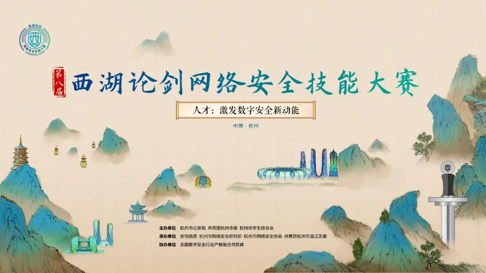
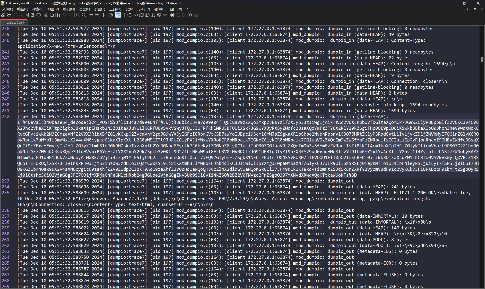
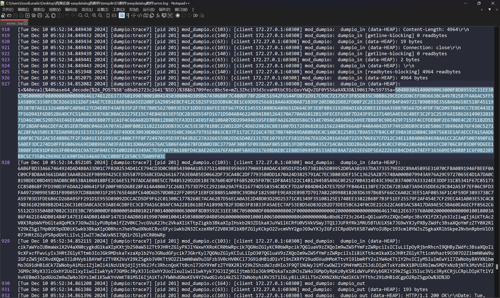
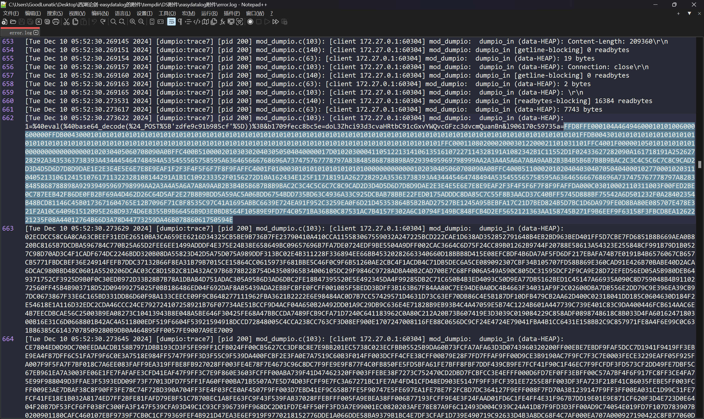
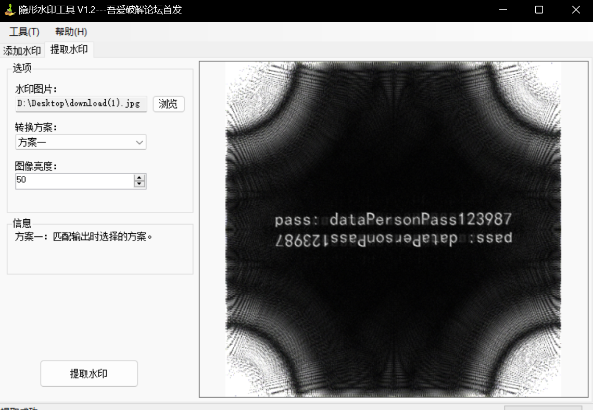
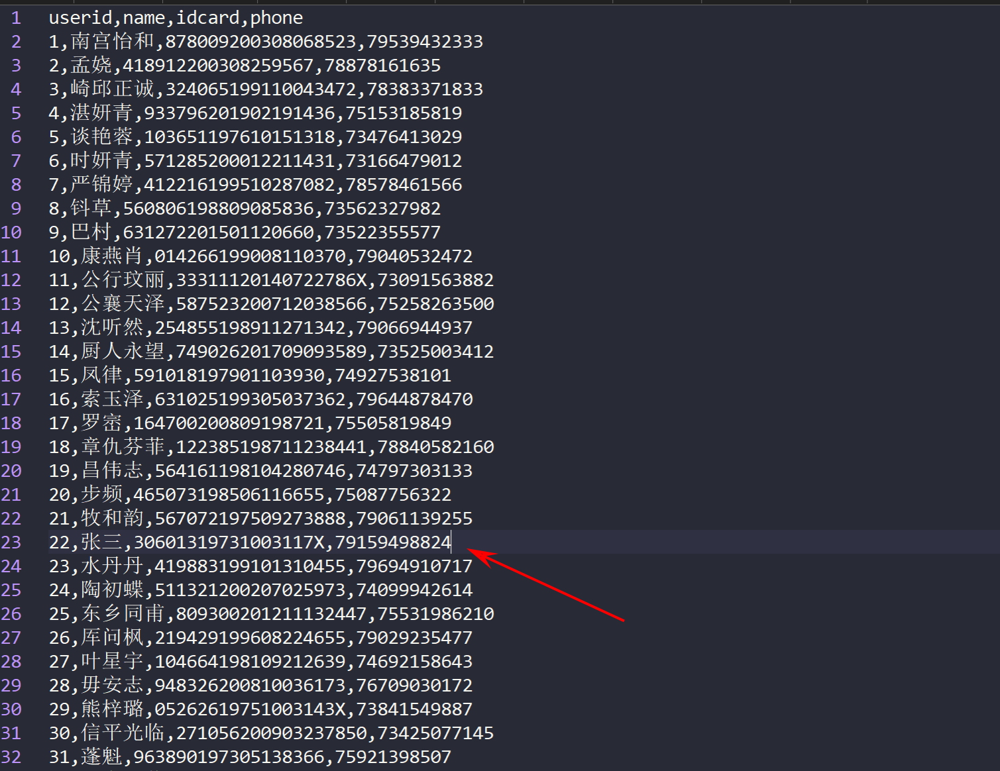

# 2025 第八届西湖论剑网络安全技能大赛 Misc Writeup

**周末抽时间看了看题，感觉今年西湖论剑的题也是比较有意思**
&lt;!--more--&gt;

|                 &lt;br&gt;&lt;br&gt;                 |
| :---------------------------------------------------------------------------: |
| **题目附件下载：https://pan.baidu.com/s/1vXVrxFeokGB4ETv9Bs7TAQ?pwd=nxaj 提取码: nxaj** |

## 题目名称 easydatalog

&gt; 题面信息如下：
&gt; 请你对附件中的日志文件进行分析，找出“张三”的身份证号和手机号，譬如其身份证号是119795199308186673，手机号是73628276413，则提交的flag为“119795199308186673_73628276413”。

题目附件给了 access.log 和 error.log 两个日志文件

简单翻看后，我们重点关注error.log，发现传了一个蚁剑的PHP Webshell

继续翻看日志文件，可以发现出题人传了一个压缩包还有一个JPG图片

由于是分段传输，因此我们手动删除每段间的无效数据，把这两个文件提取出来

发现压缩包是加密的，里面有个data.csv，因此猜测需要从那张JPG图片中得到解压密码

经过尝试，发现JPG图片是盲水印隐写，直接用工具提取即可

使用得到的密码解压压缩包即可得到张三的信息，即flag：`DASCTF{30601319731003117X_79159498824}`

## 题目名称 糟糕的磁盘

## 题目名称 DSASignatureData

&gt; 题面信息如下：
&gt; 请你对附件中的流量文件进行分析，在该流量里有一些个人信息数据。附件中还有一份个人信息的签名数据 data-sign.csv（其中签名算法采用 DSA，哈希算法采用 SHA256）和一组公钥文件（位于 public 文件夹中，文件名格式为 public-XXXX.pem，其中 XXXX 为 userid 左侧补零至四位数，即个人用户对应的公钥文件）。由于数据可能在传输过程中被篡改过，因此需要你进行签名验证，验证数据是否被篡改。找出被篡改过的个人信息数据并保存到新的 csv 文件中（文件编码 utf-8，文件格式和 data.csv 保持一致），并将该文件上传至该题的校验平台（在该校验平台里可以下载该题的示例文件 example.csv，可作为该题的格式参考），校验达标即可拿到 flag。

## 题面名称 easyrawencode

## 题目名称 CSCS

---

> Author: [Lunatic](https://goodlunatic.github.io)  
> URL: https://goodlunatic.github.io/posts/f002407/  

