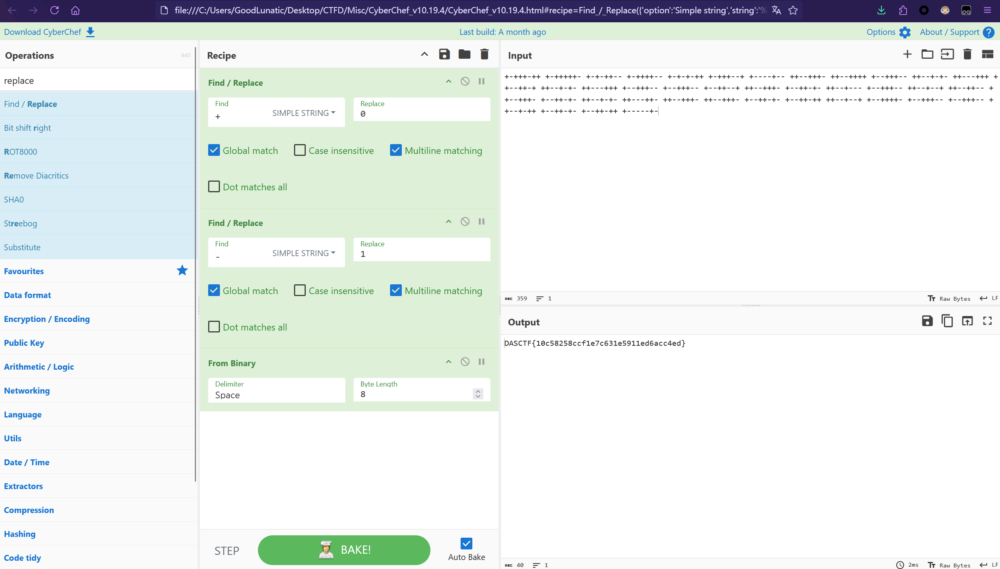
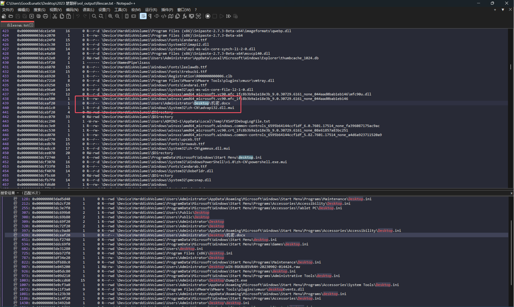
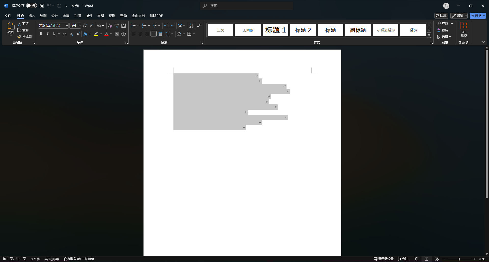
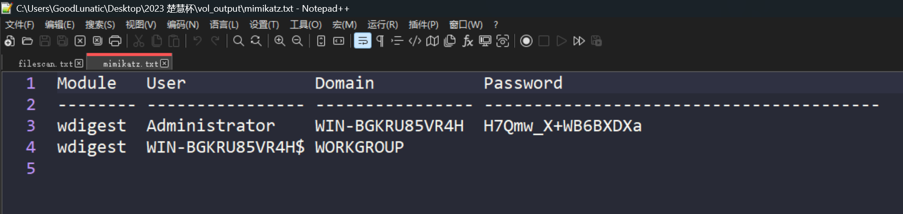
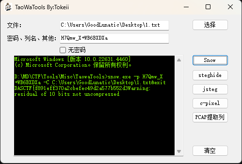
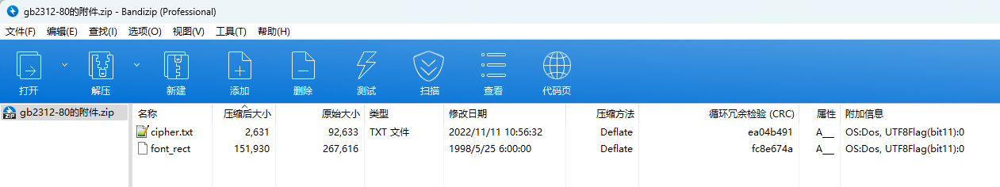
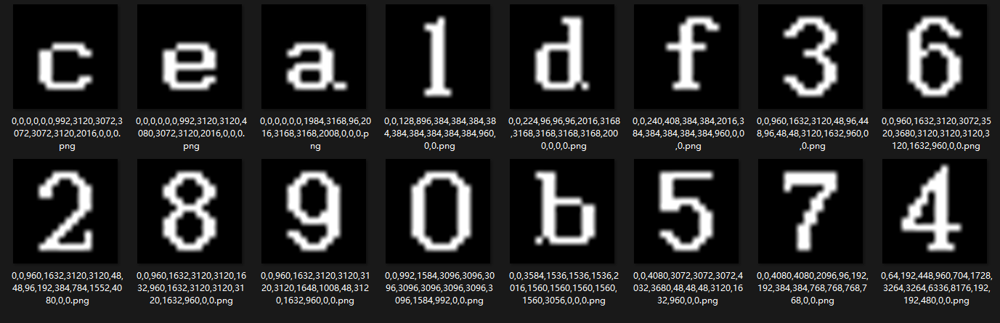
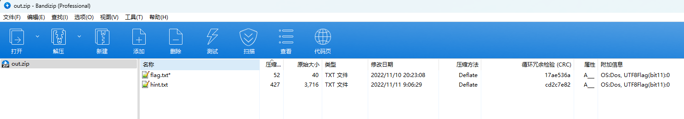
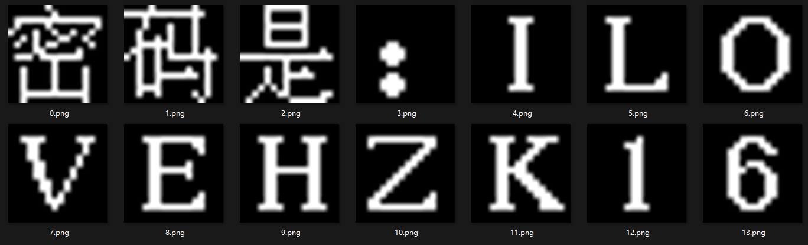

# 2023 楚慧杯网络空间安全实践能力竞赛 Misc Writeup

**2023 楚慧杯网络空间安全实践能力竞赛 Misc Writeup**
<!--more-->

> 本文中涉及的具体题目附件可以进我的交流群获取，进群详见 [About](https://goodlunatic.github.io/about/)

## 题目名称 ez_zip

解压附件得到一个`4096.zip`，打开发现有一个`4095.zip`，因此猜测是压缩包套娃

直接写个Python脚本解套即可

```python
import zipfile
import os

def decompress_zip(archive_file):
    with zipfile.ZipFile(archive_file, 'r') as zip_ref:
        zip_ref.extractall(path="tmp/")
        os.remove(archive_file)
        os.system("mv tmp/* .")
        os.rmdir("tmp")


if __name__ == "__main__":
    for i in range(4096,0,-1):
        filename = f"{i}.zip"
        decompress_zip(filename)
        print(f"[+] {filename} 解压成功 =======>")
```

全部解压完后可以得到一个`1.txt`，内容如下

> +-+++-++ +-+++++- +-+-++-- +-++++-- +-+-+-++ +-+++--+ +----+-- ++--+++- ++--++++ +--+++-- ++--+-+- ++---+++ ++--++-+ ++--+-+- ++---+++ +--+++-- +--+++-- +--++--+ ++--+++- +--++-+- ++--+--- +--+++-- ++--+--+ ++--++-- ++--+++- +--++-+- ++--+-+- ++---++- ++--+++- ++--+++- +--++-+- +--++-++ ++--+--+ +--++++- +--+++-- +--+++-- ++--+-++ +--++-+- +--++-++ +-----+-

直接CyberChef转二进制，然后转字符串即可得到flag：`DASCTF{10c58258ccf1e7c631e5911ed6acc4ed}`



## 题目名称 easy取证

下载附件并解压，得到一个`mem.raw`内存镜像，直接使用vol2进行内存取证

在桌面上可以找到一个`机密.docx`，尝试导出



导出后打开，发现是一个只有空白字符的文档，猜测是`SNOW`隐写



把所有空白字符复制到`TXT`文件中，尝试直接使用无密码的SNOW解密，但是发现得不到有效信息

用`mimikatz`插件可以提取出用户名和密码



使用得到的密码`H7Qmw_X+WB6BXDXa`解密`SNOW`隐写即可得到flag：`DASCTF{f891eff370a2cbefec49d2a577b552d3}`



## 题目名称 gb2312-80

下载附件并解压，可以得到如下内容



`cipher.txt`中的内容如下，每行十六个元素

```
0,0,4080,3072,3072,3072,4032,3680,48,48,48,3120,1632,960,0,0
0,0,992,1584,3096,3096,3096,3096,3096,3096,3096,3096,1584,992,0,0
0,64,192,448,960,704,1728,3264,3264,6336,8176,192,192,480,0,0
0,0,3584,1536,1536,1536,2016,1560,1560,1560,1560,1560,3056,0,0,0
0,0,992,1584,3096,3096,3096,3096,3096,3096,3096,3096,1584,992,0,0
0,0,960,1632,3120,48,96,448,96,48,48,3120,1632,960,0,0
0,0,992,1584,3096,3096,3096,3096,3096,3096,3096,3096,1584,992,0,0
0,64,192,448,960,704,1728,3264,3264,6336,8176,192,192,480,0,0
0,0,128,896,384,384,384,384,384,384,384,384,384,960,0,0
0,64,192,448,960,704,1728,3264,3264,6336,8176,192,192,480,0,0
0,0,992,1584,3096,3096,3096,3096,3096,3096,3096,3096,1584,992,0,0
0,0,992,1584,3096,3096,3096,3096,3096,3096,3096,3096,1584,992,0,0
0,0,992,1584,3096,3096,3096,3096,3096,3096,3096,3096,1584,992,0,0
0,0,960,1632,3120,3120,3120,3120,1648,1008,48,3120,1632,960,0,0
0,0,992,1584,3096,3096,3096,3096,3096,3096,3096,3096,1584,992,0,0
0,0,992,1584,3096,3096,3096,3096,3096,3096,3096,3096,1584,992,0,0
0,0,992,1584,3096,3096,3096,3096,3096,3096,3096,3096,1584,992,0,0
0,0,960,1632,3120,3120,1632,960,1632,3120,3120,3120,1632,960,0,0
0,0,992,1584,3096,3096,3096,3096,3096,3096,3096,3096,1584,992,0,0
0,0,992,1584,3096,3096,3096,3096,3096,3096,3096,3096,1584,992,0,0
```

然后去网上搜索`font_rect`，可以找到[这个项目](https://github.com/pengfexue2/printPlay/blob/master/printPlay.py)，发现是画点阵图的项目，并且图片大小是16x16的

正好与附件所给的数据格式相符，因此我们尝试写一个脚本画一下点阵图

```python
def draw2pic1():
    with open("cipher.txt","r") as f:
        data = f.read()
    row_list = data.split()
    for row in row_list:
        pixel_data = []
        img = Image.new(mode="RGB",size=(16,16))
        data = row.split(',')
        for item in data:
            bin_line = bin(int(item))[2:].rjust(16,'0')
            # print(bin_line)
            for bin_data in bin_line:                
                if bin_data != '0':
                    pixel_data.append((255,255,255))
                else:
                    pixel_data.append((0,0,0))
        img.putdata(pixel_data)
        img = img.resize((250,250)) # 调整一下图片大小，便于查看
        img.save(f"./out/{row}.png")
```

画完后发现一共就16种图像，因此猜测是十六进制的数据



我们根据上面的图片找出对应的表，然后提取出十六进制的数据，查看头几个数据就可以发现是个压缩包

因此我们编写以下脚本把压缩包提取出来

```python
def extract_data():
    table = {
    '0,0,992,1584,3096,3096,3096,3096,3096,3096,3096,3096,1584,992,0,0': '0',
    '0,0,128,896,384,384,384,384,384,384,384,384,384,960,0,0': '1',
    '0,0,960,1632,3120,3120,48,48,96,192,384,784,1552,4080,0,0': '2',
    '0,0,960,1632,3120,48,96,448,96,48,48,3120,1632,960,0,0': '3',
    '0,64,192,448,960,704,1728,3264,3264,6336,8176,192,192,480,0,0': '4',
    '0,0,4080,3072,3072,3072,4032,3680,48,48,48,3120,1632,960,0,0': '5',
    '0,0,960,1632,3120,3072,3520,3680,3120,3120,3120,3120,1632,960,0,0': '6',
    '0,0,4080,4080,2096,96,192,192,384,384,768,768,768,768,0,0': '7',
    '0,0,960,1632,3120,3120,1632,960,1632,3120,3120,3120,1632,960,0,0': '8',
    '0,0,960,1632,3120,3120,3120,3120,1648,1008,48,3120,1632,960,0,0': '9',
    '0,0,0,0,0,0,1984,3168,96,2016,3168,3168,2008,0,0,0': 'a',
    '0,0,3584,1536,1536,1536,2016,1560,1560,1560,1560,1560,3056,0,0,0': 'b',
    '0,0,0,0,0,0,992,3120,3072,3072,3072,3120,2016,0,0,0': 'c',
    '0,0,224,96,96,96,2016,3168,3168,3168,3168,3168,2000,0,0,0': 'd',
    '0,0,0,0,0,0,992,3120,3120,4080,3072,3120,2016,0,0,0': 'e',
    '0,0,240,408,384,384,2016,384,384,384,384,384,960,0,0,0': 'f'
    }
    hex_data = ''
    with open("cipher.txt","r") as f:
        data = f.read()
    row_list = data.split()
    for row in row_list:
        hex_data += table[row]
    zip_data = bytes.fromhex(hex_data)
    with open("out.zip","wb") as f:
        f.write(zip_data)
```

压缩包中有以下两个文件



`flag.txt`需要密码才能解压，`hint.txt`的内容如下

```
想必你已经领悟了HZK16的真谛了，请你破解最后的点阵！

0000001000000000000000010000000001111111111111100100001000000010100010010010010000101000110010000100101100000100000011000001000001110111111100000000000100000000001000010000100000100001000010000010000100001000001000010000100000111111111110000010000000001000

0000100000010000111111111111100000010000000100000001000100010000001000010001000000100101000100000011111100010000011001010001010010100101111111100010010000000100001001000010010000100111111101000010010000000100001111000000010000100100000101000000000000001000

0000111111100000000010000010000000001000001000000000111111100000000010000010000000001000001000000000111111100000000000000000010011111111111111100000000100000000000010010010000000001001111100000000100100000000000101010000000000100011000001100100000011111100

0000000000000000000000000000000000000000000000000000000000000000000000000000000000000000000000000000011000000000000011110000000000001111000000000000011000000000000000000000000000000110000000000000111100000000000011110000000000000110000000000000000000000000

0000000000000000000000000000000000000011110000000000000110000000000000011000000000000001100000000000000110000000000000011000000000000001100000000000000110000000000000011000000000000001100000000000000110000000000000111100000000000000000000000000000000000000

0000000000000000000000000000000000011110000000000000110000000000000011000000000000001100000000000000110000000000000011000000000000001100000000000000110000000000000011000000000000001100000010000000110000011000000111111111100000000000000000000000000000000000

0000000000000000000000000000000000000011111000000000011000110000000011000001100000011000000011000001100000001100000110000000110000011000000011000001100000001100000110000000110000001100000110000000011000110000000000111110000000000000000000000000000000000000

0000000000000000000000000000000000111100000111000001100000001000000110000000100000011000000100000000110000010000000011000010000000001100001000000000011001000000000001100100000000000010100000000000001110000000000000010000000000000000000000000000000000000000

0000000000000000000000000000000000011111111110000000110000011000000011000000100000001100000000000000110000100000000011111110000000001100001000000000110000000000000011000000000000001100000010000000110000011000000111111111100000000000000000000000000000000000

0000000000000000000000000000000000011110001111000000110000011000000011000001100000001100000110000000110000011000000011111111100000001100000110000000110000011000000011000001100000001100000110000000110000011000000111100011110000000000000000000000000000000000

0000000000000000000000000000000000111111111110000010000000011000000000000011000000000000011000000000000011000000000000011000000000000011000000000000011000000000000011000000000000011000000010000011000000011000001111111111100000000000000000000000000000000000

0000000000000000000000000000000000011110011111000000110000110000000011000110000000001100110000000000110110000000000011111000000000001101110000000000110011100000000011000111000000001100001110000000110000011100000111100001111000000000000000000000000000000000

0000000000000000000000000000000000000000100000000000001110000000000000011000000000000001100000000000000110000000000000011000000000000001100000000000000110000000000000011000000000000001100000000000000110000000000000111100000000000000000000000000000000000000

0000000000000000000000000000000000000011110000000000011001100000000011000011000000001100000000000000110111000000000011100110000000001100001100000000110000110000000011000011000000001100001100000000011001100000000000111100000000000000000000000000000000000000

```

猜测和上面一样，需要画点阵图，因此我们编写以下脚本画一下点阵图

```python
def draw2pic2():
    with open("hint.txt","r") as f:
        data = f.read()
    row_list = data.split()
    for idx,row in enumerate(row_list):
        # print(row)
        pixel_data = []
        img = Image.new(mode="RGB",size=(16,16))
        for bin_data in row:                
            if bin_data != '0':
                pixel_data.append((255,255,255))
            else:
                pixel_data.append((0,0,0))
        img.putdata(pixel_data)
        img = img.resize((250,250)) # 调整一下图片大小，便于查看
        # img.show()
        img.save(f"./out1/{idx}.png") 
```

画完后即可得到解压密码：`ILOVEHZK16`



使用得到的密码解压压缩包即可得到flag：`DASCTF{842a99305a07e6183830582d1740c1b1}`

完整解题脚本如下：

```python
from PIL import Image

def draw2pic1():
    with open("cipher.txt","r") as f:
        data = f.read()
    row_list = data.split()
    for row in row_list:
        pixel_data = []
        img = Image.new(mode="RGB",size=(16,16))
        data = row.split(',')
        for item in data:
            bin_line = bin(int(item))[2:].rjust(16,'0')
            # print(bin_line)
            for bin_data in bin_line:                
                if bin_data != '0':
                    pixel_data.append((255,255,255))
                else:
                    pixel_data.append((0,0,0))
        img.putdata(pixel_data)
        img = img.resize((250,250)) # 调整一下图片大小，便于查看
        img.save(f"./out/{row}.png")
    
def extract_data():
    table = {
    '0,0,992,1584,3096,3096,3096,3096,3096,3096,3096,3096,1584,992,0,0': '0',
    '0,0,128,896,384,384,384,384,384,384,384,384,384,960,0,0': '1',
    '0,0,960,1632,3120,3120,48,48,96,192,384,784,1552,4080,0,0': '2',
    '0,0,960,1632,3120,48,96,448,96,48,48,3120,1632,960,0,0': '3',
    '0,64,192,448,960,704,1728,3264,3264,6336,8176,192,192,480,0,0': '4',
    '0,0,4080,3072,3072,3072,4032,3680,48,48,48,3120,1632,960,0,0': '5',
    '0,0,960,1632,3120,3072,3520,3680,3120,3120,3120,3120,1632,960,0,0': '6',
    '0,0,4080,4080,2096,96,192,192,384,384,768,768,768,768,0,0': '7',
    '0,0,960,1632,3120,3120,1632,960,1632,3120,3120,3120,1632,960,0,0': '8',
    '0,0,960,1632,3120,3120,3120,3120,1648,1008,48,3120,1632,960,0,0': '9',
    '0,0,0,0,0,0,1984,3168,96,2016,3168,3168,2008,0,0,0': 'a',
    '0,0,3584,1536,1536,1536,2016,1560,1560,1560,1560,1560,3056,0,0,0': 'b',
    '0,0,0,0,0,0,992,3120,3072,3072,3072,3120,2016,0,0,0': 'c',
    '0,0,224,96,96,96,2016,3168,3168,3168,3168,3168,2000,0,0,0': 'd',
    '0,0,0,0,0,0,992,3120,3120,4080,3072,3120,2016,0,0,0': 'e',
    '0,0,240,408,384,384,2016,384,384,384,384,384,960,0,0,0': 'f'
    }
    hex_data = ''
    with open("cipher.txt","r") as f:
        data = f.read()
    row_list = data.split()
    for row in row_list:
        hex_data += table[row]
    zip_data = bytes.fromhex(hex_data)
    with open("out.zip","wb") as f:
        f.write(zip_data)

def draw2pic2():
    with open("hint.txt","r") as f:
        data = f.read()
    row_list = data.split()
    for idx,row in enumerate(row_list):
        # print(row)
        pixel_data = []
        img = Image.new(mode="RGB",size=(16,16))
        for bin_data in row:                
            if bin_data != '0':
                pixel_data.append((255,255,255))
            else:
                pixel_data.append((0,0,0))
        img.putdata(pixel_data)
        img = img.resize((250,250)) # 调整一下图片大小，便于查看
        # img.show()
        img.save(f"./out1/{idx}.png") 
    
if __name__ == "__main__":
    # draw2pic1()
    # extract_data()
    # draw2pic2()
```

---

> 作者: [Lunatic](https://goodlunatic.github.io)  
> URL: https://goodlunatic.github.io/posts/fde34a9/  

